# JavaScript 功能

<cite>
**本文引用的文件**
- [main.js](file://source/js/main.js)
- [modern.js](file://source/js/modern.js)
- [main.js（主题）](file://themes/butterfly/source/js/main.js)
- [utils.js](file://themes/butterfly/source/js/utils.js)
- [local-search.js](file://themes/butterfly/source/js/search/local-search.js)
- [algolia.js](file://themes/butterfly/source/js/search/algolia.js)
- [init.js](file://themes/butterfly/scripts/events/init.js)
- [post_lazyload.js](file://themes/butterfly/scripts/filters/post_lazyload.js)
- [button.js](file://themes/butterfly/scripts/tag/button.js)
- [chartjs.js](file://themes/butterfly/scripts/tag/chartjs.js)
- [analytics.pug](file://themes/butterfly/layout/includes/head/analytics.pug)
</cite>

## 目录
1. [简介](#简介)
2. [项目结构](#项目结构)
3. [核心组件](#核心组件)
4. [架构总览](#架构总览)
5. [组件详解](#组件详解)
6. [依赖关系分析](#依赖关系分析)
7. [性能考量](#性能考量)
8. [故障排查指南](#故障排查指南)
9. [结论](#结论)
10. [附录](#附录)

## 简介
本文件面向博客系统的 JavaScript 功能，系统性梳理前端交互与动态效果实现，覆盖导航菜单、侧边栏、搜索、TOC 目录、图片灯箱、暗色模式切换、懒加载、平滑滚动、阅读进度条、数学公式渲染、第三方分析与社交集成、性能优化策略以及自定义脚本开发规范与调试技巧。文档以“从浅入深”的方式组织，既适合快速上手，也便于深入定制。

## 项目结构
博客主题采用 Hexo 主题结构，前端 JS 分布在源站与主题两套实现中：
- 源站脚本：source/js 下的 main.js、modern.js，侧重页面级交互与现代特性
- 主题脚本：themes/butterfly/source/js 下的 main.js、utils.js、search/*，提供更丰富的 UI/UX 能力（含搜索、动画、滚动、TOC、图片灯箱等）

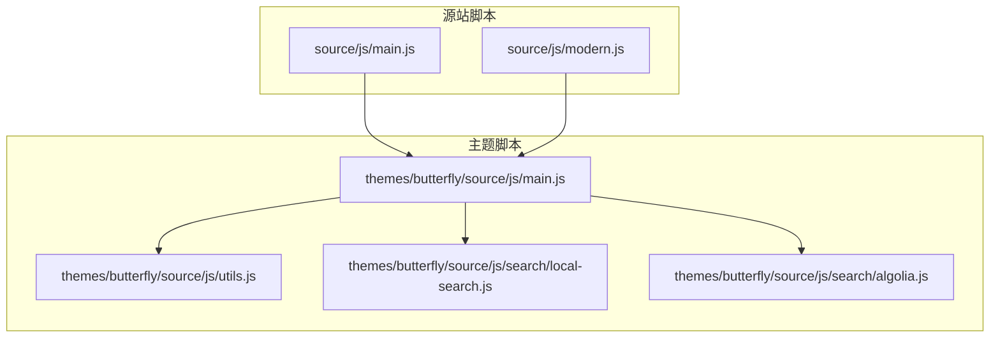

图表来源
- [main.js:1-337](file://source/js/main.js#L1-L337)
- [modern.js:1-406](file://source/js/modern.js#L1-L406)
- [main.js（主题）:1-988](file://themes/butterfly/source/js/main.js#L1-L988)
- [utils.js:1-339](file://themes/butterfly/source/js/utils.js#L1-L339)
- [local-search.js:1-568](file://themes/butterfly/source/js/search/local-search.js#L1-L568)
- [algolia.js:1-563](file://themes/butterfly/source/js/search/algolia.js#L1-L563)

章节来源
- [main.js:1-337](file://source/js/main.js#L1-L337)
- [modern.js:1-406](file://source/js/modern.js#L1-L406)
- [main.js（主题）:1-988](file://themes/butterfly/source/js/main.js#L1-L988)

## 核心组件
- 导航与侧边栏：移动端菜单切换、点击外部关闭、点击菜单项自动收起
- 滚动效果：导航吸顶、返回顶部、右侧滚动百分比、滚动节流/防抖
- 搜索：本地搜索与 Algolia 搜索，支持高亮、分页、快捷键、Esc 关闭
- TOC 目录：滚动时激活当前标题、平滑跳转、目录滚动居中
- 图片处理：懒加载、图片灯箱、代码块工具（复制、展开、全屏）
- 动画与过渡：进入视口触发卡片动画、阅读进度条
- 数学公式：MathJax 渲染配置与按需加载
- 第三方集成：百度统计、Google Analytics、Cloudflare Insights、Microsoft Clarity、Google Tag Manager
- 性能优化：懒加载、请求节流/防抖、IntersectionObserver、Pjax 兼容

章节来源
- [main.js:17-324](file://source/js/main.js#L17-L324)
- [modern.js:9-398](file://source/js/modern.js#L9-L398)
- [main.js（主题）:26-726](file://themes/butterfly/source/js/main.js#L26-L726)
- [utils.js:1-339](file://themes/butterfly/source/js/utils.js#L1-L339)
- [local-search.js:1-568](file://themes/butterfly/source/js/search/local-search.js#L1-L568)
- [algolia.js:1-563](file://themes/butterfly/source/js/search/algolia.js#L1-L563)

## 架构总览
整体交互由“页面入口模块”驱动，主题脚本负责复杂 UI 与第三方能力，工具库提供通用函数，搜索模块独立于主流程但通过事件与 DOM 协作。

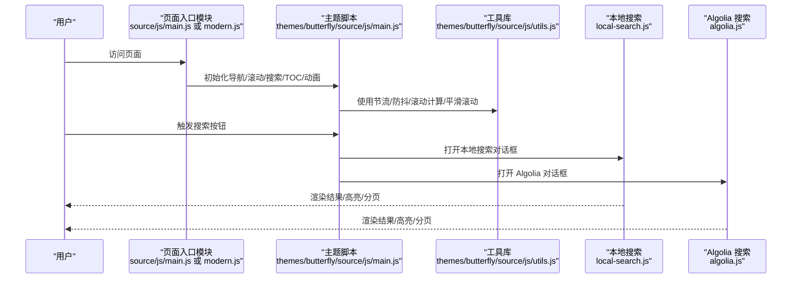

图表来源
- [main.js:4-15](file://source/js/main.js#L4-L15)
- [modern.js:12-23](file://source/js/modern.js#L12-L23)
- [main.js（主题）:518-624](file://themes/butterfly/source/js/main.js#L518-L624)
- [utils.js:17-142](file://themes/butterfly/source/js/utils.js#L17-L142)
- [local-search.js:237-567](file://themes/butterfly/source/js/search/local-search.js#L237-L567)
- [algolia.js:518-562](file://themes/butterfly/source/js/search/algolia.js#L518-L562)

## 组件详解

### 导航菜单与侧边栏
- 移动端菜单切换：绑定菜单按钮与菜单列表，点击按钮切换 active/show 类；点击外部区域或菜单项自动收起
- 侧边栏：打开时遮罩入场动画、锁定 body 滚动；关闭时移除样式与动画
- 顶部导航吸顶：滚动超过阈值添加固定类，离开阈值移除

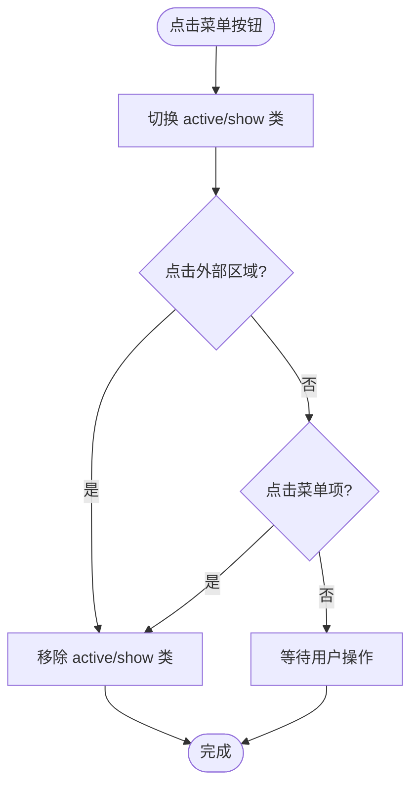

图表来源
- [main.js:17-46](file://source/js/main.js#L17-L46)
- [modern.js:99-126](file://source/js/modern.js#L99-L126)
- [main.js（主题）:26-39](file://themes/butterfly/source/js/main.js#L26-L39)

章节来源
- [main.js:17-46](file://source/js/main.js#L17-L46)
- [modern.js:99-126](file://source/js/modern.js#L99-L126)
- [main.js（主题）:26-39](file://themes/butterfly/source/js/main.js#L26-L39)

### 滚动效果与返回顶部
- 导航吸顶：使用 requestAnimationFrame 降低更新频率
- 返回顶部：滚动超过阈值显示，点击后平滑滚动至顶部
- 右侧滚动百分比：根据文档高度与窗口高度计算百分比，移动端显示

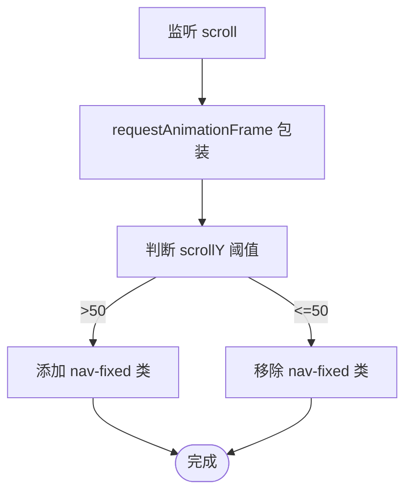

图表来源
- [modern.js:129-155](file://source/js/modern.js#L129-L155)
- [main.js（主题）:440-503](file://themes/butterfly/source/js/main.js#L440-L503)

章节来源
- [modern.js:129-181](file://source/js/modern.js#L129-L181)
- [main.js（主题）:440-503](file://themes/butterfly/source/js/main.js#L440-L503)

### 暗色模式切换
- 优先读取本地存储的主题；否则跟随系统 prefers-color-scheme
- 切换按钮：切换 data-theme，并持久化；监听系统主题变化自动同步（无本地记录时）

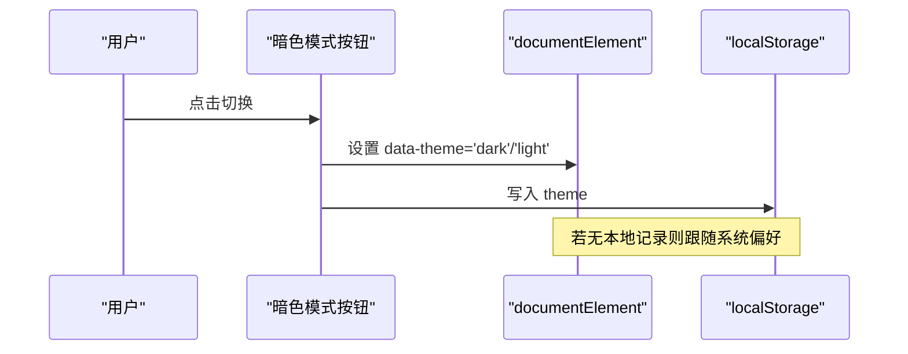

图表来源
- [main.js:76-120](file://source/js/main.js#L76-L120)
- [modern.js:26-60](file://source/js/modern.js#L26-L60)

章节来源
- [main.js:76-120](file://source/js/main.js#L76-L120)
- [modern.js:26-60](file://source/js/modern.js#L26-L60)

### 搜索功能
- 本地搜索：支持高亮关键词、分页、统计、URL 高亮回显；数据预加载可选
- Algolia 搜索：支持 v4/v5 客户端，高亮截断片段、分页、统计；输入防抖

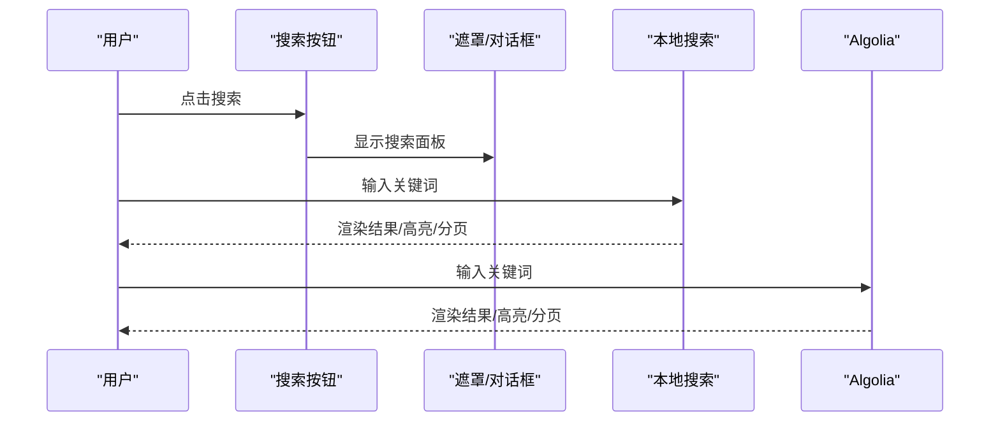

图表来源
- [local-search.js:237-567](file://themes/butterfly/source/js/search/local-search.js#L237-L567)
- [algolia.js:518-562](file://themes/butterfly/source/js/search/algolia.js#L518-L562)

章节来源
- [local-search.js:1-568](file://themes/butterfly/source/js/search/local-search.js#L1-L568)
- [algolia.js:1-563](file://themes/butterfly/source/js/search/algolia.js#L1-L563)

### TOC 目录与平滑滚动
- 滚动时根据标题位置更新激活状态，目录自动滚动居中
- 点击目录项平滑跳转至对应标题，考虑导航高度与偏移

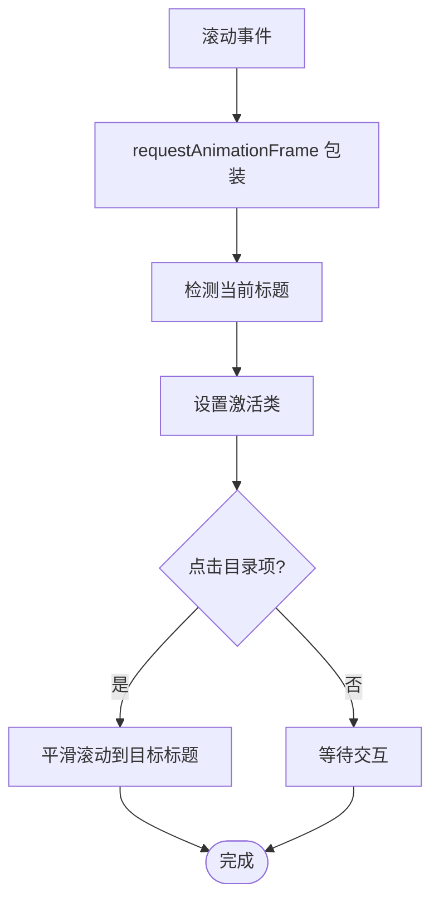

图表来源
- [main.js:185-229](file://source/js/main.js#L185-L229)
- [modern.js:246-299](file://source/js/modern.js#L246-L299)

章节来源
- [main.js:185-229](file://source/js/main.js#L185-L229)
- [modern.js:246-299](file://source/js/modern.js#L246-L299)

### 图片懒加载与灯箱
- 懒加载：IntersectionObserver 观察图片，进入视口后替换 src；不支持时降级为一次性加载
- 图片灯箱：点击图片创建覆盖层，支持 ESC 关闭、点击遮罩关闭、键盘控制

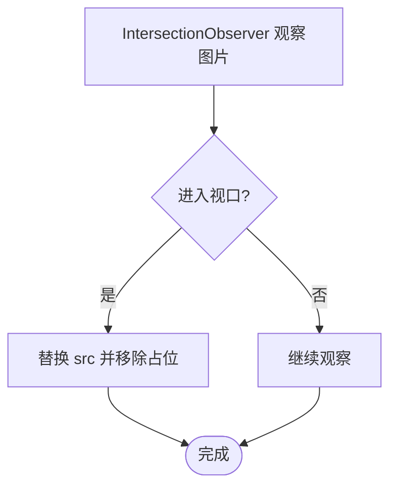

图表来源
- [main.js:231-259](file://source/js/main.js#L231-L259)
- [main.js（主题）:262-264](file://themes/butterfly/source/js/main.js#L262-L264)

章节来源
- [main.js:231-302](file://source/js/main.js#L231-L302)
- [main.js（主题）:262-264](file://themes/butterfly/source/js/main.js#L262-L264)

### 动画与阅读进度条
- 卡片动画：进入视口后恢复动画播放状态
- 阅读进度条：基于文档高度与窗口高度计算百分比，使用 requestAnimationFrame 平滑更新

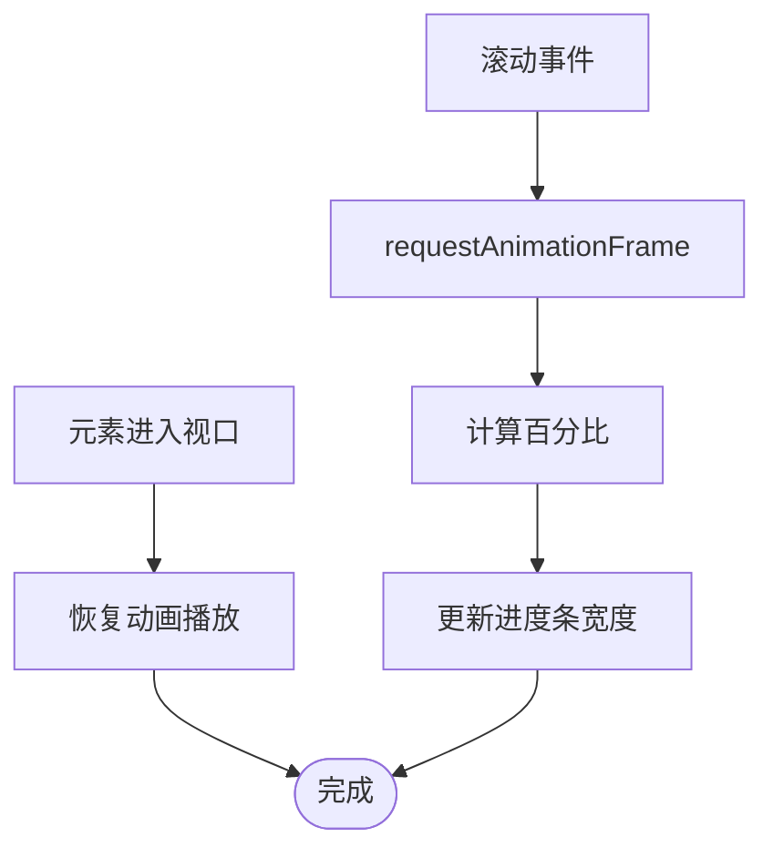

图表来源
- [main.js:304-324](file://source/js/main.js#L304-L324)
- [modern.js:301-372](file://source/js/modern.js#L301-L372)

章节来源
- [main.js:304-324](file://source/js/main.js#L304-L324)
- [modern.js:301-372](file://source/js/modern.js#L301-L372)

### 数学公式渲染（MathJax）
- 按需加载 MathJax，配置内联/块级公式、禁用菜单、SVG 字体缓存
- 仅在未存在全局实例时初始化

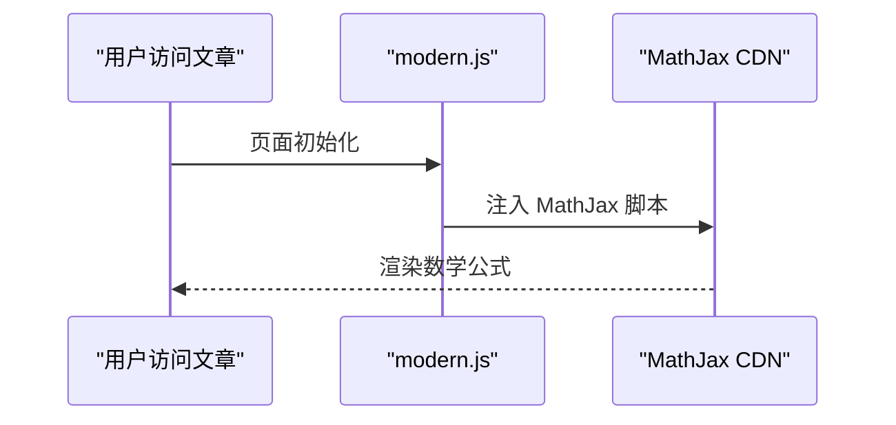

图表来源
- [modern.js:73-96](file://source/js/modern.js#L73-L96)

章节来源
- [modern.js:73-96](file://source/js/modern.js#L73-L96)

### 第三方服务集成
- 百度统计、Google Analytics、Cloudflare Insights、Microsoft Clarity、Google Tag Manager
- 支持 Pjax 页面切换后的事件上报

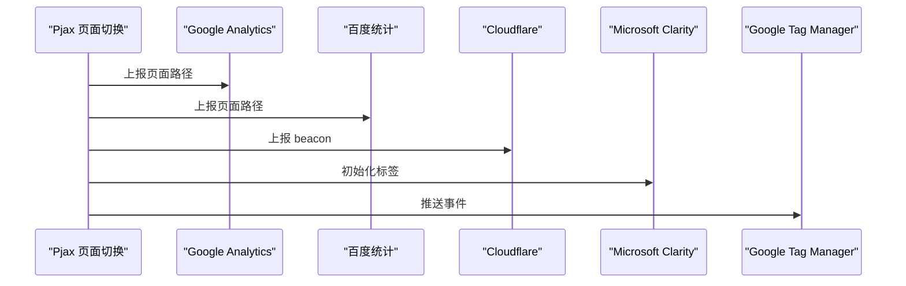

图表来源
- [analytics.pug:1-45](file://themes/butterfly/layout/includes/head/analytics.pug#L1-L45)

章节来源
- [analytics.pug:1-45](file://themes/butterfly/layout/includes/head/analytics.pug#L1-L45)

### 自定义脚本开发指南与最佳实践
- 命名空间与导出：将功能挂载到全局对象（如 window.HeoBlog 或 window.ModernBlog），避免冲突
- DOM 就绪：优先使用 DOMContentLoaded 后初始化，必要时延迟到主题脚本入口
- 事件解绑：使用工具库提供的 addEventListenerPjax，在 Pjax 发送前移除事件监听
- 性能优先：对高频事件（scroll、resize）使用 requestAnimationFrame、throttle/debounce 包装
- 可访问性：为交互元素提供键盘支持（如 ESC 关闭、快捷键）
- 可维护性：拆分模块、统一错误日志、提供开关与默认配置

章节来源
- [main.js:327-336](file://source/js/main.js#L327-L336)
- [modern.js:391-401](file://source/js/modern.js#L391-L401)
- [utils.js:303-318](file://themes/butterfly/source/js/utils.js#L303-L318)

## 依赖关系分析
- 页面入口模块依赖主题脚本与工具库
- 搜索模块与页面入口模块松耦合，通过 DOM 与事件协作
- 懒加载与图片灯箱依赖浏览器原生 API（IntersectionObserver、dataset、事件委托）
- 第三方分析脚本通过模板注入，运行期与页面交互解耦

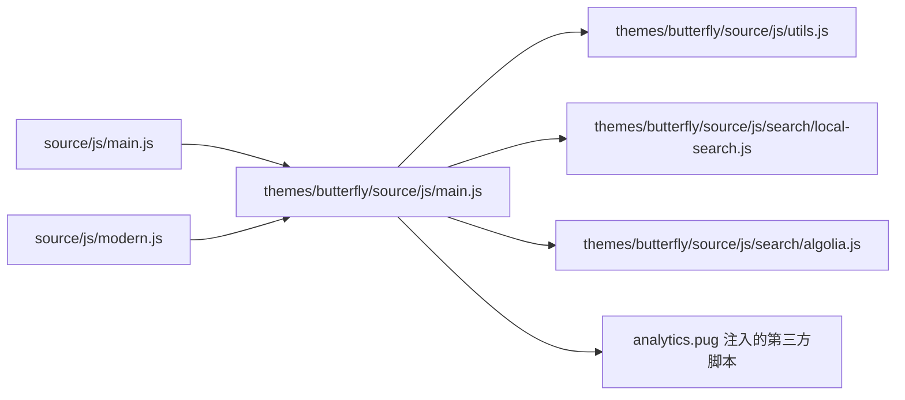

图表来源
- [main.js:1-337](file://source/js/main.js#L1-L337)
- [modern.js:1-406](file://source/js/modern.js#L1-L406)
- [main.js（主题）:1-988](file://themes/butterfly/source/js/main.js#L1-L988)
- [utils.js:1-339](file://themes/butterfly/source/js/utils.js#L1-L339)
- [local-search.js:1-568](file://themes/butterfly/source/js/search/local-search.js#L1-L568)
- [algolia.js:1-563](file://themes/butterfly/source/js/search/algolia.js#L1-L563)
- [analytics.pug:1-45](file://themes/butterfly/layout/includes/head/analytics.pug#L1-L45)

章节来源
- [main.js:1-337](file://source/js/main.js#L1-L337)
- [modern.js:1-406](file://source/js/modern.js#L1-L406)
- [main.js（主题）:1-988](file://themes/butterfly/source/js/main.js#L1-L988)
- [utils.js:1-339](file://themes/butterfly/source/js/utils.js#L1-L339)
- [local-search.js:1-568](file://themes/butterfly/source/js/search/local-search.js#L1-L568)
- [algolia.js:1-563](file://themes/butterfly/source/js/search/algolia.js#L1-L563)
- [analytics.pug:1-45](file://themes/butterfly/layout/includes/head/analytics.pug#L1-L45)

## 性能考量
- 懒加载：使用 IntersectionObserver，减少首屏资源压力
- 代码分割：按需加载搜索与 MathJax，避免阻塞主线程
- 缓存机制：本地存储主题状态、搜索数据库预加载
- 资源压缩：构建阶段进行压缩与合并（由 Hexo/主题构建流程负责）
- 事件优化：滚动/缩放使用 requestAnimationFrame 与节流，降低重排与重绘
- Pjax 兼容：事件解绑与 DOM 复用，提升页面切换体验

章节来源
- [post_lazyload.js:1-41](file://themes/butterfly/scripts/filters/post_lazyload.js#L1-L41)
- [main.js:231-259](file://source/js/main.js#L231-L259)
- [modern.js:73-96](file://source/js/modern.js#L73-L96)
- [utils.js:3-46](file://themes/butterfly/source/js/utils.js#L3-L46)

## 故障排查指南
- 搜索无结果或空白
  - 检查搜索数据生成与路径配置（本地搜索 path、Algolia appId/apiKey/indexName）
  - 确认预加载开关与 DOM 结构匹配
- 滚动吸顶不生效
  - 检查导航容器 ID 与样式类名；确认 requestAnimationFrame 是否被频繁调用
- 暗色模式不同步
  - 检查 localStorage 中 theme 值；确认系统主题监听是否生效
- 图片未懒加载
  - 确认图片是否带有 data-src；浏览器是否支持 IntersectionObserver
- 阅读进度条异常
  - 检查文档高度与窗口高度计算逻辑；确保 RAF 更新频率合理
- 第三方统计未上报
  - 检查模板注入的 ID/Token；确认 Pjax 页面切换事件是否触发

章节来源
- [local-search.js:173-197](file://themes/butterfly/source/js/search/local-search.js#L173-L197)
- [algolia.js:218-232](file://themes/butterfly/source/js/search/algolia.js#L218-L232)
- [modern.js:129-155](file://source/js/modern.js#L129-L155)
- [main.js:76-120](file://source/js/main.js#L76-L120)
- [main.js:231-259](file://source/js/main.js#L231-L259)
- [modern.js:335-372](file://source/js/modern.js#L335-L372)
- [analytics.pug:1-45](file://themes/butterfly/layout/includes/head/analytics.pug#L1-L45)

## 结论
该博客系统的 JavaScript 功能以模块化与可扩展为核心设计原则，结合现代浏览器能力与主题脚本生态，提供了完整的前端交互与动态效果方案。通过合理的性能策略与第三方集成，既能保证用户体验，也能满足个性化定制需求。建议在二次开发中遵循命名空间、事件解绑、性能优先与可访问性原则，持续优化交互细节与加载体验。

## 附录
- 自定义标签示例
  - 按钮标签：支持颜色、外观、尺寸等选项
  - 图表标签：支持并排布局、宽度、描述 Markdown 渲染

章节来源
- [button.js:1-22](file://themes/butterfly/scripts/tag/button.js#L1-L22)
- [chartjs.js:1-50](file://themes/butterfly/scripts/tag/chartjs.js#L1-L50)