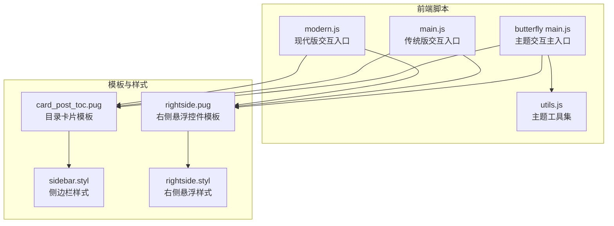
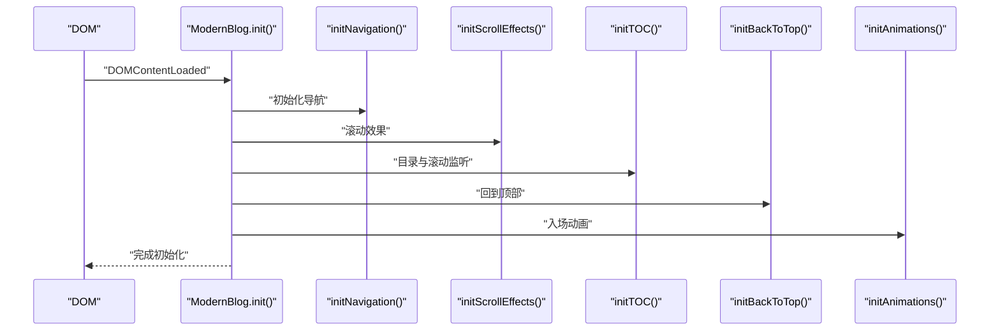
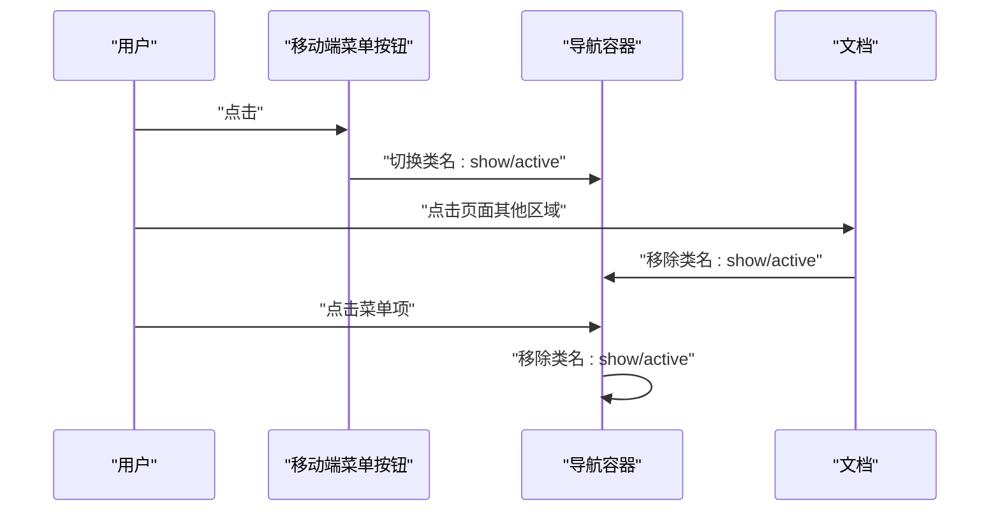
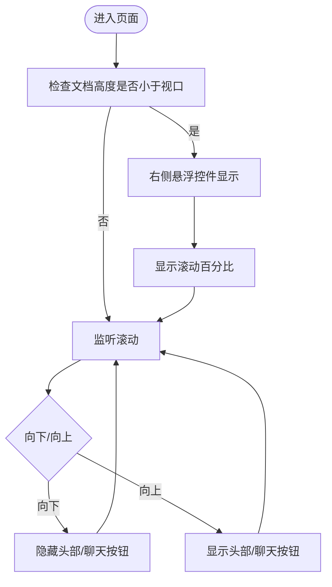
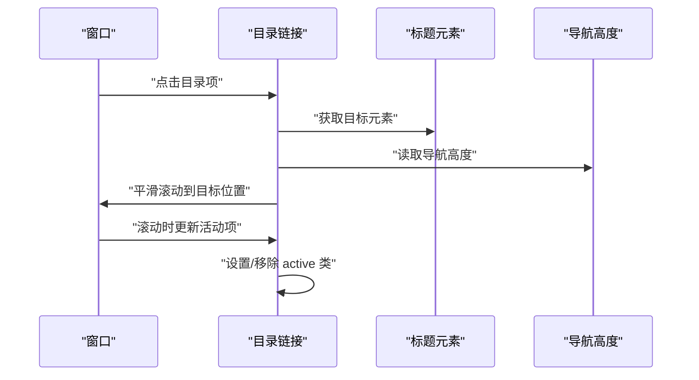
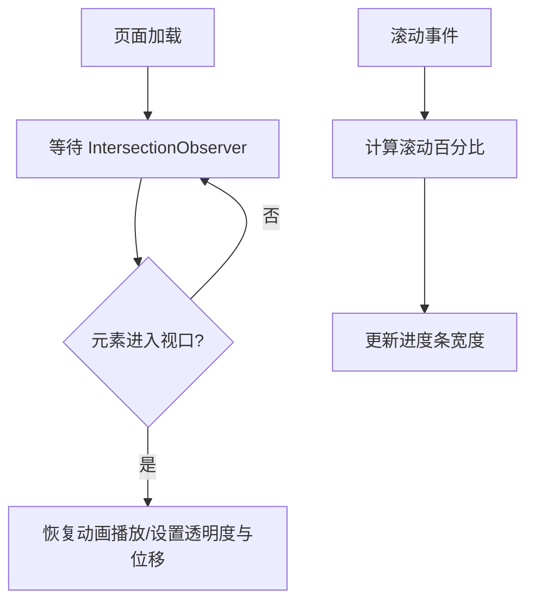
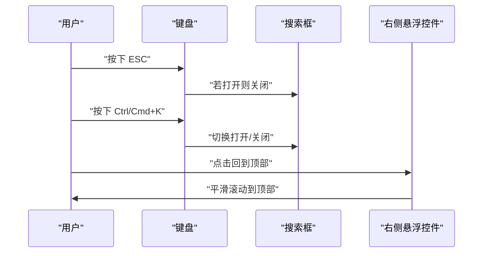
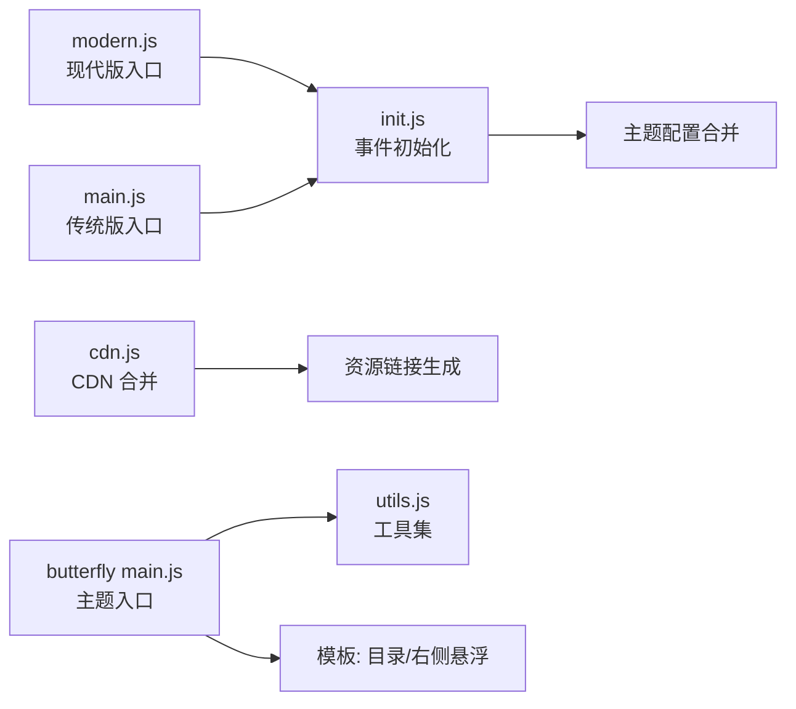

# 交互功能

<cite>
**本文引用的文件**
- [main.js（现代版）](file://source/js/modern.js)
- [main.js（传统版）](file://source/js/main.js)
- [main.js（Butterfly 主题）](file://themes/butterfly/source/js/main.js)
- [utils.js（Butterfly 主题工具集）](file://themes/butterfly/source/js/utils.js)
- [sidebar.styl（侧边栏样式）](file://themes/butterfly/source/css/_layout/sidebar.styl)
- [rightside.styl（右侧悬浮控件样式）](file://themes/butterfly/source/css/_layout/rightside.styl)
- [card_post_toc.pug（文章目录卡片模板）](file://themes/butterfly/layout/includes/widget/card_post_toc.pug)
- [rightside.pug（右侧悬浮控件模板）](file://themes/butterfly/layout/includes/rightside.pug)
- [init.js（事件初始化）](file://themes/butterfly/scripts/events/init.js)
- [cdn.js（CDN 合并）](file://themes/butterfly/scripts/events/cdn.js)
</cite>

## 目录
1. [简介](#简介)
2. [项目结构](#项目结构)
3. [核心组件](#核心组件)
4. [架构总览](#架构总览)
5. [详细组件分析](#详细组件分析)
6. [依赖关系分析](#依赖关系分析)
7. [性能考量](#性能考量)
8. [故障排查指南](#故障排查指南)
9. [结论](#结论)
10. [附录](#附录)

## 简介
本文件聚焦博客系统的交互功能，围绕导航菜单、侧边栏与右侧悬浮控件、目录与滚动监听、平滑滚动与页面过渡动画、以及用户事件处理（点击、键盘、触摸）进行系统化技术说明，并提供可扩展的自定义开发指南与调试建议。

## 项目结构
- 前端脚本分层：
  - 现代版：统一入口模块化封装，集中初始化主题、导航、滚动、回到顶部、搜索、目录、动画与阅读进度。
  - 传统版：按功能拆分初始化函数，便于按需启用。
  - Butterfly 主题：提供更丰富的交互能力（代码高亮工具、图片灯箱、无限画廊、右侧悬浮控件、滚动方向检测等），并以工具集封装常用交互行为。
- 样式层：
  - 侧边栏与右侧悬浮控件通过 Stylus 编写，支持响应式与过渡动画。
- 模板层：
  - 目录卡片与右侧悬浮控件由 Pug 模板生成，控制展示条件与默认状态。

**图表来源**
- [main.js（现代版）:12-23](file://source/js/modern.js#L12-L23)
- [main.js（传统版）:4-15](file://source/js/main.js#L4-L15)
- [main.js（Butterfly 主题）:1-23](file://themes/butterfly/source/js/main.js#L1-L23)
- [utils.js（Butterfly 主题工具集）:1-15](file://themes/butterfly/source/js/utils.js#L1-L15)
- [card_post_toc.pug（文章目录卡片模板）:1-15](file://themes/butterfly/layout/includes/widget/card_post_toc.pug#L1-L15)
- [rightside.pug（右侧悬浮控件模板）:1-54](file://themes/butterfly/layout/includes/rightside.pug#L1-L54)
- [sidebar.styl（侧边栏样式）:1-97](file://themes/butterfly/source/css/_layout/sidebar.styl#L1-L97)
- [rightside.styl（右侧悬浮样式）:1-109](file://themes/butterfly/source/css/_layout/rightside.styl#L1-L109)

**章节来源**
- [main.js（现代版）:12-23](file://source/js/modern.js#L12-L23)
- [main.js（传统版）:4-15](file://source/js/main.js#L4-L15)
- [main.js（Butterfly 主题）:1-23](file://themes/butterfly/source/js/main.js#L1-L23)
- [card_post_toc.pug（文章目录卡片模板）:1-15](file://themes/butterfly/layout/includes/widget/card_post_toc.pug#L1-L15)
- [rightside.pug（右侧悬浮控件模板）:1-54](file://themes/butterfly/layout/includes/rightside.pug#L1-L54)
- [sidebar.styl（侧边栏样式）:1-97](file://themes/butterfly/source/css/_layout/sidebar.styl#L1-L97)
- [rightside.styl（右侧悬浮样式）:1-109](file://themes/butterfly/source/css/_layout/rightside.styl#L1-L109)

## 核心组件
- 导航菜单与移动端响应式
  - 现代版：移动端菜单切换、点击外部关闭、点击菜单项自动收起。
  - 传统版：同上，但通过类名切换实现显示/隐藏。
  - Butterfly 主题：菜单宽度自适应、移动端目录按钮、侧边栏菜单展开/收起、滚动方向控制头部显隐。
- 侧边栏与右侧悬浮控件
  - 侧边栏：遮罩层、菜单组展开/收起、子菜单过渡动画。
  - 右侧悬浮控件：回到顶部、阅读模式、深浅色切换、隐藏侧边栏、移动端目录、聊天入口等。
- 目录与滚动监听
  - 目录高亮联动、点击平滑跳转、移动端 TOC 弹层。
- 动画与过渡
  - IntersectionObserver 触发的文章卡片入场动画、滚动进度条、平滑滚动回弹。
- 用户事件处理
  - 点击、键盘（ESC、Ctrl/Cmd+K）、触摸（滚动节流/防抖）。

**章节来源**
- [main.js（现代版）:98-126](file://source/js/modern.js#L98-L126)
- [main.js（传统版）:17-46](file://source/js/main.js#L17-L46)
- [main.js（Butterfly 主题）:26-741](file://themes/butterfly/source/js/main.js#L26-L741)
- [utils.js（Butterfly 主题工具集）:17-46](file://themes/butterfly/source/js/utils.js#L17-L46)
- [sidebar.styl（侧边栏样式）:10-97](file://themes/butterfly/source/css/_layout/sidebar.styl#L10-L97)
- [rightside.styl（右侧悬浮样式）:1-109](file://themes/butterfly/source/css/_layout/rightside.styl#L1-L109)

## 架构总览
现代版与传统版均采用“初始化器”模式，分别在 DOMContentLoaded 后执行各自的功能初始化；Butterfly 主题在入口中组合了更复杂的交互与工具集。

**图表来源**
- [main.js（现代版）:12-23](file://source/js/modern.js#L12-L23)
- [main.js（现代版）:98-155](file://source/js/modern.js#L98-L155)
- [main.js（现代版）:245-299](file://source/js/modern.js#L245-L299)
- [main.js（现代版）:157-181](file://source/js/modern.js#L157-L181)
- [main.js（现代版）:301-333](file://source/js/modern.js#L301-L333)

## 详细组件分析

### 导航菜单与移动端响应式
- 现代版
  - 移动端菜单切换：绑定点击事件切换类名，实现显示/隐藏。
  - 点击外部关闭：监听文档级点击，若点击目标不在导航容器内则收起菜单。
  - 菜单项点击：点击后自动收起菜单，避免状态残留。
- 传统版
  - 类似现代版，但通过类名 toggle 实现，逻辑一致。
- Butterfly 主题
  - 菜单宽度自适应：根据标题与菜单宽度动态隐藏/显示菜单。
  - 侧边栏菜单展开/收起：打开时锁定 body 滚动，遮罩层动画过渡。
  - 移动端目录按钮：弹出 TOC 面板，支持从右向左展开。

**图表来源**
- [main.js（现代版）:98-126](file://source/js/modern.js#L98-L126)
- [main.js（传统版）:17-46](file://source/js/main.js#L17-L46)
- [main.js（Butterfly 主题）:26-741](file://themes/butterfly/source/js/main.js#L26-L741)

**章节来源**
- [main.js（现代版）:98-126](file://source/js/modern.js#L98-L126)
- [main.js（传统版）:17-46](file://source/js/main.js#L17-L46)
- [main.js（Butterfly 主题）:26-741](file://themes/butterfly/source/js/main.js#L26-L741)

### 侧边栏与右侧悬浮控件
- 侧边栏
  - 遮罩层与菜单面板：固定定位、右侧滑入、过渡动画。
  - 菜单组展开/收起：父级类名切换带动子列表高度、透明度与缩放过渡。
- 右侧悬浮控件
  - 显示/隐藏：滚动超过阈值显示，否则隐藏。
  - 功能按钮：回到顶部、阅读模式、深浅色切换、隐藏侧边栏、移动端 TOC、评论锚点、聊天入口。
  - 滚动百分比：当接近底部时显示百分比数字，悬停切换图标与百分比显隐。

**图表来源**
- [main.js（Butterfly 主题）:440-503](file://themes/butterfly/source/js/main.js#L440-L503)
- [rightside.styl（右侧悬浮样式）:1-109](file://themes/butterfly/source/css/_layout/rightside.styl#L1-L109)
- [sidebar.styl（侧边栏样式）:10-97](file://themes/butterfly/source/css/_layout/sidebar.styl#L10-L97)

**章节来源**
- [sidebar.styl（侧边栏样式）:10-97](file://themes/butterfly/source/css/_layout/sidebar.styl#L10-L97)
- [rightside.styl（右侧悬浮样式）:1-109](file://themes/butterfly/source/css/_layout/rightside.styl#L1-L109)
- [main.js（Butterfly 主题）:440-503](file://themes/butterfly/source/js/main.js#L440-L503)

### 目录与滚动监听
- 现代版
  - 目录高亮：基于标题相对视口位置计算当前活动项，设置 active 类。
  - 平滑跳转：点击目录项时减去导航高度偏移，使用原生 smooth 滚动。
- 传统版
  - 同现代版逻辑，但使用 requestAnimationFrame 优化滚动事件。
- Butterfly 主题
  - 目录项点击：使用工具集平滑滚动至目标位置，移动端自动关闭 TOC 面板。
  - 滚动百分比：目录卡片显示滚动百分比，支持配置。

**图表来源**
- [main.js（现代版）:245-299](file://source/js/modern.js#L245-L299)
- [main.js（传统版）:185-229](file://source/js/main.js#L185-L229)
- [main.js（Butterfly 主题）:508-624](file://themes/butterfly/source/js/main.js#L508-L624)

**章节来源**
- [main.js（现代版）:245-299](file://source/js/modern.js#L245-L299)
- [main.js（传统版）:185-229](file://source/js/main.js#L185-L229)
- [main.js（Butterfly 主题）:508-624](file://themes/butterfly/source/js/main.js#L508-L624)

### 动画与过渡
- 现代版
  - 文章卡片入场动画：IntersectionObserver 在元素进入视口时恢复动画播放状态。
  - 阅读进度条：固定定位进度条，基于文档高度与视口高度计算百分比。
- 传统版
  - 使用 IntersectionObserver 触发元素透明度与位移动画。
- Butterfly 主题
  - 工具集封装：防抖/节流、平滑滚动、加载指示、图片灯箱、滚动百分比等。

**图表来源**
- [main.js（现代版）:301-372](file://source/js/modern.js#L301-L372)
- [main.js（传统版）:304-324](file://source/js/main.js#L304-L324)
- [utils.js（Butterfly 主题工具集）:17-46](file://themes/butterfly/source/js/utils.js#L17-L46)

**章节来源**
- [main.js（现代版）:301-372](file://source/js/modern.js#L301-L372)
- [main.js（传统版）:304-324](file://source/js/main.js#L304-L324)
- [utils.js（Butterfly 主题工具集）:17-46](file://themes/butterfly/source/js/utils.js#L17-L46)

### 用户事件处理
- 点击事件
  - 导航菜单：切换显示/隐藏。
  - 侧边栏：打开/关闭菜单、点击遮罩层关闭。
  - 右侧悬浮控件：回到顶部、切换模式、隐藏侧边栏、移动端 TOC、评论锚点、聊天入口。
- 键盘事件
  - ESC：关闭搜索框或移动端 TOC。
  - Ctrl/Cmd+K：快速打开/关闭搜索框。
- 触摸与滚动
  - 滚动方向检测：根据当前位置判断上下滚动，控制头部显隐与聊天按钮显示。
  - 防抖/节流：对 resize、scroll 事件进行节流，减少重绘压力。

**图表来源**
- [main.js（现代版）:183-243](file://source/js/modern.js#L183-L243)
- [main.js（Butterfly 主题）:440-503](file://themes/butterfly/source/js/main.js#L440-L503)
- [utils.js（Butterfly 主题工具集）:17-46](file://themes/butterfly/source/js/utils.js#L17-L46)

**章节来源**
- [main.js（现代版）:183-243](file://source/js/modern.js#L183-L243)
- [main.js（Butterfly 主题）:440-503](file://themes/butterfly/source/js/main.js#L440-L503)
- [utils.js（Butterfly 主题工具集）:17-46](file://themes/butterfly/source/js/utils.js#L17-L46)

## 依赖关系分析
- 主题初始化与配置
  - 事件初始化：校验 Hexo 版本、合并默认配置、处理评论系统冲突。
  - CDN 合并：根据配置生成内部与第三方资源的 CDN 链接。
- 脚本入口
  - 现代版与传统版均在 DOMContentLoaded 后初始化，Butterfly 主题入口更复杂，依赖工具集与模板。

**图表来源**
- [init.js（事件初始化）:10-86](file://themes/butterfly/scripts/events/init.js#L10-L86)
- [cdn.js（CDN 合并）:11-95](file://themes/butterfly/scripts/events/cdn.js#L11-L95)
- [main.js（现代版）:12-23](file://source/js/modern.js#L12-L23)
- [main.js（传统版）:4-15](file://source/js/main.js#L4-L15)
- [main.js（Butterfly 主题）:1-23](file://themes/butterfly/source/js/main.js#L1-L23)
- [utils.js（Butterfly 主题工具集）:1-15](file://themes/butterfly/source/js/utils.js#L1-L15)

**章节来源**
- [init.js（事件初始化）:10-86](file://themes/butterfly/scripts/events/init.js#L10-L86)
- [cdn.js（CDN 合并）:11-95](file://themes/butterfly/scripts/events/cdn.js#L11-L95)
- [main.js（现代版）:12-23](file://source/js/modern.js#L12-L23)
- [main.js（传统版）:4-15](file://source/js/main.js#L4-L15)
- [main.js（Butterfly 主题）:1-23](file://themes/butterfly/source/js/main.js#L1-L23)

## 性能考量
- 事件节流与防抖
  - 对 resize、scroll 使用节流，降低回调频率，减少重绘与布局抖动。
- IntersectionObserver
  - 用于懒加载、入场动画与滚动进度，相比轮询更高效且主线程占用更低。
- requestAnimationFrame
  - 用于滚动更新与动画帧调度，确保与屏幕刷新同步。
- CSS 过渡与 transform
  - 优先使用 transform 与 opacity，避免触发布局与重绘。

[本节为通用指导，无需特定文件引用]

## 故障排查指南
- 导航菜单无法关闭
  - 检查点击外部关闭逻辑是否被覆盖，确认事件委托与容器判定正确。
  - 参考路径：[main.js（现代版）:110-116](file://source/js/modern.js#L110-L116)、[main.js（传统版）:28-33](file://source/js/main.js#L28-L33)
- 移动端菜单不响应
  - 确认移动端按钮 ID 与菜单容器存在，检查类名切换逻辑。
  - 参考路径：[main.js（现代版）:104-108](file://source/js/modern.js#L104-L108)、[main.js（Butterfly 主题）:746-750](file://themes/butterfly/source/js/main.js#L746-L750)
- 目录高亮不同步
  - 检查标题选择器与视口偏移计算，确认导航高度参与修正。
  - 参考路径：[main.js（现代版）:255-274](file://source/js/modern.js#L255-L274)、[main.js（Butterfly 主题）:572-612](file://themes/butterfly/source/js/main.js#L572-L612)
- 回到顶部无效
  - 确认按钮存在与 smooth 滚动支持，检查可见性阈值。
  - 参考路径：[main.js（现代版）:157-181](file://source/js/modern.js#L157-L181)、[main.js（传统版）:122-144](file://source/js/main.js#L122-L144)
- 动画未触发
  - 检查 IntersectionObserver 支持与根容器可见性，确认初始样式与观察目标正确。
  - 参考路径：[main.js（现代版）:301-333](file://source/js/modern.js#L301-L333)、[main.js（传统版）:304-324](file://source/js/main.js#L304-L324)

**章节来源**
- [main.js（现代版）:104-116](file://source/js/modern.js#L104-L116)
- [main.js（现代版）:157-181](file://source/js/modern.js#L157-L181)
- [main.js（现代版）:255-274](file://source/js/modern.js#L255-L274)
- [main.js（现代版）:301-333](file://source/js/modern.js#L301-L333)
- [main.js（传统版）:122-144](file://source/js/main.js#L122-L144)
- [main.js（传统版）:304-324](file://source/js/main.js#L304-L324)
- [main.js（Butterfly 主题）:746-750](file://themes/butterfly/source/js/main.js#L746-L750)
- [main.js（Butterfly 主题）:572-612](file://themes/butterfly/source/js/main.js#L572-L612)

## 结论
该博客系统在导航、侧边栏、目录与滚动监听、动画与过渡等方面形成了较为完善的交互体系。现代版与传统版提供了简洁统一的初始化流程，Butterfly 主题则在复杂交互与工具集方面更为丰富。通过事件节流、IntersectionObserver 与 requestAnimationFrame 等手段，在保证体验的同时兼顾性能。建议在自定义扩展时遵循现有事件模型与样式约定，确保一致性与可维护性。

[本节为总结，无需特定文件引用]

## 附录
- 自定义开发建议
  - 保持事件委托与容器判定清晰，避免重复绑定。
  - 使用工具集中的防抖/节流与平滑滚动封装，减少重复实现。
  - 为移动端与桌面端分别设计交互策略，确保跨设备一致体验。
- 最佳实践
  - 优先使用 CSS 过渡与 transform，减少 JS 直接操作布局属性。
  - 对高频事件（scroll、resize）进行节流，必要时使用 requestAnimationFrame。
  - 为关键交互添加无障碍属性与键盘支持，提升可用性。

[本节为通用指导，无需特定文件引用]