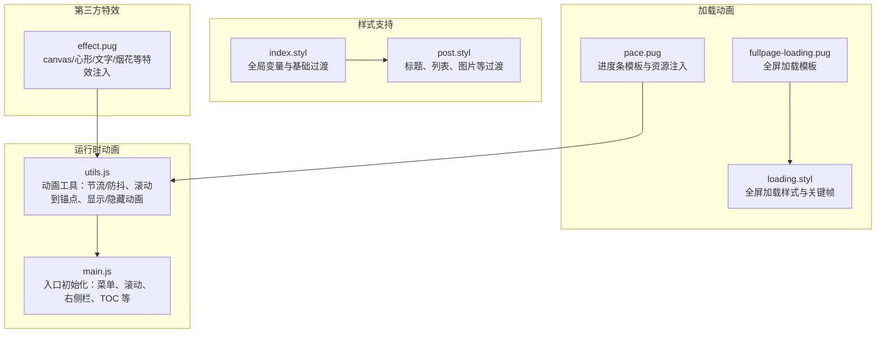
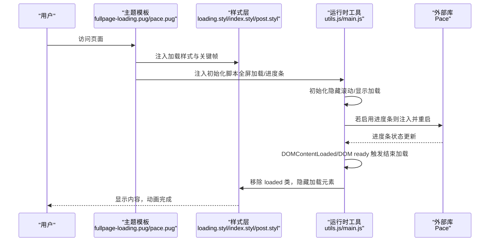
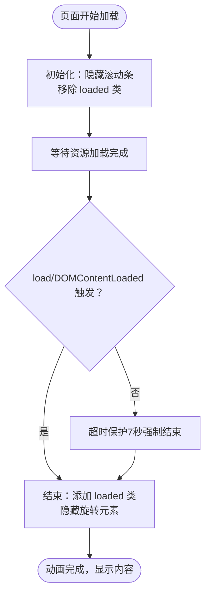
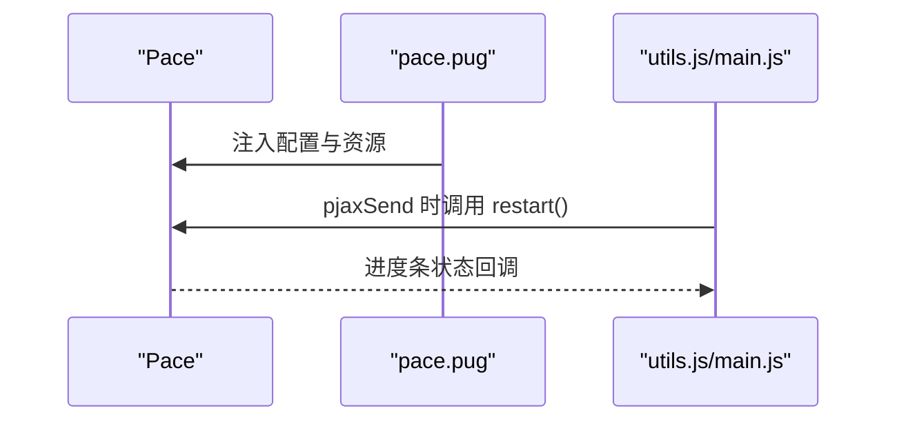
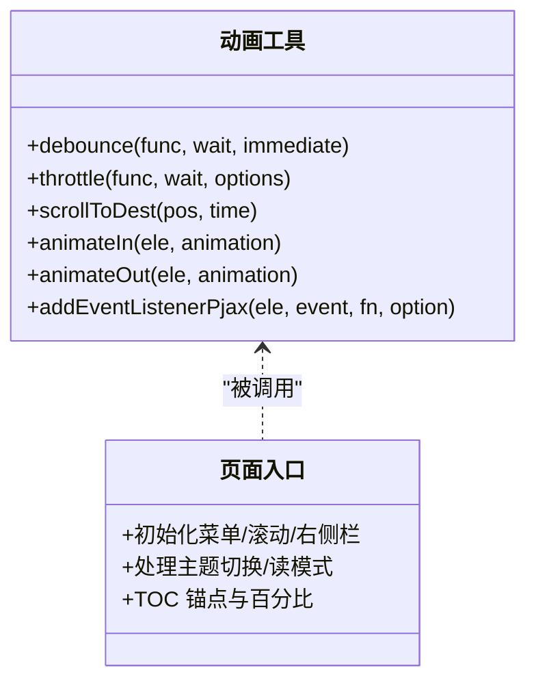
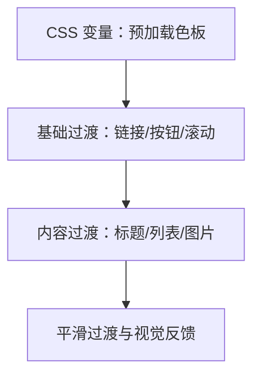
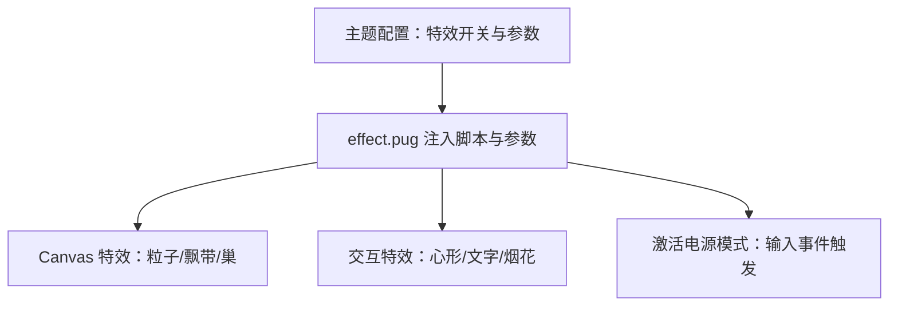
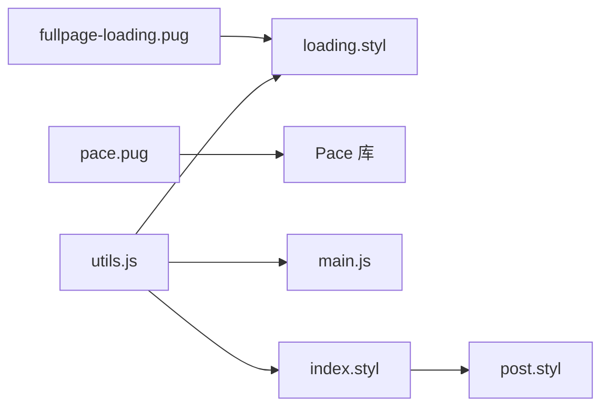

# 动态效果

<cite>
**本文引用的文件**
- [fullpage-loading.pug](file://themes/butterfly/layout/includes/loading/fullpage-loading.pug)
- [pace.pug](file://themes/butterfly/layout/includes/loading/pace.pug)
- [loading.styl](file://themes/butterfly/source/css/_layout/loading.styl)
- [main.js](file://themes/butterfly/source/js/main.js)
- [utils.js](file://themes/butterfly/source/js/utils.js)
- [_config.yml](file://themes/butterfly/_config.yml)
- [index.styl](file://themes/butterfly/source/css/_global/index.styl)
- [post.styl](file://themes/butterfly/source/css/_layout/post.styl)
- [effect.pug](file://themes/butterfly/layout/includes/third-party/effect.pug)
</cite>

## 目录
1. [简介](#简介)
2. [项目结构](#项目结构)
3. [核心组件](#核心组件)
4. [架构总览](#架构总览)
5. [详细组件分析](#详细组件分析)
6. [依赖关系分析](#依赖关系分析)
7. [性能考量](#性能考量)
8. [故障排查指南](#故障排查指南)
9. [结论](#结论)
10. [附录](#附录)

## 简介
本章节面向博客系统中的“动态效果”能力，聚焦以下目标：
- 页面加载动画：全屏加载效果、进度条动画、骨架屏等用户体验优化
- 元素动画：淡入淡出、滑动、缩放等 CSS3 与 JavaScript 结合的动画技术
- 响应式动画：设备方向变化、窗口尺寸调整时的适配策略
- 性能优化：硬件加速、帧率控制、内存管理等
- 自定义动画：动画库选择、参数调优、事件处理
- 兼容性与降级：在不同浏览器与设备上的表现与回退策略

## 项目结构
动态效果相关代码主要分布在如下位置：
- 加载动画与进度条：Pug 模板与样式文件
- 运行时动画工具：JavaScript 工具函数与入口逻辑
- 样式层：全局与布局样式对动画的支持
- 第三方特效：粒子、心形、烟花等交互特效

**图表来源**
- [fullpage-loading.pug:1-42](file://themes/butterfly/layout/includes/loading/fullpage-loading.pug#L1-L42)
- [loading.styl:1-96](file://themes/butterfly/source/css/_layout/loading.styl#L1-L96)
- [pace.pug:1-12](file://themes/butterfly/layout/includes/loading/pace.pug#L1-L12)
- [utils.js:1-339](file://themes/butterfly/source/js/utils.js#L1-L339)
- [main.js:1-988](file://themes/butterfly/source/js/main.js#L1-L988)
- [index.styl:1-287](file://themes/butterfly/source/css/_global/index.styl#L1-L287)
- [post.styl:1-265](file://themes/butterfly/source/css/_layout/post.styl#L1-L265)
- [effect.pug:1-35](file://themes/butterfly/layout/includes/third-party/effect.pug#L1-L35)

**章节来源**
- [fullpage-loading.pug:1-42](file://themes/butterfly/layout/includes/loading/fullpage-loading.pug#L1-L42)
- [pace.pug:1-12](file://themes/butterfly/layout/includes/loading/pace.pug#L1-L12)
- [loading.styl:1-96](file://themes/butterfly/source/css/_layout/loading.styl#L1-L96)
- [utils.js:1-339](file://themes/butterfly/source/js/utils.js#L1-L339)
- [main.js:1-988](file://themes/butterfly/source/js/main.js#L1-L988)
- [index.styl:1-287](file://themes/butterfly/source/css/_global/index.styl#L1-L287)
- [post.styl:1-265](file://themes/butterfly/source/css/_layout/post.styl#L1-L265)
- [effect.pug:1-35](file://themes/butterfly/layout/includes/third-party/effect.pug#L1-L35)

## 核心组件
- 全屏加载动画（全屏左右分割 + 旋转拼装动画）
  - 模板：[fullpage-loading.pug:1-42](file://themes/butterfly/layout/includes/loading/fullpage-loading.pug#L1-L42)
  - 样式与关键帧：[loading.styl:1-96](file://themes/butterfly/source/css/_layout/loading.styl#L1-L96)
  - 启停逻辑：初始化隐藏滚动、完成时移除 loaded 并隐藏旋转元素
- 进度条动画（Pace）
  - 注入与重启：[pace.pug:1-12](file://themes/butterfly/layout/includes/loading/pace.pug#L1-L12)
  - 主题与脚本：通过配置项注入 CSS/JS
- 运行时动画工具（节流/防抖、滚动到锚点、显示/隐藏动画）
  - 工具函数：[utils.js:1-339](file://themes/butterfly/source/js/utils.js#L1-L339)
  - 入口初始化与交互：[main.js:1-988](file://themes/butterfly/source/js/main.js#L1-L988)
- 样式层动画支持（全局变量、过渡、图片滤镜）
  - 全局变量与基础过渡：[index.styl:1-287](file://themes/butterfly/source/css/_global/index.styl#L1-L287)
  - 标题、列表、图片过渡：[post.styl:1-265](file://themes/butterfly/source/css/_layout/post.styl#L1-L265)
- 第三方特效（画布粒子、心形、文字、烟花）
  - 注入与参数：[effect.pug:1-35](file://themes/butterfly/layout/includes/third-party/effect.pug#L1-L35)

**章节来源**
- [fullpage-loading.pug:1-42](file://themes/butterfly/layout/includes/loading/fullpage-loading.pug#L1-L42)
- [loading.styl:1-96](file://themes/butterfly/source/css/_layout/loading.styl#L1-L96)
- [pace.pug:1-12](file://themes/butterfly/layout/includes/loading/pace.pug#L1-L12)
- [utils.js:1-339](file://themes/butterfly/source/js/utils.js#L1-L339)
- [main.js:1-988](file://themes/butterfly/source/js/main.js#L1-L988)
- [index.styl:1-287](file://themes/butterfly/source/css/_global/index.styl#L1-L287)
- [post.styl:1-265](file://themes/butterfly/source/css/_layout/post.styl#L1-L265)
- [effect.pug:1-35](file://themes/butterfly/layout/includes/third-party/effect.pug#L1-L35)

## 架构总览
动态效果由“模板/样式层 + 运行时工具 + 配置驱动”构成，整体流程如下：

**图表来源**
- [fullpage-loading.pug:1-42](file://themes/butterfly/layout/includes/loading/fullpage-loading.pug#L1-L42)
- [pace.pug:1-12](file://themes/butterfly/layout/includes/loading/pace.pug#L1-L12)
- [loading.styl:1-96](file://themes/butterfly/source/css/_layout/loading.styl#L1-L96)
- [utils.js:1-339](file://themes/butterfly/source/js/utils.js#L1-L339)
- [main.js:1-988](file://themes/butterfly/source/js/main.js#L1-L988)

## 详细组件分析

### 组件A：全屏加载动画（全屏左右分割 + 旋转拼装）
- 实现要点
  - HTML 结构：左右背景遮罩 + 旋转拼装容器 + 文字提示
  - 样式：固定定位、Z 轴分层、关键帧旋转与对称变换
  - JS 控制：初始化隐藏滚动、完成时添加 loaded 类并过渡
  - 容错：监听 load 与 DOMContentLoaded，超时保护
- 关键路径
  - 模板与脚本：[fullpage-loading.pug:1-42](file://themes/butterfly/layout/includes/loading/fullpage-loading.pug#L1-L42)
  - 样式与关键帧：[loading.styl:1-96](file://themes/butterfly/source/css/_layout/loading.styl#L1-L96)

**图表来源**
- [fullpage-loading.pug:1-42](file://themes/butterfly/layout/includes/loading/fullpage-loading.pug#L1-L42)
- [loading.styl:1-96](file://themes/butterfly/source/css/_layout/loading.styl#L1-L96)

**章节来源**
- [fullpage-loading.pug:1-42](file://themes/butterfly/layout/includes/loading/fullpage-loading.pug#L1-L42)
- [loading.styl:1-96](file://themes/butterfly/source/css/_layout/loading.styl#L1-L96)

### 组件B：进度条动画（Pace）
- 实现要点
  - 注入 Pace 配置与资源，按需启用
  - 在 PJAX 请求发送时重启进度条
  - 支持自定义 CSS/JS 资源路径
- 关键路径
  - 注入与重启：[pace.pug:1-12](file://themes/butterfly/layout/includes/loading/pace.pug#L1-L12)
  - 配置开关：[preloader 配置:794-806](file://themes/butterfly/_config.yml#L794-L806)

**图表来源**
- [pace.pug:1-12](file://themes/butterfly/layout/includes/loading/pace.pug#L1-L12)
- [utils.js:1-339](file://themes/butterfly/source/js/utils.js#L1-L339)
- [main.js:1-988](file://themes/butterfly/source/js/main.js#L1-L988)

**章节来源**
- [pace.pug:1-12](file://themes/butterfly/layout/includes/loading/pace.pug#L1-L12)
- [_config.yml:794-806](file://themes/butterfly/_config.yml#L794-L806)

### 组件C：元素动画工具（淡入淡出、滚动到锚点、显示/隐藏）
- 实现要点
  - 动画工具：防抖/节流、滚动到锚点、显示/隐藏动画
  - 使用场景：侧边栏、回到顶部、TOC 自动滚动、读模式切换
  - 与 PJAX 的事件绑定：自动解绑避免重复监听
- 关键路径
  - 工具函数：[utils.js:1-339](file://themes/butterfly/source/js/utils.js#L1-L339)
  - 入口与交互：[main.js:1-988](file://themes/butterfly/source/js/main.js#L1-L988)

**图表来源**
- [utils.js:1-339](file://themes/butterfly/source/js/utils.js#L1-L339)
- [main.js:1-988](file://themes/butterfly/source/js/main.js#L1-L988)

**章节来源**
- [utils.js:1-339](file://themes/butterfly/source/js/utils.js#L1-L339)
- [main.js:1-988](file://themes/butterfly/source/js/main.js#L1-L988)

### 组件D：样式层动画支持（全局变量、过渡、图片滤镜）
- 实现要点
  - 全局变量：预加载背景色、文字颜色等
  - 基础过渡：链接、按钮、滚动行为平滑
  - 内容过渡：标题前缀图标、列表标记、图片滤镜
- 关键路径
  - 全局与滚动：[index.styl:1-287](file://themes/butterfly/source/css/_global/index.styl#L1-L287)
  - 标题/列表/图片过渡：[post.styl:1-265](file://themes/butterfly/source/css/_layout/post.styl#L1-L265)

**图表来源**
- [index.styl:1-287](file://themes/butterfly/source/css/_global/index.styl#L1-L287)
- [post.styl:1-265](file://themes/butterfly/source/css/_layout/post.styl#L1-L265)

**章节来源**
- [index.styl:1-287](file://themes/butterfly/source/css/_global/index.styl#L1-L287)
- [post.styl:1-265](file://themes/butterfly/source/css/_layout/post.styl#L1-L265)

### 组件E：第三方特效（画布粒子、心形、文字、烟花）
- 实现要点
  - 条件注入：根据配置启用对应特效
  - 参数透传：大小、透明度、层级、移动端开关等
  - 事件绑定：输入事件触发“激活电源模式”
- 关键路径
  - 注入与参数：[effect.pug:1-35](file://themes/butterfly/layout/includes/third-party/effect.pug#L1-L35)
  - 配置项：[主题配置:848-902](file://themes/butterfly/_config.yml#L848-L902)

**图表来源**
- [effect.pug:1-35](file://themes/butterfly/layout/includes/third-party/effect.pug#L1-L35)
- [_config.yml:848-902](file://themes/butterfly/_config.yml#L848-L902)

**章节来源**
- [effect.pug:1-35](file://themes/butterfly/layout/includes/third-party/effect.pug#L1-L35)
- [_config.yml:848-902](file://themes/butterfly/_config.yml#L848-L902)

## 依赖关系分析
- 模板与样式
  - 全屏加载依赖 loading.styl 的关键帧与类名
  - 进度条依赖 pace.pug 注入的 CSS/JS
- 运行时与模板
  - fullpage-loading.pug 中的 JS 与 utils.js 的 animateIn/animateOut 协作
  - pace.pug 与 utils.js 的 addEventListenerPjax 保证 PJAX 下的生命周期正确
- 样式与运行时
  - index.styl/post.styl 的过渡属性与 main.js 的滚动/锚点逻辑配合

**图表来源**
- [fullpage-loading.pug:1-42](file://themes/butterfly/layout/includes/loading/fullpage-loading.pug#L1-L42)
- [loading.styl:1-96](file://themes/butterfly/source/css/_layout/loading.styl#L1-L96)
- [pace.pug:1-12](file://themes/butterfly/layout/includes/loading/pace.pug#L1-L12)
- [utils.js:1-339](file://themes/butterfly/source/js/utils.js#L1-L339)
- [main.js:1-988](file://themes/butterfly/source/js/main.js#L1-L988)
- [index.styl:1-287](file://themes/butterfly/source/css/_global/index.styl#L1-L287)
- [post.styl:1-265](file://themes/butterfly/source/css/_layout/post.styl#L1-L265)

**章节来源**
- [fullpage-loading.pug:1-42](file://themes/butterfly/layout/includes/loading/fullpage-loading.pug#L1-L42)
- [loading.styl:1-96](file://themes/butterfly/source/css/_layout/loading.styl#L1-L96)
- [pace.pug:1-12](file://themes/butterfly/layout/includes/loading/pace.pug#L1-L12)
- [utils.js:1-339](file://themes/butterfly/source/js/utils.js#L1-L339)
- [main.js:1-988](file://themes/butterfly/source/js/main.js#L1-L988)
- [index.styl:1-287](file://themes/butterfly/source/css/_global/index.styl#L1-L287)
- [post.styl:1-265](file://themes/butterfly/source/css/_layout/post.styl#L1-L265)

## 性能考量
- 硬件加速
  - 利用 CSS3 变换与过渡，减少重排重绘
  - 图片滤镜与旋转使用 GPU 加速通道
- 帧率控制
  - 使用节流/防抖限制高频事件（滚动、窗口 resize）
  - requestAnimationFrame 平滑滚动与动画
- 内存管理
  - PJAX 场景下统一解绑事件，避免重复监听
  - 进度条与加载动画在完成后移除 DOM 与类名
- 资源加载
  - 进度条与全屏加载按需启用，避免不必要的资源注入

[本节为通用指导，不直接分析具体文件]

## 故障排查指南
- 全屏加载未消失或卡住
  - 检查模板初始化是否执行（隐藏滚动、移除 loaded）
  - 确认 load/DOMContentLoaded 是否触发，必要时检查超时保护
  - 参考：[fullpage-loading.pug:1-42](file://themes/butterfly/layout/includes/loading/fullpage-loading.pug#L1-L42)
- 进度条不显示或不更新
  - 确认配置已启用且资源路径有效
  - 检查 pjaxSend 事件是否触发 Pace.restart
  - 参考：[pace.pug:1-12](file://themes/butterfly/layout/includes/loading/pace.pug#L1-L12)
- 动画卡顿或掉帧
  - 检查是否存在过多重排重绘操作
  - 使用节流/防抖优化滚动与 resize 回调
  - 参考：[utils.js:1-339](file://themes/butterfly/source/js/utils.js#L1-L339)
- PJAX 下事件重复绑定
  - 确保使用 addEventListenerPjax 并在 pjaxSendOnce 解绑
  - 参考：[utils.js:303-318](file://themes/butterfly/source/js/utils.js#L303-L318)
- 第三方特效无效
  - 检查主题配置开关与参数
  - 确认脚本资源可访问
  - 参考：[effect.pug:1-35](file://themes/butterfly/layout/includes/third-party/effect.pug#L1-L35)

**章节来源**
- [fullpage-loading.pug:1-42](file://themes/butterfly/layout/includes/loading/fullpage-loading.pug#L1-L42)
- [pace.pug:1-12](file://themes/butterfly/layout/includes/loading/pace.pug#L1-L12)
- [utils.js:1-339](file://themes/butterfly/source/js/utils.js#L1-L339)
- [effect.pug:1-35](file://themes/butterfly/layout/includes/third-party/effect.pug#L1-L35)

## 结论
本项目的动态效果以“模板 + 样式 + 运行时工具 + 配置”协同实现，覆盖了页面加载动画、进度条、元素过渡与第三方特效。通过节流/防抖、PJAX 事件管理与 CSS3 硬件加速，兼顾了体验与性能。建议在实际部署中：
- 按需启用加载动画与进度条，避免冗余资源
- 对高频事件使用节流/防抖，确保帧率稳定
- 在移动端验证第三方特效与过渡效果
- 通过配置项灵活切换主题模式与动画强度

[本节为总结，不直接分析具体文件]

## 附录
- 配置参考
  - 加载动画与进度条：[preloader 配置:794-806](file://themes/butterfly/_config.yml#L794-L806)
  - 第三方特效：[特效配置段落:848-902](file://themes/butterfly/_config.yml#L848-L902)
- 关键实现文件
  - 全屏加载：[fullpage-loading.pug:1-42](file://themes/butterfly/layout/includes/loading/fullpage-loading.pug#L1-L42)，[loading.styl:1-96](file://themes/butterfly/source/css/_layout/loading.styl#L1-L96)
  - 进度条：[pace.pug:1-12](file://themes/butterfly/layout/includes/loading/pace.pug#L1-L12)
  - 动画工具：[utils.js:1-339](file://themes/butterfly/source/js/utils.js#L1-L339)
  - 入口与交互：[main.js:1-988](file://themes/butterfly/source/js/main.js#L1-L988)
  - 样式支持：[index.styl:1-287](file://themes/butterfly/source/css/_global/index.styl#L1-L287)，[post.styl:1-265](file://themes/butterfly/source/css/_layout/post.styl#L1-L265)
  - 第三方特效：[effect.pug:1-35](file://themes/butterfly/layout/includes/third-party/effect.pug#L1-L35)