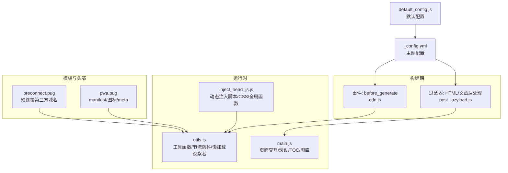
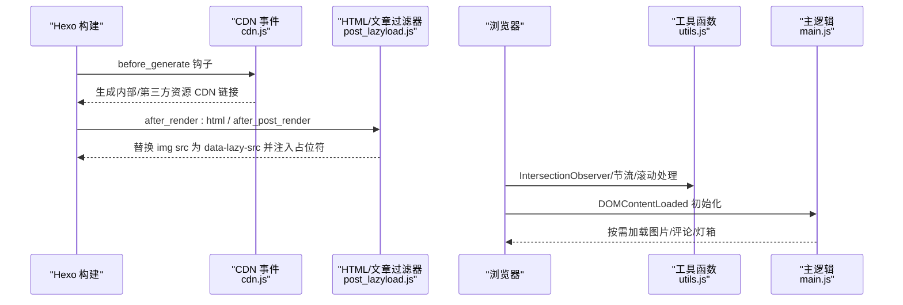
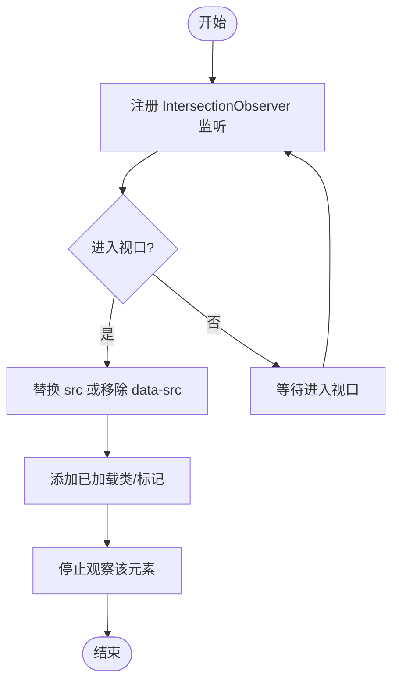
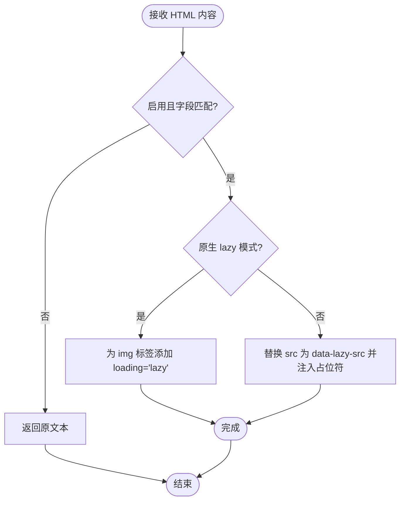
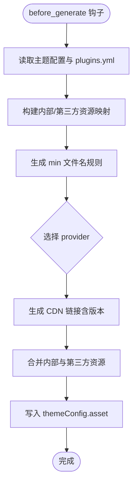
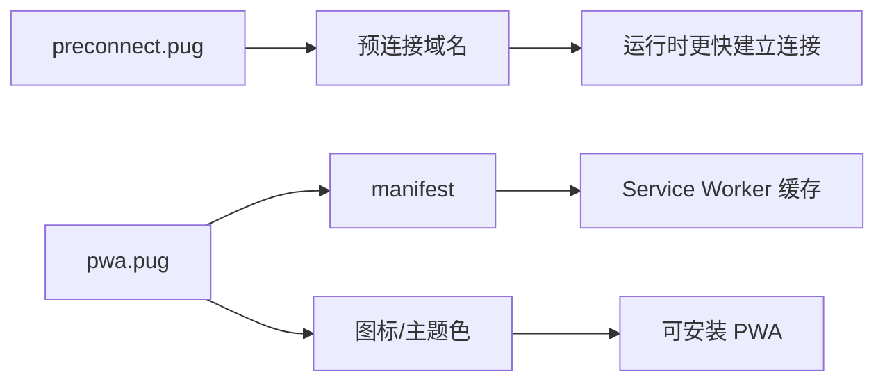
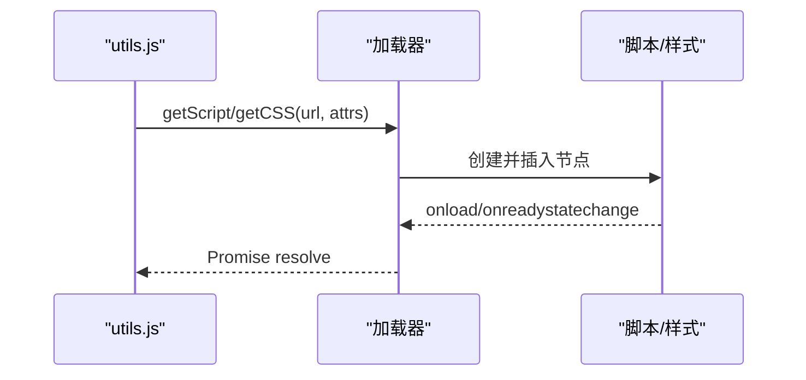
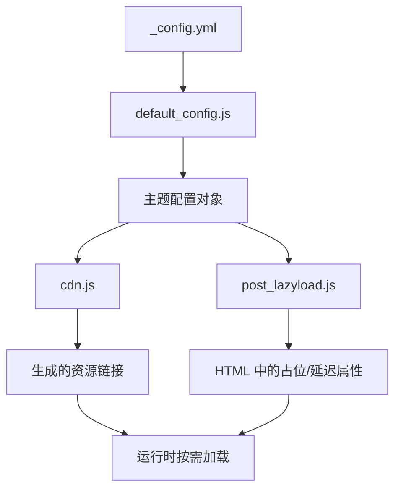

# 性能优化

<cite>
**本文引用的文件**
- [post_lazyload.js](file://themes/butterfly/scripts/filters/post_lazyload.js)
- [cdn.js](file://themes/butterfly/scripts/events/cdn.js)
- [main.js](file://themes/butterfly/source/js/main.js)
- [utils.js](file://themes/butterfly/source/js/utils.js)
- [preconnect.pug](file://themes/butterfly/layout/includes/head/preconnect.pug)
- [_config.yml（主题）](file://themes/butterfly/_config.yml)
- [default_config.js](file://themes/butterfly/scripts/common/default_config.js)
- [inject_head_js.js](file://themes/butterfly/scripts/helpers/inject_head_js.js)
- [pwa.pug](file://themes/butterfly/layout/includes/head/pwa.pug)
</cite>

## 目录
1. [简介](#简介)
2. [项目结构](#项目结构)
3. [核心组件](#核心组件)
4. [架构总览](#架构总览)
5. [详细组件分析](#详细组件分析)
6. [依赖关系分析](#依赖关系分析)
7. [性能考量与优化建议](#性能考量与优化建议)
8. [故障排查指南](#故障排查指南)
9. [结论](#结论)
10. [附录：配置与最佳实践](#附录配置与最佳实践)

## 简介
本文件面向博客系统在前端性能方面的优化，围绕以下目标展开：
- 图片懒加载：基于浏览器原生与 Intersection Observer 的实现、占位符策略与加载时机控制
- 代码分割与按需加载：通过动态导入与条件加载减少首屏负担
- 缓存机制：浏览器缓存、CDN 与预连接、PWA 清单与图标
- 资源压缩与合并：JS/CSS 压缩、第三方库从 CDN 引入
- 性能监控与分析：加载时间测量、用户体验指标采集
- 最佳实践与常见问题：可扩展性、兼容性与调试技巧

## 项目结构
本项目采用 Hexo + Pug + Stylus + 自研脚本的组合。与性能优化相关的关键位置如下：
- 运行时脚本：themes/butterfly/source/js/*.js
- 构建期脚本：themes/butterfly/scripts/*
- 模板与头部注入：themes/butterfly/layout/includes/*
- 主题配置：themes/butterfly/_config.yml 与默认配置 scripts/common/default_config.js
- 头部预连接与 PWA：layout/includes/head/*.pug

图表来源
- [cdn.js:11-95](file://themes/butterfly/scripts/events/cdn.js#L11-L95)
- [post_lazyload.js:29-40](file://themes/butterfly/scripts/filters/post_lazyload.js#L29-L40)
- [utils.js:105-117](file://themes/butterfly/source/js/utils.js#L105-L117)
- [main.js:231-259](file://themes/butterfly/source/js/main.js#L231-L259)
- [inject_head_js.js:30-61](file://themes/butterfly/scripts/helpers/inject_head_js.js#L30-L61)
- [preconnect.pug:1-35](file://themes/butterfly/layout/includes/head/preconnect.pug#L1-L35)
- [pwa.pug:1-14](file://themes/butterfly/layout/includes/head/pwa.pug#L1-L14)
- [_config.yml（主题）:566-572](file://themes/butterfly/_config.yml#L566-L572)
- [default_config.js:566-572](file://themes/butterfly/scripts/common/default_config.js#L566-L572)

章节来源
- [cdn.js:11-95](file://themes/butterfly/scripts/events/cdn.js#L11-L95)
- [post_lazyload.js:11-40](file://themes/butterfly/scripts/filters/post_lazyload.js#L11-L40)
- [utils.js:105-117](file://themes/butterfly/source/js/utils.js#L105-L117)
- [main.js:231-259](file://themes/butterfly/source/js/main.js#L231-L259)
- [inject_head_js.js:30-61](file://themes/butterfly/scripts/helpers/inject_head_js.js#L30-L61)
- [preconnect.pug:1-35](file://themes/butterfly/layout/includes/head/preconnect.pug#L1-L35)
- [pwa.pug:1-14](file://themes/butterfly/layout/includes/head/pwa.pug#L1-L14)
- [_config.yml（主题）:566-572](file://themes/butterfly/_config.yml#L566-L572)
- [default_config.js:566-572](file://themes/butterfly/scripts/common/default_config.js#L566-L572)

## 核心组件
- 图片懒加载（运行时）
  - Intersection Observer 观察可见区域，进入视口时替换 src 或触发加载
  - 占位符：支持自定义 base64 占位或默认透明 GIF
  - 兼容降级：不支持时直接加载
- 图片懒加载（构建期）
  - 在 HTML 后处理阶段将 img 的 src 替换为 data-lazy-src，并设置占位符
  - 支持原生 lazy 属性模式与自定义占位模式
- CDN 合并与资源链接生成
  - 在 before_generate 阶段根据配置选择内部与第三方资源的 CDN 链接
  - 自动生成 min 版本与版本查询参数
- 预连接与 PWA
  - 预连接第三方域名，缩短 DNS/TCP 握手时间
  - 注入 manifest 与图标，支持 PWA 清单
- 工具函数与节流防抖
  - 提供防抖/节流、滚动到目标、加载评论、加载图片灯箱等通用能力
- 动态脚本与样式注入
  - 运行时按需加载脚本与样式，避免阻塞首屏

章节来源
- [post_lazyload.js:11-40](file://themes/butterfly/scripts/filters/post_lazyload.js#L11-L40)
- [cdn.js:44-95](file://themes/butterfly/scripts/events/cdn.js#L44-L95)
- [utils.js:105-117](file://themes/butterfly/source/js/utils.js#L105-L117)
- [main.js:231-259](file://themes/butterfly/source/js/main.js#L231-L259)
- [preconnect.pug:1-35](file://themes/butterfly/layout/includes/head/preconnect.pug#L1-L35)
- [pwa.pug:1-14](file://themes/butterfly/layout/includes/head/pwa.pug#L1-L14)
- [inject_head_js.js:30-61](file://themes/butterfly/scripts/helpers/inject_head_js.js#L30-L61)

## 架构总览
下图展示从构建到运行时的关键路径，以及性能优化点的落位。

图表来源
- [cdn.js:11-95](file://themes/butterfly/scripts/events/cdn.js#L11-L95)
- [post_lazyload.js:29-40](file://themes/butterfly/scripts/filters/post_lazyload.js#L29-L40)
- [utils.js:105-117](file://themes/butterfly/source/js/utils.js#L105-L117)
- [main.js:1-50](file://themes/butterfly/source/js/main.js#L1-L50)

## 详细组件分析

### 组件一：图片懒加载（运行时）
- 实现要点
  - 使用 Intersection Observer 监听图片进入视口
  - 进入视口后替换 src 或移除 data-src，标记已加载
  - 不支持时直接加载，保证兼容性
- 关键流程

图表来源
- [main.js:231-259](file://themes/butterfly/source/js/main.js#L231-L259)

章节来源
- [main.js:231-259](file://themes/butterfly/source/js/main.js#L231-L259)

### 组件二：图片懒加载（构建期）
- 实现要点
  - 在 HTML 后处理阶段扫描 img 标签，将 src 替换为 data-lazy-src
  - 设置占位符（可配置 base64 或默认 GIF），避免首屏闪烁
  - 支持原生 lazy 模式：直接为 img 添加 loading="lazy"
  - 仅对站点或文章字段生效，由配置控制
- 关键流程

图表来源
- [post_lazyload.js:11-40](file://themes/butterfly/scripts/filters/post_lazyload.js#L11-L40)

章节来源
- [post_lazyload.js:11-40](file://themes/butterfly/scripts/filters/post_lazyload.js#L11-L40)

### 组件三：CDN 合并与资源链接生成
- 实现要点
  - 在 before_generate 阶段读取 plugins.yml 与内置资源清单
  - 根据配置选择内部 provider（local）或第三方 provider（jsdelivr/cdnjs/unpkg/custom）
  - 自动拼接 min 文件名与版本参数，生成最终链接
  - 支持删除空值，合并内部与第三方资源
- 关键流程

图表来源
- [cdn.js:11-95](file://themes/butterfly/scripts/events/cdn.js#L11-L95)

章节来源
- [cdn.js:11-95](file://themes/butterfly/scripts/events/cdn.js#L11-L95)

### 组件四：预连接与 PWA
- 预连接（preconnect）
  - 对内部/第三方 provider 域名进行预连接，减少 DNS/TCP 延迟
  - 对分析服务与字体服务也进行预连接
- PWA
  - 注入 manifest、主题色、苹果图标、favicon、mask 图标

图表来源
- [preconnect.pug:1-35](file://themes/butterfly/layout/includes/head/preconnect.pug#L1-L35)
- [pwa.pug:1-14](file://themes/butterfly/layout/includes/head/pwa.pug#L1-L14)

章节来源
- [preconnect.pug:1-35](file://themes/butterfly/layout/includes/head/preconnect.pug#L1-L35)
- [pwa.pug:1-14](file://themes/butterfly/layout/includes/head/pwa.pug#L1-L14)

### 组件五：工具函数与按需加载
- 工具函数
  - 防抖/节流：用于滚动与窗口尺寸变化
  - IntersectionObserver 加载评论：仅当评论容器进入视口时再加载
  - 滚动到目标：平滑滚动动画
  - 加载图片灯箱：支持 mediumZoom 或 fancybox
- 按需加载
  - 动态注入脚本与样式，避免阻塞首屏
  - 通过全局函数表管理生命周期事件（如 PJAX）

图表来源
- [utils.js:30-61](file://themes/butterfly/source/js/utils.js#L30-L61)
- [inject_head_js.js:30-61](file://themes/butterfly/scripts/helpers/inject_head_js.js#L30-L61)

章节来源
- [utils.js:3-46](file://themes/butterfly/source/js/utils.js#L3-L46)
- [utils.js:105-117](file://themes/butterfly/source/js/utils.js#L105-L117)
- [utils.js:119-142](file://themes/butterfly/source/js/utils.js#L119-L142)
- [utils.js:172-258](file://themes/butterfly/source/js/utils.js#L172-L258)
- [inject_head_js.js:30-61](file://themes/butterfly/scripts/helpers/inject_head_js.js#L30-L61)

## 依赖关系分析
- 配置驱动
  - 主题配置与默认配置共同决定行为（如 lazyload、CDN provider、PWA）
- 构建期与运行时协作
  - 构建期生成资源链接与占位符；运行时按需加载与观察可见性
- 第三方集成
  - CDN provider 与分析服务域名通过预连接提升首屏速度
  - PWA 清单与图标增强离线体验与可安装性

图表来源
- [_config.yml（主题）:566-572](file://themes/butterfly/_config.yml#L566-L572)
- [default_config.js:566-572](file://themes/butterfly/scripts/common/default_config.js#L566-L572)
- [cdn.js:11-95](file://themes/butterfly/scripts/events/cdn.js#L11-L95)
- [post_lazyload.js:11-40](file://themes/butterfly/scripts/filters/post_lazyload.js#L11-L40)

章节来源
- [_config.yml（主题）:566-572](file://themes/butterfly/_config.yml#L566-L572)
- [default_config.js:566-572](file://themes/butterfly/scripts/common/default_config.js#L566-L572)
- [cdn.js:11-95](file://themes/butterfly/scripts/events/cdn.js#L11-L95)
- [post_lazyload.js:11-40](file://themes/butterfly/scripts/filters/post_lazyload.js#L11-L40)

## 性能考量与优化建议
- 图片懒加载
  - 优先使用原生 lazy 属性以获得更好兼容与更低开销
  - 若需更强控制，使用 Intersection Observer 并设置合理的 rootMargin
  - 占位符建议使用低质量内嵌图像（LQIP）以减少白块
- 代码分割与按需加载
  - 将非关键路径模块（如评论、灯箱、图库）按需动态导入
  - 利用工具函数的 getScript/getCSS 实现按需注入
- CDN 与预连接
  - 选择就近的 CDN provider，开启 min 与版本参数
  - 对第三方分析与字体服务进行预连接
- 缓存策略
  - 合理设置静态资源缓存头（由 CDN/服务器配置）
  - PWA 清单与图标可结合 Service Worker 实现离线缓存
- 资源压缩与合并
  - 使用构建工具对 JS/CSS 压缩与去重
  - 图片采用现代格式（WebP/AVIF）与合适的尺寸裁剪
- 性能监控
  - 使用 Performance API 记录关键时间点（TTFB、FCP、LCP、INP）
  - 采集用户行为指标（首屏时长、交互延迟、错误率）

## 故障排查指南
- 图片未懒加载
  - 检查 lazyload 配置是否启用及字段是否匹配
  - 若使用原生模式，确认浏览器支持 loading="lazy"
  - 若使用占位模式，确认构建期过滤器是否生效
- Intersection Observer 无效
  - 确认浏览器支持；若不支持，回退到直接加载
  - 检查 rootMargin 与阈值设置是否合理
- CDN 链接异常
  - 检查 provider 选择与 custom_format 是否正确
  - 确认 min 文件名规则与版本参数拼接
- 预连接未生效
  - 检查域名是否正确，跨域属性是否需要
- PWA 无法安装或缓存失败
  - 检查 manifest 路径与图标尺寸
  - 确认 Service Worker 注册与缓存策略

章节来源
- [post_lazyload.js:11-40](file://themes/butterfly/scripts/filters/post_lazyload.js#L11-L40)
- [utils.js:105-117](file://themes/butterfly/source/js/utils.js#L105-L117)
- [cdn.js:44-95](file://themes/butterfly/scripts/events/cdn.js#L44-L95)
- [preconnect.pug:1-35](file://themes/butterfly/layout/includes/head/preconnect.pug#L1-L35)
- [pwa.pug:1-14](file://themes/butterfly/layout/includes/head/pwa.pug#L1-L14)

## 结论
通过“构建期占位与链接生成 + 运行时懒加载与按需注入”的双层策略，博客系统在不牺牲功能的前提下显著降低了首屏负载与网络开销。配合 CDN、预连接与 PWA，进一步提升了访问速度与可用性。建议在实际部署中结合业务场景调整配置，并持续监控关键指标以迭代优化。

## 附录：配置与最佳实践
- 配置项参考
  - lazyload：启用、原生模式、字段、占位符、模糊效果
  - CDN：内部/第三方 provider、版本参数、自定义格式
  - PWA：manifest、图标、主题色
- 最佳实践
  - 首选原生 lazy 属性，必要时再引入观察者
  - 对大图与视频采用占位符 + 懒加载
  - 将第三方脚本与样式按需加载，避免阻塞
  - 使用 CDN 与预连接，确保资源就近分发
  - 为关键交互设置节流/防抖，降低重排压力
  - 建立性能基线与告警，持续跟踪用户体验指标

章节来源
- [_config.yml（主题）:566-572](file://themes/butterfly/_config.yml#L566-L572)
- [default_config.js:566-572](file://themes/butterfly/scripts/common/default_config.js#L566-L572)
- [cdn.js:44-95](file://themes/butterfly/scripts/events/cdn.js#L44-L95)
- [inject_head_js.js:30-61](file://themes/butterfly/scripts/helpers/inject_head_js.js#L30-L61)