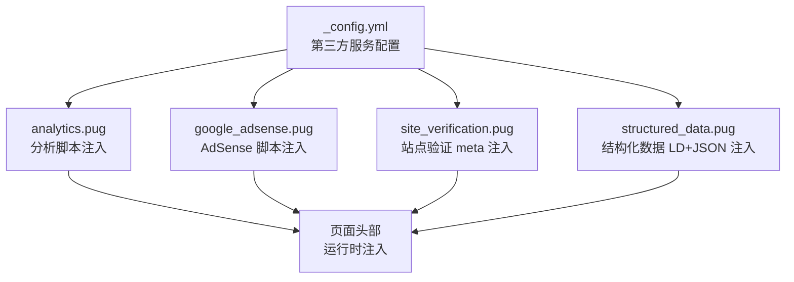
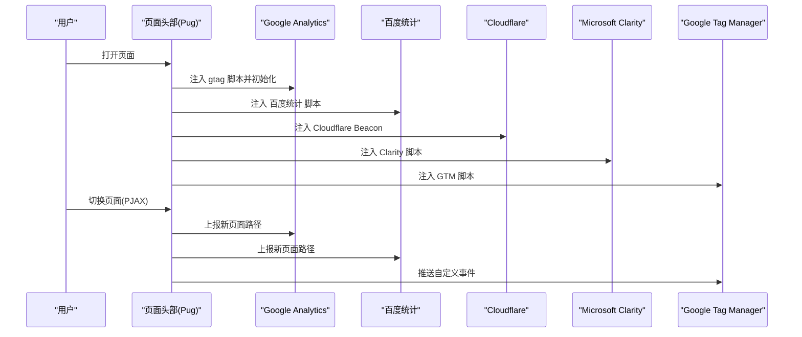
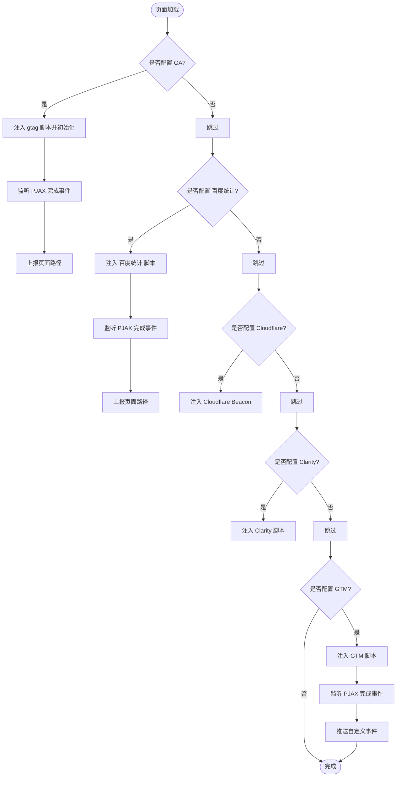
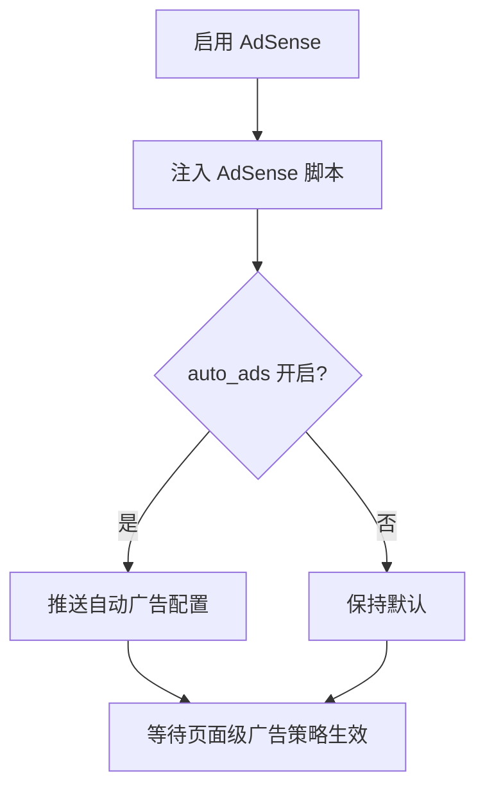
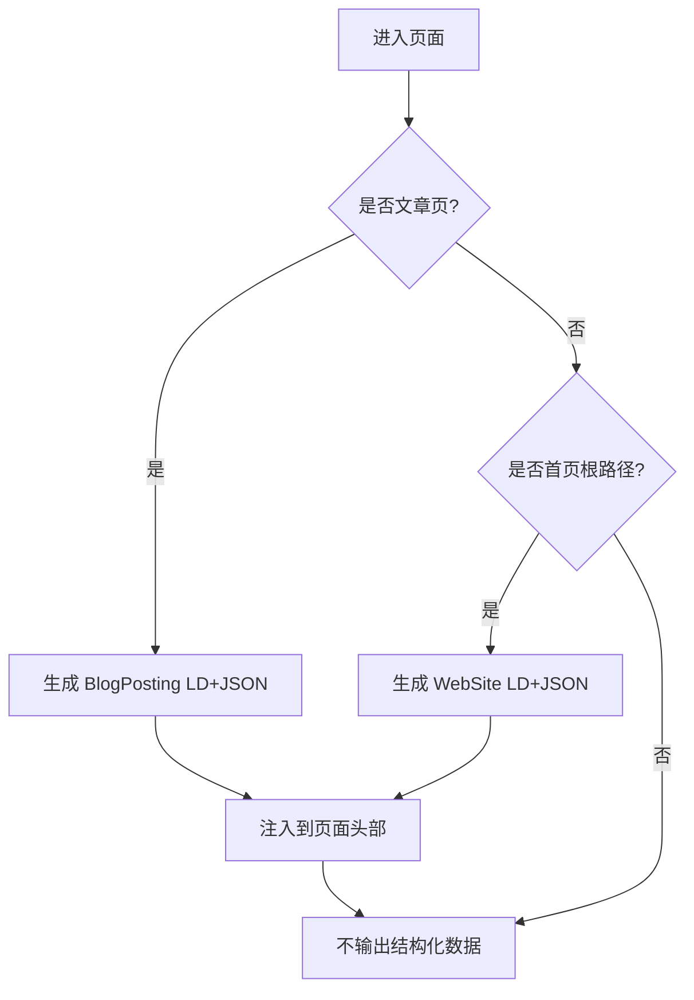
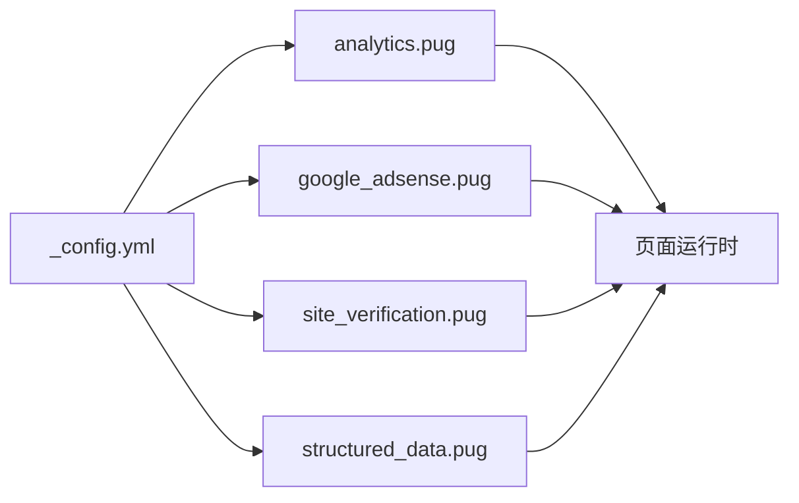

# 第三方集成

<cite>
**本文引用的文件**
- [themes/butterfly/_config.yml](file://themes/butterfly/_config.yml)
- [themes/butterfly/layout/includes/head/analytics.pug](file://themes/butterfly/layout/includes/head/analytics.pug)
- [themes/butterfly/layout/includes/head/google_adsense.pug](file://themes/butterfly/layout/includes/head/google_adsense.pug)
- [themes/butterfly/layout/includes/head/site_verification.pug](file://themes/butterfly/layout/includes/head/site_verification.pug)
- [themes/butterfly/layout/includes/head/structured_data.pug](file://themes/butterfly/layout/includes/head/structured_data.pug)
</cite>

## 目录
1. [简介](#简介)
2. [项目结构](#项目结构)
3. [核心组件](#核心组件)
4. [架构总览](#架构总览)
5. [详细组件分析](#详细组件分析)
6. [依赖关系分析](#依赖关系分析)
7. [性能考量](#性能考量)
8. [故障排查指南](#故障排查指南)
9. [结论](#结论)
10. [附录](#附录)

## 简介
本文件面向博客系统中第三方服务的集成与使用，重点覆盖以下方面：
- 分析工具集成：Google Analytics、百度统计、Cloudflare Analytics、Microsoft Clarity、Umami Analytics、Google Tag Manager
- 评论系统集成：Disqus、DisqusJS、Livere、Gitalk、Valine、Waline、Utterances、Facebook Comments、Twikoo、Giscus、Remark42、Artalk
- 社交分享功能：Share.js 与 AddToAny 提供的微博、微信、QQ、X(Twitter) 等平台分享
- 数学公式渲染：MathJax 与 KaTeX 的配置与按页加载策略
- 广告系统：Google AdSense 的自动广告与手动插入位置
- 安全与隐私：站点验证、结构化数据与第三方脚本加载策略

## 项目结构
主题采用 Hexo Butterfly 主题，第三方服务的配置集中在主题配置文件中，前端模板通过 Pug 片段在页面头部动态注入脚本或元信息。

图表来源
- [themes/butterfly/_config.yml](file://themes/butterfly/_config.yml)
- [themes/butterfly/layout/includes/head/analytics.pug](file://themes/butterfly/layout/includes/head/analytics.pug)
- [themes/butterfly/layout/includes/head/google_adsense.pug](file://themes/butterfly/layout/includes/head/google_adsense.pug)
- [themes/butterfly/layout/includes/head/site_verification.pug](file://themes/butterfly/layout/includes/head/site_verification.pug)
- [themes/butterfly/layout/includes/head/structured_data.pug](file://themes/butterfly/layout/includes/head/structured_data.pug)

章节来源
- [themes/butterfly/_config.yml](file://themes/butterfly/_config.yml)
- [themes/butterfly/layout/includes/head/analytics.pug](file://themes/butterfly/layout/includes/head/analytics.pug)
- [themes/butterfly/layout/includes/head/google_adsense.pug](file://themes/butterfly/layout/includes/head/google_adsense.pug)
- [themes/butterfly/layout/includes/head/site_verification.pug](file://themes/butterfly/layout/includes/head/site_verification.pug)
- [themes/butterfly/layout/includes/head/structured_data.pug](file://themes/butterfly/layout/includes/head/structured_data.pug)

## 核心组件
- 分析与标签管理
  - 百度统计、Google Analytics、Cloudflare Analytics、Microsoft Clarity、Umami Analytics、Google Tag Manager
  - 通过配置项启用后，在页面头部动态注入对应脚本，并在 PJAX 页面切换时上报页面浏览事件
- 广告系统
  - Google AdSense：支持自动广告与页面级广告开关，可配置脚本地址与客户端 ID
- 站点验证与 SEO
  - 支持多条 meta 验证信息注入，结构化数据（LD+JSON）用于文章与首页 SEO
- 评论系统
  - 支持多种评论插件，含 GitHub Issues 驱动型（如 Utterances、Giscus）、国内云引擎（如 Valine、Waline、Twikoo）、第三方平台（如 Disqus、Gitalk）
- 分享系统
  - Share.js 与 AddToAny 提供多平台一键分享能力
- 数学公式
  - MathJax 与 KaTeX 可选，支持按页加载与全局加载两种模式

章节来源
- [themes/butterfly/_config.yml](file://themes/butterfly/_config.yml)
- [themes/butterfly/layout/includes/head/analytics.pug](file://themes/butterfly/layout/includes/head/analytics.pug)
- [themes/butterfly/layout/includes/head/google_adsense.pug](file://themes/butterfly/layout/includes/head/google_adsense.pug)
- [themes/butterfly/layout/includes/head/structured_data.pug](file://themes/butterfly/layout/includes/head/structured_data.pug)

## 架构总览
第三方服务的集成遵循“配置驱动 + 模板注入”的模式：主题配置文件集中定义各服务参数；Pug 片段根据配置条件判断是否在页面头部注入脚本或元信息；部分服务在 PJAX 切换时触发额外事件上报。

图表来源
- [themes/butterfly/layout/includes/head/analytics.pug](file://themes/butterfly/layout/includes/head/analytics.pug)

## 详细组件分析

### 分析工具集成
- 启用方式
  - 在主题配置中设置对应字段以启用相应分析服务
- 注入逻辑
  - 百度统计：在页面头部注入脚本并绑定 PJAX 完成事件，自动上报页面路径
  - Google Analytics：注入 gtag 脚本，初始化配置；PJAX 完成后再次配置页面路径
  - Cloudflare Analytics：注入 beacon 脚本并传入 token
  - Microsoft Clarity：注入 Clarity 脚本并传入站点 ID
  - Google Tag Manager：注入 GTM 脚本并在 PJAX 完成时推送自定义事件
- 配置要点
  - 百度统计与 Google Analytics 需要填写对应的站点 ID
  - Cloudflare 与 Clarity 需要填写 token 或站点 ID
  - GTM 需要填写 tag_id，域名可选

图表来源
- [themes/butterfly/layout/includes/head/analytics.pug](file://themes/butterfly/layout/includes/head/analytics.pug)

章节来源
- [themes/butterfly/_config.yml](file://themes/butterfly/_config.yml)
- [themes/butterfly/layout/includes/head/analytics.pug](file://themes/butterfly/layout/includes/head/analytics.pug)

### 评论系统集成
- 支持列表
  - Disqus、DisqusJS、Livere、Gitalk、Valine、Waline、Utterances、Facebook Comments、Twikoo、Giscus、Remark42、Artalk
- 配置要点
  - 选择一个或两个评论系统作为默认展示
  - 文本显示、懒加载、主页卡片计数等行为可通过配置控制
  - 不同评论系统需填写其特定参数（如短名称、App ID/Key、仓库名、分类 ID、站点 ID 等）
- 使用建议
  - 国内用户优先考虑 Valine/Waline/Twikoo 等国内可用性较好的方案
  - 基于 GitHub Issues 的 Utterances/Giscus 适合开源社区场景
  - 如需后台管理与统计，可选择 Disqus/Waline/Twikoo/Artalk 等

章节来源
- [themes/butterfly/_config.yml](file://themes/butterfly/_config.yml)

### 社交分享功能
- 支持方案
  - Share.js：提供 Facebook、X(Twitter)、微信、微博、QQ 等分享入口
  - AddToAny：提供 Facebook、X、微信、微博、微信好友、QQ、邮件、复制链接等
- 配置要点
  - 在配置中选择使用哪种方案，并指定平台列表
  - 分享按钮通常出现在文章页或独立页面的侧边栏或工具栏区域

章节来源
- [themes/butterfly/_config.yml](file://themes/butterfly/_config.yml)

### 数学公式渲染服务
- 支持方案
  - MathJax 与 KaTeX
- 加载策略
  - per_page 控制是否在每页加载脚本，或仅在文章 Front Matter 中显式声明的页面加载
  - MathJax 可开启上下文菜单与公式编号策略
  - KaTeX 可选复制公式文本功能
- 性能建议
  - 对大量数学内容的站点，建议 per_page=false 并在需要的文章中显式开启，减少首屏脚本体积

章节来源
- [themes/butterfly/_config.yml](file://themes/butterfly/_config.yml)

### 广告系统集成
- Google AdSense
  - 支持自动广告与页面级广告
  - 可配置脚本地址、客户端 ID、页面级广告开关
- 插入位置
  - 支持在首页、侧边栏、文章内等位置插入广告位（具体模板位置由主题布局控制）

图表来源
- [themes/butterfly/layout/includes/head/google_adsense.pug](file://themes/butterfly/layout/includes/head/google_adsense.pug)

章节来源
- [themes/butterfly/_config.yml](file://themes/butterfly/_config.yml)
- [themes/butterfly/layout/includes/head/google_adsense.pug](file://themes/butterfly/layout/includes/head/google_adsense.pug)

### 站点验证与结构化数据
- 站点验证
  - 通过配置数组注入多个 meta 验证标签，适用于 Google、百度等平台
- 结构化数据
  - 文章页输出 BlogPosting 类型的 LD+JSON
  - 首页根路径输出 WebSite 类型的 LD+JSON，并可附加备用名称（副标题、域名等）

图表来源
- [themes/butterfly/layout/includes/head/structured_data.pug](file://themes/butterfly/layout/includes/head/structured_data.pug)

章节来源
- [themes/butterfly/layout/includes/head/site_verification.pug](file://themes/butterfly/layout/includes/head/site_verification.pug)
- [themes/butterfly/layout/includes/head/structured_data.pug](file://themes/butterfly/layout/includes/head/structured_data.pug)

## 依赖关系分析
- 配置到模板的依赖
  - 主题配置文件决定哪些第三方服务被启用
  - Pug 片段根据配置条件进行条件渲染与脚本注入
- 运行时依赖
  - 分析服务在 PJAX 页面切换时需要重新上报页面路径
  - AdSense 自动广告依赖页面脚本加载完成后的执行时机
- 外部依赖
  - 各第三方服务均通过外链脚本接入，需确保网络可达与跨域策略允许

图表来源
- [themes/butterfly/_config.yml](file://themes/butterfly/_config.yml)
- [themes/butterfly/layout/includes/head/analytics.pug](file://themes/butterfly/layout/includes/head/analytics.pug)
- [themes/butterfly/layout/includes/head/google_adsense.pug](file://themes/butterfly/layout/includes/head/google_adsense.pug)
- [themes/butterfly/layout/includes/head/site_verification.pug](file://themes/butterfly/layout/includes/head/site_verification.pug)
- [themes/butterfly/layout/includes/head/structured_data.pug](file://themes/butterfly/layout/includes/head/structured_data.pug)

## 性能考量
- 脚本加载
  - 分析与广告脚本均为外部资源，建议在首屏尽量减少不必要的脚本加载
  - 使用 per_page=false 仅在需要的页面加载数学脚本
- PJAX 事件
  - 分析脚本在 PJAX 完成后重新上报页面路径，避免漏报
- 广告策略
  - 自动广告可能影响首屏渲染，可根据业务需求调整加载策略

## 故障排查指南
- 分析脚本未生效
  - 检查对应站点 ID 是否正确填写
  - 确认网络环境可访问外链脚本地址
  - 查看浏览器控制台是否存在跨域或脚本加载错误
- AdSense 未显示
  - 确认已启用 AdSense 并填写客户端 ID
  - 检查页面是否满足 AdSense 政策要求
- 结构化数据无效
  - 确认当前页面类型（文章页/首页根路径）与对应 LD+JSON 生成逻辑匹配
  - 使用结构化数据测试工具验证输出格式
- 站点验证失败
  - 检查 meta 验证标签是否正确注入，名称与内容是否匹配平台要求

章节来源
- [themes/butterfly/layout/includes/head/analytics.pug](file://themes/butterfly/layout/includes/head/analytics.pug)
- [themes/butterfly/layout/includes/head/google_adsense.pug](file://themes/butterfly/layout/includes/head/google_adsense.pug)
- [themes/butterfly/layout/includes/head/structured_data.pug](file://themes/butterfly/layout/includes/head/structured_data.pug)
- [themes/butterfly/layout/includes/head/site_verification.pug](file://themes/butterfly/layout/includes/head/site_verification.pug)

## 结论
本主题通过统一的配置文件与 Pug 片段实现了对主流第三方服务的灵活集成，涵盖分析、广告、SEO、评论与分享等关键能力。建议结合站点目标与受众分布选择合适的第三方服务组合，并关注加载性能与隐私合规。

## 附录
- 配置项速览
  - 分析类：baidu_analytics、google_analytics、cloudflare_analytics、microsoft_clarity、umami_analytics、google_tag_manager
  - 广告类：google_adsense（enable、auto_ads、js、client、enable_page_level_ads）
  - SEO/验证：site_verification、structured_data
  - 评论类：comments.use 及各评论系统专属配置
  - 分享类：share.use、share.sharejs.sites、share.addtoany.item
  - 数学：math.use、math.per_page、math.mathjax.tags、math.katex.copy_tex

章节来源
- [themes/butterfly/_config.yml](file://themes/butterfly/_config.yml)