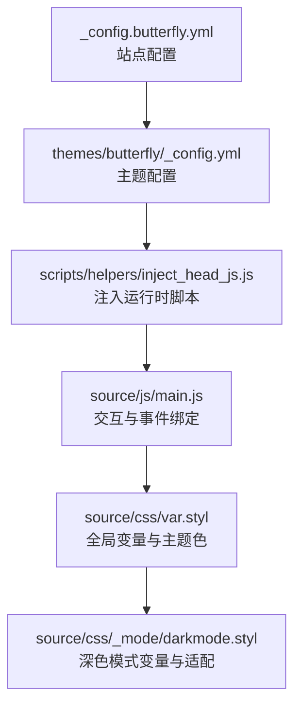
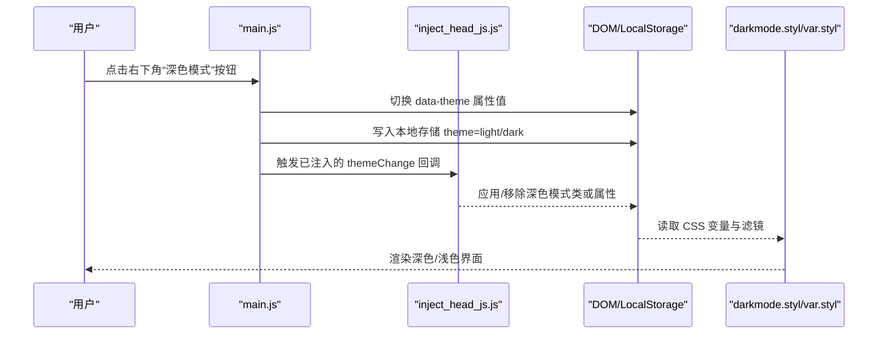
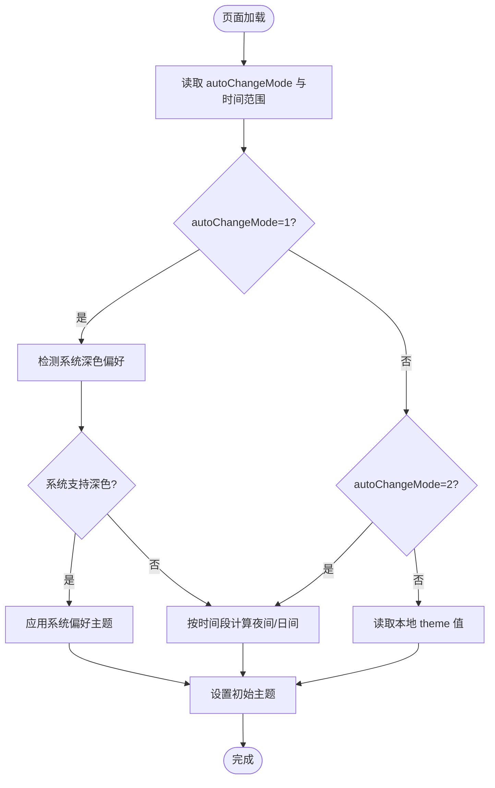
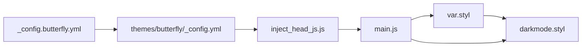

# 主题切换

<cite>
**本文引用的文件**
- [_config.butterfly.yml](file://_config.butterfly.yml)
- [themes/butterfly/_config.yml](file://themes/butterfly/_config.yml)
- [themes/butterfly/scripts/helpers/inject_head_js.js](file://themes/butterfly/scripts/helpers/inject_head_js.js)
- [themes/butterfly/scripts/common/default_config.js](file://themes/butterfly/scripts/common/default_config.js)
- [themes/butterfly/source/js/main.js](file://themes/butterfly/source/js/main.js)
- [themes/butterfly/source/js/utils.js](file://themes/butterfly/source/js/utils.js)
- [themes/butterfly/source/css/var.styl](file://themes/butterfly/source/css/var.styl)
- [themes/butterfly/source/css/_mode/darkmode.styl](file://themes/butterfly/source/css/_mode/darkmode.styl)
</cite>

## 目录
1. [简介](#简介)
2. [项目结构](#项目结构)
3. [核心组件](#核心组件)
4. [架构总览](#架构总览)
5. [详细组件分析](#详细组件分析)
6. [依赖关系分析](#依赖关系分析)
7. [性能考量](#性能考量)
8. [故障排查指南](#故障排查指南)
9. [结论](#结论)
10. [附录](#附录)

## 简介
本指南围绕 Hexo 主题 Butterfly 的“主题切换”能力，系统讲解深色/浅色模式的实现原理与配置方法，覆盖自动切换（跟随系统/时间段）、手动切换、以及主题颜色系统的定制。同时提供用户体验优化建议与兼容性处理方案，帮助你在不同设备与浏览器环境下稳定地提供良好的阅读体验。

## 项目结构
主题切换涉及配置层、运行时注入脚本、前端交互逻辑与样式变量四个层面：
- 配置层：在站点与主题配置中开启/关闭深色模式、设置自动切换策略与时间范围
- 注入脚本：在页面头部动态注入主题切换所需的 JavaScript，负责初始化与自动切换
- 前端交互：右下角按钮触发手动切换，切换后持久化状态并通知评论区等模块
- 样式变量：通过 CSS 自定义属性与 Stylus 变量控制深浅两套视觉体系



**图表来源**
- [_config.butterfly.yml](file://_config.butterfly.yml)
- [themes/butterfly/_config.yml](file://themes/butterfly/_config.yml)
- [themes/butterfly/scripts/helpers/inject_head_js.js](file://themes/butterfly/scripts/helpers/inject_head_js.js)
- [themes/butterfly/source/js/main.js](file://themes/butterfly/source/js/main.js)
- [themes/butterfly/source/css/var.styl](file://themes/butterfly/source/css/var.styl)
- [themes/butterfly/source/css/_mode/darkmode.styl](file://themes/butterfly/source/css/_mode/darkmode.styl)

**章节来源**
- [_config.butterfly.yml](file://_config.butterfly.yml)
- [themes/butterfly/_config.yml](file://themes/butterfly/_config.yml)
- [themes/butterfly/scripts/helpers/inject_head_js.js](file://themes/butterfly/scripts/helpers/inject_head_js.js)
- [themes/butterfly/source/js/main.js](file://themes/butterfly/source/js/main.js)
- [themes/butterfly/source/css/var.styl](file://themes/butterfly/source/css/var.styl)
- [themes/butterfly/source/css/_mode/darkmode.styl](file://themes/butterfly/source/css/_mode/darkmode.styl)

## 核心组件
- 主题配置项：控制深色模式开关、自动切换模式、起止时间等
- 运行时注入脚本：根据配置生成激活/去激活深色模式的方法，并按策略执行
- 前端交互：右下角按钮触发切换；切换后写入本地存储并通知评论区等模块
- 样式系统：Stylus 全局变量与深色模式专用变量，配合 CSS 自定义属性实现主题切换

**章节来源**
- [themes/butterfly/_config.yml](file://themes/butterfly/_config.yml)
- [themes/butterfly/scripts/helpers/inject_head_js.js](file://themes/butterfly/scripts/helpers/inject_head_js.js)
- [themes/butterfly/source/js/main.js](file://themes/butterfly/source/js/main.js)
- [themes/butterfly/source/css/var.styl](file://themes/butterfly/source/css/var.styl)
- [themes/butterfly/source/css/_mode/darkmode.styl](file://themes/butterfly/source/css/_mode/darkmode.styl)

## 架构总览
主题切换从“配置—注入—交互—样式”四层协同工作：
- 配置层决定行为：是否启用深色模式、是否自动切换、自动切换策略与时间范围
- 注入层决定时机：在页面加载时根据策略选择初始主题，并暴露切换函数
- 交互层决定用户操作：点击右下角按钮切换主题，持久化到本地存储
- 样式层决定呈现：通过 data-theme 属性与 CSS 变量映射到具体颜色与滤镜



**图表来源**
- [themes/butterfly/source/js/main.js](file://themes/butterfly/source/js/main.js)
- [themes/butterfly/scripts/helpers/inject_head_js.js](file://themes/butterfly/scripts/helpers/inject_head_js.js)
- [themes/butterfly/source/css/_mode/darkmode.styl](file://themes/butterfly/source/css/_mode/darkmode.styl)
- [themes/butterfly/source/css/var.styl](file://themes/butterfly/source/css/var.styl)

## 详细组件分析

### 配置项与默认值
- 开关与按钮：在主题配置中启用深色模式与右侧按钮显示
- 自动切换模式：
  - 1：跟随系统深色模式，若系统不支持则按时间段切换
  - 2：固定时间段切换（需设置起止小时）
  - false：禁用自动切换，仅手动切换
- 时间范围：start/end（单位小时，0-24），默认为 6 至 18
- 主题色元信息：浅色与深色模式下 meta theme-color 的值

**章节来源**
- [themes/butterfly/_config.yml](file://themes/butterfly/_config.yml)
- [themes/butterfly/scripts/common/default_config.js](file://themes/butterfly/scripts/common/default_config.js)
- [themes/butterfly/scripts/helpers/inject_head_js.js](file://themes/butterfly/scripts/helpers/inject_head_js.js)

### 注入脚本与自动切换策略
注入脚本会根据配置生成以下行为：
- 暴露 activateDarkMode/activateLightMode 方法
- 依据 autoChangeMode 执行策略：
  - 模式1：优先读取系统 prefers-color-scheme，否则按时间段判断
  - 模式2：直接按时间段判断
  - 默认：读取本地存储 theme 值，未设置则不自动切换
- 初始主题：若本地无记录，则按策略设定；若有记录则以本地为准



**图表来源**
- [themes/butterfly/scripts/helpers/inject_head_js.js](file://themes/butterfly/scripts/helpers/inject_head_js.js)

**章节来源**
- [themes/butterfly/scripts/helpers/inject_head_js.js](file://themes/butterfly/scripts/helpers/inject_head_js.js)

### 前端交互与手动切换
- 右下角按钮点击事件委托至 main.js 中的 rightSideFn.darkmode
- 切换逻辑：
  - 计算目标模式（当前模式取反）
  - 调用 btf.activateDarkMode 或 btf.activateLightMode
  - 保存到本地存储，键为 theme
  - 通知评论区等模块进行主题同步（延时处理）

**章节来源**
- [themes/butterfly/source/js/main.js](file://themes/butterfly/source/js/main.js)

### 样式系统与深色模式适配
- CSS 变量：深色模式通过[data-theme='dark']作用于大量 CSS 变量，统一替换背景、文字、边框、高亮等颜色
- Stylus 变量：var.styl 定义了大量颜色变量，支持通过主题色配置覆盖
- 深色模式特化：darkmode.styl 对卡片、侧栏、代码块、注释区、第三方组件等进行滤镜与色彩调整，保证可读性与一致性

```mermaid
classDiagram
class VarStyl {
"+$theme-color"
"+$card-bg"
"+$blockquote-color"
"+... 多个颜色变量"
}
class DarkmodeStyl {
"[data-theme='dark'] 变量覆盖"
"滤镜与背景色重定义"
}
VarStyl <.. DarkmodeStyl : "被覆盖/补充"
```

**图表来源**
- [themes/butterfly/source/css/var.styl](file://themes/butterfly/source/css/var.styl)
- [themes/butterfly/source/css/_mode/darkmode.styl](file://themes/butterfly/source/css/_mode/darkmode.styl)

**章节来源**
- [themes/butterfly/source/css/var.styl](file://themes/butterfly/source/css/var.styl)
- [themes/butterfly/source/css/_mode/darkmode.styl](file://themes/butterfly/source/css/_mode/darkmode.styl)

### 主题颜色系统定制
- 启用主题色覆盖：在主题配置中启用 theme_color.enable
- 可覆盖的关键色域：
  - 主色调、分页器、链接、文本选中、HR、代码前景/背景、TOC、引用块、滚动条、Meta 主题色（浅/深）
- 适配原则：
  - 保持对比度与可读性
  - 与深色模式变量协同，避免在暗色下过曝或过暗
  - 在 var.styl 中集中管理，便于统一维护

**章节来源**
- [themes/butterfly/_config.yml](file://themes/butterfly/_config.yml)
- [themes/butterfly/source/css/var.styl](file://themes/butterfly/source/css/var.styl)

## 依赖关系分析
- 配置依赖：站点配置与主题配置共同决定行为
- 注入依赖：注入脚本依赖主题配置中的 darkmode 字段
- 运行时依赖：main.js 依赖注入脚本提供的切换函数与本地存储
- 样式依赖：darkmode.styl 依赖 var.styl 的变量定义与 data-theme 属性



**图表来源**
- [_config.butterfly.yml](file://_config.butterfly.yml)
- [themes/butterfly/_config.yml](file://themes/butterfly/_config.yml)
- [themes/butterfly/scripts/helpers/inject_head_js.js](file://themes/butterfly/scripts/helpers/inject_head_js.js)
- [themes/butterfly/source/js/main.js](file://themes/butterfly/source/js/main.js)
- [themes/butterfly/source/css/var.styl](file://themes/butterfly/source/css/var.styl)
- [themes/butterfly/source/css/_mode/darkmode.styl](file://themes/butterfly/source/css/_mode/darkmode.styl)

**章节来源**
- [_config.butterfly.yml](file://_config.butterfly.yml)
- [themes/butterfly/_config.yml](file://themes/butterfly/_config.yml)
- [themes/butterfly/scripts/helpers/inject_head_js.js](file://themes/butterfly/scripts/helpers/inject_head_js.js)
- [themes/butterfly/source/js/main.js](file://themes/butterfly/source/js/main.js)
- [themes/butterfly/source/css/var.styl](file://themes/butterfly/source/css/var.styl)
- [themes/butterfly/source/css/_mode/darkmode.styl](file://themes/butterfly/source/css/_mode/darkmode.styl)

## 性能考量
- 自动切换监听：仅在系统偏好切换时注册监听，避免重复绑定
- 本地存储：使用 TTL 包装的本地存储，减少无效读取
- 按需注入：仅在启用深色模式时注入相关脚本，降低首屏负担
- 样式变量：通过 CSS 变量与[data-theme]选择器批量切换，避免逐元素重绘

[本节为通用指导，无需特定文件引用]

## 故障排查指南
- 切换无效
  - 检查主题配置中 darkmode.enable 是否开启
  - 确认注入脚本是否正确输出（查看页面源码中的注入脚本）
  - 查看浏览器控制台是否存在报错
- 自动切换不符合预期
  - 检查 autoChangeMode 设置与 start/end 时间范围
  - 若系统偏好生效但与期望不符，确认本地是否存有 theme 值导致覆盖
- 深色模式适配问题
  - 某些第三方组件（如评论区）可能需要额外主题适配
  - 检查 darkmode.styl 中对该组件的滤镜与颜色覆盖是否生效
- 用户体验问题
  - 切换动画与提示：Snackbar 文案由全局配置提供，确认是否正确传入
  - 侧栏隐藏状态：检查 aside.button 与本地存储的 aside-status

**章节来源**
- [themes/butterfly/scripts/helpers/inject_head_js.js](file://themes/butterfly/scripts/helpers/inject_head_js.js)
- [themes/butterfly/source/js/main.js](file://themes/butterfly/source/js/main.js)
- [themes/butterfly/source/js/utils.js](file://themes/butterfly/source/js/utils.js)
- [themes/butterfly/source/css/_mode/darkmode.styl](file://themes/butterfly/source/css/_mode/darkmode.styl)

## 结论
Butterfly 的主题切换以“配置—注入—交互—样式”四层协同实现，既支持灵活的自动切换策略，也保留了手动切换与主题色定制能力。通过 CSS 变量与[data-theme]机制，深色模式在视觉与可读性上得到全面保障。建议在生产环境中结合用户习惯与设备特性，合理设置自动切换策略，并持续优化第三方组件的主题适配。

[本节为总结，无需特定文件引用]

## 附录

### 使用指南速查
- 开启深色模式与右侧按钮
  - 在主题配置中启用 darkmode.enable 与 darkmode.button
- 自动切换策略
  - 跟随系统：autoChangeMode=1，若系统不支持则按时间段
  - 固定时间段：autoChangeMode=2，设置 start/end（0-24）
  - 禁用自动：autoChangeMode=false
- 主题色定制
  - 启用 theme_color.enable 并设置各色域参数
  - 在 var.styl 中集中管理，确保与深色模式变量协同
- 用户体验优化
  - 提供 Snackbar 切换提示
  - 保持对比度与可读性，避免极端饱和色
  - 对第三方组件补充滤镜与颜色覆盖

**章节来源**
- [themes/butterfly/_config.yml](file://themes/butterfly/_config.yml)
- [themes/butterfly/scripts/helpers/inject_head_js.js](file://themes/butterfly/scripts/helpers/inject_head_js.js)
- [themes/butterfly/source/css/var.styl](file://themes/butterfly/source/css/var.styl)
- [themes/butterfly/source/css/_mode/darkmode.styl](file://themes/butterfly/source/css/_mode/darkmode.styl)