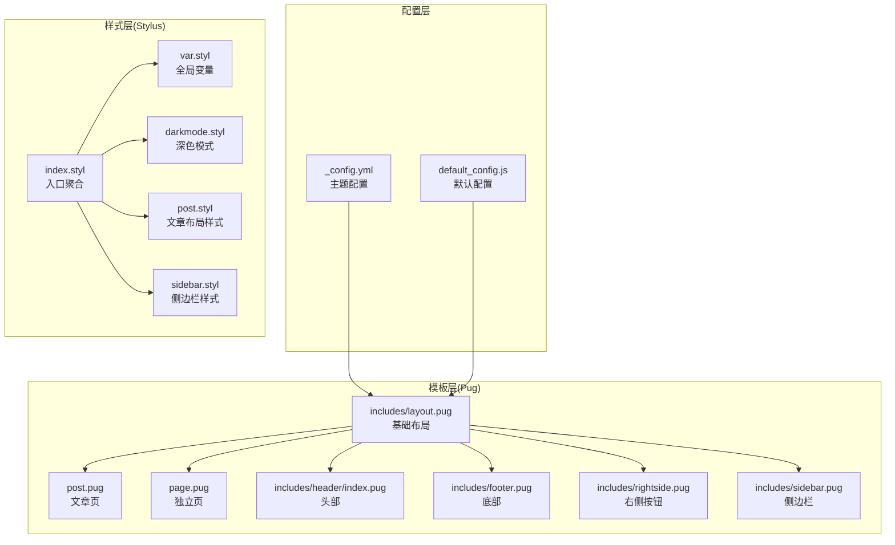
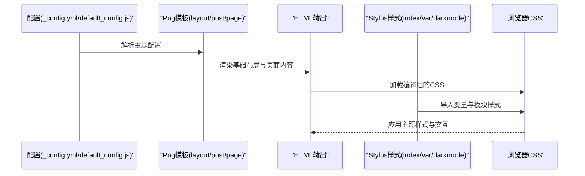
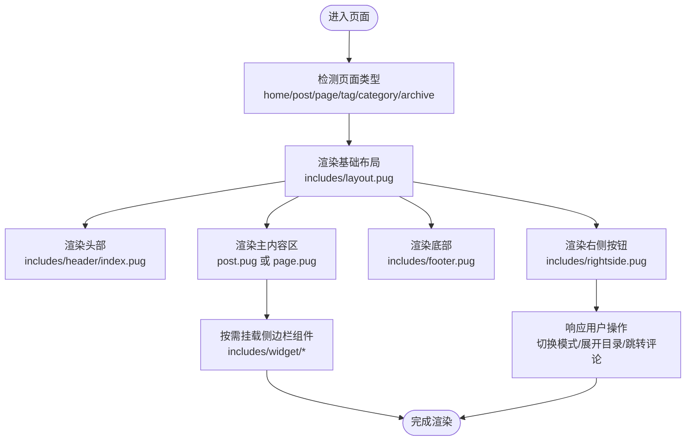
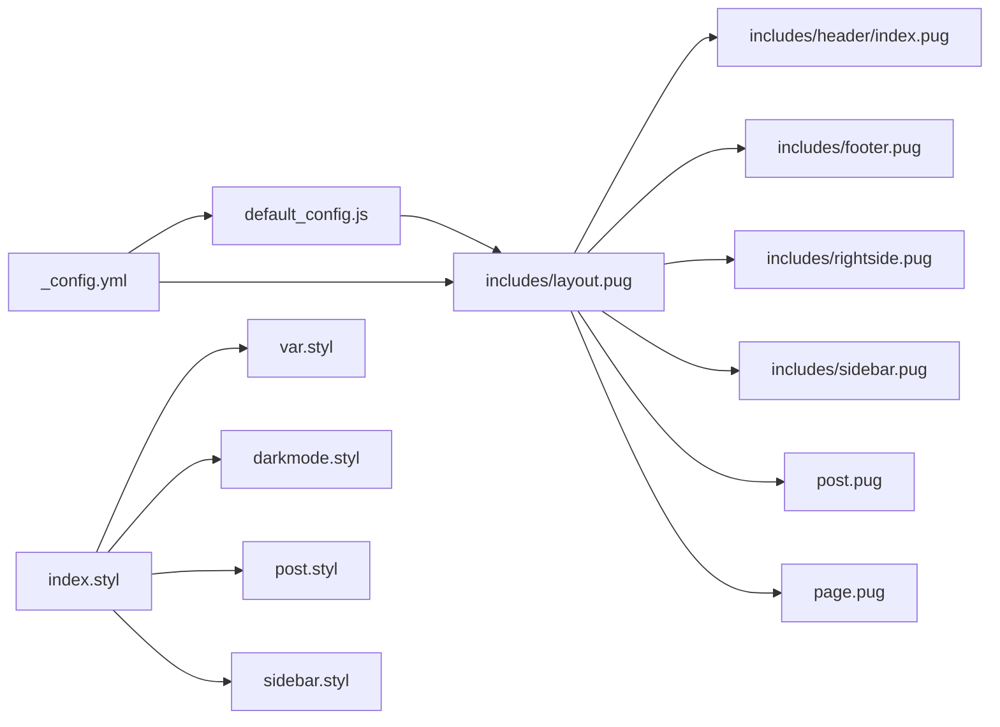

# 主题定制

<cite>
**本文引用的文件**
- [_config.yml](file://themes/butterfly/_config.yml)
- [README_CN.md](file://themes/butterfly/README_CN.md)
- [var.styl](file://themes/butterfly/source/css/var.styl)
- [index.styl](file://themes/butterfly/source/css/index.styl)
- [layout.pug](file://themes/butterfly/layout/includes/layout.pug)
- [post.pug](file://themes/butterfly/layout/post.pug)
- [page.pug](file://themes/butterfly/layout/page.pug)
- [default_config.js](file://themes/butterfly/scripts/common/default_config.js)
- [darkmode.styl](file://themes/butterfly/source/css/_mode/darkmode.styl)
- [header/index.pug](file://themes/butterfly/layout/headers/index.pug)
- [footer.pug](file://themes/butterfly/layout/includes/footer.pug)
- [rightside.pug](file://themes/butterfly/layout/includes/rightside.pug)
- [sidebar.styl](file://themes/butterfly/source/css/_layout/sidebar.styl)
- [post.styl](file://themes/butterfly/source/css/_layout/post.styl)
</cite>

## 目录
1. [简介](#简介)
2. [项目结构](#项目结构)
3. [核心组件](#核心组件)
4. [架构总览](#架构总览)
5. [详细组件分析](#详细组件分析)
6. [依赖关系分析](#依赖关系分析)
7. [性能考量](#性能考量)
8. [故障排查指南](#故障排查指南)
9. [结论](#结论)
10. [附录](#附录)

## 简介
本指南面向希望对 Butterfly 主题进行深度定制与美化的用户，系统讲解主题的结构与工作原理，涵盖 Pug 模板系统与 Stylus 样式系统；详解主题配置项的使用方法（颜色主题、字体设置、布局调整等）；提供自定义样式开发方法（CSS 覆盖、变量定制、响应式设计等）；说明模板文件的结构与修改路径（头部、底部、侧边栏等组件）；并给出主题切换、动画效果、图标系统等高级定制技巧与实际案例。

## 项目结构
Butterfly 主题采用“模板 + 样式 + 脚本 + 配置”的分层组织方式：
- 配置层：主题配置文件集中于主题根目录的配置文件中，覆盖导航、封面图、代码块、评论、搜索、深色模式、加载动画等全局选项。
- 模板层：基于 Pug 的布局与页面模板，通过继承与包含实现复用，如基础布局、文章页、独立页、头部、底部、右侧悬浮按钮、侧边栏等。
- 样式层：基于 Stylus 的模块化样式，通过变量、混合器与条件编译实现主题色彩、排版、布局与模式切换。
- 脚本层：默认配置脚本为运行时提供默认值与开关控制，便于二次开发与扩展。



**图表来源**
- [_config.yml:1-1137](file://themes/butterfly/_config.yml#L1-L1137)
- [default_config.js:1-602](file://themes/butterfly/scripts/common/default_config.js#L1-L602)
- [layout.pug:1-59](file://themes/butterfly/layout/includes/layout.pug#L1-L59)
- [post.pug:1-36](file://themes/butterfly/layout/post.pug#L1-L36)
- [page.pug:1-32](file://themes/butterfly/layout/page.pug#L1-L32)
- [header/index.pug:1-52](file://themes/butterfly/layout/headers/index.pug#L1-L52)
- [footer.pug:1-40](file://themes/butterfly/layout/includes/footer.pug#L1-L40)
- [rightside.pug:1-54](file://themes/butterfly/layout/includes/rightside.pug#L1-L54)
- [index.styl:1-15](file://themes/butterfly/source/css/index.styl#L1-L15)
- [var.styl:1-233](file://themes/butterfly/source/css/var.styl#L1-L233)
- [darkmode.styl:1-205](file://themes/butterfly/source/css/_mode/darkmode.styl#L1-L205)
- [post.styl:1-265](file://themes/butterfly/source/css/_layout/post.styl#L1-L265)
- [sidebar.styl:1-97](file://themes/butterfly/source/css/_layout/sidebar.styl#L1-L97)

**章节来源**
- [_config.yml:1-1137](file://themes/butterfly/_config.yml#L1-L1137)
- [README_CN.md:1-194](file://themes/butterfly/README_CN.md#L1-L194)
- [default_config.js:1-602](file://themes/butterfly/scripts/common/default_config.js#L1-L602)
- [layout.pug:1-59](file://themes/butterfly/layout/includes/layout.pug#L1-L59)
- [post.pug:1-36](file://themes/butterfly/layout/post.pug#L1-L36)
- [page.pug:1-32](file://themes/butterfly/layout/page.pug#L1-L32)
- [header/index.pug:1-52](file://themes/butterfly/layout/headers/index.pug#L1-L52)
- [footer.pug:1-40](file://themes/butterfly/layout/includes/footer.pug#L1-L40)
- [rightside.pug:1-54](file://themes/butterfly/layout/includes/rightside.pug#L1-L54)
- [index.styl:1-15](file://themes/butterfly/source/css/index.styl#L1-L15)
- [var.styl:1-233](file://themes/butterfly/source/css/var.styl#L1-L233)
- [darkmode.styl:1-205](file://themes/butterfly/source/css/_mode/darkmode.styl#L1-L205)
- [post.styl:1-265](file://themes/butterfly/source/css/_layout/post.styl#L1-L265)
- [sidebar.styl:1-97](file://themes/butterfly/source/css/_layout/sidebar.styl#L1-L97)

## 核心组件
- 主题配置中心：集中管理导航、封面图、代码块、社交头像、背景、副标题、首页布局、文章元信息、TOC、版权、打赏、相关文章、分页、过期提醒、底部、侧边栏、右侧按钮、翻译、阅读模式、深色模式、锚点、复制、字数统计、不蒜子、数学公式、搜索、分享、评论系统、聊天、分析、广告、站点验证、美化、圆角、遮罩、加载动画等。
- Pug 模板体系：基础布局负责页面骨架与挂载点，文章页与独立页分别承载内容区与组件渲染，头部根据页面类型动态选择顶部图与文案，底部支持导航区块、版权与自定义文本，右侧按钮区支持阅读模式、简繁切换、深色模式、隐藏侧边栏、目录、聊天、评论跳转等。
- Stylus 样式体系：通过 var.styl 统一变量与主题色，index.styl 聚合各模块样式，darkmode.styl 提供深色模式变量与适配规则，post.styl 与 sidebar.styl 分别处理文章内容与侧边栏交互细节。

**章节来源**
- [_config.yml:1-1137](file://themes/butterfly/_config.yml#L1-L1137)
- [layout.pug:1-59](file://themes/butterfly/layout/includes/layout.pug#L1-L59)
- [post.pug:1-36](file://themes/butterfly/layout/post.pug#L1-L36)
- [page.pug:1-32](file://themes/butterfly/layout/page.pug#L1-L32)
- [header/index.pug:1-52](file://themes/butterfly/layout/headers/index.pug#L1-L52)
- [footer.pug:1-40](file://themes/butterfly/layout/includes/footer.pug#L1-L40)
- [rightside.pug:1-54](file://themes/butterfly/layout/includes/rightside.pug#L1-L54)
- [index.styl:1-15](file://themes/butterfly/source/css/index.styl#L1-L15)
- [var.styl:1-233](file://themes/butterfly/source/css/var.styl#L1-L233)
- [darkmode.styl:1-205](file://themes/butterfly/source/css/_mode/darkmode.styl#L1-L205)
- [post.styl:1-265](file://themes/butterfly/source/css/_layout/post.styl#L1-L265)
- [sidebar.styl:1-97](file://themes/butterfly/source/css/_layout/sidebar.styl#L1-L97)

## 架构总览
Butterfly 的前端渲染链路如下：
- 配置解析：主题配置与默认配置共同决定页面行为与外观。
- 模板渲染：Pug 模板根据页面类型与配置生成 HTML 结构。
- 样式编译：Stylus 编译为 CSS，按需引入模块样式与变量。
- 运行时注入：部分动态逻辑（如背景轮播、评论加载、右侧按钮显示顺序）在模板中通过条件与循环实现。



**图表来源**
- [_config.yml:1-1137](file://themes/butterfly/_config.yml#L1-L1137)
- [default_config.js:1-602](file://themes/butterfly/scripts/common/default_config.js#L1-L602)
- [layout.pug:1-59](file://themes/butterfly/layout/includes/layout.pug#L1-L59)
- [post.pug:1-36](file://themes/butterfly/layout/post.pug#L1-L36)
- [page.pug:1-32](file://themes/butterfly/layout/page.pug#L1-L32)
- [index.styl:1-15](file://themes/butterfly/source/css/index.styl#L1-L15)
- [var.styl:1-233](file://themes/butterfly/source/css/var.styl#L1-L233)
- [darkmode.styl:1-205](file://themes/butterfly/source/css/_mode/darkmode.styl#L1-L205)

## 详细组件分析

### Pug 模板系统
- 基础布局 includes/layout.pug：负责页面骨架、背景图轮播、侧边栏、头部、主内容区、底部与右侧按钮的挂载点，并根据配置决定 aside 显示与隐藏。
- 文章页 post.pug：渲染文章容器、过期提醒、版权信息、标签与分享、打赏、分页、相关文章、评论区等。
- 独立页 page.pug：根据 page.type 渲染不同页面组件（标签页、友链、分类、404、说说等），并可按需加载评论。
- 头部 header/index.pug：根据页面类型选择顶部图与文案，支持首页副标题与社交图标。
- 底部 footer.pug：支持多区块导航、版权信息与自定义文本。
- 右侧按钮 rightside.pug：根据配置动态显示阅读模式、简繁切换、深色模式、隐藏侧边栏、目录、聊天、评论跳转等。



**图表来源**
- [layout.pug:1-59](file://themes/butterfly/layout/includes/layout.pug#L1-L59)
- [post.pug:1-36](file://themes/butterfly/layout/post.pug#L1-L36)
- [page.pug:1-32](file://themes/butterfly/layout/page.pug#L1-L32)
- [header/index.pug:1-52](file://themes/butterfly/layout/headers/index.pug#L1-L52)
- [footer.pug:1-40](file://themes/butterfly/layout/includes/footer.pug#L1-L40)
- [rightside.pug:1-54](file://themes/butterfly/layout/includes/rightside.pug#L1-L54)

**章节来源**
- [layout.pug:1-59](file://themes/butterfly/layout/includes/layout.pug#L1-L59)
- [post.pug:1-36](file://themes/butterfly/layout/post.pug#L1-L36)
- [page.pug:1-32](file://themes/butterfly/layout/page.pug#L1-L32)
- [header/index.pug:1-52](file://themes/butterfly/layout/headers/index.pug#L1-L52)
- [footer.pug:1-40](file://themes/butterfly/layout/includes/footer.pug#L1-L40)
- [rightside.pug:1-54](file://themes/butterfly/layout/includes/rightside.pug#L1-L54)

### Stylus 样式系统
- 入口 index.styl：统一导入第三方样式、变量、全局、高亮、页面、布局、标签插件与模式样式。
- 全局变量 var.styl：集中定义主题色、字体、字号、间距、卡片背景、滚动条、表格、搜索、评论开关、过期提醒、画廊、预加载、烟花、Note 样式等变量，并支持通过配置启用主题色覆盖。
- 深色模式 darkmode.styl：在深色模式下重设变量与组件适配，包括背景、卡片、侧栏菜单、按钮、高亮、Gitalk、Waline、Artalk 等。
- 文章布局 post.styl：定义标题前缀图标、列表样式、链接、图片、锚点、段落、表格、版权信息、过期提醒与广告容器等。
- 侧边栏 sidebar.styl：定义菜单遮罩、侧栏抽屉、菜单组展开收起、子菜单过渡与圆角等交互样式。

```mermaid
classDiagram
class VarStyl {
"+主题色变量"
"+字体与字号"
"+页面与组件变量"
"+Note/Tab/Timeline变量"
}
class DarkmodeStyl {
"+深色模式变量覆盖"
"+组件适配规则"
}
class PostStyl {
"+标题前缀图标"
"+列表/链接/图片"
"+锚点/版权/过期提醒"
}
class SidebarStyl {
"+侧栏抽屉"
"+菜单组展开"
"+子菜单过渡"
}
class IndexStyl {
"+导入聚合"
}
IndexStyl --> VarStyl : "导入"
IndexStyl --> DarkmodeStyl : "导入"
IndexStyl --> PostStyl : "导入"
IndexStyl --> SidebarStyl : "导入"
```

**图表来源**
- [index.styl:1-15](file://themes/butterfly/source/css/index.styl#L1-L15)
- [var.styl:1-233](file://themes/butterfly/source/css/var.styl#L1-L233)
- [darkmode.styl:1-205](file://themes/butterfly/source/css/_mode/darkmode.styl#L1-L205)
- [post.styl:1-265](file://themes/butterfly/source/css/_layout/post.styl#L1-L265)
- [sidebar.styl:1-97](file://themes/butterfly/source/css/_layout/sidebar.styl#L1-L97)

**章节来源**
- [index.styl:1-15](file://themes/butterfly/source/css/index.styl#L1-L15)
- [var.styl:1-233](file://themes/butterfly/source/css/var.styl#L1-L233)
- [darkmode.styl:1-205](file://themes/butterfly/source/css/_mode/darkmode.styl#L1-L205)
- [post.styl:1-265](file://themes/butterfly/source/css/_layout/post.styl#L1-L265)
- [sidebar.styl:1-97](file://themes/butterfly/source/css/_layout/sidebar.styl#L1-L97)

### 主题配置选项与使用方法
- 导航与封面图：控制导航是否固定、Logo、副标题与打字机效果、首页顶部图高度与信息位置、默认与各页面封面图、底部背景图、网站背景（支持数组随机）。
- 代码块：主题、mac 风格、高度限制、自动换行、工具栏（复制/语言/收缩/全屏）。
- 社交媒体与头像：社交链接、头像与特效。
- 文章与首页：首页布局（多种排列）、摘要策略与长度、文章元信息位置与字段、TOC 开关与样式、版权信息、打赏、编辑链接、相关文章、分页方向、过期提醒。
- 侧边栏与右侧按钮：开启/隐藏、按钮、移动端显示、位置、卡片开关与参数、右侧按钮显示顺序与动画。
- 模式与美化：阅读模式、深色模式（按钮与自动切换时段）、简繁转换、圆角、对齐、遮罩、加载动画。
- 字体与排版：全局字体、代码字体、字号、标题前缀图标与颜色。
- 数学公式、搜索、分享、评论系统、聊天、分析、广告、站点验证、标签插件、音乐播放器、Mermaid/Chart.js、PWA、懒加载、CDN 等。

**章节来源**
- [_config.yml:1-1137](file://themes/butterfly/_config.yml#L1-L1137)
- [README_CN.md:58-131](file://themes/butterfly/README_CN.md#L58-L131)
- [default_config.js:1-602](file://themes/butterfly/scripts/common/default_config.js#L1-L602)

### 自定义样式开发方法
- 使用主题色覆盖：通过配置启用主题色并设置主色、分页、按钮悬停、选中、链接、元信息、分割线、代码前景/背景、目录、引用边框/背景、滚动条等颜色。
- 字体与字号：通过配置调整全局与代码字体、字号，或在 Stylus 中直接覆盖变量。
- 响应式设计：利用现有断点与媒体查询（如最大宽度 900px 的样式片段）编写移动端适配。
- CSS 覆盖：在站点资源目录下新增自定义样式文件，通过主题配置注入到页面头部或底部，以保证优先级。
- 动画与过渡：参考现有 hover、transform、opacity、transition 的使用模式，结合配置项（如深色模式按钮旋转动画）进行扩展。

**章节来源**
- [var.styl:1-233](file://themes/butterfly/source/css/var.styl#L1-L233)
- [darkmode.styl:1-205](file://themes/butterfly/source/css/_mode/darkmode.styl#L1-L205)
- [post.styl:1-265](file://themes/butterfly/source/css/_layout/post.styl#L1-L265)
- [sidebar.styl:1-97](file://themes/butterfly/source/css/_layout/sidebar.styl#L1-L97)
- [_config.yml:756-800](file://themes/butterfly/_config.yml#L756-L800)

### 模板文件结构与修改方法
- 基础布局：在 includes/layout.pug 中调整 aside 显示、背景图轮播、主容器类名与挂载点。
- 文章页：在 post.pug 中增删版权、打赏、分页、相关文章、评论区挂载点。
- 独立页：在 page.pug 中增删特定页面组件（标签、友链、分类、404、说说）。
- 头部：在 header/index.pug 中调整顶部图选择逻辑、副标题与社交图标渲染。
- 底部：在 footer.pug 中增减导航区块、版权与自定义文本。
- 侧边栏：在 includes/sidebar.pug 中增删菜单项与卡片组件。
- 右侧按钮：在 rightside.pug 中调整显示顺序、按钮图标与交互。

**章节来源**
- [layout.pug:1-59](file://themes/butterfly/layout/includes/layout.pug#L1-L59)
- [post.pug:1-36](file://themes/butterfly/layout/post.pug#L1-L36)
- [page.pug:1-32](file://themes/butterfly/layout/page.pug#L1-L32)
- [header/index.pug:1-52](file://themes/butterfly/layout/headers/index.pug#L1-L52)
- [footer.pug:1-40](file://themes/butterfly/layout/includes/footer.pug#L1-L40)
- [rightside.pug:1-54](file://themes/butterfly/layout/includes/rightside.pug#L1-L54)

### 高级定制技巧
- 主题切换：通过深色模式配置与按钮实现手动切换；可结合系统偏好与时间段自动切换。
- 动画效果：利用现有过渡与 transform（如侧栏抽屉、菜单展开）作为参考，扩展新的交互动效。
- 图标系统：统一使用 Font Awesome 图标，可在模板中替换图标类名或通过配置启用/禁用图标。
- 背景轮播：在基础布局中启用背景数组后，会自动在 DOM 加载与 PJAX 完成事件中切换背景。
- 评论与分享：在独立页模板中按需加载评论组件；分享按钮由分享系统配置决定。

**章节来源**
- [layout.pug:15-39](file://themes/butterfly/layout/includes/layout.pug#L15-L39)
- [rightside.pug:1-54](file://themes/butterfly/layout/includes/rightside.pug#L1-L54)
- [post.pug:33-35](file://themes/butterfly/layout/post.pug#L33-L35)
- [page.pug:7-11](file://themes/butterfly/layout/page.pug#L7-L11)

## 依赖关系分析
- 配置依赖：模板渲染依赖主题配置与默认配置；Stylus 变量依赖配置中的主题色与开关。
- 模板依赖：基础布局依赖头部、底部、右侧按钮与侧边栏；文章页与独立页依赖各自组件与第三方挂载点。
- 样式依赖：index.styl 聚合 var.styl、darkmode.styl、post.styl、sidebar.styl 等模块样式。



**图表来源**
- [_config.yml:1-1137](file://themes/butterfly/_config.yml#L1-L1137)
- [default_config.js:1-602](file://themes/butterfly/scripts/common/default_config.js#L1-L602)
- [layout.pug:1-59](file://themes/butterfly/layout/includes/layout.pug#L1-L59)
- [post.pug:1-36](file://themes/butterfly/layout/post.pug#L1-L36)
- [page.pug:1-32](file://themes/butterfly/layout/page.pug#L1-L32)
- [header/index.pug:1-52](file://themes/butterfly/layout/headers/index.pug#L1-L52)
- [footer.pug:1-40](file://themes/butterfly/layout/includes/footer.pug#L1-L40)
- [rightside.pug:1-54](file://themes/butterfly/layout/includes/rightside.pug#L1-L54)
- [index.styl:1-15](file://themes/butterfly/source/css/index.styl#L1-L15)
- [var.styl:1-233](file://themes/butterfly/source/css/var.styl#L1-L233)
- [darkmode.styl:1-205](file://themes/butterfly/source/css/_mode/darkmode.styl#L1-L205)
- [post.styl:1-265](file://themes/butterfly/source/css/_layout/post.styl#L1-L265)
- [sidebar.styl:1-97](file://themes/butterfly/source/css/_layout/sidebar.styl#L1-L97)

**章节来源**
- [_config.yml:1-1137](file://themes/butterfly/_config.yml#L1-L1137)
- [default_config.js:1-602](file://themes/butterfly/scripts/common/default_config.js#L1-L602)
- [layout.pug:1-59](file://themes/butterfly/layout/includes/layout.pug#L1-L59)
- [post.pug:1-36](file://themes/butterfly/layout/post.pug#L1-L36)
- [page.pug:1-32](file://themes/butterfly/layout/page.pug#L1-L32)
- [header/index.pug:1-52](file://themes/butterfly/layout/headers/index.pug#L1-L52)
- [footer.pug:1-40](file://themes/butterfly/layout/includes/footer.pug#L1-L40)
- [rightside.pug:1-54](file://themes/butterfly/layout/includes/rightside.pug#L1-L54)
- [index.styl:1-15](file://themes/butterfly/source/css/index.styl#L1-L15)
- [var.styl:1-233](file://themes/butterfly/source/css/var.styl#L1-L233)
- [darkmode.styl:1-205](file://themes/butterfly/source/css/_mode/darkmode.styl#L1-L205)
- [post.styl:1-265](file://themes/butterfly/source/css/_layout/post.styl#L1-L265)
- [sidebar.styl:1-97](file://themes/butterfly/source/css/_layout/sidebar.styl#L1-L97)

## 性能考量
- 图片懒加载：可通过配置启用懒加载与模糊占位，减少首屏压力。
- 背景轮播：背景数组切换在 PJAX 事件中触发，避免重复计算。
- 代码块：可设置高度限制与自动换行，提升长代码阅读体验。
- 搜索与分析：按需启用本地搜索或 Algolia，避免不必要的脚本加载。
- 深色模式：仅在启用时应用深色变量与组件适配，降低冗余样式体积。

## 故障排查指南
- 模板未生效：检查模板继承与包含路径是否正确，确认页面类型判断逻辑与 aside 显示条件。
- 样式冲突：确认自定义样式优先级高于主题样式；检查 Stylus 导入顺序与变量覆盖。
- 深色模式异常：核对深色模式开关与自动切换时段配置，确保数据属性与 CSS 变量一致。
- 评论/分享不可用：确认独立页模板中已挂载对应组件，且第三方服务配置正确。
- 背景轮播无效：确认配置中背景数组存在且基础布局中启用了背景轮播逻辑。

**章节来源**
- [layout.pug:15-39](file://themes/butterfly/layout/includes/layout.pug#L15-L39)
- [post.pug:33-35](file://themes/butterfly/layout/post.pug#L33-L35)
- [page.pug:7-11](file://themes/butterfly/layout/page.pug#L7-L11)
- [darkmode.styl:1-205](file://themes/butterfly/source/css/_mode/darkmode.styl#L1-L205)

## 结论
Butterfly 主题通过清晰的配置、模板与样式分层，提供了强大的可定制能力。遵循本文档的结构与方法，您可以高效地完成主题色、字体、布局、动画与交互的定制，并在不影响升级的前提下维护个性化样式与功能。

## 附录
- 实际定制案例建议
  - 主题色定制：在配置中启用主题色覆盖，设置主色与按钮悬停色，观察 var.styl 与 darkmode.styl 的变量映射。
  - 响应式优化：针对窄屏设备增加断点样式，参考现有媒体查询与容器宽度设置。
  - 侧边栏交互：在 sidebar.styl 中扩展菜单组展开动画或子菜单过渡效果。
  - 评论与分享：在 page.pug 中按需加载评论组件，确保第三方服务配置正确。
  - 背景轮播：在基础布局中配置背景数组，观察 DOM 事件中的切换逻辑。