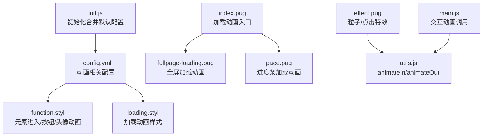
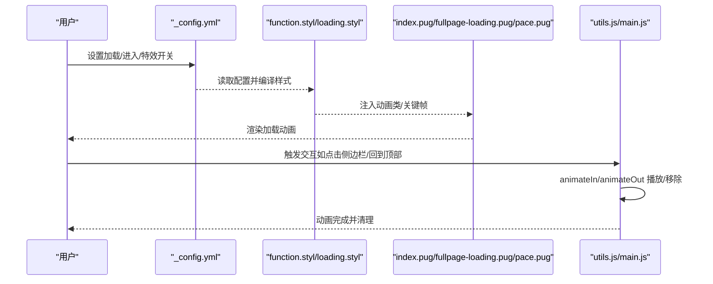
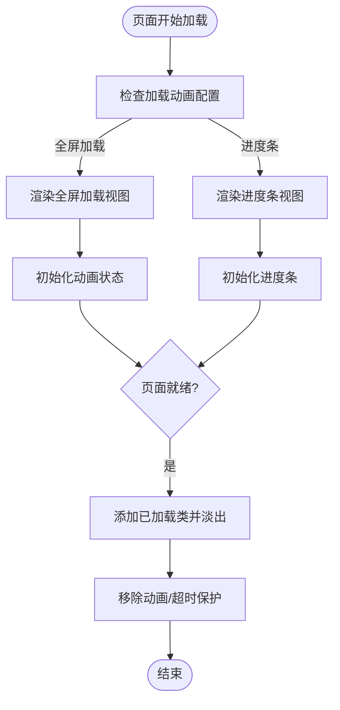
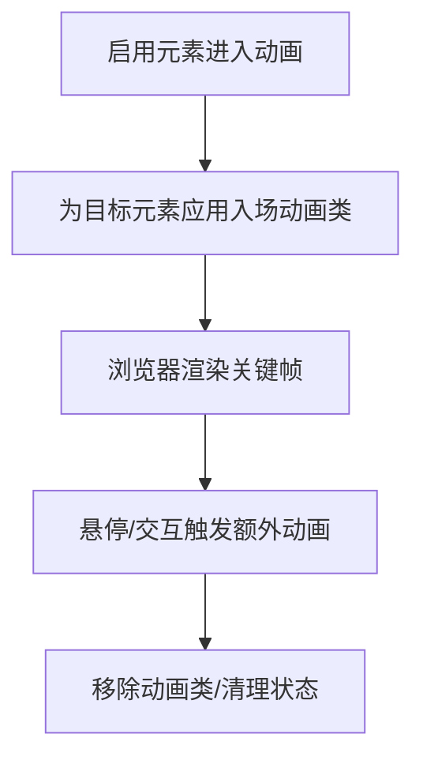
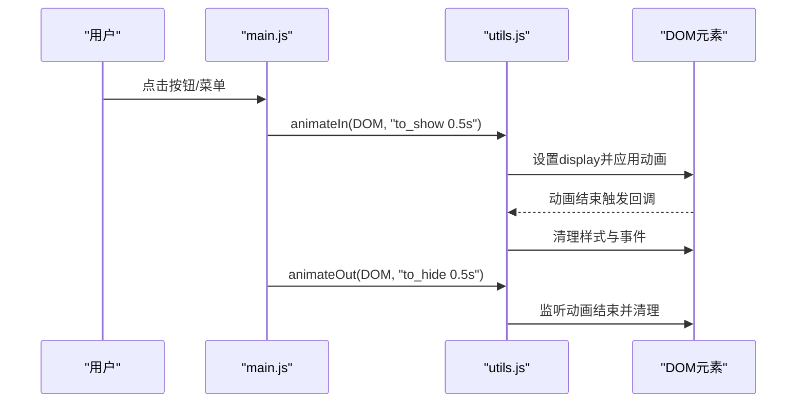
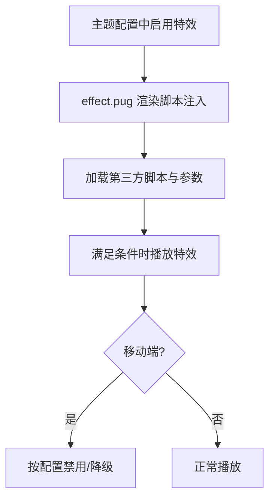
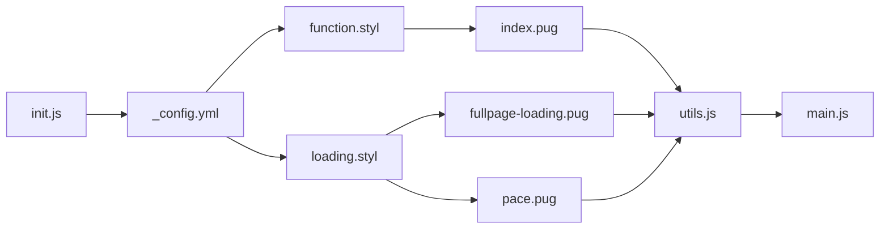

# 动画效果

<cite>
**本文引用的文件**
- [_config.yml](file://themes/butterfly/_config.yml)
- [loading.styl](file://themes/butterfly/source/css/_layout/loading.styl)
- [function.styl](file://themes/butterfly/source/css/_global/function.styl)
- [var.styl](file://themes/butterfly/source/css/var.styl)
- [index.pug](file://themes/butterfly/layout/includes/loading/index.pug)
- [fullpage-loading.pug](file://themes/butterfly/layout/includes/loading/fullpage-loading.pug)
- [pace.pug](file://themes/butterfly/layout/includes/loading/pace.pug)
- [effect.pug](file://themes/butterfly/layout/includes/third-party/effect.pug)
- [utils.js](file://themes/butterfly/source/js/utils.js)
- [main.js](file://themes/butterfly/source/js/main.js)
- [init.js](file://themes/butterfly/scripts/events/init.js)
</cite>

## 目录
1. [简介](#简介)
2. [项目结构](#项目结构)
3. [核心组件](#核心组件)
4. [架构总览](#架构总览)
5. [详细组件分析](#详细组件分析)
6. [依赖关系分析](#依赖关系分析)
7. [性能考量](#性能考量)
8. [故障排查指南](#故障排查指南)
9. [结论](#结论)
10. [附录](#附录)

## 简介
本指南聚焦于 Butterfly 主题提供的动画效果体系，覆盖加载动画、页面过渡、元素进入与交互反馈等。文档将从配置项入手，解析样式与脚本如何协同实现动画，并给出自定义与优化建议，帮助你在不同设备上获得流畅且可定制的动画体验。

## 项目结构
围绕动画相关的主题文件主要分布在以下位置：
- 配置：主题配置文件中包含加载动画、元素进入动画、头像旋转等开关与参数
- 样式：全局函数样式与布局样式分别定义动画触发条件与关键帧
- 视图：加载动画的 Pug 片段按配置选择全屏加载或进度条两种模式
- 脚本：工具函数封装通用动画播放与移除逻辑；主入口处理侧边栏、回到顶部等交互动画

图表来源
- [_config.yml](file://themes/butterfly/_config.yml)
- [function.styl](file://themes/butterfly/source/css/_global/function.styl)
- [loading.styl](file://themes/butterfly/source/css/_layout/loading.styl)
- [index.pug](file://themes/butterfly/layout/includes/loading/index.pug)
- [fullpage-loading.pug](file://themes/butterfly/layout/includes/loading/fullpage-loading.pug)
- [pace.pug](file://themes/butterfly/layout/includes/loading/pace.pug)
- [effect.pug](file://themes/butterfly/layout/includes/third-party/effect.pug)
- [utils.js](file://themes/butterfly/source/js/utils.js)
- [main.js](file://themes/butterfly/source/js/main.js)
- [init.js](file://themes/butterfly/scripts/events/init.js)

章节来源
- [_config.yml](file://themes/butterfly/_config.yml)
- [index.pug](file://themes/butterfly/layout/includes/loading/index.pug)

## 核心组件
- 加载动画（全屏/进度条）
  - 配置入口：在主题配置中开启加载动画并选择源类型
  - 全屏加载：通过左右分屏与旋转边框组合实现“打开”视觉，完成后淡出并移除
  - 进度条加载：基于第三方库的进度条，支持 PJAX 时重启
- 元素进入动画（页面/导航/标题/侧栏）
  - 通过全局样式在启用时自动对目标元素应用入场动画
  - 关键帧包括从下方弹入、标题缩放、侧栏子菜单滑入等
- 交互反馈动画（按钮悬停、回到顶部、侧边栏开合）
  - 使用工具函数统一播放/移除动画，确保生命周期内资源释放
- 特效动画（烟花/彩带/爱心/打字）
  - 通过第三方脚本注入并在满足条件时播放，支持移动端开关

章节来源
- [_config.yml](file://themes/butterfly/_config.yml)
- [loading.styl](file://themes/butterfly/source/css/_layout/loading.styl)
- [function.styl](file://themes/butterfly/source/css/_global/function.styl)
- [index.pug](file://themes/butterfly/layout/includes/loading/index.pug)
- [fullpage-loading.pug](file://themes/butterfly/layout/includes/loading/fullpage-loading.pug)
- [pace.pug](file://themes/butterfly/layout/includes/loading/pace.pug)
- [effect.pug](file://themes/butterfly/layout/includes/third-party/effect.pug)
- [utils.js](file://themes/butterfly/source/js/utils.js)
- [main.js](file://themes/butterfly/source/js/main.js)

## 架构总览
动画系统由“配置 -> 样式 -> 视图 -> 脚本”四层构成：
- 配置层：决定是否启用各类动画及参数
- 样式层：定义动画触发条件与关键帧
- 视图层：根据配置渲染对应动画片段
- 脚本层：提供动画播放/移除工具与交互触发

图表来源
- [_config.yml](file://themes/butterfly/_config.yml)
- [function.styl](file://themes/butterfly/source/css/_global/function.styl)
- [loading.styl](file://themes/butterfly/source/css/_layout/loading.styl)
- [index.pug](file://themes/butterfly/layout/includes/loading/index.pug)
- [fullpage-loading.pug](file://themes/butterfly/layout/includes/loading/fullpage-loading.pug)
- [pace.pug](file://themes/butterfly/layout/includes/loading/pace.pug)
- [utils.js](file://themes/butterfly/source/js/utils.js)
- [main.js](file://themes/butterfly/source/js/main.js)

## 详细组件分析

### 加载动画（全屏/进度条）
- 配置项
  - 开关与源类型：在主题配置中启用加载动画并选择“全屏加载”或“进度条”
- 全屏加载动画
  - 视图：全屏左右分屏背景与旋转边框组合，文字提示“加载中”
  - 逻辑：页面加载完成后添加“已加载”类，触发动画淡出；同时设置超时保护
  - 适配：PJAX 时监听发送/完成事件以重置状态
- 进度条加载动画
  - 视图：注入进度条样式与脚本，配置重启策略
  - 逻辑：PJAX 发送时重启进度条，保证切换页时可见性一致

图表来源
- [index.pug](file://themes/butterfly/layout/includes/loading/index.pug)
- [fullpage-loading.pug](file://themes/butterfly/layout/includes/loading/fullpage-loading.pug)
- [pace.pug](file://themes/butterfly/layout/includes/loading/pace.pug)
- [loading.styl](file://themes/butterfly/source/css/_layout/loading.styl)

章节来源
- [_config.yml](file://themes/butterfly/_config.yml)
- [index.pug](file://themes/butterfly/layout/includes/loading/index.pug)
- [fullpage-loading.pug](file://themes/butterfly/layout/includes/loading/fullpage-loading.pug)
- [pace.pug](file://themes/butterfly/layout/includes/loading/pace.pug)
- [loading.styl](file://themes/butterfly/source/css/_layout/loading.styl)

### 元素进入动画（页面/导航/标题/侧栏）
- 触发条件
  - 在主题配置中启用元素进入动画后，全局样式会为内容区、页眉、站点标题/副标题、侧栏菜单等元素添加入场动画
- 关键帧
  - 从下方弹入、标题缩放、侧栏子菜单逐项滑入、滚动指示器抖动等
- 头像旋转
  - 当头像旋转开关开启时，头像图片将执行持续旋转动画

图表来源
- [function.styl](file://themes/butterfly/source/css/_global/function.styl)
- [var.styl](file://themes/butterfly/source/css/var.styl)

章节来源
- [function.styl](file://themes/butterfly/source/css/_global/function.styl)
- [var.styl](file://themes/butterfly/source/css/var.styl)

### 交互反馈动画（按钮/回到顶部/侧边栏）
- 统一工具
  - 工具函数提供动画播放与移除能力，接收元素与动画名称，自动处理结束事件清理
- 典型场景
  - 侧边栏开合：使用工具函数播放/移除入场/出场动画
  - 回到顶部：平滑滚动至顶部，配合百分比显示
  - 搜索对话框：打开/关闭时播放对应动画序列

图表来源
- [main.js](file://themes/butterfly/source/js/main.js)
- [utils.js](file://themes/butterfly/source/js/utils.js)

章节来源
- [main.js](file://themes/butterfly/source/js/main.js)
- [utils.js](file://themes/butterfly/source/js/utils.js)

### 特效动画（烟花/彩带/爱心/打字）
- 特效清单
  - 烟花、画布彩带、飘带、Canvas 网、PowerMode、爱心点击、点击文字等
- 启用方式
  - 在主题配置中开启对应特效，并可设置移动端开关、参数等
- 资源加载
  - 通过视图片段动态注入脚本与参数，按需加载第三方资源

图表来源
- [effect.pug](file://themes/butterfly/layout/includes/third-party/effect.pug)
- [_config.yml](file://themes/butterfly/_config.yml)

章节来源
- [effect.pug](file://themes/butterfly/layout/includes/third-party/effect.pug)
- [_config.yml](file://themes/butterfly/_config.yml)

## 依赖关系分析
- 配置与样式的耦合
  - 配置项决定是否编译对应动画样式；样式层通过条件判断控制动画类与关键帧
- 视图与脚本的协作
  - 视图负责渲染动画片段；脚本负责播放/移除动画并清理事件
- 初始化流程
  - 初始化阶段合并默认配置，避免缺失导致的运行期错误

图表来源
- [_config.yml](file://themes/butterfly/_config.yml)
- [function.styl](file://themes/butterfly/source/css/_global/function.styl)
- [loading.styl](file://themes/butterfly/source/css/_layout/loading.styl)
- [index.pug](file://themes/butterfly/layout/includes/loading/index.pug)
- [fullpage-loading.pug](file://themes/butterfly/layout/includes/loading/fullpage-loading.pug)
- [pace.pug](file://themes/butterfly/layout/includes/loading/pace.pug)
- [utils.js](file://themes/butterfly/source/js/utils.js)
- [main.js](file://themes/butterfly/source/js/main.js)
- [init.js](file://themes/butterfly/scripts/events/init.js)

章节来源
- [init.js](file://themes/butterfly/scripts/events/init.js)
- [_config.yml](file://themes/butterfly/_config.yml)

## 性能考量
- 减少不必要的动画
  - 对移动端或低性能设备，建议关闭复杂特效与全屏加载动画
- 合理使用关键帧
  - 将动画属性限制在合成层友好的属性上，避免频繁触发布局与绘制
- 控制动画数量与时长
  - 同屏动画过多会引发掉帧，建议分批触发并缩短动画时长
- 利用节流/防抖
  - 对滚动、窗口尺寸变化等高频事件，使用工具函数进行节流/防抖
- 资源懒加载
  - 特效脚本按需注入，避免首屏阻塞

## 故障排查指南
- 加载动画不出现
  - 检查配置中的开关与源类型是否正确
  - 确认视图片段是否被正确渲染
- 动画卡顿或掉帧
  - 关闭复杂特效，减少同时播放的动画数量
  - 使用浏览器性能面板定位瓶颈
- PJAX 切换后动画异常
  - 确保在 PJAX 发送/完成事件中重置/重启动画状态
- 移动端表现不佳
  - 关闭移动端特效或降低动画时长与复杂度

章节来源
- [index.pug](file://themes/butterfly/layout/includes/loading/index.pug)
- [fullpage-loading.pug](file://themes/butterfly/layout/includes/loading/fullpage-loading.pug)
- [pace.pug](file://themes/butterfly/layout/includes/loading/pace.pug)
- [utils.js](file://themes/butterfly/source/js/utils.js)

## 结论
Butterfly 的动画体系以配置驱动、样式约束、视图渲染与脚本控制为核心，既提供了开箱即用的加载与元素进入动画，也允许通过特效插件扩展更丰富的交互体验。遵循本文的配置与优化建议，可在保证性能的前提下实现高质量的动画效果。

## 附录
- 动画配置速查
  - 加载动画：开关与源类型
  - 元素进入动画：开关
  - 头像旋转：开关
  - 特效动画：逐项开关与移动端控制
- 自定义动画最佳实践
  - 使用简洁的关键帧，优先使用 transform/opacity
  - 控制动画时长与延迟，避免叠加
  - 为移动端提供降级方案
  - 通过工具函数统一流程，确保清理与回收