# 样式定制

<cite>
**本文引用的文件**
- [themes/butterfly/_config.yml](file://themes/butterfly/_config.yml)
- [themes/butterfly/scripts/events/stylus.js](file://themes/butterfly/scripts/events/stylus.js)
- [themes/butterfly/source/css/var.styl](file://themes/butterfly/source/css/var.styl)
- [themes/butterfly/source/css/index.styl](file://themes/butterfly/source/css/index.styl)
- [themes/butterfly/source/css/_global/index.styl](file://themes/butterfly/source/css/_global/index.styl)
- [themes/butterfly/source/css/_global/function.styl](file://themes/butterfly/source/css/_global/function.styl)
- [themes/butterfly/source/css/_mode/darkmode.styl](file://themes/butterfly/source/css/_mode/darkmode.styl)
- [themes/butterfly/source/css/_page/homepage.styl](file://themes/butterfly/source/css/_page/homepage.styl)
- [themes/butterfly/source/css/_layout/post.styl](file://themes/butterfly/source/css/_layout/post.styl)
- [themes/butterfly/source/css/_layout/aside.styl](file://themes/butterfly/source/css/_layout/aside.styl)
- [themes/butterfly/source/css/_tags/button.styl](file://themes/butterfly/source/css/_tags/button.styl)
- [themes/butterfly/source/css/_tags/note.styl](file://themes/butterfly/source/css/_tags/note.styl)
- [themes/butterfly/source/css/_highlight/highlight/index.styl](file://themes/butterfly/source/css/_highlight/highlight/index.styl)
- [source/css/custom.css](file://source/css/custom.css)
- [source/css/override.css](file://source/css/override.css)
</cite>

## 目录
1. [简介](#简介)
2. [项目结构](#项目结构)
3. [核心组件](#核心组件)
4. [架构总览](#架构总览)
5. [详细组件分析](#详细组件分析)
6. [依赖关系分析](#依赖关系分析)
7. [性能考量](#性能考量)
8. [故障排查指南](#故障排查指南)
9. [结论](#结论)
10. [附录](#附录)

## 简介
本指南面向需要对 Butterfly 主题进行样式定制的用户与维护者，系统讲解 Stylus 预处理器在项目中的使用方式与语法特性，并深入解析主题样式系统的架构：变量体系、混入与函数、组件化样式组织、深浅色主题切换、响应式设计策略，以及覆盖默认样式、添加自定义 CSS 的实践方法。同时提供颜色主题定制、字体配置、间距调整等实用技巧，并给出调试与性能优化建议。

## 项目结构
主题样式采用模块化组织，Stylus 文件按功能域拆分，通过入口文件统一导入，形成清晰的层次结构：
- 入口与第三方库：入口样式文件引入第三方基础样式与全局变量、布局、页面、标签插件、模式（深色/阅读）等模块。
- 全局层：定义 CSS 变量桥接、通用选择器与基础排版、可复用混入与函数、媒体查询工具等。
- 页面层：首页、归档、分类、标签等页面特定样式。
- 布局层：文章容器、侧边栏、页脚、分页等布局组件样式。
- 模式层：深色模式与阅读模式的差异化样式。
- 标签插件层：按钮、Note 提示块等标签插件样式。
- 代码高亮层：基于 highlight/prismjs 的代码块样式。
- 自定义层：用户提供的自定义 CSS 与覆盖样式文件。

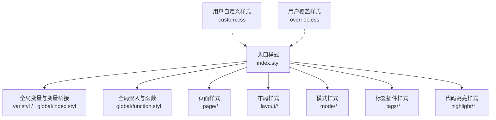

图表来源
- [themes/butterfly/source/css/index.styl:1-15](file://themes/butterfly/source/css/index.styl#L1-L15)
- [themes/butterfly/source/css/var.styl:1-233](file://themes/butterfly/source/css/var.styl#L1-L233)
- [themes/butterfly/source/css/_global/index.styl:1-287](file://themes/butterfly/source/css/_global/index.styl#L1-L287)
- [themes/butterfly/source/css/_global/function.styl:1-348](file://themes/butterfly/source/css/_global/function.styl#L1-L348)
- [themes/butterfly/source/css/_page/homepage.styl:1-175](file://themes/butterfly/source/css/_page/homepage.styl#L1-L175)
- [themes/butterfly/source/css/_layout/post.styl:1-265](file://themes/butterfly/source/css/_layout/post.styl#L1-L265)
- [themes/butterfly/source/css/_layout/aside.styl:1-435](file://themes/butterfly/source/css/_layout/aside.styl#L1-L435)
- [themes/butterfly/source/css/_mode/darkmode.styl:1-205](file://themes/butterfly/source/css/_mode/darkmode.styl#L1-L205)
- [themes/butterfly/source/css/_tags/button.styl:1-64](file://themes/butterfly/source/css/_tags/button.styl#L1-L64)
- [themes/butterfly/source/css/_tags/note.styl:1-126](file://themes/butterfly/source/css/_tags/note.styl#L1-L126)
- [themes/butterfly/source/css/_highlight/highlight/index.styl:1-40](file://themes/butterfly/source/css/_highlight/highlight/index.styl#L1-L40)
- [source/css/custom.css:1-1276](file://source/css/custom.css#L1-L1276)
- [source/css/override.css:1-333](file://source/css/override.css#L1-L333)

章节来源
- [themes/butterfly/source/css/index.styl:1-15](file://themes/butterfly/source/css/index.styl#L1-L15)

## 核心组件
- Stylus 渲染器钩子：在构建阶段注入语法高亮与语言环境变量，供样式条件编译使用。
- 变量系统：集中于全局变量文件，支持主题色、字体、字号、间距、表格、评论、搜索、预加载等多维度变量，并通过 CSS 变量桥接至 :root。
- 混入与函数：提供通用的圆角、卡片悬停、图片悬停、HR 自定义、媒体查询工具、动画等混入，便于组件复用。
- 组件化样式：按页面、布局、模式、标签插件划分模块，每个模块聚焦单一职责，便于维护与扩展。
- 深浅色主题：通过 :root 变量与 [data-theme='dark'] 切换，实现主题色、背景、文本、边框、阴影等的统一切换。
- 响应式设计：以媒体查询混入为核心，配合 Flex/Grid 布局与宽度计算，适配移动端到大屏设备。
- 用户自定义与覆盖：提供自定义 CSS 与覆盖 CSS 两种方式，前者用于新增现代风格样式，后者用于覆盖默认样式。

章节来源
- [themes/butterfly/scripts/events/stylus.js:1-25](file://themes/butterfly/scripts/events/stylus.js#L1-L25)
- [themes/butterfly/source/css/var.styl:1-233](file://themes/butterfly/source/css/var.styl#L1-L233)
- [themes/butterfly/source/css/_global/function.styl:1-348](file://themes/butterfly/source/css/_global/function.styl#L1-L348)
- [themes/butterfly/source/css/_global/index.styl:1-287](file://themes/butterfly/source/css/_global/index.styl#L1-L287)
- [themes/butterfly/source/css/_mode/darkmode.styl:1-205](file://themes/butterfly/source/css/_mode/darkmode.styl#L1-L205)

## 架构总览
下图展示样式系统从入口到各模块的导入关系与运行时主题切换机制：

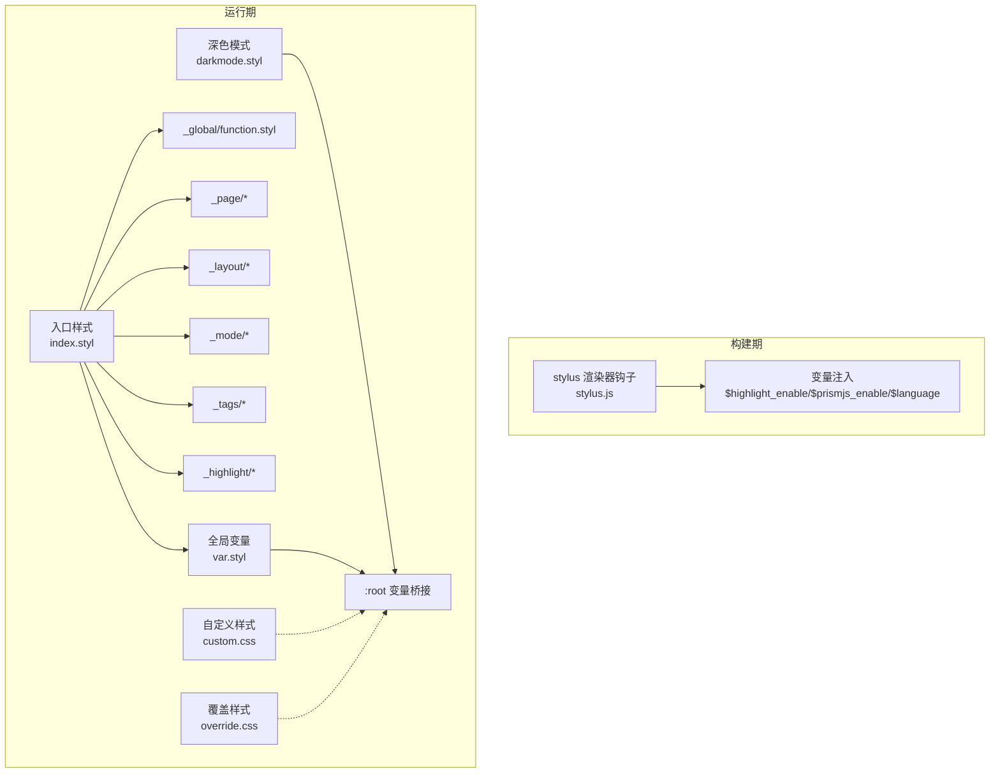

图表来源
- [themes/butterfly/scripts/events/stylus.js:7-23](file://themes/butterfly/scripts/events/stylus.js#L7-L23)
- [themes/butterfly/source/css/index.styl:1-15](file://themes/butterfly/source/css/index.styl#L1-L15)
- [themes/butterfly/source/css/var.styl:1-233](file://themes/butterfly/source/css/var.styl#L1-L233)
- [themes/butterfly/source/css/_global/function.styl:1-348](file://themes/butterfly/source/css/_global/function.styl#L1-L348)
- [themes/butterfly/source/css/_mode/darkmode.styl:1-205](file://themes/butterfly/source/css/_mode/darkmode.styl#L1-L205)
- [source/css/custom.css:1-1276](file://source/css/custom.css#L1-L1276)
- [source/css/override.css:1-333](file://source/css/override.css#L1-L333)

## 详细组件分析

### Stylus 渲染器与变量注入
- 渲染器钩子在构建阶段读取 Hexo 配置，注入语法高亮开关与语言变量，供样式条件编译使用。
- 注入变量包括：$highlight_enable、$highlight_line_number、$prismjs_enable、$prismjs_line_number、$language。

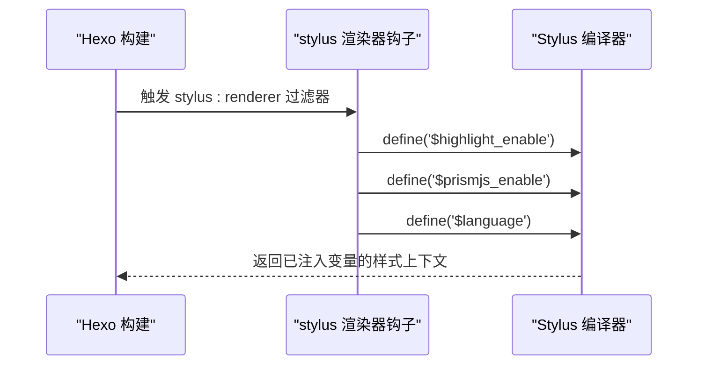

图表来源
- [themes/butterfly/scripts/events/stylus.js:7-23](file://themes/butterfly/scripts/events/stylus.js#L7-L23)

章节来源
- [themes/butterfly/scripts/events/stylus.js:1-25](file://themes/butterfly/scripts/events/stylus.js#L1-L25)

### 变量系统与 CSS 变量桥接
- 全局变量文件集中定义颜色、字体、字号、间距、表格、评论、搜索、预加载等变量，并通过 :root 将其映射为 CSS 变量，实现运行时主题切换。
- 支持主题色配置：当启用主题色时，优先使用配置值，否则回退到默认色板。
- 字体与字号：支持全局字体族、代码字体族、站点标题字体的配置；字号默认 14px 并可按需调整。
- 页面尺寸：首页顶部图高度、站点信息位置等可通过配置项控制。

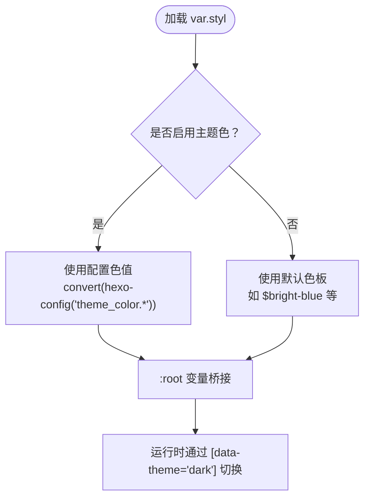

图表来源
- [themes/butterfly/source/css/var.styl:1-233](file://themes/butterfly/source/css/var.styl#L1-L233)
- [themes/butterfly/source/css/_global/index.styl:1-41](file://themes/butterfly/source/css/_global/index.styl#L1-L41)

章节来源
- [themes/butterfly/source/css/var.styl:1-233](file://themes/butterfly/source/css/var.styl#L1-L233)
- [themes/butterfly/source/css/_global/index.styl:1-41](file://themes/butterfly/source/css/_global/index.styl#L1-L41)

### 混入与函数（Mixins & Functions）
- 圆角控制：addBorderRadius(x, hide)，受 rounded_corners_ui 配置影响。
- 卡片悬停：.cardHover、.imgHover、.postImgHover，统一阴影与过渡效果。
- HR 自定义：.custom-hr，支持图标与悬停动画。
- 媒体查询：maxWidth600()/maxWidth768()/minWidth900() 等，便于响应式断点管理。
- 动画：多种关键帧动画，如滚动提示、标题缩放、侧边栏展开等。

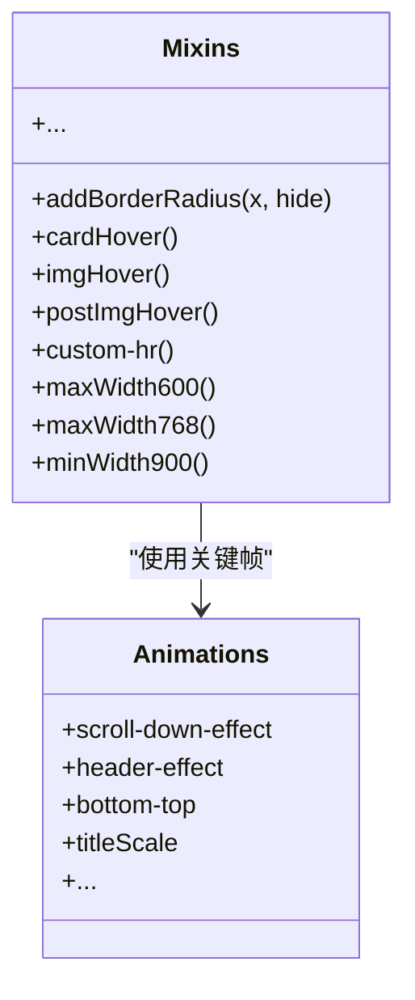

图表来源
- [themes/butterfly/source/css/_global/function.styl:18-348](file://themes/butterfly/source/css/_global/function.styl#L18-L348)

章节来源
- [themes/butterfly/source/css/_global/function.styl:1-348](file://themes/butterfly/source/css/_global/function.styl#L1-L348)

### 页面样式（首页）
- 首页布局支持多种布局模式（1~7），通过配置项 index_layout 控制卡片排列与封面显示策略。
- 响应式断点：在不同屏幕宽度下自动调整卡片宽度、封面高度与文字排版。
- 悬停放大：封面图片悬停时缩放，增强交互体验。

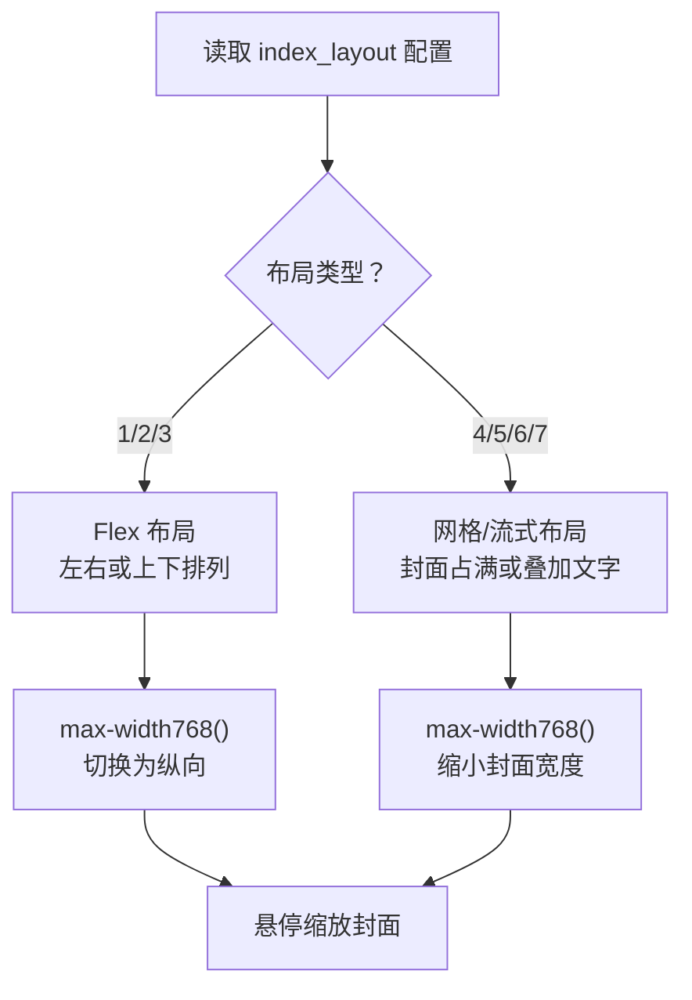

图表来源
- [themes/butterfly/source/css/_page/homepage.styl:1-175](file://themes/butterfly/source/css/_page/homepage.styl#L1-L175)

章节来源
- [themes/butterfly/source/css/_page/homepage.styl:1-175](file://themes/butterfly/source/css/_page/homepage.styl#L1-L175)

### 布局样式（文章与侧边栏）
- 文章容器：统一段落、标题、列表、表格、代码块、内联代码、kbd 键盘符号等排版。
- 侧边栏：卡片组件统一使用 .cardHover，支持移动端隐藏、粘性定位、目录树展开/折叠等交互。
- 响应式：在小屏设备上侧边栏与目录面板采用固定定位与缩放动画，提升可用性。

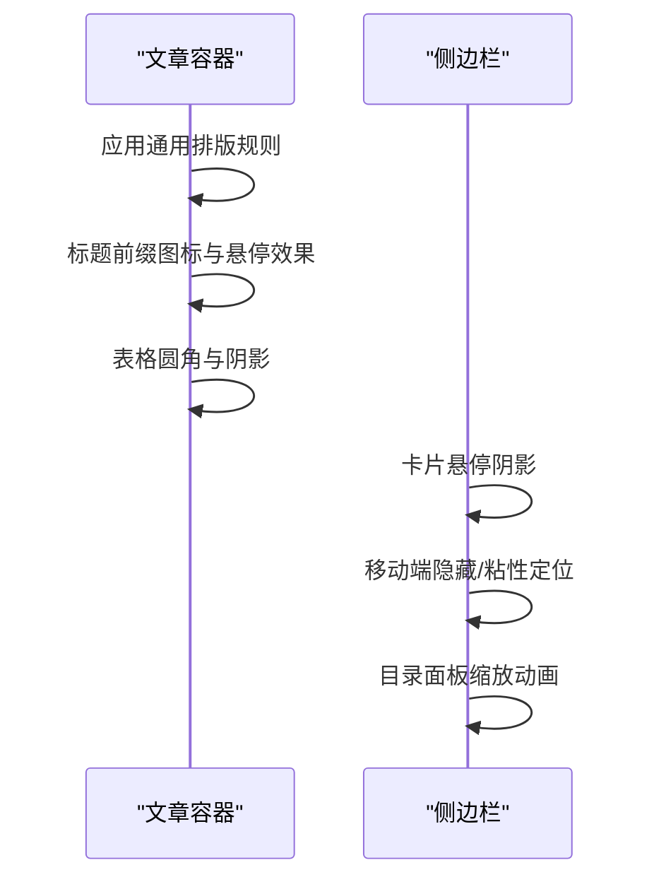

图表来源
- [themes/butterfly/source/css/_layout/post.styl:1-265](file://themes/butterfly/source/css/_layout/post.styl#L1-L265)
- [themes/butterfly/source/css/_layout/aside.styl:1-435](file://themes/butterfly/source/css/_layout/aside.styl#L1-L435)

章节来源
- [themes/butterfly/source/css/_layout/post.styl:1-265](file://themes/butterfly/source/css/_layout/post.styl#L1-L265)
- [themes/butterfly/source/css/_layout/aside.styl:1-435](file://themes/butterfly/source/css/_layout/aside.styl#L1-L435)

### 深色模式
- 通过 [data-theme='dark'] 重定义 :root 变量，实现深色模式下的颜色、背景、阴影、滚动条等统一切换。
- 对代码块、评论区、Gitalk、Waline 等第三方组件进行亮度与对比度适配，确保可读性。

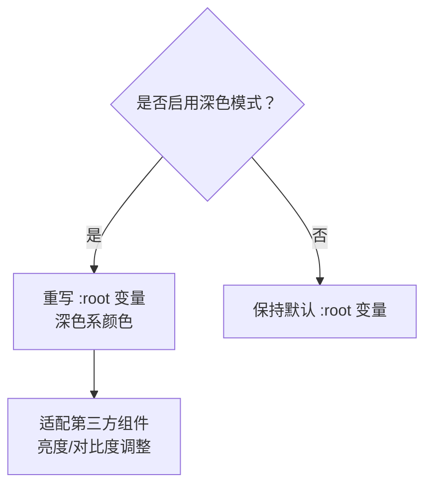

图表来源
- [themes/butterfly/source/css/_mode/darkmode.styl:1-205](file://themes/butterfly/source/css/_mode/darkmode.styl#L1-L205)

章节来源
- [themes/butterfly/source/css/_mode/darkmode.styl:1-205](file://themes/butterfly/source/css/_mode/darkmode.styl#L1-L205)

### 标签插件样式（按钮与 Note）
- 按钮：支持多色类型、描边、块级、加大型等变体，通过 CSS 变量与 :root 值实现主题色联动。
- Note：支持 simple/modern/flat 三种风格，按类型设置边框、背景、图标与文字颜色，支持图标与圆角配置。

```mermaid
classDiagram
class ButtonStyles {
+多色类型
+描边样式
+块级/居中/右对齐
+加大型
}
class NoteStyles {
+simple/modern/flat
+多类型颜色
+图标与圆角
}
ButtonStyles --> Var["CSS 变量桥接"]
NoteStyles --> Var
```

图表来源
- [themes/butterfly/source/css/_tags/button.styl:1-64](file://themes/butterfly/source/css/_tags/button.styl#L1-L64)
- [themes/butterfly/source/css/_tags/note.styl:1-126](file://themes/butterfly/source/css/_tags/note.styl#L1-L126)
- [themes/butterfly/source/css/var.styl:165-182](file://themes/butterfly/source/css/var.styl#L165-L182)

章节来源
- [themes/butterfly/source/css/_tags/button.styl:1-64](file://themes/butterfly/source/css/_tags/button.styl#L1-L64)
- [themes/butterfly/source/css/_tags/note.styl:1-126](file://themes/butterfly/source/css/_tags/note.styl#L1-L126)

### 代码高亮样式
- 支持行号显示与选中行高亮，通过计数器与伪元素生成行号列。
- 高亮主题可配置，未启用时禁用相关样式以减少体积。

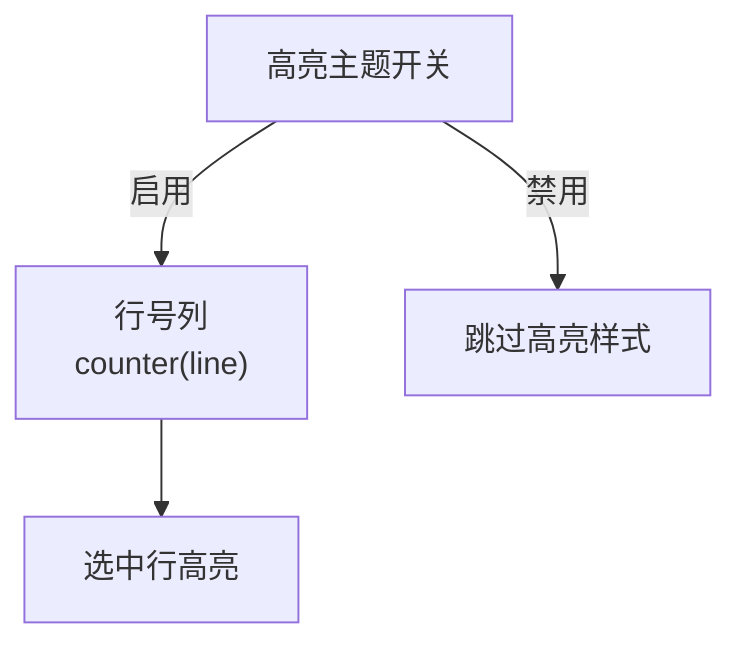

图表来源
- [themes/butterfly/source/css/_highlight/highlight/index.styl:1-40](file://themes/butterfly/source/css/_highlight/highlight/index.styl#L1-L40)

章节来源
- [themes/butterfly/source/css/_highlight/highlight/index.styl:1-40](file://themes/butterfly/source/css/_highlight/highlight/index.styl#L1-L40)

### 用户自定义与覆盖
- 自定义 CSS：新增现代风格的变量与组件样式，通过 :root 与 [data-theme='dark'] 实现主题联动。
- 覆盖 CSS：针对导航栏、侧边栏、文章卡片、右侧按钮、页脚、搜索框、分页等元素进行覆盖，隐藏不需要的元素并调整视觉细节。

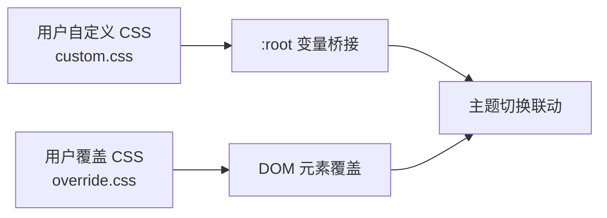

图表来源
- [source/css/custom.css:1-1276](file://source/css/custom.css#L1-L1276)
- [source/css/override.css:1-333](file://source/css/override.css#L1-L333)

章节来源
- [source/css/custom.css:1-1276](file://source/css/custom.css#L1-L1276)
- [source/css/override.css:1-333](file://source/css/override.css#L1-L333)

## 依赖关系分析
- 入口样式 index.styl 作为聚合入口，统一导入全局变量、页面、布局、标签插件、模式与高亮模块。
- 深色模式依赖全局变量桥接的 :root 变量，实现全站颜色切换。
- 响应式依赖混入函数提供的媒体查询断点，避免重复书写 @media。
- 用户自定义与覆盖样式通过 CSS 优先级与选择器权重影响默认样式，建议尽量使用变量与类名而非内联样式。

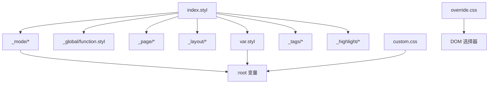

图表来源
- [themes/butterfly/source/css/index.styl:1-15](file://themes/butterfly/source/css/index.styl#L1-L15)
- [themes/butterfly/source/css/var.styl:1-233](file://themes/butterfly/source/css/var.styl#L1-L233)
- [themes/butterfly/source/css/_global/function.styl:1-348](file://themes/butterfly/source/css/_global/function.styl#L1-L348)
- [themes/butterfly/source/css/_mode/darkmode.styl:1-205](file://themes/butterfly/source/css/_mode/darkmode.styl#L1-L205)
- [source/css/custom.css:1-1276](file://source/css/custom.css#L1-L1276)
- [source/css/override.css:1-333](file://source/css/override.css#L1-L333)

章节来源
- [themes/butterfly/source/css/index.styl:1-15](file://themes/butterfly/source/css/index.styl#L1-L15)

## 性能考量
- 减少不必要的 @media 与复杂选择器：优先使用混入函数与语义化类名，降低选择器层级。
- 合理使用 CSS 变量：将常用颜色、间距、阴影等抽象为变量，减少重复定义与重构成本。
- 控制高亮样式体积：在不需要时关闭高亮主题与行号，避免生成大量行号伪元素。
- 图片与动画：合理使用过渡与缩放，避免在低端设备上造成掉帧。
- 自定义样式合并：将多个自定义 CSS 合并为单个文件，减少 HTTP 请求。

## 故障排查指南
- 主题色不生效
  - 检查配置文件中主题色开关与各项颜色键是否存在且格式正确。
  - 确认变量文件中的主题色逻辑与 CSS 变量桥接是否被覆盖。
- 深色模式异常
  - 确认 [data-theme='dark'] 是否正确注入，检查深色模式文件中的变量重写顺序。
  - 验证第三方组件（如评论区、代码块）是否在深色模式下进行了亮度适配。
- 响应式布局错乱
  - 检查媒体查询混入是否正确使用，确认断点与容器宽度匹配。
  - 在小屏设备上验证 Flex/Grid 布局与最小/最大宽度限制。
- 自定义样式未生效
  - 确认自定义 CSS 与覆盖 CSS 的加载顺序与选择器优先级。
  - 使用浏览器开发者工具检查最终渲染结果与 CSS 优先级链路。

章节来源
- [themes/butterfly/_config.yml:756-776](file://themes/butterfly/_config.yml#L756-L776)
- [themes/butterfly/source/css/var.styl:1-233](file://themes/butterfly/source/css/var.styl#L1-L233)
- [themes/butterfly/source/css/_mode/darkmode.styl:1-205](file://themes/butterfly/source/css/_mode/darkmode.styl#L1-L205)
- [themes/butterfly/source/css/_global/function.styl:111-146](file://themes/butterfly/source/css/_global/function.styl#L111-L146)
- [source/css/custom.css:1-1276](file://source/css/custom.css#L1-L1276)
- [source/css/override.css:1-333](file://source/css/override.css#L1-L333)

## 结论
通过模块化的 Stylus 样式体系与完善的变量、混入、响应式与主题切换机制，Butterfly 主题提供了强大的样式定制能力。结合用户自定义与覆盖样式，可在不破坏原有结构的前提下实现个性化的视觉风格与交互体验。建议在定制过程中遵循变量优先、混入复用、媒体查询断点统一的原则，并关注性能与可维护性。

## 附录
- 颜色主题定制要点
  - 在配置文件中启用主题色开关，并设置主色、链接色、选中色、TOC 色等关键色。
  - 使用 CSS 变量桥接，确保深色模式下颜色一致性。
- 字体与字号
  - 通过配置项设置全局字体族与代码字体族，必要时在自定义 CSS 中补充站点标题字体。
- 间距与圆角
  - 使用 rounded_corners_ui 控制全局圆角；在自定义 CSS 中通过 CSS 变量统一管理间距与阴影。
- 响应式设计
  - 使用混入函数统一断点，避免重复书写 @media；在不同布局中测试小屏与大屏表现。
- 调试与优化
  - 使用浏览器开发者工具检查变量与选择器优先级；合并自定义样式文件以减少请求；避免过度动画与复杂滤镜。