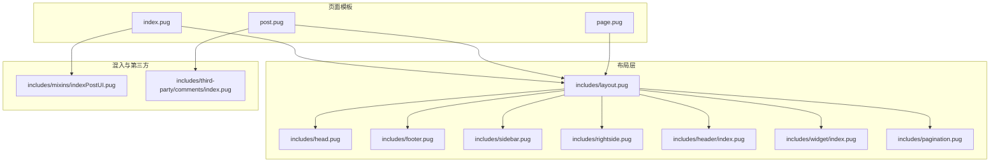
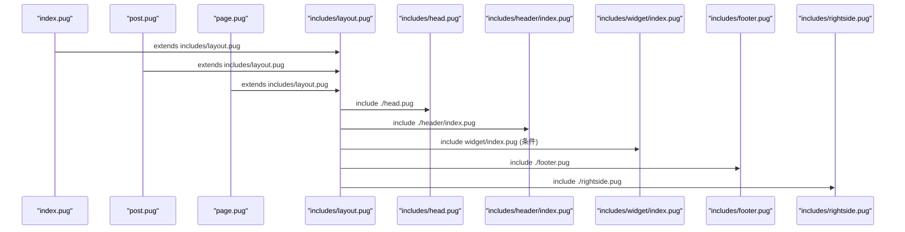
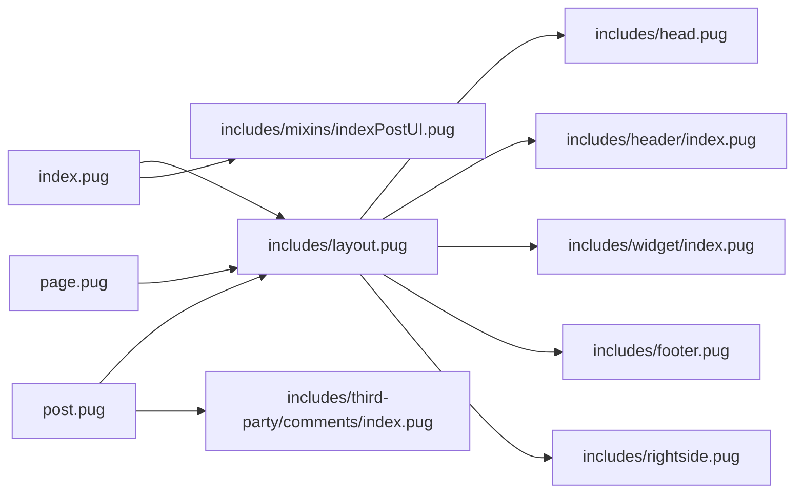

# 模板修改

<cite>
**本文引用的文件**
- [themes/butterfly/layout/index.pug](file://themes/butterfly/layout/index.pug)
- [themes/butterfly/layout/post.pug](file://themes/butterfly/layout/post.pug)
- [themes/butterfly/layout/page.pug](file://themes/butterfly/layout/page.pug)
- [themes/butterfly/layout/includes/layout.pug](file://themes/butterfly/layout/includes/layout.pug)
- [themes/butterfly/layout/includes/head.pug](file://themes/butterfly/layout/includes/head.pug)
- [themes/butterfly/layout/includes/footer.pug](file://themes/butterfly/layout/includes/footer.pug)
- [themes/butterfly/layout/includes/sidebar.pug](file://themes/butterfly/layout/includes/sidebar.pug)
- [themes/butterfly/layout/includes/rightside.pug](file://themes/butterfly/layout/includes/rightside.pug)
- [themes/butterfly/layout/includes/header/index.pug](file://themes/butterfly/layout/includes/header/index.pug)
- [themes/butterfly/layout/includes/widget/index.pug](file://themes/butterfly/layout/includes/widget/index.pug)
- [themes/butterfly/layout/includes/pagination.pug](file://themes/butterfly/layout/includes/pagination.pug)
- [themes/butterfly/layout/includes/mixins/indexPostUI.pug](file://themes/butterfly/layout/includes/mixins/indexPostUI.pug)
- [themes/butterfly/layout/includes/third-party/comments/index.pug](file://themes/butterfly/layout/includes/third-party/comments/index.pug)
- [themes/butterfly/_config.yml](file://themes/butterfly/_config.yml)
</cite>

## 目录
1. [简介](#简介)
2. [项目结构](#项目结构)
3. [核心组件](#核心组件)
4. [架构总览](#架构总览)
5. [详细组件分析](#详细组件分析)
6. [依赖分析](#依赖分析)
7. [性能考虑](#性能考虑)
8. [故障排查指南](#故障排查指南)
9. [结论](#结论)
10. [附录](#附录)

## 简介
本指南面向需要对基于 Hexo 的 Butterfly 主题进行模板修改的用户，系统讲解 Pug 模板系统在该主题中的工作原理与语法特性，并结合实际文件说明布局模板、页面模板、文章模板、组件模板与混入（Mixin）的职责与结构。文档还覆盖模板继承、包含、混入等高级特性，提供常见修改场景（如导航栏、侧边栏、页脚）的实现思路与最佳实践，并给出调试与性能优化建议。

## 项目结构
本主题采用“布局模板 + 页面模板 + 组件与混入 + 第三方集成”的分层组织方式：
- 布局模板：定义全局骨架与通用区块（头部、侧边栏、右侧工具条、页脚、分页等）
- 页面模板：针对不同页面类型（首页、文章页、独立页、归档、标签、分类等）选择性地组合组件
- 组件与混入：可复用的 UI 片段与逻辑封装（如文章列表 UI、目录卡片、评论区等）

图表来源
- [themes/butterfly/layout/includes/layout.pug:1-59](file://themes/butterfly/layout/includes/layout.pug#L1-L59)
- [themes/butterfly/layout/includes/head.pug:1-78](file://themes/butterfly/layout/includes/head.pug#L1-L78)
- [themes/butterfly/layout/includes/footer.pug:1-40](file://themes/butterfly/layout/includes/footer.pug#L1-L40)
- [themes/butterfly/layout/includes/sidebar.pug:1-18](file://themes/butterfly/layout/includes/sidebar.pug#L1-L18)
- [themes/butterfly/layout/includes/rightside.pug:1-54](file://themes/butterfly/layout/includes/rightside.pug#L1-L54)
- [themes/butterfly/layout/includes/header/index.pug:1-52](file://themes/butterfly/layout/includes/header/index.pug#L1-L52)
- [themes/butterfly/layout/includes/widget/index.pug:1-36](file://themes/butterfly/layout/includes/widget/index.pug#L1-L36)
- [themes/butterfly/layout/includes/pagination.pug:1-38](file://themes/butterfly/layout/includes/pagination.pug#L1-L38)
- [themes/butterfly/layout/index.pug:1-5](file://themes/butterfly/layout/index.pug#L1-L5)
- [themes/butterfly/layout/post.pug:1-36](file://themes/butterfly/layout/post.pug#L1-L36)
- [themes/butterfly/layout/page.pug:1-32](file://themes/butterfly/layout/page.pug#L1-L32)
- [themes/butterfly/layout/includes/mixins/indexPostUI.pug:1-119](file://themes/butterfly/layout/includes/mixins/indexPostUI.pug#L1-L119)
- [themes/butterfly/layout/includes/third-party/comments/index.pug:1-47](file://themes/butterfly/layout/includes/third-party/comments/index.pug#L1-L47)

章节来源
- [themes/butterfly/layout/index.pug:1-5](file://themes/butterfly/layout/index.pug#L1-L5)
- [themes/butterfly/layout/post.pug:1-36](file://themes/butterfly/layout/post.pug#L1-L36)
- [themes/butterfly/layout/page.pug:1-32](file://themes/butterfly/layout/page.pug#L1-L32)
- [themes/butterfly/layout/includes/layout.pug:1-59](file://themes/butterfly/layout/includes/layout.pug#L1-L59)

## 核心组件
- 布局骨架 includes/layout.pug：定义 HTML 结构、主题模式、背景、侧边栏开关、主体内容区、页脚与右侧工具条的加载顺序与条件渲染
- 头部 includes/head.pug：负责标题、Open Graph、结构化数据、预连接、站点验证、PWA、样式与注入脚本等
- 页脚 includes/footer.pug：支持多列导航块、版权信息与自定义文本
- 侧边栏 includes/sidebar.pug：展示头像、站点统计与菜单项
- 右侧工具条 includes/rightside.pug：根据配置显示阅读模式、翻译、深色模式、隐藏侧边栏、目录、聊天、评论跳转等按钮
- 头部区域 includes/header/index.pug：根据页面类型设置顶部图与标题信息
- 侧边栏挂件 includes/widget/index.pug：按页面类型动态加载作者、公告、最新文章、目录、分类、标签、归档、站点信息等卡片
- 分页 includes/pagination.pug：首页与文章页分页行为差异化处理
- 首页文章 UI 混入 includes/mixins/indexPostUI.pug：统一控制首页文章列表布局、封面、元信息、评论计数与广告插入
- 文章评论 includes/third-party/comments/index.pug：按配置渲染多种评论系统容器

章节来源
- [themes/butterfly/layout/includes/layout.pug:1-59](file://themes/butterfly/layout/includes/layout.pug#L1-L59)
- [themes/butterfly/layout/includes/head.pug:1-78](file://themes/butterfly/layout/includes/head.pug#L1-L78)
- [themes/butterfly/layout/includes/footer.pug:1-40](file://themes/butterfly/layout/includes/footer.pug#L1-L40)
- [themes/butterfly/layout/includes/sidebar.pug:1-18](file://themes/butterfly/layout/includes/sidebar.pug#L1-L18)
- [themes/butterfly/layout/includes/rightside.pug:1-54](file://themes/butterfly/layout/includes/rightside.pug#L1-L54)
- [themes/butterfly/layout/includes/header/index.pug:1-52](file://themes/butterfly/layout/includes/header/index.pug#L1-L52)
- [themes/butterfly/layout/includes/widget/index.pug:1-36](file://themes/butterfly/layout/includes/widget/index.pug#L1-L36)
- [themes/butterfly/layout/includes/pagination.pug:1-38](file://themes/butterfly/layout/includes/pagination.pug#L1-L38)
- [themes/butterfly/layout/includes/mixins/indexPostUI.pug:1-119](file://themes/butterfly/layout/includes/mixins/indexPostUI.pug#L1-L119)
- [themes/butterfly/layout/includes/third-party/comments/index.pug:1-47](file://themes/butterfly/layout/includes/third-party/comments/index.pug#L1-L47)

## 架构总览
下图展示了从页面模板到布局与组件的调用关系，体现模板继承与包含机制：

图表来源
- [themes/butterfly/layout/index.pug:1-5](file://themes/butterfly/layout/index.pug#L1-L5)
- [themes/butterfly/layout/post.pug:1-36](file://themes/butterfly/layout/post.pug#L1-L36)
- [themes/butterfly/layout/page.pug:1-32](file://themes/butterfly/layout/page.pug#L1-L32)
- [themes/butterfly/layout/includes/layout.pug:1-59](file://themes/butterfly/layout/includes/layout.pug#L1-L59)
- [themes/butterfly/layout/includes/head.pug:1-78](file://themes/butterfly/layout/includes/head.pug#L1-L78)
- [themes/butterfly/layout/includes/header/index.pug:1-52](file://themes/butterfly/layout/includes/header/index.pug#L1-L52)
- [themes/butterfly/layout/includes/widget/index.pug:1-36](file://themes/butterfly/layout/includes/widget/index.pug#L1-L36)
- [themes/butterfly/layout/includes/footer.pug:1-40](file://themes/butterfly/layout/includes/footer.pug#L1-L40)
- [themes/butterfly/layout/includes/rightside.pug:1-54](file://themes/butterfly/layout/includes/rightside.pug#L1-L54)

## 详细组件分析

### 布局模板：includes/layout.pug
- 职责：统一输出 HTML 结构、主题模式、背景、侧边栏开关、主体内容区、页脚与右侧工具条
- 关键点：
  - 通过变量控制 aside 显示/隐藏与页面类型类名
  - 条件加载背景动画与随机背景
  - 加载侧边栏、头部、主内容区、页脚与右侧工具条
  - 支持缓存的局部片段渲染（partial）

章节来源
- [themes/butterfly/layout/includes/layout.pug:1-59](file://themes/butterfly/layout/includes/layout.pug#L1-L59)

### 头部模板：includes/head.pug
- 职责：生成标题、Meta、Open Graph、结构化数据、预连接、站点验证、PWA、样式表与注入脚本
- 关键点：
  - 动态标题与子标题拼接
  - 条件加载字体、snackbar、fancybox 等样式
  - 注入自定义 head 注入与全局配置
  - 条件加载分析与广告脚本

章节来源
- [themes/butterfly/layout/includes/head.pug:1-78](file://themes/butterfly/layout/includes/head.pug#L1-L78)

### 页脚模板：includes/footer.pug
- 职责：渲染页脚导航块、版权信息与自定义文本
- 关键点：
  - 支持多列导航块与子项
  - 年份范围与作者信息
  - 版权与框架版本信息
  - 自定义文本支持

章节来源
- [themes/butterfly/layout/includes/footer.pug:1-40](file://themes/butterfly/layout/includes/footer.pug#L1-L40)

### 侧边栏模板：includes/sidebar.pug
- 职责：展示头像、站点统计数据与菜单项
- 关键点：
  - 读取主题菜单配置
  - 展示文章、标签、分类数量
  - 调用菜单项组件

章节来源
- [themes/butterfly/layout/includes/sidebar.pug:1-18](file://themes/butterfly/layout/includes/sidebar.pug#L1-L18)

### 右侧工具条模板：includes/rightside.pug
- 职责：根据配置动态显示/隐藏右下角功能按钮
- 关键点：
  - 支持阅读模式、翻译、深色模式、隐藏侧边栏、目录、聊天、评论跳转
  - 支持“显隐按钮”自定义排序
  - 移动端目录按钮与回到顶部

章节来源
- [themes/butterfly/layout/includes/rightside.pug:1-54](file://themes/butterfly/layout/includes/rightside.pug#L1-L54)

### 头部区域模板：includes/header/index.pug
- 职责：根据页面类型设置顶部背景图、标题与副标题
- 关键点：
  - 针对首页、文章页、标签、分类、归档与默认页设置不同的顶部图策略
  - 控制固定导航与不同页面的标题展示

章节来源
- [themes/butterfly/layout/includes/header/index.pug:1-52](file://themes/butterfly/layout/includes/header/index.pug#L1-L52)

### 侧边栏挂件模板：includes/widget/index.pug
- 职责：按页面类型加载作者、公告、置顶卡片、目录、系列、最新文章、广告、最新评论、分类、标签、归档、站点信息等
- 关键点：
  - 文章页优先展示目录或作者/公告/置顶卡片
  - 非文章页加载更丰富的卡片集合

章节来源
- [themes/butterfly/layout/includes/widget/index.pug:1-36](file://themes/butterfly/layout/includes/widget/index.pug#L1-L36)

### 分页模板：includes/pagination.pug
- 职责：首页与文章页分页行为差异化
- 关键点：
  - 文章页支持上/下一篇文章与封面描述
  - 首页分页格式化与链接构造

章节来源
- [themes/butterfly/layout/includes/pagination.pug:1-38](file://themes/butterfly/layout/includes/pagination.pug#L1-L38)

### 首页文章 UI 混入：includes/mixins/indexPostUI.pug
- 职责：统一首页文章列表布局、封面、元信息、评论计数与广告插入
- 关键点：
  - 支持多种布局模式（含瀑布流）
  - 元信息包含日期、分类、标签与评论计数
  - 首页广告插入策略

章节来源
- [themes/butterfly/layout/includes/mixins/indexPostUI.pug:1-119](file://themes/butterfly/layout/includes/mixins/indexPostUI.pug#L1-L119)

### 文章评论模板：includes/third-party/comments/index.pug
- 职责：按配置渲染多种评论系统容器
- 关键点：
  - 支持双评论系统切换
  - 按系统类型渲染对应容器

章节来源
- [themes/butterfly/layout/includes/third-party/comments/index.pug:1-47](file://themes/butterfly/layout/includes/third-party/comments/index.pug#L1-L47)

### 页面模板：index.pug、post.pug、page.pug
- index.pug：继承布局，引入首页文章 UI 混入并渲染
- post.pug：继承布局，渲染文章内容、版权、标签分享、打赏、广告、分页、相关文章与评论
- page.pug：继承布局，根据 page.type 选择性包含不同页面组件，并支持评论懒加载

章节来源
- [themes/butterfly/layout/index.pug:1-5](file://themes/butterfly/layout/index.pug#L1-L5)
- [themes/butterfly/layout/post.pug:1-36](file://themes/butterfly/layout/post.pug#L1-L36)
- [themes/butterfly/layout/page.pug:1-32](file://themes/butterfly/layout/page.pug#L1-L32)

## 依赖分析
- 模板继承：index.pug、post.pug、page.pug 通过 extends 引入 includes/layout.pug
- 包含关系：includes/layout.pug 通过 include 引入 head、header、widget、footer、rightside 等
- 混入关系：index.pug 引入 includes/mixins/indexPostUI.pug
- 第三方集成：includes/head.pug 与 includes/third-party/comments/index.pug 分别引入分析、广告与评论系统
- 配置驱动：_config.yml 提供主题配置，影响模板渲染（如导航、侧边栏、页脚、评论、分页、广告等）

图表来源
- [themes/butterfly/layout/index.pug:1-5](file://themes/butterfly/layout/index.pug#L1-L5)
- [themes/butterfly/layout/post.pug:1-36](file://themes/butterfly/layout/post.pug#L1-L36)
- [themes/butterfly/layout/page.pug:1-32](file://themes/butterfly/layout/page.pug#L1-L32)
- [themes/butterfly/layout/includes/layout.pug:1-59](file://themes/butterfly/layout/includes/layout.pug#L1-L59)
- [themes/butterfly/layout/includes/head.pug:1-78](file://themes/butterfly/layout/includes/head.pug#L1-L78)
- [themes/butterfly/layout/includes/header/index.pug:1-52](file://themes/butterfly/layout/includes/header/index.pug#L1-L52)
- [themes/butterfly/layout/includes/widget/index.pug:1-36](file://themes/butterfly/layout/includes/widget/index.pug#L1-L36)
- [themes/butterfly/layout/includes/footer.pug:1-40](file://themes/butterfly/layout/includes/footer.pug#L1-L40)
- [themes/butterfly/layout/includes/rightside.pug:1-54](file://themes/butterfly/layout/includes/rightside.pug#L1-L54)
- [themes/butterfly/layout/includes/mixins/indexPostUI.pug:1-119](file://themes/butterfly/layout/includes/mixins/indexPostUI.pug#L1-L119)
- [themes/butterfly/layout/includes/third-party/comments/index.pug:1-47](file://themes/butterfly/layout/includes/third-party/comments/index.pug#L1-L47)

## 性能考虑
- 使用缓存的局部片段渲染（partial）与片段缓存（fragment_cache）减少重复计算
- 条件加载：仅在需要时加载背景动画、随机背景、分析脚本、广告与第三方样式
- 分页与瀑布流：合理设置首页布局与广告插入频率，避免过度 DOM 渲染
- 图片错误回退：为封面与头像配置错误回退地址，降低资源异常带来的重排成本
- 右侧工具条：通过配置控制按钮显隐，减少不必要的交互元素

## 故障排查指南
- 评论系统不显示
  - 检查页面模板中是否正确调用评论模板与懒加载标志
  - 确认主题配置中评论系统启用与参数正确
- 顶部图未生效
  - 检查页面类型对应的顶部图配置与禁用开关
  - 确认背景路径解析函数与样式拼接
- 侧边栏不显示
  - 检查主题配置中 aside 开关与页面类型显示策略
  - 确认 include 的 widget 是否被条件渲染阻断
- 右侧按钮缺失
  - 检查右侧工具条配置与“显隐按钮”排序
  - 确认页面类型与功能开关（如阅读模式、翻译、深色模式）
- 分页异常
  - 首页分页需确认格式化与链接构造
  - 文章页分页需确认上下文与封面描述逻辑

章节来源
- [themes/butterfly/layout/includes/third-party/comments/index.pug:1-47](file://themes/butterfly/layout/includes/third-party/comments/index.pug#L1-L47)
- [themes/butterfly/layout/includes/header/index.pug:1-52](file://themes/butterfly/layout/includes/header/index.pug#L1-L52)
- [themes/butterfly/layout/includes/widget/index.pug:1-36](file://themes/butterfly/layout/includes/widget/index.pug#L1-L36)
- [themes/butterfly/layout/includes/rightside.pug:1-54](file://themes/butterfly/layout/includes/rightside.pug#L1-L54)
- [themes/butterfly/layout/includes/pagination.pug:1-38](file://themes/butterfly/layout/includes/pagination.pug#L1-L38)

## 结论
通过模板继承与包含机制，Butterfly 将全局骨架与页面特定内容解耦，配合混入与第三方集成模块，实现了高度可配置与可扩展的模板体系。遵循本文的结构与流程分析，可以高效完成导航栏、侧边栏、页脚等常见修改，并在保持性能与可维护性的前提下实现复杂定制。

## 附录

### Pug 模板系统要点与高级特性
- 继承（extends）：页面模板通过 extends 引入布局骨架，统一结构
- 包含（include）：布局模板通过 include 引入头部、侧边栏、页脚等模块
- 混入（mixin）：将可复用的 UI 与逻辑封装为混入，在多个页面中复用
- 局部片段（partial）：用于模块化渲染与缓存，提升性能
- 条件渲染：根据页面类型、主题配置与上下文变量决定渲染内容
- 数据与函数：利用主题配置与辅助函数（如 url_for、date、inject_head_js 等）生成动态内容

章节来源
- [themes/butterfly/layout/includes/layout.pug:1-59](file://themes/butterfly/layout/includes/layout.pug#L1-L59)
- [themes/butterfly/layout/includes/mixins/indexPostUI.pug:1-119](file://themes/butterfly/layout/includes/mixins/indexPostUI.pug#L1-L119)
- [themes/butterfly/layout/includes/head.pug:1-78](file://themes/butterfly/layout/includes/head.pug#L1-L78)

### 常见修改场景与实现方案
- 修改导航栏
  - 在头部模板中调整标题与副标题渲染逻辑，或在菜单配置中增删菜单项
  - 若需完全替换导航结构，可在布局模板中调整头部包含位置与条件
  - 参考：[includes/header/index.pug:1-52](file://themes/butterfly/layout/includes/header/index.pug#L1-L52)、[includes/layout.pug:1-59](file://themes/butterfly/layout/includes/layout.pug#L1-L59)
- 修改侧边栏
  - 调整侧边栏卡片显示策略与内容，或增删卡片
  - 通过主题配置控制 aside 的显示/隐藏与移动端行为
  - 参考：[includes/sidebar.pug:1-18](file://themes/butterfly/layout/includes/sidebar.pug#L1-L18)、[includes/widget/index.pug:1-36](file://themes/butterfly/layout/includes/widget/index.pug#L1-L36)
- 修改页脚
  - 在页脚模板中增减导航块、版权信息与自定义文本
  - 参考：[includes/footer.pug:1-40](file://themes/butterfly/layout/includes/footer.pug#L1-L40)
- 修改文章页内容区域
  - 在文章模板中增删版权、标签分享、打赏、广告、分页与相关文章
  - 参考：[post.pug:1-36](file://themes/butterfly/layout/post.pug#L1-L36)
- 修改首页文章列表
  - 通过混入控制布局、封面、元信息与广告插入
  - 参考：[includes/mixins/indexPostUI.pug:1-119](file://themes/butterfly/layout/includes/mixins/indexPostUI.pug#L1-L119)
- 修改右侧工具条
  - 通过配置控制按钮显隐与排序，或在混入中增删按钮
  - 参考：[includes/rightside.pug:1-54](file://themes/butterfly/layout/includes/rightside.pug#L1-L54)
- 修改评论系统
  - 在评论模板中增删系统容器，或在主题配置中调整启用与参数
  - 参考：[includes/third-party/comments/index.pug:1-47](file://themes/butterfly/layout/includes/third-party/comments/index.pug#L1-L47)、[_config.yml:529-656](file://themes/butterfly/_config.yml#L529-L656)