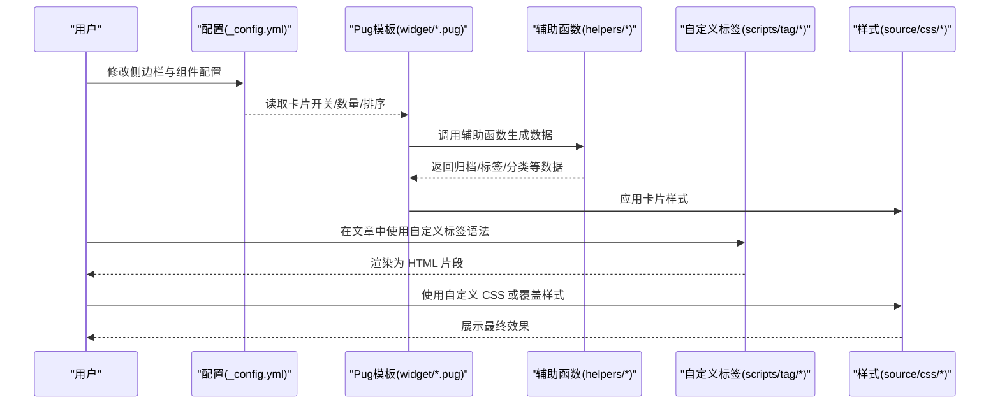
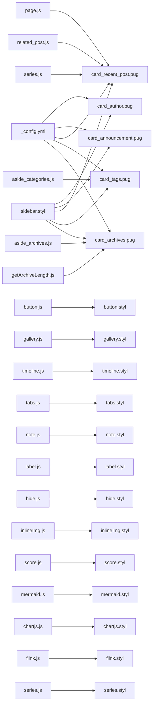

# 组件定制

<cite>
**本文引用的文件**
- [_config.yml](file://themes/butterfly/_config.yml)
- [card_author.pug](file://themes/butterfly/layout/includes/widget/card_author.pug)
- [card_announcement.pug](file://themes/butterfly/layout/includes/widget/card_announcement.pug)
- [card_recent_post.pug](file://themes/butterfly/layout/includes/widget/card_recent_post.pug)
- [card_tags.pug](file://themes/butterfly/layout/includes/widget/card_tags.pug)
- [card_archives.pug](file://themes/butterfly/layout/includes/widget/card_archives.pug)
- [button.js](file://themes/butterfly/scripts/tag/button.js)
- [gallery.js](file://themes/butterfly/scripts/tag/gallery.js)
- [timeline.js](file://themes/butterfly/scripts/tag/timeline.js)
- [aside_archives.js](file://themes/butterfly/scripts/helpers/aside_archives.js)
- [aside_categories.js](file://themes/butterfly/scripts/helpers/aside_categories.js)
- [getArchiveLength.js](file://themes/butterfly/scripts/helpers/getArchiveLength.js)
- [inject_head_js.js](file://themes/butterfly/scripts/helpers/inject_head_js.js)
- [page.js](file://themes/butterfly/scripts/helpers/page.js)
- [related_post.js](file://themes/butterfly/scripts/helpers/related_post.js)
- [series.js](file://themes/butterfly/scripts/helpers/series.js)
- [tabs.js](file://themes/butterfly/scripts/tag/tabs.js)
- [note.js](file://themes/butterfly/scripts/tag/note.js)
- [label.js](file://themes/butterfly/scripts/tag/label.js)
- [hide.js](file://themes/butterfly/scripts/tag/hide.js)
- [inlineImg.js](file://themes/butterfly/scripts/tag/inlineImg.js)
- [score.js](file://themes/butterfly/scripts/tag/score.js)
- [mermaid.js](file://themes/butterfly/scripts/tag/mermaid.js)
- [chartjs.js](file://themes/butterfly/scripts/tag/chartjs.js)
- [flink.js](file://themes/butterfly/scripts/tag/flink.js)
- [series.js](file://themes/butterfly/scripts/tag/series.js)
- [custom.css](file://source/css/custom.css)
- [override.css](file://source/css/override.css)
- [sidebar.styl](file://themes/butterfly/source/css/_layout/sidebar.styl)
- [button.styl](file://themes/butterfly/source/css/_tags/button.styl)
- [gallery.styl](file://themes/butterfly/source/css/_tags/gallery.styl)
- [timeline.styl](file://themes/butterfly/source/css/_tags/timeline.styl)
- [note.styl](file://themes/butterfly/source/css/_tags/note.styl)
- [tabs.styl](file://themes/butterfly/source/css/_tags/tabs.styl)
- [label.styl](file://themes/butterfly/source/css/_tags/label.styl)
- [hide.styl](file://themes/butterfly/source/css/_tags/hide.styl)
- [inlineImg.styl](file://themes/butterfly/source/css/_tags/inlineImg.styl)
- [series.styl](file://themes/butterfly/source/css/_tags/series.styl)
- [chartjs.styl](file://themes/butterfly/source/css/_tags/chartjs.styl)
- [mermaid.styl](file://themes/butterfly/source/css/_tags/mermaid.styl)
- [flink.styl](file://themes/butterfly/source/css/_tags/flink.styl)
- [score.styl](file://themes/butterfly/source/css/_tags/score.styl)
</cite>

## 目录
1. [简介](#简介)
2. [项目结构](#项目结构)
3. [核心组件](#核心组件)
4. [架构总览](#架构总览)
5. [详细组件分析](#详细组件分析)
6. [依赖关系分析](#依赖关系分析)
7. [性能考量](#性能考量)
8. [故障排查指南](#故障排查指南)
9. [结论](#结论)
10. [附录](#附录)

## 简介
本指南面向希望深度定制 Butterfly 主题 UI 的用户与维护者，系统讲解侧边栏组件（作者卡片、公告栏、最新文章、标签云、归档等）与自定义标签（按钮、表格、图库、时间线等）的实现方式、配置项、样式定制与扩展方法。文档同时提供组件组合的最佳实践与常见问题的解决方案，帮助你在不破坏主题结构的前提下实现个性化展示。

## 项目结构
- 主题配置集中在主题根目录的配置文件中，控制侧边栏组件开关、排序、数量、样式等。
- Pug 模板位于 layout/includes/widget 下，负责渲染各侧边栏卡片。
- 自定义标签脚本位于 scripts/tag 下，通过注册标签语法在 Markdown 中使用。
- 辅助函数位于 scripts/helpers 下，用于生成侧边栏数据或注入资源。
- 样式位于 source/css 下，按布局与标签分类组织，便于覆盖与扩展。

```mermaid
graph TB
subgraph "主题配置"
CFG["_config.yml<br/>控制侧边栏与全局行为"]
end
subgraph "模板渲染"
W_AUTHOR["card_author.pug"]
W_ANN["card_announcement.pug"]
W_RECENT["card_recent_post.pug"]
W_TAGS["card_tags.pug"]
W_ARCH["card_archives.pug"]
end
subgraph "自定义标签"
T_BTN["button.js"]
T_GALLERY["gallery.js"]
T_TIMELINE["timeline.js"]
T_TABS["tabs.js"]
T_NOTE["note.js"]
T_LABEL["label.js"]
T_HIDE["hide.js"]
T_INLINEIMG["inlineImg.js"]
T_SCORE["score.js"]
T_MERMAID["mermaid.js"]
T_CHART["chartjs.js"]
T_FLINK["flink.js"]
T_SERIES["series.js"]
end
subgraph "辅助函数"
H_ARCH["aside_archives.js"]
H_CATE["aside_categories.js"]
H_LEN["getArchiveLength.js"]
H_PAGE["page.js"]
H_REL["related_post.js"]
H_SER["series.js"]
end
subgraph "样式"
S_SIDEBAR["sidebar.styl"]
S_BTN["button.styl"]
S_GALLERY["gallery.styl"]
S_TIMELINE["timeline.styl"]
S_NOTE["note.styl"]
S_TABS["tabs.styl"]
S_LABEL["label.styl"]
S_HIDE["hide.styl"]
S_INLINEIMG["inlineImg.styl"]
S_SERIES["series.styl"]
S_CHART["chartjs.styl"]
S_MERMAID["mermaid.styl"]
S_FLINK["flink.styl"]
S_SCORE["score.styl"]
end
CFG --> W_AUTHOR
CFG --> W_ANN
CFG --> W_RECENT
CFG --> W_TAGS
CFG --> W_ARCH
T_BTN --> S_BTN
T_GALLERY --> S_GALLERY
T_TIMELINE --> S_TIMELINE
T_TABS --> S_TABS
T_NOTE --> S_NOTE
T_LABEL --> S_LABEL
T_HIDE --> S_HIDE
T_INLINEIMG --> S_INLINEIMG
T_SCORE --> S_SCORE
T_MERMAID --> S_MERMAID
T_CHART --> S_CHART
T_FLINK --> S_FLINK
T_SERIES --> S_SERIES
H_ARCH --> W_ARCH
H_CATE --> W_TAGS
H_LEN --> W_ARCH
H_PAGE --> W_RECENT
H_REL --> W_RECENT
H_SER --> W_RECENT
```

图表来源
- [_config.yml](file://themes/butterfly/_config.yml)
- [card_author.pug](file://themes/butterfly/layout/includes/widget/card_author.pug)
- [card_announcement.pug](file://themes/butterfly/layout/includes/widget/card_announcement.pug)
- [card_recent_post.pug](file://themes/butterfly/layout/includes/widget/card_recent_post.pug)
- [card_tags.pug](file://themes/butterfly/layout/includes/widget/card_tags.pug)
- [card_archives.pug](file://themes/butterfly/layout/includes/widget/card_archives.pug)
- [button.js](file://themes/butterfly/scripts/tag/button.js)
- [gallery.js](file://themes/butterfly/scripts/tag/gallery.js)
- [timeline.js](file://themes/butterfly/scripts/tag/timeline.js)
- [aside_archives.js](file://themes/butterfly/scripts/helpers/aside_archives.js)
- [aside_categories.js](file://themes/butterfly/scripts/helpers/aside_categories.js)
- [getArchiveLength.js](file://themes/butterfly/scripts/helpers/getArchiveLength.js)
- [page.js](file://themes/butterfly/scripts/helpers/page.js)
- [related_post.js](file://themes/butterfly/scripts/helpers/related_post.js)
- [series.js](file://themes/butterfly/scripts/helpers/series.js)
- [tabs.js](file://themes/butterfly/scripts/tag/tabs.js)
- [note.js](file://themes/butterfly/scripts/tag/note.js)
- [label.js](file://themes/butterfly/scripts/tag/label.js)
- [hide.js](file://themes/butterfly/scripts/tag/hide.js)
- [inlineImg.js](file://themes/butterfly/scripts/tag/inlineImg.js)
- [score.js](file://themes/butterfly/scripts/tag/score.js)
- [mermaid.js](file://themes/butterfly/scripts/tag/mermaid.js)
- [chartjs.js](file://themes/butterfly/scripts/tag/chartjs.js)
- [flink.js](file://themes/butterfly/scripts/tag/flink.js)
- [series.js](file://themes/butterfly/scripts/tag/series.js)
- [sidebar.styl](file://themes/butterfly/source/css/_layout/sidebar.styl)
- [button.styl](file://themes/butterfly/source/css/_tags/button.styl)
- [gallery.styl](file://themes/butterfly/source/css/_tags/gallery.styl)
- [timeline.styl](file://themes/butterfly/source/css/_tags/timeline.styl)
- [note.styl](file://themes/butterfly/source/css/_tags/note.styl)
- [tabs.styl](file://themes/butterfly/source/css/_tags/tabs.styl)
- [label.styl](file://themes/butterfly/source/css/_tags/label.styl)
- [hide.styl](file://themes/butterfly/source/css/_tags/hide.styl)
- [inlineImg.styl](file://themes/butterfly/source/css/_tags/inlineImg.styl)
- [series.styl](file://themes/butterfly/source/css/_tags/series.styl)
- [chartjs.styl](file://themes/butterfly/source/css/_tags/chartjs.styl)
- [mermaid.styl](file://themes/butterfly/source/css/_tags/mermaid.styl)
- [flink.styl](file://themes/butterfly/source/css/_tags/flink.styl)
- [score.styl](file://themes/butterfly/source/css/_tags/score.styl)

章节来源
- [_config.yml](file://themes/butterfly/_config.yml)
- [card_author.pug](file://themes/butterfly/layout/includes/widget/card_author.pug)
- [card_announcement.pug](file://themes/butterfly/layout/includes/widget/card_announcement.pug)
- [card_recent_post.pug](file://themes/butterfly/layout/includes/widget/card_recent_post.pug)
- [card_tags.pug](file://themes/butterfly/layout/includes/widget/card_tags.pug)
- [card_archives.pug](file://themes/butterfly/layout/includes/widget/card_archives.pug)

## 核心组件
- 侧边栏总开关与位置：通过配置项控制是否显示侧边栏、按钮、移动端可见性及位置。
- 卡片显示策略：每个卡片都有独立的开关、数量限制、排序方式与样式选项。
- 数据来源：部分卡片直接使用站点数据（如文章、标签、分类），部分通过辅助函数生成（如归档列表）。
- 样式覆盖：通过自定义 CSS 与主题样式层叠，实现颜色、字体、间距等的统一定制。

章节来源
- [_config.yml](file://themes/butterfly/_config.yml)

## 架构总览
下图展示了从配置到模板渲染再到样式应用的整体流程，以及自定义标签在内容中的执行路径。

图表来源
- [_config.yml](file://themes/butterfly/_config.yml)
- [card_author.pug](file://themes/butterfly/layout/includes/widget/card_author.pug)
- [card_archives.pug](file://themes/butterfly/layout/includes/widget/card_archives.pug)
- [card_tags.pug](file://themes/butterfly/layout/includes/widget/card_tags.pug)
- [card_recent_post.pug](file://themes/butterfly/layout/includes/widget/card_recent_post.pug)
- [button.js](file://themes/butterfly/scripts/tag/button.js)
- [gallery.js](file://themes/butterfly/scripts/tag/gallery.js)
- [timeline.js](file://themes/butterfly/scripts/tag/timeline.js)
- [aside_archives.js](file://themes/butterfly/scripts/helpers/aside_archives.js)
- [sidebar.styl](file://themes/butterfly/source/css/_layout/sidebar.styl)
- [button.styl](file://themes/butterfly/source/css/_tags/button.styl)
- [gallery.styl](file://themes/butterfly/source/css/_tags/gallery.styl)
- [timeline.styl](file://themes/butterfly/source/css/_tags/timeline.styl)

## 详细组件分析

### 作者卡片（card_author）
- 功能：展示头像、昵称、个人简介、社交链接与统计信息（文章数、标签数、分类数）。
- 关键点：
  - 头像与错误回退图片来自配置与错误图配置。
  - 社交图标通过局部模板渲染。
  - 可配置“关注”按钮的图标、文字与链接。
- 定制建议：
  - 通过配置项设置描述与按钮；若需动态文案，可在模板中扩展逻辑。
  - 使用自定义 CSS 调整头像尺寸、间距与排版。

章节来源
- [card_author.pug](file://themes/butterfly/layout/includes/widget/card_author.pug)
- [_config.yml](file://themes/butterfly/_config.yml)

### 公告栏（card_announcement）
- 功能：展示站点公告或提示信息，支持图标与多语言文案。
- 关键点：
  - 内容来自配置项，支持富文本渲染。
  - 图标与标题采用统一的可本地化文案。
- 定制建议：
  - 将公告内容写入配置，避免频繁修改模板。
  - 使用自定义 CSS 控制公告栏背景色、圆角与阴影。

章节来源
- [card_announcement.pug](file://themes/butterfly/layout/includes/widget/card_announcement.pug)
- [_config.yml](file://themes/butterfly/_config.yml)

### 最新文章（card_recent_post）
- 功能：展示最近或最近更新的文章列表，支持封面图与日期显示。
- 关键点：
  - 支持按创建时间或更新时间排序。
  - 可配置显示数量；0 表示不限制。
  - 封面图可关闭或启用，支持图片与纯色背景两种类型。
- 定制建议：
  - 通过配置项调整排序与数量；结合封面开关实现不同视觉风格。
  - 使用自定义 CSS 控制缩略图尺寸、标题截断与时间样式。

章节来源
- [card_recent_post.pug](file://themes/butterfly/layout/includes/widget/card_recent_post.pug)
- [_config.yml](file://themes/butterfly/_config.yml)

### 标签云（card_tags）
- 功能：渲染站点标签云，支持颜色、排序与限制数量。
- 关键点：
  - 支持自定义颜色方案与随机/名称/长度排序。
  - 提供带颜色与无颜色两种渲染模式。
- 定制建议：
  - 通过配置项开启/关闭颜色；自定义颜色数组以匹配品牌色。
  - 使用自定义 CSS 调整字号范围、间距与对齐方式。

章节来源
- [card_tags.pug](file://themes/butterfly/layout/includes/widget/card_tags.pug)
- [_config.yml](file://themes/butterfly/_config.yml)

### 归档（card_archives）
- 功能：按月度或年度展示文章归档，支持格式化与排序。
- 关键点：
  - 通过辅助函数生成归档列表，模板仅负责渲染。
  - 支持格式字符串与排序方向。
- 定制建议：
  - 根据目标受众选择 monthly/yearly；自定义格式字符串以适配本地化。
  - 使用自定义 CSS 控制分组标题与列表项的层级感。

章节来源
- [card_archives.pug](file://themes/butterfly/layout/includes/widget/card_archives.pug)
- [_config.yml](file://themes/butterfly/_config.yml)
- [aside_archives.js](file://themes/butterfly/scripts/helpers/aside_archives.js)

### 自定义标签：按钮（button）
- 语法：通过注册的标签语法在文章中插入带图标与样式的按钮。
- 参数：链接、文本、图标与样式选项（颜色、描边、居中、块级、放大等）。
- 实现要点：
  - 解析参数并拼接 HTML，使用 url_for 生成绝对链接。
  - 样式由标签样式文件控制。
- 定制建议：
  - 使用自定义 CSS 扩展颜色与尺寸；结合按钮容器进行布局微调。

章节来源
- [button.js](file://themes/butterfly/scripts/tag/button.js)
- [button.styl](file://themes/butterfly/source/css/_tags/button.styl)

### 自定义标签：图库（gallery）
- 语法：支持两种模式——传入 URL 或解析文章中的图片 Markdown。
- 参数：按钮开关、每页加载数量、首次加载数量。
- 实现要点：
  - 解析 Markdown 中的图片语法，提取 URL、alt 与 title。
  - 通过 data-* 属性传递参数给前端渲染器。
- 定制建议：
  - 使用自定义 CSS 控制网格列数、间距与响应式布局。
  - 结合懒加载与点击放大增强体验。

章节来源
- [gallery.js](file://themes/butterfly/scripts/tag/gallery.js)
- [gallery.styl](file://themes/butterfly/source/css/_tags/gallery.styl)

### 自定义标签：时间线（timeline）
- 语法：以特定注释包裹的方式组织时间线条目，支持标题与颜色。
- 实现要点：
  - 使用正则匹配条目块，逐个渲染为时间轴项。
  - 支持传入主标题与颜色类名。
- 定制建议：
  - 使用自定义 CSS 调整时间轴线宽、节点大小与内容区宽度。
  - 为不同主题色添加专用样式类。

章节来源
- [timeline.js](file://themes/butterfly/scripts/tag/timeline.js)
- [timeline.styl](file://themes/butterfly/source/css/_tags/timeline.styl)

### 其他常用标签（快速概览）
- 表格、标签、隐藏内容、内联图片、评分、Mermaid、Chart.js、友链、系列等标签均通过类似机制注册，支持在文章中直接使用。
- 建议：
  - 优先使用官方标签语法，减少自定义成本。
  - 若需扩展，参考现有标签脚本的参数解析与 HTML 生成模式。

章节来源
- [tabs.js](file://themes/butterfly/scripts/tag/tabs.js)
- [note.js](file://themes/butterfly/scripts/tag/note.js)
- [label.js](file://themes/butterfly/scripts/tag/label.js)
- [hide.js](file://themes/butterfly/scripts/tag/hide.js)
- [inlineImg.js](file://themes/butterfly/scripts/tag/inlineImg.js)
- [score.js](file://themes/butterfly/scripts/tag/score.js)
- [mermaid.js](file://themes/butterfly/scripts/tag/mermaid.js)
- [chartjs.js](file://themes/butterfly/scripts/tag/chartjs.js)
- [flink.js](file://themes/butterfly/scripts/tag/flink.js)
- [series.js](file://themes/butterfly/scripts/tag/series.js)

## 依赖关系分析
- 模板与配置：各卡片模板读取配置项决定是否渲染与如何渲染。
- 模板与辅助函数：归档、标签等复杂数据由辅助函数生成，模板负责展示。
- 标签与样式：自定义标签输出 HTML，样式文件提供默认外观，可通过自定义 CSS 覆盖。
- 样式层叠：主题样式与自定义样式共同作用于组件，遵循 CSS 层叠规则。

图表来源
- [_config.yml](file://themes/butterfly/_config.yml)
- [card_author.pug](file://themes/butterfly/layout/includes/widget/card_author.pug)
- [card_announcement.pug](file://themes/butterfly/layout/includes/widget/card_announcement.pug)
- [card_recent_post.pug](file://themes/butterfly/layout/includes/widget/card_recent_post.pug)
- [card_tags.pug](file://themes/butterfly/layout/includes/widget/card_tags.pug)
- [card_archives.pug](file://themes/butterfly/layout/includes/widget/card_archives.pug)
- [button.js](file://themes/butterfly/scripts/tag/button.js)
- [gallery.js](file://themes/butterfly/scripts/tag/gallery.js)
- [timeline.js](file://themes/butterfly/scripts/tag/timeline.js)
- [tabs.js](file://themes/butterfly/scripts/tag/tabs.js)
- [note.js](file://themes/butterfly/scripts/tag/note.js)
- [label.js](file://themes/butterfly/scripts/tag/label.js)
- [hide.js](file://themes/butterfly/scripts/tag/hide.js)
- [inlineImg.js](file://themes/butterfly/scripts/tag/inlineImg.js)
- [score.js](file://themes/butterfly/scripts/tag/score.js)
- [mermaid.js](file://themes/butterfly/scripts/tag/mermaid.js)
- [chartjs.js](file://themes/butterfly/scripts/tag/chartjs.js)
- [flink.js](file://themes/butterfly/scripts/tag/flink.js)
- [series.js](file://themes/butterfly/scripts/tag/series.js)
- [aside_archives.js](file://themes/butterfly/scripts/helpers/aside_archives.js)
- [aside_categories.js](file://themes/butterfly/scripts/helpers/aside_categories.js)
- [getArchiveLength.js](file://themes/butterfly/scripts/helpers/getArchiveLength.js)
- [page.js](file://themes/butterfly/scripts/helpers/page.js)
- [related_post.js](file://themes/butterfly/scripts/helpers/related_post.js)
- [series.js](file://themes/butterfly/scripts/helpers/series.js)
- [sidebar.styl](file://themes/butterfly/source/css/_layout/sidebar.styl)
- [button.styl](file://themes/butterfly/source/css/_tags/button.styl)
- [gallery.styl](file://themes/butterfly/source/css/_tags/gallery.styl)
- [timeline.styl](file://themes/butterfly/source/css/_tags/timeline.styl)
- [note.styl](file://themes/butterfly/source/css/_tags/note.styl)
- [tabs.styl](file://themes/butterfly/source/css/_tags/tabs.styl)
- [label.styl](file://themes/butterfly/source/css/_tags/label.styl)
- [hide.styl](file://themes/butterfly/source/css/_tags/hide.styl)
- [inlineImg.styl](file://themes/butterfly/source/css/_tags/inlineImg.styl)
- [series.styl](file://themes/butterfly/source/css/_tags/series.styl)
- [chartjs.styl](file://themes/butterfly/source/css/_tags/chartjs.styl)
- [mermaid.styl](file://themes/butterfly/source/css/_tags/mermaid.styl)
- [flink.styl](file://themes/butterfly/source/css/_tags/flink.styl)
- [score.styl](file://themes/butterfly/source/css/_tags/score.styl)

## 性能考量
- 侧边栏卡片数量与排序：合理设置 limit 与排序方向，避免一次性渲染过多数据。
- 图库与时间线：分页加载与首屏限制有助于降低初始渲染压力。
- 样式覆盖：尽量使用主题提供的变量与类名，减少重复计算与选择器复杂度。
- 资源注入：通过辅助函数按需注入脚本，避免全局加载不必要的资源。

## 故障排查指南
- 卡片未显示：
  - 检查对应卡片的开关与显示条件；确认配置项未被覆盖。
  - 查看模板中的条件判断与数据是否存在。
- 标签云不生效：
  - 确认已启用标签卡片；检查排序与限制数量设置。
  - 若使用自定义颜色，请确保颜色数组格式正确。
- 图库图片不显示：
  - 检查图片链接是否可用；确认 Markdown 语法正确。
  - 查看错误回退图片配置是否生效。
- 时间线渲染异常：
  - 确认注释包裹与结束标记正确；检查颜色类名是否存在于样式中。
- 样式冲突：
  - 使用自定义 CSS 时注意优先级；必要时引入覆盖样式文件。
  - 合理组织自定义样式与主题样式的加载顺序。

章节来源
- [_config.yml](file://themes/butterfly/_config.yml)
- [card_author.pug](file://themes/butterfly/layout/includes/widget/card_author.pug)
- [card_tags.pug](file://themes/butterfly/layout/includes/widget/card_tags.pug)
- [gallery.js](file://themes/butterfly/scripts/tag/gallery.js)
- [timeline.js](file://themes/butterfly/scripts/tag/timeline.js)
- [custom.css](file://source/css/custom.css)
- [override.css](file://source/css/override.css)

## 结论
通过配置驱动与模板渲染相结合，Butterfly 主题提供了灵活的侧边栏组件体系；借助自定义标签与样式覆盖，你可以快速实现丰富的页面元素与一致的品牌风格。建议在定制过程中遵循“配置优先、模板最小改动、样式层叠”的原则，以获得更好的可维护性与扩展性。

## 附录
- 自定义样式文件建议：
  - 在自定义 CSS 中集中管理品牌色、字号、间距与组件外观。
  - 使用覆盖样式文件确保主题升级后仍保持定制效果。
- 组件组合最佳实践：
  - 将作者卡片置于顶部，突出个人品牌；公告栏紧随其后传达重要信息。
  - 标签云与归档作为导航补充，帮助读者快速定位内容。
  - 最新文章可按更新时间排序，提升内容新鲜度感知。
- 常见定制需求：
  - 更换主题色：通过配置项或自定义 CSS 调整主色调与交互色。
  - 调整卡片间距与圆角：统一在侧边栏样式中处理。
  - 为特定标签添加徽章或颜色：在标签云渲染处增加条件样式。

章节来源
- [custom.css](file://source/css/custom.css)
- [override.css](file://source/css/override.css)
- [sidebar.styl](file://themes/butterfly/source/css/_layout/sidebar.styl)
- [_config.yml](file://themes/butterfly/_config.yml)