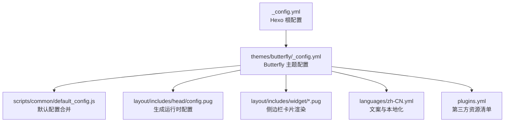
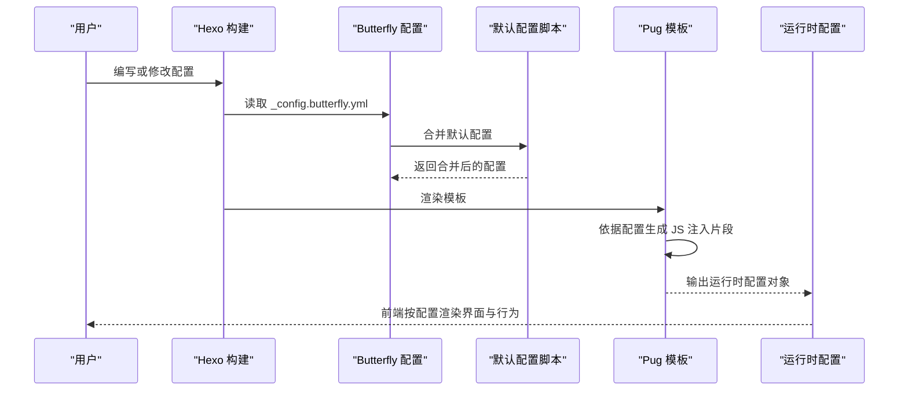
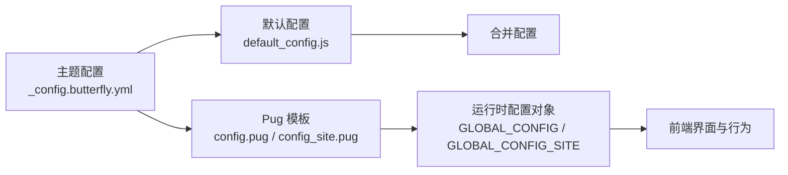

# 配置文件详解

<cite>
**本文引用的文件**
- [_config.butterfly.yml](file://_config.butterfly.yml)
- [_config.yml](file://_config.yml)
- [themes/butterfly/_config.yml](file://themes/butterfly/_config.yml)
- [themes/butterfly/scripts/common/default_config.js](file://themes/butterfly/scripts/common/default_config.js)
- [themes/butterfly/layout/includes/head/config.pug](file://themes/butterfly/layout/includes/head/config.pug)
- [themes/butterfly/layout/includes/head/config_site.pug](file://themes/butterfly/layout/includes/head/config_site.pug)
- [themes/butterfly/layout/includes/widget/card_archives.pug](file://themes/butterfly/layout/includes/widget/card_archives.pug)
- [themes/butterfly/layout/includes/widget/card_tags.pug](file://themes/butterfly/layout/includes/widget/card_tags.pug)
- [themes/butterfly/layout/includes/widget/card_categories.pug](file://themes/butterfly/layout/includes/widget/card_categories.pug)
- [themes/butterfly/languages/zh-CN.yml](file://themes/butterfly/languages/zh-CN.yml)
- [themes/butterfly/plugins.yml](file://themes/butterfly/plugins.yml)
- [README.md](file://README.md)
- [README_CN.md](file://themes/butterfly/README_CN.md)
</cite>

## 目录
1. [简介](#简介)
2. [项目结构](#项目结构)
3. [核心组件](#核心组件)
4. [架构概览](#架构概览)
5. [详细组件分析](#详细组件分析)
6. [依赖分析](#依赖分析)
7. [性能考虑](#性能考虑)
8. [故障排除指南](#故障排除指南)
9. [结论](#结论)
10. [附录](#附录)

## 简介
本指南面向使用 Butterfly 主题的 Hexo 用户，系统讲解主题配置文件中的各项参数，涵盖导航设置、代码块配置、图像与封面、文章元数据、首页设置、侧边栏、底部设置、全局行为、数学公式、搜索、分享、评论、聊天、分析、广告、美化与特效、标签插件、其他设置等模块。文档同时提供配置最佳实践、常见场景解决方案、配置验证方法与故障排除技巧，帮助你快速上手并深度定制。

## 项目结构
Hexo 与 Butterfly 主题的配置文件位于仓库根目录与主题目录中，二者协同工作：
- 根配置文件用于启用主题、渲染器与站点基础信息
- 主题配置文件用于控制 Butterfly 的界面与功能行为
- 主题脚本与模板通过读取配置生成前端运行时参数

图表来源
- [_config.yml](file://_config.yml)
- [themes/butterfly/_config.yml](file://themes/butterfly/_config.yml)
- [themes/butterfly/scripts/common/default_config.js](file://themes/butterfly/scripts/common/default_config.js)
- [themes/butterfly/layout/includes/head/config.pug](file://themes/butterfly/layout/includes/head/config.pug)
- [themes/butterfly/layout/includes/widget/card_archives.pug](file://themes/butterfly/layout/includes/widget/card_archives.pug)
- [themes/butterfly/languages/zh-CN.yml](file://themes/butterfly/languages/zh-CN.yml)
- [themes/butterfly/plugins.yml](file://themes/butterfly/plugins.yml)

章节来源
- [_config.yml](file://_config.yml)
- [themes/butterfly/_config.yml](file://themes/butterfly/_config.yml)
- [README.md](file://README.md)

## 核心组件
- 主题配置入口：Butterfly 主题配置文件集中定义所有功能开关与参数
- 默认配置合并：脚本将用户配置与默认配置合并，确保未显式设置的项有合理默认值
- 运行时配置注入：模板根据主题配置生成前端 JS 对象，供运行时使用
- 侧边栏与页面部件：侧边栏卡片按配置渲染，支持分类、标签、归档、最近文章等
- 本地化文案：语言文件提供多语言文案，影响搜索、分页、评论等 UI 文案

章节来源
- [themes/butterfly/scripts/common/default_config.js](file://themes/butterfly/scripts/common/default_config.js)
- [themes/butterfly/layout/includes/head/config.pug](file://themes/butterfly/layout/includes/head/config.pug)
- [themes/butterfly/layout/includes/widget/card_archives.pug](file://themes/butterfly/layout/includes/widget/card_archives.pug)
- [themes/butterfly/layout/includes/widget/card_tags.pug](file://themes/butterfly/layout/includes/widget/card_tags.pug)
- [themes/butterfly/layout/includes/widget/card_categories.pug](file://themes/butterfly/layout/includes/widget/card_categories.pug)
- [themes/butterfly/languages/zh-CN.yml](file://themes/butterfly/languages/zh-CN.yml)

## 架构概览
主题配置在构建阶段被模板读取，并在运行时注入到前端环境，形成“配置驱动”的渲染与行为控制。

图表来源
- [themes/butterfly/_config.yml](file://themes/butterfly/_config.yml)
- [themes/butterfly/scripts/common/default_config.js](file://themes/butterfly/scripts/common/default_config.js)
- [themes/butterfly/layout/includes/head/config.pug](file://themes/butterfly/layout/includes/head/config.pug)

## 详细组件分析

### 导航设置
- 导航栏固定：控制导航栏是否固定在顶部
- 导航栏图标与标题显示：控制 logo、站点标题与文章标题的显示策略
- 菜单：以键值对形式定义菜单项，支持图标与链接

配置要点
- logo：导航栏左侧图标路径
- display_title/display_post_title：是否显示站点标题与文章标题
- fixed：是否固定导航栏
- menu：菜单项列表，格式为“名称: 路径 || 图标”

最佳实践
- 固定导航栏适合长文章与多级菜单场景
- 菜单项建议配合字体图标库使用，保持风格一致

章节来源
- [themes/butterfly/_config.yml](file://themes/butterfly/_config.yml)
- [themes/butterfly/scripts/common/default_config.js](file://themes/butterfly/scripts/common/default_config.js)

### 代码块配置
- 主题：高亮主题（light 等）
- Mac 风格：是否启用 Mac 风格样式
- 高度限制：代码块最大高度（px）
- 自动换行：是否开启单词换行
- 工具栏：复制、语言标识、收缩/展开、全屏
- 语法高亮提供者：由渲染器决定（highlight.js 或 prismjs）

配置要点
- theme/macStyle/height_limit/word_wrap：外观与行为
- copy/language/shrink/fullpage：交互能力
- highlight.js/prismjs：由 Hexo 渲染器决定

最佳实践
- 开启自动换行提升可读性，但注意性能
- 收缩/展开适合长代码段，避免首屏阻塞

章节来源
- [themes/butterfly/_config.yml](file://themes/butterfly/_config.yml)
- [themes/butterfly/layout/includes/head/config.pug](file://themes/butterfly/layout/includes/head/config.pug)
- [themes/butterfly/layout/includes/head/config_site.pug](file://themes/butterfly/layout/includes/head/config_site.pug)

### 图像与封面设置
- 站点图标：favicon
- 头像：头像图片与特效
- 禁用顶部横幅：全局禁用页面顶部横幅
- 默认横幅与首页横幅：未设置时的回退图
- 归档/标签/分类页面横幅：可为特定页面设置专属横幅
- 页脚背景：页脚区域背景图
- 网站背景：支持颜色、图片 URL 或数组（随机背景）
- 封面：首页/侧边/归档页封面开关与默认封面
- 错误图片与 404 页面：友好的错误页体验

配置要点
- favicon/avatar/disable_top_img/default_top_img/index_img/archive_img/tag_img/category_img/footer_img/background/cover
- error_img/error_404：错误处理与兜底

最佳实践
- 使用相对路径或 CDN，确保跨域与缓存友好
- 为重要页面设置专属横幅，增强识别度

章节来源
- [themes/butterfly/_config.yml](file://themes/butterfly/_config.yml)
- [themes/butterfly/scripts/common/default_config.js](file://themes/butterfly/scripts/common/default_config.js)

### 文章元数据
- 首页元数据：日期类型（创建/更新/两者）、日期格式（绝对/相对）、分类/标签、标签样式
- 文章页元数据：位置（左/居中）、日期类型与格式、分类/标签、标签样式

配置要点
- page/post：分别控制首页与文章页的元数据展示
- date_type/date_format/categories/tags/label：灵活组合显示

最佳实践
- 首页使用“创建日期 + 相对时间”提升新鲜感
- 文章页展示“更新日期 + 绝对时间”，便于读者了解时效性

章节来源
- [themes/butterfly/_config.yml](file://themes/butterfly/_config.yml)
- [themes/butterfly/scripts/common/default_config.js](file://themes/butterfly/scripts/common/default_config.js)

### 首页设置
- 首页横幅信息位置与高度：通过像素/百分比等单位控制
- 子标题：是否启用、打字机效果、第三方来源、文案
- 首页布局：多种布局模式（左右/上下/交错/瀑布流等）
- 首页摘要：摘要长度与截取策略

配置要点
- index_site_info_top/index_top_img_height：横幅信息位置与高度
- subtitle：enable/effect/typed_option/source/sub
- index_layout：布局模式
- index_post_content：method/length

最佳实践
- 使用“交错/瀑布流”提升信息密度
- 控制摘要长度，避免首屏过载

章节来源
- [themes/butterfly/_config.yml](file://themes/butterfly/_config.yml)
- [themes/butterfly/scripts/common/default_config.js](file://themes/butterfly/scripts/common/default_config.js)

### 侧边栏配置
- 侧边栏开关与位置：启用、隐藏按钮、移动端可见性、位置（左/右）
- 显示卡片：归档、标签、分类
- 作者卡片：描述、关注按钮
- 公告卡片：公告内容
- 最新文章：数量与排序
- 最新评论：数量、存储、头像
- 分类卡片：数量、展开策略
- 标签云：数量、颜色、自定义颜色、排序
- 归档卡片：类型（月/年）、格式、排序、数量
- 系列文章卡片：是否显示系列名、排序字段与顺序
- 网站信息卡片：文章数、最后更新时间、运行时长

配置要点
- enable/hide/button/mobile/position/display
- card_author/card_announcement/card_recent_post/card_newest_comments/card_categories/card_tags/card_archives/card_post_series/card_webinfo

最佳实践
- 根据内容体量调整卡片数量，避免拥挤
- 标签云开启颜色时建议限制数量，提升可读性

章节来源
- [themes/butterfly/_config.yml](file://themes/butterfly/_config.yml)
- [themes/butterfly/layout/includes/widget/card_archives.pug](file://themes/butterfly/layout/includes/widget/card_archives.pug)
- [themes/butterfly/layout/includes/widget/card_tags.pug](file://themes/butterfly/layout/includes/widget/card_tags.pug)
- [themes/butterfly/layout/includes/widget/card_categories.pug](file://themes/butterfly/layout/includes/widget/card_categories.pug)

### 底部设置
- 底部导航：自定义导航项
- 站长信息：启用、起始年份
- 版权信息：启用、版本显示
- 自定义文本：底部自定义文案

配置要点
- nav/owner.enable/owner.since/copyright.enable/copyright.version/custom_text

最佳实践
- 站长信息体现运营年份，增强信任感
- 版权信息遵循许可协议，避免法律风险

章节来源
- [themes/butterfly/_config.yml](file://themes/butterfly/_config.yml)
- [themes/butterfly/scripts/common/default_config.js](file://themes/butterfly/scripts/common/default_config.js)

### 全局设置
- 锚点：自动更新 URL、点击跳转
- 图片标题：是否启用 figcaption
- 复制保护：启用复制保护、复制版权信息阈值
- 字数统计：启用、文章字数、阅读时长、站点总字数
- 不蒜子统计：站点 UV/PV、页面 PV
- 数学公式：MathJax/KaTeX 选择、每页加载策略、滚动条隐藏
- 搜索：Algolia/本地/Docsearch 三选一、占位符、分页与预加载
- 分享：Share.js/AddToAny 二选一及站点列表
- 评论：双评论系统支持、延迟加载、评论数显示
- 聊天：Chatra/Tidio/Crisp 三选一及按钮行为
- 分析：百度统计/谷歌分析/Cloudflare/Microsoft Clarity/Umami
- 广告：Google AdSense 与手动插入位
- 验证：站点验证 meta
- 美化与特效：主题色、圆角、对齐、遮罩、加载动画、入场过渡、显示模式、字体、HR 图标、特效开关
- 标签插件：系列、ABCJS、Mermaid、Chart.js、Note 样式
- 其他：PJAX、APlayer 注入、Snackbar、Instantpage、懒加载、PWA、Open Graph、结构化数据、CDN

配置要点
- anchor/photofigcaption/copy/wordcount/busuanzi/math/search/share/comments/chat/analytics/ad/verification/beautify/tag-plugins/other

最佳实践
- 优先使用本地搜索以降低外部依赖
- 评论系统建议启用双系统，提高可用性
- 分析与广告需遵守隐私与合规要求

章节来源
- [themes/butterfly/_config.yml](file://themes/butterfly/_config.yml)
- [themes/butterfly/scripts/common/default_config.js](file://themes/butterfly/scripts/common/default_config.js)
- [themes/butterfly/layout/includes/head/config.pug](file://themes/butterfly/layout/includes/head/config.pug)
- [themes/butterfly/plugins.yml](file://themes/butterfly/plugins.yml)

## 依赖分析
主题配置与运行时的关系如下：

图表来源
- [themes/butterfly/_config.yml](file://themes/butterfly/_config.yml)
- [themes/butterfly/scripts/common/default_config.js](file://themes/butterfly/scripts/common/default_config.js)
- [themes/butterfly/layout/includes/head/config.pug](file://themes/butterfly/layout/includes/head/config.pug)
- [themes/butterfly/layout/includes/head/config_site.pug](file://themes/butterfly/layout/includes/head/config_site.pug)

章节来源
- [themes/butterfly/_config.yml](file://themes/butterfly/_config.yml)
- [themes/butterfly/scripts/common/default_config.js](file://themes/butterfly/scripts/common/default_config.js)
- [themes/butterfly/layout/includes/head/config.pug](file://themes/butterfly/layout/includes/head/config.pug)
- [themes/butterfly/layout/includes/head/config_site.pug](file://themes/butterfly/layout/includes/head/config_site.pug)

## 性能考虑
- 代码块：开启自动换行与全屏可能增加 DOM 体积；建议按需启用
- 懒加载：启用图片懒加载，减少首屏压力
- 本地搜索：预加载会增加初始包体，建议在内容较多时开启
- 数学公式：每页加载会引入额外脚本，建议仅在需要时启用
- 侧边栏卡片：标签云与最新评论需网络请求或本地存储，建议限制数量
- 动画与特效：过多特效会影响低端设备性能，建议按需启用

## 故障排除指南
- 配置未生效
  - 检查配置文件路径与格式，确保 YAML 缩进正确
  - 确认 Hexo 根配置已启用主题
  - 清理缓存后重新构建
- 代码块样式异常
  - 确认已安装对应语法高亮渲染器
  - 检查主题配置中的高亮主题与工具栏设置
- 侧边栏卡片不显示
  - 确认卡片开关与数量限制设置
  - 检查分类/标签数据是否为空
- 搜索无结果
  - 确认搜索类型与占位符设置
  - 本地搜索需生成索引文件
- 评论/聊天不可用
  - 检查第三方服务配置是否正确
  - 确认网络与域名白名单设置
- 分析与广告异常
  - 检查 UA/Token/ID 是否正确
  - 确认隐私合规与浏览器拦截

章节来源
- [themes/butterfly/_config.yml](file://themes/butterfly/_config.yml)
- [themes/butterfly/layout/includes/head/config.pug](file://themes/butterfly/layout/includes/head/config.pug)
- [themes/butterfly/layout/includes/widget/card_tags.pug](file://themes/butterfly/layout/includes/widget/card_tags.pug)
- [themes/butterfly/layout/includes/widget/card_archives.pug](file://themes/butterfly/layout/includes/widget/card_archives.pug)
- [themes/butterfly/layout/includes/widget/card_categories.pug](file://themes/butterfly/layout/includes/widget/card_categories.pug)

## 结论
通过系统理解 Butterfly 主题配置文件的结构与作用，你可以灵活地定制导航、代码块、图像与封面、文章元数据、首页布局、侧边栏、底部信息以及全局行为。结合最佳实践与故障排除技巧，能够显著提升博客的可用性、美观度与维护效率。

## 附录
- 配置验证清单
  - 基础：主题启用、渲染器安装、配置文件路径正确
  - 导航：logo、菜单、固定导航
  - 代码块：主题、工具栏、高度限制
  - 图像与封面：favicon、头像、横幅、封面
  - 首页：横幅信息位置、子标题、布局、摘要
  - 侧边栏：开关、位置、卡片配置
  - 全局：锚点、复制保护、字数统计、数学公式、搜索、分享、评论、聊天、分析、广告、美化与特效
- 常见场景
  - 极简风格：关闭多余卡片与特效，启用深色模式
  - 技术博客：开启代码块工具栏、数学公式、侧边 TOC
  - 内容密集型：使用瀑布流布局与标签云，限制卡片数量
  - 国际化：配置语言文件与站点验证
- 参考文档
  - [Butterfly 官方文档](https://butterfly.js.org/)
  - [Butterfly 中文文档](https://butterfly.js.org/zh-CN/posts/21cfbf15/)