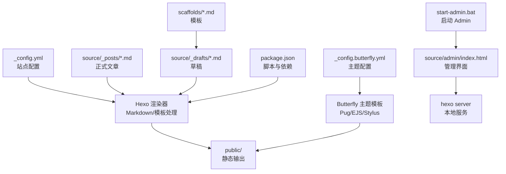
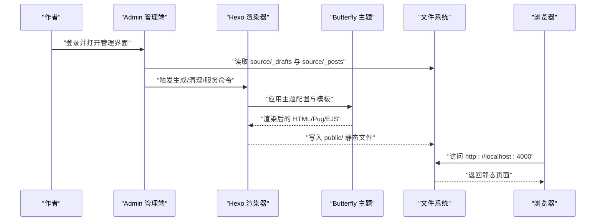
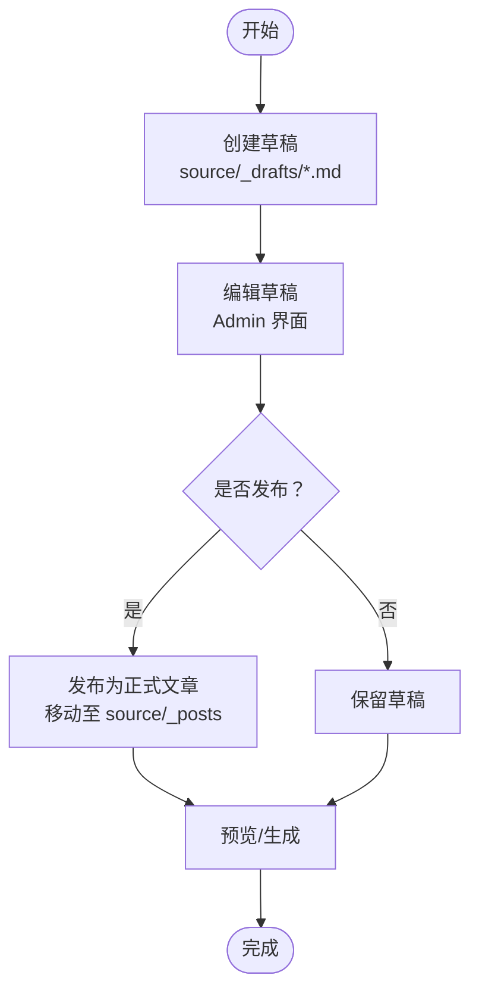
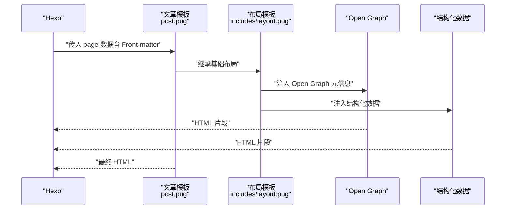
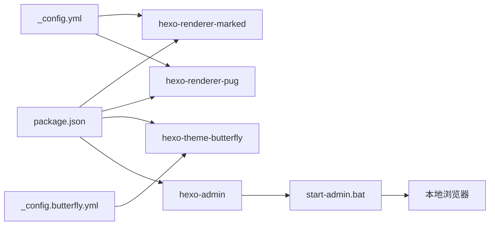

# 内容管理

<cite>
**本文引用的文件**
- [_config.yml](file://_config.yml)
- [_config.butterfly.yml](file://_config.butterfly.yml)
- [package.json](file://package.json)
- [scaffolds/post.md](file://scaffolds/post.md)
- [scaffolds/draft.md](file://scaffolds/draft.md)
- [source/_posts/hello-world.md](file://source/_posts/hello-world.md)
- [source/_posts/test-latex.md](file://source/_posts/test-latex.md)
- [source/_drafts/我的第一篇博客.md](file://source/_drafts/我的第一篇博客.md)
- [themes/butterfly/layout/post.pug](file://themes/butterfly/layout/post.pug)
- [themes/butterfly/layout/includes/layout.pug](file://themes/butterfly/layout/includes/layout.pug)
- [themes/butterfly/layout/includes/head/Open_Graph.pug](file://themes/butterfly/layout/includes/head/Open_Graph.pug)
- [themes/butterfly/layout/includes/head/structured_data.pug](file://themes/butterfly/layout/includes/head/structured_data.pug)
- [themes/butterfly/_config.yml](file://themes/butterfly/_config.yml)
- [start-admin.bat](file://start-admin.bat)
- [source/admin/index.html](file://source/admin/index.html)
</cite>

## 目录
1. [简介](#简介)
2. [项目结构](#项目结构)
3. [核心组件](#核心组件)
4. [架构总览](#架构总览)
5. [详细组件分析](#详细组件分析)
6. [依赖关系分析](#依赖关系分析)
7. [性能考量](#性能考量)
8. [故障排查指南](#故障排查指南)
9. [结论](#结论)
10. [附录](#附录)

## 简介
本文件面向内容创作者与站点维护者，系统化阐述基于 Hexo 的内容管理系统在“博客文章创作、编辑与发布”方面的完整流程；同时覆盖 Markdown 语法规范与高级用法、Front-matter 元数据字段、草稿管理、文章模板系统、内容组织最佳实践（文件命名与目录结构），以及常见问题的定位与解决思路。文中所有实现细节均以仓库现有配置与示例文件为依据。

## 项目结构
该站点采用 Hexo 默认目录结构，结合 Butterfly 主题与 Admin 管理界面，形成“内容源文件 → 渲染器 → 主题模板 → 静态输出”的完整链路。关键目录与文件职责如下：
- scaffolds：存放文章与草稿的模板，控制新文章默认 Front-matter 字段
- source/_posts：正式文章目录，按日期命名，由 Front-matter 提供元数据
- source/_drafts：草稿目录，支持草稿的创建、编辑与发布转换
- themes/butterfly：主题模板与布局，负责文章展示、SEO 元信息注入与第三方集成
- _config.yml 与 _config.butterfly.yml：站点与主题配置，决定生成规则、渲染行为与展示样式
- package.json：依赖与脚本，定义构建、本地服务与调试命令
- start-admin.bat 与 source/admin/index.html：启动 Admin 管理端，提供可视化文章管理与发布操作



图表来源
- [_config.yml:1-173](file://_config.yml#L1-L173)
- [_config.butterfly.yml:1-690](file://_config.butterfly.yml#L1-L690)
- [package.json:1-42](file://package.json#L1-L42)
- [scaffolds/post.md:1-6](file://scaffolds/post.md#L1-L6)
- [scaffolds/draft.md:1-5](file://scaffolds/draft.md#L1-L5)
- [source/_posts/hello-world.md:1-39](file://source/_posts/hello-world.md#L1-L39)
- [source/_drafts/我的第一篇博客.md:1-6](file://source/_drafts/我的第一篇博客.md#L1-L6)
- [themes/butterfly/layout/includes/layout.pug:1-59](file://themes/butterfly/layout/includes/layout.pug#L1-L59)
- [themes/butterfly/layout/post.pug:1-36](file://themes/butterfly/layout/post.pug#L1-L36)
- [start-admin.bat:1-47](file://start-admin.bat#L1-L47)
- [source/admin/index.html:488-645](file://source/admin/index.html#L488-L645)

章节来源
- [_config.yml:1-173](file://_config.yml#L1-L173)
- [_config.butterfly.yml:1-690](file://_config.butterfly.yml#L1-L690)
- [package.json:1-42](file://package.json#L1-L42)
- [scaffolds/post.md:1-6](file://scaffolds/post.md#L1-L6)
- [scaffolds/draft.md:1-5](file://scaffolds/draft.md#L1-L5)
- [source/_posts/hello-world.md:1-39](file://source/_posts/hello-world.md#L1-L39)
- [source/_drafts/我的第一篇博客.md:1-6](file://source/_drafts/我的第一篇博客.md#L1-L6)
- [themes/butterfly/layout/includes/layout.pug:1-59](file://themes/butterfly/layout/includes/layout.pug#L1-L59)
- [themes/butterfly/layout/post.pug:1-36](file://themes/butterfly/layout/post.pug#L1-L36)
- [start-admin.bat:1-47](file://start-admin.bat#L1-L47)
- [source/admin/index.html:488-645](file://source/admin/index.html#L488-L645)

## 核心组件
- 站点配置与生成规则
  - 网站基础信息、URL 规则、目录结构、分页与日期格式
  - 文章写入规则（默认布局、新文章命名、是否渲染草稿）
  - 代码高亮与渲染器选择
- 主题配置与展示
  - 导航、封面图、TOC、版权、打赏、评论系统、搜索、数学公式等主题能力开关
- 模板系统
  - scaffolds/post.md 与 scaffolds/draft.md 定义新文章与草稿的默认 Front-matter 字段
- 文章与草稿
  - source/_posts 与 source/_drafts 目录中的 Markdown 文件即为内容源
- 管理端
  - Admin 界面提供文章列表、编辑、发布/撤销发布、删除等操作

章节来源
- [_config.yml:1-173](file://_config.yml#L1-L173)
- [_config.butterfly.yml:1-690](file://_config.butterfly.yml#L1-L690)
- [scaffolds/post.md:1-6](file://scaffolds/post.md#L1-L6)
- [scaffolds/draft.md:1-5](file://scaffolds/draft.md#L1-L5)
- [source/_posts/hello-world.md:1-39](file://source/_posts/hello-world.md#L1-L39)
- [source/_drafts/我的第一篇博客.md:1-6](file://source/_drafts/我的第一篇博客.md#L1-L6)
- [source/admin/index.html:488-645](file://source/admin/index.html#L488-L645)

## 架构总览
下图展示了从内容源到最终静态页面的关键路径：内容源文件经 Hexo 渲染器处理，结合主题模板与配置，生成 public 目录下的静态资源；Admin 管理端通过本地服务提供可视化操作入口。



图表来源
- [_config.yml:1-173](file://_config.yml#L1-L173)
- [_config.butterfly.yml:1-690](file://_config.butterfly.yml#L1-L690)
- [themes/butterfly/layout/includes/layout.pug:1-59](file://themes/butterfly/layout/includes/layout.pug#L1-L59)
- [themes/butterfly/layout/post.pug:1-36](file://themes/butterfly/layout/post.pug#L1-L36)
- [source/admin/index.html:488-645](file://source/admin/index.html#L488-L645)
- [start-admin.bat:1-47](file://start-admin.bat#L1-L47)

## 详细组件分析

### Markdown 语法规范与高级用法
- 基本元素
  - 标题：使用若干个 # 表示层级
  - 段落：空行分隔
  - 列表：无序列表使用 - 或 *，有序列表使用数字加点
  - 链接：[文本](URL)
  - 图片：
  - 引用：> 引用文本
  - 表格：使用 | 分隔行列
  - 代码块：使用 ``` 语言标识 包裹代码
  - 行内代码：使用单个反引号包裹
- 高级用法
  - LaTeX 数学公式：行内公式使用单 $ 包裹，块级公式使用 $$ 包裹
  - 自定义标签插件：如 note、tabs、gallery 等（主题提供）
- 示例参考
  - 基础示例：[hello-world.md](file://source/_posts/hello-world.md#L1-L39)
  - LaTeX 示例：[test-latex.md](file://source/_posts/test-latex.md#L1-L95)

章节来源
- [source/_posts/hello-world.md](file://source/_posts/hello-world.md#L1-L39)
- [source/_posts/test-latex.md](file://source/_posts/test-latex.md#L1-L95)

### Front-matter 元数据使用
- 支持字段
  - title：文章标题
  - date：发布时间（ISO8601 或按配置格式）
  - tags：标签数组
  - categories：分类
  - 其他可选字段：author、description、cover 等（视主题与渲染器支持）
- 字段示例
  - 基础示例：[hello-world.md](file://source/_posts/hello-world.md#L1-L3)
  - 丰富元数据示例：[test-latex.md](file://source/_posts/test-latex.md#L1-L10)
- 模板默认值
  - 新建文章默认模板包含 title、date、tags 字段：[post.md](file://scaffolds/post.md#L1-L6)
  - 新建草稿默认模板包含 title、tags 字段：[draft.md](file://scaffolds/draft.md#L1-L5)

章节来源
- [source/_posts/hello-world.md](file://source/_posts/hello-world.md#L1-L3)
- [source/_posts/test-latex.md](file://source/_posts/test-latex.md#L1-L10)
- [scaffolds/post.md](file://scaffolds/post.md#L1-L6)
- [scaffolds/draft.md](file://scaffolds/draft.md#L1-L5)

### 草稿管理：创建、编辑与发布
- 创建草稿
  - 在 source/_drafts 下新增 Markdown 文件，Front-matter 可按需填写
  - 示例：[我的第一篇博客.md](file://source/_drafts/我的第一篇博客.md#L1-L6)
- 编辑草稿
  - 使用 Admin 管理端打开草稿进行编辑，保存后可预览
  - Admin 界面提供文章列表、状态（草稿/已发布）、日期、预览与编辑入口
- 发布/撤销发布
  - 在 Admin 中对草稿执行“发布”操作，即可转为正式文章；再次执行“撤销发布”可退回草稿
  - 发布流程通过调用后端 API 实现状态切换与刷新
- 渲染控制
  - 配置中 render_drafts: false 表示默认不渲染草稿；可通过命令或设置调整



图表来源
- [source/_drafts/我的第一篇博客.md](file://source/_drafts/我的第一篇博客.md#L1-L6)
- [source/admin/index.html](file://source/admin/index.html#L488-L645)
- [_config.yml](file://_config.yml#L40-L40)

章节来源
- [source/_drafts/我的第一篇博客.md](file://source/_drafts/我的第一篇博客.md#L1-L6)
- [source/admin/index.html](file://source/admin/index.html#L488-L645)
- [_config.yml](file://_config.yml#L40-L40)

### 文章模板系统与自定义模板
- 模板位置与作用
  - scaffolds/post.md：新建文章时的默认 Front-matter 模板
  - scaffolds/draft.md：新建草稿时的默认 Front-matter 模板
- 自定义模板
  - 可在 scaffolds 目录新增或修改模板文件，以满足不同文章类型（如长文、笔记、翻译）的默认字段需求
  - 修改后的新文章将继承模板中的默认字段，减少重复输入

章节来源
- [scaffolds/post.md](file://scaffolds/post.md#L1-L6)
- [scaffolds/draft.md](file://scaffolds/draft.md#L1-L5)

### 内容组织最佳实践
- 文件命名规范
  - 正式文章建议使用日期前缀与语义化标题，便于排序与检索
  - Front-matter 中的 date 字段应与文件名或内容一致
- 目录结构建议
  - source/_posts：按日期归档的正式文章
  - source/_drafts：草稿统一存放，便于隔离与管理
  - source/images：静态资源集中存放，配合主题的图片懒加载与封面策略
- 分类与标签
  - categories 与 tags 在 Front-matter 中声明，主题将据此生成归档页与侧边栏
- SEO 与元信息
  - 主题自动注入 Open Graph 与结构化数据，确保分享与搜索引擎友好

章节来源
- [_config.yml](file://_config.yml#L1-L173)
- [_config.butterfly.yml](file://_config.butterfly.yml#L1-L690)
- [themes/butterfly/layout/includes/head/Open_Graph.pug](file://themes/butterfly/layout/includes/head/Open_Graph.pug#L1-L16)
- [themes/butterfly/layout/includes/head/structured_data.pug](file://themes/butterfly/layout/includes/head/structured_data.pug#L1-L39)

### 文章渲染与展示流程
- 渲染链路
  - Hexo 读取 _config.yml 与渲染器配置，解析 Markdown 与 Front-matter
  - 应用主题模板（Butterfly）与 _config.butterfly.yml 配置，生成 HTML
  - 输出至 public/，可通过本地服务器或部署平台访问
- 关键模板
  - 布局基模板：[includes/layout.pug](file://themes/butterfly/layout/includes/layout.pug#L1-L59)
  - 文章页模板：[post.pug](file://themes/butterfly/layout/post.pug#L1-L36)
- SEO 注入
  - Open Graph：[Open_Graph.pug](file://themes/butterfly/layout/includes/head/Open_Graph.pug#L1-L16)
  - 结构化数据：[structured_data.pug](file://themes/butterfly/layout/includes/head/structured_data.pug#L1-L39)



图表来源
- [themes/butterfly/layout/post.pug](file://themes/butterfly/layout/post.pug#L1-L36)
- [themes/butterfly/layout/includes/layout.pug](file://themes/butterfly/layout/includes/layout.pug#L1-L59)
- [themes/butterfly/layout/includes/head/Open_Graph.pug](file://themes/butterfly/layout/includes/head/Open_Graph.pug#L1-L16)
- [themes/butterfly/layout/includes/head/structured_data.pug](file://themes/butterfly/layout/includes/head/structured_data.pug#L1-L39)

## 依赖关系分析
- 站点配置依赖
  - _config.yml 控制 URL、目录、分页、渲染器与高亮等全局行为
  - _config.butterfly.yml 控制主题外观、功能模块与第三方集成
- 渲染与模板依赖
  - package.json 中声明的 hexo-renderer-marked、hexo-renderer-pug、hexo-theme-butterfly 等
- 管理端依赖
  - hexo-admin 提供 Admin 界面与 API，start-admin.bat 启动本地服务并打开管理端



图表来源
- [package.json:1-42](file://package.json#L1-L42)
- [_config.yml:1-173](file://_config.yml#L1-L173)
- [_config.butterfly.yml:1-690](file://_config.butterfly.yml#L1-L690)
- [start-admin.bat:1-47](file://start-admin.bat#L1-L47)

章节来源
- [package.json:1-42](file://package.json#L1-L42)
- [_config.yml:1-173](file://_config.yml#L1-L173)
- [_config.butterfly.yml:1-690](file://_config.butterfly.yml#L1-L690)
- [start-admin.bat:1-47](file://start-admin.bat#L1-L47)

## 性能考量
- 代码高亮与渲染
  - 配置了 highlight.js 与 prismjs 的行号、换行与预处理选项，建议根据文章数量与复杂度选择其一以降低开销
- 图片与懒加载
  - 主题提供懒加载配置，建议开启并在文章中合理使用图片资源，避免一次性加载过多大图
- 静态压缩
  - hexo-neat 提供 HTML/CSS/JS 压缩，可在生成阶段减小体积
- 本地服务与 Admin
  - 使用 start-admin.bat 启动可快速预览与调试；生产部署建议使用 CI/CD 自动化生成与发布

章节来源
- [_config.yml:45-55](file://_config.yml#L45-L55)
- [_config.butterfly.yml:646-652](file://_config.butterfly.yml#L646-L652)
- [package.json:1-42](file://package.json#L1-L42)

## 故障排查指南
- 草稿未显示
  - 检查 _config.yml 中 render_drafts 是否为 true；若为 false，草稿不会被渲染
- Admin 界面无法访问
  - 确认已执行 start-admin.bat 并正确打开 http://localhost:4000/admin
  - 若端口冲突，可在配置中调整端口或停止占用进程
- 发布/撤销发布失败
  - 查看 Admin 界面提示与浏览器控制台错误；确认网络连通与本地服务正常
- 生成失败
  - 执行 hexo clean 与 hexo generate 后重试；检查 Markdown 语法与 Front-matter 格式
- SEO 元信息缺失
  - 确认主题配置中 Open Graph 与结构化数据开关已启用，且 Front-matter 中包含必要字段

章节来源
- [_config.yml:40-40](file://_config.yml#L40-L40)
- [start-admin.bat:1-47](file://start-admin.bat#L1-L47)
- [source/admin/index.html:488-645](file://source/admin/index.html#L488-L645)
- [_config.butterfly.yml:661-668](file://_config.butterfly.yml#L661-L668)

## 结论
本系统以 Hexo 为核心，结合 Butterfly 主题与 Admin 管理端，提供了从内容创作、草稿管理到发布展示的完整工作流。通过合理的 Front-matter 字段、模板化默认值与主题配置，作者可以高效地组织与呈现内容。建议在日常使用中遵循文件命名与目录规范，善用草稿与模板，结合主题提供的 SEO 与展示能力，持续优化阅读体验与传播效果。

## 附录
- 快速命令
  - 本地开发：npm run dev
  - 生成静态文件：npm run build
  - 启动 Admin：npm run admin
  - 清理缓存：npm run clean
- 写作示例参考
  - 基础示例：[hello-world.md:1-39](file://source/_posts/hello-world.md#L1-L39)
  - LaTeX 示例：[test-latex.md:1-95](file://source/_posts/test-latex.md#L1-L95)
- 模板参考
  - 文章模板：[post.md:1-6](file://scaffolds/post.md#L1-L6)
  - 草稿模板：[draft.md:1-5](file://scaffolds/draft.md#L1-L5)