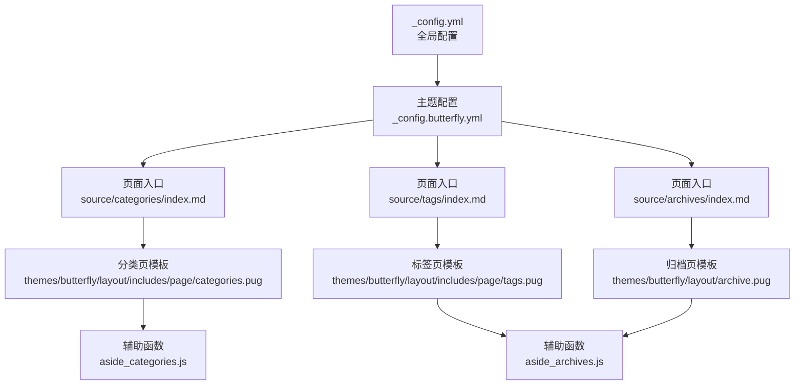
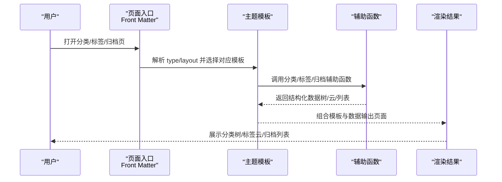
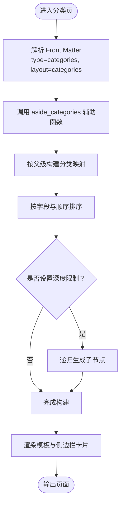
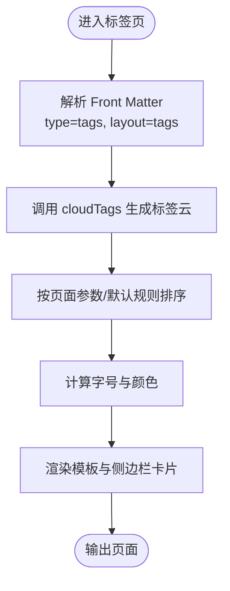
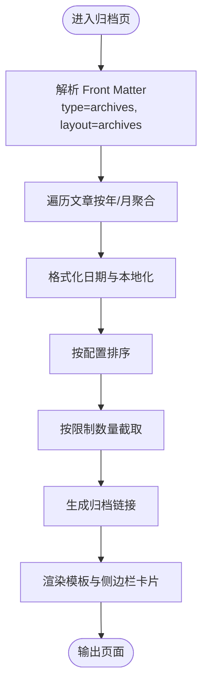
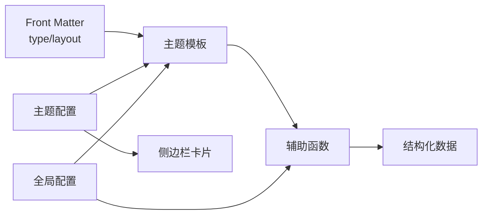

# 内容组织

<cite>
**本文引用的文件**
- [_config.yml](file://_config.yml)
- [_config.butterfly.yml](file://_config.butterfly.yml)
- [categories/index.md](file://source/categories/index.md)
- [tags/index.md](file://source/tags/index.md)
- [archives/index.md](file://source/archives/index.md)
- [archive.pug](file://themes/butterfly/layout/archive.pug)
- [categories.pug](file://themes/butterfly/layout/includes/page/categories.pug)
- [tags.pug](file://themes/butterfly/layout/includes/page/tags.pug)
- [card_categories.pug](file://themes/butterfly/layout/includes/widget/card_categories.pug)
- [aside_categories.js](file://themes/butterfly/scripts/helpers/aside_categories.js)
- [aside_archives.js](file://themes/butterfly/scripts/helpers/aside_archives.js)
</cite>

## 目录
1. [简介](#简介)
2. [项目结构](#项目结构)
3. [核心组件](#核心组件)
4. [架构总览](#架构总览)
5. [组件详解](#组件详解)
6. [依赖关系分析](#依赖关系分析)
7. [性能考量](#性能考量)
8. [故障排查指南](#故障排查指南)
9. [结论](#结论)
10. [附录](#附录)

## 简介
本文件面向使用 Hexo + Butterfly 主题的博客作者，系统性阐述内容组织体系：分类（Categories）、标签（Tags）与归档（Archives）。文档覆盖以下方面：
- 分类系统：创建、分配、层级管理与侧边栏展示
- 标签系统：标签云、过滤与统计
- 归档系统：按时间排序、年度/月度归档
- 最佳实践：分类策略、标签使用规范
- 实战配置与使用技巧：基于仓库中的实际配置文件进行说明

## 项目结构
围绕内容组织的相关目录与文件如下：
- 全局配置：站点元信息、分页、分类/标签默认值、菜单导航等
- 主题配置：侧边栏卡片、卡片内分类/标签/归档的展示行为
- 页面入口：分类页、标签页、归档页的 Front Matter 定义
- 主题模板与辅助函数：分类树形渲染、标签云、归档列表生成

**图示来源**
- [_config.yml:1-173](file://_config.yml#L1-L173)
- [_config.butterfly.yml:1-690](file://_config.butterfly.yml#L1-L690)
- [categories/index.md:1-7](file://source/categories/index.md#L1-L7)
- [tags/index.md:1-7](file://source/tags/index.md#L1-L7)
- [archives/index.md:1-7](file://source/archives/index.md#L1-L7)
- [categories.pug:1-1](file://themes/butterfly/layout/includes/page/categories.pug#L1-L1)
- [tags.pug:1-3](file://themes/butterfly/layout/includes/page/tags.pug#L1-L3)
- [archive.pug:1-8](file://themes/butterfly/layout/archive.pug#L1-L8)
- [aside_categories.js:1-101](file://themes/butterfly/scripts/helpers/aside_categories.js#L1-L101)
- [aside_archives.js:1-114](file://themes/butterfly/scripts/helpers/aside_archives.js#L1-L114)

**章节来源**
- [_config.yml:1-173](file://_config.yml#L1-L173)
- [_config.butterfly.yml:1-690](file://_config.butterfly.yml#L1-L690)
- [categories/index.md:1-7](file://source/categories/index.md#L1-L7)
- [tags/index.md:1-7](file://source/tags/index.md#L1-L7)
- [archives/index.md:1-7](file://source/archives/index.md#L1-L7)

## 核心组件
- 分类（Categories）
  - 页面入口：通过 Front Matter 指定类型与布局，驱动分类页渲染
  - 辅助函数：生成带层级的分类树，支持展开/折叠、计数、排序与限制数量
  - 侧边栏卡片：可配置是否启用、限制数量、展开模式等
- 标签（Tags）
  - 页面入口：通过 Front Matter 指定类型与布局，驱动标签页渲染
  - 标签云：按权重/随机/长度等排序，支持字号、颜色与单位
  - 侧边栏卡片：可配置是否启用、限制数量、排序方式等
- 归档（Archives）
  - 页面入口：通过 Front Matter 指定类型与布局，驱动归档页渲染
  - 辅助函数：按年/月聚合文章，支持格式化、排序、限制数量与链接生成
  - 侧边栏卡片：可配置类型（年/月）、格式、排序、限制数量等

**章节来源**
- [categories.pug:1-1](file://themes/butterfly/layout/includes/page/categories.pug#L1-L1)
- [tags.pug:1-3](file://themes/butterfly/layout/includes/page/tags.pug#L1-L3)
- [archive.pug:1-8](file://themes/butterfly/layout/archive.pug#L1-L8)
- [aside_categories.js:1-101](file://themes/butterfly/scripts/helpers/aside_categories.js#L1-L101)
- [aside_archives.js:1-114](file://themes/butterfly/scripts/helpers/aside_archives.js#L1-L114)

## 架构总览
内容组织在运行时的处理链路如下：
- 用户访问分类/标签/归档页面 → Front Matter 指定页面类型与布局 → 主题模板渲染 → 调用辅助函数生成数据 → 输出 HTML

**图示来源**
- [categories/index.md:1-7](file://source/categories/index.md#L1-L7)
- [tags/index.md:1-7](file://source/tags/index.md#L1-L7)
- [archives/index.md:1-7](file://source/archives/index.md#L1-L7)
- [categories.pug:1-1](file://themes/butterfly/layout/includes/page/categories.pug#L1-L1)
- [tags.pug:1-3](file://themes/butterfly/layout/includes/page/tags.pug#L1-L3)
- [archive.pug:1-8](file://themes/butterfly/layout/archive.pug#L1-L8)
- [aside_categories.js:1-101](file://themes/butterfly/scripts/helpers/aside_categories.js#L1-L101)
- [aside_archives.js:1-114](file://themes/butterfly/scripts/helpers/aside_archives.js#L1-L114)

## 组件详解

### 分类系统（Categories）
- 页面入口与布局
  - 分类页通过 Front Matter 指定 type 为 categories、layout 为 categories，触发分类页模板渲染
- 树形结构与层级
  - 辅助函数将分类按父子关系构建 Map，递归生成层级结构；支持限制深度、展开/折叠样式、计数显示
  - 可按名称或其它字段排序，支持限制显示数量
- 侧边栏卡片
  - 可配置是否启用、限制数量、展开模式等；与主题配置联动

**图示来源**
- [categories/index.md:1-7](file://source/categories/index.md#L1-L7)
- [categories.pug:1-1](file://themes/butterfly/layout/includes/page/categories.pug#L1-L1)
- [card_categories.pug:1-5](file://themes/butterfly/layout/includes/widget/card_categories.pug#L1-L5)
- [aside_categories.js:1-101](file://themes/butterfly/scripts/helpers/aside_categories.js#L1-L101)

**章节来源**
- [categories/index.md:1-7](file://source/categories/index.md#L1-L7)
- [categories.pug:1-1](file://themes/butterfly/layout/includes/page/categories.pug#L1-L1)
- [card_categories.pug:1-5](file://themes/butterfly/layout/includes/widget/card_categories.pug#L1-L5)
- [aside_categories.js:1-101](file://themes/butterfly/scripts/helpers/aside_categories.js#L1-L101)

### 标签系统（Tags）
- 页面入口与布局
  - 标签页通过 Front Matter 指定 type 为 tags、layout 为 tags，触发标签页模板渲染
- 标签云
  - 使用 cloudTags 生成标签云，支持按名称/长度/随机排序、字号范围、颜色与单位
  - 可通过页面参数覆盖排序与单位
- 侧边栏卡片
  - 可配置是否启用、限制数量、颜色、排序方式等

**图示来源**
- [tags/index.md:1-7](file://source/tags/index.md#L1-L7)
- [tags.pug:1-3](file://themes/butterfly/layout/includes/page/tags.pug#L1-L3)
- [_config.butterfly.yml:197-204](file://_config.butterfly.yml#L197-L204)

**章节来源**
- [tags/index.md:1-7](file://source/tags/index.md#L1-L7)
- [tags.pug:1-3](file://themes/butterfly/layout/includes/page/tags.pug#L1-L3)
- [_config.butterfly.yml:197-204](file://_config.butterfly.yml#L197-L204)

### 归档系统（Archives）
- 页面入口与布局
  - 归档页通过 Front Matter 指定 type 为 archives、layout 为 archives，触发归档页模板渲染
- 归档列表
  - 辅助函数按年/月聚合文章，支持格式化（如“YYYY年MM月”）、排序（升/降序）、限制数量与链接生成
  - 支持本地化语言与时区转换
- 侧边栏卡片
  - 可配置类型（monthly/yearly）、格式、排序、限制数量等

**图示来源**
- [archives/index.md:1-7](file://source/archives/index.md#L1-L7)
- [archive.pug:1-8](file://themes/butterfly/layout/archive.pug#L1-L8)
- [aside_archives.js:1-114](file://themes/butterfly/scripts/helpers/aside_archives.js#L1-L114)
- [_config.butterfly.yml:205-211](file://_config.butterfly.yml#L205-L211)

**章节来源**
- [archives/index.md:1-7](file://source/archives/index.md#L1-L7)
- [archive.pug:1-8](file://themes/butterfly/layout/archive.pug#L1-L8)
- [aside_archives.js:1-114](file://themes/butterfly/scripts/helpers/aside_archives.js#L1-L114)
- [_config.butterfly.yml:205-211](file://_config.butterfly.yml#L205-L211)

## 依赖关系分析
- 页面入口依赖 Front Matter 的 type 与 layout，决定使用哪个模板
- 模板依赖辅助函数生成数据（分类树、标签云、归档列表）
- 主题配置控制侧边栏卡片的启用、数量、排序与展示样式
- 全局配置影响分类/标签默认值、目录结构与分页行为

**图示来源**
- [categories/index.md:1-7](file://source/categories/index.md#L1-L7)
- [tags/index.md:1-7](file://source/tags/index.md#L1-L7)
- [archives/index.md:1-7](file://source/archives/index.md#L1-L7)
- [categories.pug:1-1](file://themes/butterfly/layout/includes/page/categories.pug#L1-L1)
- [tags.pug:1-3](file://themes/butterfly/layout/includes/page/tags.pug#L1-L3)
- [archive.pug:1-8](file://themes/butterfly/layout/archive.pug#L1-L8)
- [aside_categories.js:1-101](file://themes/butterfly/scripts/helpers/aside_categories.js#L1-L101)
- [aside_archives.js:1-114](file://themes/butterfly/scripts/helpers/aside_archives.js#L1-L114)
- [_config.butterfly.yml:192-211](file://_config.butterfly.yml#L192-L211)
- [_config.yml:62-65](file://_config.yml#L62-L65)

**章节来源**
- [_config.yml:62-65](file://_config.yml#L62-L65)
- [_config.butterfly.yml:192-211](file://_config.butterfly.yml#L192-L211)

## 性能考量
- 分类树构建
  - 将分类按父级分组后排序，复杂度近似 O(n log n)，建议合理设置 limit 以减少 DOM 渲染压力
- 标签云
  - cloudTags 会遍历标签并计算权重/字号，建议限制数量与避免过度随机排序
- 归档列表
  - 按年/月聚合与格式化日期需遍历所有文章，建议开启 limit 并使用合适的格式字符串
- 侧边栏卡片
  - 通过主题配置限制数量与排序，可显著降低前端渲染成本

[本节为通用指导，不直接分析具体文件]

## 故障排查指南
- 分类/标签/归档页面为空
  - 检查 Front Matter 中 type 与 layout 是否正确
  - 确认全局配置中分类/标签目录与默认分类/标签映射是否符合预期
- 分类树不显示计数或排序异常
  - 检查辅助函数参数（如 orderby、order、limit）与侧边栏卡片配置
- 归档列表格式不符合预期
  - 检查辅助函数的 type/format/order 参数与本地化设置
- 侧边栏卡片未显示
  - 检查主题配置中对应卡片的启用开关与限制数量

**章节来源**
- [_config.yml:62-65](file://_config.yml#L62-L65)
- [_config.butterfly.yml:192-211](file://_config.butterfly.yml#L192-L211)
- [aside_categories.js:1-101](file://themes/butterfly/scripts/helpers/aside_categories.js#L1-L101)
- [aside_archives.js:1-114](file://themes/butterfly/scripts/helpers/aside_archives.js#L1-L114)

## 结论
通过 Front Matter 的 type/layout 与主题模板、辅助函数及主题配置的协同，本项目实现了清晰、可扩展的内容组织体系。合理设置分类层级、标签云与归档展示策略，可显著提升读者的浏览体验与内容检索效率。

[本节为总结性内容，不直接分析具体文件]

## 附录

### 实战配置与使用技巧
- 分类策略
  - 使用默认分类作为兜底，避免文章无分类
  - 控制分类层级深度，优先使用二级分类
  - 在侧边栏限制分类数量，保持简洁
- 标签使用规范
  - 统一命名风格，避免同义词过多
  - 控制标签云数量，避免视觉拥挤
  - 使用随机/按长度排序，平衡曝光与权重
- 归档展示
  - 年度/月度归档结合使用，满足不同检索需求
  - 设置合适的排序与格式，增强可读性
- 全局与主题配置要点
  - 分类/标签默认值与目录结构由全局配置决定
  - 侧边栏卡片的启用、数量、排序由主题配置决定

**章节来源**
- [_config.yml:62-65](file://_config.yml#L62-L65)
- [_config.butterfly.yml:192-211](file://_config.butterfly.yml#L192-L211)