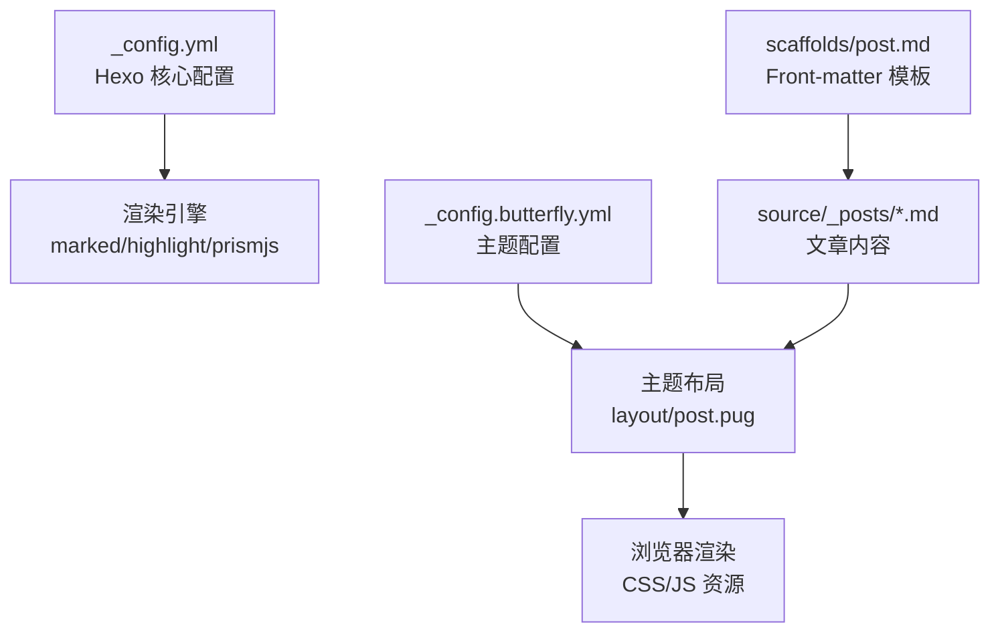
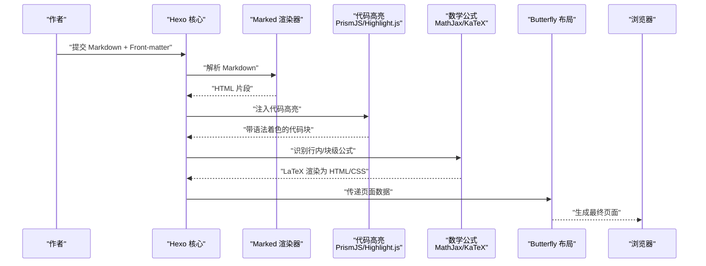
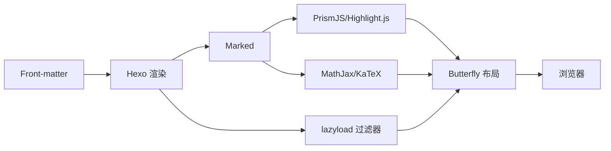

# 写作指南

<cite>
**本文引用的文件**
- [_config.yml](file://_config.yml)
- [_config.butterfly.yml](file://_config.butterfly.yml)
- [post.md](file://scaffolds/post.md)
- [hello-world.md](file://source/_posts/hello-world.md)
- [test-latex.md](file://source/_posts/test-latex.md)
- [post.pug](file://themes/butterfly/layout/post.pug)
- [note.js](file://themes/butterfly/scripts/tag\note.js)
- [tabs.js](file://themes/butterfly/scripts/tag\tabs.js)
- [button.js](file://themes/butterfly/scripts/tag\button.js)
- [gallery.js](file://themes/butterfly/scripts/tag\gallery.js)
- [inlineImg.js](file://themes/butterfly/scripts/tag\inlineImg.js)
- [label.js](file://themes/butterfly/scripts/tag\label.js)
- [post_lazyload.js](file://themes/butterfly/scripts/filters\post_lazyload.js)
- [utils.js](file://themes/butterfly/source\js\utils.js)
</cite>

## 目录
1. [简介](#简介)
2. [项目结构](#项目结构)
3. [核心组件](#核心组件)
4. [架构总览](#架构总览)
5. [详细组件分析](#详细组件分析)
6. [依赖关系分析](#依赖关系分析)
7. [性能考虑](#性能考虑)
8. [故障排查指南](#故障排查指南)
9. [结论](#结论)
10. [附录](#附录)

## 简介
本指南面向使用 Hexo + Butterfly 主题进行博客写作的作者，系统讲解 Markdown 语法在本项目中的完整用法与最佳实践，覆盖：
- 标题层级、段落格式、列表（有序/无序）、强调、删除线等基础语法
- 链接插入、图片添加、代码块、表格等高级功能
- 数学公式（行内与块级）的 LaTeX 语法与渲染配置
- 代码高亮的语言标识与主题样式
- Front-matter 元数据结构与字段含义（title、date、categories、tags、description 等）
- 主题提供的标签插件与增强能力（note、tabs、gallery、label、inlineImg、button 等）
- 渲染链路与性能优化（懒加载、PrismJS/Highlight.js、MathJax/KaTeX）

## 项目结构
本项目采用 Hexo + Butterfly 主题的标准目录组织方式：
- 配置文件：_config.yml（Hexo 核心配置）、_config.butterfly.yml（主题配置）
- 文章模板：scaffolds/post.md（默认 Front-matter 模板）
- 示例文章：source/_posts 下包含基础示例与 LaTeX 测试文章
- 主题布局与脚本：themes/butterfly/layout、scripts、source/js 等
- 自定义样式与脚本：source/css、source/js



图表来源
- [_config.yml:31-55](file://_config.yml#L31-L55)
- [_config.butterfly.yml:282-295](file://_config.butterfly.yml#L282-L295)
- [post.pug:1-36](file://themes/butterfly/layout/post.pug#L1-L36)

章节来源
- [_config.yml:1-173](file://_config.yml#L1-L173)
- [_config.butterfly.yml:1-690](file://_config.butterfly.yml#L1-L690)
- [post.md:1-6](file://scaffolds/post.md#L1-L6)

## 核心组件
- 渲染配置
  - Markdown 渲染器：marked（支持 prependRoot、postAsset）
  - 代码高亮：highlight（highlight.js）与 prismjs（可选）
- 主题增强
  - 数学公式：MathJax（默认）或 KaTeX（可选）
  - 图片懒加载：原生 loading=lazy 或自定义占位替换
  - 标签插件：note、tabs、gallery、label、inlineImg、button 等
- 布局与输出
  - 文章容器与元信息展示由主题布局负责

章节来源
- [_config.yml:152-156](file://_config.yml#L152-L156)
- [_config.yml:44-54](file://_config.yml#L44-L54)
- [_config.butterfly.yml:282-295](file://_config.butterfly.yml#L282-L295)
- [post.pug:8-13](file://themes/butterfly/layout/post.pug#L8-L13)

## 架构总览
下图展示了从 Markdown 到最终页面渲染的关键流程，包括 Front-matter 解析、Markdown 渲染、代码高亮、数学公式处理与主题布局。



图表来源
- [_config.yml:152-156](file://_config.yml#L152-L156)
- [_config.yml:44-54](file://_config.yml#L44-L54)
- [_config.butterfly.yml:282-295](file://_config.butterfly.yml#L282-L295)
- [post.pug:8-13](file://themes/butterfly/layout/post.pug#L8-L13)

## 详细组件分析

### Markdown 基础语法
- 标题层级：使用 # 到 ######，建议按层级递进，避免跳级
- 段落与换行：空行分隔段落；需要强制换行时使用两个以上空格加回车
- 强调与删除线：使用 *斜体*、**粗体**、~~删除线~~
- 列表
  - 无序：使用 -、+、*
  - 有序：使用数字后跟点与空格
  - 子列表需正确缩进
- 引用：使用 > 开头，支持多层嵌套
- 表格：使用 | 与 --- 构建表头与分隔线
- 链接：[文本](URL)；自动链接 <https://example.com>
- 图片：
- 代码
  - 行内代码：使用单个反引号包裹
  - 代码块：使用三个反引号包裹，并指定语言（如 python、bash、js 等）
- 分割线：使用三个及以上星号或连字符

参考示例文件
- [基础示例文章:1-39](file://source/_posts/hello-world.md#L1-L39)
- [LaTeX 测试文章:1-95](file://source/_posts/test-latex.md#L1-L95)

章节来源
- [hello-world.md:6-39](file://source/_posts/hello-world.md#L6-L39)
- [test-latex.md:14-95](file://source/_posts/test-latex.md#L14-L95)

### 数学公式（LaTeX）
- 行内公式：使用单个美元符号包裹表达式
- 块级公式：使用双美元符号包裹，独立成段
- 支持矩阵、积分、求和、极限等复杂表达式
- 渲染引擎：默认使用 MathJax；也可配置为 KaTeX

章节来源
- [_config.butterfly.yml:282-295](file://_config.butterfly.yml#L282-L295)
- [test-latex.md:14-50](file://source/_posts/test-latex.md#L14-L50)

### 代码高亮与语言标识
- 在代码块中使用语言标识（如 python、bash、js、cpp），以启用对应语法高亮
- 高亮引擎：highlight.js（默认）或 PrismJS（可选）
- 主题配置支持复制按钮、语言标签、Mac 风格样式等

章节来源
- [_config.yml:44-54](file://_config.yml#L44-L54)
- [_config.butterfly.yml:20-32](file://_config.butterfly.yml#L20-L32)
- [test-latex.md:52-64](file://source/_posts/test-latex.md#L52-L64)

### Front-matter 元数据
- 结构：使用 YAML 语法，以三个短横线包围
- 常用字段
  - title：文章标题
  - date：发布时间（受日期格式配置影响）
  - tags：标签数组
  - categories：分类数组
  - description：摘要（可被搜索引擎与社交分享使用）
- 默认模板：scaffolds/post.md 提供最小化 Front-matter 模板

章节来源
- [post.md:1-6](file://scaffolds/post.md#L1-L6)
- [hello-world.md:1-3](file://source/_posts/hello-world.md#L1-L3)
- [test-latex.md:1-10](file://source/_posts/test-latex.md#L1-L10)
- [_config.yml:70-73](file://_config.yml#L70-L73)

### 主题标签插件与增强
- note/tabs：提供富文本卡片与选项卡容器，支持图标与样式
- gallery/galleryGroup：相册与分组展示，支持 URL 或内容内图片解析
- inlineImg：行内图片插入，支持高度控制
- label：高亮标签，支持颜色类别
- button：美化按钮，支持颜色、轮廓、对齐、尺寸等选项

章节来源
- [note.js:1-28](file://themes/butterfly/scripts/tag\note.js#L1-L28)
- [tabs.js:1-52](file://themes/butterfly/scripts/tag\tabs.js#L1-L52)
- [gallery.js:1-77](file://themes/butterfly/scripts/tag\gallery.js#L1-L77)
- [inlineImg.js:1-20](file://themes/butterfly/scripts/tag\inlineImg.js#L1-L20)
- [label.js:1-15](file://themes/butterfly/scripts/tag\label.js#L1-L15)
- [button.js:1-22](file://themes/butterfly/scripts/tag\button.js#L1-L22)

### 布局与内容输出
- 文章容器与版权信息由主题布局负责
- 页面内容通过 page.content 注入，支持分页、相关文章、打赏等模块

章节来源
- [post.pug:1-36](file://themes/butterfly/layout/post.pug#L1-L36)

### 图片懒加载与性能
- 原生懒加载：将 img 标签替换为 loading="lazy"
- 占位替换：将 src 替换为占位图与 data-lazy-src，提升首屏性能
- 可按站点或文章级别开启

章节来源
- [post_lazyload.js:1-41](file://themes/butterfly/scripts/filters\post_lazyload.js#L1-L41)
- [_config.butterfly.yml:646-651](file://_config.butterfly.yml#L646-L651)

## 依赖关系分析
- 渲染链路
  - Front-matter → Hexo 渲染 → Marked → PrismJS/Highlight.js → MathJax/KaTeX → 主题布局 → 浏览器
- 主题过滤器
  - lazyload 过滤器在 HTML 渲染后或文章渲染后执行，统一替换图片属性



图表来源
- [_config.yml:152-156](file://_config.yml#L152-L156)
- [_config.yml:44-54](file://_config.yml#L44-L54)
- [_config.butterfly.yml:282-295](file://_config.butterfly.yml#L282-L295)
- [post_lazyload.js:29-40](file://themes/butterfly/scripts/filters\post_lazyload.js#L29-L40)

## 性能考虑
- 启用图片懒加载，减少首屏资源压力
- 合理使用代码高亮与数学公式，避免过多复杂公式导致渲染时间增加
- 使用主题提供的复制按钮与语言标签，提升阅读体验但注意不要滥用
- 控制文章长度与图片数量，配合懒加载与占位图优化加载速度

## 故障排查指南
- 数学公式不显示
  - 检查主题配置是否启用 MathJax/KaTeX
  - 确认公式语法正确（行内/块级分隔符）
- 代码高亮无效
  - 确认代码块包含语言标识
  - 检查 highlight.js 或 prismjs 的启用状态
- 图片加载慢或闪烁
  - 启用懒加载或占位替换
  - 确认图片路径正确且可访问
- 标签插件报错
  - 检查标签语法与参数顺序
  - 确认主题脚本已注册相应标签

章节来源
- [_config.butterfly.yml:282-295](file://_config.butterfly.yml#L282-L295)
- [_config.yml:44-54](file://_config.yml#L44-L54)
- [post_lazyload.js:1-41](file://themes/butterfly/scripts/filters\post_lazyload.js#L1-L41)
- [note.js:23-24](file://themes/butterfly/scripts/tag\note.js#L23-L24)
- [tabs.js:46-47](file://themes/butterfly/scripts/tag\tabs.js#L46-L47)

## 结论
本指南基于 Hexo + Butterfly 的实际配置与示例，总结了 Markdown 语法在本项目中的完整用法与最佳实践。通过合理使用 Front-matter、基础与高级 Markdown 语法、数学公式与代码高亮，结合主题标签插件与性能优化策略，可以高效产出高质量的博客内容。

## 附录

### Markdown 语法速查
- 标题：# 一级至 ###### 六级
- 强调：*斜体*、**粗体**、~~删除线~~
- 列表：无序 -/+/*；有序 1./2./3.
- 引用：> 段落
- 表格：| 列 | 列 |，--- 对齐
- 链接：[文本](URL)
- 图片：
- 代码：行内 `code`；块级 ```language
- 分割线：---

### Front-matter 字段说明
- title：文章标题
- date：发布时间（受日期格式配置影响）
- tags：标签数组
- categories：分类数组
- description：页面描述（SEO/社交分享）

章节来源
- [post.md:1-6](file://scaffolds/post.md#L1-L6)
- [_config.yml:70-73](file://_config.yml#L70-L73)