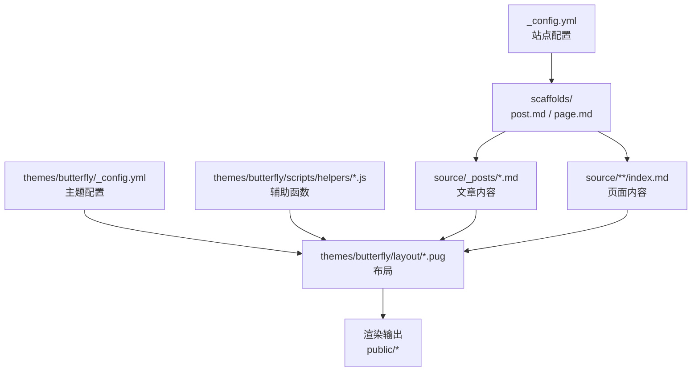
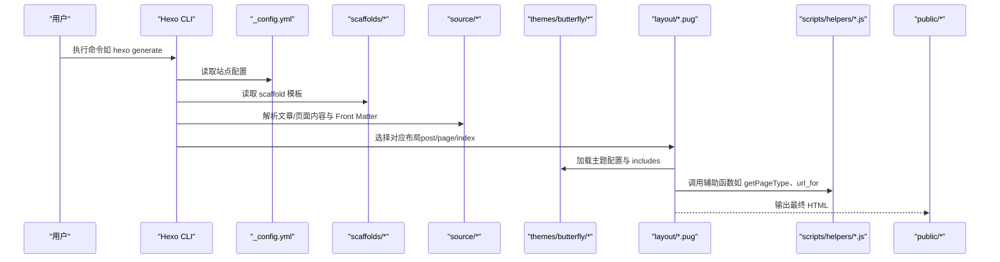
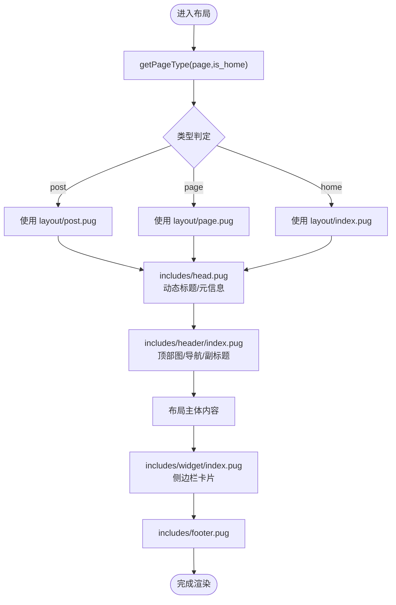
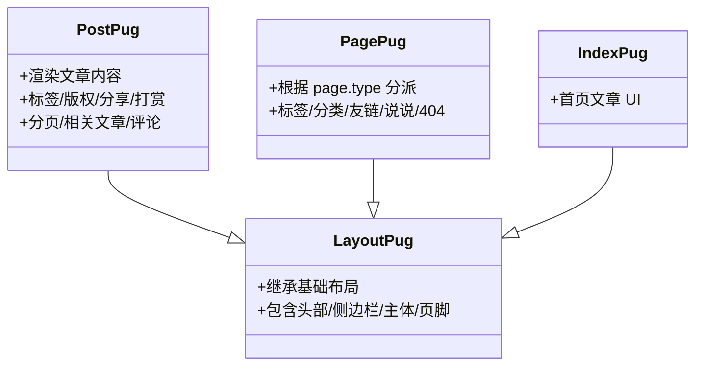
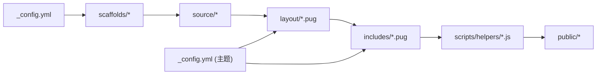

# 模板系统

<cite>
**本文引用的文件**
- [scaffolds/post.md](file://scaffolds/post.md)
- [scaffolds/page.md](file://scaffolds/page.md)
- [_config.yml](file://_config.yml)
- [themes/butterfly/_config.yml](file://themes/butterfly/_config.yml)
- [themes/butterfly/layout/includes/layout.pug](file://themes/butterfly/layout/includes/layout.pug)
- [themes/butterfly/layout/includes/head.pug](file://themes/butterfly/layout/includes/head.pug)
- [themes/butterfly/layout/includes/header/index.pug](file://themes/butterfly/layout/includes/header/index.pug)
- [themes/butterfly/layout/includes/widget/index.pug](file://themes/butterfly/layout/includes/widget/index.pug)
- [themes/butterfly/layout/post.pug](file://themes/butterfly/layout/post.pug)
- [themes/butterfly/layout/page.pug](file://themes/butterfly/layout/page.pug)
- [themes/butterfly/layout/index.pug](file://themes/butterfly/layout/index.pug)
- [themes/butterfly/scripts/helpers/page.js](file://themes/butterfly/scripts/helpers/page.js)
- [source/_posts/hello-world.md](file://source/_posts/hello-world.md)
- [source/about/index.md](file://source/about/index.md)
</cite>

## 目录
1. [引言](#引言)
2. [项目结构](#项目结构)
3. [核心组件](#核心组件)
4. [架构总览](#架构总览)
5. [详细组件分析](#详细组件分析)
6. [依赖关系分析](#依赖关系分析)
7. [性能考量](#性能考量)
8. [故障排查指南](#故障排查指南)
9. [结论](#结论)
10. [附录](#附录)

## 引言
本文件系统性阐述 Hexo 模板系统的工作原理与使用方法，结合当前仓库中的主题与脚手架，解释文章模板（post.md）与页面模板（page.md）的差异与用途；详解模板变量（如 date、title、slug、layout 等）的来源与用法；介绍如何自定义模板（模板语法、条件判断、循环遍历等），并提供可落地的定制示例与最佳实践。

## 项目结构
本项目采用 Hexo 标准目录组织，配合 Butterfly 主题与 Pug 模板引擎。关键位置如下：
- scaffolds：新建文章/页面时使用的模板骨架，决定 Front Matter 默认字段与初始内容。
- source：源内容目录，包含文章、页面、草稿、静态资源等。
- themes/butterfly：主题目录，包含布局（layout）、辅助函数（scripts/helpers）、语言包（languages）等。
- _config.yml：站点全局配置，影响生成行为与默认布局选择。
- themes/butterfly/_config.yml：主题配置，控制样式、功能开关、第三方集成等。

图表来源
- [_config.yml:32-39](file://_config.yml#L32-L39)
- [scaffolds/post.md:1-6](file://scaffolds/post.md#L1-L6)
- [scaffolds/page.md:1-5](file://scaffolds/page.md#L1-L5)
- [themes/butterfly/layout/post.pug:1-36](file://themes/butterfly/layout/post.pug#L1-L36)
- [themes/butterfly/layout/page.pug:1-32](file://themes/butterfly/layout/page.pug#L1-L32)
- [themes/butterfly/_config.yml:1-120](file://themes/butterfly/_config.yml#L1-L120)

章节来源
- [_config.yml:32-39](file://_config.yml#L32-L39)
- [scaffolds/post.md:1-6](file://scaffolds/post.md#L1-L6)
- [scaffolds/page.md:1-5](file://scaffolds/page.md#L1-L5)

## 核心组件
- 模板骨架（Scaffold）
  - 文章模板：用于 hexo new 生成文章时的默认 Front Matter 字段与初始内容。
  - 页面模板：用于生成非文章类页面（如关于页）的默认 Front Matter。
- 布局（Layout）
  - post.pug：文章页布局，负责文章内容区、标签展示、版权、打赏、分页、相关文章、评论等模块的拼装。
  - page.pug：页面布局，根据 page.type 分派到不同子页面（标签、分类、友链、说说、404 等）。
  - includes/layout.pug：全站基础布局，负责 HTML 结构、头部、侧边栏、主体内容、页脚等。
- 辅助函数（Helper）
  - scripts/helpers/page.js：提供 urlNoIndex、getPageType、getBgPath、cloudTags 等工具，供模板中调用。
- 主题配置（Theme Config）
  - themes/butterfly/_config.yml：控制导航、代码块、封面图、TOC、评论、统计、广告等主题功能开关与样式。

章节来源
- [themes/butterfly/layout/post.pug:1-36](file://themes/butterfly/layout/post.pug#L1-L36)
- [themes/butterfly/layout/page.pug:1-32](file://themes/butterfly/layout/page.pug#L1-L32)
- [themes/butterfly/layout/includes/layout.pug:1-59](file://themes/butterfly/layout/includes/layout.pug#L1-L59)
- [themes/butterfly/scripts/helpers/page.js:167-179](file://themes/butterfly/scripts/helpers/page.js#L167-L179)
- [themes/butterfly/_config.yml:118-254](file://themes/butterfly/_config.yml#L118-L254)

## 架构总览
Hexo 模板系统以“内容 + Front Matter + 布局 + 主题配置 + 辅助函数”为核心，渲染流程如下：

图表来源
- [_config.yml:32-39](file://_config.yml#L32-L39)
- [scaffolds/post.md:1-6](file://scaffolds/post.md#L1-L6)
- [scaffolds/page.md:1-5](file://scaffolds/page.md#L1-L5)
- [themes/butterfly/layout/post.pug:1-36](file://themes/butterfly/layout/post.pug#L1-L36)
- [themes/butterfly/layout/page.pug:1-32](file://themes/butterfly/layout/page.pug#L1-L32)
- [themes/butterfly/layout/includes/layout.pug:1-59](file://themes/butterfly/layout/includes/layout.pug#L1-L59)
- [themes/butterfly/scripts/helpers/page.js:167-179](file://themes/butterfly/scripts/helpers/page.js#L167-L179)

## 详细组件分析

### 文章模板（post.md）与页面模板（page.md）对比
- 相同点
  - 均以 YAML Front Matter 开头，支持通过 scaffold 注入默认字段。
- 不同点
  - 文章模板通常包含 tags 字段，便于按标签归档与索引；页面模板不包含 tags。
  - 文章模板默认 layout 为 post（由站点配置 default_layout 决定），页面模板常显式设置 layout 或 type。
- 实际示例
  - 文章模板：见 [scaffolds/post.md:1-6](file://scaffolds/post.md#L1-L6)
  - 页面模板：见 [scaffolds/page.md:1-5](file://scaffolds/page.md#L1-L5)
  - 新建文章后的内容示例：见 [source/_posts/hello-world.md:1-39](file://source/_posts/hello-world.md#L1-L39)
  - 页面示例（含 type、layout）：见 [source/about/index.md:1-6](file://source/about/index.md#L1-L6)

章节来源
- [scaffolds/post.md:1-6](file://scaffolds/post.md#L1-L6)
- [scaffolds/page.md:1-5](file://scaffolds/page.md#L1-L5)
- [source/_posts/hello-world.md:1-39](file://source/_posts/hello-world.md#L1-L39)
- [source/about/index.md:1-6](file://source/about/index.md#L1-L6)

### 模板变量与数据流
- 内置变量来源
  - Front Matter：由 scaffold 与用户手动编辑注入，如 title、date、tags、layout、type 等。
  - 站点配置：_config.yml 提供站点标题、语言、分页、链接格式等。
  - 主题配置：themes/butterfly/_config.yml 控制主题外观与功能开关。
  - 辅助函数：getPageType、url_for、getBgPath 等在模板中直接可用。
- 变量使用示例
  - 布局选择：通过 getPageType 判定页面类型，决定使用 post.pug 还是 page.pug。
  - 头部标题与元信息：在 includes/head.pug 中根据 globalPageType 与 page.title 动态生成。
  - 封面图与背景：在 includes/header/index.pug 中根据 page.type 与主题配置选择图片或颜色。
  - 侧边栏卡片：includes/widget/index.pug 根据 globalPageType 展示不同卡片集合。

图表来源
- [themes/butterfly/scripts/helpers/page.js:167-179](file://themes/butterfly/scripts/helpers/page.js#L167-L179)
- [themes/butterfly/layout/includes/layout.pug:1-59](file://themes/butterfly/layout/includes/layout.pug#L1-L59)
- [themes/butterfly/layout/includes/head.pug:1-78](file://themes/butterfly/layout/includes/head.pug#L1-L78)
- [themes/butterfly/layout/includes/header/index.pug:1-52](file://themes/butterfly/layout/includes/header/index.pug#L1-L52)
- [themes/butterfly/layout/includes/widget/index.pug:1-36](file://themes/butterfly/layout/includes/widget/index.pug#L1-L36)

章节来源
- [themes/butterfly/scripts/helpers/page.js:167-179](file://themes/butterfly/scripts/helpers/page.js#L167-L179)
- [themes/butterfly/layout/includes/head.pug:1-78](file://themes/butterfly/layout/includes/head.pug#L1-L78)
- [themes/butterfly/layout/includes/header/index.pug:1-52](file://themes/butterfly/layout/includes/header/index.pug#L1-L52)
- [themes/butterfly/layout/includes/widget/index.pug:1-36](file://themes/butterfly/layout/includes/widget/index.pug#L1-L36)

### 布局与页面类型分派
- post.pug
  - 继承 includes/layout.pug，渲染文章容器、内容、标签、版权、分享、打赏、分页、相关文章、评论等。
  - 条件判断：根据 theme.* 配置与 page.* 字段决定是否渲染某模块。
- page.pug
  - 继承 includes/layout.pug，通过 page.type 分派到不同页面类型（标签、分类、友链、说说、404 等）。
  - mixin 与 partial 的使用：统一加载评论模块，减少重复逻辑。
- index.pug
  - 继承 includes/layout.pug，引入首页文章 UI mixin 并渲染文章列表。

图表来源
- [themes/butterfly/layout/includes/layout.pug:1-59](file://themes/butterfly/layout/includes/layout.pug#L1-L59)
- [themes/butterfly/layout/post.pug:1-36](file://themes/butterfly/layout/post.pug#L1-L36)
- [themes/butterfly/layout/page.pug:1-32](file://themes/butterfly/layout/page.pug#L1-L32)
- [themes/butterfly/layout/index.pug:1-5](file://themes/butterfly/layout/index.pug#L1-L5)

章节来源
- [themes/butterfly/layout/post.pug:1-36](file://themes/butterfly/layout/post.pug#L1-L36)
- [themes/butterfly/layout/page.pug:1-32](file://themes/butterfly/layout/page.pug#L1-L32)
- [themes/butterfly/layout/index.pug:1-5](file://themes/butterfly/layout/index.pug#L1-L5)

### 自定义模板语法与逻辑
- 模板语法要点
  - 变量赋值：- var/const，如 page.aside、globalPageType。
  - 条件判断：if/else、case/when，如根据 theme.* 与 page.* 控制渲染。
  - 循环遍历：each，如渲染标签列表。
  - 包含与复用：include partial，如 include includes/header/index.pug。
  - 辅助函数：helpers 提供的工具函数，如 url_for、getPageType、getBgPath。
- 示例路径
  - 条件渲染与循环：[themes/butterfly/layout/post.pug:5-35](file://themes/butterfly/layout/post.pug#L5-L35)
  - 类型分派与评论加载：[themes/butterfly/layout/page.pug:16-31](file://themes/butterfly/layout/page.pug#L16-L31)
  - 基础布局与头部：[themes/butterfly/layout/includes/layout.pug:1-59](file://themes/butterfly/layout/includes/layout.pug#L1-L59)，[themes/butterfly/layout/includes/head.pug:1-78](file://themes/butterfly/layout/includes/head.pug#L1-L78)

章节来源
- [themes/butterfly/layout/post.pug:5-35](file://themes/butterfly/layout/post.pug#L5-L35)
- [themes/butterfly/layout/page.pug:16-31](file://themes/butterfly/layout/page.pug#L16-L31)
- [themes/butterfly/layout/includes/layout.pug:1-59](file://themes/butterfly/layout/includes/layout.pug#L1-L59)
- [themes/butterfly/layout/includes/head.pug:1-78](file://themes/butterfly/layout/includes/head.pug#L1-L78)

### 自定义模板的实际示例
以下示例均基于现有文件路径进行说明，避免直接粘贴代码内容。

- 添加自定义字段并在文章页显示
  - 在 scaffold 中增加字段：参考 [scaffolds/post.md:1-6](file://scaffolds/post.md#L1-L6)，在 Front Matter 中新增键值。
  - 在文章布局中渲染该字段：参考 [themes/butterfly/layout/post.pug:1-36](file://themes/butterfly/layout/post.pug#L1-L36)，在合适位置使用 page.<字段名>。
- 修改默认布局
  - 设置 default_layout：参考 [_config.yml:32-39](file://_config.yml#L32-L39)，将 default_layout 设为 desired 布局名称。
  - 在主题布局中扩展：参考 [themes/butterfly/layout/includes/layout.pug:1-59](file://themes/butterfly/layout/includes/layout.pug#L1-L59)。
- 自定义页面类型与分派
  - 在页面 Front Matter 中设置 type：参考 [source/about/index.md:4-5](file://source/about/index.md#L4-L5)。
  - 在 page.pug 中分派到新页面模板：参考 [themes/butterfly/layout/page.pug:16-31](file://themes/butterfly/layout/page.pug#L16-L31)。
- 使用辅助函数
  - 获取页面类型：参考 [themes/butterfly/scripts/helpers/page.js:167-179](file://themes/butterfly/scripts/helpers/page.js#L167-L179)。
  - 生成带参数的 URL：参考 [themes/butterfly/layout/includes/head.pug:37-38](file://themes/butterfly/layout/includes/head.pug#L37-L38)。

章节来源
- [scaffolds/post.md:1-6](file://scaffolds/post.md#L1-L6)
- [themes/butterfly/layout/post.pug:1-36](file://themes/butterfly/layout/post.pug#L1-L36)
- [_config.yml:32-39](file://_config.yml#L32-L39)
- [themes/butterfly/layout/includes/layout.pug:1-59](file://themes/butterfly/layout/includes/layout.pug#L1-L59)
- [source/about/index.md:4-5](file://source/about/index.md#L4-L5)
- [themes/butterfly/layout/page.pug:16-31](file://themes/butterfly/layout/page.pug#L16-L31)
- [themes/butterfly/scripts/helpers/page.js:167-179](file://themes/butterfly/scripts/helpers/page.js#L167-L179)
- [themes/butterfly/layout/includes/head.pug:37-38](file://themes/butterfly/layout/includes/head.pug#L37-L38)

## 依赖关系分析
- 组件耦合
  - 布局层（post/page/index）强依赖 includes/layout.pug 提供的基础结构。
  - includes/head.pug 依赖主题配置与国际化文案。
  - includes/header/index.pug 依赖主题配置与 getPageType 判定结果。
  - includes/widget/index.pug 依赖 globalPageType 与主题配置控制卡片展示。
- 外部依赖
  - 辅助函数（helpers/page.js）依赖 hexo-util、moment-timezone 等库。
  - 主题配置（_config.yml）影响生成器行为与链接格式。

图表来源
- [_config.yml:32-39](file://_config.yml#L32-L39)
- [scaffolds/post.md:1-6](file://scaffolds/post.md#L1-L6)
- [scaffolds/page.md:1-5](file://scaffolds/page.md#L1-L5)
- [source/_posts/hello-world.md:1-39](file://source/_posts/hello-world.md#L1-L39)
- [source/about/index.md:1-6](file://source/about/index.md#L1-L6)
- [themes/butterfly/layout/includes/layout.pug:1-59](file://themes/butterfly/layout/includes/layout.pug#L1-L59)
- [themes/butterfly/layout/includes/head.pug:1-78](file://themes/butterfly/layout/includes/head.pug#L1-L78)
- [themes/butterfly/layout/includes/header/index.pug:1-52](file://themes/butterfly/layout/includes/header/index.pug#L1-L52)
- [themes/butterfly/layout/includes/widget/index.pug:1-36](file://themes/butterfly/layout/includes/widget/index.pug#L1-L36)
- [themes/butterfly/scripts/helpers/page.js:167-179](file://themes/butterfly/scripts/helpers/page.js#L167-L179)
- [themes/butterfly/_config.yml:1-120](file://themes/butterfly/_config.yml#L1-L120)

章节来源
- [_config.yml:32-39](file://_config.yml#L32-L39)
- [themes/butterfly/_config.yml:1-120](file://themes/butterfly/_config.yml#L1-L120)

## 性能考量
- 模板缓存与片段缓存
  - includes/layout.pug 中使用 fragment_cache 与 partial 缓存，减少重复计算与网络请求。
- 资源懒加载与压缩
  - 主题配置中提供懒加载、CSS/JS 压缩选项，建议在生产环境开启以提升首屏性能。
- 图片与背景优化
  - getBgPath 支持颜色、绝对/相对 URL、简单文件名，合理选择可减少无效请求。
- 评论与第三方脚本
  - 评论系统按需加载，避免不必要的初始化开销。

章节来源
- [themes/butterfly/layout/includes/layout.pug:15-59](file://themes/butterfly/layout/includes/layout.pug#L15-L59)
- [themes/butterfly/scripts/helpers/page.js:123-133](file://themes/butterfly/scripts/helpers/page.js#L123-L133)
- [themes/butterfly/_config.yml:128-173](file://themes/butterfly/_config.yml#L128-L173)

## 故障排查指南
- 页面未按预期渲染
  - 检查 Front Matter 中 layout/type 是否正确，参考 [source/about/index.md:4-5](file://source/about/index.md#L4-L5)。
  - 确认 getPageType 判定逻辑，参考 [themes/butterfly/scripts/helpers/page.js:167-179](file://themes/butterfly/scripts/helpers/page.js#L167-L179)。
- 标题/元信息异常
  - 检查 includes/head.pug 的标题生成逻辑，确认 globalPageType 与 page.title 的取值。
- 封面图不显示
  - 检查 includes/header/index.pug 的图片选择逻辑与主题配置中的 default_top_img、index_img 等。
- 侧边栏卡片缺失
  - 检查 includes/widget/index.pug 的 globalPageType 分支与主题配置中的 aside 显示项。
- 评论未加载
  - 检查 page.comments 与 theme.comments.use 的组合，参考 [themes/butterfly/layout/post.pug:33-35](file://themes/butterfly/layout/post.pug#L33-L35) 与 [themes/butterfly/layout/page.pug:7-10](file://themes/butterfly/layout/page.pug#L7-L10)。

章节来源
- [source/about/index.md:4-5](file://source/about/index.md#L4-L5)
- [themes/butterfly/scripts/helpers/page.js:167-179](file://themes/butterfly/scripts/helpers/page.js#L167-L179)
- [themes/butterfly/layout/includes/head.pug:1-78](file://themes/butterfly/layout/includes/head.pug#L1-L78)
- [themes/butterfly/layout/includes/header/index.pug:1-52](file://themes/butterfly/layout/includes/header/index.pug#L1-L52)
- [themes/butterfly/layout/includes/widget/index.pug:1-36](file://themes/butterfly/layout/includes/widget/index.pug#L1-L36)
- [themes/butterfly/layout/post.pug:33-35](file://themes/butterfly/layout/post.pug#L33-L35)
- [themes/butterfly/layout/page.pug:7-10](file://themes/butterfly/layout/page.pug#L7-L10)

## 结论
本项目的模板系统以 Hexo 的内容驱动与 Butterfly 主题的 Pug 布局为核心，通过 scaffold、Front Matter、主题配置与辅助函数协同工作，实现了灵活且可扩展的页面渲染能力。理解文章模板与页面模板的差异、掌握模板变量与辅助函数的使用，并遵循最佳实践，即可高效地定制博客的视觉与交互体验。

## 附录
- 常用模板变量速览
  - Front Matter：title、date、tags、layout、type、top_img、cover 等。
  - 站点配置：title、subtitle、language、permalink、theme 等。
  - 主题配置：aside、toc、comments、math、search、darkmode 等。
- 常用辅助函数
  - getPageType、url_for、urlNoIndex、getBgPath、cloudTags、findArchivesTitle、truncate、postDesc、injectHtml、safeJSON 等。

章节来源
- [themes/butterfly/scripts/helpers/page.js:14-194](file://themes/butterfly/scripts/helpers/page.js#L14-L194)
- [themes/butterfly/_config.yml:1-120](file://themes/butterfly/_config.yml#L1-L120)
- [_config.yml:1-173](file://_config.yml#L1-L173)