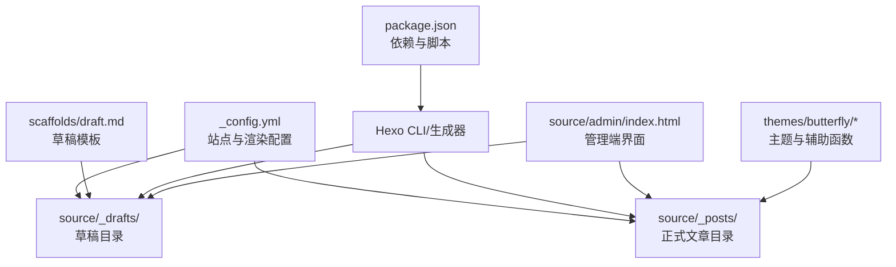
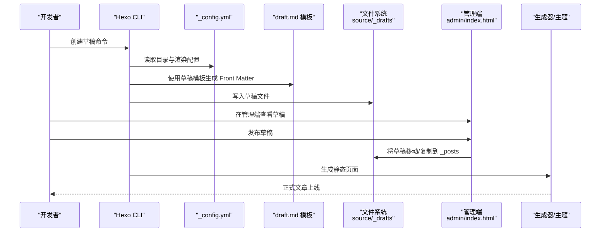
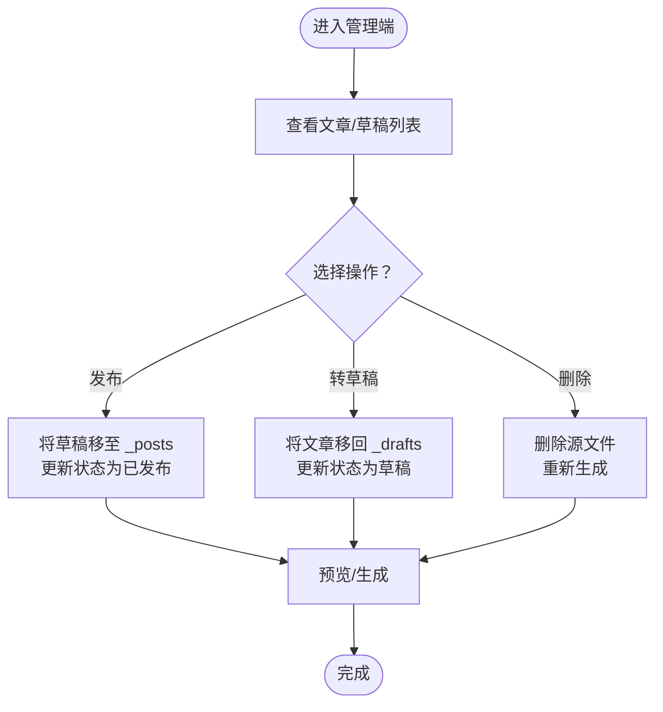
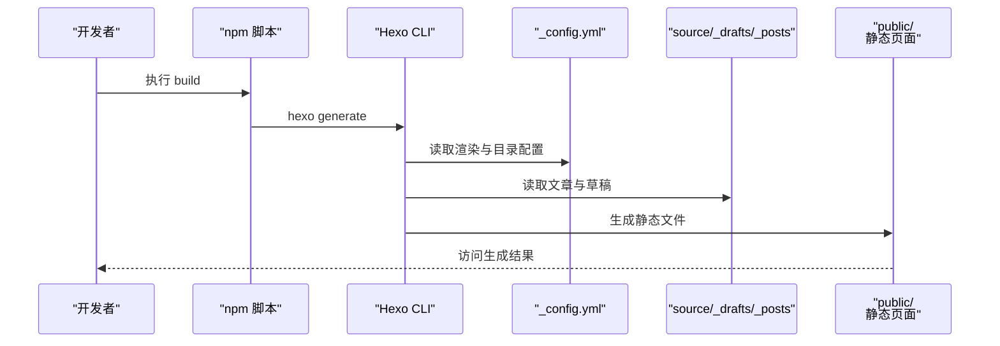
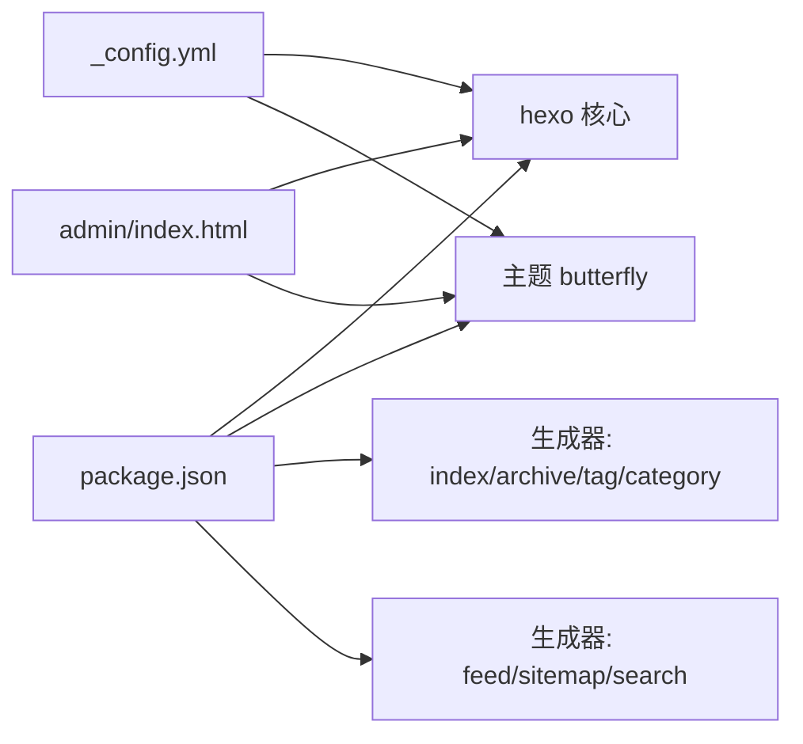

# 草稿管理

<cite>
**本文引用的文件**
- [_config.yml](file://_config.yml)
- [package.json](file://package.json)
- [draft.md](file://scaffolds/draft.md)
- [我的第一篇博客.md](file://source/_drafts/我的第一篇博客.md)
- [我的第一篇博客-1.md](file://source/_drafts/我的第一篇博客-1.md)
- [hello-world.md](file://source/_posts/hello-world.md)
- [index.html](file://source/admin/index.html)
- [page.js](file://themes/butterfly/scripts/helpers/page.js)
- [init.js](file://themes/butterfly/scripts/events/init.js)
</cite>

## 目录
1. [简介](#简介)
2. [项目结构](#项目结构)
3. [核心组件](#核心组件)
4. [架构总览](#架构总览)
5. [详细组件分析](#详细组件分析)
6. [依赖关系分析](#依赖关系分析)
7. [性能考量](#性能考量)
8. [故障排查指南](#故障排查指南)
9. [结论](#结论)
10. [附录](#附录)

## 简介
本文件面向使用 Hexo 的用户，系统化阐述“草稿管理”的完整流程与最佳实践，覆盖以下主题：
- 草稿的创建、保存与发布
- 草稿文件的存储位置与命名规范
- 草稿状态管理（编辑、删除、转换为正式文章）
- 草稿与正式文章的区别及转换过程
- 版本控制与备份策略建议
- 实际操作示例与常见问题解决方案

## 项目结构
本仓库采用标准 Hexo 结构，草稿位于 source/_drafts 目录；正式文章位于 source/_posts 目录；站点配置在根目录的 _config.yml 中；主题为 butterfly；管理端界面位于 source/admin/index.html。

图表来源
- [_config.yml:21-44](file://_config.yml#L21-L44)
- [package.json:16-36](file://package.json#L16-L36)
- [draft.md:1-5](file://scaffolds/draft.md#L1-L5)
- [index.html:488-572](file://source/admin/index.html#L488-L572)

章节来源
- [_config.yml:21-44](file://_config.yml#L21-L44)
- [package.json:16-36](file://package.json#L16-L36)
- [draft.md:1-5](file://scaffolds/draft.md#L1-L5)
- [index.html:488-572](file://source/admin/index.html#L488-L572)

## 核心组件
- 配置层：通过 _config.yml 控制渲染行为（如是否渲染草稿）、目录结构、时间格式等。
- 模板层：scaffolds/draft.md 定义新草稿的默认 Front Matter 字段。
- 内容层：source/_drafts 与 source/_posts 分别存放草稿与正式文章。
- 管理端：source/admin/index.html 提供草稿/文章的列表、编辑与发布/转草稿操作入口。
- 主题与辅助：themes/butterfly 提供页面类型判断、版本信息等辅助能力，影响文章在前端的呈现。

章节来源
- [_config.yml:21-44](file://_config.yml#L21-L44)
- [draft.md:1-5](file://scaffolds/draft.md#L1-L5)
- [index.html:488-572](file://source/admin/index.html#L488-L572)
- [page.js:148-193](file://themes/butterfly/scripts/helpers/page.js#L148-L193)

## 架构总览
下图展示从“创建/编辑草稿”到“发布为正式文章”的端到端流程，以及与配置、模板、内容目录、管理端的关系。

图表来源
- [_config.yml:21-44](file://_config.yml#L21-L44)
- [draft.md:1-5](file://scaffolds/draft.md#L1-L5)
- [index.html:488-572](file://source/admin/index.html#L488-L572)
- [page.js:148-193](file://themes/butterfly/scripts/helpers/page.js#L148-L193)

## 详细组件分析

### 草稿创建与模板
- 新建草稿时，Hexo 会依据 scaffolds/draft.md 生成默认 Front Matter，便于统一字段（如标题、标签）。
- 草稿文件以 Markdown 文档形式存放在 source/_drafts 目录中，文件名通常与标题相关，但具体命名由项目约定决定。

章节来源
- [draft.md:1-5](file://scaffolds/draft.md#L1-L5)
- [_config.yml:21-33](file://_config.yml#L21-L33)

### 草稿存储位置与命名规范
- 存储位置：source/_drafts
- 命名规范：仓库中可见的草稿文件名为“中文标题.md”或“中文标题-序号.md”，可作为命名参考；实际命名应保持清晰、唯一且不包含非法字符。
- 目录结构：_config.yml 中定义了 source_dir 为 source，确保草稿与文章目录均位于 source 下。

章节来源
- [_config.yml:21-23](file://_config.yml#L21-L23)
- [我的第一篇博客.md:1-6](file://source/_drafts/我的第一篇博客.md#L1-L6)
- [我的第一篇博客-1.md:1-6](file://source/_drafts/我的第一篇博客-1.md#L1-L6)

### 草稿状态管理（编辑、删除、转换）
- 列表与状态显示：管理端 admin/index.html 展示文章列表，区分草稿与已发布，并显示日期等元信息。
- 发布/转草稿：管理端提供“发布”（草稿→正式）与“转为草稿”（已发布→草稿）按钮，对应操作会更新草稿/文章状态并在前端显示相应状态标签。
- 删除：管理端未直接暴露删除按钮，可通过文件系统直接删除 source/_drafts 或 source/_posts 对应文件后重新生成。

图表来源
- [index.html:488-572](file://source/admin/index.html#L488-L572)

章节来源
- [index.html:488-572](file://source/admin/index.html#L488-L572)

### 草稿与正式文章的区别与转换
- 区别：草稿位于 source/_drafts，正式文章位于 source/_posts；管理端通过 isDraft 标记区分两者。
- 转换：发布即从 _drafts 移动到 _posts；转草稿则相反。转换后需重新生成静态文件以生效。

章节来源
- [_config.yml:21-23](file://_config.yml#L21-L23)
- [index.html:488-572](file://source/admin/index.html#L488-L572)

### 渲染与生成
- 渲染开关：render_drafts 默认关闭，意味着草稿不会被渲染输出；开启后可在本地预览草稿。
- 生成流程：package.json 中的 build 脚本调用 hexo generate，将 _posts 与其它内容生成静态页面；主题与辅助函数参与页面类型判断与数据处理。

图表来源
- [package.json:6-12](file://package.json#L6-L12)
- [_config.yml:32-44](file://_config.yml#L32-L44)

章节来源
- [package.json:6-12](file://package.json#L6-L12)
- [_config.yml:32-44](file://_config.yml#L32-L44)

### 主题辅助与页面类型
- 页面类型判断：主题 helpers 提供 getPageType 等辅助函数，用于根据页面属性返回布局类型，影响文章在前端的呈现。
- 时间处理：对日期进行时区转换与渲染，保证页面内容一致性。

章节来源
- [page.js:148-193](file://themes/butterfly/scripts/helpers/page.js#L148-L193)

## 依赖关系分析
- package.json 声明了 hexo 与主题、生成器、过滤器等依赖，构建与运行脚本由 npm scripts 统一管理。
- _config.yml 控制目录结构、渲染选项（如 render_drafts），直接影响草稿是否参与生成。
- 管理端 admin/index.html 与主题脚本共同协作，提供草稿/文章的可视化管理与预览。

图表来源
- [package.json:16-36](file://package.json#L16-L36)
- [_config.yml:21-44](file://_config.yml#L21-L44)
- [index.html:488-572](file://source/admin/index.html#L488-L572)

章节来源
- [package.json:16-36](file://package.json#L16-L36)
- [_config.yml:21-44](file://_config.yml#L21-L44)
- [index.html:488-572](file://source/admin/index.html#L488-L572)

## 性能考量
- 仅在需要时开启草稿渲染（render_drafts），避免不必要的生成开销。
- 合理设置分页与压缩策略，减少生成时间与产物体积。
- 使用主题提供的懒加载与压缩功能，提升前端加载性能。

## 故障排查指南
- 草稿未出现在生成结果中
  - 检查 _config.yml 中 render_drafts 是否为 false；若需预览草稿，请临时设为 true。
  - 确认草稿文件位于 source/_drafts 目录，且 Front Matter 完整。
- 发布后页面未更新
  - 确认已执行生成命令；检查管理端是否正确将草稿移至 _posts。
  - 若手动移动文件，需重新执行生成流程。
- 管理端无法显示草稿/文章
  - 确认管理端页面已正确加载数据接口；检查浏览器控制台是否存在网络错误。
- 主题页面类型异常
  - 检查主题 helpers 的 getPageType 逻辑是否被自定义覆盖；确认页面属性与预期一致。

章节来源
- [_config.yml:32-44](file://_config.yml#L32-L44)
- [index.html:488-572](file://source/admin/index.html#L488-L572)
- [page.js:148-193](file://themes/butterfly/scripts/helpers/page.js#L148-L193)

## 结论
本仓库通过明确的目录划分、配置开关与管理端界面，实现了草稿的全生命周期管理。遵循本文的命名规范、操作流程与最佳实践，可有效提升写作效率与内容质量。

## 附录

### 实操示例（步骤说明）
- 创建草稿
  - 使用 Hexo 命令创建新草稿，模板将自动填充 Front Matter。
  - 文件写入 source/_drafts。
- 编辑草稿
  - 在管理端打开草稿，修改标题、内容与元信息。
- 发布草稿
  - 在管理端点击“发布”，草稿移至 _posts 并标记为已发布。
- 转为草稿
  - 在管理端点击“转为草稿”，文章回到 _drafts 并标记为草稿。
- 删除草稿
  - 在管理端未提供删除按钮时，可直接删除 source/_drafts 对应文件，再重新生成。

章节来源
- [draft.md:1-5](file://scaffolds/draft.md#L1-L5)
- [index.html:488-572](file://source/admin/index.html#L488-L572)

### 最佳实践
- 版本控制
  - 将 source/_drafts 与 source/_posts 纳入 Git；建议按主题/功能分支管理草稿，合并后再发布。
- 备份策略
  - 定期导出 Front Matter 与正文，结合 Git 提交记录进行增量备份。
- 命名规范
  - 使用语义化文件名（如“2025-04-01-草稿标题.md”），避免特殊字符与重复。
- 发布前检查
  - 校对标题、分类、标签、日期；必要时启用草稿渲染进行本地预览。

### 参考文件
- 草稿示例文件
  - [我的第一篇博客.md](file://source/_drafts/我的第一篇博客.md)
  - [我的第一篇博客-1.md](file://source/_drafts/我的第一篇博客-1.md)
- 正式文章示例
  - [hello-world.md](file://source/_posts/hello-world.md)