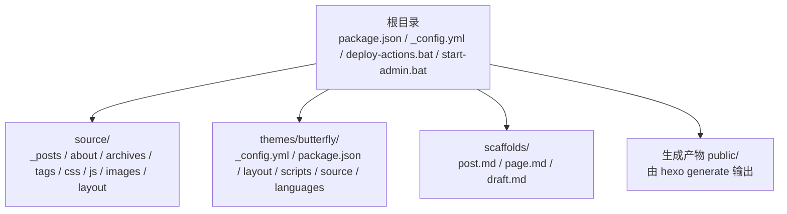
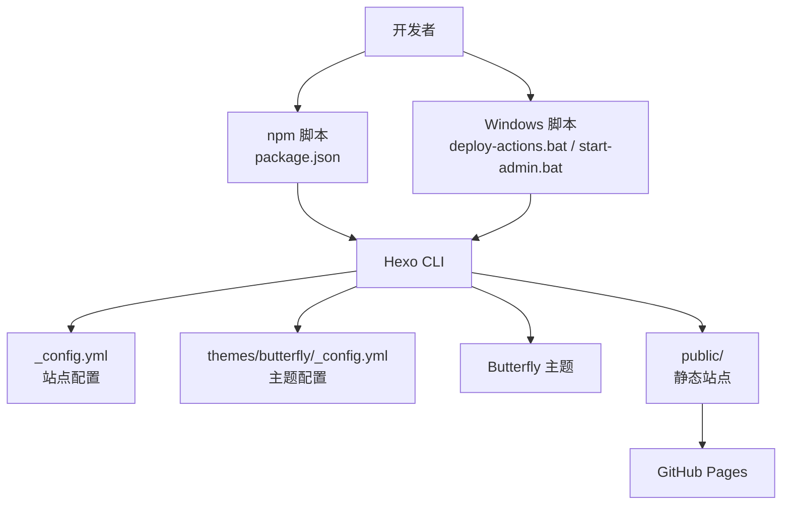
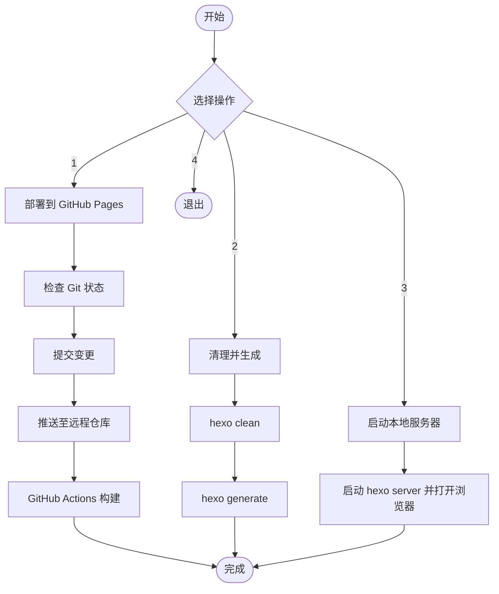
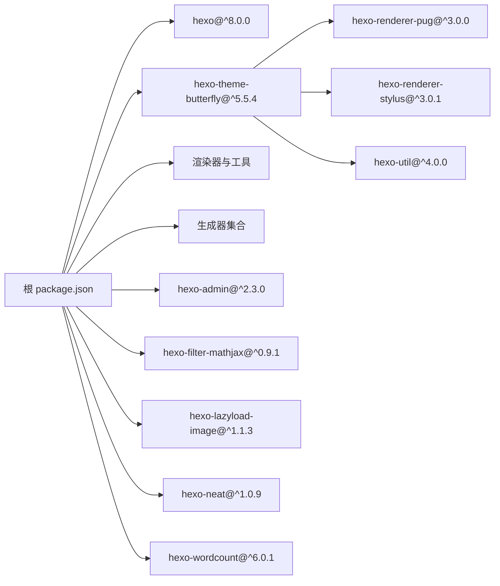

# 快速开始

<cite>
**本文引用的文件**
- [package.json](file://package.json)
- [_config.yml](file://_config.yml)
- [_config.butterfly.yml](file://_config.butterfly.yml)
- [themes/butterfly/_config.yml](file://themes/butterfly/_config.yml)
- [themes/butterfly/package.json](file://themes/butterfly/package.json)
- [README.md](file://README.md)
- [deploy-actions.bat](file://deploy-actions.bat)
- [start-admin.bat](file://start-admin.bat)
- [source/_posts/hello-world.md](file://source/_posts/hello-world.md)
- [scaffolds/post.md](file://scaffolds/post.md)
- [source/about/index.md](file://source/about/index.md)
- [source/archives/index.md](file://source/archives/index.md)
</cite>

## 目录
1. [简介](#简介)
2. [项目结构](#项目结构)
3. [核心组件](#核心组件)
4. [架构总览](#架构总览)
5. [详细组件分析](#详细组件分析)
6. [依赖关系分析](#依赖关系分析)
7. [性能考虑](#性能考虑)
8. [故障排除指南](#故障排除指南)
9. [结论](#结论)
10. [附录](#附录)

## 简介
本指南面向首次使用 Hexo 的用户，帮助你在最短时间内完成环境准备、安装依赖、本地运行、基础配置与首次发布。该仓库基于 Hexo 8.x 与 Butterfly 主题，内置一键部署脚本与管理后台，适合快速搭建个人博客并开始内容创作。

## 项目结构
仓库采用标准 Hexo 结构，结合自定义主题与本地化配置：
- 根目录包含 Hexo 主配置、主题配置、构建脚本与启动脚本
- source 目录存放文章、页面与静态资源
- themes/butterfly 为主题源码与主题配置
- scaffolds 提供文章草稿模板
- 预置示例文章与页面用于快速验证

图表来源
- [package.json:1-42](file://package.json#L1-L42)
- [_config.yml:1-173](file://_config.yml#L1-L173)
- [themes/butterfly/_config.yml:1-1137](file://themes/butterfly/_config.yml#L1-L1137)

章节来源
- [package.json:1-42](file://package.json#L1-L42)
- [_config.yml:1-173](file://_config.yml#L1-L173)
- [themes/butterfly/_config.yml:1-1137](file://themes/butterfly/_config.yml#L1-L1137)

## 核心组件
- Hexo 核心与插件：通过根目录 package.json 管理 Hexo 版本与渲染器、生成器、主题与扩展插件
- 主题 Butterfly：通过 themes/butterfly/_config.yml 控制导航、样式、评论、统计、广告等主题行为
- 本地配置 _config.yml：控制站点信息、URL、目录、分页、部署、Feed、Sitemap、懒加载、压缩等
- 构建与运行脚本：提供 npm 脚本与 Windows 批处理脚本，支持本地服务、清理缓存、生成静态文件与一键部署

章节来源
- [package.json:16-40](file://package.json#L16-L40)
- [_config.yml:85-173](file://_config.yml#L85-L173)
- [themes/butterfly/_config.yml:1-800](file://themes/butterfly/_config.yml#L1-L800)

## 架构总览
下图展示了从本地开发到部署的整体流程，以及关键配置文件与主题的关系。

图表来源
- [package.json:6-12](file://package.json#L6-L12)
- [deploy-actions.bat:27-73](file://deploy-actions.bat#L27-L73)
- [start-admin.bat:12-45](file://start-admin.bat#L12-L45)
- [_config.yml:85-173](file://_config.yml#L85-L173)
- [themes/butterfly/_config.yml:1-1137](file://themes/butterfly/_config.yml#L1-L1137)

## 详细组件分析

### 环境要求与安装
- Node.js 版本：要求 Node.js >= 18.0.0
- 安装依赖：在项目根目录执行安装命令以拉取 Hexo 与主题所需依赖
- 启动本地服务：使用 npm 脚本或 Windows 批处理脚本启动本地服务器

章节来源
- [package.json:38-40](file://package.json#L38-L40)
- [README.md:66-86](file://README.md#L66-L86)
- [deploy-actions.bat:90-100](file://deploy-actions.bat#L90-L100)
- [start-admin.bat:12-45](file://start-admin.bat#L12-L45)

### 本地开发与首次运行
- 本地服务启动
  - 使用 npm 脚本启动：npm run server
  - 使用批处理启动：双击 start-admin.bat，自动清理缓存、生成静态文件并启动本地服务
- 预览效果
  - 默认访问地址：http://localhost:4000
  - 管理后台：http://localhost:4000/admin（用户名：admin）

章节来源
- [README.md:70-86](file://README.md#L70-L86)
- [start-admin.bat:32-45](file://start-admin.bat#L32-L45)

### 关键配置文件说明

#### Hexo 主配置 _config.yml
- 站点信息：标题、副标题、描述、关键词、作者、语言与时区
- URL 与链接：站点 URL、永久链接格式、美化 URL
- 目录与渲染：source_dir、public_dir、渲染器与语法高亮
- 写作与草稿：新文章命名、默认布局、是否渲染草稿
- 分页与首页：首页每页数量、排序规则
- 主题与扩展：主题名称、Admin 管理后台、Feed、Sitemap、robots、懒加载、压缩等
- 部署：当前禁用，可按需启用 GitHub Pages 部署

章节来源
- [_config.yml:4-173](file://_config.yml#L4-L173)

#### 主题配置 themes/butterfly/_config.yml
- 导航与菜单：导航栏固定、Logo、菜单项
- 代码块：主题、Mac 风格、高度限制、工具栏
- 社交媒体：头像、社交链接
- 图片与封面：Favicon、头像、Banner 图、默认封面
- 文章元数据：首页与文章页的时间显示、分类与标签
- 首页布局：布局样式、摘要截断
- 文章设置：目录、版权、打赏、相关文章、分页
- 侧边栏：作者卡片、公告、最近文章、分类、标签、归档、网站信息
- 深色/浅色模式：开关、自动切换、按钮
- 全局功能：锚点、复制、字数统计、不蒜子 PV/UV
- 数学公式：MathJax/KaTeX 支持
- 搜索：Algolia、本地搜索、Docsearch
- 评论系统：多种评论插件配置占位
- 统计与分析：百度统计、Google Analytics、Cloudflare、Umami、Tag Manager
- 广告：Google AdSense 与手动插入位置
- 验证：站点验证
- 美化与特效：主题色、圆角、遮罩、加载动画、字体、Lightbox、PWA、注入 CSS/JS、CDN

章节来源
- [themes/butterfly/_config.yml:1-1137](file://themes/butterfly/_config.yml#L1-L1137)

#### 个性化主题配置 _config.butterfly.yml
- 导航与菜单：中文菜单项、Logo、固定导航
- 代码块与社交：主题与工具栏
- 图片与封面：Favicon、头像、默认封面、错误页图
- 文章元数据与首页：时间显示、布局、摘要
- 文章设置：目录、版权、相关文章、分页
- 侧边栏：作者、公告、最近文章、分类、标签、归档、网站信息
- 深色模式与全局：深色模式、锚点、复制、字数统计、不蒜子
- 数学公式：MathJax 配置
- 搜索：本地搜索启用与参数
- 评论系统：全部禁用
- 统计与分析：均为空
- 广告与验证：均为空
- 美化与特效：主题色、圆角、遮罩、加载动画、字体、Lightbox、PWA、注入 CSS/JS、CDN

章节来源
- [_config.butterfly.yml:1-690](file://_config.butterfly.yml#L1-L690)

### 构建与部署流程

#### 一键部署脚本 deploy-actions.bat
- 功能：检查 Git 状态、提交变更、推送到远程仓库，触发 GitHub Actions 构建并打开站点链接
- 使用：双击运行，选择 1 进行部署；选择 2 清理并生成；选择 3 启动本地服务

图表来源
- [deploy-actions.bat:17-73](file://deploy-actions.bat#L17-L73)

章节来源
- [deploy-actions.bat:17-105](file://deploy-actions.bat#L17-L105)

#### 管理后台启动脚本 start-admin.bat
- 功能：清理缓存、生成静态文件、启动本地服务并打开管理后台页面
- 使用：双击运行，自动打开 http://localhost:4000/admin

章节来源
- [start-admin.bat:12-45](file://start-admin.bat#L12-L45)

### 文章与页面模板
- 文章模板：scaffolds/post.md 提供标题、日期、标签的 YAML Front Matter 模板
- 示例文章：source/_posts/hello-world.md 展示了常用命令与文档链接
- 页面示例：source/about/index.md、source/archives/index.md 作为基础页面模板

章节来源
- [scaffolds/post.md:1-6](file://scaffolds/post.md#L1-L6)
- [source/_posts/hello-world.md:1-39](file://source/_posts/hello-world.md#L1-L39)
- [source/about/index.md:1-49](file://source/about/index.md#L1-L49)
- [source/archives/index.md:1-7](file://source/archives/index.md#L1-L7)

## 依赖关系分析
- Hexo 版本：由根目录 package.json 的 hexo.version 指定
- 主题依赖：Butterfly 主题自身声明了渲染器与工具依赖
- 插件生态：渲染器（EJS、Marked、Pug、Stylus）、生成器（索引、归档、分类、标签、Feed、Sitemap、搜索）、主题与扩展（Admin、Lazyload、Neat、Wordcount、MathJax）

图表来源
- [package.json:16-36](file://package.json#L16-L36)
- [themes/butterfly/package.json:25-30](file://themes/butterfly/package.json#L25-L30)

章节来源
- [package.json:16-36](file://package.json#L16-L36)
- [themes/butterfly/package.json:25-30](file://themes/butterfly/package.json#L25-L30)

## 性能考虑
- 静态资源压缩：启用 hexo-neat 对 HTML/CSS/JS 进行压缩
- 图片懒加载：开启懒加载减少首屏压力
- 本地搜索：预加载本地搜索数据提升搜索体验
- CDN 注入：通过主题配置注入第三方 CDN 资源
- 代码块与目录：合理配置避免过度渲染影响性能

章节来源
- [_config.yml:157-173](file://_config.yml#L157-L173)
- [_config.butterfly.yml:306-313](file://_config.butterfly.yml#L306-L313)
- [_config.butterfly.yml:646-651](file://_config.butterfly.yml#L646-L651)
- [_config.butterfly.yml:684-690](file://_config.butterfly.yml#L684-L690)

## 故障排除指南
- Node.js 版本不满足要求
  - 症状：安装失败或运行报错
  - 解决：升级 Node.js 至 >= 18.0.0
  - 参考：[package.json:38-40](file://package.json#L38-L40)
- 依赖安装失败
  - 症状：npm install 报错
  - 解决：检查网络与代理，重试安装；必要时删除 node_modules 与 package-lock.json 后重新安装
  - 参考：[package.json:16-36](file://package.json#L16-L36)
- 本地服务无法启动
  - 症状：端口被占用或启动失败
  - 解决：更换端口或关闭占用进程；使用 start-admin.bat 启动管理后台
  - 参考：[start-admin.bat:32-45](file://start-admin.bat#L32-L45)
- 部署脚本执行失败
  - 症状：git status/add/commit/push 失败
  - 解决：检查 Git 配置与远程仓库权限；确认网络连通性
  - 参考：[deploy-actions.bat:34-62](file://deploy-actions.bat#L34-L62)
- 主题配置冲突
  - 症状：页面样式异常或功能未生效
  - 解决：核对 _config.yml 与 _config.butterfly.yml 的配置项；优先使用主题配置覆盖默认值
  - 参考：[_config.yml:85](file://_config.yml#L85), [_config.butterfly.yml:1-1137](file://_config.butterfly.yml#L1-L1137)

章节来源
- [package.json:38-40](file://package.json#L38-L40)
- [package.json:16-36](file://package.json#L16-L36)
- [start-admin.bat:32-45](file://start-admin.bat#L32-L45)
- [deploy-actions.bat:34-62](file://deploy-actions.bat#L34-L62)
- [_config.yml:85](file://_config.yml#L85)
- [_config.butterfly.yml:1-1137](file://_config.butterfly.yml#L1-L1137)

## 结论
通过本快速开始指南，你可以在本地完成环境准备、安装依赖、启动服务与管理后台，并了解关键配置文件的作用。建议先从 start-admin.bat 启动管理后台进行内容创作，再根据需要调整主题配置与站点配置，最后使用 deploy-actions.bat 将站点部署到 GitHub Pages。

## 附录

### 常用命令与路径
- 安装依赖：npm install
- 启动本地服务：npm run server
- 生成静态文件：npm run build
- 清理缓存：npm run clean
- 管理后台启动：start-admin.bat
- 一键部署：deploy-actions.bat

章节来源
- [README.md:66-86](file://README.md#L66-L86)
- [start-admin.bat:12-45](file://start-admin.bat#L12-L45)
- [deploy-actions.bat:90-100](file://deploy-actions.bat#L90-L100)