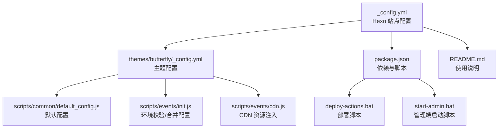
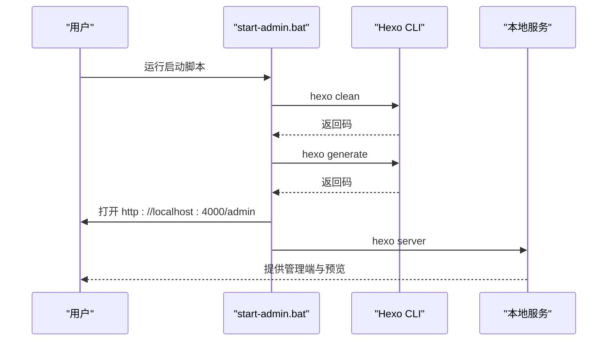
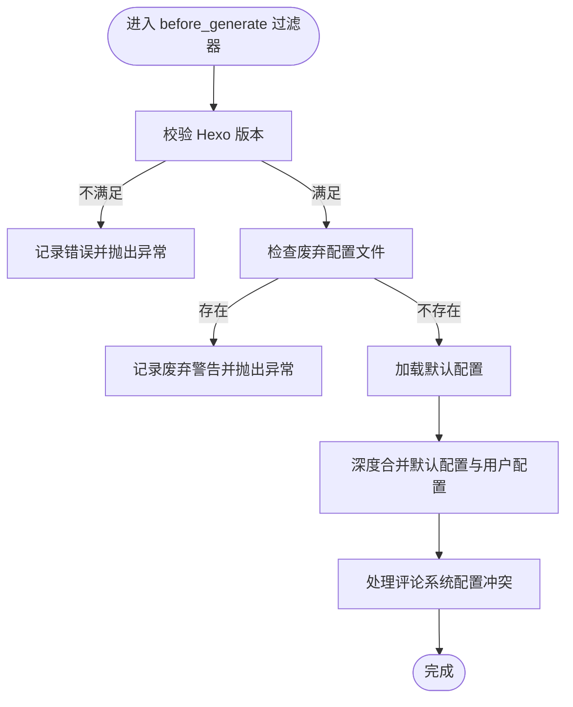
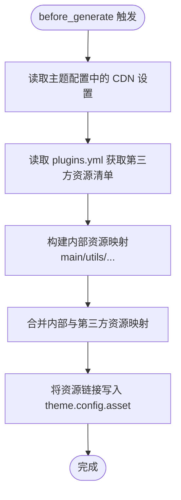
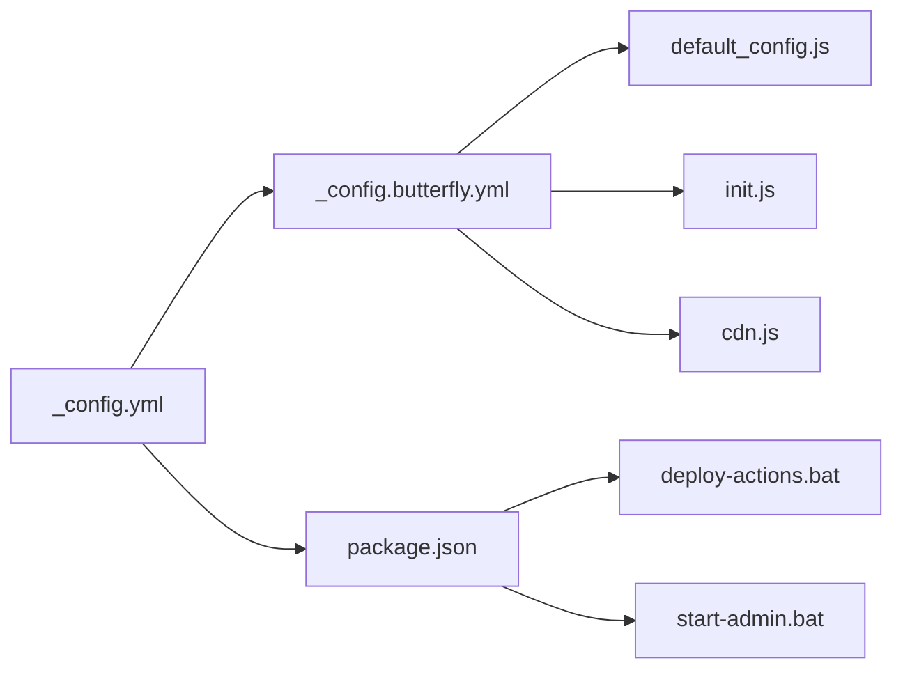

# 故障排除

<cite>
**本文引用的文件**
- [_config.yml](file://_config.yml)
- [_config.butterfly.yml](file://_config.butterfly.yml)
- [package.json](file://package.json)
- [deploy-actions.bat](file://deploy-actions.bat)
- [start-admin.bat](file://start-admin.bat)
- [README.md](file://README.md)
- [themes/butterfly/_config.yml](file://themes/butterfly/_config.yml)
- [themes/butterfly/scripts/events/init.js](file://themes/butterfly/scripts/events/init.js)
- [themes/butterfly/scripts/events/cdn.js](file://themes/butterfly/scripts/events/cdn.js)
- [themes/butterfly/scripts/common/default_config.js](file://themes/butterfly/scripts/common/default_config.js)
- [themes/butterfly/README_CN.md](file://themes/butterfly/README_CN.md)
</cite>

## 目录
1. [简介](#简介)
2. [项目结构](#项目结构)
3. [核心组件](#核心组件)
4. [架构总览](#架构总览)
5. [详细组件分析](#详细组件分析)
6. [依赖关系分析](#依赖关系分析)
7. [性能考虑](#性能考虑)
8. [故障排除指南](#故障排除指南)
9. [结论](#结论)
10. [附录](#附录)

## 简介
本指南面向不同技术水平的用户，系统化地梳理本博客项目在安装、配置、构建、部署与运行阶段的常见问题与解决方案；提供调试方法、日志分析与错误诊断技巧；给出性能问题识别与优化建议；并建立问题分类与优先级处理机制，帮助快速定位与恢复服务。

## 项目结构
本项目基于 Hexo + Butterfly 主题，采用分层结构：Hexo 根配置控制站点行为，Butterfly 主题配置控制界面与功能开关，脚本事件负责环境校验、默认配置合并与 CDN 资源注入，批处理脚本提供一键部署与本地启动能力。

**图示来源**
- [_config.yml:1-173](file://_config.yml#L1-L173)
- [themes/butterfly/_config.yml:1-1137](file://themes/butterfly/_config.yml#L1-L1137)
- [package.json:1-42](file://package.json#L1-L42)
- [themes/butterfly/scripts/common/default_config.js:1-602](file://themes/butterfly/scripts/common/default_config.js#L1-L602)
- [themes/butterfly/scripts/events/init.js:1-87](file://themes/butterfly/scripts/events/init.js#L1-L87)
- [themes/butterfly/scripts/events/cdn.js:1-96](file://themes/butterfly/scripts/events/cdn.js#L1-L96)
- [deploy-actions.bat:1-105](file://deploy-actions.bat#L1-L105)
- [start-admin.bat:1-48](file://start-admin.bat#L1-L48)
- [README.md:1-227](file://README.md#L1-L227)

**章节来源**
- [_config.yml:1-173](file://_config.yml#L1-L173)
- [themes/butterfly/_config.yml:1-1137](file://themes/butterfly/_config.yml#L1-L1137)
- [package.json:1-42](file://package.json#L1-L42)
- [README.md:1-227](file://README.md#L1-L227)

## 核心组件
- Hexo 根配置：站点元数据、URL、目录、写作、分页、扩展主题、部署占位、管理员、搜索、Sitemap、Robots、懒加载、Feed、Markdown 渲染、HTML/CSS/JS 压缩等。
- Butterfly 主题配置：导航、菜单、代码块、社交、头像/图标、封面、文章元信息、首页布局、目录、版权、打赏、相关文章、分页、过期提醒、侧边栏卡片、底部按钮、翻译、阅读/深色模式、全局设置、数学公式、搜索、分享、评论系统、聊天、分析、广告、验证、美化/特效、标签插件、其他设置、CDN 注入等。
- 脚本事件：
  - 初始化事件：校验 Hexo 版本、废弃配置提示、合并默认配置、评论系统冲突处理。
  - CDN 注入事件：根据主题配置与第三方 plugins.yml，生成内部与第三方资源的 CDN 链接。
- 批处理脚本：
  - 部署脚本：通过 GitHub Actions 推送构建产物至 Pages。
  - 管理端启动脚本：清理缓存、生成静态文件、打开管理端并启动本地服务。

**章节来源**
- [_config.yml:1-173](file://_config.yml#L1-L173)
- [themes/butterfly/_config.yml:1-1137](file://themes/butterfly/_config.yml#L1-L1137)
- [themes/butterfly/scripts/events/init.js:1-87](file://themes/butterfly/scripts/events/init.js#L1-L87)
- [themes/butterfly/scripts/events/cdn.js:1-96](file://themes/butterfly/scripts/events/cdn.js#L1-L96)
- [deploy-actions.bat:1-105](file://deploy-actions.bat#L1-L105)
- [start-admin.bat:1-48](file://start-admin.bat#L1-L48)

## 架构总览
下面的序列图展示了“本地启动管理端”的典型流程，涵盖清理、生成、打开浏览器与启动服务的关键步骤。

**图示来源**
- [start-admin.bat:1-48](file://start-admin.bat#L1-L48)
- [_config.yml:95-101](file://_config.yml#L95-L101)

**章节来源**
- [start-admin.bat:1-48](file://start-admin.bat#L1-L48)

## 详细组件分析

### 组件A：初始化与配置合并（init.js）
职责与要点：
- 校验 Hexo 版本是否满足最低要求，不满足则记录错误并中断。
- 检测废弃配置文件名，提示迁移到新版配置文件。
- 合并默认配置与用户配置，避免重复读取。
- 处理评论系统配置冲突（如同时启用两个冲突的评论系统）。

**图示来源**
- [themes/butterfly/scripts/events/init.js:1-87](file://themes/butterfly/scripts/events/init.js#L1-L87)
- [themes/butterfly/scripts/common/default_config.js:1-602](file://themes/butterfly/scripts/common/default_config.js#L1-L602)

**章节来源**
- [themes/butterfly/scripts/events/init.js:1-87](file://themes/butterfly/scripts/events/init.js#L1-L87)
- [themes/butterfly/scripts/common/default_config.js:1-602](file://themes/butterfly/scripts/common/default_config.js#L1-L602)

### 组件B：CDN 资源注入（cdn.js）
职责与要点：
- 从主题包内读取第三方资源清单，结合主题配置决定内部与第三方资源来源。
- 依据配置生成本地或 CDN 链接，支持版本号附加与最小化文件名替换。
- 将最终资源映射写入主题配置，供渲染阶段使用。

**图示来源**
- [themes/butterfly/scripts/events/cdn.js:1-96](file://themes/butterfly/scripts/events/cdn.js#L1-L96)

**章节来源**
- [themes/butterfly/scripts/events/cdn.js:1-96](file://themes/butterfly/scripts/events/cdn.js#L1-L96)

### 组件C：主题配置（_config.butterfly.yml）
职责与要点：
- 控制导航、菜单、代码块、社交、头像/图标、封面、文章元信息、首页布局、目录、版权、打赏、相关文章、分页、过期提醒、侧边栏卡片、底部按钮、翻译、阅读/深色模式、全局设置、数学公式、搜索、分享、评论系统、聊天、分析、广告、验证、美化/特效、标签插件、其他设置、CDN 注入等。
- 与默认配置文件配合，确保缺失项有合理默认值。

**章节来源**
- [themes/butterfly/_config.yml:1-1137](file://themes/butterfly/_config.yml#L1-L1137)
- [themes/butterfly/scripts/common/default_config.js:1-602](file://themes/butterfly/scripts/common/default_config.js#L1-L602)

### 组件D：部署与本地启动（批处理脚本）
职责与要点：
- 部署脚本：检查 Git 状态、提交变更、推送远程仓库，触发 GitHub Actions 构建与发布。
- 管理端启动脚本：清理缓存、生成静态文件、打开管理端页面、启动本地服务。

**章节来源**
- [deploy-actions.bat:1-105](file://deploy-actions.bat#L1-L105)
- [start-admin.bat:1-48](file://start-admin.bat#L1-L48)

## 依赖关系分析
- Hexo 根配置依赖主题配置与脚本事件；主题配置依赖默认配置与第三方资源清单；脚本事件依赖主题包内的资源清单与默认配置。
- package.json 定义了脚本命令与依赖版本，影响构建与运行环境。

**图示来源**
- [_config.yml:1-173](file://_config.yml#L1-L173)
- [_config.butterfly.yml:1-1137](file://_config.butterfly.yml#L1-L1137)
- [themes/butterfly/scripts/common/default_config.js:1-602](file://themes/butterfly/scripts/common/default_config.js#L1-L602)
- [themes/butterfly/scripts/events/init.js:1-87](file://themes/butterfly/scripts/events/init.js#L1-L87)
- [themes/butterfly/scripts/events/cdn.js:1-96](file://themes/butterfly/scripts/events/cdn.js#L1-L96)
- [package.json:1-42](file://package.json#L1-L42)
- [deploy-actions.bat:1-105](file://deploy-actions.bat#L1-L105)
- [start-admin.bat:1-48](file://start-admin.bat#L1-L48)

**章节来源**
- [_config.yml:1-173](file://_config.yml#L1-L173)
- [_config.butterfly.yml:1-1137](file://_config.butterfly.yml#L1-L1137)
- [package.json:1-42](file://package.json#L1-L42)

## 性能考虑
- 图片懒加载：开启后可显著降低首屏带宽与渲染压力。
- CSS/JS 压缩：启用压缩与混淆可减小传输体积。
- CDN 资源：合理选择第三方 CDN 可提升资源加载速度。
- 代码块与数学公式：按需启用，避免不必要的脚本加载。
- 分页与索引：合理设置每页数量与排序，减少一次性渲染的数据量。

[本节为通用指导，无需特定文件引用]

## 故障排除指南

### 一、安装与环境问题
- 症状：安装依赖时报错或 Node 版本不兼容
  - 排查要点：
    - 检查 Node.js 版本是否满足要求（项目要求 Node >= 18）。
    - 清理缓存后重试安装。
  - 解决步骤：
    - 更新 Node.js 至推荐版本。
    - 删除 node_modules 与 package-lock.json 后重新安装。
  - 参考路径：
    - [package.json:38-40](file://package.json#L38-L40)
    - [README.md:64-86](file://README.md#L64-L86)

- 症状：Hexo 版本过低导致主题初始化失败
  - 排查要点：
    - 查看主题初始化事件对 Hexo 版本的要求。
  - 解决步骤：
    - 升级 Hexo 至最低版本以上。
  - 参考路径：
    - [themes/butterfly/scripts/events/init.js:14-21](file://themes/butterfly/scripts/events/init.js#L14-L21)

**章节来源**
- [package.json:38-40](file://package.json#L38-L40)
- [README.md:64-86](file://README.md#L64-L86)
- [themes/butterfly/scripts/events/init.js:14-21](file://themes/butterfly/scripts/events/init.js#L14-L21)

### 二、配置错误
- 症状：主题配置文件命名错误或字段缺失
  - 排查要点：
    - 确认使用新版配置文件名，旧版配置已被弃用。
    - 检查必填字段是否正确填写。
  - 解决步骤：
    - 将旧配置迁移至新版配置文件。
    - 对照默认配置补齐缺失项。
  - 参考路径：
    - [themes/butterfly/scripts/events/init.js:23-31](file://themes/butterfly/scripts/events/init.js#L23-L31)
    - [themes/butterfly/scripts/common/default_config.js:1-602](file://themes/butterfly/scripts/common/default_config.js#L1-L602)

- 症状：评论系统冲突或未生效
  - 排查要点：
    - 检查是否同时启用了冲突的评论系统。
    - 确认第三方服务参数已正确配置。
  - 解决步骤：
    - 仅保留一种评论系统。
    - 填写正确的应用 ID/密钥等参数。
  - 参考路径：
    - [themes/butterfly/scripts/events/init.js:69-76](file://themes/butterfly/scripts/events/init.js#L69-L76)
    - [_config.butterfly.yml:334-418](file://_config.butterfly.yml#L334-L418)

- 症状：CDN 资源加载失败
  - 排查要点：
    - 检查主题 CDN 配置与第三方资源清单。
    - 确认网络可访问所选 CDN。
  - 解决步骤：
    - 切换到备用 CDN 提供商或使用本地资源。
    - 校验资源路径与版本号。
  - 参考路径：
    - [themes/butterfly/scripts/events/cdn.js:11-95](file://themes/butterfly/scripts/events/cdn.js#L11-L95)
    - [_config.butterfly.yml:682-690](file://_config.butterfly.yml#L682-L690)

**章节来源**
- [themes/butterfly/scripts/events/init.js:23-31](file://themes/butterfly/scripts/events/init.js#L23-L31)
- [themes/butterfly/scripts/common/default_config.js:1-602](file://themes/butterfly/scripts/common/default_config.js#L1-L602)
- [themes/butterfly/scripts/events/cdn.js:11-95](file://themes/butterfly/scripts/events/cdn.js#L11-L95)
- [_config.butterfly.yml:334-418](file://_config.butterfly.yml#L334-L418)
- [_config.butterfly.yml:682-690](file://_config.butterfly.yml#L682-L690)

### 三、构建失败
- 症状：构建过程中出现语法错误或渲染异常
  - 排查要点：
    - 检查 Markdown 渲染与代码高亮配置。
    - 确认 Front Matter 与标题大小写规则。
  - 解决步骤：
    - 调整渲染器与高亮配置。
    - 规范文章命名与 Front Matter。
  - 参考路径：
    - [_config.yml:44-54](file://_config.yml#L44-L54)
    - [_config.yml:32-44](file://_config.yml#L32-L44)

- 症状：生成静态文件后页面空白或资源 404
  - 排查要点：
    - 检查 public 目录与资源路径。
    - 确认 CDN 配置与资源链接。
  - 解决步骤：
    - 清理缓存并重新生成。
    - 切换到本地资源或修复 CDN 链接。
  - 参考路径：
    - [_config.yml:22-29](file://_config.yml#L22-L29)
    - [themes/butterfly/scripts/events/cdn.js:48-78](file://themes/butterfly/scripts/events/cdn.js#L48-L78)

**章节来源**
- [_config.yml:44-54](file://_config.yml#L44-L54)
- [_config.yml:32-44](file://_config.yml#L32-L44)
- [_config.yml:22-29](file://_config.yml#L22-L29)
- [themes/butterfly/scripts/events/cdn.js:48-78](file://themes/butterfly/scripts/events/cdn.js#L48-L78)

### 四、部署异常
- 症状：推送后 Pages 未更新或 Actions 失败
  - 排查要点：
    - 检查 Git 提交与推送状态。
    - 查看 Actions 日志与构建输出。
  - 解决步骤：
    - 确保有变更再提交。
    - 修复配置错误或依赖问题后重试。
  - 参考路径：
    - [deploy-actions.bat:34-62](file://deploy-actions.bat#L34-L62)
    - [README.md:62-86](file://README.md#L62-L86)

**章节来源**
- [deploy-actions.bat:34-62](file://deploy-actions.bat#L34-L62)
- [README.md:62-86](file://README.md#L62-L86)

### 五、运行与调试
- 症状：本地无法访问管理端或页面空白
  - 排查要点：
    - 检查端口占用与防火墙。
    - 确认管理端配置与启动脚本。
  - 解决步骤：
    - 更改端口或释放占用。
    - 使用启动脚本打开管理端页面。
  - 参考路径：
    - [_config.yml:95-101](file://_config.yml#L95-L101)
    - [start-admin.bat:32-45](file://start-admin.bat#L32-L45)

- 症状：页面加载缓慢或资源加载失败
  - 排查要点：
    - 检查图片懒加载与 CDN 配置。
    - 确认压缩与最小化设置。
  - 解决步骤：
    - 开启懒加载与 CDN。
    - 启用压缩并检查最小化文件。
  - 参考路径：
    - [_config.yml:128-132](file://_config.yml#L128-L132)
    - [_config.yml:157-172](file://_config.yml#L157-L172)
    - [_config.butterfly.yml:646-651](file://_config.butterfly.yml#L646-L651)

**章节来源**
- [_config.yml:95-101](file://_config.yml#L95-L101)
- [start-admin.bat:32-45](file://start-admin.bat#L32-L45)
- [_config.yml:128-132](file://_config.yml#L128-L132)
- [_config.yml:157-172](file://_config.yml#L157-L172)
- [_config.butterfly.yml:646-651](file://_config.butterfly.yml#L646-L651)

### 六、日志分析与错误诊断
- 常见日志位置：
  - 构建日志：终端输出与 npm 脚本返回码。
  - 部署日志：GitHub Actions 工作流日志。
  - 运行日志：浏览器开发者工具控制台与网络面板。
- 诊断技巧：
  - 使用调试模式启动本地服务以获取更详细输出。
  - 逐步注释配置项定位问题范围。
  - 对比默认配置与当前配置差异。

**章节来源**
- [package.json:6-12](file://package.json#L6-L12)
- [deploy-actions.bat:56-71](file://deploy-actions.bat#L56-L71)

### 七、性能问题识别与解决
- 识别方法：
  - 使用浏览器性能面板观察首屏渲染时间与资源加载。
  - 关注图片、脚本与样式的加载顺序与体积。
- 解决策略：
  - 启用懒加载与 CDN。
  - 启用压缩与最小化。
  - 减少一次性渲染的数据量（分页、索引）。

**章节来源**
- [_config.yml:128-132](file://_config.yml#L128-L132)
- [_config.yml:157-172](file://_config.yml#L157-L172)
- [_config.butterfly.yml:646-651](file://_config.butterfly.yml#L646-L651)

### 八、问题分类与优先级处理机制
- 低优先级（可延后）：界面细节、文案与图标微调。
- 中优先级（尽快处理）：资源加载失败、页面空白、CDN 问题。
- 高优先级（立即处理）：构建失败、部署失败、管理端不可用、安全配置错误。
- 处理流程：
  - 记录症状与环境信息。
  - 逐项排查配置与依赖。
  - 应用最小可行修复并验证。
  - 复盘总结，更新文档。

[本节为通用指导，无需特定文件引用]

### 九、预防性维护与健康检查
- 定期任务：
  - 更新 Node 与 Hexo 至稳定版本。
  - 检查并更新主题与插件版本。
  - 校验 CDN 可用性与资源链接。
  - 监控构建与部署日志。
- 健康检查清单：
  - 本地构建成功且页面可访问。
  - 管理端登录正常。
  - 首屏加载时间达标。
  - 关键功能（搜索、评论、统计）可用。

**章节来源**
- [themes/butterfly/README_CN.md:161-166](file://themes/butterfly/README_CN.md#L161-L166)

### 十、社区支持与问题反馈
- 获取帮助与支持：
  - GitHub Issues：报告问题与缺陷。
  - GitHub Discussions：交流想法与经验。
  - 官方文档：详细使用指南。
  - Telegram 群组：实时讨论。
- 反馈渠道：
  - 在 Issues 中提供复现步骤、环境信息与期望结果。
  - 在 Discussions 中分享最佳实践与改进建议。

**章节来源**
- [themes/butterfly/README_CN.md:161-166](file://themes/butterfly/README_CN.md#L161-L166)

## 结论
通过系统化的配置校验、默认配置合并、CDN 资源注入与批处理脚本，本项目在安装、构建、部署与运行阶段具备良好的可维护性。遵循本指南的故障排除流程与预防性维护建议，可显著降低问题发生概率并提升恢复效率。

## 附录
- 快速参考：
  - 安装依赖：[README.md:64-86](file://README.md#L64-L86)
  - 启动本地服务：[README.md:70-80](file://README.md#L70-L80)
  - 管理端入口：[start-admin.bat:32-45](file://start-admin.bat#L32-L45)
  - 部署流程：[deploy-actions.bat:27-73](file://deploy-actions.bat#L27-L73)
  - 主题配置：[_config.butterfly.yml:1-1137](file://_config.butterfly.yml#L1-L1137)
  - 默认配置：[themes/butterfly/scripts/common/default_config.js:1-602](file://themes/butterfly/scripts/common/default_config.js#L1-L602)
  - 初始化事件：[themes/butterfly/scripts/events/init.js:1-87](file://themes/butterfly/scripts/events/init.js#L1-L87)
  - CDN 注入：[themes/butterfly/scripts/events/cdn.js:1-96](file://themes/butterfly/scripts/events/cdn.js#L1-L96)