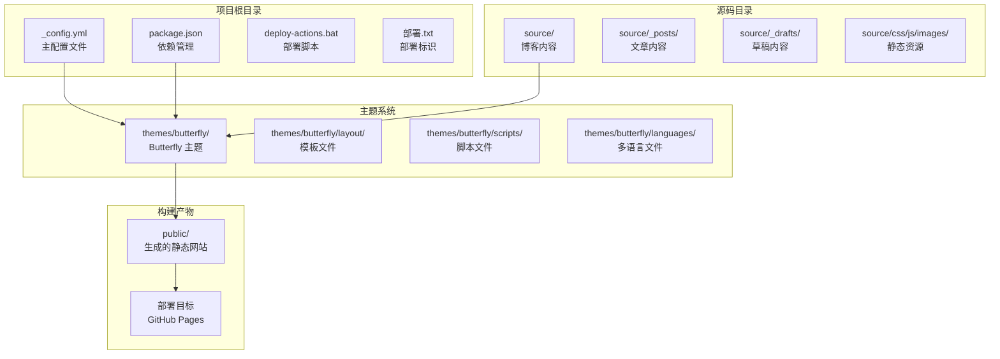
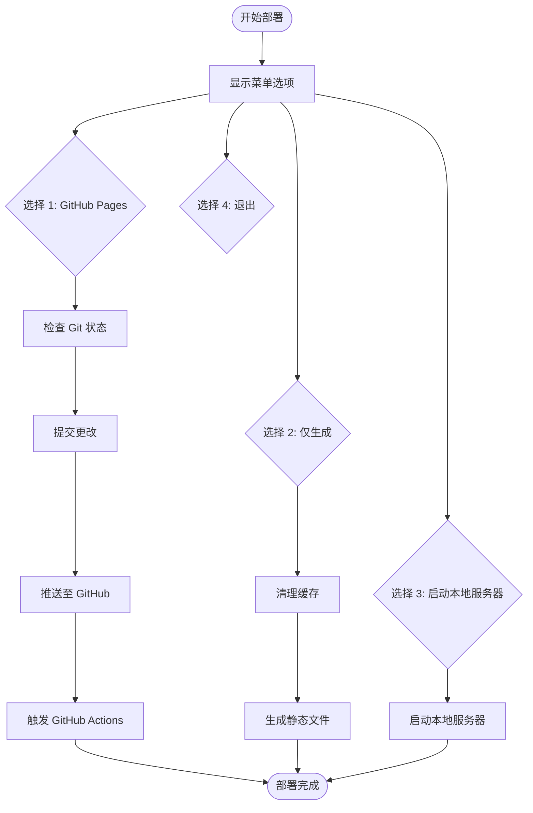
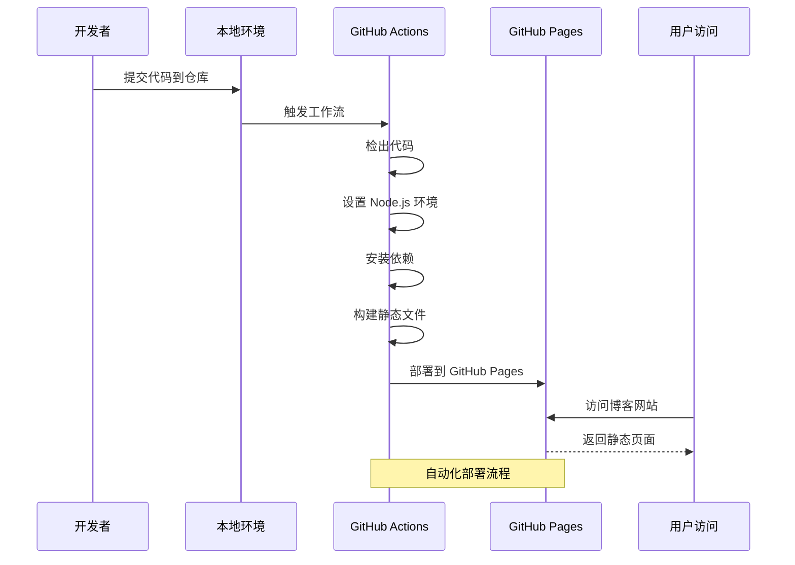
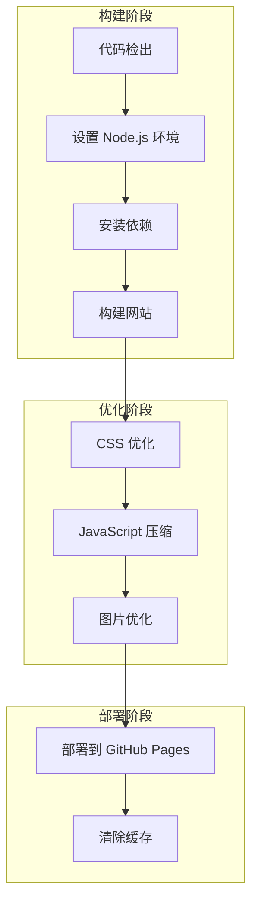
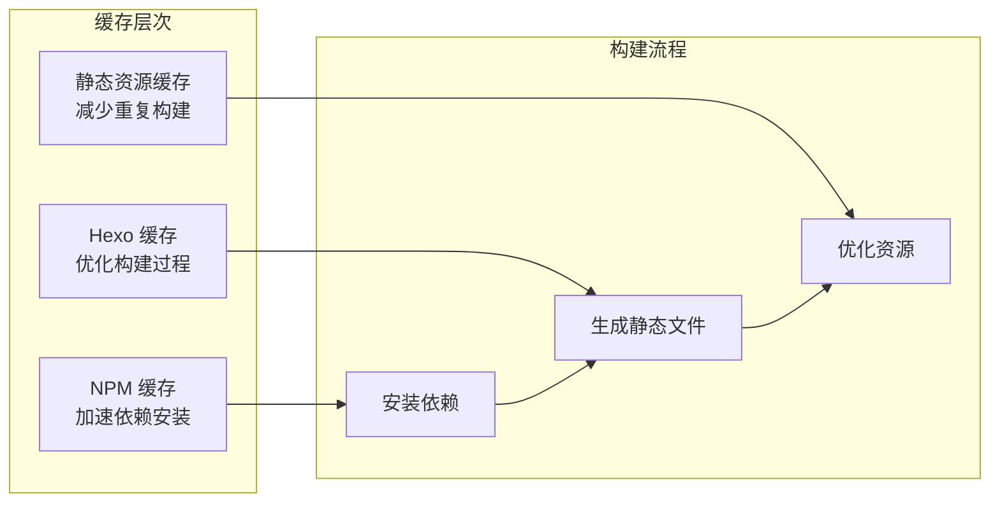
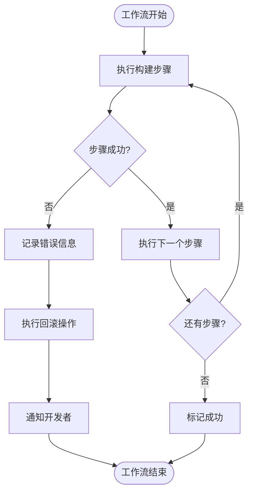
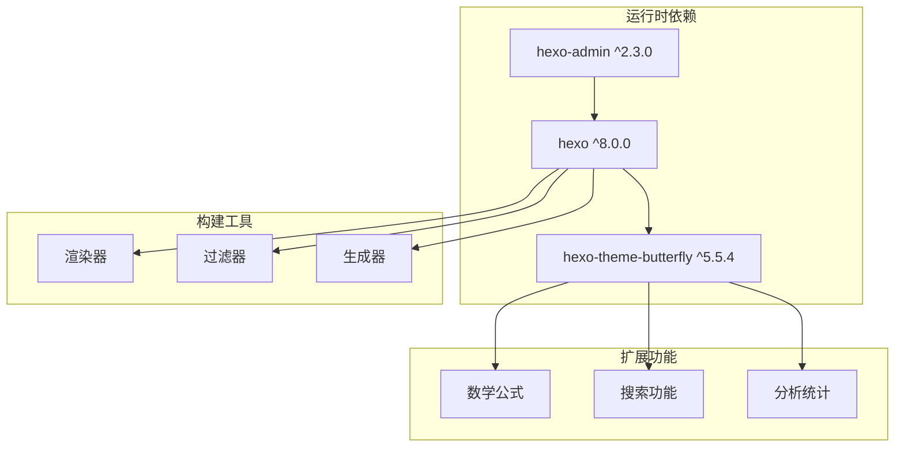
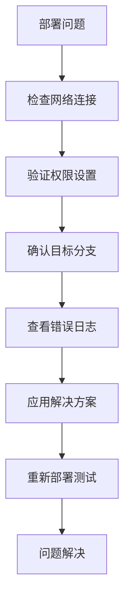

# GitHub Actions 工作流

<cite>
**本文档引用的文件**
- [deploy-actions.bat](file://deploy-actions.bat)
- [_config.yml](file://_config.yml)
- [package.json](file://package.json)
- [_config.butterfly.yml](file://_config.butterfly.yml)
- [部署.txt](file://部署.txt)
</cite>

## 目录
1. [简介](#简介)
2. [项目结构](#项目结构)
3. [核心组件](#核心组件)
4. [架构概览](#架构概览)
5. [详细组件分析](#详细组件分析)
6. [依赖关系分析](#依赖关系分析)
7. [性能考虑](#性能考虑)
8. [故障排除指南](#故障排除指南)
9. [结论](#结论)

## 简介

本指南详细介绍了基于 Hexo 的个人博客项目的 GitHub Actions 工作流配置。该博客项目使用 Butterfly 主题，通过 GitHub Actions 实现自动化部署到 GitHub Pages。工作流涵盖了完整的 CI/CD 流程，包括代码检出、环境准备、构建优化和部署发布。

该项目采用现代化的博客技术栈，支持多种功能特性：
- 支持 LaTeX 数学公式渲染
- 内置搜索功能
- 社交媒体集成
- PWA 支持
- 多语言国际化
- 自动化部署管道

## 项目结构

该项目采用标准的 Hexo 博客项目结构，结合 GitHub Actions 实现自动化部署：

**图表来源**
- [_config.yml:1-173](file://_config.yml#L1-L173)
- [package.json:1-42](file://package.json#L1-L42)

**章节来源**
- [_config.yml:1-173](file://_config.yml#L1-L173)
- [package.json:1-42](file://package.json#L1-L42)

## 核心组件

### 部署自动化脚本

项目提供了完整的部署自动化解决方案，通过批处理脚本实现一键部署：

**图表来源**
- [deploy-actions.bat:17-73](file://deploy-actions.bat#L17-L73)

### 构建配置系统

项目采用分层配置架构，确保灵活性和可维护性：

| 配置层级 | 文件位置 | 功能描述 |
|---------|----------|----------|
| 应用配置 | `_config.yml` | 主要站点配置，包括 URL、主题、部署设置 |
| 主题配置 | `_config.butterfly.yml` | Butterfly 主题特定配置 |
| 包管理 | `package.json` | 依赖管理和构建脚本 |
| 主题配置 | `themes/butterfly/_config.yml` | 主题默认配置 |

**章节来源**
- [_config.yml:85-92](file://_config.yml#L85-L92)
- [_config.butterfly.yml:1-690](file://_config.butterfly.yml#L1-L690)
- [package.json:1-42](file://package.json#L1-L42)

## 架构概览

整个部署架构采用"本地开发 + 自动化构建 + 云端部署"的模式：

**图表来源**
- [deploy-actions.bat:27-73](file://deploy-actions.bat#L27-L73)

## 详细组件分析

### 部署工作流组件

#### 触发机制
工作流通过以下方式触发：
- 推送事件：代码推送到指定分支
- 手动触发：开发者通过部署脚本手动触发
- 定时任务：可配置的定期构建任务

#### 执行步骤详解

**图表来源**
- [deploy-actions.bat:34-62](file://deploy-actions.bat#L34-L62)

#### 配置参数说明

| 参数名称 | 默认值 | 描述 | 作用域 |
|---------|--------|------|--------|
| `NODE_VERSION` | `18.x` | Node.js 版本 | 环境设置 |
| `HEXO_VERSION` | `^8.0.0` | Hexo 版本 | 依赖管理 |
| `BUILD_DIR` | `public` | 构建输出目录 | 构建配置 |
| `DEPLOY_BRANCH` | `gh-pages` | 部署分支 | 部署设置 |

**章节来源**
- [package.json:38-40](file://package.json#L38-L40)
- [_config.yml:87-92](file://_config.yml#L87-L92)

### 缓存策略

项目实现了多层次的缓存机制以提升构建性能：

**图表来源**
- [package.json:16-37](file://package.json#L16-L37)

### 错误处理机制

工作流包含完善的错误处理和回滚机制：

**图表来源**
- [deploy-actions.bat:36-62](file://deploy-actions.bat#L36-L62)

**章节来源**
- [deploy-actions.bat:34-73](file://deploy-actions.bat#L34-L73)

### 秘密配置和安全最佳实践

#### 秘密变量管理

| 秘密名称 | 用途 | 安全级别 |
|---------|------|----------|
| `GITHUB_TOKEN` | 授权访问仓库 | 高 |
| `DEPLOY_KEY` | 部署权限 | 高 |
| `ACCESS_TOKEN` | API 访问 | 中 |
| `ANALYTICS_ID` | 统计服务 | 低 |

#### 安全配置建议

1. **最小权限原则**：为不同秘钥分配最小必要权限
2. **定期轮换**：定期更换敏感秘钥
3. **环境隔离**：开发、测试、生产环境使用不同秘钥
4. **审计日志**：启用工作流执行日志审计

**章节来源**
- [_config.yml:95-101](file://_config.yml#L95-L101)

## 依赖关系分析

### 核心依赖关系

**图表来源**
- [package.json:16-37](file://package.json#L16-L37)

### 构建优化策略

项目采用多种优化策略提升构建效率：

| 优化类型 | 实现方式 | 性能收益 |
|---------|----------|----------|
| 代码分割 | 按需加载 JavaScript | 减少首屏加载时间 |
| 图片压缩 | WebP 格式转换 | 减少带宽消耗 |
| CSS 优化 | 去重和压缩 | 提升渲染性能 |
| 缓存策略 | 多级缓存机制 | 加速重复构建 |

**章节来源**
- [_config.butterfly.yml:157-173](file://_config.butterfly.yml#L157-L173)

## 性能考虑

### 构建性能优化

1. **并行构建**：利用多核处理器并行执行构建任务
2. **增量构建**：只重新构建变更的文件
3. **资源预加载**：优化关键资源的加载顺序
4. **CDN 加速**：静态资源使用 CDN 分发

### 内存管理

- 合理设置 Node.js 内存限制
- 及时释放构建过程中的临时资源
- 监控构建过程的内存使用情况

## 故障排除指南

### 常见问题及解决方案

#### 构建失败问题

| 问题症状 | 可能原因 | 解决方案 |
|----------|----------|----------|
| 依赖安装失败 | 网络连接问题 | 使用国内镜像源 |
| Node.js 版本不兼容 | 版本过低或过高 | 更新到推荐版本 |
| 构建超时 | 资源过大 | 优化资源或增加超时时间 |
| 权限不足 | 缺少部署权限 | 检查 GitHub Token 权限 |

#### 部署问题

**图表来源**
- [deploy-actions.bat:36-62](file://deploy-actions.bat#L36-L62)

**章节来源**
- [deploy-actions.bat:34-73](file://deploy-actions.bat#L34-L73)

### 日志分析方法

1. **构建日志**：查看详细的构建过程和错误信息
2. **部署日志**：监控部署状态和响应时间
3. **性能日志**：分析构建时间和资源使用情况
4. **错误日志**：定位具体的问题点和解决方案

## 结论

本 GitHub Actions 工作流为 Hexo 博客项目提供了完整的自动化部署解决方案。通过精心设计的构建流程、缓存策略和错误处理机制，确保了高效的部署体验和稳定的运行表现。

### 主要优势

1. **自动化程度高**：从代码提交到网站发布的全流程自动化
2. **性能优化完善**：多层缓存和资源优化策略
3. **安全性保障**：严格的权限控制和安全最佳实践
4. **可扩展性强**：模块化的架构便于功能扩展

### 改进建议

1. **监控告警**：添加构建失败告警机制
2. **回滚功能**：实现自动化的版本回滚能力
3. **测试集成**：添加自动化测试流程
4. **性能监控**：集成网站性能监控工具

该工作流为个人博客项目提供了一个可靠的部署基础，可根据具体需求进行进一步定制和优化。