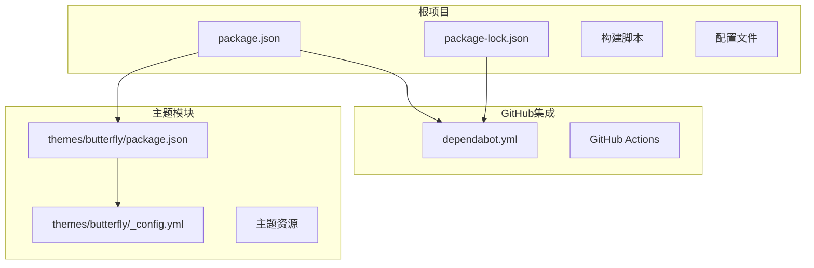
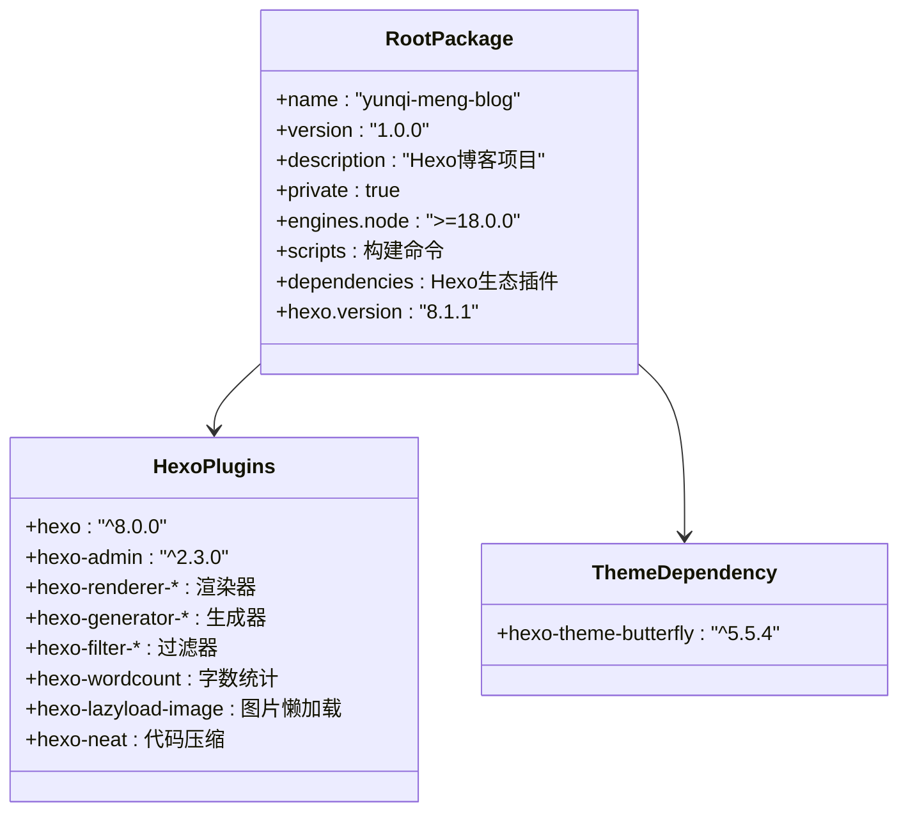
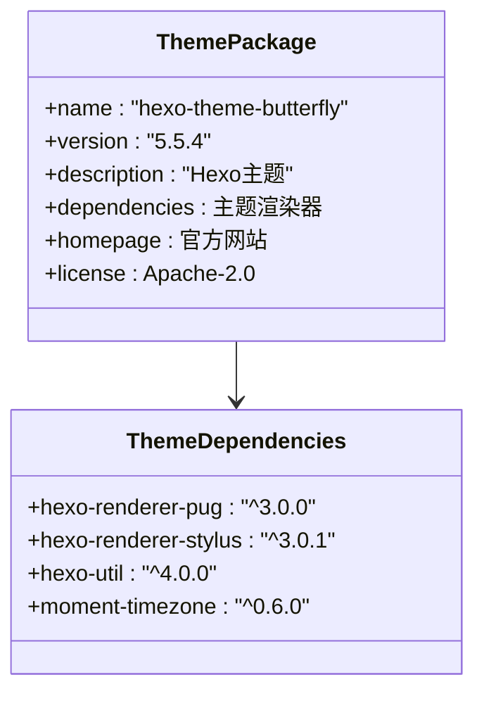
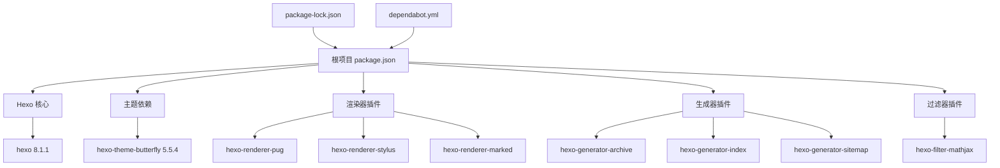
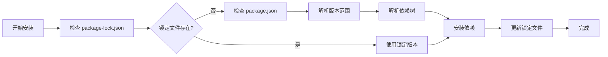
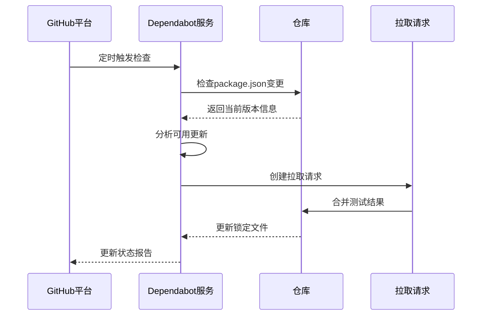
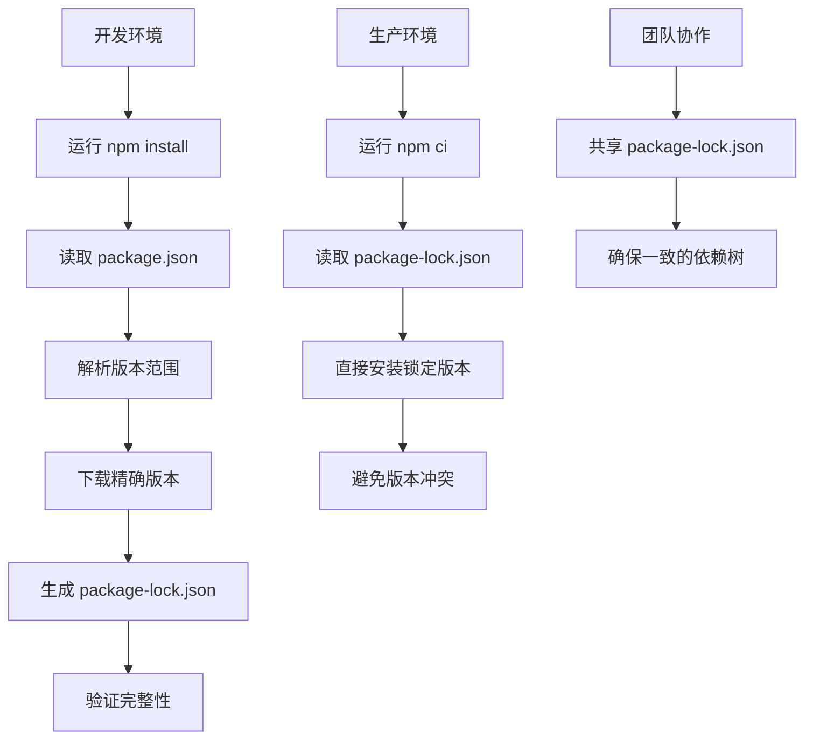
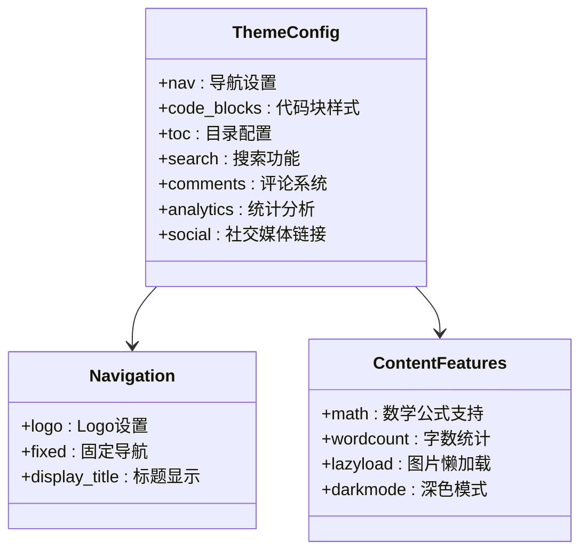
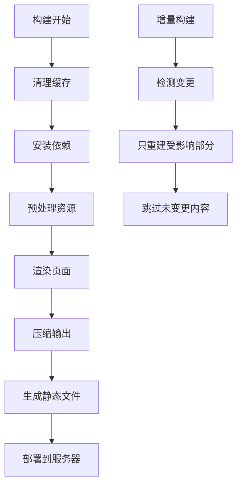
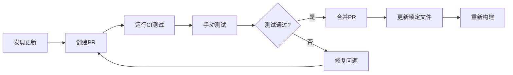

# 依赖管理与更新

<cite>
**本文档引用的文件**
- [package.json](file://package.json)
- [themes/butterfly/package.json](file://themes/butterfly/package.json)
- [package-lock.json](file://package-lock.json)
- [.github/dependabot.yml](file://.github/dependabot.yml)
- [themes/butterfly/_config.yml](file://themes/butterfly/_config.yml)
</cite>

## 目录
1. [简介](#简介)
2. [项目结构](#项目结构)
3. [核心组件](#核心组件)
4. [架构概览](#架构概览)
5. [详细组件分析](#详细组件分析)
6. [依赖关系分析](#依赖关系分析)
7. [性能考虑](#性能考虑)
8. [故障排除指南](#故障排除指南)
9. [结论](#结论)

## 简介

本指南专注于Hexo博客项目的依赖管理和自动更新策略。该项目使用Hexo 8.1.1作为静态站点生成器，配合Butterfly主题构建个人博客。文档详细解释了package.json中的依赖配置、版本管理策略、Dependabot自动更新机制、安全扫描流程、锁定文件的作用以及依赖冲突解决方法。

## 项目结构

该项目采用典型的Hexo主题架构，包含根项目和主题子模块：



**图表来源**
- [package.json:1-42](file://package.json#L1-L42)
- [.github/dependabot.yml:1-8](file://.github/dependabot.yml#L1-L8)
- [themes/butterfly/package.json:1-35](file://themes/butterfly/package.json#L1-L35)

**章节来源**
- [package.json:1-42](file://package.json#L1-L42)
- [themes/butterfly/package.json:1-35](file://themes/butterfly/package.json#L1-L35)

## 核心组件

### 根项目依赖配置

根项目的package.json定义了完整的依赖生态系统：



**图表来源**
- [package.json:16-37](file://package.json#L16-L37)

### 主题依赖配置

Butterfly主题作为独立模块，定义了其自身的依赖要求：



**图表来源**
- [themes/butterfly/package.json:25-30](file://themes/butterfly/package.json#L25-L30)

**章节来源**
- [package.json:16-37](file://package.json#L16-L37)
- [themes/butterfly/package.json:25-30](file://themes/butterfly/package.json#L25-L30)

## 架构概览

### 依赖层次结构



**图表来源**
- [package.json:16-37](file://package.json#L16-L37)
- [package-lock.json:10-30](file://package-lock.json#L10-L30)
- [.github/dependabot.yml:3-7](file://.github/dependabot.yml#L3-L7)

### 版本管理策略

项目采用语义化版本控制策略，通过插入符号(^)实现向后兼容的版本更新：



**图表来源**
- [package.json:16-37](file://package.json#L16-L37)
- [package-lock.json:10-30](file://package-lock.json#L10-L30)

**章节来源**
- [package.json:16-37](file://package.json#L16-L37)
- [package-lock.json:10-30](file://package-lock.json#L10-L30)

## 详细组件分析

### Dependabot自动更新配置

Dependabot配置实现了自动化依赖更新：



**图表来源**
- [.github/dependabot.yml:3-7](file://.github/dependabot.yml#L3-L7)

关键配置参数：
- `package-ecosystem: npm` - 指定使用npm包管理器
- `directory: "/"` - 在根目录检查依赖
- `schedule.interval: daily` - 每日检查更新
- `open-pull-requests-limit: 20` - 最大同时打开的PR数量

**章节来源**
- [.github/dependabot.yml:1-8](file://.github/dependabot.yml#L1-L8)

### 锁定文件管理

package-lock.json确保依赖版本的一致性和可重现性：



**图表来源**
- [package-lock.json:1-10](file://package-lock.json#L1-L10)

**章节来源**
- [package-lock.json:1-10](file://package-lock.json#L1-L10)

### 主题配置集成

Butterfly主题的配置文件提供了丰富的自定义选项：



**图表来源**
- [themes/butterfly/_config.yml:12-44](file://themes/butterfly/_config.yml#L12-L44)

**章节来源**
- [themes/butterfly/_config.yml:12-44](file://themes/butterfly/_config.yml#L12-L44)

## 依赖关系分析

### 依赖树结构

```mermaid
graph TB
subgraph "核心依赖"
Hexo[hexo@^8.0.0]
Theme[hexo-theme-butterfly@^5.5.4]
end
subgraph "渲染器"
Pug[hexo-renderer-pug@^3.0.0]
Stylus[hexo-renderer-stylus@^3.0.1]
Marked[hexo-renderer-marked@^7.0.0]
EJS[hexo-renderer-ejs@^2.0.0]
end
subgraph "生成器"
Archive[hexo-generator-archive@^2.0.0]
Category[hexo-generator-category@^2.0.0]
Feed[hexo-generator-feed@^4.0.0]
Sitemap[hexo-generator-sitemap@^3.0.1]
Tag[hexo-generator-tag@^2.0.0]
Robots[hexo-generator-robotstxt@^0.2.0]
SearchDB[hexo-generator-searchdb@^1.5.0]
Index[hexo-generator-index@^4.0.0]
end
subgraph "功能插件"
MathJax[hexo-filter-mathjax@^0.9.1]
WordCount[hexo-wordcount@^6.0.1]
LazyLoad[hexo-lazyload-image@^1.1.3]
Neat[hexo-neat@^1.0.9]
Server[hexo-server@^3.0.0]
Admin[hexo-admin@^2.3.0]
end
Hexo --> Pug
Hexo --> Stylus
Hexo --> Marked
Hexo --> EJS
Hexo --> Archive
Hexo --> Category
Hexo --> Feed
Hexo --> Sitemap
Hexo --> Tag
Hexo --> Robots
Hexo --> SearchDB
Hexo --> Index
Hexo --> MathJax
Hexo --> WordCount
Hexo --> LazyLoad
Hexo --> Neat
Hexo --> Server
Hexo --> Admin
Theme --> Pug
Theme --> Stylus
```

**图表来源**
- [package.json:16-37](file://package.json#L16-L37)
- [themes/butterfly/package.json:25-30](file://themes/butterfly/package.json#L25-L30)

### 版本兼容性矩阵

| 依赖类型 | 当前版本 | 兼容范围 | 最新版本 | 兼容性 |
|---------|---------|---------|---------|--------|
| Hexo核心 | 8.1.1 | ^8.0.0 | 8.x | ✅ 高 |
| Butterfly主题 | 5.5.4 | ^5.5.4 | 5.5.x | ✅ 高 |
| Pug渲染器 | 3.0.0 | ^3.0.0 | 3.x | ✅ 高 |
| Stylus渲染器 | 3.0.1 | ^3.0.1 | 3.x | ✅ 高 |
| Marked渲染器 | 7.0.0 | ^7.0.0 | 7.x | ✅ 高 |
| 生成器插件 | 2.0.0-4.0.1 | ^2.0.0 | 4.x | ⚠️ 中 |
| 功能插件 | 0.9.1-6.0.1 | ^0.9.1 | 6.x | ⚠️ 中 |

**章节来源**
- [package.json:16-37](file://package.json#L16-L37)

## 性能考虑

### 包大小优化策略

1. **选择性安装**：仅安装必要的插件，避免冗余功能
2. **版本锁定**：使用锁定文件确保生产环境一致性
3. **代码压缩**：利用hexo-neat进行CSS/JS压缩
4. **图片优化**：启用hexo-lazyload-image减少首屏加载时间

### 构建性能优化



**图表来源**
- [package.json:6-12](file://package.json#L6-L12)

## 故障排除指南

### 常见依赖问题

1. **版本冲突**：检查package-lock.json中重复依赖的解决方案
2. **Node.js版本不兼容**：确保Node.js版本≥18.0.0
3. **主题渲染错误**：验证hexo-renderer-pug和hexo-renderer-stylus版本匹配
4. **插件加载失败**：检查相关渲染器是否正确安装

### 依赖更新流程



**图表来源**
- [.github/dependabot.yml:3-7](file://.github/dependabot.yml#L3-L7)

**章节来源**
- [.github/dependabot.yml:1-8](file://.github/dependabot.yml#L1-L8)

## 结论

本项目建立了完善的依赖管理体系，通过以下关键措施确保依赖的稳定性和安全性：

1. **明确的版本策略**：使用语义化版本控制和锁定文件
2. **自动化更新机制**：Dependabot每日检查确保及时更新
3. **全面的功能覆盖**：从基础渲染到高级功能的完整插件生态
4. **性能优化考虑**：通过选择性安装和压缩技术优化加载性能

建议在维护过程中重点关注：
- 定期审查依赖更新的兼容性
- 监控主题和插件的活跃度和安全性
- 保持Node.js版本的及时升级
- 建立完整的备份和回滚机制