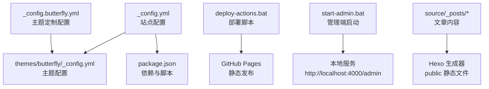
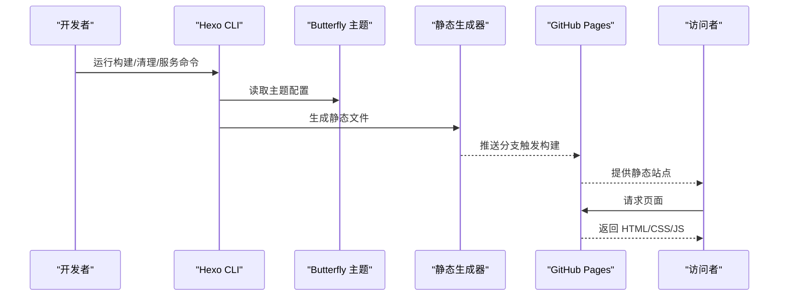
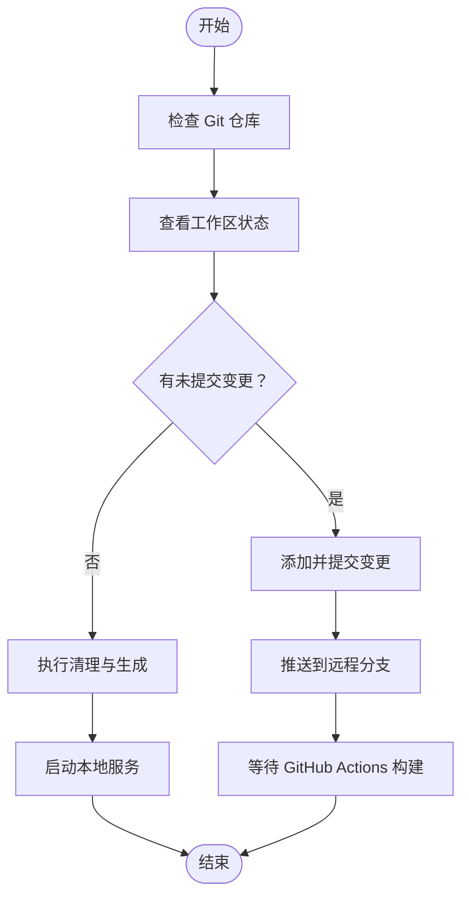
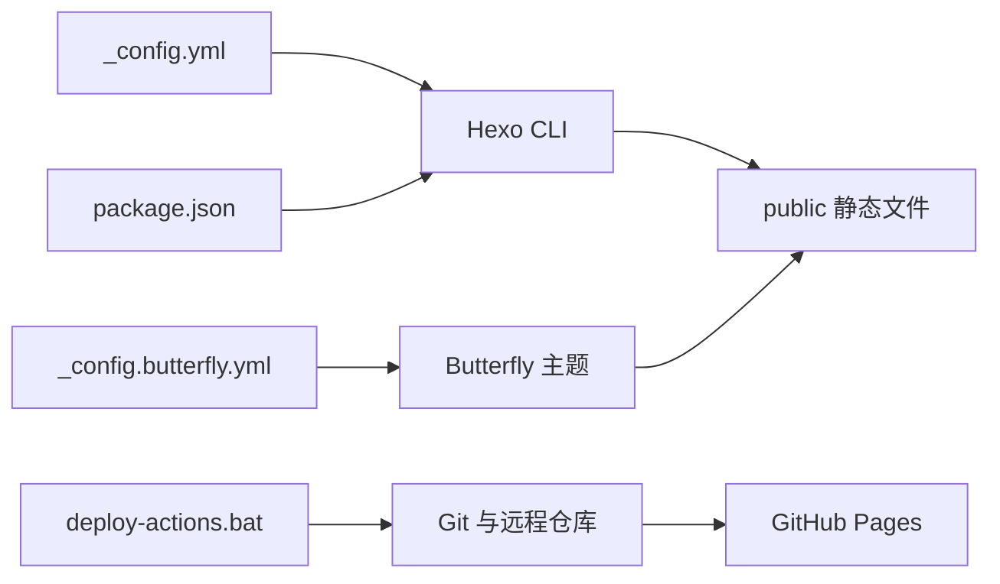

# 监控与维护

<cite>
**本文引用的文件**
- [_config.yml](file://_config.yml)
- [package.json](file://package.json)
- [deploy-actions.bat](file://deploy-actions.bat)
- [start-admin.bat](file://start-admin.bat)
- [themes/butterfly/_config.yml](file://themes/butterfly/_config.yml)
- [_config.butterfly.yml](file://_config.butterfly.yml)
- [themes/butterfly/scripts/common/default_config.js](file://themes/butterfly/scripts/common/default_config.js)
- [themes/butterfly/README.md](file://themes/butterfly/README.md)
- [source/_posts/hello-world.md](file://source/_posts/hello-world.md)
- [source/about/index.md](file://source/about/index.md)
</cite>

## 目录
1. [简介](#简介)
2. [项目结构](#项目结构)
3. [核心组件](#核心组件)
4. [架构总览](#架构总览)
5. [详细组件分析](#详细组件分析)
6. [依赖关系分析](#依赖关系分析)
7. [性能考虑](#性能考虑)
8. [故障排查指南](#故障排查指南)
9. [结论](#结论)
10. [附录](#附录)

## 简介
本指南面向 Hexo 博客（基于 Butterfly 主题）的部署、监控与维护工作，覆盖以下方面：
- 部署状态监控与工具使用
- 日志分析与错误追踪最佳实践
- 回滚机制与故障恢复策略
- 性能监控与优化建议
- 维护任务自动化（清理、生成、本地服务）
- 安全监控与异常告警设置
- 维护检查清单与预防性维护流程

本指南以仓库现有配置与脚本为依据，结合主题能力，给出可操作的运维建议。

## 项目结构
该仓库采用 Hexo 博客标准结构，核心目录与文件如下：
- 根配置：_config.yml（站点配置）、package.json（依赖与脚本）
- 主题：themes/butterfly（主题源码与配置）
- 内容：source/_posts（文章）、source/about（页面）
- 部署与运维：deploy-actions.bat（部署脚本）、start-admin.bat（管理端启动）

图表来源
- [_config.yml:1-173](file://_config.yml#L1-L173)
- [themes/butterfly/_config.yml:1-1137](file://themes/butterfly/_config.yml#L1-L1137)
- [package.json:1-42](file://package.json#L1-L42)
- [deploy-actions.bat:1-133](file://deploy-actions.bat#L1-L133)
- [start-admin.bat:1-48](file://start-admin.bat#L1-L48)
- [source/_posts/hello-world.md:1-39](file://source/_posts/hello-world.md#L1-L39)

章节来源
- [_config.yml:1-173](file://_config.yml#L1-L173)
- [package.json:1-42](file://package.json#L1-L42)
- [themes/butterfly/_config.yml:1-1137](file://themes/butterfly/_config.yml#L1-L1137)
- [_config.butterfly.yml:1-690](file://_config.butterfly.yml#L1-L690)
- [deploy-actions.bat:1-133](file://deploy-actions.bat#L1-L133)
- [start-admin.bat:1-48](file://start-admin.bat#L1-L48)
- [source/_posts/hello-world.md:1-39](file://source/_posts/hello-world.md#L1-L39)
- [source/about/index.md:1-49](file://source/about/index.md#L1-L49)

## 核心组件
- 站点配置与主题配置
  - 站点配置：控制站点标题、URL、分页、压缩、Feed、Sitemap、Robots 等
  - 主题配置：导航、封面、侧边栏、统计、搜索、评论、分析等
- 构建与脚本
  - package.json 中定义构建、清理、本地服务脚本
  - deploy-actions.bat 提供一键部署到 GitHub Pages 的交互式菜单
  - start-admin.bat 启动带管理端的本地服务
- 内容与页面
  - 文章与页面用于生成静态内容，主题配置影响展示效果

章节来源
- [_config.yml:1-173](file://_config.yml#L1-L173)
- [themes/butterfly/_config.yml:1-1137](file://themes/butterfly/_config.yml#L1-L1137)
- [_config.butterfly.yml:1-690](file://_config.butterfly.yml#L1-L690)
- [package.json:1-42](file://package.json#L1-L42)
- [deploy-actions.bat:1-133](file://deploy-actions.bat#L1-L133)
- [start-admin.bat:1-48](file://start-admin.bat#L1-L48)

## 架构总览
下图展示了从内容到发布的关键路径与监控点位。

图表来源
- [package.json:6-12](file://package.json#L6-L12)
- [themes/butterfly/_config.yml:1-1137](file://themes/butterfly/_config.yml#L1-L1137)
- [deploy-actions.bat:28-101](file://deploy-actions.bat#L28-L101)

## 详细组件分析

### 部署与发布流水线
- 交互式部署脚本
  - 功能：检查 Git 状态、自动提交与推送、提示构建进度
  - 关键点：在推送前确保工作区干净；推送后提示 Actions 构建链接
- 本地管理端服务
  - 功能：先清理缓存与生成，再启动本地服务，自动打开管理端
  - 关键点：便于本地预览与管理端调试

图表来源
- [deploy-actions.bat:28-101](file://deploy-actions.bat#L28-L101)
- [start-admin.bat:12-45](file://start-admin.bat#L12-L45)

章节来源
- [deploy-actions.bat:1-133](file://deploy-actions.bat#L1-L133)
- [start-admin.bat:1-48](file://start-admin.bat#L1-L48)

### 主题配置与监控点
- 统计与分析
  - 主题支持多种统计与分析插件（如百度、Google、Cloudflare、Microsoft Clarity、Umami），可作为访问量与用户行为的基础数据来源
- 侧边栏与站点信息
  - 侧边栏卡片包含文章数、最后推送时间等，可用于快速核对站点状态
- 搜索与评论
  - 搜索与评论系统可作为用户反馈入口，需关注可用性与加载性能

章节来源
- [themes/butterfly/_config.yml:684-720](file://themes/butterfly/_config.yml#L684-L720)
- [_config.butterfly.yml:217-223](file://_config.butterfly.yml#L217-L223)
- [_config.butterfly.yml:276-280](file://_config.butterfly.yml#L276-L280)
- [_config.butterfly.yml:299-342](file://_config.butterfly.yml#L299-L342)

### 内容与页面
- 文章与页面
  - 文章用于生成静态内容，页面用于固定内容（如关于）
  - 可通过主题配置控制摘要长度、封面、标签等展示细节

章节来源
- [source/_posts/hello-world.md:1-39](file://source/_posts/hello-world.md#L1-L39)
- [source/about/index.md:1-49](file://source/about/index.md#L1-L49)

## 依赖关系分析
- 站点配置依赖主题配置
  - 站点配置决定整体行为（如 URL、分页、压缩），主题配置决定外观与功能（如统计、搜索、评论）
- 构建脚本依赖 Hexo CLI
  - 通过 npm scripts 调用 hexo generate、hexo server 等命令
- 部署脚本依赖 Git 与远程仓库
  - 通过 git 命令进行状态检查、提交与推送

图表来源
- [_config.yml:84-86](file://_config.yml#L84-L86)
- [_config.butterfly.yml:1-690](file://_config.butterfly.yml#L1-L690)
- [package.json:6-12](file://package.json#L6-L12)
- [deploy-actions.bat:37-90](file://deploy-actions.bat#L37-L90)

章节来源
- [_config.yml:84-86](file://_config.yml#L84-L86)
- [_config.butterfly.yml:1-690](file://_config.butterfly.yml#L1-L690)
- [package.json:6-12](file://package.json#L6-L12)
- [deploy-actions.bat:37-90](file://deploy-actions.bat#L37-L90)

## 性能考虑
- 静态资源优化
  - 启用 HTML/CSS/JS 压缩（neat_* 配置），减少传输体积
- 图片与媒体
  - 启用懒加载（lazyload），降低首屏压力
- 主题特效
  - 背景特效、动画等会增加客户端开销，按需启用
- 生成性能
  - 在本地先清理再生成，避免缓存干扰；必要时使用调试模式定位问题

章节来源
- [_config.yml:157-173](file://_config.yml#L157-L173)
- [_config.butterfly.yml:646-652](file://_config.butterfly.yml#L646-L652)
- [themes/butterfly/_config.yml:794-800](file://themes/butterfly/_config.yml#L794-L800)

## 故障排查指南
- 部署失败
  - 检查 Git 工作区是否干净；确认推送权限与网络连通
  - 查看 Actions 构建日志（脚本会提示 Actions 页面）
- 本地服务异常
  - 使用 start-admin.bat 启动，先清理缓存再生成，确保端口未被占用
- 主题配置问题
  - 对比默认配置与实际配置，逐步关闭可疑开关（如特效、分析、懒加载）
- 内容生成异常
  - 检查文章 Front Matter 与路径；确认渲染器与主题版本兼容

章节来源
- [deploy-actions.bat:37-101](file://deploy-actions.bat#L37-L101)
- [start-admin.bat:12-45](file://start-admin.bat#L12-L45)
- [themes/butterfly/scripts/common/default_config.js:1-602](file://themes/butterfly/scripts/common/default_config.js#L1-L602)

## 结论
本指南基于仓库现有配置与脚本，给出了部署、监控与维护的实操建议。建议在生产环境中：
- 明确部署流程与回滚策略（基于 Git 分支与提交）
- 建立访问统计与异常告警（结合主题分析能力）
- 制定定期清理与生成的自动化流程
- 保持主题与依赖版本更新，关注性能与安全

## 附录

### 部署状态监控清单
- Git 状态检查：工作区是否干净
- 提交与推送：是否成功
- Actions 构建：是否触发并完成
- 静态文件生成：是否成功
- 本地验证：管理端与首页可访问

章节来源
- [deploy-actions.bat:37-101](file://deploy-actions.bat#L37-L101)
- [start-admin.bat:32-45](file://start-admin.bat#L32-L45)

### 回滚机制与故障恢复
- 基于 Git 的回滚
  - 通过历史提交快速回退到稳定版本
- 配置回滚
  - 将主题配置恢复到上一稳定版本
- 本地回滚
  - 清理缓存与重新生成，确保本地一致

章节来源
- [deploy-actions.bat:37-101](file://deploy-actions.bat#L37-L101)
- [_config.butterfly.yml:1-690](file://_config.butterfly.yml#L1-L690)

### 性能监控与优化建议
- 监控指标
  - 首屏加载时间、资源体积、图片懒加载命中率
- 优化手段
  - 启用压缩、合理使用特效、优化图片与媒体资源

章节来源
- [_config.yml:157-173](file://_config.yml#L157-L173)
- [_config.butterfly.yml:646-652](file://_config.butterfly.yml#L646-L652)
- [themes/butterfly/_config.yml:794-800](file://themes/butterfly/_config.yml#L794-L800)

### 维护任务自动化配置
- 清理与生成
  - 使用 npm scripts 或批处理脚本统一入口
- 本地服务
  - 通过 start-admin.bat 启动管理端与服务
- 部署
  - 通过 deploy-actions.bat 一键部署

章节来源
- [package.json:6-12](file://package.json#L6-L12)
- [start-admin.bat:1-48](file://start-admin.bat#L1-L48)
- [deploy-actions.bat:1-133](file://deploy-actions.bat#L1-L133)

### 安全监控与异常告警
- 分析与统计
  - 配置访问统计与分析插件，关注异常流量与错误页面
- 权限与密钥
  - 管理端密码与密钥妥善保管，避免泄露
- 日志与审计
  - 关注 Actions 构建日志与本地服务输出

章节来源
- [_config.yml:94-101](file://_config.yml#L94-L101)
- [themes/butterfly/_config.yml:684-720](file://themes/butterfly/_config.yml#L684-L720)
- [themes/butterfly/README.md:107-112](file://themes/butterfly/README.md#L107-L112)

### 维护检查清单与预防性维护流程
- 每次发布前
  - 检查 Git 状态、提交信息、推送结果
- 发布后
  - 核对首页、管理端、关键页面
- 定期维护
  - 清理缓存、更新依赖、评估主题与插件版本

章节来源
- [deploy-actions.bat:37-101](file://deploy-actions.bat#L37-L101)
- [start-admin.bat:12-45](file://start-admin.bat#L12-L45)
- [themes/butterfly/README.md:107-112](file://themes/butterfly/README.md#L107-L112)