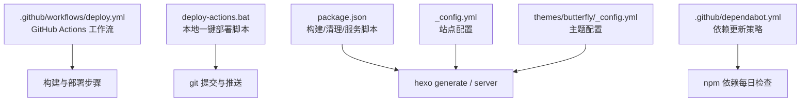
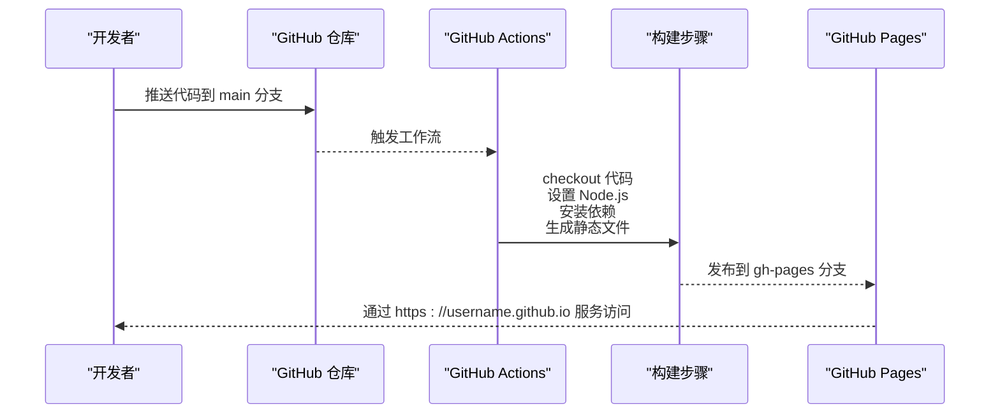
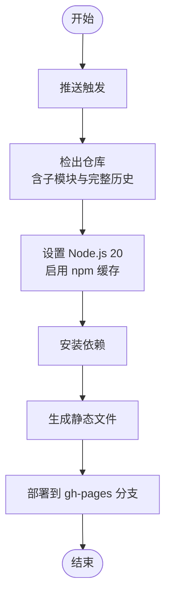
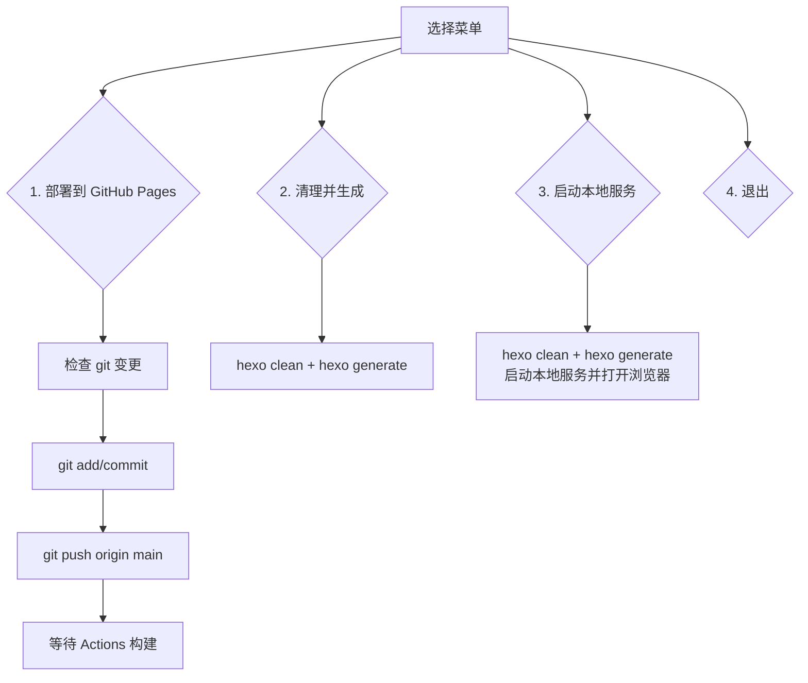
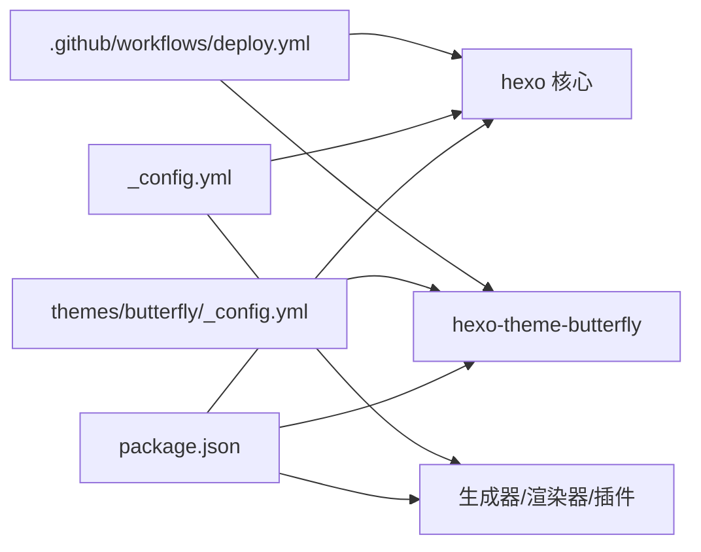

# 部署与自动化

<cite>
**本文引用的文件**
- [deploy.yml](file://.github/workflows/deploy.yml)
- [dependabot.yml](file://.github/dependabot.yml)
- [deploy-actions.bat](file://deploy-actions.bat)
- [start-admin.bat](file://start-admin.bat)
- [package.json](file://package.json)
- [_config.yml](file://_config.yml)
- [themes/butterfly/_config.yml](file://themes/butterfly/_config.yml)
- [themes/butterfly/package.json](file://themes/butterfly/package.json)
- [README.md](file://README.md)
- [部署.txt](file://部署.txt)
</cite>

## 目录
1. [简介](#简介)
2. [项目结构](#项目结构)
3. [核心组件](#核心组件)
4. [架构总览](#架构总览)
5. [详细组件分析](#详细组件分析)
6. [依赖关系分析](#依赖关系分析)
7. [性能考虑](#性能考虑)
8. [故障排查指南](#故障排查指南)
9. [结论](#结论)
10. [附录](#附录)

## 简介
本指南面向希望理解并优化该 Hexo 博客项目的部署与自动化流程的读者。内容涵盖：
- GitHub Actions 自动化部署的工作原理与配置
- CI/CD 流程设计与实现（构建、测试、部署）
- 部署脚本的使用方法与可选参数
- 版本管理与发布最佳实践
- 多环境部署策略与配置
- 部署监控、回滚机制与故障恢复
- 依赖管理与安全更新自动化
- 常见部署问题的诊断与解决

## 项目结构
该项目为基于 Hexo 的静态博客，采用 Butterfly 主题，并通过 GitHub Actions 将生成的静态站点发布到 GitHub Pages。关键文件与职责如下：
- GitHub Actions 工作流：负责在推送至 main 分支时自动构建并部署到 gh-pages 分支
- 本地部署脚本：提供一键部署到 GitHub Pages 的交互式批处理工具
- 依赖与脚本：通过 package.json 统一管理构建、清理、本地服务命令
- 配置文件：_config.yml 控制站点基础配置；themes/butterfly/_config.yml 控制主题行为
- 依赖更新：dependabot.yml 配置 npm 依赖每日自动检查与拉取请求限制

图表来源
- [.github/workflows/deploy.yml:1-40](file://.github/workflows/deploy.yml#L1-L40)
- [deploy-actions.bat:1-105](file://deploy-actions.bat#L1-L105)
- [package.json:6-12](file://package.json#L6-L12)
- [_config.yml:1-173](file://_config.yml#L1-L173)
- [themes/butterfly/_config.yml:1-800](file://themes/butterfly/_config.yml#L1-L800)
- [.github/dependabot.yml:1-8](file://.github/dependabot.yml#L1-L8)

章节来源
- [.github/workflows/deploy.yml:1-40](file://.github/workflows/deploy.yml#L1-L40)
- [deploy-actions.bat:1-105](file://deploy-actions.bat#L1-L105)
- [package.json:1-42](file://package.json#L1-L42)
- [_config.yml:1-173](file://_config.yml#L1-L173)
- [themes/butterfly/_config.yml:1-800](file://themes/butterfly/_config.yml#L1-L800)
- [.github/dependabot.yml:1-8](file://.github/dependabot.yml#L1-L8)

## 核心组件
- GitHub Actions 工作流：监听 main 分支推送，执行 checkout、Node.js 设置、依赖安装、静态文件生成、部署到 GitHub Pages
- 本地部署脚本：提供菜单式交互，支持一键部署、仅生成、启动本地服务
- 依赖与脚本：统一的 npm 脚本入口，便于在本地与 CI 环境复用
- 配置体系：站点级与主题级配置分离，便于维护与定制
- 依赖更新：通过 Dependabot 对 npm 依赖进行每日扫描与 PR 合并上限控制

章节来源
- [.github/workflows/deploy.yml:1-40](file://.github/workflows/deploy.yml#L1-L40)
- [deploy-actions.bat:1-105](file://deploy-actions.bat#L1-L105)
- [package.json:6-12](file://package.json#L6-L12)
- [_config.yml:1-173](file://_config.yml#L1-L173)
- [themes/butterfly/_config.yml:1-800](file://themes/butterfly/_config.yml#L1-L800)
- [.github/dependabot.yml:1-8](file://.github/dependabot.yml#L1-L8)

## 架构总览
下图展示了从代码提交到静态站点上线的端到端流程，包括本地与 CI 两种部署路径。

图表来源
- [.github/workflows/deploy.yml:3-40](file://.github/workflows/deploy.yml#L3-L40)

章节来源
- [.github/workflows/deploy.yml:1-40](file://.github/workflows/deploy.yml#L1-L40)

## 详细组件分析

### GitHub Actions 自动化部署
- 触发条件：推送至 main 分支
- 运行环境：ubuntu-latest
- 步骤概览：
  - 代码检出（含子模块与完整历史）
  - Node.js 环境设置（版本 20，npm 缓存）
  - 依赖安装（npm ci）
  - 静态文件生成（npm run build）
  - 部署到 GitHub Pages（gh-pages 分支），使用 GitHub Actions bot 用户信息与默认提交消息

图表来源
- [.github/workflows/deploy.yml:12-39](file://.github/workflows/deploy.yml#L12-L39)

章节来源
- [.github/workflows/deploy.yml:1-40](file://.github/workflows/deploy.yml#L1-L40)

### 本地部署脚本（deploy-actions.bat）
- 功能：
  - 一键部署到 GitHub Pages：检查变更、提交、推送
  - 仅生成：清理并生成静态文件
  - 启动本地服务：清理、生成后启动本地服务器并打开浏览器
- 交互式菜单：支持 1-4 选择，错误处理与提示信息完善

图表来源
- [deploy-actions.bat:17-100](file://deploy-actions.bat#L17-L100)

章节来源
- [deploy-actions.bat:1-105](file://deploy-actions.bat#L1-L105)

### 本地管理脚本（start-admin.bat）
- 用途：启动带后台管理界面的本地服务（hexo server），并自动打开管理页面
- 流程：清理缓存 -> 生成静态文件 -> 启动服务 -> 打开管理页面

章节来源
- [start-admin.bat:1-48](file://start-admin.bat#L1-L48)

### 依赖与脚本（package.json）
- 脚本入口：
  - build：hexo generate
  - clean：hexo clean
  - server：hexo server
  - dev：hexo server --debug
  - admin：hexo server --open
- 依赖：Hexo 核心、Butterfly 主题、多种生成器与渲染器、Admin 插件等
- Node 引擎要求：>=18.0.0

章节来源
- [package.json:6-12](file://package.json#L6-L12)
- [package.json:16-41](file://package.json#L16-L41)

### 站点配置（_config.yml）
- 站点基础：标题、副标题、描述、关键词、作者、语言与时区
- URL 与链接：站点地址、永久链接格式、美化 URL
- 目录结构：source_dir、public_dir、归档/分类/标签目录
- 写作与渲染：新文章命名、默认布局、语法高亮、PrismJS、Markdown 渲染
- 分页与元数据：首页分页、更新策略、Meta 生成
- 主题与扩展：主题名称、Admin 管理、Sitemap、Robots、Feed、Lazyload、Neat 压缩
- 部署：当前禁用 hexo deploy（改由 Actions）

章节来源
- [_config.yml:1-173](file://_config.yml#L1-L173)

### 主题配置（themes/butterfly/_config.yml）
- 导航与菜单：Logo、固定导航、菜单项
- 代码块：主题、Mac 风格、收缩/展开、全屏
- 社交媒体链接、头像、背景、封面、错误页
- 文章元信息：首页与文章页日期类型、分类/标签显示
- 侧边栏：作者卡片、最近文章、分类、标签、归档、网站信息
- 底部设置、右侧按钮、深色/浅色模式、阅读模式
- 数学公式、搜索、分享、评论系统、聊天服务、分析统计、广告验证、美化效果等

章节来源
- [themes/butterfly/_config.yml:1-800](file://themes/butterfly/_config.yml#L1-L800)

### 依赖更新（dependabot.yml）
- 包生态：npm
- 目录：根目录
- 调度：每日
- 并发限制：最多 20 个 PR

章节来源
- [.github/dependabot.yml:1-8](file://.github/dependabot.yml#L1-L8)

## 依赖关系分析
- 项目依赖与主题依赖：
  - 项目依赖：Hexo、Butterfly 主题、Feed、Sitemap、搜索、压缩、Admin 等
  - 主题依赖：渲染器（Pug/Stylus）、工具库、时区库等
- 配置耦合：
  - 站点配置影响构建产物与部署目标（public_dir）
  - 主题配置影响前端行为与资源加载
- CI 与本地一致性：
  - Actions 使用 Node.js 20 与 npm ci，建议本地也保持一致以避免差异

图表来源
- [package.json:16-41](file://package.json#L16-L41)
- [themes/butterfly/package.json:25-30](file://themes/butterfly/package.json#L25-L30)
- [themes/butterfly/_config.yml:1-800](file://themes/butterfly/_config.yml#L1-L800)
- [_config.yml:85-92](file://_config.yml#L85-L92)
- [.github/workflows/deploy.yml:19-39](file://.github/workflows/deploy.yml#L19-L39)

章节来源
- [package.json:16-41](file://package.json#L16-L41)
- [themes/butterfly/package.json:25-30](file://themes/butterfly/package.json#L25-L30)
- [themes/butterfly/_config.yml:1-800](file://themes/butterfly/_config.yml#L1-L800)
- [_config.yml:85-92](file://_config.yml#L85-L92)
- [.github/workflows/deploy.yml:19-39](file://.github/workflows/deploy.yml#L19-L39)

## 性能考虑
- 构建缓存：Actions 中已启用 npm 缓存，减少重复安装时间
- 依赖安装：使用 npm ci 保证锁定版本一致性
- 资源压缩：Neat 压缩开启，减少体积
- 图片懒加载：提升首屏加载性能
- 本地开发：使用 --debug 模式便于定位问题

章节来源
- [.github/workflows/deploy.yml:19-26](file://.github/workflows/deploy.yml#L19-L26)
- [_config.yml:158-173](file://_config.yml#L158-L173)
- [themes/butterfly/_config.yml:129-133](file://themes/butterfly/_config.yml#L129-L133)

## 故障排查指南
- Actions 构建失败
  - 检查 Node.js 版本与 npm 缓存是否匹配本地环境
  - 查看依赖安装日志与构建输出
  - 确认 public_dir 输出路径正确
- 本地部署脚本异常
  - 确认 git 状态无未提交更改
  - 检查网络与远程仓库权限
  - 使用 start-admin.bat 启动管理服务进行本地验证
- 主题配置问题
  - 检查主题配置文件中的路径与资源是否存在
  - 确认主题依赖已正确安装
- 依赖更新冲突
  - 关注 Dependabot PR，合并前先在本地验证

章节来源
- [.github/workflows/deploy.yml:19-39](file://.github/workflows/deploy.yml#L19-L39)
- [deploy-actions.bat:34-72](file://deploy-actions.bat#L34-L72)
- [start-admin.bat:12-45](file://start-admin.bat#L12-L45)
- [.github/dependabot.yml:1-8](file://.github/dependabot.yml#L1-L8)

## 结论
该 Hexo 博客项目通过 GitHub Actions 实现了稳定的自动化部署，配合本地脚本与统一的 npm 脚本，形成“本地开发—CI 构建—静态发布”的闭环。结合主题配置与依赖管理策略，可在保证一致性的同时提升开发效率与发布质量。建议持续关注 Dependabot 更新与 Actions 日志，以维持系统的安全性与稳定性。

## 附录
- 使用说明与示例命令可参考项目 README
- 部署说明提示文件存在，明确使用 Actions 进行部署

章节来源
- [README.md:62-86](file://README.md#L62-L86)
- [部署.txt:1-2](file://部署.txt#L1-L2)