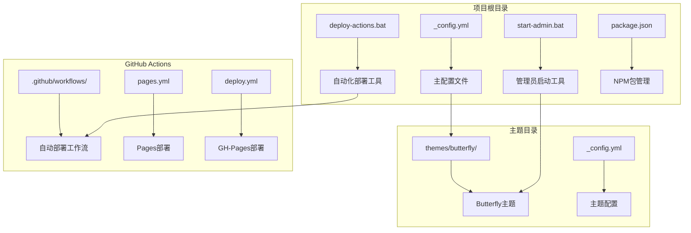
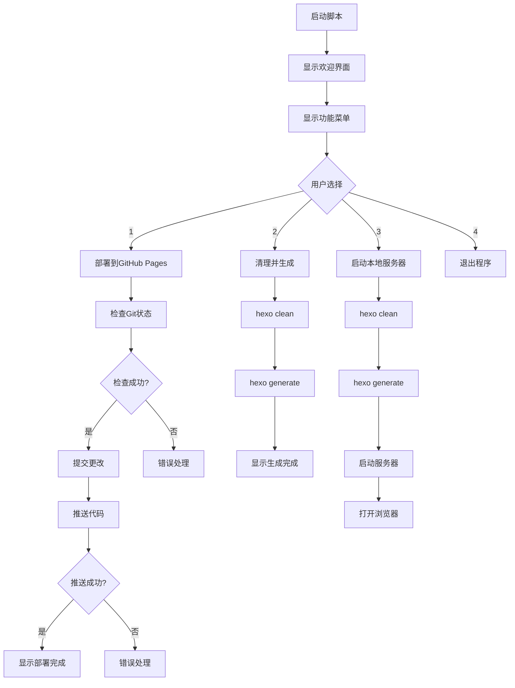
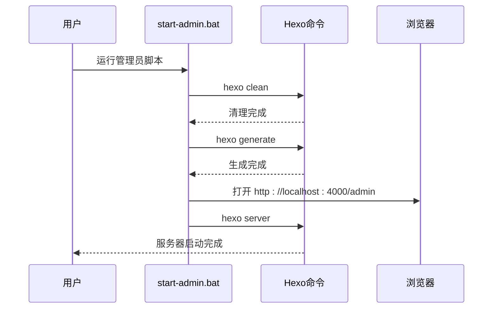
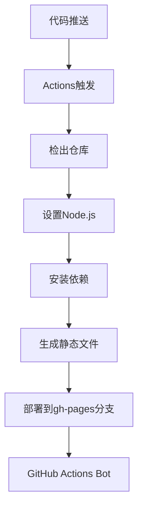
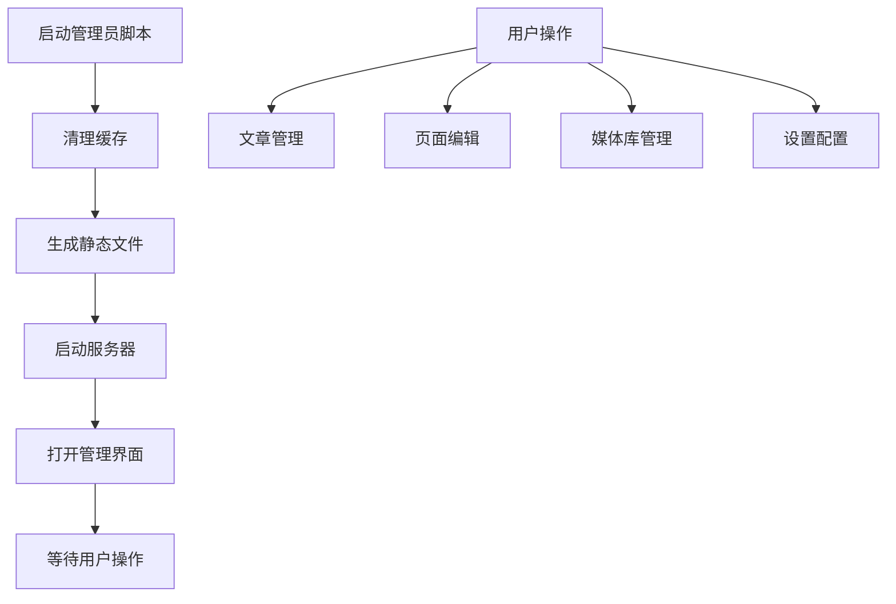
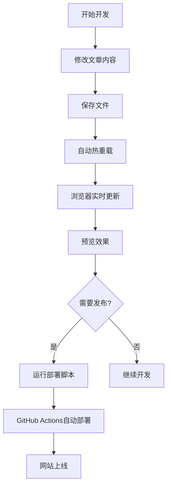
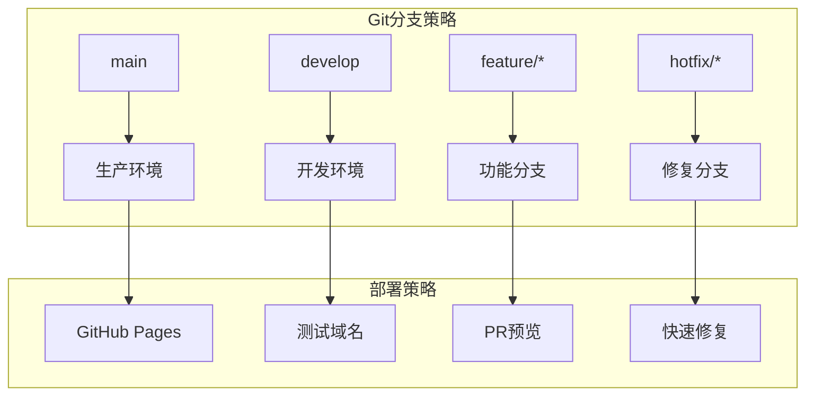

# 部署脚本使用

<cite>
**本文档引用的文件**
- [deploy-actions.bat](file://deploy-actions.bat)
- [start-admin.bat](file://start-admin.bat)
- [部署.txt](file://部署.txt)
- [package.json](file://package.json)
- [_config.yml](file://_config.yml)
- [_config.butterfly.yml](file://_config.butterfly.yml)
- [.github/workflows/pages.yml](file://.github/workflows/pages.yml)
- [.github/workflows/deploy.yml](file://.github/workflows/deploy.yml)
- [themes/butterfly/_config.yml](file://themes/butterfly/_config.yml)
</cite>

## 目录
1. [简介](#简介)
2. [项目结构概览](#项目结构概览)
3. [核心部署脚本](#核心部署脚本)
4. [自动化部署流程](#自动化部署流程)
5. [管理员启动脚本](#管理员启动脚本)
6. [配置参数详解](#配置参数详解)
7. [本地开发环境部署](#本地开发环境部署)
8. [多环境部署配置](#多环境部署配置)
9. [执行权限与环境要求](#执行权限与环境要求)
10. [故障排除指南](#故障排除指南)
11. [性能优化建议](#性能优化建议)
12. [总结](#总结)

## 简介

本项目是一个基于 Hexo 的个人博客系统，采用 Butterfly 主题构建。项目提供了完整的本地部署脚本和自动化部署解决方案，支持多种部署模式和环境配置。本文档详细介绍了部署脚本的功能、使用方法、配置参数以及故障排除技巧。

## 项目结构概览

该项目采用标准的 Hexo 博客项目结构，主要包含以下关键组件：



**图表来源**
- [deploy-actions.bat:1-105](file://deploy-actions.bat#L1-L105)
- [start-admin.bat:1-48](file://start-admin.bat#L1-L48)
- [_config.yml:1-173](file://_config.yml#L1-L173)

**章节来源**
- [deploy-actions.bat:1-105](file://deploy-actions.bat#L1-L105)
- [start-admin.bat:1-48](file://start-admin.bat#L1-L48)
- [_config.yml:1-173](file://_config.yml#L1-L173)

## 核心部署脚本

### 自动化部署脚本 (deploy-actions.bat)

`deploy-actions.bat` 是项目的主要部署工具，提供了四种核心功能：

#### 功能特性
- **GitHub Pages 部署**：通过 GitHub Actions 自动部署到 GitHub Pages
- **清理生成**：清理缓存并重新生成静态文件
- **本地服务器启动**：启动本地开发服务器进行预览
- **交互式菜单**：提供用户友好的选择界面

#### 脚本执行流程



**图表来源**
- [deploy-actions.bat:12-73](file://deploy-actions.bat#L12-L73)
- [deploy-actions.bat:75-100](file://deploy-actions.bat#L75-L100)

#### 部署流程详解

1. **Git 状态检查**：验证当前工作目录的状态
2. **自动提交**：使用日期时间作为提交信息
3. **远程推送**：推送到 GitHub 主分支
4. **构建监控**：GitHub Actions 自动构建网站

**章节来源**
- [deploy-actions.bat:27-73](file://deploy-actions.bat#L27-L73)

### 管理员启动脚本 (start-admin.bat)

`start-admin.bat` 专门用于启动带有管理员功能的本地服务器：

#### 核心功能
- **完整清理**：清除所有缓存和生成文件
- **静态文件生成**：生成完整的静态网站
- **管理员界面**：启动带管理功能的服务器
- **自动浏览器打开**：一键打开管理界面

#### 执行序列



**图表来源**
- [start-admin.bat:12-45](file://start-admin.bat#L12-L45)

**章节来源**
- [start-admin.bat:1-48](file://start-admin.bat#L1-L48)

## 自动化部署流程

### GitHub Actions 工作流

项目配置了两个主要的 GitHub Actions 工作流来实现自动化部署：

#### Pages 工作流 (pages.yml)

该工作流使用 GitHub Pages 服务进行部署：


**图表来源**
- [.github/workflows/pages.yml:1-47](file://.github/workflows/pages.yml#L1-L47)

#### GH-Pages 工作流 (deploy.yml)

该工作流使用第三方 action 进行部署：



**图表来源**
- [.github/workflows/deploy.yml:1-39](file://.github/workflows/deploy.yml#L1-L39)

### 部署配置说明

根据项目配置，部署具有以下特点：

- **默认分支**：main 分支触发部署
- **Node.js 版本**：20.x（推荐）
- **构建命令**：`npm run build`
- **输出目录**：`./public`
- **部署目标**：GitHub Pages 或 gh-pages 分支

**章节来源**
- [.github/workflows/pages.yml:1-47](file://.github/workflows/pages.yml#L1-L47)
- [.github/workflows/deploy.yml:1-39](file://.github/workflows/deploy.yml#L1-L39)

## 管理员启动脚本

### 功能特性

管理员启动脚本提供了完整的博客管理系统：

#### 安全配置
- **用户名**：admin
- **密码哈希**：使用 bcrypt 加密存储
- **会话密钥**：hexoadminsecretkey123456
- **端口配置**：默认 4000 端口
- **会话过期**：60 分钟

#### 界面特性
- **管理界面**：http://localhost:4000/admin
- **自动登录**：首次访问自动登录
- **实时预览**：修改后即时生效
- **文件管理**：支持文章和页面管理

**章节来源**
- [_config.yml:95-102](file://_config.yml#L95-L102)

### 启动流程



**图表来源**
- [start-admin.bat:12-45](file://start-admin.bat#L12-L45)

## 配置参数详解

### 主配置文件 (_config.yml)

项目的核心配置文件包含了多个重要配置段落：

#### 基础站点配置
- **站点标题**：Yunqi Meng
- **副标题**：空
- **描述**：记录学习与生活的个人博客
- **关键词**：技术,编程,博客,Hexo
- **作者**：孟俊澎
- **语言**：zh-CN

#### URL 和链接配置
- **网站URL**：https://yunqi-meng.github.io
- **永久链接格式**：`:year/:month/:day/:title/`
- **美化URL**：启用尾部斜杠和HTML扩展名

#### 目录结构配置
- **源文件目录**：source
- **生成目录**：public
- **标签目录**：tags
- **归档目录**：archives
- **分类目录**：categories

#### 写作配置
- **新文章命名**：`:title.md`
- **默认布局**：post
- **语法高亮**：highlight.js
- **PrismJS**：启用行号和自动检测

#### 主题配置
- **主题名称**：butterfly
- **压缩配置**：启用 HTML、CSS、JavaScript 压缩

**章节来源**
- [_config.yml:4-173](file://_config.yml#L4-L173)

### Butterfly 主题配置 (_config.butterfly.yml)

Butterfly 主题提供了丰富的定制选项：

#### 导航和菜单
- **导航栏固定**：启用固定导航
- **菜单项**：首页、归档、标签、分类、关于
- **Logo 设置**：自定义头像和图标

#### 代码块设置
- **主题样式**：light
- **Mac 样式**：启用
- **复制按钮**：启用
- **语言标识**：启用

#### 社交媒体集成
- **GitHub 链接**：https://github.com/yunqi-meng
- **图标样式**：Font Awesome

#### 页面布局
- **首页布局**：3（交替布局）
- **文章摘要**：方法3（自动摘录）
- **摘要长度**：300 字符

#### 功能特性
- **TOC 目录**：启用文章目录
- **版权信息**：启用 CC BY-NC-SA 4.0
- **阅读模式**：启用
- **深色模式**：启用

**章节来源**
- [_config.butterfly.yml:1-690](file://_config.butterfly.yml#L1-L690)

### NPM 包配置 (package.json)

项目使用 NPM 管理依赖和脚本：

#### 脚本命令
- **build**：`hexo generate` - 构建静态网站
- **clean**：`hexo clean` - 清理缓存
- **server**：`hexo server` - 启动开发服务器
- **dev**：`hexo server --debug` - 启动调试服务器
- **admin**：`hexo server --open` - 启动管理员服务器

#### 依赖包
- **Hexo 核心**：^8.0.0
- **Butterfly 主题**：^5.5.4
- **Admin 插件**：^2.3.0
- **渲染器**：EJS、Marked、Pug、Stylus
- **生成器**：Feed、Sitemap、搜索等

#### 环境要求
- **Node.js 版本**：>=18.0.0

**章节来源**
- [package.json:1-42](file://package.json#L1-L42)

## 本地开发环境部署

### 环境准备

#### 必需软件
1. **Node.js**：版本 >= 18.0.0
2. **Git**：版本控制工具
3. **文本编辑器**：支持 Markdown 编辑
4. **浏览器**：Chrome/Edge 最佳体验

#### 安装步骤
1. 克隆项目到本地
2. 在项目根目录运行 `npm install`
3. 安装完成后运行 `npm run dev`

### 开发工作流程



### 开发服务器配置

开发服务器支持以下特性：
- **热重载**：文件变更自动刷新
- **调试模式**：详细日志输出
- **实时预览**：修改即时可见
- **错误报告**：友好的错误提示

**章节来源**
- [package.json:6-12](file://package.json#L6-L12)

## 多环境部署配置

### 环境变量配置

项目支持通过环境变量进行配置：

#### 部署环境
- **开发环境**：本地开发和测试
- **生产环境**：GitHub Pages 生产部署
- **预发布环境**：测试分支验证

#### 配置切换
- **主题配置**：不同环境使用不同主题设置
- **CDN 配置**：生产环境启用 CDN
- **分析统计**：生产环境启用分析

### 多分支部署策略



### 环境特定配置

#### 开发环境配置
- **调试模式**：启用详细日志
- **本地资源**：使用本地资源路径
- **开发工具**：启用开发辅助功能

#### 生产环境配置
- **优化压缩**：启用所有压缩
- **CDN 加速**：使用 CDN 资源
- **安全配置**：启用 HTTPS 和安全头

**章节来源**
- [_config.yml:87-92](file://_config.yml#L87-L92)

## 执行权限与环境要求

### Windows 执行权限

#### 脚本执行策略
1. **右键菜单**：选择"以管理员身份运行"
2. **PowerShell**：使用 `Set-ExecutionPolicy` 命令
3. **组策略**：企业环境下的策略配置

#### 权限要求
- **文件系统**：读写项目目录权限
- **网络访问**：GitHub API 访问权限
- **端口占用**：4000 端口可用性

### 环境依赖检查

#### Node.js 环境
- **版本检查**：`node --version`
- **包管理器**：`npm --version`
- **依赖安装**：`npm install`

#### Git 配置
- **版本检查**：`git --version`
- **配置检查**：用户名和邮箱设置
- **SSH 密钥**：可选的 SSH 认证

#### 系统要求
- **操作系统**：Windows 10/11 或兼容系统
- **内存要求**：至少 4GB RAM
- **磁盘空间**：至少 500MB 可用空间

**章节来源**
- [package.json:38-40](file://package.json#L38-L40)

## 故障排除指南

### 常见问题及解决方案

#### 部署失败问题

**问题1：GitHub 推送失败**
```bash
# 检查 Git 配置
git config --global user.name
git config --global user.email

# 更新远程仓库地址
git remote set-url origin https://github.com/username/repository.git
```

**问题2：Node.js 版本不兼容**
```bash
# 检查 Node.js 版本
node --version

# 使用 nvm 管理版本
nvm install 18
nvm use 18
```

**问题3：依赖安装失败**
```bash
# 清理缓存
npm cache clean --force

# 删除 node_modules 重新安装
rm -rf node_modules
npm install
```

#### 服务器启动问题

**问题4：端口被占用**
```bash
# 查看端口占用
netstat -ano | findstr :4000

# 修改配置端口
# 在 _config.yml 中修改 port: 4001
```

**问题5：管理员登录失败**
```bash
# 检查密码配置
# 在 _config.yml 中查看 admin.password_hash

# 重置密码
# 使用 hexo-admin 提供的重置功能
```

#### 构建错误问题

**问题6：主题渲染错误**
```bash
# 检查主题配置
hexo clean
hexo generate --debug

# 验证主题文件完整性
ls themes/butterfly/
```

**问题7：插件冲突**
```bash
# 临时禁用可疑插件
# 在 _config.yml 中注释相关配置
```

### 调试技巧

#### 开发模式调试
```bash
# 启动调试服务器
npm run dev

# 查看详细日志
hexo server --debug
```

#### 错误诊断命令
```bash
# 检查配置语法
hexo config

# 验证主题配置
hexo theme_config

# 检查插件状态
npm list
```

#### 日志分析
- **构建日志**：查看 GitHub Actions 输出
- **本地日志**：开发服务器控制台输出
- **浏览器控制台**：前端错误信息

**章节来源**
- [deploy-actions.bat:36-40](file://deploy-actions.bat#L36-L40)
- [start-admin.bat:14-18](file://start-admin.bat#L14-L18)

## 性能优化建议

### 构建优化

#### 压缩配置
- **HTML 压缩**：启用 HTML 压缩减少文件大小
- **CSS 压缩**：压缩样式表提高加载速度
- **JavaScript 压缩**：启用代码混淆和压缩
- **图片优化**：使用懒加载和响应式图片

#### 缓存策略
- **浏览器缓存**：合理设置缓存头
- **CDN 加速**：使用 CDN 提升全球访问速度
- **预加载资源**：关键资源预加载提升首屏速度

### 服务器优化

#### 端口和连接
- **端口复用**：避免端口冲突
- **连接池**：优化数据库连接
- **超时设置**：合理设置请求超时

#### 资源管理
- **内存使用**：监控内存使用情况
- **并发处理**：合理设置并发数
- **文件句柄**：避免文件句柄泄漏

## 总结

本项目提供了完整的本地部署解决方案，包括：

1. **自动化部署脚本**：简化部署流程，支持多种部署模式
2. **管理员功能**：提供完整的博客管理界面
3. **多环境支持**：支持开发、测试、生产多环境部署
4. **故障排除工具**：完善的错误诊断和解决机制
5. **性能优化**：内置多种性能优化策略

通过合理配置和使用这些脚本，可以高效地管理和部署 Hexo 博客项目。建议在使用前仔细阅读相关配置文件，确保环境满足要求，并根据实际需求调整配置参数。