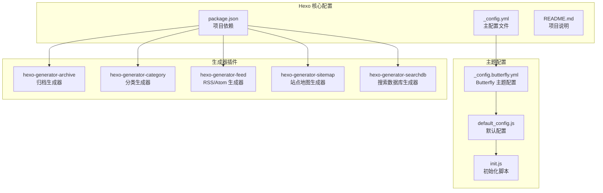
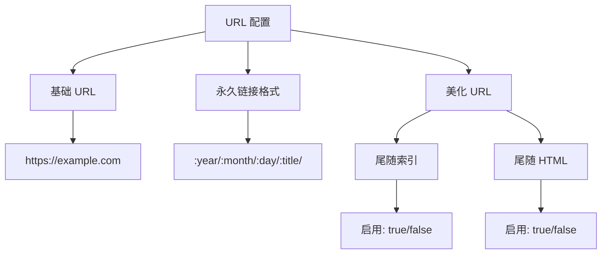
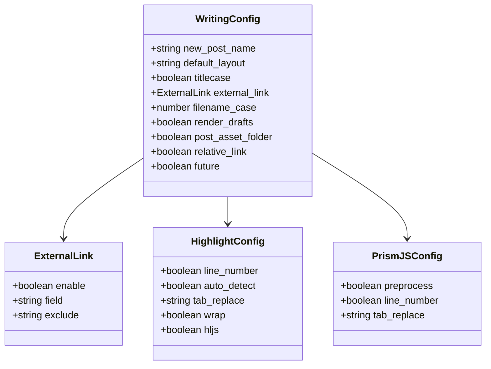
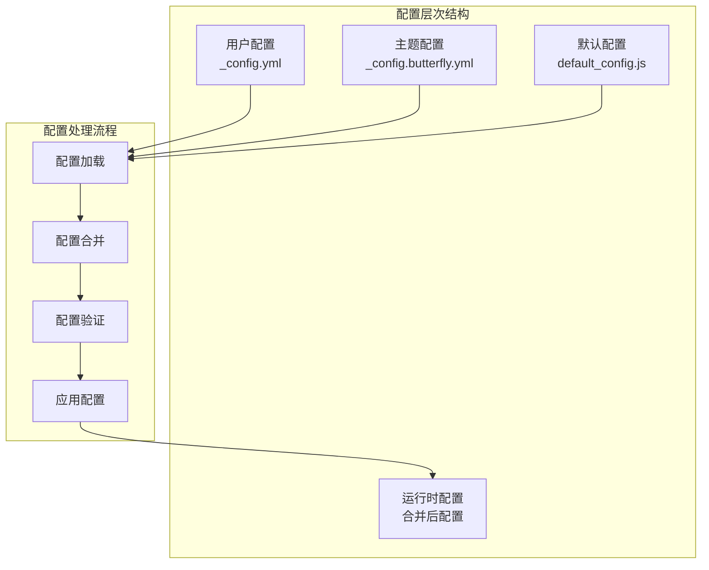
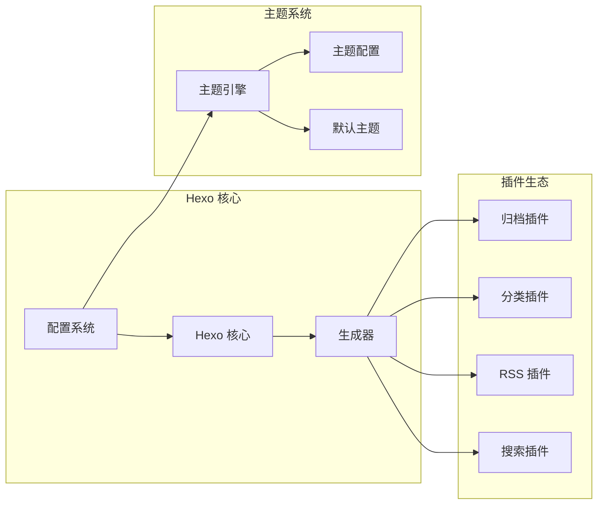

# Hexo 核心配置

<cite>
**本文引用的文件**
- [_config.yml](file://_config.yml)
- [_config.butterfly.yml](file://_config.butterfly.yml)
- [package.json](file://package.json)
- [README.md](file://README.md)
- [default_config.js](file://themes/butterfly/scripts/common/default_config.js)
- [init.js](file://themes/butterfly/scripts/events/init.js)
</cite>

## 目录
1. [简介](#简介)
2. [项目结构](#项目结构)
3. [核心组件](#核心组件)
4. [架构概览](#架构概览)
5. [详细组件分析](#详细组件分析)
6. [依赖关系分析](#依赖关系分析)
7. [性能考虑](#性能考虑)
8. [故障排除指南](#故障排除指南)
9. [结论](#结论)

## 简介

本指南深入解析 Hexo 核心配置系统，重点围绕 `_config.yml` 文件进行全面说明。Hexo 是一个快速、简洁且高效的静态博客框架，其配置系统提供了丰富的选项来定制网站的功能和外观。

本项目基于 Hexo 8.1.1 版本，使用 Butterfly 主题 v5.5.4，集成了多种现代化功能特性。配置文件不仅控制站点的基本信息，还管理 URL 结构、目录组织、写作流程、分页设置等多个方面。

## 项目结构

该项目采用标准的 Hexo 项目结构，包含核心配置文件、主题配置文件和各种生成器插件：

**图表来源**
- [_config.yml:1-173](file://_config.yml#L1-L173)
- [_config.butterfly.yml:1-690](file://_config.butterfly.yml#L1-L690)
- [package.json:1-42](file://package.json#L1-L42)

**章节来源**
- [_config.yml:1-173](file://_config.yml#L1-L173)
- [package.json:1-42](file://package.json#L1-L42)

## 核心组件

### 站点基本信息配置

站点基本信息是配置系统的基础部分，直接影响网站的元数据和 SEO 表现：

| 配置项 | 类型 | 默认值 | 描述 |
|--------|------|--------|------|
| title | 字符串 | 无 | 网站标题，用于页面标题和元数据 |
| subtitle | 字符串 | 空字符串 | 网站副标题，可选显示 |
| description | 字符串 | 空字符串 | 网站描述，用于 SEO 优化 |
| keywords | 字符串数组 | 空数组 | 网站关键词，多个关键词用逗号分隔 |
| author | 字符串 | 无 | 作者名称，用于文章元数据 |
| language | 字符串 | zh-CN | 网站语言设置，支持多语言 |

### URL 配置系统

URL 配置决定了网站的链接结构和可访问性：

**图表来源**
- [_config.yml:13-20](file://_config.yml#L13-L20)

### 目录结构配置

目录结构配置定义了源文件和输出文件的组织方式：

| 配置项 | 默认值 | 描述 |
|--------|--------|------|
| source_dir | source | 源文件目录 |
| public_dir | public | 输出目录 |
| tag_dir | tags | 标签页面目录 |
| archive_dir | archives | 归档页面目录 |
| category_dir | categories | 分类页面目录 |
| code_dir | downloads/code | 代码文件目录 |
| i18n_dir | :lang | 国际化文件目录 |

### 写作配置系统

写作配置控制新文章的创建和渲染行为：

**图表来源**
- [_config.yml:31-55](file://_config.yml#L31-L55)

**章节来源**
- [_config.yml:4-11](file://_config.yml#L4-L11)
- [_config.yml:13-20](file://_config.yml#L13-L20)
- [_config.yml:21-30](file://_config.yml#L21-L30)
- [_config.yml:31-55](file://_config.yml#L31-L55)

## 架构概览

Hexo 的配置系统采用分层架构设计，确保配置的灵活性和可维护性：

**图表来源**
- [_config.yml:85-85](file://_config.yml#L85-L85)
- [_config.butterfly.yml:1-690](file://_config.butterfly.yml#L1-L690)
- [default_config.js:1-602](file://themes/butterfly/scripts/common/default_config.js#L1-L602)
- [init.js:79-86](file://themes/butterfly/scripts/events/init.js#L79-L86)

## 详细组件分析

### 站点元数据配置

站点元数据配置是网站 SEO 和社交分享的基础：

#### 基础信息配置
- **title**: 设置网站的主要标题，影响浏览器标签页和页面标题
- **subtitle**: 可选的副标题，通常显示在主标题下方
- **description**: 网站描述，用于搜索引擎优化和社交平台分享
- **keywords**: 关键词列表，提升搜索可见性

#### 作者和语言设置
- **author**: 作者信息，用于文章元数据和版权信息
- **language**: 网站语言，支持 zh-CN、en-US 等多种语言
- **timezone**: 时区设置，影响时间戳显示和文章发布时间

**最佳实践建议**:
- 使用简洁明确的标题和描述
- 关键词应与网站内容高度相关
- 语言设置应与目标受众匹配
- 时区设置应与内容发布者所在地区一致

### URL 结构配置

URL 配置直接影响网站的可读性和 SEO 表现：

#### 永久链接格式
- **permalink**: 控制文章 URL 的格式，支持变量替换
- **permalink_defaults**: 永美化 URL 的默认设置
- **pretty_urls**: 控制是否使用美化 URL

#### 美化 URL 设置
- **trailing_index**: 是否在目录末尾添加 index.html
- **trailing_html**: 是否在 URL 末尾添加 .html 扩展名

**配置示例路径**:
- [URL 配置示例:13-20](file://_config.yml#L13-L20)

### 目录结构配置

目录结构配置定义了网站文件的组织方式：

#### 核心目录设置
- **source_dir**: 源文件目录，默认为 source
- **public_dir**: 输出目录，默认为 public
- **tag_dir**: 标签页面目录，默认为 tags
- **archive_dir**: 归档页面目录，默认为 archives
- **category_dir**: 分类页面目录，默认为 categories

#### 高级目录设置
- **code_dir**: 代码文件目录，默认为 downloads/code
- **i18n_dir**: 国际化文件目录，支持变量替换
- **skip_render**: 指定不需要渲染的文件或目录

**配置示例路径**:
- [目录配置示例:21-30](file://_config.yml#L21-L30)

### 写作配置详解

写作配置控制文章创建和渲染的行为：

#### 新文章创建
- **new_post_name**: 新文章文件名格式，支持变量替换
- **default_layout**: 默认布局类型
- **titlecase**: 标题大小写转换设置

#### 外链处理
- **external_link.enable**: 是否启用外链处理
- **external_link.field**: 应用外链处理的范围
- **external_link.exclude**: 排除在外链处理之外的域名

#### 文件名处理
- **filename_case**: 文件名大小写转换规则
- **render_drafts**: 是否渲染草稿
- **post_asset_folder**: 是否启用文章资源文件夹

**配置示例路径**:
- [写作配置示例:31-44](file://_config.yml#L31-L44)

### 代码高亮配置

代码高亮配置支持两种主流的代码高亮方案：

#### highlight.js 配置
- **line_number**: 是否显示行号
- **auto_detect**: 是否自动检测语法
- **tab_replace**: 制表符替换字符
- **wrap**: 是否换行
- **hljs**: 是否使用 highlight.js 的样式

#### PrismJS 配置
- **preprocess**: 是否预处理代码
- **line_number**: 是否显示行号
- **tab_replace**: 制表符替换字符

**配置示例路径**:
- [代码高亮配置示例:44-55](file://_config.yml#L44-L55)

### 分页配置

分页配置控制主页和分类页面的文章分页行为：

#### 主页分页
- **index_generator.path**: 主页路径
- **index_generator.per_page**: 每页文章数量
- **index_generator.order_by**: 排序方式

#### 通用分页
- **per_page**: 默认每页项目数量
- **pagination_dir**: 分页目录名称

**配置示例路径**:
- [分页配置示例:57-78](file://_config.yml#L57-L78)

### 元数据和日期时间配置

#### 元数据生成
- **meta_generator**: 是否生成元数据

#### 日期时间格式
- **date_format**: 日期格式
- **time_format**: 时间格式
- **updated_option**: 更新时间选项

**配置示例路径**:
- [元数据配置示例:67-74](file://_config.yml#L67-L74)

### 包含/排除规则

包含/排除规则控制哪些文件应该被处理或忽略：

- **include**: 明确包含的文件或目录
- **exclude**: 明确排除的文件或目录
- **ignore**: 忽略的文件或目录模式

**配置示例路径**:
- [包含/排除配置示例:79-83](file://_config.yml#L79-L83)

### 主题和扩展配置

#### 主题配置
- **theme**: 当前使用的主题名称
- **theme_config**: 主题特定的配置选项

#### 扩展配置
- **deploy**: 部署配置（当前被注释）
- **plugins**: 插件列表

**配置示例路径**:
- [主题配置示例:85-85](file://_config.yml#L85-L85)

## 依赖关系分析

Hexo 配置系统与其他组件存在密切的依赖关系：

**图表来源**
- [package.json:16-37](file://package.json#L16-L37)
- [init.js:79-86](file://themes/butterfly/scripts/events/init.js#L79-L86)

**章节来源**
- [package.json:16-37](file://package.json#L16-L37)
- [init.js:1-86](file://themes/butterfly/scripts/events/init.js#L1-L86)

## 性能考虑

### 配置对性能的影响

1. **代码高亮性能**: 启用行号和自动检测会增加处理时间
2. **分页设置**: 每页文章数量影响页面加载性能
3. **懒加载配置**: 图片懒加载提升页面加载速度
4. **压缩配置**: CSS/JS 压缩减少文件大小

### 最佳实践建议

- 合理设置分页数量，平衡加载速度和用户体验
- 在生产环境中启用代码压缩
- 使用 CDN 加速静态资源加载
- 优化图片资源和懒加载配置

## 故障排除指南

### 常见配置问题

#### 版本兼容性问题
- 确保 Hexo 版本满足主题要求
- 检查 Node.js 版本要求

#### 配置冲突问题
- 避免重复配置相同选项
- 检查配置文件格式正确性

#### 主题配置问题
- 确认主题配置文件路径正确
- 检查主题依赖插件是否安装

**故障排除步骤**:
1. 运行 `hexo clean` 清理缓存
2. 检查配置文件语法
3. 验证依赖包版本
4. 查看错误日志信息

**章节来源**
- [init.js:10-32](file://themes/butterfly/scripts/events/init.js#L10-L32)

## 结论

Hexo 核心配置系统提供了强大而灵活的配置能力，通过合理的配置可以构建出功能完善、性能优秀的静态博客网站。本指南详细解析了各个配置选项的作用机制、最佳实践建议以及相互依赖关系。

关键要点总结：
- 配置应与网站目标和受众需求相匹配
- 合理的 URL 结构提升 SEO 表现
- 适当的分页设置平衡性能和用户体验
- 主题配置与核心配置需要协调一致
- 定期检查和优化配置以适应网站发展

通过深入理解这些配置选项，用户可以根据自己的具体需求定制出最适合的博客解决方案。