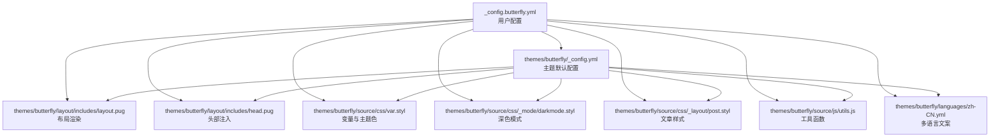
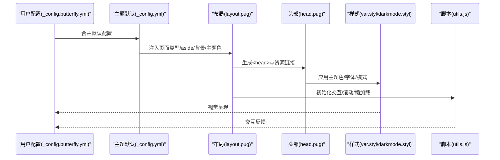
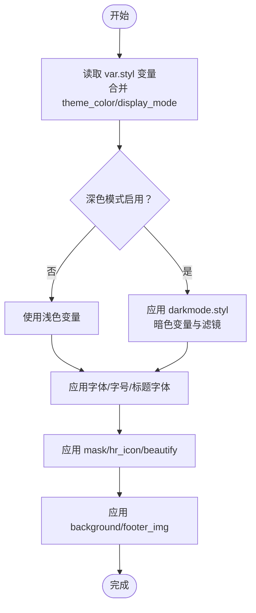
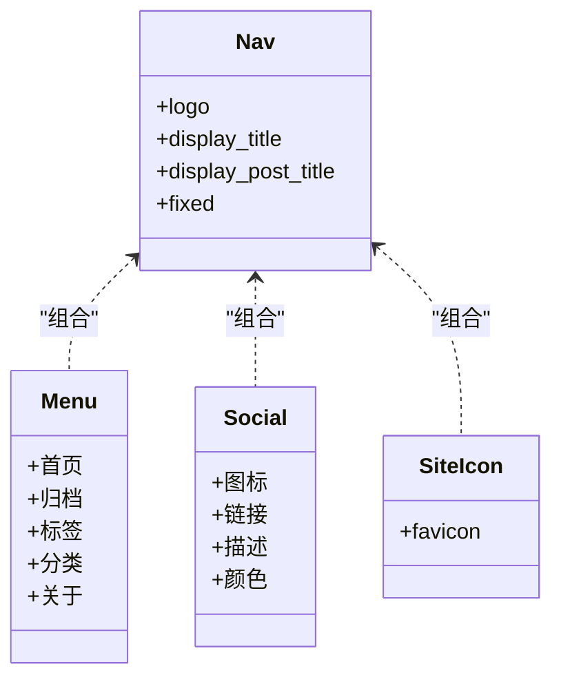
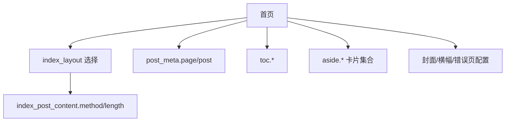
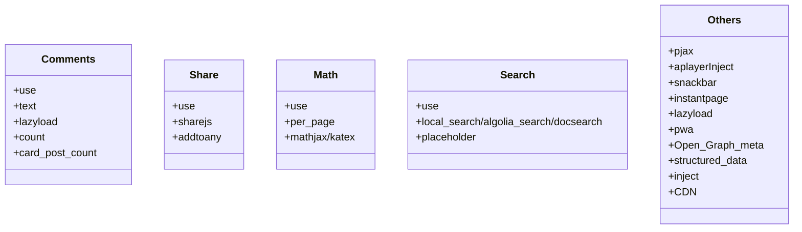
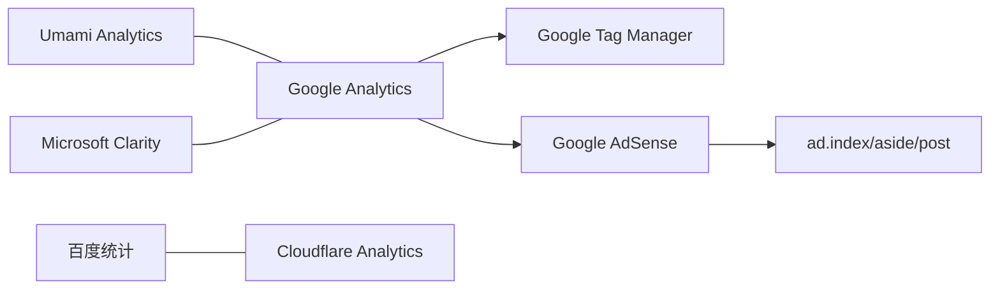
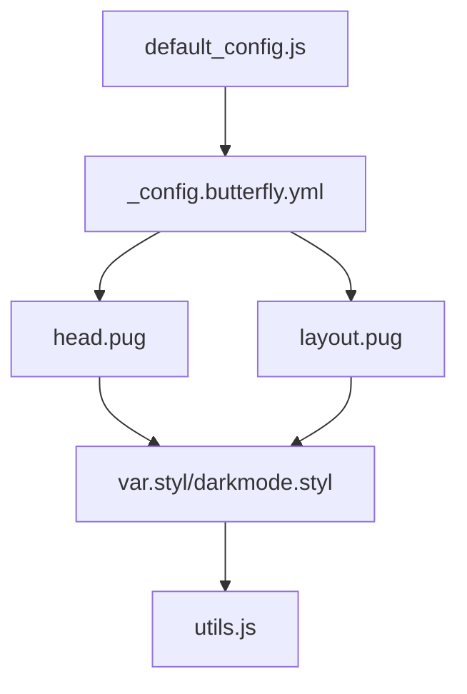

# 主题配置

<cite>
**本文引用的文件**
- [_config.butterfly.yml](file://_config.butterfly.yml)
- [themes/butterfly/_config.yml](file://themes/butterfly/_config.yml)
- [themes/butterfly/scripts/common/default_config.js](file://themes/butterfly/scripts/common/default_config.js)
- [themes/butterfly/layout/includes/layout.pug](file://themes/butterfly/layout/includes/layout.pug)
- [themes/butterfly/layout/includes/head.pug](file://themes/butterfly/layout/includes/head.pug)
- [themes/butterfly/source/css/var.styl](file://themes/butterfly/source/css/var.styl)
- [themes/butterfly/source/css/_mode/darkmode.styl](file://themes/butterfly/source/css/_mode/darkmode.styl)
- [themes/butterfly/source/css/_layout/post.styl](file://themes/butterfly/source/css/_layout/post.styl)
- [themes/butterfly/source/js/utils.js](file://themes/butterfly/source/js/utils.js)
- [themes/butterfly/languages/zh-CN.yml](file://themes/butterfly/languages/zh-CN.yml)
</cite>

## 目录
1. [简介](#简介)
2. [项目结构](#项目结构)
3. [核心组件](#核心组件)
4. [架构总览](#架构总览)
5. [详细组件分析](#详细组件分析)
6. [依赖关系分析](#依赖关系分析)
7. [性能考量](#性能考量)
8. [故障排查指南](#故障排查指南)
9. [结论](#结论)
10. [附录](#附录)

## 简介
本指南围绕 Hexo 主题 Butterfly 的主题配置展开，聚焦 _config.butterfly.yml 中的全部个性化选项，覆盖外观与主题色、导航菜单、页面布局、功能开关、第三方服务集成、响应式与字体动画等高级定制，并提供示例路径、排障建议与性能优化要点，帮助你快速完成从入门到进阶的配置。

## 项目结构
主题配置主要由以下部分组成：
- 主题配置文件：_config.butterfly.yml（用户侧）与 themes/butterfly/_config.yml（主题默认）
- 渲染层：Pug 模板（layout/includes/*.pug）
- 样式层：Stylus 变量与模式（source/css/*.styl）
- 行为层：前端工具函数（source/js/utils.js）
- 多语言文案：languages/zh-CN.yml
- 默认配置脚本：scripts/common/default_config.js（用于生成默认值与类型约束）

**图表来源**
- [_config.butterfly.yml:1-690](file://_config.butterfly.yml#L1-L690)
- [themes/butterfly/_config.yml:1-1137](file://themes/butterfly/_config.yml#L1-L1137)
- [themes/butterfly/layout/includes/layout.pug:1-59](file://themes/butterfly/layout/includes/layout.pug#L1-L59)
- [themes/butterfly/layout/includes/head.pug:1-78](file://themes/butterfly/layout/includes/head.pug#L1-L78)
- [themes/butterfly/source/css/var.styl:1-233](file://themes/butterfly/source/css/var.styl#L1-L233)
- [themes/butterfly/source/css/_mode/darkmode.styl:1-205](file://themes/butterfly/source/css/_mode/darkmode.styl#L1-L205)
- [themes/butterfly/source/css/_layout/post.styl:1-265](file://themes/butterfly/source/css/_layout/post.styl#L1-L265)
- [themes/butterfly/source/js/utils.js:1-339](file://themes/butterfly/source/js/utils.js#L1-L339)
- [themes/butterfly/languages/zh-CN.yml:1-125](file://themes/butterfly/languages/zh-CN.yml#L1-L125)

**章节来源**
- [_config.butterfly.yml:1-690](file://_config.butterfly.yml#L1-L690)
- [themes/butterfly/_config.yml:1-1137](file://themes/butterfly/_config.yml#L1-L1137)

## 核心组件
- 导航与菜单：nav、menu、social、favicon、avatar、logo 等
- 页面布局：index_layout、index_post_content、post_meta、toc、aside、footer 等
- 功能开关：comments、search、math、share、pjax、lazyload、pwa、Open_Graph_meta、structured_data 等
- 第三方服务：baidu_analytics、google_analytics、cloudflare_analytics、microsoft_clarity、umami_analytics、google_tag_manager、google_adsense、site_verification 等
- 外观与主题色：theme_color、display_mode、rounded_corners_ui、text_align_justify、mask、preloader、enter_transitions、font、blog_title_font、hr_icon、activate_power_mode、canvas_*、fireworks、click_*、lightbox 等
- 高级插件与 UI：series、abcjs、mermaid、chartjs、note、inject、CDN 等

**章节来源**
- [_config.butterfly.yml:7-690](file://_config.butterfly.yml#L7-L690)
- [themes/butterfly/_config.yml:11-1137](file://themes/butterfly/_config.yml#L11-L1137)

## 架构总览
主题配置通过 YAML 文件驱动，渲染层根据配置决定 HTML 结构与资源注入；样式层依据变量与模式应用视觉效果；行为层在运行时处理交互与动态效果；多语言文案统一输出文本。

**图表来源**
- [themes/butterfly/layout/includes/layout.pug:1-59](file://themes/butterfly/layout/includes/layout.pug#L1-L59)
- [themes/butterfly/layout/includes/head.pug:1-78](file://themes/butterfly/layout/includes/head.pug#L1-L78)
- [themes/butterfly/source/css/var.styl:1-233](file://themes/butterfly/source/css/var.styl#L1-L233)
- [themes/butterfly/source/css/_mode/darkmode.styl:1-205](file://themes/butterfly/source/css/_mode/darkmode.styl#L1-L205)
- [themes/butterfly/source/js/utils.js:1-339](file://themes/butterfly/source/js/utils.js#L1-L339)

## 详细组件分析

### 外观与主题色
- 主题色与元主题色：通过 theme_color.* 控制主色、分页、按钮悬停、选中、链接、元信息、代码块、TOC、滚动条、meta 主题色等；display_mode 决定初始模式。
- 字体与字号：font.global_font_size、font.code_font_size、font.font_family、font.code_font_family；blog_title_font.font_family/font_link。
- 排版与修饰：rounded_corners_ui、text_align_justify、mask.header/footer、hr_icon、beautify.*、activate_power_mode.*。
- 背景与遮罩：background 支持单值或数组随机；footer_img；mask 头尾蒙层。
- 动画与过渡：preloader.*、enter_transitions、lazyload.*、pwa.*、Open_Graph_meta、structured_data、inject.head/bottom、CDN.*。

**图表来源**
- [themes/butterfly/source/css/var.styl:1-233](file://themes/butterfly/source/css/var.styl#L1-L233)
- [themes/butterfly/source/css/_mode/darkmode.styl:1-205](file://themes/butterfly/source/css/_mode/darkmode.styl#L1-L205)
- [themes/butterfly/source/css/_layout/post.styl:1-265](file://themes/butterfly/source/css/_layout/post.styl#L1-L265)
- [_config.butterfly.yml:482-581](file://_config.butterfly.yml#L482-L581)

**章节来源**
- [_config.butterfly.yml:482-581](file://_config.butterfly.yml#L482-L581)
- [themes/butterfly/source/css/var.styl:1-233](file://themes/butterfly/source/css/var.styl#L1-L233)
- [themes/butterfly/source/css/_mode/darkmode.styl:1-205](file://themes/butterfly/source/css/_mode/darkmode.styl#L1-L205)
- [themes/butterfly/source/css/_layout/post.styl:1-265](file://themes/butterfly/source/css/_layout/post.styl#L1-L265)

### 导航与菜单
- 导航栏：nav.logo、nav.display_title、nav.display_post_title、nav.fixed。
- 主菜单：menu.* 显示“首页/归档/标签/分类/关于”等；支持图标与自定义链接。
- 社交链接：social.* 支持图标、链接、描述、颜色。
- 站点图标：favicon。

**图表来源**
- [_config.butterfly.yml:7-40](file://_config.butterfly.yml#L7-L40)
- [themes/butterfly/layout/includes/head.pug:37-38](file://themes/butterfly/layout/includes/head.pug#L37-L38)

**章节来源**
- [_config.butterfly.yml:7-40](file://_config.butterfly.yml#L7-L40)
- [themes/butterfly/layout/includes/head.pug:37-38](file://themes/butterfly/layout/includes/head.pug#L37-L38)

### 页面布局与封面
- 首页布局：index_layout（1~7 多种布局）。
- 首页摘要：index_post_content.method（1/2/3/false）与 length。
- 文章元信息：post_meta.page/post（日期类型/格式、分类/标签、标签样式）。
- 目录：toc.post/page/number/expand/style_simple/scroll_percent。
- 侧边栏：aside.enable/hide/button/mobile/position/display.*，以及各类卡片（作者、公告、最新文章、最新评论、分类、标签、归档、系列、站点信息）。
- 页脚：footer.owner/since、footer.copyright.enable/version、footer.custom_text。
- 封面与横幅：cover.index_enable/aside_enable/archives_enable/default_cover；banner 图：default_top_img/index_img/archive_img/tag_img/category_img；错误页：error_404.enable/subtitle/background；错误图：error_img.flink/post_page。

**图表来源**
- [_config.butterfly.yml:88-223](file://_config.butterfly.yml#L88-L223)

**章节来源**
- [_config.butterfly.yml:88-223](file://_config.butterfly.yml#L88-L223)

### 功能开关与插件
- 评论系统：comments.use/text/lazyload/count/card_post_count；支持 Disqus/Disqusjs/Livere/Gitalk/Valine/Waline/Utterances/Facebook/Twikoo/Giscus/Remark42/Artalk。
- 分享：share.use/sharejs/addtoany。
- 数学公式：math.use/mathjax/katex/per_page/hide_scrollbar。
- 搜索：search.use/local_search/algolia_search/docsearch/placeholder。
- 其他：pjax、aplayerInject、snackbar、instantpage、lazyload、pwa、Open_Graph_meta、structured_data、inject、CDN。

**图表来源**
- [_config.butterfly.yml:299-439](file://_config.butterfly.yml#L299-L439)

**章节来源**
- [_config.butterfly.yml:299-439](file://_config.butterfly.yml#L299-L439)

### 第三方服务集成
- 统计与分析：baidu_analytics、google_analytics、cloudflare_analytics、microsoft_clarity、umami_analytics.enable/serverURL/script_name/website_id/UV_PV/token。
- 广告：google_adsense.enable/auto_ads/js/client/enable_page_level_ads；ad.index/aside/post 自定义插入。
- 站点验证：site_verification.*。
- 标签管理：google_tag_manager.tag_id/domain。

**图表来源**
- [_config.butterfly.yml:439-479](file://_config.butterfly.yml#L439-L479)

**章节来源**
- [_config.butterfly.yml:439-479](file://_config.butterfly.yml#L439-L479)

### 响应式设计与字体动画
- 响应式：viewport、移动端 aside 显示、移动端按钮、滚动百分比、右下角按钮位置与顺序。
- 字体：font.*、blog_title_font.*。
- 动画：enter_transitions、preloader.*、activate_power_mode.*、canvas_*、fireworks、click_*、lightbox。

**章节来源**
- [_config.butterfly.yml:510-581](file://_config.butterfly.yml#L510-L581)
- [themes/butterfly/layout/includes/layout.pug:1-59](file://themes/butterfly/layout/includes/layout.pug#L1-L59)
- [themes/butterfly/layout/includes/head.pug:1-78](file://themes/butterfly/layout/includes/head.pug#L1-L78)

### 多语言与文案
- 多语言文案集中于 languages/zh-CN.yml，包括页脚、复制、分页、搜索、评论、侧边栏、日期后缀、Snackbar 提示等。

**章节来源**
- [themes/butterfly/languages/zh-CN.yml:1-125](file://themes/butterfly/languages/zh-CN.yml#L1-L125)

## 依赖关系分析
- 配置到渲染：_config.butterfly.yml → layout/includes/*.pug（决定页面类型、aside 显示、背景、主题色、注入资源）。
- 渲染到样式：head.pug → var.styl/darkmode.styl（应用主题色、字体、模式、遮罩、hr 图标）。
- 样式到行为：utils.js（滚动、懒加载、评论切换、加载动画、节流防抖等）。
- 默认配置：scripts/common/default_config.js（提供默认值与字段说明，便于二次开发）。

**图表来源**
- [_config.butterfly.yml:1-690](file://_config.butterfly.yml#L1-L690)
- [themes/butterfly/layout/includes/layout.pug:1-59](file://themes/butterfly/layout/includes/layout.pug#L1-L59)
- [themes/butterfly/layout/includes/head.pug:1-78](file://themes/butterfly/layout/includes/head.pug#L1-L78)
- [themes/butterfly/source/css/var.styl:1-233](file://themes/butterfly/source/css/var.styl#L1-L233)
- [themes/butterfly/source/css/_mode/darkmode.styl:1-205](file://themes/butterfly/source/css/_mode/darkmode.styl#L1-L205)
- [themes/butterfly/source/js/utils.js:1-339](file://themes/butterfly/source/js/utils.js#L1-L339)
- [themes/butterfly/scripts/common/default_config.js:1-602](file://themes/butterfly/scripts/common/default_config.js#L1-L602)

**章节来源**
- [themes/butterfly/scripts/common/default_config.js:1-602](file://themes/butterfly/scripts/common/default_config.js#L1-L602)

## 性能考量
- 懒加载：lazyload.enable/native/field/placeholder/blur，建议开启以降低首屏压力。
- 预加载与骨架：preloader.*、inject.head/bottom 资源按需引入。
- CDN：CDN.internal_provider/third_party_provider/version/custom_format/option，合理选择第三方 CDN 以提升静态资源加载速度。
- 搜索：local_search.preload/top_n_per_article/unescape/pagination.*，按需开启分页与预加载。
- 数学公式：math.per_page 控制按页加载，避免全局加载导致首屏延迟。
- 图片与动画：canvas_*、fireworks、click_* 等特效按需启用，避免影响性能。
- PWA：pwa.enable 与 manifest/apple_touch_icon 等，提升缓存与离线体验。
- 代码高亮：code_blocks.*（theme/macStyle/height_limit/word_wrap/copy/language/shrink/fullpage），适度控制高度与复制按钮以减少 DOM 开销。

[本节为通用指导，无需特定文件引用]

## 故障排查指南
- 评论系统不显示
  - 检查 comments.use 是否正确配置，lazyload 会延迟加载；如需计数请关闭 lazyload。
  - 不同评论系统（如 Utterances/Giscus）需要在对应仓库/组织内正确配置 repo/repo_id/category_id 等参数。
- 深色模式无效
  - 确认 darkmode.enable/button/autoChangeMode/start/end 设置；display_mode 与 data-theme 属性联动。
- 搜索无结果
  - local_search.preload 是否开启；algolia_search/docsearch 需要正确填写 appId/apiKey/indexName。
- 数学公式不渲染
  - math.use 选择 mathjax/katex；per_page 控制按页加载；确保页面 front-matter 或配置中启用。
- 字体/主题色不生效
  - 检查 theme_color.* 与 blog_title_font.*；确认 var.styl 与 darkmode.styl 生效。
- 广告未显示
  - google_adsense.* 与 ad.index/aside/post 配置是否正确；注意隐私合规。
- 多语言文案未显示
  - 确认 languages/zh-CN.yml 对应键值存在且拼写正确。

**章节来源**
- [_config.butterfly.yml:299-479](file://_config.butterfly.yml#L299-L479)
- [themes/butterfly/source/css/_mode/darkmode.styl:1-205](file://themes/butterfly/source/css/_mode/darkmode.styl#L1-L205)
- [themes/butterfly/source/js/utils.js:1-339](file://themes/butterfly/source/js/utils.js#L1-L339)

## 结论
通过系统化梳理 _config.butterfly.yml 的各项配置项，结合渲染、样式与行为层的联动机制，你可以灵活实现从基础外观到高级特效的全链路定制。建议先从导航、主题色与布局入手，再逐步启用搜索、数学公式与广告等增强功能，并始终关注性能与可访问性。

[本节为总结性内容，无需特定文件引用]

## 附录
- 配置示例路径（仅列出路径，不展示具体代码）
  - 导航与菜单：[_config.butterfly.yml:7-40](file://_config.butterfly.yml#L7-L40)
  - 页面布局：[_config.butterfly.yml:88-223](file://_config.butterfly.yml#L88-L223)
  - 功能开关：[_config.butterfly.yml:299-439](file://_config.butterfly.yml#L299-L439)
  - 第三方服务：[_config.butterfly.yml:439-479](file://_config.butterfly.yml#L439-L479)
  - 外观与主题色：[_config.butterfly.yml:482-581](file://_config.butterfly.yml#L482-L581)
  - 默认配置参考：[themes/butterfly/scripts/common/default_config.js:1-602](file://themes/butterfly/scripts/common/default_config.js#L1-L602)
  - 渲染与头部注入：[themes/butterfly/layout/includes/layout.pug:1-59](file://themes/butterfly/layout/includes/layout.pug#L1-L59)、[themes/butterfly/layout/includes/head.pug:1-78](file://themes/butterfly/layout/includes/head.pug#L1-L78)
  - 样式变量与模式：[themes/butterfly/source/css/var.styl:1-233](file://themes/butterfly/source/css/var.styl#L1-L233)、[themes/butterfly/source/css/_mode/darkmode.styl:1-205](file://themes/butterfly/source/css/_mode/darkmode.styl#L1-L205)
  - 文案与多语言：[themes/butterfly/languages/zh-CN.yml:1-125](file://themes/butterfly/languages/zh-CN.yml#L1-L125)

[本节为补充索引，无需特定文件引用]