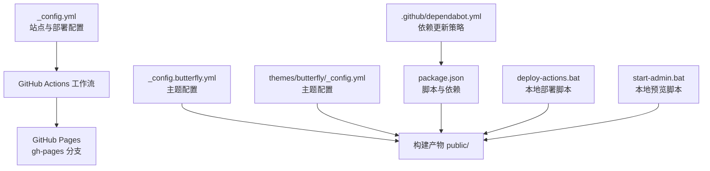
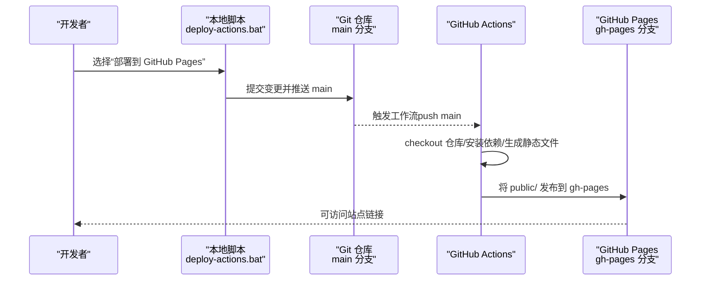
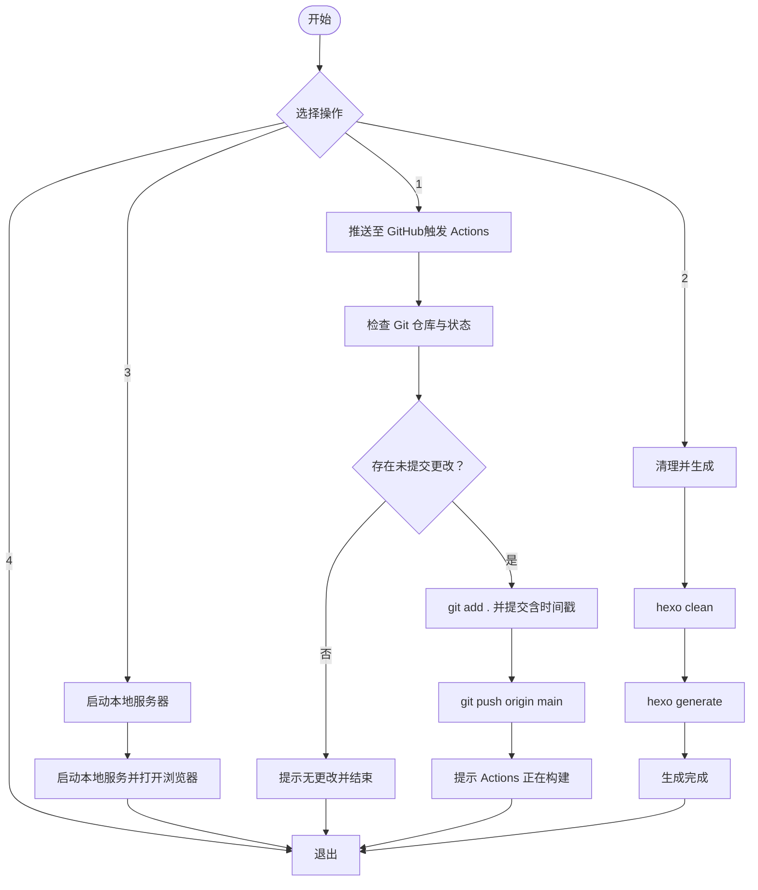
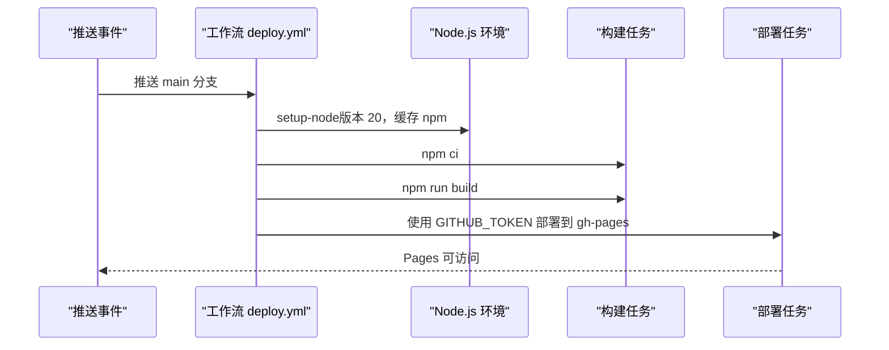
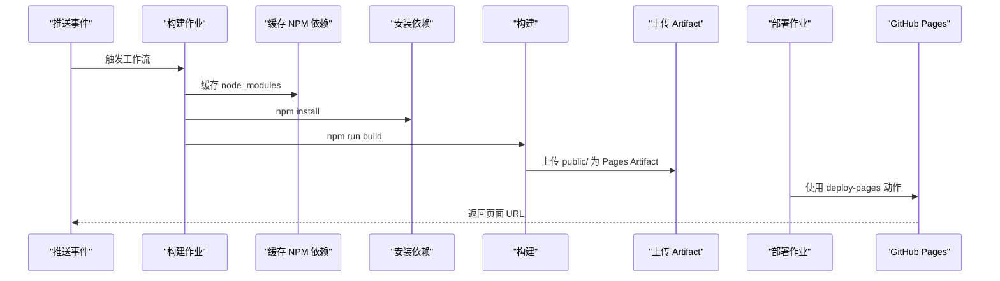
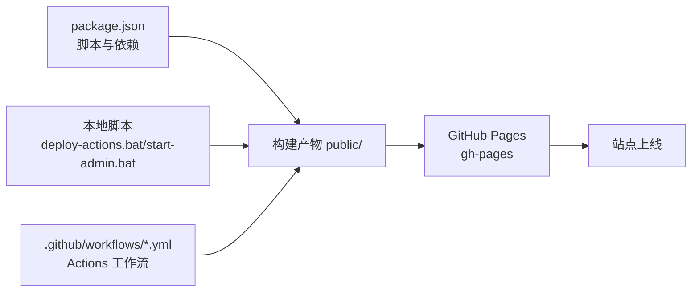

# 部署配置

<cite>
**本文引用的文件**
- [_config.yml](file://_config.yml)
- [_config.butterfly.yml](file://_config.butterfly.yml)
- [package.json](file://package.json)
- [deploy-actions.bat](file://deploy-actions.bat)
- [.github/workflows/deploy.yml](file://.github/workflows/deploy.yml)
- [.github/workflows/pages.yml](file://.github/workflows/pages.yml)
- [start-admin.bat](file://start-admin.bat)
- [themes/butterfly/_config.yml](file://themes/butterfly/_config.yml)
- [themes/butterfly/plugins.yml](file://themes/butterfly/plugins.yml)
- [.github/dependabot.yml](file://.github/dependabot.yml)
</cite>

## 目录
1. [简介](#简介)
2. [项目结构](#项目结构)
3. [核心组件](#核心组件)
4. [架构总览](#架构总览)
5. [详细组件分析](#详细组件分析)
6. [依赖关系分析](#依赖关系分析)
7. [性能考量](#性能考量)
8. [故障排查指南](#故障排查指南)
9. [结论](#结论)
10. [附录](#附录)

## 简介
本指南面向 Hexo 博客项目的部署配置，覆盖两类部署方式：
- 本地部署：通过批处理脚本一键执行清理、生成与本地预览。
- GitHub Pages 自动部署：通过 GitHub Actions 在推送代码后自动构建并发布到 GitHub Pages。

同时，文档解释部署配置参数（如 type、repo、branch、message 等），说明自动化工作流的触发条件、构建步骤与部署权限设置；提供部署脚本使用方法与自定义部署命令建议；并给出常见问题排查、安全配置、多环境策略与回滚机制建议。

## 项目结构
与部署相关的关键文件分布如下：
- 根配置与主题配置：_config.yml、_config.butterfly.yml、themes/butterfly/_config.yml
- 构建与运行脚本：package.json、start-admin.bat、deploy-actions.bat
- GitHub Actions 工作流：.github/workflows/deploy.yml、.github/workflows/pages.yml
- 依赖管理与安全：package.json、.github/dependabot.yml
- 主题插件清单：themes/butterfly/plugins.yml

图表来源
- [_config.yml:87-92](file://_config.yml#L87-L92)
- [_config.butterfly.yml:1-690](file://_config.butterfly.yml#L1-L690)
- [themes/butterfly/_config.yml:1-800](file://themes/butterfly/_config.yml#L1-L800)
- [package.json:6-12](file://package.json#L6-L12)
- [deploy-actions.bat:1-133](file://deploy-actions.bat#L1-L133)
- [start-admin.bat:1-48](file://start-admin.bat#L1-L48)
- [.github/workflows/deploy.yml:1-39](file://.github/workflows/deploy.yml#L1-L39)
- [.github/workflows/pages.yml:1-47](file://.github/workflows/pages.yml#L1-L47)
- [.github/dependabot.yml:1-8](file://.github/dependabot.yml#L1-L8)

章节来源
- [_config.yml:1-173](file://_config.yml#L1-L173)
- [_config.butterfly.yml:1-690](file://_config.butterfly.yml#L1-L690)
- [themes/butterfly/_config.yml:1-800](file://themes/butterfly/_config.yml#L1-L800)
- [package.json:1-42](file://package.json#L1-L42)
- [deploy-actions.bat:1-133](file://deploy-actions.bat#L1-L133)
- [start-admin.bat:1-48](file://start-admin.bat#L1-L48)
- [.github/workflows/deploy.yml:1-39](file://.github/workflows/deploy.yml#L1-L39)
- [.github/workflows/pages.yml:1-47](file://.github/workflows/pages.yml#L1-L47)
- [.github/dependabot.yml:1-8](file://.github/dependabot.yml#L1-L8)

## 核心组件
- 部署配置参数
  - type：部署类型（如 git）
  - repo：目标仓库地址（用于 GitHub Pages）
  - branch：目标分支（如 gh-pages）
  - message：提交信息模板（支持时间戳等变量）
  - 参考路径：[_config.yml:87-92](file://_config.yml#L87-L92)
- 本地部署脚本
  - deploy-actions.bat：提供菜单式选择，支持本地生成、启动服务、推送至 GitHub（触发 Actions）等
  - 参考路径：[deploy-actions.bat:1-133](file://deploy-actions.bat#L1-L133)
- GitHub Actions 工作流
  - deploy.yml：在 main 推送时，安装依赖、生成静态文件、部署到 gh-pages
  - pages.yml：使用 GitHub Pages 官方 Pages Artifact 与部署动作
  - 参考路径：[deploy.yml:1-39](file://.github/workflows/deploy.yml#L1-L39)、[pages.yml:1-47](file://.github/workflows/pages.yml#L1-L47)
- 本地预览与管理
  - start-admin.bat：清理缓存、生成静态文件、打开浏览器访问后台管理端口
  - 参考路径：[start-admin.bat:1-48](file://start-admin.bat#L1-L48)
- 构建与脚本
  - package.json：定义 build、clean、server、dev、admin 等脚本
  - 参考路径：[package.json:6-12](file://package.json#L6-L12)

章节来源
- [_config.yml:87-92](file://_config.yml#L87-L92)
- [deploy-actions.bat:1-133](file://deploy-actions.bat#L1-L133)
- [.github/workflows/deploy.yml:1-39](file://.github/workflows/deploy.yml#L1-L39)
- [.github/workflows/pages.yml:1-47](file://.github/workflows/pages.yml#L1-L47)
- [start-admin.bat:1-48](file://start-admin.bat#L1-L48)
- [package.json:6-12](file://package.json#L6-L12)

## 架构总览
下图展示从本地到 GitHub Pages 的部署路径，以及 Actions 的构建与发布流程。

图表来源
- [deploy-actions.bat:28-101](file://deploy-actions.bat#L28-L101)
- [.github/workflows/deploy.yml:3-39](file://.github/workflows/deploy.yml#L3-L39)
- [.github/workflows/pages.yml:3-47](file://.github/workflows/pages.yml#L3-L47)

章节来源
- [deploy-actions.bat:1-133](file://deploy-actions.bat#L1-L133)
- [.github/workflows/deploy.yml:1-39](file://.github/workflows/deploy.yml#L1-L39)
- [.github/workflows/pages.yml:1-47](file://.github/workflows/pages.yml#L1-L47)

## 详细组件分析

### 组件一：本地部署脚本（deploy-actions.bat）
- 功能要点
  - 菜单式交互：一键生成、启动本地服务、推送以触发 Actions
  - Git 状态检查：检测是否为 Git 仓库、是否存在未提交更改
  - 自动提交与推送：添加所有变更、生成带时间戳的提交信息、推送到 main
  - 输出提示：成功后显示站点与 Actions 页面链接
- 使用建议
  - 在本地修改完成后，优先使用该脚本进行统一打包与推送
  - 如需仅本地验证，可选择“Clean and Generate”或“Start Local Server”

图表来源
- [deploy-actions.bat:18-101](file://deploy-actions.bat#L18-L101)

章节来源
- [deploy-actions.bat:1-133](file://deploy-actions.bat#L1-L133)

### 组件二：GitHub Actions 自动部署（deploy.yml）
- 触发条件
  - 推送至 main 分支时触发
- 关键步骤
  - checkout 仓库（含子模块与完整深度）
  - 安装依赖（npm ci）
  - 生成静态文件（npm run build）
  - 部署到 GitHub Pages（gh-pages 分支）
- 权限与用户信息
  - 使用 GITHUB_TOKEN
  - 提交者身份与邮箱由工作流配置指定
- 适用场景
  - 无需本地安装 Node.js 或手动部署
  - 团队协作与 CI/CD 流程标准化

图表来源
- [.github/workflows/deploy.yml:3-39](file://.github/workflows/deploy.yml#L3-L39)

章节来源
- [.github/workflows/deploy.yml:1-39](file://.github/workflows/deploy.yml#L1-L39)

### 组件三：GitHub Pages 官方工作流（pages.yml）
- 特点
  - 使用 GitHub Pages 官方 Artifact 上传与部署动作
  - 显式声明对 Pages 的写入与 ID Token 权限
- 适用场景
  - 使用 GitHub Pages 官方托管能力，便于统一管理与审计

图表来源
- [.github/workflows/pages.yml:8-47](file://.github/workflows/pages.yml#L8-L47)

章节来源
- [.github/workflows/pages.yml:1-47](file://.github/workflows/pages.yml#L1-L47)

### 组件四：本地预览与管理（start-admin.bat）
- 功能
  - 清理缓存、生成静态文件、打开浏览器访问后台管理端口
- 适用场景
  - 本地调试与管理端联调，快速验证生成结果

章节来源
- [start-admin.bat:1-48](file://start-admin.bat#L1-L48)

### 组件五：部署配置参数详解（type、repo、branch、message 等）
- 参数说明
  - type：部署类型（如 git）
  - repo：目标仓库地址（用于 Pages 部署）
  - branch：目标分支（如 gh-pages）
  - message：提交信息模板（可嵌入时间戳等变量）
- 配置位置
  - 参考路径：[_config.yml:87-92](file://_config.yml#L87-L92)
- 注意事项
  - 若使用 GitHub Actions 自动部署，本地配置可暂时禁用或保留注释
  - message 中的时间戳建议使用系统支持的格式，避免特殊字符导致提交失败

章节来源
- [_config.yml:87-92](file://_config.yml#L87-L92)

### 组件六：主题与插件对部署的影响
- 主题配置
  - 主题配置文件影响生成内容与资源路径，确保与部署路径一致
  - 参考路径：[themes/butterfly/_config.yml:1-800](file://themes/butterfly/_config.yml#L1-L800)
- 插件清单
  - 插件列表决定构建期加载的第三方资源，影响构建时间与产物大小
  - 参考路径：[themes/butterfly/plugins.yml:1-208](file://themes/butterfly/plugins.yml#L1-L208)

章节来源
- [themes/butterfly/_config.yml:1-800](file://themes/butterfly/_config.yml#L1-L800)
- [themes/butterfly/plugins.yml:1-208](file://themes/butterfly/plugins.yml#L1-L208)

## 依赖关系分析
- 脚本与工具链
  - package.json 定义的脚本驱动本地与 CI 构建
  - deploy-actions.bat 作为本地入口，间接依赖 Node.js 与 Git
- GitHub Actions 与 Pages
  - 工作流依赖 Node.js 环境、npm 缓存与 Pages 部署动作
- 依赖更新策略
  - dependabot.yml 配置每日扫描 npm 依赖并限制 PR 数量

图表来源
- [package.json:6-12](file://package.json#L6-L12)
- [deploy-actions.bat:1-133](file://deploy-actions.bat#L1-L133)
- [start-admin.bat:1-48](file://start-admin.bat#L1-L48)
- [.github/workflows/deploy.yml:1-39](file://.github/workflows/deploy.yml#L1-L39)
- [.github/workflows/pages.yml:1-47](file://.github/workflows/pages.yml#L1-L47)

章节来源
- [package.json:1-42](file://package.json#L1-L42)
- [deploy-actions.bat:1-133](file://deploy-actions.bat#L1-L133)
- [start-admin.bat:1-48](file://start-admin.bat#L1-L48)
- [.github/workflows/deploy.yml:1-39](file://.github/workflows/deploy.yml#L1-L39)
- [.github/workflows/pages.yml:1-47](file://.github/workflows/pages.yml#L1-L47)
- [.github/dependabot.yml:1-8](file://.github/dependabot.yml#L1-L8)

## 性能考量
- 构建优化
  - 使用 npm ci 与缓存策略减少安装时间
  - 合理配置主题与插件，避免不必要的资源加载
- 产物体积
  - 利用主题与插件配置控制资源引入，减少冗余文件
- 依赖更新
  - 通过 dependabot.yml 控制更新频率与 PR 数量，降低突发性升级带来的风险

## 故障排查指南
- 权限问题
  - Actions 部署失败：确认工作流中使用的 GITHUB_TOKEN 是否具备写入 Pages 的权限
  - 本地推送失败：检查远程仓库权限与 SSH/HTTPS 配置
- 网络问题
  - npm 安装超时：使用缓存策略与镜像源；在 Actions 中启用缓存
- 构建失败
  - Node.js 版本不匹配：统一使用工作流中的 Node.js 版本（如 20）
  - 依赖缺失：确保 package.json 与 lock 文件同步
- 本地脚本异常
  - 未检测到 Git 仓库：确认当前目录为仓库根目录
  - 无更改可提交：先进行本地修改再执行脚本

章节来源
- [.github/workflows/deploy.yml:19-39](file://.github/workflows/deploy.yml#L19-L39)
- [.github/workflows/pages.yml:16-30](file://.github/workflows/pages.yml#L16-L30)
- [deploy-actions.bat:37-90](file://deploy-actions.bat#L37-L90)

## 结论
本项目采用“本地脚本 + GitHub Actions”的组合部署方案：本地脚本负责统一打包与触发 CI，GitHub Actions 负责标准化构建与发布。通过合理的配置参数、工作流权限与依赖策略，可实现稳定、可追溯且易于维护的自动化部署体系。

## 附录
- 自定义部署命令建议
  - 本地：使用 start-admin.bat 进行本地验证
  - CI：在 deploy.yml 或 pages.yml 中按需调整 Node.js 版本与缓存策略
- 多环境策略
  - 通过不同分支（如 main、develop）区分环境；在工作流中针对分支执行差异化步骤
- 回滚机制
  - 利用 GitHub Pages 的历史提交与回退功能；必要时回退到上一个稳定构建
- 安全配置
  - 限制 Actions 权限范围；使用最小权限原则；定期审查依赖更新