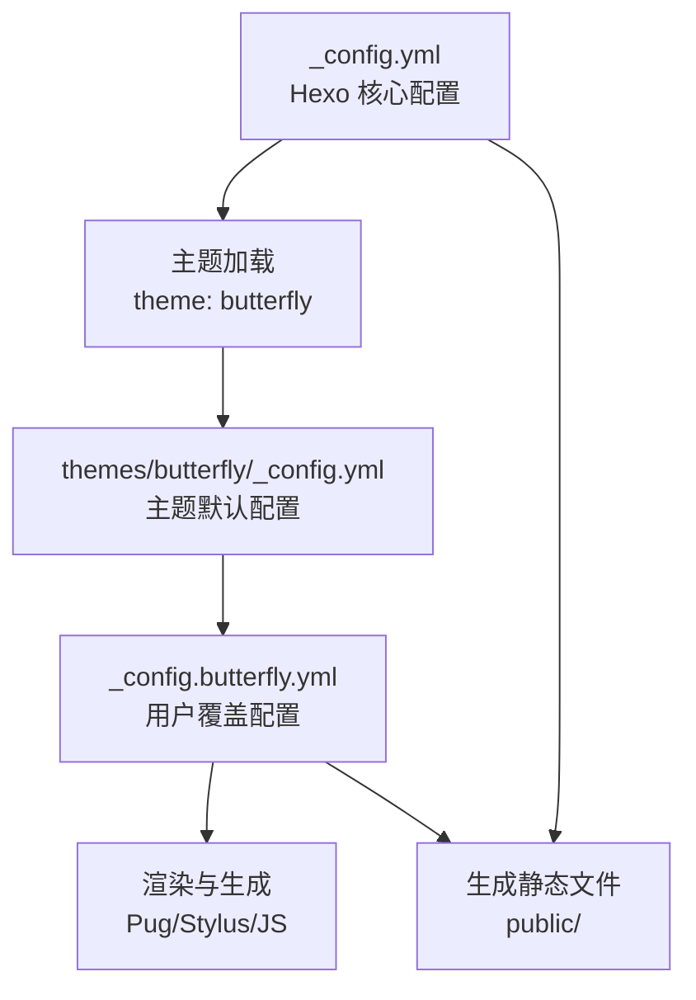
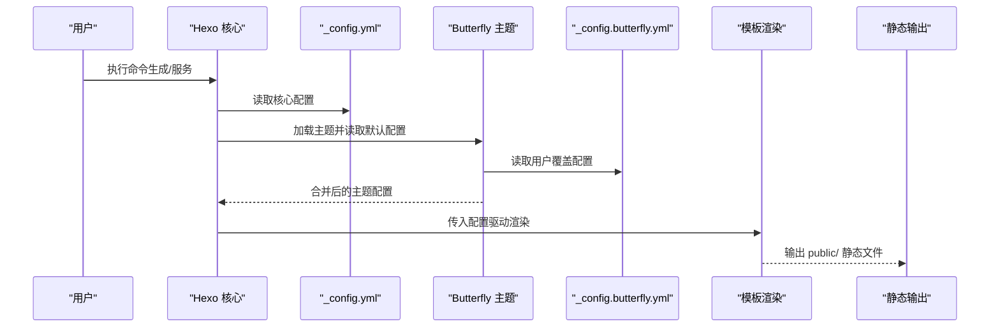
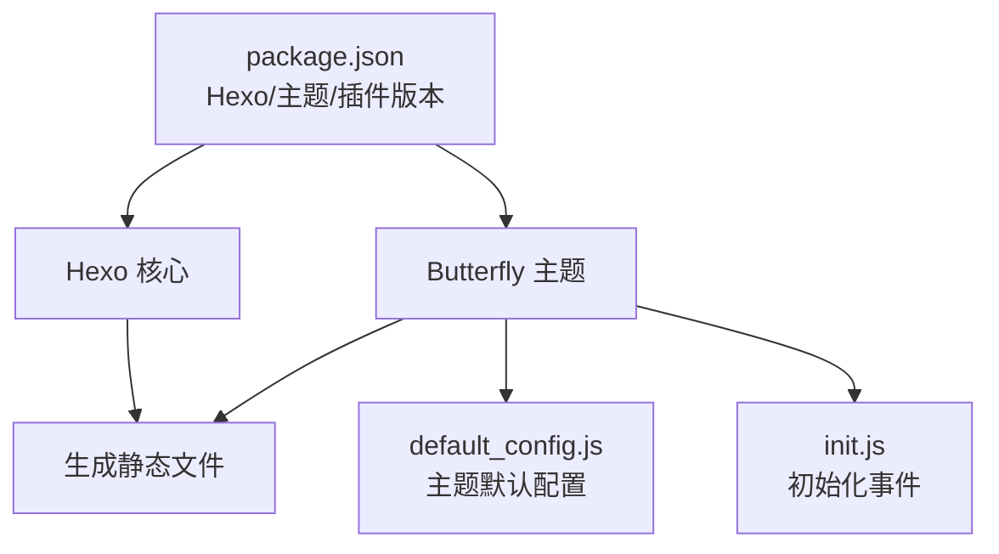

# 配置指南

<cite>
**本文引用的文件**
- [_config.yml](file://_config.yml)
- [_config.butterfly.yml](file://_config.butterfly.yml)
- [themes/butterfly/_config.yml](file://themes/butterfly/_config.yml)
- [package.json](file://package.json)
- [themes/butterfly/package.json](file://themes/butterfly/package.json)
- [themes/butterfly/scripts/common/default_config.js](file://themes/butterfly/scripts/common/default_config.js)
- [themes/butterfly/scripts/events/init.js](file://themes/butterfly/scripts/events/init.js)
- [node_modules/hexo-theme-butterfly/scripts/events/init.js](file://node_modules/hexo-theme-butterfly/scripts/events/init.js)
- [source/_posts/hello-world.md](file://source/_posts/hello-world.md)
- [source/about/index.md](file://source/about/index.md)
- [themes/butterfly/layout/index.pug](file://themes/butterfly/layout/index.pug)
</cite>

## 目录
1. [引言](#引言)
2. [项目结构](#项目结构)
3. [核心组件](#核心组件)
4. [架构总览](#架构总览)
5. [详细组件分析](#详细组件分析)
6. [依赖关系分析](#依赖关系分析)
7. [性能考虑](#性能考虑)
8. [故障排除指南](#故障排除指南)
9. [结论](#结论)
10. [附录](#附录)

## 引言
本指南面向使用 Hexo + Butterfly 主题的博客系统，系统性讲解两类配置文件：Hexo 核心配置文件（_config.yml）与主题配置文件（_config.butterfly.yml）。内容覆盖站点基本信息、URL 设置、目录结构、写作配置、分页设置、元数据配置、主题个性化配置（外观、功能开关、第三方服务集成）、配置项之间的相互关系与影响、常见场景的解决方案与优化建议。目标是帮助读者快速理解并高效配置博客系统，实现从入门到进阶的完整路径。

## 项目结构
本仓库采用标准 Hexo 结构，其中：
- 根目录的 _config.yml 为 Hexo 的核心配置入口，定义站点元信息、URL、目录、写作、分页、元数据、搜索、Sitemap、Robots、懒加载、Feed、Markdown 渲染、压缩等全局行为。
- themes/butterfly/_config.yml 为主题默认配置，提供主题可选功能的默认值；实际使用中推荐通过根目录的 _config.butterfly.yml 进行覆盖。
- package.json 定义了 Hexo 版本、主题版本及插件依赖，确保环境一致性与功能完整性。
- source 目录存放文章与页面源文件，如示例文章 hello-world.md 和关于页面 about/index.md。
- themes/butterfly 提供主题模板、样式、脚本与语言包，支持 Pug、Stylus、JavaScript 等资源。

图表来源
- [_config.yml](file://_config.yml#L85)
- [themes/butterfly/_config.yml](file://themes/butterfly/_config.yml#L1)
- [_config.butterfly.yml](file://_config.butterfly.yml#L1)

章节来源
- [_config.yml:1-173](file://_config.yml#L1-L173)
- [package.json:1-42](file://package.json#L1-L42)
- [themes/butterfly/_config.yml:1-1137](file://themes/butterfly/_config.yml#L1-L1137)
- [themes/butterfly/package.json:1-35](file://themes/butterfly/package.json#L1-L35)

## 核心组件
本节聚焦两类配置文件的关键作用域与职责：
- Hexo 核心配置（_config.yml）：控制站点元信息、URL 规则、目录映射、写作行为、分页策略、元数据生成、搜索与 Feed、Sitemap、Robots、懒加载、Markdown 渲染、HTML/CSS/JS 压缩等。
- 主题配置（_config.butterfly.yml）：控制导航、封面图、文章元信息、TOC、版权、打赏、相关文章、底部按钮、深色模式、数学公式、搜索、评论、聊天、分析、广告、美化效果、注入资源、CDN 等主题级功能。

章节来源
- [_config.yml:4-173](file://_config.yml#L4-L173)
- [_config.butterfly.yml:1-690](file://_config.butterfly.yml#L1-L690)
- [themes/butterfly/_config.yml:1-1137](file://themes/butterfly/_config.yml#L1-L1137)

## 架构总览
下图展示配置在系统中的作用链路：Hexo 核心读取 _config.yml，选择主题并合并主题默认配置与用户覆盖配置，最终驱动模板渲染与静态文件生成。

图表来源
- [_config.yml](file://_config.yml#L85)
- [themes/butterfly/_config.yml](file://themes/butterfly/_config.yml#L1)
- [_config.butterfly.yml](file://_config.butterfly.yml#L1)
- [themes/butterfly/layout/index.pug:1-5](file://themes/butterfly/layout/index.pug#L1-L5)

## 详细组件分析

### Hexo 核心配置（_config.yml）
- 站点信息与语言
  - 站点标题、副标题、描述、关键词、作者、语言、时区等基础信息。
  - 用途：SEO、社交分享、RSS/Atom 订阅、搜索引擎索引。
- URL 与永久链接
  - 站点 URL、文章永久链接格式、默认参数、友好 URL 尾缀。
  - 影响：影响文章链接结构、SEO 友好度与迁移兼容性。
- 目录结构
  - 源文件目录、公开输出目录、标签/归档/分类目录、代码下载目录、国际化目录、跳过渲染列表。
  - 影响：决定构建产物组织与静态资源路径。
- 写作配置
  - 新建文章命名规则、默认布局、标题大小写、外链处理、文件名大小写、草稿渲染、资源文件夹、相对链接、未来时间、语法高亮器、高亮/PrismJS 参数。
  - 影响：影响文章生成流程、资源组织与代码块渲染。
- 首页与分类/标签
  - 首页生成参数（路径、每页数量、排序）、默认分类、分类/标签映射。
  - 影响：首页展示数量与排序、分类/标签页生成。
- 元数据与日期时间
  - 元生成器开关、日期/时间格式、更新策略字段。
  - 影响：影响页面元信息与更新提示。
- 分页与包含/排除
  - 每页文章数、分页目录、包含/排除/忽略规则。
  - 影响：分页数量与构建范围。
- 主题与部署
  - 主题名称、部署配置（当前被注释，使用 GitHub Actions）。
  - 影响：主题加载与部署策略。
- 管理后台
  - 用户名、密码哈希、密钥、部署命令、端口、会话过期。
  - 影响：后台登录与安全。
- 搜索、Sitemap、Robots
  - 搜索输出、字段、格式、限制；Sitemap 路径与包含项；Robots 用户代理、允许/禁止路径、Sitemap 指向。
  - 影响：站内搜索可用性、搜索引擎收录与爬虫行为。
- 懒加载与 Feed
  - 图片懒加载开关、范围、占位图；Feed 类型、路径、限制、Hub、内容截断、排序、图标、自动发现、模板。
  - 影响：性能与订阅体验。
- Markdown 渲染与压缩
  - marked 配置（根路径前置、资源处理）；Neat 压缩（HTML/CSS/JS 开关、排除、混淆、压缩）。
  - 影响：渲染质量与构建体积。

章节来源
- [_config.yml:4-173](file://_config.yml#L4-L173)

### 主题配置（_config.butterfly.yml）
- 导航与菜单
  - 导航栏 Logo、是否显示站点标题/文章标题、固定导航；菜单项（首页、归档、标签、分类、关于）及其图标。
  - 影响：导航体验与入口可达性。
- 代码块
  - 主题、Mac 风格、高度限制、换行、复制、语言标识、收缩/全屏。
  - 影响：代码可读性与交互。
- 社交媒体链接
  - GitHub 等社交链接与描述、颜色。
  - 影响：社交展示与品牌建设。
- 图像与封面
  - 网站图标、头像、禁用顶部图、默认顶部图、首页/归档/标签/分类封面、错误图、404 页面。
  - 影响：品牌识别与视觉一致性。
- 文章元信息
  - 页面与文章的日期类型、格式、分类/标签显示、标签样式。
  - 影响：文章信息呈现与可读性。
- 首页布局与摘要
  - 首页布局样式、摘要方法与长度。
  - 影响：首页信息密度与加载性能。
- 文章功能
  - 目录（TOC）、版权、打赏、编辑链接、相关文章、分页、过期提醒。
  - 影响：阅读体验与版权保护。
- 侧边栏与卡片
  - 侧边栏开关、隐藏按钮、移动端显示、位置、显示卡片（作者、公告、最近文章、最新评论、分类、标签、归档、系列、网站信息）。
  - 影响：信息架构与用户引导。
- 底部右下角按钮与模式
  - 中文简繁转换、阅读模式、深色模式、滚动百分比、按钮顺序与动画。
  - 影响：个性化与无障碍。
- 全局设置
  - 锚点滚动、图片标题、复制版权、字数统计、不蒜子 PV/UV。
  - 影响：交互与统计能力。
- 数学公式
  - MathJax/KaTeX 选择、按页加载、滚动条隐藏、上下文菜单与标签设置。
  - 影响：学术/技术内容渲染。
- 搜索
  - 本地搜索、Algolia、Docsearch、预加载、结果分页与每页条数。
  - 影响：站内检索体验。
- 分享与评论
  - 分享系统（Share.js/AddToAny）；评论系统（Disqus/DisqusJS/Livere/Gitalk/Valine/Waline/Utterances/Facebook/Twikoo/Giscus/Remark42/Artalk）及其开关与参数。
  - 影响：社交互动与社区建设。
- 聊天服务
  - Chatra/Tidio/Crisp 等聊天服务集成。
  - 影响：客户服务与即时沟通。
- 分析与广告
  - 百度/Google/Cloudflare/Microsoft Clarity/Umami/Google Tag Manager；Google AdSense 与手动广告位。
  - 影响：流量分析与变现。
- 美化与特效
  - 主题色彩、圆角、对齐、遮罩、加载动画、Canvas 绘制（丝带、巢穴、烟花、爱心、文字）、Power Mode。
  - 影响：视觉风格与趣味性。
- Lightbox、标签插件与其它
  - Lightbox（Fancybox）、系列、Mermaid、Chart.js、Note 样式、PJAX、APlayer 注入、Snackbar、InstantPage、Lazyload、PWA、Open Graph/结构化数据、CSS 前缀、自定义注入、CDN。
  - 影响：多媒体体验与性能优化。

章节来源
- [_config.butterfly.yml:1-690](file://_config.butterfly.yml#L1-L690)
- [themes/butterfly/_config.yml:1-1137](file://themes/butterfly/_config.yml#L1-L1137)

### 配置项之间的相互关系与影响
- Hexo 核心配置与主题配置的协同
  - Hexo 核心负责站点元信息、URL、目录、分页、元数据、搜索/Sitemap/Robots、懒加载、Feed、Markdown 渲染、压缩等；主题配置负责导航、封面、文章元信息、TOC、版权、评论、分析、广告、美化等。
  - 当用户在 _config.butterfly.yml 中开启某项功能（如评论、深色模式、数学公式），Hexo 核心需配合相应插件或资源才能生效。
- URL 与导航的关系
  - 导航菜单项的路径需与 Hexo 的 permalink/path/pagination_dir 等配置一致，否则会出现 404 或链接失效。
- 分页与首页摘要
  - per_page 与 index_generator.per_page 控制首页文章数量；index_post_content.method/length 控制首页摘要长度，影响 SEO 与加载性能。
- 懒加载与性能
  - Hexo 核心的 lazyload 与主题的 lazyload、CDN 配置共同影响图片加载性能与首屏速度。
- Feed 与搜索
  - feed.type/path/limit 与 search.field/format/limit 决定订阅与站内搜索的数据规模与格式。
- 主题默认配置与用户覆盖
  - 主题默认配置位于 themes/butterfly/_config.yml；用户覆盖配置位于 _config.butterfly.yml。两者合并后由主题脚本读取并应用。

章节来源
- [_config.yml:13-82](file://_config.yml#L13-L82)
- [_config.butterfly.yml:1-690](file://_config.butterfly.yml#L1-L690)
- [themes/butterfly/_config.yml:1-1137](file://themes/butterfly/_config.yml#L1-L1137)

### 配置示例与最佳实践
- 站点基本信息
  - 建议设置明确的 title、description、keywords，语言与时区保持与目标受众一致。
- URL 与永久链接
  - 使用稳定的 permalink 结构，避免频繁变更；启用 pretty_urls.trailing_html 以提升兼容性。
- 目录结构
  - 明确 source_dir/public_dir/tag_dir/archive_dir/category_dir/code_dir/i18n_dir，确保构建产物清晰有序。
- 写作配置
  - 合理设置 new_post_name/default_layout，开启 post_asset_folder 便于资源管理；highlight/prismjs 参数根据内容类型选择。
- 分页设置
  - per_page 与 index_generator.per_page 保持一致；首页摘要 method 选择 auto_excerpt 并设置合理 length。
- 元数据与 SEO
  - 启用 meta_generator；配置 robots.txt 的 allow/disallow 与 sitemap 指向；为 feed/sitemap/search.xml 配置合适路径。
- 主题个性化
  - 导航与菜单路径与 Hexo URL 配置一致；封面图与默认图按页面类型配置；深色模式与阅读模式按需开启。
- 第三方服务
  - 评论系统选择一种并正确配置；分析与广告按需启用，注意隐私合规。
- 性能优化
  - 启用 hexo-neat 压缩；合理使用 CDN；开启 lazyload 与图片懒加载；减少不必要的特效与第三方脚本。

章节来源
- [_config.yml:4-173](file://_config.yml#L4-L173)
- [_config.butterfly.yml:1-690](file://_config.butterfly.yml#L1-L690)

### 常见配置场景与解决方案
- 场景一：启用中文简繁转换与深色模式
  - 在 _config.butterfly.yml 中开启 translate.enable 与 darkmode.enable，并根据需要设置 autoChangeMode。
  - 确保主题脚本正确读取配置并注入相应资源。
- 场景二：集成评论系统（如 Valine）
  - 在 _config.butterfly.yml 中设置 comments.use 为 Valine，并填写 appId/appKey 等必要参数。
  - 在文章 Front Matter 中按需开启评论显示。
- 场景三：启用数学公式（MathJax/KaTeX）
  - 在 _config.butterfly.yml 中设置 math.use 为 MathJax 或 KaTeX，并根据需要开启 per_page。
  - 在文章 Front Matter 中按需声明数学支持。
- 场景四：配置 Sitemap 与 Robots
  - 在 _config.yml 中设置 sitemap.path 与 robotstxt.sitemap；确保 robots.txt 不屏蔽重要页面。
- 场景五：优化图片加载与性能
  - 在 _config.yml 中启用 lazyload；在 _config.butterfly.yml 中开启主题的 lazyload.native 与 CDN。
  - 使用 hexo-neat 压缩 CSS/JS，并排除必要的 min 文件。

章节来源
- [_config.butterfly.yml:229-280](file://_config.butterfly.yml#L229-L280)
- [_config.butterfly.yml:336-418](file://_config.butterfly.yml#L336-L418)
- [_config.butterfly.yml:282-296](file://_config.butterfly.yml#L282-L296)
- [_config.yml:110-126](file://_config.yml#L110-L126)
- [_config.yml:128-173](file://_config.yml#L128-L173)

## 依赖关系分析
- Hexo 版本与主题版本
  - package.json 指定 hexo 版本与主题版本，确保兼容性。
- 插件依赖
  - 包含 feed、sitemap、searchdb、robots、lazyload、neat、wordcount 等插件，用于增强功能。
- 主题事件与默认配置
  - 主题脚本会在初始化时读取默认配置并与用户配置合并；若检测到已弃用的 butterfly.yml，会输出警告提示使用 _config.butterfly.yml。

图表来源
- [package.json:16-36](file://package.json#L16-L36)
- [themes/butterfly/package.json:1-35](file://themes/butterfly/package.json#L1-L35)
- [themes/butterfly/scripts/common/default_config.js:1-65](file://themes/butterfly/scripts/common/default_config.js#L1-L65)
- [themes/butterfly/scripts/events/init.js:26-27](file://themes/butterfly/scripts/events/init.js#L26-L27)
- [node_modules/hexo-theme-butterfly/scripts/events/init.js:26-27](file://node_modules/hexo-theme-butterfly/scripts/events/init.js#L26-L27)

章节来源
- [package.json:1-42](file://package.json#L1-L42)
- [themes/butterfly/package.json:1-35](file://themes/butterfly/package.json#L1-L35)
- [themes/butterfly/scripts/common/default_config.js:1-65](file://themes/butterfly/scripts/common/default_config.js#L1-L65)
- [themes/butterfly/scripts/events/init.js:26-27](file://themes/butterfly/scripts/events/init.js#L26-L27)
- [node_modules/hexo-theme-butterfly/scripts/events/init.js:26-27](file://node_modules/hexo-theme-butterfly/scripts/events/init.js#L26-L27)

## 性能考虑
- 图片懒加载与 CDN
  - 启用 Hexo 核心与主题的懒加载，结合 CDN 可显著降低首屏加载时间。
- 压缩与混淆
  - 使用 hexo-neat 对 HTML/CSS/JS 进行压缩与混淆，排除 min 文件以避免重复压缩。
- 代码块与特效
  - 合理关闭不必要的特效（如 Canvas 绘制、Power Mode），减少客户端计算开销。
- 分页与摘要
  - 控制首页每页数量与摘要长度，平衡信息密度与加载性能。
- 第三方脚本
  - 仅启用必要的分析与广告脚本，避免阻塞主渲染流程。

章节来源
- [_config.yml:128-173](file://_config.yml#L128-L173)
- [_config.butterfly.yml:510-580](file://_config.butterfly.yml#L510-L580)

## 故障排除指南
- 主题配置弃用警告
  - 若看到“butterfly.yml 已弃用，请使用 _config.butterfly.yml”的日志，应将配置迁移到 _config.butterfly.yml。
- 导航链接 404
  - 检查 _config.yml 的 url/permalink/path 与 _config.butterfly.yml 的菜单路径是否一致。
- 评论系统无法显示
  - 确认 _config.butterfly.yml 中 comments.use 与对应平台的配置项均已正确填写。
- 搜索无结果
  - 检查 _config.yml 的 search.field/format/limit 与 _config.butterfly.yml 的 search.use/local_search 配置。
- 懒加载无效
  - 确认 _config.yml 的 lazyload.enable 与 _config.butterfly.yml 的 lazyload.enable/native/placeholder 是否启用。
- Feed/Sitemap 无法访问
  - 检查 _config.yml 的 feed/sitemap 路径与 robotstxt.sitemap 指向。

章节来源
- [themes/butterfly/scripts/events/init.js:26-27](file://themes/butterfly/scripts/events/init.js#L26-L27)
- [node_modules/hexo-theme-butterfly/scripts/events/init.js:26-27](file://node_modules/hexo-theme-butterfly/scripts/events/init.js#L26-L27)
- [_config.yml:13-126](file://_config.yml#L13-L126)
- [_config.butterfly.yml:297-320](file://_config.butterfly.yml#L297-L320)
- [_config.yml:128-148](file://_config.yml#L128-L148)

## 结论
通过系统梳理 Hexo 核心配置与主题配置，可以实现从站点基础信息到主题个性化、从 SEO 优化到性能提升的全方位掌控。建议遵循“先核心后主题”的配置顺序，确保 URL、目录、分页等底层配置稳定后再进行主题功能的精细化调整，并结合实际需求逐步启用第三方服务与优化工具，最终达成高质量、高性能、易维护的博客系统。

## 附录
- 示例文章与页面
  - 示例文章：hello-world.md 展示了基本 Front Matter 与命令说明。
  - 关于页面：about/index.md 展示了 Front Matter 中的 type/layout 用法。
- 主题模板入口
  - 首页模板通过 layout/index.pug 调用 includes/mixins/indexPostUI.pug 实现文章列表渲染。

章节来源
- [source/_posts/hello-world.md:1-39](file://source/_posts/hello-world.md#L1-L39)
- [source/about/index.md:1-49](file://source/about/index.md#L1-L49)
- [themes/butterfly/layout/index.pug:1-5](file://themes/butterfly/layout/index.pug#L1-L5)