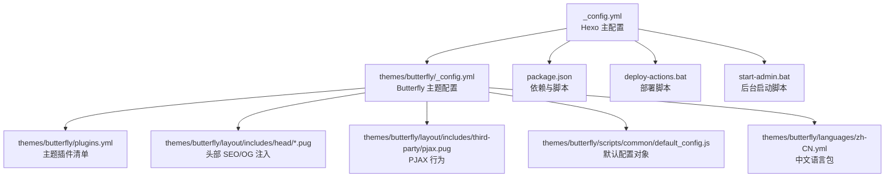
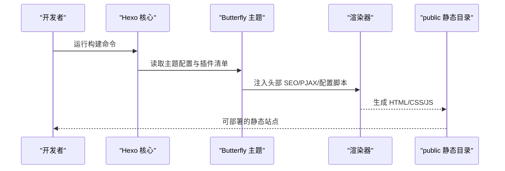
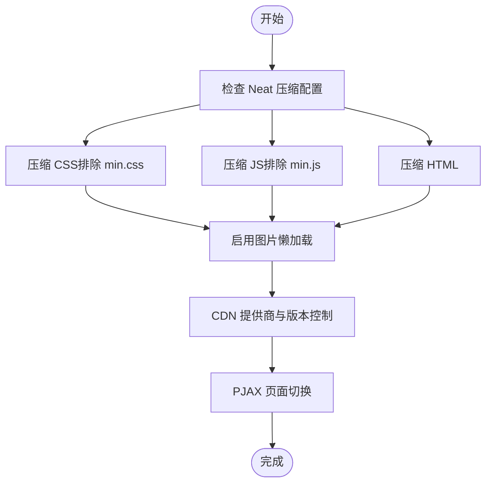
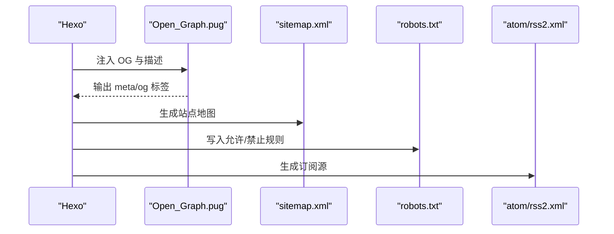
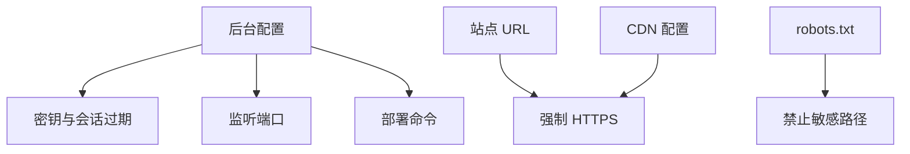
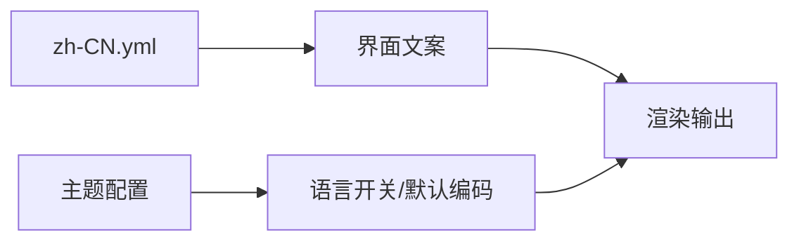
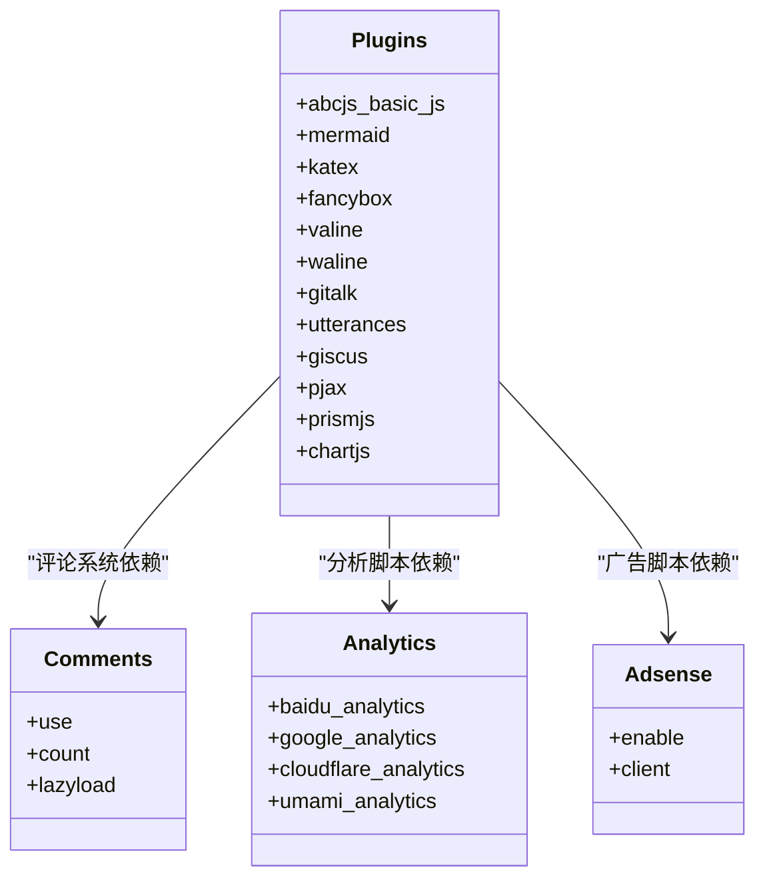
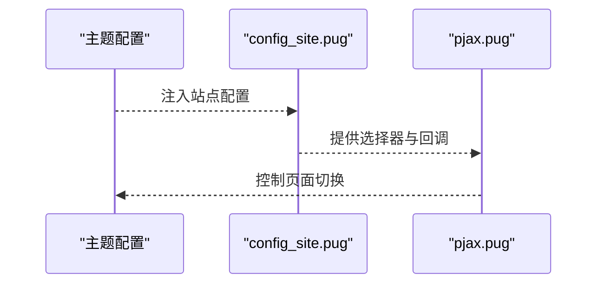
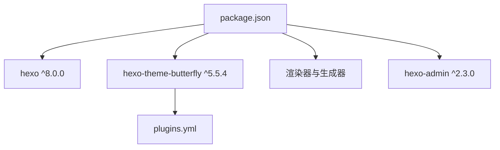

# 高级配置

<cite>
**本文引用的文件**
- [_config.yml](file://_config.yml)
- [_config.butterfly.yml](file://_config.butterfly.yml)
- [themes/butterfly/_config.yml](file://themes/butterfly/_config.yml)
- [themes/butterfly/plugins.yml](file://themes/butterfly/plugins.yml)
- [themes/butterfly/layout/includes/head/Open_Graph.pug](file://themes/butterfly/layout/includes/head/Open_Graph.pug)
- [themes/butterfly/layout/includes/head/config_site.pug](file://themes/butterfly/layout/includes/head/config_site.pug)
- [themes/butterfly/layout/includes/third-party/pjax.pug](file://themes/butterfly/layout/includes/third-party/pjax.pug)
- [themes/butterfly/scripts/common/default_config.js](file://themes/butterfly/scripts/common/default_config.js)
- [themes/butterfly/languages/zh-CN.yml](file://themes/butterfly/languages/zh-CN.yml)
- [package.json](file://package.json)
- [README.md](file://README.md)
- [deploy-actions.bat](file://deploy-actions.bat)
- [start-admin.bat](file://start-admin.bat)
</cite>

## 目录
1. [简介](#简介)
2. [项目结构](#项目结构)
3. [核心组件](#核心组件)
4. [架构总览](#架构总览)
5. [详细组件分析](#详细组件分析)
6. [依赖关系分析](#依赖关系分析)
7. [性能优化配置](#性能优化配置)
8. [SEO 优化配置](#seo-优化配置)
9. [安全配置](#安全配置)
10. [多语言与国际化](#多语言与国际化)
11. [插件与第三方集成](#插件与第三方集成)
12. [配置版本管理与迁移](#配置版本管理与迁移)
13. [调试与故障排除](#调试与故障排除)
14. [企业级部署最佳实践](#企业级部署最佳实践)
15. [结论](#结论)

## 简介
本指南面向需要对 Hexo + Butterfly 博客进行高级配置与企业级运维的读者，覆盖性能优化（压缩、缓存、CDN）、SEO（站点地图、robots.txt、Meta/OG）、安全（密码保护、访问控制、HTTPS）、多语言与国际化、插件与自定义标签、第三方 API 集成、配置版本管理与迁移、调试与监控、以及部署最佳实践。文档基于仓库中的实际配置文件进行分析，并提供可视化图示帮助理解。

## 项目结构
该仓库采用标准 Hexo 结构，主题使用 Butterfly，配置分为 Hexo 主配置与主题配置两层，同时包含构建脚本、部署批处理工具与国际化语言包。

图表来源
- [_config.yml:1-173](file://_config.yml#L1-L173)
- [themes/butterfly/_config.yml:1-1137](file://themes/butterfly/_config.yml#L1-L1137)
- [themes/butterfly/plugins.yml:1-208](file://themes/butterfly/plugins.yml#L1-L208)
- [themes/butterfly/layout/includes/head/Open_Graph.pug:1-17](file://themes/butterfly/layout/includes/head/Open_Graph.pug#L1-L17)
- [themes/butterfly/layout/includes/third-party/pjax.pug:1-73](file://themes/butterfly/layout/includes/third-party/pjax.pug#L1-L73)
- [themes/butterfly/scripts/common/default_config.js:1-602](file://themes/butterfly/scripts/common/default_config.js#L1-L602)
- [themes/butterfly/languages/zh-CN.yml:1-125](file://themes/butterfly/languages/zh-CN.yml#L1-L125)
- [package.json:1-42](file://package.json#L1-L42)
- [deploy-actions.bat:1-133](file://deploy-actions.bat#L1-L133)
- [start-admin.bat:1-48](file://start-admin.bat#L1-L48)

章节来源
- [_config.yml:1-173](file://_config.yml#L1-L173)
- [themes/butterfly/_config.yml:1-1137](file://themes/butterfly/_config.yml#L1-L1137)
- [package.json:1-42](file://package.json#L1-L42)

## 核心组件
- Hexo 主配置：站点元数据、URL、目录、写作、分页、扩展、部署、搜索、Sitemap、Robots、懒加载、Feed、Markdown 渲染、HTML/CSS/JS 压缩等。
- Butterfly 主题配置：导航、菜单、代码块、社交、图像、封面、Meta/OG、搜索、分享、评论、分析、广告、美化、注入、CDN 等。
- 插件清单：定义第三方库版本与文件路径，用于按需加载。
- 头部模板：动态注入 Open Graph、结构化数据、站点配置脚本。
- PJAX 模板：控制页面切换的选择器与回调，提升交互体验。
- 默认配置脚本：主题默认值集合，便于二次开发与覆盖。
- 语言包：多语言文案映射。
- 构建与部署脚本：本地服务、生成、清理、后台管理、自动化部署。

章节来源
- [_config.yml:1-173](file://_config.yml#L1-L173)
- [_config.butterfly.yml:1-690](file://_config.butterfly.yml#L1-L690)
- [themes/butterfly/_config.yml:1-1137](file://themes/butterfly/_config.yml#L1-L1137)
- [themes/butterfly/plugins.yml:1-208](file://themes/butterfly/plugins.yml#L1-L208)
- [themes/butterfly/layout/includes/head/Open_Graph.pug:1-17](file://themes/butterfly/layout/includes/head/Open_Graph.pug#L1-L17)
- [themes/butterfly/layout/includes/head/config_site.pug:1-26](file://themes/butterfly/layout/includes/head/config_site.pug#L1-L26)
- [themes/butterfly/layout/includes/third-party/pjax.pug:1-73](file://themes/butterfly/layout/includes/third-party/pjax.pug#L1-L73)
- [themes/butterfly/scripts/common/default_config.js:1-602](file://themes/butterfly/scripts/common/default_config.js#L1-L602)
- [themes/butterfly/languages/zh-CN.yml:1-125](file://themes/butterfly/languages/zh-CN.yml#L1-L125)

## 架构总览
下图展示了从配置到渲染的关键流程：Hexo 解析主配置与主题配置，渲染器生成静态文件；主题通过 Pug 模板注入 SEO、分析、PJAX 等逻辑；最终输出可部署的静态站点。

图表来源
- [_config.yml:1-173](file://_config.yml#L1-L173)
- [_config.butterfly.yml:1-690](file://_config.butterfly.yml#L1-L690)
- [themes/butterfly/layout/includes/head/Open_Graph.pug:1-17](file://themes/butterfly/layout/includes/head/Open_Graph.pug#L1-L17)
- [themes/butterfly/layout/includes/third-party/pjax.pug:1-73](file://themes/butterfly/layout/includes/third-party/pjax.pug#L1-L73)

## 详细组件分析

### 性能优化配置
- 压缩与体积控制
  - HTML/CSS/JS 压缩：通过 Hexo Neat 控制开关与排除列表，避免对已压缩文件重复处理。
  - 代码块压缩：PrismJS/Hljs 配置影响渲染体积与加载行为。
- 懒加载
  - 图片懒加载：站点级与原生懒加载开关，可减少首屏资源压力。
- 缓存策略
  - CDN：主题提供内部与第三方提供商配置，结合版本号与格式化规则，实现缓存刷新与加速。
- 交互优化
  - PJAX：仅替换关键选择器，减少全页重载；错误时回退至 404 或直接跳转。
  - 预加载与骨架：主题提供预加载与加载动画配置，改善感知性能。

图表来源
- [_config.yml:157-173](file://_config.yml#L157-L173)
- [_config.butterfly.yml:682-690](file://_config.butterfly.yml#L682-L690)
- [themes/butterfly/layout/includes/third-party/pjax.pug:1-73](file://themes/butterfly/layout/includes/third-party/pjax.pug#L1-L73)

章节来源
- [_config.yml:157-173](file://_config.yml#L157-L173)
- [_config.butterfly.yml:682-690](file://_config.butterfly.yml#L682-L690)
- [themes/butterfly/layout/includes/third-party/pjax.pug:1-73](file://themes/butterfly/layout/includes/third-party/pjax.pug#L1-L73)

### SEO 优化配置
- 站点地图与 robots
  - Sitemap：生成路径、相对链接、包含标签与分类。
  - robots.txt：用户代理、允许/禁止路径、指向 sitemap。
- Meta 与 Open Graph
  - Open Graph：根据页面类型与封面动态生成，支持 Facebook 应用 ID/管理员 ID。
  - 结构化数据：可选开启，补充替代名称等字段。
- Feed
  - Atom/RSS：类型、路径、限制、Hub、内容截断与排序。

图表来源
- [_config.yml:110-149](file://_config.yml#L110-L149)
- [themes/butterfly/layout/includes/head/Open_Graph.pug:1-17](file://themes/butterfly/layout/includes/head/Open_Graph.pug#L1-L17)
- [themes/butterfly/_config.yml:661-669](file://themes/butterfly/_config.yml#L661-L669)

章节来源
- [_config.yml:110-149](file://_config.yml#L110-L149)
- [themes/butterfly/layout/includes/head/Open_Graph.pug:1-17](file://themes/butterfly/layout/includes/head/Open_Graph.pug#L1-L17)
- [themes/butterfly/_config.yml:661-669](file://themes/butterfly/_config.yml#L661-L669)

### 安全配置
- 密码保护与后台访问控制
  - 管理后台：用户名、密码哈希、密钥、端口、会话过期。
  - 部署命令：可为空或自定义。
- HTTPS 与静态资源
  - URL 配置：确保生产环境使用 HTTPS。
  - CDN：优先使用 HTTPS 提供商以避免混合内容问题。
- 访问控制
  - robots.txt：禁止爬取敏感目录（如 /admin/、/js/、/css/）。

图表来源
- [_config.yml:94-127](file://_config.yml#L94-L127)
- [_config.butterfly.yml:682-690](file://_config.butterfly.yml#L682-L690)

章节来源
- [_config.yml:94-127](file://_config.yml#L94-L127)
- [_config.butterfly.yml:682-690](file://_config.butterfly.yml#L682-L690)

### 多语言与国际化
- 语言包
  - 中文语言包提供页眉、页脚、搜索、分页、评论、侧边栏、日期后缀等文案。
- 主题语言
  - 主题配置中包含语言相关开关与默认编码，可配合简繁转换。
- 本地化定制
  - 在语言包中新增或覆盖键值，实现多语言文案定制。

图表来源
- [themes/butterfly/languages/zh-CN.yml:1-125](file://themes/butterfly/languages/zh-CN.yml#L1-L125)
- [_config.butterfly.yml:229-236](file://_config.butterfly.yml#L229-L236)

章节来源
- [themes/butterfly/languages/zh-CN.yml:1-125](file://themes/butterfly/languages/zh-CN.yml#L1-L125)
- [_config.butterfly.yml:229-236](file://_config.butterfly.yml#L229-L236)

### 插件与第三方集成
- 插件清单
  - 包含 PrismJS、Mermaid、KaTeX、Fancybox、Chat 服务、评论系统等第三方库及其版本与文件路径。
- 评论系统
  - 支持多种评论系统（Disqus、Gitalk、Waline、Utterances、Giscus 等），可按需启用与配置。
- 分析与广告
  - 支持百度统计、Google Analytics、Cloudflare Clarity、Umami 等分析；可配置 Google AdSense。
- 注入与 CDN
  - 支持在头部与底部注入自定义 CSS/JS；CDN 提供商与版本控制。

图表来源
- [themes/butterfly/plugins.yml:1-208](file://themes/butterfly/plugins.yml#L1-L208)
- [_config.butterfly.yml:336-418](file://_config.butterfly.yml#L336-L418)

章节来源
- [themes/butterfly/plugins.yml:1-208](file://themes/butterfly/plugins.yml#L1-L208)
- [_config.butterfly.yml:336-418](file://_config.butterfly.yml#L336-L418)

### 自定义标签与主题配置
- 主题默认配置对象
  - 提供导航、菜单、代码块、社交、图像、封面、Meta/OG、搜索、分享、评论、分析、广告、美化、注入、CDN 等默认值，便于二次开发覆盖。
- 头部配置脚本
  - 将主题配置与页面类型注入前端全局变量，供脚本使用。
- PJAX 行为
  - 根据评论系统与 OG 开启情况动态调整选择器，保证切换时的正确性。

图表来源
- [themes/butterfly/scripts/common/default_config.js:1-602](file://themes/butterfly/scripts/common/default_config.js#L1-L602)
- [themes/butterfly/layout/includes/head/config_site.pug:1-26](file://themes/butterfly/layout/includes/head/config_site.pug#L1-L26)
- [themes/butterfly/layout/includes/third-party/pjax.pug:1-73](file://themes/butterfly/layout/includes/third-party/pjax.pug#L1-L73)

章节来源
- [themes/butterfly/scripts/common/default_config.js:1-602](file://themes/butterfly/scripts/common/default_config.js#L1-L602)
- [themes/butterfly/layout/includes/head/config_site.pug:1-26](file://themes/butterfly/layout/includes/head/config_site.pug#L1-L26)
- [themes/butterfly/layout/includes/third-party/pjax.pug:1-73](file://themes/butterfly/layout/includes/third-party/pjax.pug#L1-L73)

## 依赖关系分析
- Hexo 版本与 Node 版本要求
  - Hexo 版本与 Node 引擎版本在 package.json 中明确。
- 主题与渲染器
  - 主题依赖渲染器（EJS、Pug、Stylus）与生成器（索引、分类、标签、Sitemap、Feed、搜索数据库等）。
- 插件与第三方库
  - 通过 plugins.yml 统一管理版本，避免冲突。

图表来源
- [package.json:1-42](file://package.json#L1-L42)
- [themes/butterfly/plugins.yml:1-208](file://themes/butterfly/plugins.yml#L1-L208)

章节来源
- [package.json:1-42](file://package.json#L1-L42)
- [themes/butterfly/plugins.yml:1-208](file://themes/butterfly/plugins.yml#L1-L208)

## 性能优化配置
- 压缩策略
  - HTML/CSS/JS 压缩：在 Hexo 主配置中开启，并排除已压缩文件。
  - 代码高亮：PrismJS/Hljs 配置影响渲染体积与加载行为。
- 懒加载
  - 图片懒加载：站点级与原生懒加载开关，减少首屏资源压力。
- CDN 与缓存
  - 主题 CDN 配置支持内部与第三方提供商，结合版本号与格式化规则，实现缓存刷新与加速。
- 交互优化
  - PJAX：仅替换关键选择器，减少全页重载；错误时回退至 404 或直接跳转。
- 预加载与骨架
  - 主题提供预加载与加载动画配置，改善感知性能。

章节来源
- [_config.yml:157-173](file://_config.yml#L157-L173)
- [_config.butterfly.yml:682-690](file://_config.butterfly.yml#L682-L690)
- [themes/butterfly/layout/includes/third-party/pjax.pug:1-73](file://themes/butterfly/layout/includes/third-party/pjax.pug#L1-L73)

## SEO 优化配置
- 站点地图与 robots
  - Sitemap：生成路径、相对链接、包含标签与分类。
  - robots.txt：用户代理、允许/禁止路径、指向 sitemap。
- Meta 与 Open Graph
  - Open Graph：根据页面类型与封面动态生成，支持 Facebook 应用 ID/管理员 ID。
  - 结构化数据：可选开启，补充替代名称等字段。
- Feed
  - Atom/RSS：类型、路径、限制、Hub、内容截断与排序。

章节来源
- [_config.yml:110-149](file://_config.yml#L110-L149)
- [themes/butterfly/layout/includes/head/Open_Graph.pug:1-17](file://themes/butterfly/layout/includes/head/Open_Graph.pug#L1-L17)
- [themes/butterfly/_config.yml:661-669](file://themes/butterfly/_config.yml#L661-L669)

## 安全配置
- 密码保护与后台访问控制
  - 管理后台：用户名、密码哈希、密钥、端口、会话过期。
  - 部署命令：可为空或自定义。
- HTTPS 与静态资源
  - URL 配置：确保生产环境使用 HTTPS。
  - CDN：优先使用 HTTPS 提供商以避免混合内容问题。
- 访问控制
  - robots.txt：禁止爬取敏感目录（如 /admin/、/js/、/css/）。

章节来源
- [_config.yml:94-127](file://_config.yml#L94-L127)
- [_config.butterfly.yml:682-690](file://_config.butterfly.yml#L682-L690)

## 多语言与国际化
- 语言包
  - 中文语言包提供页眉、页脚、搜索、分页、评论、侧边栏、日期后缀等文案。
- 主题语言
  - 主题配置中包含语言相关开关与默认编码，可配合简繁转换。
- 本地化定制
  - 在语言包中新增或覆盖键值，实现多语言文案定制。

章节来源
- [themes/butterfly/languages/zh-CN.yml:1-125](file://themes/butterfly/languages/zh-CN.yml#L1-L125)
- [_config.butterfly.yml:229-236](file://_config.butterfly.yml#L229-L236)

## 插件与第三方集成
- 插件清单
  - 包含 PrismJS、Mermaid、KaTeX、Fancybox、Chat 服务、评论系统等第三方库及其版本与文件路径。
- 评论系统
  - 支持多种评论系统（Disqus、Gitalk、Waline、Utterances、Giscus 等），可按需启用与配置。
- 分析与广告
  - 支持百度统计、Google Analytics、Cloudflare Clarity、Umami 等分析；可配置 Google AdSense。
- 注入与 CDN
  - 支持在头部与底部注入自定义 CSS/JS；CDN 提供商与版本控制。

章节来源
- [themes/butterfly/plugins.yml:1-208](file://themes/butterfly/plugins.yml#L1-L208)
- [_config.butterfly.yml:336-418](file://_config.butterfly.yml#L336-L418)

## 配置版本管理与迁移
- 版本管理
  - 使用 Git 管理配置文件变更，建议将配置文件纳入版本控制。
- 备份策略
  - 定期导出主题配置与 Hexo 主配置，保存到安全位置。
- 迁移方案
  - 新环境安装依赖后，复制配置文件并运行构建脚本；如需迁移评论系统，记录各平台的配置参数以便重新配置。

章节来源
- [deploy-actions.bat:1-133](file://deploy-actions.bat#L1-L133)
- [start-admin.bat:1-48](file://start-admin.bat#L1-L48)

## 调试与故障排除
- 构建与调试
  - 使用开发脚本启动调试模式，观察日志与错误。
- 本地服务
  - 后台管理服务启动后访问管理端口，检查配置是否生效。
- 部署脚本
  - 使用批处理脚本一键执行清理、生成与启动本地服务，便于快速验证。

章节来源
- [package.json:6-12](file://package.json#L6-L12)
- [start-admin.bat:1-48](file://start-admin.bat#L1-L48)
- [deploy-actions.bat:1-133](file://deploy-actions.bat#L1-L133)

## 企业级部署最佳实践
- 环境要求
  - 明确 Node 与 Hexo 版本要求，确保 CI/CD 环境一致。
- 自动化部署
  - 使用 GitHub Actions 或其他 CI 平台触发构建与部署，避免手动推送。
- 安全加固
  - 生产环境使用 HTTPS；严格控制 robots.txt；隐藏敏感目录。
- 性能监控
  - 集成分析工具（如 Google Analytics、Umami），定期评估性能指标。
- 备份与回滚
  - 对配置与构建产物进行备份，建立回滚机制。

章节来源
- [package.json:38-41](file://package.json#L38-L41)
- [_config.yml:14-14](file://_config.yml#L14-L14)
- [_config.yml:94-127](file://_config.yml#L94-L127)

## 结论
通过合理配置 Hexo 与 Butterfly 的各项能力，可以在性能、SEO、安全、国际化、插件生态与企业级部署方面达到较高水准。建议在团队内形成规范的配置管理流程，结合自动化工具与监控体系，持续优化用户体验与维护效率。