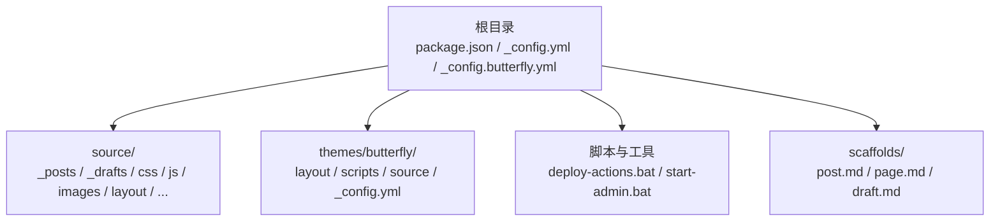
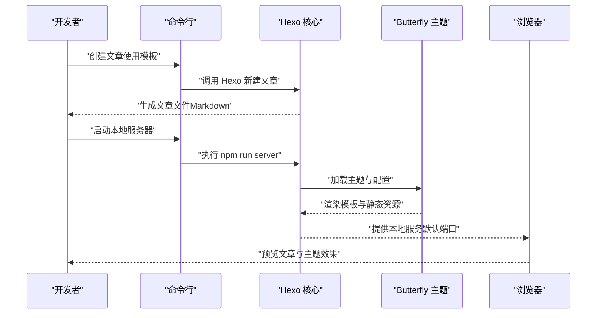
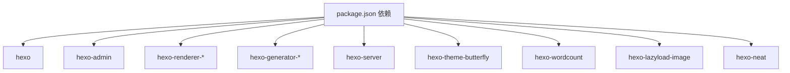

# 快速开始

<cite>
**本文引用的文件**
- [package.json](file://package.json)
- [_config.yml](file://_config.yml)
- [_config.butterfly.yml](file://_config.butterfly.yml)
- [README.md](file://README.md)
- [deploy-actions.bat](file://deploy-actions.bat)
- [start-admin.bat](file://start-admin.bat)
- [scaffolds/post.md](file://scaffolds/post.md)
- [source/_posts/hello-world.md](file://source/_posts/hello-world.md)
- [source/_posts/test-latex.md](file://source/_posts/test-latex.md)
- [source/css/custom.css](file://source/css/custom.css)
- [source/js/main.js](file://source/js/main.js)
- [themes/butterfly/package.json](file://themes/butterfly/package.json)
- [themes/butterfly/_config.yml](file://themes/butterfly/_config.yml)
- [themes/butterfly/source/js/main.js](file://themes/butterfly/source/js/main.js)
</cite>

## 目录
1. [简介](#简介)
2. [项目结构](#项目结构)
3. [核心组件](#核心组件)
4. [架构总览](#架构总览)
5. [详细组件分析](#详细组件分析)
6. [依赖分析](#依赖分析)
7. [性能考虑](#性能考虑)
8. [故障排除指南](#故障排除指南)
9. [结论](#结论)
10. [附录](#附录)

## 简介
本指南面向首次使用该 Hexo + Butterfly 博客系统的用户，帮助你在最短时间内完成环境准备、安装依赖、本地启动、基础配置与发布流程。你将学会如何：
- 安装与准备运行环境
- 安装项目依赖
- 启动本地服务进行预览
- 创建并发布第一篇文章
- 使用常用开发命令（构建、清理、启动）
- 通过批处理工具一键部署到 GitHub Pages（可选）

## 项目结构
该博客基于 Hexo 生成器，使用 Butterfly 主题，并通过 npm scripts 提供统一的开发命令。项目的关键目录与文件如下：
- 根目录：包含 Hexo 主配置、主题配置、脚本与部署工具
- source：源内容与静态资源（文章、页面、样式、脚本、图片等）
- scaffolds：文章草稿模板
- themes/butterfly：主题源码与配置
- deploy-actions.bat / start-admin.bat：Windows 批处理工具，辅助本地预览与一键部署

图示来源
- [package.json](file://package.json)
- [_config.yml](file://_config.yml)
- [_config.butterfly.yml](file://_config.butterfly.yml)
- [deploy-actions.bat](file://deploy-actions.bat)
- [start-admin.bat](file://start-admin.bat)
- [scaffolds/post.md](file://scaffolds/post.md)

章节来源
- [README.md](file://README.md)
- [package.json](file://package.json)
- [_config.yml](file://_config.yml)
- [_config.butterfly.yml](file://_config.butterfly.yml)

## 核心组件
- Hexo 核心与主题
  - Hexo 版本与核心插件由根目录 package.json 管理
  - 主题为 Butterfly，其配置位于 themes/butterfly/_config.yml
- 开发脚本
  - npm run server：启动本地开发服务器
  - npm run build：生成静态站点
  - npm run clean：清理缓存与生成目录
  - npm run dev / npm run admin：调试模式与后台管理启动（见各脚本定义）
- 配置中心
  - _config.yml：站点与 Hexo 行为配置（主题、URL、分页、SEO、部署等）
  - _config.butterfly.yml：主题个性化配置（导航、深色模式、侧边栏、搜索、图片懒加载等）
- 内容与资源
  - source/_posts：文章内容（Markdown）
  - source/_drafts：草稿
  - source/css / source/js：自定义样式与脚本
  - scaffolds/post.md：文章模板

章节来源
- [package.json](file://package.json)
- [_config.yml](file://_config.yml)
- [_config.butterfly.yml](file://_config.butterfly.yml)
- [themes/butterfly/_config.yml](file://themes/butterfly/_config.yml)

## 架构总览
下面的序列图展示了“创建第一篇文章并预览”的端到端流程。

图示来源
- [scaffolds/post.md](file://scaffolds/post.md)
- [source/_posts/hello-world.md](file://source/_posts/hello-world.md)
- [package.json](file://package.json)
- [_config.yml](file://_config.yml)
- [_config.butterfly.yml](file://_config.butterfly.yml)

## 详细组件分析

### 环境要求与安装
- Node.js 版本要求：引擎版本 >= 18.0.0
- 安装依赖：在项目根目录执行安装命令
- 启动本地服务：执行 npm run server
- 构建静态站点：执行 npm run build
- 清理缓存：执行 npm run clean

章节来源
- [package.json](file://package.json)
- [README.md](file://README.md)

### 常用开发命令详解
- npm run server
  - 启动 Hexo 本地开发服务器，默认监听端口（可在配置中调整）
  - 适合本地预览与开发
- npm run build
  - 生成静态站点文件至 public 目录
  - 通常与部署流程配合使用
- npm run clean
  - 清理缓存与生成目录，解决缓存导致的渲染异常
- npm run dev / npm run admin
  - 调试模式与后台管理启动（见脚本定义）

章节来源
- [package.json](file://package.json)

### 第一次使用全流程（从创建到预览）
- 步骤一：创建文章
  - 使用文章模板 scaffold 生成新文章
  - 模板字段包含标题、日期、标签等
- 步骤二：编辑内容
  - 在 source/_posts 下编辑 Markdown 文档
  - 可参考示例文章以了解格式与特性
- 步骤三：本地预览
  - 执行 npm run server 启动本地服务
  - 在浏览器访问默认地址进行预览
- 步骤四：构建与发布（可选）
  - 执行 npm run build 生成静态文件
  - 可结合批处理工具一键部署到 GitHub Pages

章节来源
- [scaffolds/post.md](file://scaffolds/post.md)
- [source/_posts/hello-world.md](file://source/_posts/hello-world.md)
- [source/_posts/test-latex.md](file://source/_posts/test-latex.md)
- [package.json](file://package.json)

### 配置与个性化
- 站点配置（_config.yml）
  - 站点名称、副标题、关键词、作者、语言与时区
  - URL、永久链接、Pretty URL、目录结构
  - 写作相关：新文章命名、默认布局、草稿渲染、资源文件夹等
  - 主题、分页、元数据、日期时间格式、SEO、Feed、Sitemap、Robots、懒加载、压缩等
- 主题配置（_config.butterfly.yml）
  - 导航栏、菜单、头像、封面、图标、深色模式开关
  - 侧边栏卡片（作者、公告、最近文章、分类、标签、归档、站点信息）
  - 文章页设置（目录、版权、打赏、相关文章、分页、过期提醒）
  - 搜索（本地搜索）、分享、评论系统（多种可选）、聊天服务
  - 图片懒加载、PWA、Open Graph、结构化数据、注入 CSS/JS、CDN 等

章节来源
- [_config.yml](file://_config.yml)
- [_config.butterfly.yml](file://_config.butterfly.yml)
- [themes/butterfly/_config.yml](file://themes/butterfly/_config.yml)

### 自定义样式与脚本
- 自定义样式
  - 可在 source/css/modern.css 与 source/css/custom.css 中添加或覆盖样式
  - 支持 CSS 变量与深色模式切换
- 前端脚本
  - source/js/main.js：导航、滚动效果、深色模式、回到顶部、搜索、目录、懒加载、图片灯箱、动画等
  - 主题脚本 themes/butterfly/source/js/main.js：与主题交互的补充逻辑

章节来源
- [source/css/custom.css](file://source/css/custom.css)
- [source/js/main.js](file://source/js/main.js)
- [themes/butterfly/source/js/main.js](file://themes/butterfly/source/js/main.js)

### 部署与发布（GitHub Pages）
- 批处理工具
  - deploy-actions.bat：提供菜单式部署流程（检查 Git、提交、推送、触发 Actions）
  - start-admin.bat：清理缓存、生成、启动本地服务并打开后台管理页面
- 部署要点
  - 确保仓库已初始化且存在远程分支
  - 推送后由 GitHub Actions 自动构建并发布到 gh-pages 分支
  - 若需要手动构建，先执行 npm run build，再上传 public 目录内容

章节来源
- [deploy-actions.bat](file://deploy-actions.bat)
- [start-admin.bat](file://start-admin.bat)
- [_config.yml](file://_config.yml)

## 依赖分析
- 核心依赖
  - hexo：静态站点生成器
  - hexo-admin：后台管理界面
  - hexo-renderer-*：渲染器（EJS、Marked、Pug、Stylus）
  - hexo-generator-*：生成器（索引、归档、分类、标签、Feed、Sitemap、搜索数据库等）
  - hexo-server：本地服务器
  - hexo-theme-butterfly：主题
  - hexo-wordcount、hexo-lazyload-image、hexo-neat：增强功能（字数统计、懒加载、压缩）
- Node.js 版本约束
  - engines.node >= 18.0.0

图示来源
- [package.json](file://package.json)
- [themes/butterfly/package.json](file://themes/butterfly/package.json)

章节来源
- [package.json](file://package.json)
- [themes/butterfly/package.json](file://themes/butterfly/package.json)

## 性能考虑
- 图片懒加载：开启后减少首屏加载压力
- 静态资源压缩：Neat 插件对 HTML/CSS/JS 进行压缩
- 代码高亮与全屏：按需启用，避免不必要的 DOM 与脚本开销
- 深色模式与主题切换：使用 CSS 变量，降低重绘成本
- 目录与搜索：本地搜索建议预加载，提升交互体验

章节来源
- [_config.yml](file://_config.yml)
- [_config.butterfly.yml](file://_config.butterfly.yml)
- [source/js/main.js](file://source/js/main.js)

## 故障排除指南
- 无法启动本地服务
  - 检查 Node.js 版本是否满足要求（>= 18.0.0）
  - 清理缓存后重试：执行 npm run clean
  - 确认端口未被占用（默认 4000），必要时在配置中修改
- 文章未显示或样式异常
  - 确认文章位于 source/_posts，文件名与 Front Matter 正确
  - 检查主题配置中的渲染与懒加载设置
- 部署失败
  - 使用 deploy-actions.bat 检查 Git 状态与推送权限
  - 确认远程仓库与分支正确，推送后等待 Actions 构建完成
- 后台管理无法访问
  - 使用 start-admin.bat 启动，确认端口与凭据（用户名/密码）正确

章节来源
- [package.json](file://package.json)
- [_config.yml](file://_config.yml)
- [_config.butterfly.yml](file://_config.butterfly.yml)
- [deploy-actions.bat](file://deploy-actions.bat)
- [start-admin.bat](file://start-admin.bat)

## 结论
通过本快速开始指南，你已经完成了环境准备、依赖安装、本地启动与基础配置，并掌握了常用开发命令与部署流程。建议在实际使用中逐步完善主题配置与自定义样式，持续优化性能与用户体验。

## 附录
- 快速命令清单
  - 安装依赖：npm install
  - 启动本地服务：npm run server
  - 生成静态文件：npm run build
  - 清理缓存：npm run clean
  - 调试模式：npm run dev
  - 后台管理：npm run admin
- 参考文件
  - README.md：项目概览与使用说明
  - _config.yml：站点配置
  - _config.butterfly.yml：主题配置
  - scaffolds/post.md：文章模板
  - source/_posts：示例文章

章节来源
- [README.md](file://README.md)
- [package.json](file://package.json)
- [_config.yml](file://_config.yml)
- [_config.butterfly.yml](file://_config.butterfly.yml)
- [scaffolds/post.md](file://scaffolds/post.md)
- [source/_posts/hello-world.md](file://source/_posts/hello-world.md)
- [source/_posts/test-latex.md](file://source/_posts/test-latex.md)