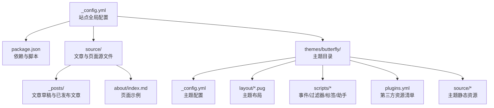
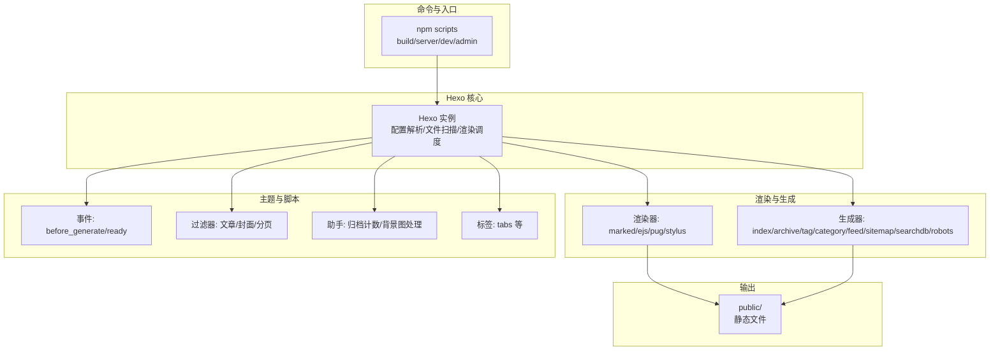
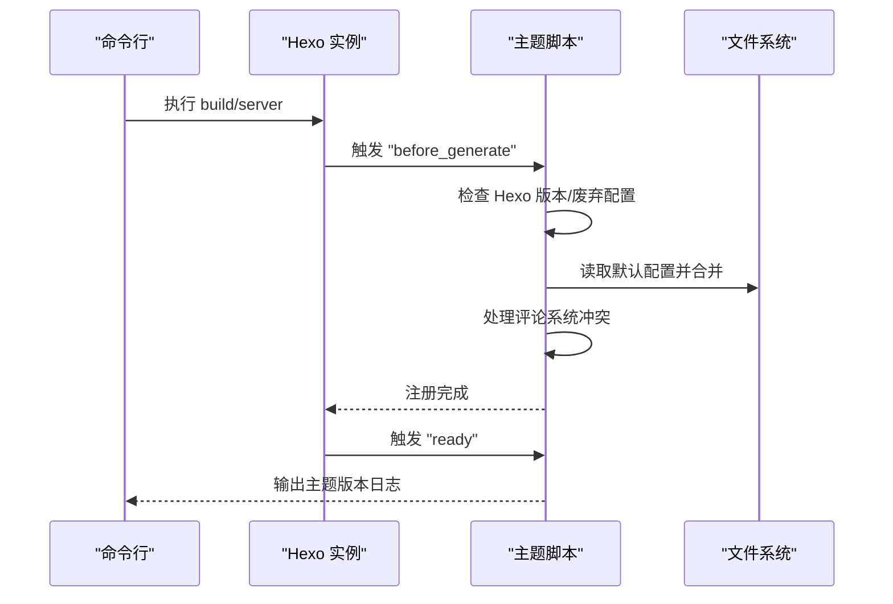
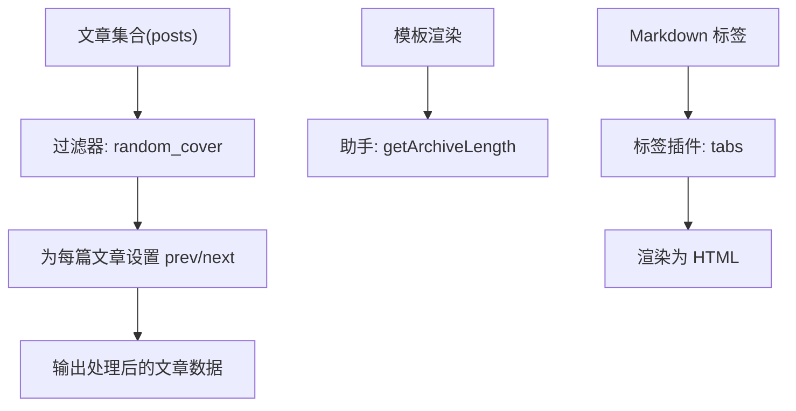
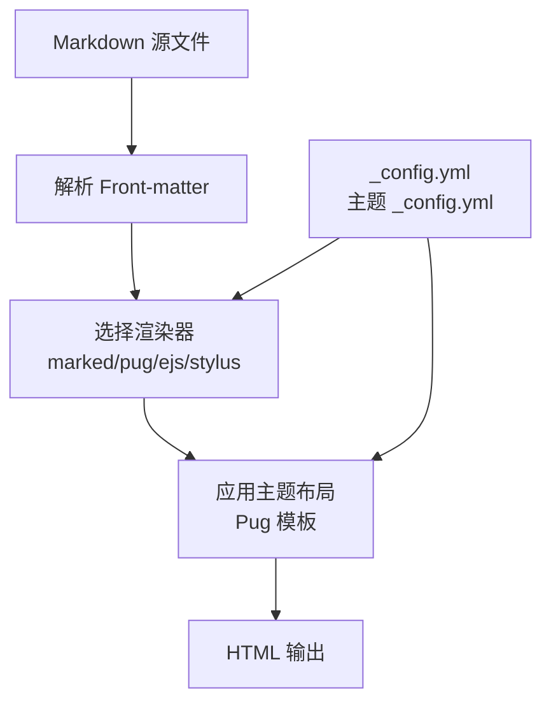
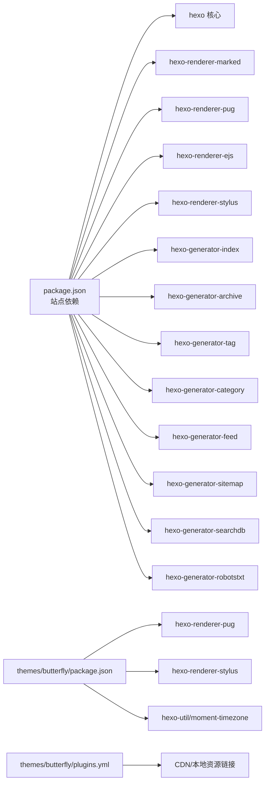

# Hexo 核心架构

<cite>
**本文引用的文件**
- [_config.yml](file://_config.yml)
- [package.json](file://package.json)
- [themes/butterfly/_config.yml](file://themes/butterfly/_config.yml)
- [themes/butterfly/package.json](file://themes/butterfly/package.json)
- [themes/butterfly/plugins.yml](file://themes/butterfly/plugins.yml)
- [themes/butterfly/scripts/events/init.js](file://themes/butterfly/scripts/events/init.js)
- [themes/butterfly/scripts/events/welcome.js](file://themes/butterfly/scripts/events/welcome.js)
- [themes/butterfly/scripts/helpers/getArchiveLength.js](file://themes/butterfly/scripts/helpers/getArchiveLength.js)
- [themes/butterfly/scripts/tag/tabs.js](file://themes/butterfly/scripts/tag/tabs.js)
- [themes/butterfly/scripts/filters/random_cover.js](file://themes/butterfly/scripts/filters/random_cover.js)
- [themes/butterfly/layout/index.pug](file://themes/butterfly/layout/index.pug)
- [themes/butterfly/layout/includes/loading/fullpage-loading.pug](file://themes/butterfly/layout/includes/loading/fullpage-loading.pug)
- [source/_posts/hello-world.md](file://source/_posts/hello-world.md)
- [source/about/index.md](file://source/about/index.md)
</cite>

## 目录
1. [引言](#引言)
2. [项目结构](#项目结构)
3. [核心组件](#核心组件)
4. [架构总览](#架构总览)
5. [详细组件分析](#详细组件分析)
6. [依赖关系分析](#依赖关系分析)
7. [性能考量](#性能考量)
8. [故障排查指南](#故障排查指南)
9. [结论](#结论)
10. [附录](#附录)

## 引言
本文件面向对 Hexo 静态站点生成器感兴趣的技术读者与主题开发者，系统性梳理 Hexo 在本仓库中的实际运行方式与架构要点。重点覆盖以下方面：
- 初始化流程与环境检查
- 插件系统与事件驱动机制（主题脚本如何注册事件与过滤器）
- 内容渲染管道（Markdown 到 HTML 的完整链路）
- 目录结构约定、Front-matter 解析与内容组织
- 核心模块职责分工（hexo-core、hexo-renderer-*、hexo-generator-*）
- 配置文件解析、插件加载顺序与生命周期管理

## 项目结构
本仓库采用典型的 Hexo 项目布局：根目录包含站点配置、源内容与主题；主题位于 themes/butterfly 下，提供布局、样式、脚本与资源。

图表来源
- [_config.yml:1-173](file://_config.yml#L1-L173)
- [package.json:1-42](file://package.json#L1-L42)
- [themes/butterfly/_config.yml:1-1137](file://themes/butterfly/_config.yml#L1-L1137)
- [themes/butterfly/plugins.yml:1-208](file://themes/butterfly/plugins.yml#L1-L208)

章节来源
- [_config.yml:1-173](file://_config.yml#L1-L173)
- [package.json:1-42](file://package.json#L1-L42)

## 核心组件
- 站点配置与脚本
  - 站点级配置文件负责站点元信息、URL 规则、目录约定、分页、扩展等。
  - package.json 定义构建脚本与依赖，明确 hexo 版本与各类渲染器、生成器、主题与插件。
- 主题与主题配置
  - themes/butterfly 提供 Pug 布局、Stylus 样式、EJS 渲染器支持与丰富的脚本扩展。
  - 主题配置文件集中管理导航、代码块、评论、统计、广告等主题特性。
- 主题脚本体系
  - 事件：在 Hexo 生命周期节点执行（如 before_generate）。
  - 过滤器：修改数据流（如随机封面、文章前后文链接）。
  - 助手函数：模板中可调用的工具方法（如归档计数）。
  - 标签插件：在 Markdown 中使用自定义语法（如 tabs）。

章节来源
- [_config.yml:1-173](file://_config.yml#L1-L173)
- [package.json:1-42](file://package.json#L1-L42)
- [themes/butterfly/_config.yml:1-1137](file://themes/butterfly/_config.yml#L1-L1137)
- [themes/butterfly/package.json:1-35](file://themes/butterfly/package.json#L1-L35)

## 架构总览
下图展示从命令行到最终生成的典型路径，以及主题脚本如何参与生命周期：

图表来源
- [package.json:6-12](file://package.json#L6-L12)
- [themes/butterfly/scripts/events/init.js:79-86](file://themes/butterfly/scripts/events/init.js#L79-L86)
- [themes/butterfly/scripts/events/welcome.js:1-13](file://themes/butterfly/scripts/events/welcome.js#L1-L13)
- [themes/butterfly/scripts/filters/random_cover.js:75-90](file://themes/butterfly/scripts/filters/random_cover.js#L75-L90)
- [themes/butterfly/scripts/helpers/getArchiveLength.js:1-47](file://themes/butterfly/scripts/helpers/getArchiveLength.js#L1-L47)
- [themes/butterfly/scripts/tag/tabs.js:1-41](file://themes/butterfly/scripts/tag/tabs.js#L1-L41)

## 详细组件分析

### 初始化流程与环境检查
- 主题在 before_generate 阶段进行环境校验与默认配置合并，并处理评论系统的冲突。
- 同时在 ready 事件中打印主题版本信息，便于调试与确认加载成功。

图表来源
- [themes/butterfly/scripts/events/init.js:10-32](file://themes/butterfly/scripts/events/init.js#L10-L32)
- [themes/butterfly/scripts/events/init.js:37-45](file://themes/butterfly/scripts/events/init.js#L37-L45)
- [themes/butterfly/scripts/events/init.js:47-77](file://themes/butterfly/scripts/events/init.js#L47-L77)
- [themes/butterfly/scripts/events/init.js:79-86](file://themes/butterfly/scripts/events/init.js#L79-L86)
- [themes/butterfly/scripts/events/welcome.js:1-13](file://themes/butterfly/scripts/events/welcome.js#L1-L13)

章节来源
- [themes/butterfly/scripts/events/init.js:1-87](file://themes/butterfly/scripts/events/init.js#L1-L87)
- [themes/butterfly/scripts/events/welcome.js:1-13](file://themes/butterfly/scripts/events/welcome.js#L1-L13)

### 插件系统与事件驱动机制
- 事件注册：主题通过 hexo.extend.filter.register 在 before_generate 注册检查与配置合并逻辑。
- 过滤器：对文章集合进行处理（如随机封面），并为每篇文章注入 prev/next 关联。
- 助手函数：提供归档计数等模板辅助能力。
- 标签插件：在 Markdown 中以自定义语法渲染复杂 UI（如 tabs）。

图表来源
- [themes/butterfly/scripts/filters/random_cover.js:75-90](file://themes/butterfly/scripts/filters/random_cover.js#L75-L90)
- [themes/butterfly/scripts/helpers/getArchiveLength.js:1-47](file://themes/butterfly/scripts/helpers/getArchiveLength.js#L1-L47)
- [themes/butterfly/scripts/tag/tabs.js:9-41](file://themes/butterfly/scripts/tag/tabs.js#L9-L41)

章节来源
- [themes/butterfly/scripts/filters/random_cover.js:1-90](file://themes/butterfly/scripts/filters/random_cover.js#L1-L90)
- [themes/butterfly/scripts/helpers/getArchiveLength.js:1-47](file://themes/butterfly/scripts/helpers/getArchiveLength.js#L1-L47)
- [themes/butterfly/scripts/tag/tabs.js:1-41](file://themes/butterfly/scripts/tag/tabs.js#L1-L41)

### 内容渲染管道：从 Markdown 到 HTML
- Front-matter 解析：站点与主题配置均包含对 Front-matter 的处理与依赖（例如 marked 配置）。
- 渲染器选择：根据文件后缀与主题配置选择渲染器（如 marked、pug、stylus、ejs）。
- 布局与模板：主题布局文件（Pug）组合片段与组件，最终输出 HTML。
- 生成器：按站点配置生成首页、归档、分类、标签、RSS/Sitemap 等静态页面。

图表来源
- [source/_posts/hello-world.md:1-39](file://source/_posts/hello-world.md#L1-L39)
- [themes/butterfly/layout/index.pug:1-5](file://themes/butterfly/layout/index.pug#L1-L5)
- [themes/butterfly/layout/includes/loading/fullpage-loading.pug:1-42](file://themes/butterfly/layout/includes/loading/fullpage-loading.pug#L1-L42)
- [_config.yml:152-156](file://_config.yml#L152-L156)
- [themes/butterfly/_config.yml:450-470](file://themes/butterfly/_config.yml#L450-L470)

章节来源
- [source/_posts/hello-world.md:1-39](file://source/_posts/hello-world.md#L1-L39)
- [themes/butterfly/layout/index.pug:1-5](file://themes/butterfly/layout/index.pug#L1-L5)
- [themes/butterfly/layout/includes/loading/fullpage-loading.pug:1-42](file://themes/butterfly/layout/includes/loading/fullpage-loading.pug#L1-L42)
- [_config.yml:152-156](file://_config.yml#L152-L156)
- [themes/butterfly/_config.yml:450-470](file://themes/butterfly/_config.yml#L450-L470)

### 目录结构约定、Front-matter 解析与内容组织
- 目录约定：source_dir/public_dir/archive_dir/tag_dir/category_dir 等由站点配置统一管理。
- Front-matter：文章与页面通过 YAML Front-matter 提供标题、日期、布局、类型等元数据。
- 内容组织：文章位于 source/_posts，页面位于 source 下任意子目录；主题通过过滤器与助手函数对内容进行二次加工与关联。

章节来源
- [_config.yml:21-30](file://_config.yml#L21-L30)
- [source/_posts/hello-world.md:1-39](file://source/_posts/hello-world.md#L1-L39)
- [source/about/index.md:1-49](file://source/about/index.md#L1-L49)

### 核心模块职责分工
- hexo 核心：实例化、配置解析、文件扫描、事件调度与生成控制。
- hexo-renderer-*：负责将不同格式内容渲染为 HTML（如 hexo-renderer-marked、hexo-renderer-pug、hexo-renderer-ejs、hexo-renderer-stylus）。
- hexo-generator-*：基于站点数据生成静态页面（如 hexo-generator-index、hexo-generator-archive、hexo-generator-tag、hexo-generator-category、hexo-generator-feed、hexo-generator-sitemap、hexo-generator-searchdb、hexo-generator-robotstxt）。
- 主题与插件：通过事件、过滤器、助手与标签扩展 Hexo 的行为与输出。

章节来源
- [package.json:16-36](file://package.json#L16-L36)
- [themes/butterfly/package.json:25-30](file://themes/butterfly/package.json#L25-L30)

### 配置文件解析、插件加载顺序与生命周期管理
- 配置解析：站点配置与主题配置分别在 Hexo 初始化阶段被读取与合并。
- 插件加载：package.json 中声明的渲染器与生成器在 Hexo 启动时自动加载。
- 生命周期：主题在 before_generate 阶段执行环境检查与配置合并，在 ready 阶段输出欢迎信息；过滤器在生成阶段对数据进行处理。

章节来源
- [themes/butterfly/scripts/events/init.js:79-86](file://themes/butterfly/scripts/events/init.js#L79-L86)
- [themes/butterfly/scripts/events/welcome.js:1-13](file://themes/butterfly/scripts/events/welcome.js#L1-L13)
- [themes/butterfly/scripts/filters/random_cover.js:75-90](file://themes/butterfly/scripts/filters/random_cover.js#L75-L90)

## 依赖关系分析
- 站点层依赖：package.json 声明了 Hexo 版本、渲染器、生成器、主题与插件。
- 主题层依赖：主题自身 package.json 声明了渲染器与工具库，plugins.yml 提供第三方资源清单。
- 运行时依赖：渲染器与生成器在 Hexo 启动时被加载，主题脚本在生命周期钩子中注册。

图表来源
- [package.json:16-36](file://package.json#L16-L36)
- [themes/butterfly/package.json:25-30](file://themes/butterfly/package.json#L25-L30)
- [themes/butterfly/plugins.yml:1-208](file://themes/butterfly/plugins.yml#L1-L208)

章节来源
- [package.json:1-42](file://package.json#L1-L42)
- [themes/butterfly/package.json:1-35](file://themes/butterfly/package.json#L1-L35)
- [themes/butterfly/plugins.yml:1-208](file://themes/butterfly/plugins.yml#L1-L208)

## 性能考量
- 渲染器选择：根据内容类型与主题需求选择合适的渲染器，避免不必要的转换。
- 过滤器与助手：尽量减少在生成阶段的重复计算，利用缓存策略（如 fragment_cache）降低开销。
- 资源优化：通过 hexo-neat 对 HTML/CSS/JS 进行压缩与去重，合理配置排除规则。
- 分页与索引：合理设置 per_page 与分页目录，避免生成过多页面导致构建时间增长。

## 故障排查指南
- 版本不兼容：确保 Hexo 版本满足主题要求，否则会在 before_generate 阶段抛错。
- 废弃配置：若使用旧版主题配置文件，主题会提示并终止生成。
- 评论系统冲突：当同时启用 Disqus 与 Disqusjs 时，主题仅保留第一个，避免冲突。
- 日志定位：通过 ready 事件输出的主题版本信息确认主题加载状态。

章节来源
- [themes/butterfly/scripts/events/init.js:10-32](file://themes/butterfly/scripts/events/init.js#L10-L32)
- [themes/butterfly/scripts/events/init.js:47-77](file://themes/butterfly/scripts/events/init.js#L47-L77)
- [themes/butterfly/scripts/events/welcome.js:1-13](file://themes/butterfly/scripts/events/welcome.js#L1-L13)

## 结论
本仓库展示了 Hexo 在实际项目中的完整工作流：通过站点与主题配置定义内容与外观，借助渲染器与生成器完成内容到静态页面的转换，再由主题脚本在生命周期节点进行增强与优化。理解初始化流程、事件驱动机制与渲染管道，有助于更高效地扩展与维护 Hexo 站点。

## 附录
- 常用命令
  - 构建：npm run build
  - 本地服务：npm run server / npm run dev / npm run admin
  - 清理：npm run clean
- 关键配置参考
  - 站点配置：_config.yml
  - 主题配置：themes/butterfly/_config.yml
  - 主题资源清单：themes/butterfly/plugins.yml