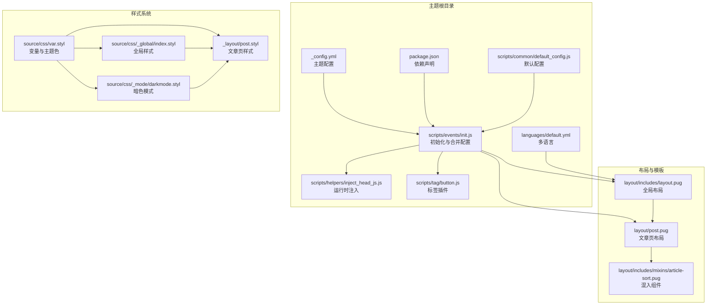
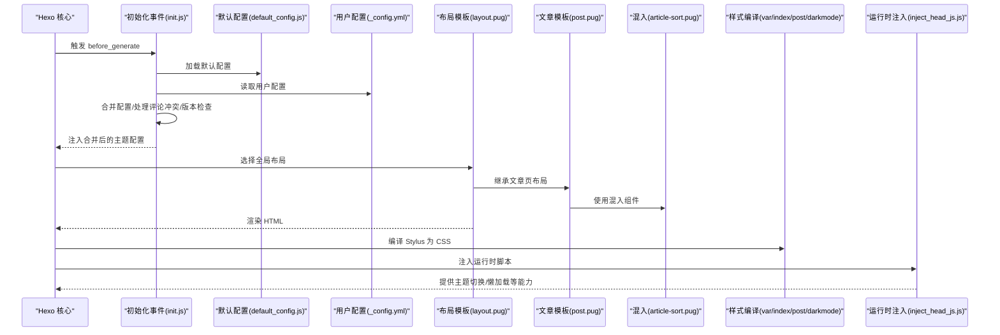
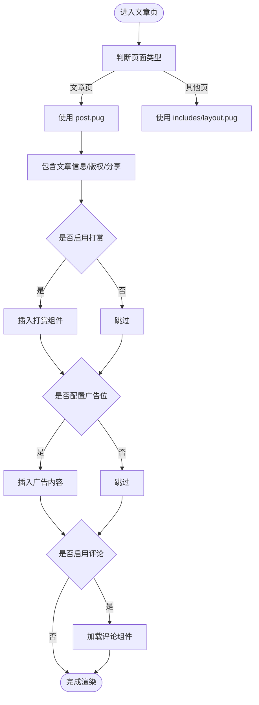
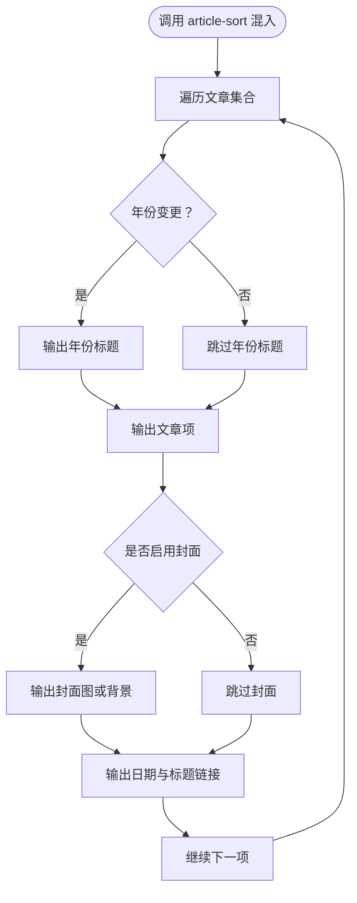
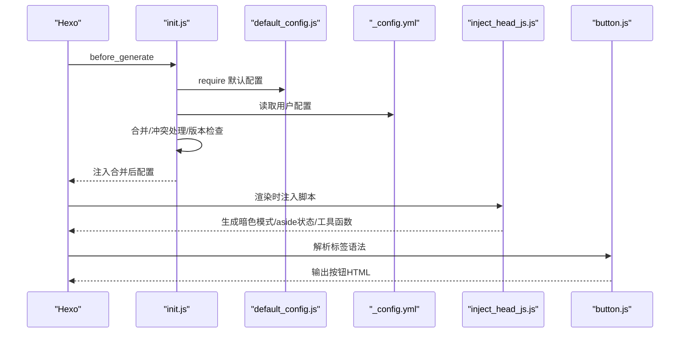
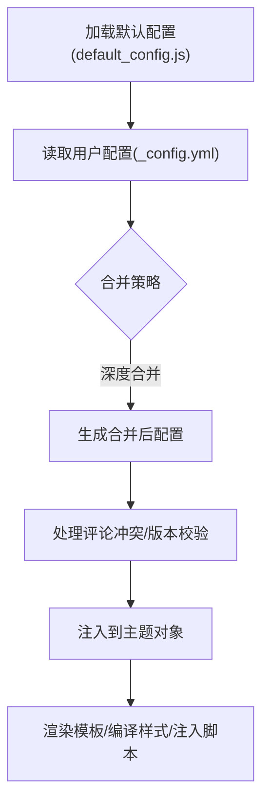
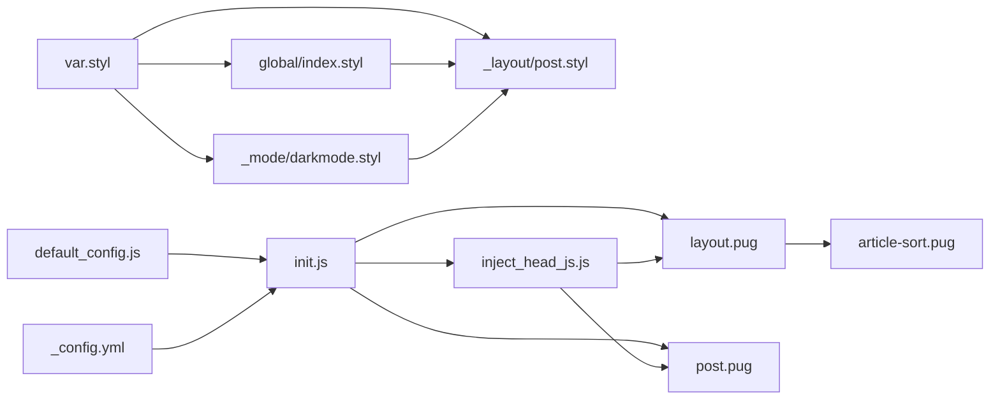

# 主题系统架构

<cite>
**本文引用的文件**
- [themes/butterfly/_config.yml](file://themes/butterfly/_config.yml)
- [themes/butterfly/package.json](file://themes/butterfly/package.json)
- [themes/butterfly/scripts/common/default_config.js](file://themes/butterfly/scripts/common/default_config.js)
- [themes/butterfly/scripts/events/init.js](file://themes/butterfly/scripts/events/init.js)
- [themes/butterfly/scripts/helpers/inject_head_js.js](file://themes/butterfly/scripts/helpers/inject_head_js.js)
- [themes/butterfly/scripts/tag/button.js](file://themes/butterfly/scripts/tag/button.js)
- [themes/butterfly/layout/includes/layout.pug](file://themes/butterfly/layout/includes/layout.pug)
- [themes/butterfly/layout/post.pug](file://themes/butterfly/layout/post.pug)
- [themes/butterfly/layout/includes/mixins/article-sort.pug](file://themes/butterfly/layout/includes/mixins/article-sort.pug)
- [themes/butterfly/languages/default.yml](file://themes/butterfly/languages/default.yml)
- [themes/butterfly/source/css/var.styl](file://themes/butterfly/source/css/var.styl)
- [themes/butterfly/source/css/_global/index.styl](file://themes/butterfly/source/css/_global/index.styl)
- [themes/butterfly/source/css/_layout/post.styl](file://themes/butterfly/source/css/_layout/post.styl)
- [themes/butterfly/source/css/_mode/darkmode.styl](file://themes/butterfly/source/css/_mode/darkmode.styl)
</cite>

## 目录
1. [引言](#引言)
2. [项目结构](#项目结构)
3. [核心组件](#核心组件)
4. [架构总览](#架构总览)
5. [详细组件分析](#详细组件分析)
6. [依赖关系分析](#依赖关系分析)
7. [性能考量](#性能考量)
8. [故障排查指南](#故障排查指南)
9. [结论](#结论)
10. [附录](#附录)

## 引言
本文件面向 Butterfly 主题的系统架构，围绕主题层次结构与组织方式、布局与模板组件、脚本系统、Pug 模板引擎使用模式（模板继承、混入与组件化）、Stylus 样式架构（变量系统、函数库与响应式断点）、主题配置系统（默认配置、用户覆盖与动态更新）以及与 Hexo 核心的集成与扩展点进行深入解析。目标是帮助读者快速理解主题如何在 Hexo 生态中工作，并提供可操作的优化建议与排障思路。

## 项目结构
Butterfly 主题采用“功能域+层次化”的组织方式：布局与模板位于 layout 目录，样式资源位于 source/css，脚本系统分为事件处理、辅助方法、标签插件与通用配置。语言包与第三方集成通过独立模块管理，便于维护与扩展。



**图表来源**
- [themes/butterfly/_config.yml:1-1137](file://themes/butterfly/_config.yml#L1-L1137)
- [themes/butterfly/package.json:1-35](file://themes/butterfly/package.json#L1-L35)
- [themes/butterfly/scripts/events/init.js:1-87](file://themes/butterfly/scripts/events/init.js#L1-L87)
- [themes/butterfly/scripts/common/default_config.js:1-602](file://themes/butterfly/scripts/common/default_config.js#L1-L602)
- [themes/butterfly/scripts/helpers/inject_head_js.js:1-156](file://themes/butterfly/scripts/helpers/inject_head_js.js#L1-L156)
- [themes/butterfly/scripts/tag/button.js:1-22](file://themes/butterfly/scripts/tag/button.js#L1-L22)
- [themes/butterfly/layout/includes/layout.pug:1-59](file://themes/butterfly/layout/includes/layout.pug#L1-L59)
- [themes/butterfly/layout/post.pug:1-36](file://themes/butterfly/layout/post.pug#L1-L36)
- [themes/butterfly/layout/includes/mixins/article-sort.pug:1-23](file://themes/butterfly/layout/includes/mixins/article-sort.pug#L1-L23)
- [themes/butterfly/source/css/var.styl:1-233](file://themes/butterfly/source/css/var.styl#L1-L233)
- [themes/butterfly/source/css/_global/index.styl:1-287](file://themes/butterfly/source/css/_global/index.styl#L1-L287)
- [themes/butterfly/source/css/_layout/post.styl:1-265](file://themes/butterfly/source/css/_layout/post.styl#L1-L265)
- [themes/butterfly/source/css/_mode/darkmode.styl:1-205](file://themes/butterfly/source/css/_mode/darkmode.styl#L1-L205)

**章节来源**
- [themes/butterfly/_config.yml:1-1137](file://themes/butterfly/_config.yml#L1-L1137)
- [themes/butterfly/package.json:1-35](file://themes/butterfly/package.json#L1-L35)

## 核心组件
- 布局与模板层：通过 Pug 实现模板继承与混入，统一页面骨架、头部、侧边栏、页脚与右下角工具条等模块化组件。
- 样式层：基于 Stylus 的变量系统与函数库，结合 CSS 自定义属性实现主题色、暗色模式与响应式适配。
- 脚本系统：包含初始化事件、运行时注入逻辑、标签插件与辅助方法，负责配置合并、动态行为与第三方集成。
- 配置系统：默认配置与用户配置在生成前合并，支持评论系统冲突处理与版本校验。
- 多语言：集中管理文案键值，便于国际化与本地化。

**章节来源**
- [themes/butterfly/layout/includes/layout.pug:1-59](file://themes/butterfly/layout/includes/layout.pug#L1-L59)
- [themes/butterfly/layout/post.pug:1-36](file://themes/butterfly/layout/post.pug#L1-L36)
- [themes/butterfly/layout/includes/mixins/article-sort.pug:1-23](file://themes/butterfly/layout/includes/mixins/article-sort.pug#L1-L23)
- [themes/butterfly/source/css/var.styl:1-233](file://themes/butterfly/source/css/var.styl#L1-L233)
- [themes/butterfly/source/css/_global/index.styl:1-287](file://themes/butterfly/source/css/_global/index.styl#L1-L287)
- [themes/butterfly/source/css/_layout/post.styl:1-265](file://themes/butterfly/source/css/_layout/post.styl#L1-L265)
- [themes/butterfly/source/css/_mode/darkmode.styl:1-205](file://themes/butterfly/source/css/_mode/darkmode.styl#L1-L205)
- [themes/butterfly/scripts/events/init.js:1-87](file://themes/butterfly/scripts/events/init.js#L1-L87)
- [themes/butterfly/scripts/helpers/inject_head_js.js:1-156](file://themes/butterfly/scripts/helpers/inject_head_js.js#L1-L156)
- [themes/butterfly/scripts/tag/button.js:1-22](file://themes/butterfly/scripts/tag/button.js#L1-L22)
- [themes/butterfly/languages/default.yml:1-124](file://themes/butterfly/languages/default.yml#L1-L124)

## 架构总览
Butterfly 的渲染管线从 Hexo 生成阶段开始：先加载默认配置并合并用户配置，再根据页面类型选择对应布局与组件，最终由 Pug 渲染 HTML，Stylus 编译 CSS，运行时脚本注入交互逻辑与主题切换能力。



**图表来源**
- [themes/butterfly/scripts/events/init.js:79-87](file://themes/butterfly/scripts/events/init.js#L79-L87)
- [themes/butterfly/scripts/common/default_config.js:1-602](file://themes/butterfly/scripts/common/default_config.js#L1-L602)
- [themes/butterfly/_config.yml:1-1137](file://themes/butterfly/_config.yml#L1-L1137)
- [themes/butterfly/layout/includes/layout.pug:1-59](file://themes/butterfly/layout/includes/layout.pug#L1-L59)
- [themes/butterfly/layout/post.pug:1-36](file://themes/butterfly/layout/post.pug#L1-L36)
- [themes/butterfly/layout/includes/mixins/article-sort.pug:1-23](file://themes/butterfly/layout/includes/mixins/article-sort.pug#L1-L23)
- [themes/butterfly/source/css/var.styl:1-233](file://themes/butterfly/source/css/var.styl#L1-L233)
- [themes/butterfly/source/css/_global/index.styl:1-287](file://themes/butterfly/source/css/_global/index.styl#L1-L287)
- [themes/butterfly/source/css/_layout/post.styl:1-265](file://themes/butterfly/source/css/_layout/post.styl#L1-L265)
- [themes/butterfly/source/css/_mode/darkmode.styl:1-205](file://themes/butterfly/source/css/_mode/darkmode.styl#L1-L205)
- [themes/butterfly/scripts/helpers/inject_head_js.js:1-156](file://themes/butterfly/scripts/helpers/inject_head_js.js#L1-L156)

## 详细组件分析

### 布局与模板系统（Pug）
- 模板继承：文章页模板继承全局布局，复用头部、侧边栏、页脚与右下角工具条等模块。
- 模块化组件：通过 include 与 partial 引入头部、侧边栏卡片、分页、第三方组件等，提升可维护性。
- 动态控制：根据页面类型与配置动态决定侧边栏显示、背景图与页脚样式等。



**图表来源**
- [themes/butterfly/layout/post.pug:1-36](file://themes/butterfly/layout/post.pug#L1-L36)
- [themes/butterfly/layout/includes/layout.pug:1-59](file://themes/butterfly/layout/includes/layout.pug#L1-L59)

**章节来源**
- [themes/butterfly/layout/post.pug:1-36](file://themes/butterfly/layout/post.pug#L1-L36)
- [themes/butterfly/layout/includes/layout.pug:1-59](file://themes/butterfly/layout/includes/layout.pug#L1-L59)

### 模板混入与组件化（Mixins）
- 文章归档混入：按年份分组输出文章列表，支持封面图与元数据展示，具备错误图回退。
- 组件化设计：通过混入封装重复逻辑，降低模板复杂度，便于维护与扩展。



**图表来源**
- [themes/butterfly/layout/includes/mixins/article-sort.pug:1-23](file://themes/butterfly/layout/includes/mixins/article-sort.pug#L1-L23)

**章节来源**
- [themes/butterfly/layout/includes/mixins/article-sort.pug:1-23](file://themes/butterfly/layout/includes/mixins/article-sort.pug#L1-L23)

### 样式架构（Stylus）
- 变量系统：集中定义颜色、字体、间距、阴影等变量，支持主题色开关与用户自定义覆盖。
- 函数库：通过 Stylus 函数与 mixin 实现圆角、边框半径、图标样式等复用逻辑。
- 暗色模式：基于 CSS 自定义属性与 data-theme 属性，在暗色模式下调整所有颜色与滤镜。
- 响应式断点：通过媒体查询与 mixin 控制移动端与桌面端的布局差异。

```mermaid
classDiagram
class VarStyl {
"+主题色变量"
"+字体与字号"
"+全局背景与文本色"
"+暗色模式开关"
}
class GlobalStyl {
"+CSS变量映射"
"+滚动条样式"
"+表格与选区"
"+图片懒加载"
}
class PostStyl {
"+标题装饰与锚点"
"+列表与代码块"
"+标签与分享"
"+版权与过期提示"
}
class DarkStyl {
"+data-theme='dark'"
"+颜色降饱和与滤镜"
"+第三方组件适配"
}
VarStyl --> GlobalStyl : "编译为CSS变量"
VarStyl --> PostStyl : "提供变量"
GlobalStyl --> PostStyl : "基础样式"
DarkStyl --> GlobalStyl : "覆盖颜色"
DarkStyl --> PostStyl : "覆盖颜色"
```

**图表来源**
- [themes/butterfly/source/css/var.styl:1-233](file://themes/butterfly/source/css/var.styl#L1-L233)
- [themes/butterfly/source/css/_global/index.styl:1-287](file://themes/butterfly/source/css/_global/index.styl#L1-L287)
- [themes/butterfly/source/css/_layout/post.styl:1-265](file://themes/butterfly/source/css/_layout/post.styl#L1-L265)
- [themes/butterfly/source/css/_mode/darkmode.styl:1-205](file://themes/butterfly/source/css/_mode/darkmode.styl#L1-L205)

**章节来源**
- [themes/butterfly/source/css/var.styl:1-233](file://themes/butterfly/source/css/var.styl#L1-L233)
- [themes/butterfly/source/css/_global/index.styl:1-287](file://themes/butterfly/source/css/_global/index.styl#L1-L287)
- [themes/butterfly/source/css/_layout/post.styl:1-265](file://themes/butterfly/source/css/_layout/post.styl#L1-L265)
- [themes/butterfly/source/css/_mode/darkmode.styl:1-205](file://themes/butterfly/source/css/_mode/darkmode.styl#L1-L205)

### 脚本系统
- 初始化事件：在生成前加载默认配置并合并用户配置，处理评论系统冲突与 Hexo 版本校验。
- 运行时注入：根据主题配置生成暗色模式切换、侧边栏状态、平台检测等脚本，支持 PJAX 场景。
- 标签插件：提供按钮等标签语法，简化模板中的 HTML 输出。



**图表来源**
- [themes/butterfly/scripts/events/init.js:79-87](file://themes/butterfly/scripts/events/init.js#L79-L87)
- [themes/butterfly/scripts/common/default_config.js:1-602](file://themes/butterfly/scripts/common/default_config.js#L1-L602)
- [themes/butterfly/_config.yml:1-1137](file://themes/butterfly/_config.yml#L1-L1137)
- [themes/butterfly/scripts/helpers/inject_head_js.js:1-156](file://themes/butterfly/scripts/helpers/inject_head_js.js#L1-L156)
- [themes/butterfly/scripts/tag/button.js:1-22](file://themes/butterfly/scripts/tag/button.js#L1-L22)

**章节来源**
- [themes/butterfly/scripts/events/init.js:1-87](file://themes/butterfly/scripts/events/init.js#L1-L87)
- [themes/butterfly/scripts/helpers/inject_head_js.js:1-156](file://themes/butterfly/scripts/helpers/inject_head_js.js#L1-L156)
- [themes/butterfly/scripts/tag/button.js:1-22](file://themes/butterfly/scripts/tag/button.js#L1-L22)

### 配置系统工作机制
- 默认配置：集中于 default_config.js，覆盖导航、代码块、社交、封面、副标题、TOC、版权、打赏、相关文章、底部按钮、翻译、阅读/暗色模式、锚点、复制、统计、数学公式、搜索、分享、评论、聊天、分析、广告、站点验证、美化、圆角、遮罩、加载动画等。
- 用户覆盖：_config.yml 提供用户级配置，与默认配置在生成前深度合并。
- 动态更新：运行时通过注入脚本与 CSS 变量实现主题色、暗色模式、侧边栏状态等动态切换。



**图表来源**
- [themes/butterfly/scripts/common/default_config.js:1-602](file://themes/butterfly/scripts/common/default_config.js#L1-L602)
- [themes/butterfly/_config.yml:1-1137](file://themes/butterfly/_config.yml#L1-L1137)
- [themes/butterfly/scripts/events/init.js:79-87](file://themes/butterfly/scripts/events/init.js#L79-L87)

**章节来源**
- [themes/butterfly/scripts/common/default_config.js:1-602](file://themes/butterfly/scripts/common/default_config.js#L1-L602)
- [themes/butterfly/_config.yml:1-1137](file://themes/butterfly/_config.yml#L1-L1137)
- [themes/butterfly/scripts/events/init.js:1-87](file://themes/butterfly/scripts/events/init.js#L1-L87)

### 与 Hexo 核心的集成与扩展点
- 渲染器依赖：通过 package.json 声明 Pug 与 Stylus 渲染器，确保模板与样式正确编译。
- 生成阶段钩子：在 before_generate 阶段完成配置合并与环境检查，避免后续渲染阶段出现配置不一致。
- 辅助方法与标签：通过 hexo.extend.* 注册辅助方法与标签，扩展模板能力。

**章节来源**
- [themes/butterfly/package.json:25-30](file://themes/butterfly/package.json#L25-L30)
- [themes/butterfly/scripts/events/init.js:79-87](file://themes/butterfly/scripts/events/init.js#L79-L87)
- [themes/butterfly/scripts/helpers/inject_head_js.js:1-156](file://themes/butterfly/scripts/helpers/inject_head_js.js#L1-L156)
- [themes/butterfly/scripts/tag/button.js:1-22](file://themes/butterfly/scripts/tag/button.js#L1-L22)

## 依赖关系分析
- 组件耦合：布局模板依赖默认配置与用户配置；样式依赖变量系统；运行时脚本依赖主题配置与 DOM 结构。
- 外部依赖：渲染器依赖 Hexo 渲染链路；第三方服务（评论、分析、广告）通过配置与注入脚本接入。
- 循环依赖：当前结构未见循环依赖，但需注意配置合并顺序与模板 include 的层级关系。



**图表来源**
- [themes/butterfly/scripts/common/default_config.js:1-602](file://themes/butterfly/scripts/common/default_config.js#L1-L602)
- [themes/butterfly/_config.yml:1-1137](file://themes/butterfly/_config.yml#L1-L1137)
- [themes/butterfly/scripts/events/init.js:79-87](file://themes/butterfly/scripts/events/init.js#L79-L87)
- [themes/butterfly/layout/includes/layout.pug:1-59](file://themes/butterfly/layout/includes/layout.pug#L1-L59)
- [themes/butterfly/layout/post.pug:1-36](file://themes/butterfly/layout/post.pug#L1-L36)
- [themes/butterfly/layout/includes/mixins/article-sort.pug:1-23](file://themes/butterfly/layout/includes/mixins/article-sort.pug#L1-L23)
- [themes/butterfly/source/css/var.styl:1-233](file://themes/butterfly/source/css/var.styl#L1-L233)
- [themes/butterfly/source/css/_global/index.styl:1-287](file://themes/butterfly/source/css/_global/index.styl#L1-L287)
- [themes/butterfly/source/css/_layout/post.styl:1-265](file://themes/butterfly/source/css/_layout/post.styl#L1-L265)
- [themes/butterfly/source/css/_mode/darkmode.styl:1-205](file://themes/butterfly/source/css/_mode/darkmode.styl#L1-L205)
- [themes/butterfly/scripts/helpers/inject_head_js.js:1-156](file://themes/butterfly/scripts/helpers/inject_head_js.js#L1-L156)

**章节来源**
- [themes/butterfly/package.json:25-30](file://themes/butterfly/package.json#L25-L30)
- [themes/butterfly/scripts/events/init.js:1-87](file://themes/butterfly/scripts/events/init.js#L1-L87)

## 性能考量
- 模板渲染：合理拆分 include/partial，避免深层嵌套导致的重复计算；利用缓存参数减少重复渲染。
- 样式编译：变量集中管理，减少重复计算；暗色模式仅在需要时启用，避免不必要的滤镜与重绘。
- 运行时脚本：延迟加载非关键脚本，使用异步加载与 PJAX 兼容逻辑，减少首屏阻塞。
- 图片与懒加载：开启懒加载与模糊过渡，降低首屏带宽与闪烁；为错误图提供回退路径。
- 第三方服务：按需加载评论、分析与广告脚本，避免影响页面性能。

## 故障排查指南
- 配置冲突：当同时启用多个评论系统时，初始化事件会自动处理冲突并保留第一个，检查合并后的 comments.use 是否符合预期。
- 版本兼容：若 Hexo 版本低于要求，初始化事件会记录错误并中断生成，升级 Hexo 至 V5.3.0+。
- 配置文件弃用：若使用旧版 butterfly.yml，初始化事件会提示改用 _config.butterfly.yml 并抛出错误。
- 暗色模式异常：确认 data-theme 属性与 CSS 变量映射是否正确，检查注入脚本是否在 PJAX 场景下重新执行。
- 样式变量未生效：检查 var.styl 中的主题色开关与用户配置，确认编译顺序与 CSS 变量优先级。

**章节来源**
- [themes/butterfly/scripts/events/init.js:10-32](file://themes/butterfly/scripts/events/init.js#L10-L32)
- [themes/butterfly/scripts/events/init.js:47-77](file://themes/butterfly/scripts/events/init.js#L47-L77)
- [themes/butterfly/scripts/helpers/inject_head_js.js:64-126](file://themes/butterfly/scripts/helpers/inject_head_js.js#L64-L126)

## 结论
Butterfly 主题通过清晰的层次化结构与模块化设计，实现了布局、样式与脚本的高内聚低耦合。其配置系统在生成阶段完成合并与校验，运行时通过注入脚本与 CSS 变量实现动态体验。借助 Pug 的模板继承与混入、Stylus 的变量与函数库，主题在可维护性与可扩展性上表现优异。建议在实际部署中关注第三方服务的按需加载与缓存策略，以进一步优化性能与用户体验。

## 附录
- 多语言键值：集中于 languages/default.yml，便于新增语言与文案管理。
- 标签插件示例：button 标签提供按钮组件的便捷语法，减少模板中的重复 HTML。

**章节来源**
- [themes/butterfly/languages/default.yml:1-124](file://themes/butterfly/languages/default.yml#L1-L124)
- [themes/butterfly/scripts/tag/button.js:1-22](file://themes/butterfly/scripts/tag/button.js#L1-L22)