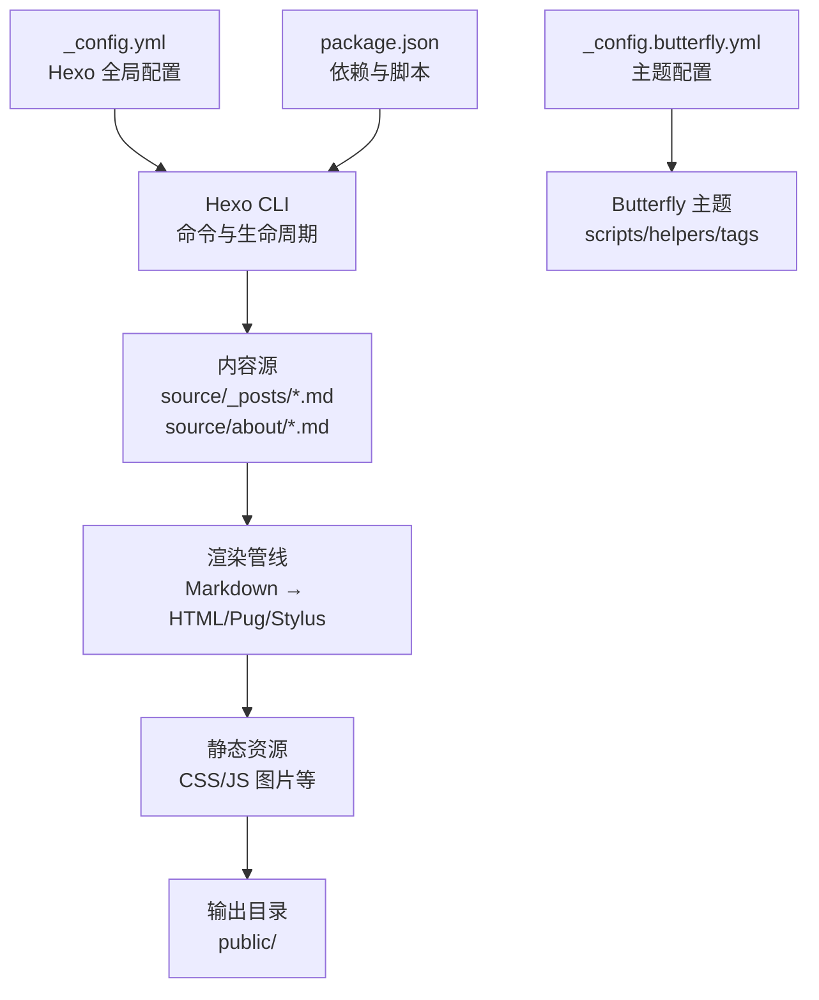
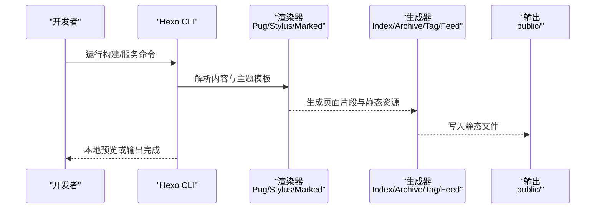
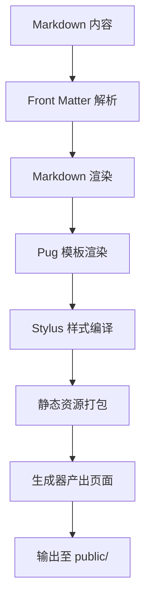
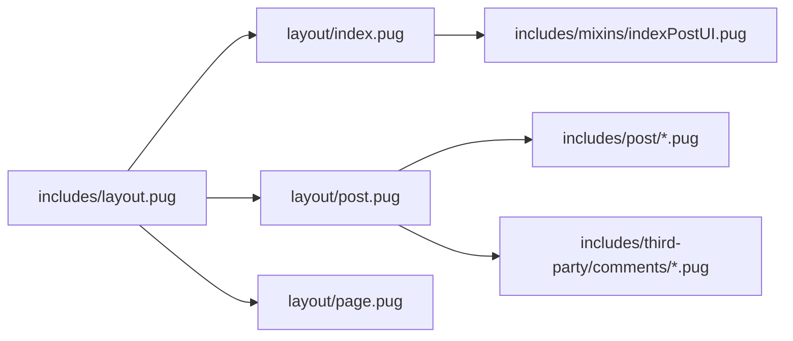
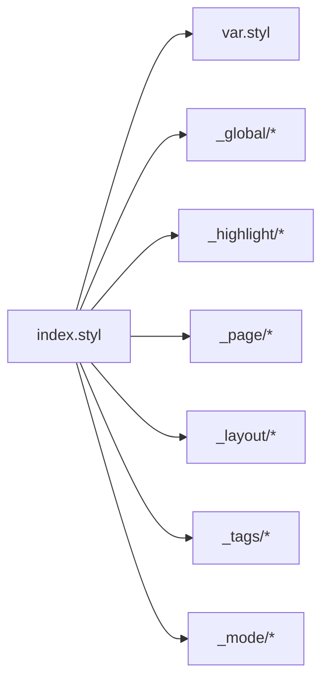
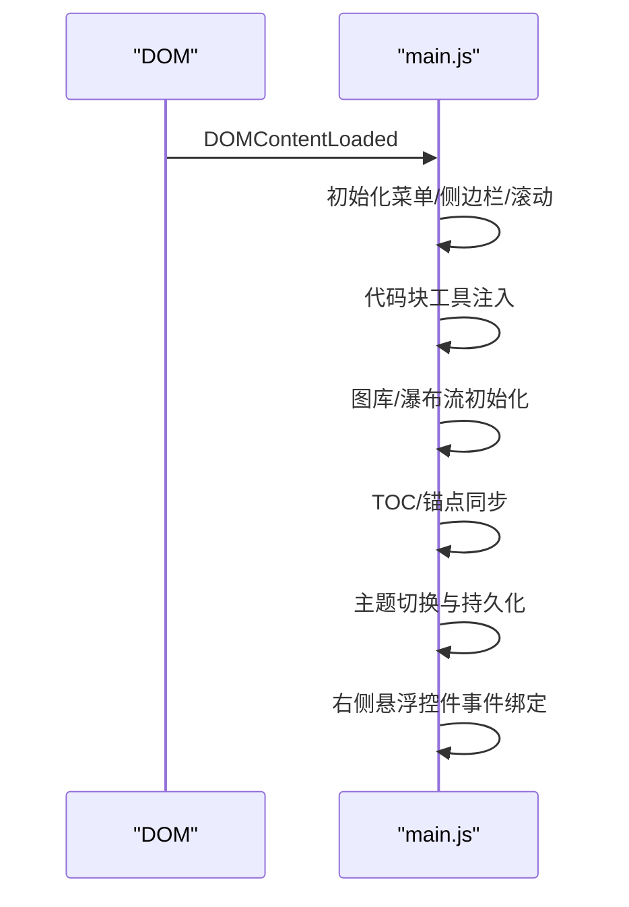
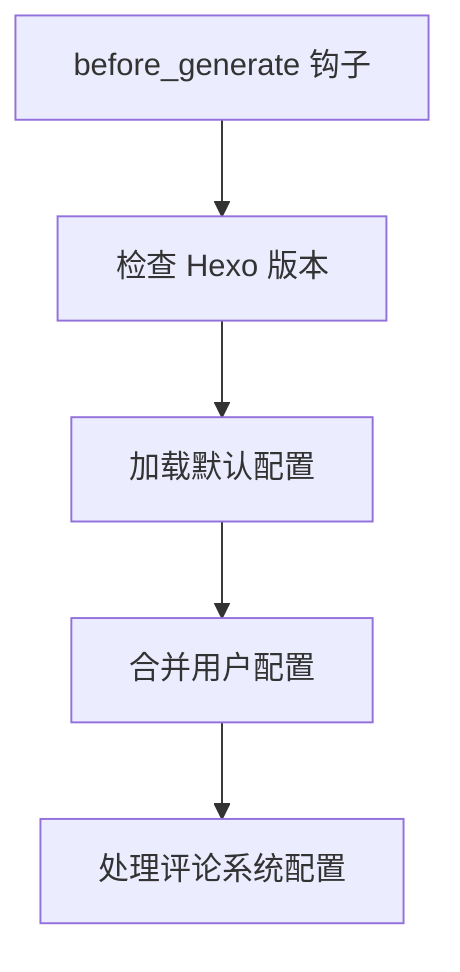
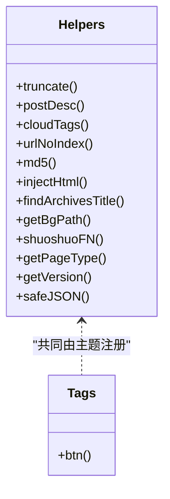
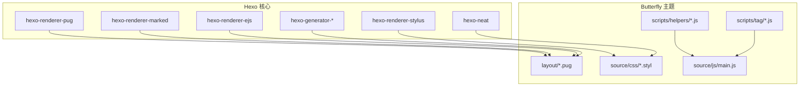

# 技术架构

<cite>
**本文引用的文件**
- [_config.yml](file://_config.yml)
- [_config.butterfly.yml](file://_config.butterfly.yml)
- [package.json](file://package.json)
- [themes/butterfly/_config.yml](file://themes/butterfly/_config.yml)
- [themes/butterfly/package.json](file://themes/butterfly/package.json)
- [themes/butterfly/layout/index.pug](file://themes/butterfly/layout/index.pug)
- [themes/butterfly/layout/post.pug](file://themes/butterfly/layout/post.pug)
- [themes/butterfly/scripts/events/init.js](file://themes/butterfly/scripts/events/init.js)
- [themes/butterfly/scripts/helpers/page.js](file://themes/butterfly/scripts/helpers/page.js)
- [themes/butterfly/scripts/common/default_config.js](file://themes/butterfly/scripts/common/default_config.js)
- [themes/butterfly/scripts/tag/button.js](file://themes/butterfly/scripts/tag/button.js)
- [themes/butterfly/source/css/index.styl](file://themes/butterfly/source/css/index.styl)
- [themes/butterfly/source/js/main.js](file://themes/butterfly/source/js/main.js)
- [source/_posts/hello-world.md](file://source/_posts/hello-world.md)
- [source/about/index.md](file://source/about/index.md)
</cite>

## 目录
1. [引言](#引言)
2. [项目结构](#项目结构)
3. [核心组件](#核心组件)
4. [架构总览](#架构总览)
5. [详细组件分析](#详细组件分析)
6. [依赖关系分析](#依赖关系分析)
7. [性能考量](#性能考量)
8. [故障排查指南](#故障排查指南)
9. [结论](#结论)
10. [附录](#附录)

## 引言
本技术架构文档面向 Hexo 博客系统，聚焦于静态站点生成器的工作原理、内容渲染流程、模板系统与静态文件生成过程，并深入解析 Butterfly 主题的技术实现（Pug 模板引擎、Stylus 预处理器与 JavaScript 交互）。文档还阐述了从内容层到渲染层再到输出层的数据流转，以及关键架构决策与性能优化策略、响应式设计与跨浏览器兼容性考虑。

## 项目结构
该项目采用 Hexo 标准目录组织：内容位于 source 目录，主题位于 themes/butterfly，全局配置位于根目录的 _config.yml 与 _config.butterfly.yml，构建脚本与依赖声明位于 package.json。主题内部通过 Pug 布局与 Stylus 样式组织页面结构与样式，JavaScript 提供交互能力。

图表来源
- [_config.yml:1-173](file://_config.yml#L1-L173)
- [_config.butterfly.yml:1-690](file://_config.butterfly.yml#L1-L690)
- [package.json:1-42](file://package.json#L1-L42)

章节来源
- [_config.yml:1-173](file://_config.yml#L1-L173)
- [_config.butterfly.yml:1-690](file://_config.butterfly.yml#L1-L690)
- [package.json:1-42](file://package.json#L1-L42)

## 核心组件
- Hexo 核心与渲染器
  - 渲染器：hexo-renderer-pug、hexo-renderer-stylus、hexo-renderer-marked、hexo-renderer-ejs
  - 生成器：hexo-generator-index、hexo-generator-archive、hexo-generator-category、hexo-generator-tag、hexo-generator-feed、hexo-generator-sitemap、hexo-generator-searchdb、hexo-generator-robotstxt
  - 压缩与优化：hexo-neat（HTML/CSS/JS 压缩）
  - 图片懒加载：hexo-lazyload-image
  - 文章统计：hexo-wordcount
  - 数学公式：hexo-filter-mathjax
  - 管理后台：hexo-admin
- 主题 Butterfly
  - 渲染器依赖：hexo-renderer-pug、hexo-renderer-stylus
  - 工具与日期：hexo-util、moment-timezone
  - 主题配置：_config.butterfly.yml 与主题内 _config.yml
  - 功能脚本：scripts/events/init.js、scripts/helpers/*.js、scripts/tag/*.js
  - 样式入口：source/css/index.styl
  - 交互入口：source/js/main.js

章节来源
- [package.json:16-36](file://package.json#L16-L36)
- [themes/butterfly/package.json:25-29](file://themes/butterfly/package.json#L25-L29)

## 架构总览
Hexo 的工作流自上而下分为三层：
- 内容层：Markdown 文档与 Front Matter，位于 source 目录
- 渲染层：渲染器将 Markdown/Pug/Stylus 转换为 HTML/CSS/JS；生成器产出分页、归档、标签等页面；过滤器处理数学公式等扩展
- 输出层：生成 public 目录中的静态文件，供托管平台或本地服务器发布

图表来源
- [package.json:6-12](file://package.json#L6-L12)
- [themes/butterfly/layout/index.pug:1-5](file://themes/butterfly/layout/index.pug#L1-L5)
- [themes/butterfly/layout/post.pug:1-36](file://themes/butterfly/layout/post.pug#L1-L36)

章节来源
- [package.json:6-12](file://package.json#L6-L12)
- [themes/butterfly/layout/index.pug:1-5](file://themes/butterfly/layout/index.pug#L1-L5)
- [themes/butterfly/layout/post.pug:1-36](file://themes/butterfly/layout/post.pug#L1-L36)

## 详细组件分析

### Hexo 渲染与生成流水线
- Markdown 到 HTML：hexo-renderer-marked 与 hexo-renderer-ejs 配合，支持代码高亮（highlight.js/prismjs）与行号
- 模板渲染：hexo-renderer-pug 将 Pug 模板编译为 HTML，主题布局与混入（mixins）控制页面结构
- 样式编译：hexo-renderer-stylus 将 Stylus 编译为 CSS，入口文件按模块导入
- 页面生成：hexo-generator-* 生成首页、归档、分类、标签、Feed、Sitemap、搜索索引等
- 资源优化：hexo-neat 对 HTML/CSS/JS 进行压缩与输出优化

图表来源
- [_config.yml:44-55](file://_config.yml#L44-L55)
- [themes/butterfly/layout/post.pug:8-13](file://themes/butterfly/layout/post.pug#L8-L13)
- [themes/butterfly/source/css/index.styl:1-15](file://themes/butterfly/source/css/index.styl#L1-L15)

章节来源
- [_config.yml:44-55](file://_config.yml#L44-L55)
- [themes/butterfly/layout/post.pug:8-13](file://themes/butterfly/layout/post.pug#L8-L13)
- [themes/butterfly/source/css/index.styl:1-15](file://themes/butterfly/source/css/index.styl#L1-L15)

### Butterfly 主题模板系统（Pug）
- 布局继承：各页面通过 extends 继承 includes/layout.pug，复用头部、底部、侧边栏等通用结构
- 混入与组件化：includes/mixins 提供可复用 UI 片段，如文章列表 UI
- 页面特化：index.pug、post.pug、page.pug 等分别定义首页、文章页、独立页的结构与区块
- 第三方集成：评论、分享、数学公式、搜索等通过 includes/third-party 下的 Pug 片段注入

图表来源
- [themes/butterfly/layout/index.pug:1-5](file://themes/butterfly/layout/index.pug#L1-L5)
- [themes/butterfly/layout/post.pug:1-36](file://themes/butterfly/layout/post.pug#L1-L36)

章节来源
- [themes/butterfly/layout/index.pug:1-5](file://themes/butterfly/layout/index.pug#L1-L5)
- [themes/butterfly/layout/post.pug:1-36](file://themes/butterfly/layout/post.pug#L1-L36)

### 样式系统（Stylus）
- 入口文件：index.styl 导入变量、全局、页面、布局、标签、模式等模块
- 预处理链路：通过 @import 组织样式模块，最终编译为 CSS
- 主题变量与模式：var.styl 定义变量，_mode/* 控制暗/亮模式切换

图表来源
- [themes/butterfly/source/css/index.styl:1-15](file://themes/butterfly/source/css/index.styl#L1-L15)

章节来源
- [themes/butterfly/source/css/index.styl:1-15](file://themes/butterfly/source/css/index.styl#L1-L15)

### JavaScript 交互与运行时行为
- DOM 就绪初始化：监听 DOMContentLoaded，执行菜单自适应、侧边栏开关、滚动行为等
- 代码块增强：根据配置提供复制、展开、全屏、Mac 风格装饰、高度限制等工具
- 图库瀑布流：基于 InfiniteGrid 的 Justified 布局，支持分页加载与 Lightbox
- TOC/锚点：滚动时计算标题位置，同步目录与 URL 锚点
- 主题切换：读取 data-theme 属性，切换明暗模式并持久化
- 右侧悬浮控件：阅读模式、暗色模式切换、回到顶部、隐藏侧边栏、移动端目录等

图表来源
- [themes/butterfly/source/js/main.js:1-800](file://themes/butterfly/source/js/main.js#L1-L800)

章节来源
- [themes/butterfly/source/js/main.js:1-800](file://themes/butterfly/source/js/main.js#L1-L800)

### 主题初始化与配置合并
- 环境检查：校验 Hexo 版本与废弃配置文件
- 默认配置：从 scripts/common/default_config.js 加载默认值
- 配置合并：使用 deepMerge 将默认配置与用户配置合并
- 评论系统处理：规范化 comments.use 并处理冲突

图表来源
- [themes/butterfly/scripts/events/init.js:79-86](file://themes/butterfly/scripts/events/init.js#L79-L86)
- [themes/butterfly/scripts/common/default_config.js:1-602](file://themes/butterfly/scripts/common/default_config.js#L1-L602)

章节来源
- [themes/butterfly/scripts/events/init.js:1-87](file://themes/butterfly/scripts/events/init.js#L1-L87)
- [themes/butterfly/scripts/common/default_config.js:1-602](file://themes/butterfly/scripts/common/default_config.js#L1-L602)

### 辅助函数与标签插件
- 辅助函数：truncate、postDesc、cloudTags、urlNoIndex、md5、injectHtml、findArchivesTitle、getBgPath、shuoshuoFN、getPageType、getVersion、safeJSON
- 标签插件：按钮标签  注册为非结束型标签，支持选项与图标

图表来源
- [themes/butterfly/scripts/helpers/page.js:14-194](file://themes/butterfly/scripts/helpers/page.js#L14-L194)
- [themes/butterfly/scripts/tag/button.js:12-22](file://themes/butterfly/scripts/tag/button.js#L12-L22)

章节来源
- [themes/butterfly/scripts/helpers/page.js:1-194](file://themes/butterfly/scripts/helpers/page.js#L1-L194)
- [themes/butterfly/scripts/tag/button.js:1-22](file://themes/butterfly/scripts/tag/button.js#L1-L22)

### 内容与示例
- 示例文章：source/_posts/hello-world.md 展示基础 Front Matter 与 Markdown 结构
- 自定义页面：source/about/index.md 使用自定义 layout 与 type

章节来源
- [source/_posts/hello-world.md:1-39](file://source/_posts/hello-world.md#L1-L39)
- [source/about/index.md:1-49](file://source/about/index.md#L1-L49)

## 依赖关系分析
- Hexo 与主题的耦合
  - 主题通过 hexo-renderer-pug 与 hexo-renderer-stylus 依赖 Hexo 渲染管线
  - 主题配置与默认配置在 before_generate 阶段合并，确保功能可用性
- 生成器与页面类型
  - hexo-generator-index 与 hexo-generator-archive 等生成不同页面类型，配合主题布局渲染
- 依赖图

图表来源
- [package.json:16-36](file://package.json#L16-L36)
- [themes/butterfly/package.json:25-29](file://themes/butterfly/package.json#L25-L29)
- [themes/butterfly/layout/index.pug:1-5](file://themes/butterfly/layout/index.pug#L1-L5)
- [themes/butterfly/source/css/index.styl:1-15](file://themes/butterfly/source/css/index.styl#L1-L15)
- [themes/butterfly/source/js/main.js:1-800](file://themes/butterfly/source/js/main.js#L1-L800)

章节来源
- [package.json:16-36](file://package.json#L16-L36)
- [themes/butterfly/package.json:25-29](file://themes/butterfly/package.json#L25-L29)

## 性能考量
- 渲染性能
  - 使用 hexo-neat 在构建阶段压缩 HTML/CSS/JS，减少传输体积
  - 代码高亮与行号可按需开启，避免不必要的 DOM 与脚本开销
- 资源加载
  - 图片懒加载（hexo-lazyload-image）与原生 lazyload（_config.butterfly.yml 中启用）降低首屏压力
  - CDN 提供（主题配置）可加速第三方资源加载
- 交互优化
  - 滚动节流与防抖（如滚动百分比、TOC 同步）减少重排与重绘
  - 图库瀑布流按需加载，避免一次性渲染大量图片
- 响应式与兼容性
  - Stylus 模块化与变量统一管理，便于在不同设备上适配
  - Pug 模板结构清晰，利于在不同浏览器中保持一致表现
- 构建与部署
  - 通过 package.json 脚本统一构建流程，结合 CI/CD 实现自动化部署

## 故障排查指南
- 版本不兼容
  - init.js 在 before_generate 阶段检查 Hexo 版本，若低于要求会抛出错误并记录日志
- 配置冲突
  - comments.use 支持多评论系统，若同时启用冲突项会仅保留第一个并警告
- 资源路径问题
  - urlNoIndex 与 injectHtml 辅助函数用于正确拼接链接与注入 HTML
- 数学公式显示异常
  - _config.yml 中 marked 配置影响根路径与资源解析，需确保路径正确
- 图片懒加载无效
  - 检查 _config.butterfly.yml 中 lazyload 开关与字段设置

章节来源
- [themes/butterfly/scripts/events/init.js:10-32](file://themes/butterfly/scripts/events/init.js#L10-L32)
- [themes/butterfly/scripts/events/init.js:69-77](file://themes/butterfly/scripts/events/init.js#L69-L77)
- [themes/butterfly/scripts/helpers/page.js:85-87](file://themes/butterfly/scripts/helpers/page.js#L85-L87)
- [themes/butterfly/scripts/helpers/page.js:93-95](file://themes/butterfly/scripts/helpers/page.js#L93-L95)
- [_config.yml:153-156](file://_config.yml#L153-L156)

## 结论
该 Hexo 博客系统以 Butterfly 主题为核心，结合 Pug 模板、Stylus 样式与 JavaScript 交互，形成从内容到静态输出的完整流水线。通过合理的配置与脚本机制，系统在保证功能丰富的同时兼顾性能与可维护性。建议持续关注渲染器与生成器的版本升级，配合 CDN 与缓存策略进一步提升加载体验。

## 附录
- 常用命令
  - 构建：npm run build
  - 清理：npm run clean
  - 本地服务：npm run server
  - 调试模式：npm run dev
  - 管理后台：npm run admin
- 关键配置要点
  - 主题选择：_config.yml theme: butterfly
  - 懒加载：_config.butterfly.yml lazyload.enable
  - 代码高亮：_config.yml highlight/prismjs
  - 压缩：_config.yml neat_enable/neat_* 配置

章节来源
- [package.json:6-12](file://package.json#L6-L12)
- [_config.yml:85-85](file://_config.yml#L85-L85)
- [_config.butterfly.yml:646-651](file://_config.butterfly.yml#L646-L651)
- [_config.yml:44-55](file://_config.yml#L44-L55)