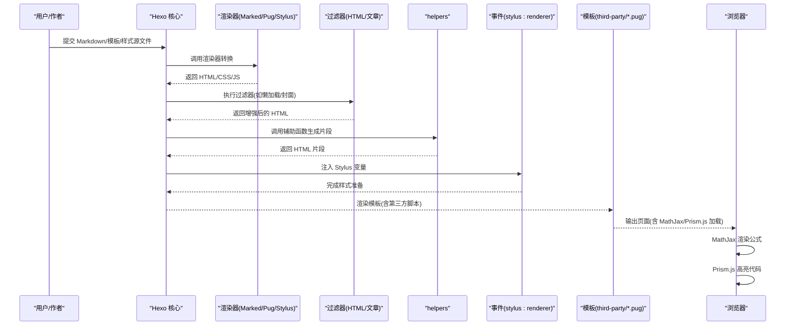
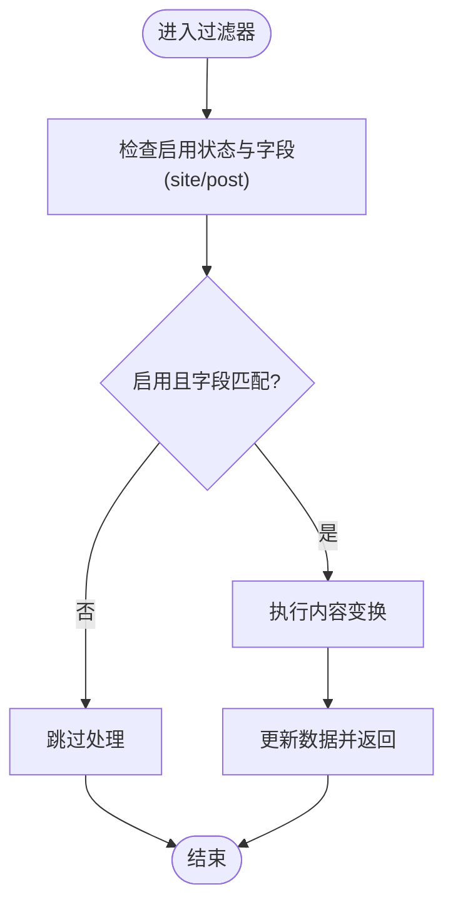
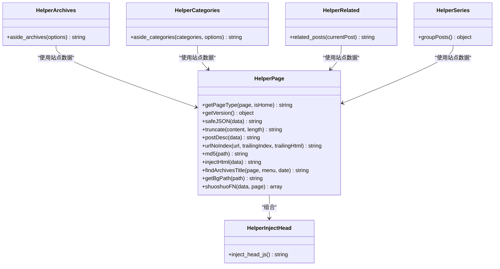
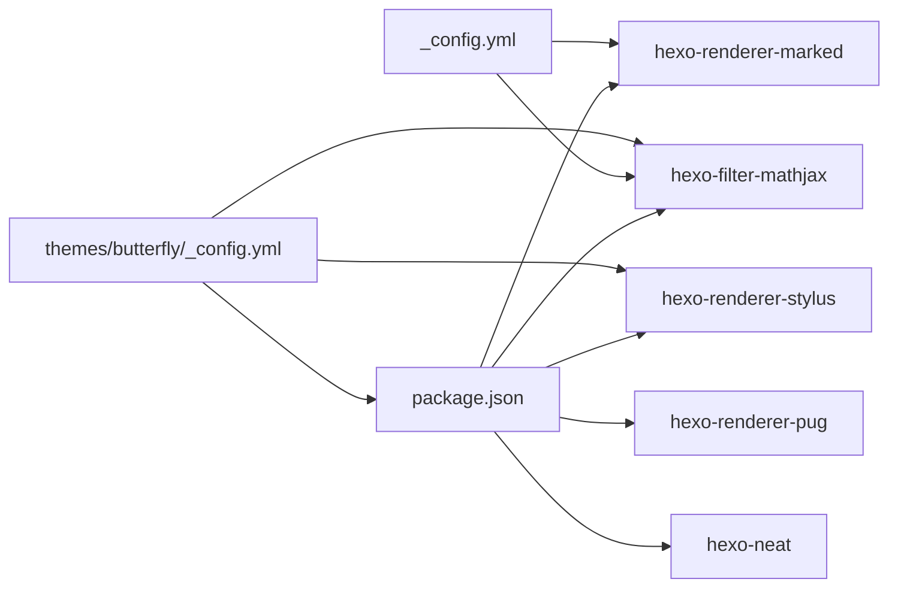

# 渲染引擎系统

<cite>
**本文引用的文件**
- [package.json](file://package.json)
- [_config.yml](file://_config.yml)
- [themes/butterfly/_config.yml](file://themes/butterfly/_config.yml)
- [themes/butterfly/scripts/filters/post_lazyload.js](file://themes/butterfly/scripts/filters/post_lazyload.js)
- [themes/butterfly/scripts/filters/random_cover.js](file://themes/butterfly/scripts/filters/random_cover.js)
- [themes/butterfly/scripts/helpers/page.js](file://themes/butterfly/scripts/helpers/page.js)
- [themes/butterfly/scripts/helpers/aside_archives.js](file://themes/butterfly/scripts/helpers/aside_archives.js)
- [themes/butterfly/scripts/helpers/aside_categories.js](file://themes/butterfly/scripts/helpers/aside_categories.js)
- [themes/butterfly/scripts/helpers/getArchiveLength.js](file://themes/butterfly/scripts/helpers/getArchiveLength.js)
- [themes/butterfly/scripts/helpers/inject_head_js.js](file://themes/butterfly/scripts/helpers/inject_head_js.js)
- [themes/butterfly/scripts/helpers/related_post.js](file://themes/butterfly/scripts/helpers/related_post.js)
- [themes/butterfly/scripts/helpers/series.js](file://themes/butterfly/scripts/helpers/series.js)
- [themes/butterfly/scripts/events/stylus.js](file://themes/butterfly/scripts/events/stylus.js)
- [themes/butterfly/layout/includes/third-party/math/mathjax.pug](file://themes/butterfly/layout/includes/third-party/math/mathjax.pug)
- [themes/butterfly/layout/includes/third-party/prismjs.pug](file://themes/butterfly/layout/includes/third-party/prismjs.pug)
- [themes/butterfly/scripts/common/default_config.js](file://themes/butterfly/scripts/common/default_config.js)
- [themes/butterfly/scripts/common/postDesc.js](file://themes/butterfly/scripts/common/postDesc.js)
</cite>

## 目录
1. [引言](#引言)
2. [项目结构](#项目结构)
3. [核心组件](#核心组件)
4. [架构总览](#架构总览)
5. [详细组件分析](#详细组件分析)
6. [依赖关系分析](#依赖关系分析)
7. [性能考量](#性能考量)
8. [故障排查指南](#故障排查指南)
9. [结论](#结论)
10. [附录](#附录)

## 引言
本文件面向 Hexo 渲染引擎系统的使用者与维护者，系统性阐述渲染管道在本项目中的工作方式，覆盖 Markdown 渲染（Marked）、代码高亮（Prism.js）、数学公式渲染（MathJax）以及主题层的渲染过滤器与辅助函数（helpers）。同时给出渲染缓存策略、性能优化与内存管理建议，并说明扩展点与自定义渲染器的集成路径。

## 项目结构
本项目采用 Hexo 标准目录组织，主题使用 Butterfly，渲染相关的关键位置如下：
- 渲染器与插件：通过 package.json 声明，如 hexo-renderer-marked、hexo-renderer-pug、hexo-renderer-stylus、hexo-filter-mathjax 等。
- 全局配置：_config.yml 控制站点行为、Markdown 渲染参数、分页、压缩等。
- 主题配置：themes/butterfly/_config.yml 提供主题级渲染开关与样式控制。
- 渲染过滤器：themes/butterfly/scripts/filters 下注册对 HTML 或文章内容的后处理。
- 辅助函数：themes/butterfly/scripts/helpers 下提供页面处理、元数据提取、内容增强等能力。
- 渲染事件：themes/butterfly/scripts/events 下注册渲染期钩子（如 stylus:renderer）。
- 模板与第三方组件：themes/butterfly/layout/includes/third-party 下包含 MathJax 与 Prism.js 的前端加载逻辑。

```mermaid
graph TB
A["Hexo 核心"] --> B["渲染器<br/>Marked/Pug/Stylus"]
A --> C["过滤器<br/>HTML/文章后处理"]
A --> D["辅助函数<br/>helpers"]
A --> E["事件钩子<br/>stylus:renderer"]
B --> F["输出 HTML/CSS/JS"]
C --> F
D --> F
E --> F
F --> G["模板片段<br/>third-party/*.pug"]
G --> H["浏览器端<br/>MathJax/Prism.js"]
```

图表来源
- [package.json:16-36](file://package.json#L16-L36)
- [themes/butterfly/scripts/events/stylus.js:7-24](file://themes/butterfly/scripts/events/stylus.js#L7-L24)
- [themes/butterfly/layout/includes/third-party/math/mathjax.pug:35-78](file://themes/butterfly/layout/includes/third-party/math/mathjax.pug#L35-L78)
- [themes/butterfly/layout/includes/third-party/prismjs.pug:1-23](file://themes/butterfly/layout/includes/third-party/prismjs.pug#L1-L23)

章节来源
- [package.json:16-36](file://package.json#L16-L36)
- [_config.yml:152-173](file://_config.yml#L152-L173)
- [themes/butterfly/_config.yml:448-470](file://themes/butterfly/_config.yml#L448-L470)

## 核心组件
- 渲染器
  - Marked 渲染器负责将 Markdown 转换为 HTML；项目中通过 hexo-renderer-marked 实现，并在全局配置中启用 Markdown 渲染选项。
  - Pug 渲染器用于模板编译；Stylus 渲染器用于样式生成。
- 渲染过滤器
  - 在 HTML 输出阶段或文章渲染阶段进行内容替换与增强，如图片懒加载、封面随机化等。
- 辅助函数（helpers）
  - 提供页面类型判断、版本信息、安全 JSON 序列化、归档长度统计、标签云、相关文章推荐、侧边栏分类/归档等。
- 渲染事件
  - 在 Stylus 渲染前注入变量，控制主题样式是否启用高亮与行号等。
- 第三方渲染支持
  - MathJax：在模板中按需加载并在浏览器端渲染 LaTeX。
  - Prism.js：在模板中按需加载并在浏览器端高亮代码块。

章节来源
- [package.json:30-33](file://package.json#L30-L33)
- [themes/butterfly/scripts/filters/post_lazyload.js:29-41](file://themes/butterfly/scripts/filters/post_lazyload.js#L29-L41)
- [themes/butterfly/scripts/filters/random_cover.js:7-91](file://themes/butterfly/scripts/filters/random_cover.js#L7-L91)
- [themes/butterfly/scripts/helpers/page.js:167-194](file://themes/butterfly/scripts/helpers/page.js#L167-L194)
- [themes/butterfly/scripts/events/stylus.js:7-24](file://themes/butterfly/scripts/events/stylus.js#L7-L24)
- [themes/butterfly/layout/includes/third-party/math/mathjax.pug:35-78](file://themes/butterfly/layout/includes/third-party/math/mathjax.pug#L35-L78)
- [themes/butterfly/layout/includes/third-party/prismjs.pug:1-23](file://themes/butterfly/layout/includes/third-party/prismjs.pug#L1-L23)

## 架构总览
下图展示从内容输入到最终页面输出的渲染流程，涵盖 Marked 渲染、Prism.js 与 MathJax 的浏览器端渲染，以及主题层的过滤与增强。

图表来源
- [themes/butterfly/scripts/events/stylus.js:7-24](file://themes/butterfly/scripts/events/stylus.js#L7-L24)
- [themes/butterfly/layout/includes/third-party/math/mathjax.pug:35-78](file://themes/butterfly/layout/includes/third-party/math/mathjax.pug#L35-L78)
- [themes/butterfly/layout/includes/third-party/prismjs.pug:1-23](file://themes/butterfly/layout/includes/third-party/prismjs.pug#L1-L23)

## 详细组件分析

### 渲染过滤器（Filter）机制
- 中间件模式
  - 过滤器以“中间件”形式串联执行，可对 HTML 输出或文章内容进行预处理与后处理。
  - 示例：图片懒加载过滤器在 HTML 输出阶段或文章渲染阶段替换 src 属性，实现延迟加载。
- 内容预处理与后处理
  - 预处理：在渲染前对数据进行规范化（如封面路径补全、时间区域转换）。
  - 后处理：在渲染后对 HTML 进行二次加工（如懒加载、封面随机化）。
- 关键实现
  - 图片懒加载：在指定字段（站点/文章）范围内替换图片属性，支持原生 loading 或占位图方案。
  - 随机封面：为未设置封面的文章分配不重复的历史窗口内的随机封面，避免重复。

图表来源
- [themes/butterfly/scripts/filters/post_lazyload.js:29-41](file://themes/butterfly/scripts/filters/post_lazyload.js#L29-L41)
- [themes/butterfly/scripts/filters/random_cover.js:75-91](file://themes/butterfly/scripts/filters/random_cover.js#L75-L91)

章节来源
- [themes/butterfly/scripts/filters/post_lazyload.js:11-41](file://themes/butterfly/scripts/filters/post_lazyload.js#L11-L41)
- [themes/butterfly/scripts/filters/random_cover.js:12-91](file://themes/butterfly/scripts/filters/random_cover.js#L12-L91)

### 辅助函数（Helper）实现
- 页面处理与元数据增强
  - 页面类型判断：根据页面上下文返回布局类型（首页、归档、分类、标签、文章等）。
  - 版本信息：返回 Hexo 与主题版本，便于前端调试。
  - 安全 JSON：对嵌入脚本的 JSON 数据进行转义，防止 XSS。
  - 文章摘要：基于配置选择摘要策略（优先描述、拼接内容、截断），并缓存结果。
- 归档与分类
  - 归档列表：按年/月聚合文章数量，支持本地化格式与排序。
  - 分类树形：构建层级分类列表，支持展开/折叠与计数显示。
- 相关文章与系列
  - 相关文章：基于标签权重与时间随机性排序，限制数量并生成卡片。
  - 系列分组：按 series 字段分组并按标题或日期排序。
- 头部脚本注入
  - 动态生成主题切换、侧边栏状态、平台检测等初始化脚本，结合 PJAX 生命周期回调。

图表来源
- [themes/butterfly/scripts/helpers/page.js:167-194](file://themes/butterfly/scripts/helpers/page.js#L167-L194)
- [themes/butterfly/scripts/helpers/aside_archives.js:1-114](file://themes/butterfly/scripts/helpers/aside_archives.js#L1-L114)
- [themes/butterfly/scripts/helpers/aside_categories.js:1-101](file://themes/butterfly/scripts/helpers/aside_categories.js#L1-L101)
- [themes/butterfly/scripts/helpers/related_post.js:1-92](file://themes/butterfly/scripts/helpers/related_post.js#L1-L92)
- [themes/butterfly/scripts/helpers/series.js:1-23](file://themes/butterfly/scripts/helpers/series.js#L1-L23)
- [themes/butterfly/scripts/helpers/inject_head_js.js:1-156](file://themes/butterfly/scripts/helpers/inject_head_js.js#L1-L156)

章节来源
- [themes/butterfly/scripts/helpers/page.js:1-194](file://themes/butterfly/scripts/helpers/page.js#L1-L194)
- [themes/butterfly/scripts/helpers/aside_archives.js:1-114](file://themes/butterfly/scripts/helpers/aside_archives.js#L1-L114)
- [themes/butterfly/scripts/helpers/aside_categories.js:1-101](file://themes/butterfly/scripts/helpers/aside_categories.js#L1-L101)
- [themes/butterfly/scripts/helpers/related_post.js:1-92](file://themes/butterfly/scripts/helpers/related_post.js#L1-L92)
- [themes/butterfly/scripts/helpers/series.js:1-23](file://themes/butterfly/scripts/helpers/series.js#L1-L23)
- [themes/butterfly/scripts/helpers/inject_head_js.js:1-156](file://themes/butterfly/scripts/helpers/inject_head_js.js#L1-L156)

### 渲染缓存策略与性能优化
- 缓存策略
  - 片段缓存：归档长度辅助函数使用片段缓存创建映射，避免重复遍历与计算。
  - 内容摘要缓存：摘要生成后写回数据对象，减少重复处理。
- 性能优化
  - 懒加载：图片懒加载减少首屏资源压力；支持原生 lazy 与占位图两种策略。
  - 代码高亮：Prism.js 支持按需加载与行号，避免不必要的脚本体积。
  - 压缩：开启 hexo-neat 对 HTML/CSS/JS 进行压缩，降低带宽与加载时间。
- 内存管理
  - 使用 Map/Set 进行去重与计数，避免数组重复扫描。
  - 仅在必要时生成随机封面序列，避免长期持有大数组。

章节来源
- [themes/butterfly/scripts/helpers/getArchiveLength.js:12-46](file://themes/butterfly/scripts/helpers/getArchiveLength.js#L12-L46)
- [themes/butterfly/scripts/common/postDesc.js:12-35](file://themes/butterfly/scripts/common/postDesc.js#L12-L35)
- [themes/butterfly/scripts/filters/post_lazyload.js:11-27](file://themes/butterfly/scripts/filters/post_lazyload.js#L11-L27)
- [_config.yml:158-173](file://_config.yml#L158-L173)

### 扩展点与自定义渲染器集成
- 渲染器扩展
  - 通过 package.json 声明新的渲染器（如 hexo-renderer-xxx），Hexo 将自动识别并参与渲染。
- 过滤器扩展
  - 在 scripts/filters 下新增过滤器文件，使用 hexo.extend.filter.register 注册钩子，实现内容预处理/后处理。
- 辅助函数扩展
  - 在 scripts/helpers 下新增辅助函数文件，使用 hexo.extend.helper.register 注册，模板中即可调用。
- 事件钩子扩展
  - 在 scripts/events 下注册渲染期事件（如 stylus:renderer），在样式生成前注入变量或开关。
- 第三方渲染器集成
  - MathJax：在模板中按需加载脚本并触发渲染；Prism.js：在模板中按需加载并在页面加载或 PJAX 完成后执行高亮。

章节来源
- [package.json:16-36](file://package.json#L16-L36)
- [themes/butterfly/scripts/events/stylus.js:7-24](file://themes/butterfly/scripts/events/stylus.js#L7-L24)
- [themes/butterfly/layout/includes/third-party/math/mathjax.pug:35-78](file://themes/butterfly/layout/includes/third-party/math/mathjax.pug#L35-L78)
- [themes/butterfly/layout/includes/third-party/prismjs.pug:1-23](file://themes/butterfly/layout/includes/third-party/prismjs.pug#L1-L23)

## 依赖关系分析
- 渲染器依赖
  - hexo-renderer-marked：Markdown → HTML
  - hexo-renderer-pug：模板 → HTML
  - hexo-renderer-stylus：样式 → CSS
- 插件依赖
  - hexo-filter-mathjax：LaTeX 渲染
  - hexo-neat：HTML/CSS/JS 压缩
- 主题配置依赖
  - 语法高亮开关与行号、Prism.js 预处理、MathJax 开关等由主题配置驱动。

图表来源
- [package.json:16-36](file://package.json#L16-L36)
- [_config.yml:152-173](file://_config.yml#L152-L173)
- [themes/butterfly/_config.yml:448-470](file://themes/butterfly/_config.yml#L448-L470)

章节来源
- [package.json:16-36](file://package.json#L16-L36)
- [_config.yml:152-173](file://_config.yml#L152-L173)
- [themes/butterfly/_config.yml:448-470](file://themes/butterfly/_config.yml#L448-L470)

## 性能考量
- 渲染阶段
  - 合理配置 Markdown 渲染参数（如 prependRoot、postAsset）以减少链接与资源问题。
  - 在 Stylus 渲染前注入高亮开关，避免运行时动态判断带来的开销。
- 前端渲染
  - MathJax 与 Prism.js 的按需加载与延迟执行，减少首屏阻塞。
  - 启用 hexo-neat 压缩，合理排除已压缩文件，平衡体积与兼容性。
- 内存与计算
  - 使用 Map 统计归档数量，避免多次遍历。
  - 对文章摘要进行缓存，避免重复处理。

## 故障排查指南
- 图片懒加载无效
  - 检查主题配置中 lazyload 的启用状态与字段（site/post）。
  - 确认过滤器注册是否生效（after_render:html 与 after_post_render）。
- 代码高亮未生效
  - 检查主题配置中 prismjs 的 enable 与 preprocess 设置。
  - 确认模板中是否正确加载 Prism.js 脚本与行号脚本。
- 数学公式未渲染
  - 检查主题配置中 math.use 与 per_page 设置。
  - 确认模板中 MathJax 脚本加载逻辑与启动调用。
- 归档/分类列表异常
  - 检查时间区域与本地化设置，确认排序与格式化逻辑。
  - 确认分类层级与展开/折叠配置。

章节来源
- [themes/butterfly/scripts/filters/post_lazyload.js:29-41](file://themes/butterfly/scripts/filters/post_lazyload.js#L29-L41)
- [themes/butterfly/layout/includes/third-party/prismjs.pug:1-23](file://themes/butterfly/layout/includes/third-party/prismjs.pug#L1-L23)
- [themes/butterfly/layout/includes/third-party/math/mathjax.pug:35-78](file://themes/butterfly/layout/includes/third-party/math/mathjax.pug#L35-L78)
- [themes/butterfly/scripts/helpers/aside_archives.js:1-114](file://themes/butterfly/scripts/helpers/aside_archives.js#L1-L114)
- [themes/butterfly/scripts/helpers/aside_categories.js:1-101](file://themes/butterfly/scripts/helpers/aside_categories.js#L1-L101)

## 结论
本项目的渲染引擎以 Hexo 核心为基础，通过渲染器、过滤器、辅助函数与事件钩子形成完整的渲染管线。主题层在 Stylus 渲染前注入高亮开关，在模板中按需加载 MathJax 与 Prism.js，实现高性能与可定制的渲染体验。配合片段缓存、懒加载与压缩等优化手段，可在保证功能丰富的前提下维持良好的性能表现。

## 附录
- 默认配置参考：主题默认配置集中于 scripts/common/default_config.js，便于统一管理与扩展。
- 内容摘要工具：scripts/common/postDesc.js 提供摘要生成与缓存逻辑，作为 helpers 的通用工具。

章节来源
- [themes/butterfly/scripts/common/default_config.js:1-602](file://themes/butterfly/scripts/common/default_config.js#L1-L602)
- [themes/butterfly/scripts/common/postDesc.js:1-38](file://themes/butterfly/scripts/common/postDesc.js#L1-L38)