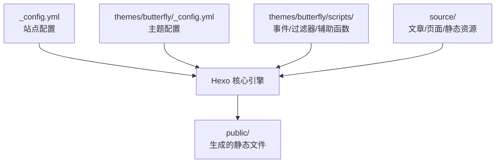
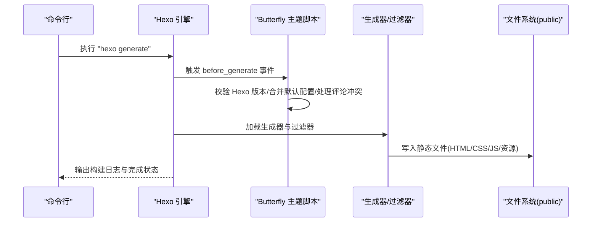
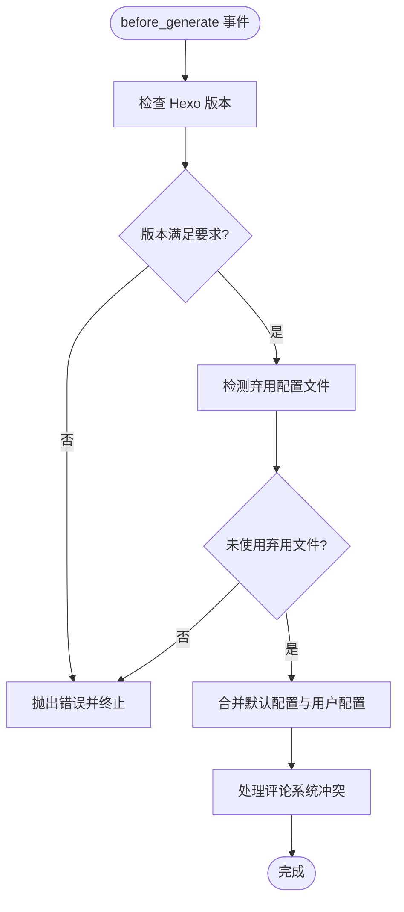
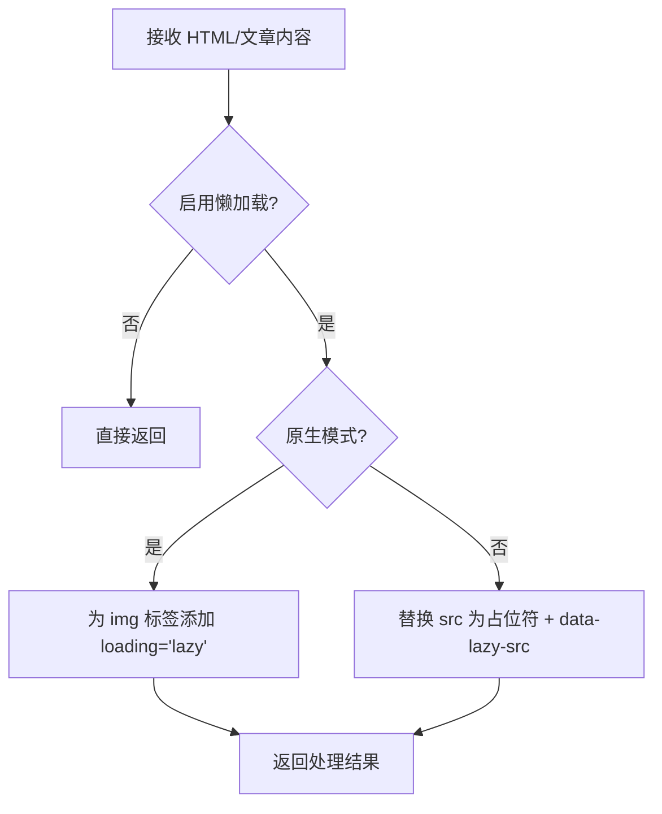
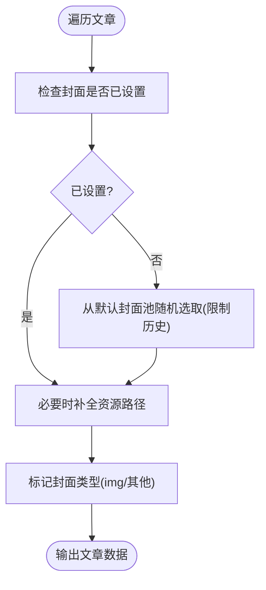
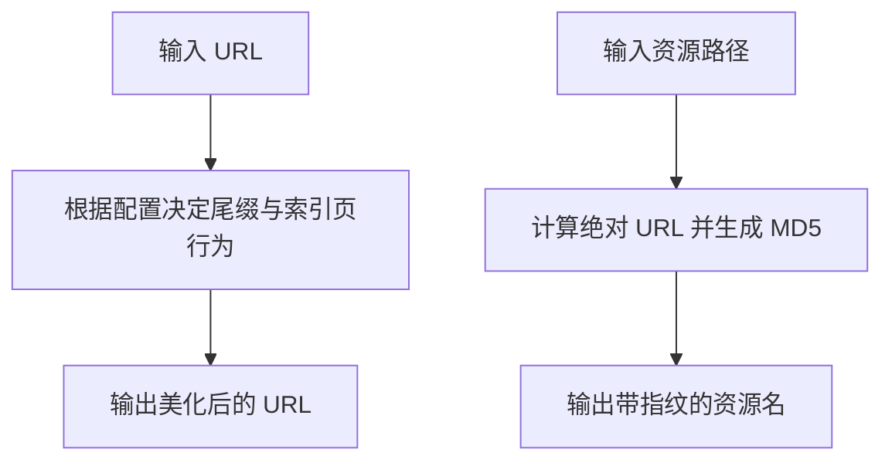
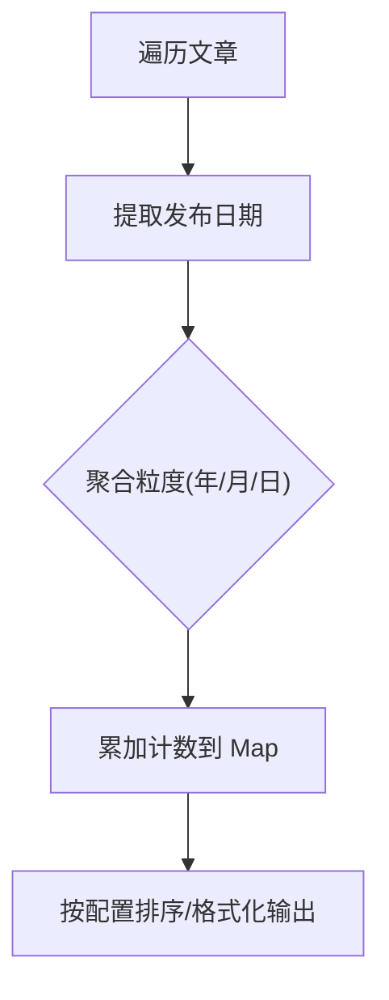
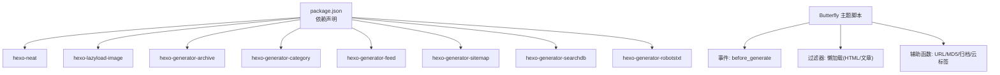

# 静态文件生成流程

<cite>
**本文档引用的文件**
- [_config.yml](file://_config.yml)
- [package.json](file://package.json)
- [themes/butterfly/_config.yml](file://themes/butterfly/_config.yml)
- [themes/butterfly/scripts/events/init.js](file://themes/butterfly/scripts/events/init.js)
- [themes/butterfly/scripts/filters/post_lazyload.js](file://themes/butterfly/scripts/filters/post_lazyload.js)
- [themes/butterfly/scripts/filters/random_cover.js](file://themes/butterfly/scripts/filters/random_cover.js)
- [themes/butterfly/scripts/helpers/page.js](file://themes/butterfly/scripts/helpers/page.js)
- [themes/butterfly/scripts/helpers/getArchiveLength.js](file://themes/butterfly/scripts/helpers/getArchiveLength.js)
- [themes/butterfly/scripts/helpers/aside_archives.js](file://themes/butterfly/scripts/helpers/aside_archives.js)
- [themes/butterfly/scripts/common/default_config.js](file://themes/butterfly/scripts/common/default_config.js)
- [deploy-actions.bat](file://deploy-actions.bat)
- [.github/dependabot.yml](file://.github/dependabot.yml)
</cite>

## 目录
1. [简介](#简介)
2. [项目结构](#项目结构)
3. [核心组件](#核心组件)
4. [架构总览](#架构总览)
5. [详细组件分析](#详细组件分析)
6. [依赖关系分析](#依赖关系分析)
7. [性能考虑](#性能考虑)
8. [故障排除指南](#故障排除指南)
9. [结论](#结论)
10. [附录](#附录)

## 简介
本文件系统性阐述该 Hexo 项目的静态文件生成流程，覆盖从内容输入到静态文件输出的完整链路：文件扫描、内容解析、模板渲染、静态资源处理与优化、输出目录结构设计、URL 重写与命名规范、以及构建性能监控与调试方法。文档同时解释 Hexo generate 命令的执行流程（任务调度、并发处理与错误恢复）、构建优化策略（HTML/CSS/JS 压缩、图片懒加载与占位、资源合并）与输出目录结构的设计原则。

## 项目结构
该项目采用典型的 Hexo + 主题（Butterfly）组织方式：
- 根配置与站点配置：通过根级配置控制站点元数据、URL 规则、目录结构、分页与扩展等。
- 主题配置：Butterfly 主题提供丰富的 UI 与功能开关，通过主题配置文件统一管理。
- 主题脚本：包含事件钩子、过滤器与辅助函数，贯穿生成期的数据处理与渲染优化。
- 资源目录：source 下的内容（文章、页面、静态资源）与主题资源（CSS/JS/Pug 模板）共同构成最终输出。

图表来源
- [_config.yml:1-173](file://_config.yml#L1-L173)
- [themes/butterfly/_config.yml:1-1137](file://themes/butterfly/_config.yml#L1-L1137)

章节来源
- [_config.yml:1-173](file://_config.yml#L1-L173)
- [package.json:1-42](file://package.json#L1-L42)

## 核心组件
- 站点配置与 URL 规则
  - URL 与永久链接：站点 URL、永久链接模板与美化 URL 的尾缀设置。
  - 目录结构：source_dir/public_dir/archive/tag/category 等目录名与归档路径。
  - 分页与首页：首页每页数量、分页目录、排序规则。
- 主题配置与功能开关
  - 导航、代码块、社交、头图、封面、评论、统计、广告、懒加载等。
  - CDN 提供商与版本控制、PWA、Open Graph 结构化数据等。
- 生成期优化插件
  - hexo-neat：HTML/CSS/JS 压缩与排除规则；highlight/prismjs 配置。
  - hexo-lazyload-image：图片懒加载与占位符替换。
- 主题脚本
  - 事件钩子：before_generate 中检查 Hexo 版本、合并默认配置、处理评论冲突。
  - 过滤器：HTML 后处理（懒加载）、文章内容后处理（懒加载）。
  - 辅助函数：URL 美化、MD5、云标签、归档长度、侧边栏归档、页面类型判断等。

章节来源
- [_config.yml:13-127](file://_config.yml#L13-L127)
- [themes/butterfly/_config.yml:1-1137](file://themes/butterfly/_config.yml#L1-L1137)
- [themes/butterfly/scripts/events/init.js:1-87](file://themes/butterfly/scripts/events/init.js#L1-L87)
- [themes/butterfly/scripts/filters/post_lazyload.js:1-41](file://themes/butterfly/scripts/filters/post_lazyload.js#L1-L41)
- [themes/butterfly/scripts/helpers/page.js:1-194](file://themes/butterfly/scripts/helpers/page.js#L1-L194)

## 架构总览
下图展示从命令触发到静态文件输出的关键交互：

图表来源
- [themes/butterfly/scripts/events/init.js:79-86](file://themes/butterfly/scripts/events/init.js#L79-L86)
- [themes/butterfly/scripts/filters/post_lazyload.js:29-40](file://themes/butterfly/scripts/filters/post_lazyload.js#L29-L40)
- [themes/butterfly/scripts/helpers/page.js:85-87](file://themes/butterfly/scripts/helpers/page.js#L85-L87)

## 详细组件分析

### 组件 A：生成前初始化与配置合并
- 功能要点
  - 检查 Hexo 版本是否满足最低要求，避免不兼容问题。
  - 检测弃用配置文件，提示迁移至新格式。
  - 缓存默认配置，避免重复读取。
  - 合并默认配置与用户配置，保证字段完整性。
  - 处理评论系统冲突（如 Disqus 与 Disqusjs 同时启用时仅保留第一个）。
- 性能与可靠性
  - 使用缓存减少文件 I/O。
  - 在 before_generate 阶段集中处理，避免后续流程中重复校验。

图表来源
- [themes/butterfly/scripts/events/init.js:10-86](file://themes/butterfly/scripts/events/init.js#L10-L86)
- [themes/butterfly/scripts/common/default_config.js:1-602](file://themes/butterfly/scripts/common/default_config.js#L1-L602)

章节来源
- [themes/butterfly/scripts/events/init.js:1-87](file://themes/butterfly/scripts/events/init.js#L1-L87)
- [themes/butterfly/scripts/common/default_config.js:1-602](file://themes/butterfly/scripts/common/default_config.js#L1-L602)

### 组件 B：图片懒加载与占位优化
- 功能要点
  - 支持原生 loading=lazy 与自定义占位符两种模式。
  - 对 img 标签进行精确替换，避免对 script 内部内容误伤。
  - 支持按站点或文章范围启用，分别在 HTML 后处理与文章内容后处理阶段生效。
- 优化效果
  - 减少首屏带宽与渲染压力，提升页面加载性能。
  - 通过占位符降低空白闪烁体验。

图表来源
- [themes/butterfly/scripts/filters/post_lazyload.js:11-40](file://themes/butterfly/scripts/filters/post_lazyload.js#L11-L40)

章节来源
- [themes/butterfly/scripts/filters/post_lazyload.js:1-41](file://themes/butterfly/scripts/filters/post_lazyload.js#L1-L41)

### 组件 C：随机封面与资源路径处理
- 功能要点
  - 为未设置封面的文章随机分配封面，避免空缺。
  - 支持数组形式的默认封面轮换，并限制历史记录避免连续重复。
  - 当启用文章资源文件夹时，自动为相对路径的图片补全资源路径。
- 数据流
  - 生成器遍历文章，维护前后文指针，注入封面类型与路径。

图表来源
- [themes/butterfly/scripts/filters/random_cover.js:7-90](file://themes/butterfly/scripts/filters/random_cover.js#L7-L90)

章节来源
- [themes/butterfly/scripts/filters/random_cover.js:1-91](file://themes/butterfly/scripts/filters/random_cover.js#L1-L91)

### 组件 D：URL 美化与静态资源哈希
- 功能要点
  - 使用美化 URL 工具去除 index.html 与 .html 尾缀，保持干净 URL。
  - 通过 MD5 辅助函数为静态资源生成指纹，便于浏览器缓存与更新。
- 应用场景
  - 页面与文章 URL 的美化与规范化。
  - 资源文件名附加指纹，实现强缓存与增量更新。

图表来源
- [themes/butterfly/scripts/helpers/page.js:85-91](file://themes/butterfly/scripts/helpers/page.js#L85-L91)

章节来源
- [themes/butterfly/scripts/helpers/page.js:1-194](file://themes/butterfly/scripts/helpers/page.js#L1-L194)

### 组件 E：归档与侧边栏归档统计
- 功能要点
  - 归档长度辅助函数：按年/月/日聚合统计，支持多粒度查询。
  - 侧边栏归档：按月/年聚合文章，支持排序、格式化与计数显示。
- 数据结构
  - 使用 Map 维护时间维度计数，避免重复遍历。

图表来源
- [themes/butterfly/scripts/helpers/getArchiveLength.js:1-46](file://themes/butterfly/scripts/helpers/getArchiveLength.js#L1-L46)
- [themes/butterfly/scripts/helpers/aside_archives.js:1-50](file://themes/butterfly/scripts/helpers/aside_archives.js#L1-L50)

章节来源
- [themes/butterfly/scripts/helpers/getArchiveLength.js:1-46](file://themes/butterfly/scripts/helpers/getArchiveLength.js#L1-L46)
- [themes/butterfly/scripts/helpers/aside_archives.js:1-50](file://themes/butterfly/scripts/helpers/aside_archives.js#L1-L50)

### 组件 F：构建优化与压缩策略
- 站点配置中的优化开关
  - HTML 压缩、CSS 压缩、JS 压缩与混淆、排除规则等。
  - highlight/prismjs 的行号、预处理、自动检测等。
- 主题与插件配合
  - hexo-neat 提供 HTML/CSS/JS 压缩与排除匹配。
  - hexo-lazyload-image 与 hexo-util 的集成用于图片懒加载与占位。
- 资源合并建议
  - 将多个 CSS/JS 合并为单文件以减少请求数，结合指纹命名实现缓存失效控制。

章节来源
- [_config.yml:157-173](file://_config.yml#L157-L173)
- [themes/butterfly/_config.yml:1-1137](file://themes/butterfly/_config.yml#L1-L1137)

## 依赖关系分析
- 插件生态
  - hexo-neat：提供 HTML/CSS/JS 压缩能力。
  - hexo-lazyload-image：提供图片懒加载能力。
  - 各类生成器（archive/category/feed/sitemap/searchdb/robots）负责生成对应页面。
- 主题与核心
  - 主题脚本在 before_generate 阶段完成环境检查与配置合并，确保后续流程稳定。
  - 过滤器与辅助函数贯穿渲染周期，影响最终输出质量与性能。

图表来源
- [package.json:16-36](file://package.json#L16-L36)
- [themes/butterfly/scripts/events/init.js:79-86](file://themes/butterfly/scripts/events/init.js#L79-L86)
- [themes/butterfly/scripts/filters/post_lazyload.js:29-40](file://themes/butterfly/scripts/filters/post_lazyload.js#L29-L40)
- [themes/butterfly/scripts/helpers/page.js:85-91](file://themes/butterfly/scripts/helpers/page.js#L85-L91)

章节来源
- [package.json:1-42](file://package.json#L1-L42)

## 性能考虑
- 构建优化
  - 启用 hexo-neat 的 HTML/CSS/JS 压缩，合理配置排除列表，避免对第三方库的破坏。
  - 使用图片懒加载与占位符，降低首屏渲染成本。
  - 利用资源指纹与 CDN，提升缓存命中率。
- 目录与命名
  - 通过美化 URL 与尾缀控制，减少冗余路径与文件名长度。
  - 归档与分类页面按需分页，避免单页过大。
- 调试与监控
  - 使用脚本输出构建进度与耗时信息，定位瓶颈。
  - 通过日志级别与错误捕获，快速发现配置或插件异常。

[本节为通用指导，无需特定文件引用]

## 故障排除指南
- 常见问题
  - Hexo 版本过低：事件钩子会在 before_generate 阶段检查并报错，升级至推荐版本。
  - 弃用配置文件：检测到旧版配置会提示迁移，避免运行时冲突。
  - 评论系统冲突：当同时启用 Disqus 与 Disqusjs 时，仅保留第一个，避免重复加载。
- 排查步骤
  - 查看构建日志中的错误与警告信息。
  - 检查主题配置与站点配置的字段拼写与类型。
  - 验证插件版本与 Node.js 兼容性。
- 自动化辅助
  - 使用部署脚本一键清理与生成，确保环境一致性。
  - 依赖自动更新配置（dependabot），定期评估安全与兼容性更新。

章节来源
- [themes/butterfly/scripts/events/init.js:10-32](file://themes/butterfly/scripts/events/init.js#L10-L32)
- [deploy-actions.bat:103-116](file://deploy-actions.bat#L103-L116)
- [.github/dependabot.yml:1-8](file://.github/dependabot.yml#L1-L8)

## 结论
该 Hexo 项目通过清晰的配置体系、完善的主题脚本与插件生态，实现了从内容输入到静态文件输出的高效流水线。生成前的环境检查与配置合并保障了稳定性；懒加载与压缩策略提升了性能；美化 URL 与指纹命名优化了可访问性与缓存效率。结合自动化脚本与依赖更新策略，整体构建流程具备良好的可维护性与可扩展性。

[本节为总结，无需特定文件引用]

## 附录

### A. 输出目录结构与 URL 设计原则
- 目录结构
  - public：最终静态文件输出目录，包含 HTML 页面、CSS/JS、图片与资源。
  - source：内容与静态资源源目录，遵循配置中的目录映射。
- URL 重写与命名
  - 通过美化 URL 与尾缀控制，去除 index.html 与 .html 尾缀，保持简洁。
  - 永久链接模板控制文章与页面的层级路径，结合分页目录实现清晰的导航。

章节来源
- [_config.yml:21-29](file://_config.yml#L21-L29)
- [_config.yml:13-19](file://_config.yml#L13-L19)

### B. 构建命令与脚本
- 常用命令
  - build：执行 hexo generate。
  - clean：清理 public 目录。
  - server/dev/admin：启动本地服务器，支持调试与后台访问。
- 自动化脚本
  - 部署脚本提供菜单式操作，支持一键清理与生成、本地服务启动与推送部署。

章节来源
- [package.json:6-12](file://package.json#L6-L12)
- [deploy-actions.bat:1-130](file://deploy-actions.bat#L1-L130)