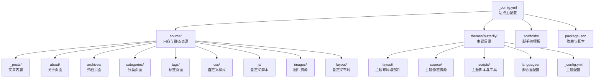
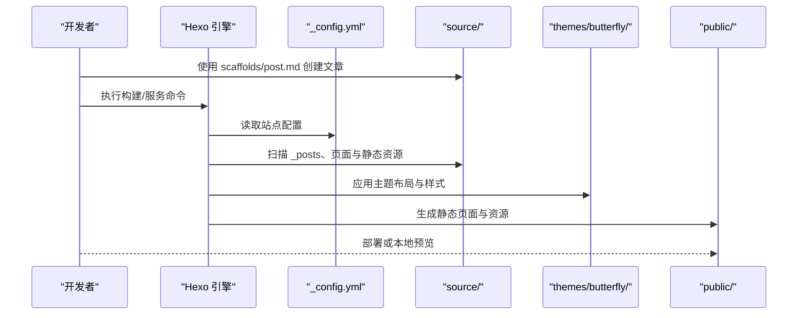
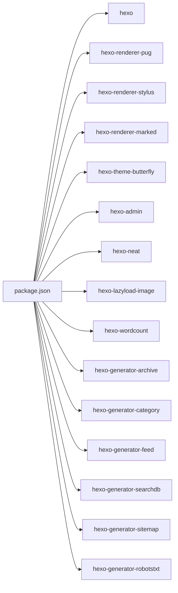

# 文件结构

<cite>
**本文引用的文件**
- [_config.yml](file://_config.yml)
- [_config.butterfly.yml](file://_config.butterfly.yml)
- [package.json](file://package.json)
- [themes/butterfly/_config.yml](file://themes/butterfly/_config.yml)
- [themes/butterfly/package.json](file://themes/butterfly/package.json)
- [source/_posts/hello-world.md](file://source/_posts/hello-world.md)
- [source/about/index.md](file://source/about/index.md)
- [themes/butterfly/layout/includes/layout.pug](file://themes/butterfly/layout/includes/layout.pug)
- [themes/butterfly/source/css/var.styl](file://themes/butterfly/source/css/var.styl)
- [themes/butterfly/scripts/common/default_config.js](file://themes/butterfly/scripts/common/default_config.js)
- [themes/butterfly/source/js/main.js](file://themes/butterfly/source/js/main.js)
- [scaffolds/post.md](file://scaffolds/post.md)
</cite>

## 目录
1. [简介](#简介)
2. [项目结构](#项目结构)
3. [核心组件](#核心组件)
4. [架构总览](#架构总览)
5. [详细组件分析](#详细组件分析)
6. [依赖分析](#依赖分析)
7. [性能考虑](#性能考虑)
8. [故障排查指南](#故障排查指南)
9. [结论](#结论)

## 简介
本文件面向开发者，系统性梳理该 Hexo 博客项目的文件结构与组织原则，重点覆盖以下方面：
- source 目录下的内容文件（_posts）、页面（about、archives、categories、tags）及静态资源（css、js、images、layout）的职责与命名规范
- themes 目录下 Butterfly 主题的布局、样式、脚本与配置文件的组织方式
- 配置文件位置与用途（根配置、主题配置、包管理配置）
- 目录树结构图与每个文件夹的具体说明，帮助快速理解项目整体结构

## 项目结构
该项目采用标准 Hexo 结构，结合 Butterfly 主题进行定制化扩展。根目录包含站点配置、主题、脚手架模板与部署脚本；source 目录存放内容与静态资源；themes 目录包含主题及其资源与脚本。

图表来源
- [_config.yml](file://_config.yml)
- [themes/butterfly/_config.yml](file://themes/butterfly/_config.yml)
- [package.json](file://package.json)

章节来源
- [_config.yml:1-173](file://_config.yml#L1-L173)
- [themes/butterfly/_config.yml:1-1137](file://themes/butterfly/_config.yml#L1-L1137)
- [package.json:1-42](file://package.json#L1-L42)

## 核心组件
- 站点主配置：定义站点元数据、URL 规则、目录映射、分页、主题选择、部署开关等
- 主题配置：定义导航、封面、代码块、侧边栏卡片、搜索、评论、分析、广告等主题功能与外观
- 内容与静态资源：文章、页面、CSS/JS/图片等
- 脚手架模板：统一新建文章的 Front Matter 模板
- 包管理与脚本：依赖声明与构建/服务命令

章节来源
- [_config.yml:4-85](file://_config.yml#L4-L85)
- [_config.butterfly.yml:1-690](file://_config.butterfly.yml#L1-L690)
- [package.json:6-12](file://package.json#L6-L12)

## 架构总览
Hexo 渲染流程概览：用户通过 scaffolds 新建文章 → Hexo 根据 _config.yml 解析 source 目录 → 应用 Butterfly 主题布局与样式 → 生成静态文件至 public 目录。

图表来源
- [_config.yml:21-30](file://_config.yml#L21-L30)
- [themes/butterfly/layout/includes/layout.pug:1-59](file://themes/butterfly/layout/includes/layout.pug#L1-L59)
- [package.json:6-12](file://package.json#L6-L12)

## 详细组件分析

### source 目录
- _posts：存放文章内容，采用 Markdown 格式，Front Matter 中包含标题、日期等元数据
- about：单页 about/index.md，用于展示个人信息与技能
- archives/categories/tags：归档、分类、标签页面，由 Hexo 生成
- css/js/images/layout：自定义样式、脚本、图片资源与自定义布局模板

章节来源
- [source/_posts/hello-world.md:1-39](file://source/_posts/hello-world.md#L1-L39)
- [source/about/index.md:1-49](file://source/about/index.md#L1-L49)
- [_config.yml:21-30](file://_config.yml#L21-L30)

### themes 目录
- layout：主题布局与部件（head、header、sidebar、footer、widget、third-party 等），通过 Pug 模板组合
- source：主题静态资源（css、js、img），与主题变量、混入、第三方库等
- scripts：主题脚本（helpers、events、filters、tag 插件等）
- languages：多语言文案（如 zh-CN）
- _config.yml：主题默认配置与可选功能开关

章节来源
- [themes/butterfly/layout/includes/layout.pug:1-59](file://themes/butterfly/layout/includes/layout.pug#L1-L59)
- [themes/butterfly/source/css/var.styl:1-233](file://themes/butterfly/source/css/var.styl#L1-L233)
- [themes/butterfly/scripts/common/default_config.js:1-602](file://themes/butterfly/scripts/common/default_config.js#L1-L602)
- [themes/butterfly/source/js/main.js:1-800](file://themes/butterfly/source/js/main.js#L1-L800)

### 配置文件
- _config.yml：站点主配置，定义目录映射、分页、主题、搜索、Feed、Robots 等
- _config.butterfly.yml：主题配置，涵盖导航、封面、侧边栏卡片、搜索、评论、分析、广告、注入等
- themes/butterfly/_config.yml：主题默认配置（与 _config.butterfly.yml 对应项一致）
- package.json：Hexo 版本、依赖与脚本命令

章节来源
- [_config.yml:1-173](file://_config.yml#L1-L173)
- [_config.butterfly.yml:1-690](file://_config.butterfly.yml#L1-L690)
- [themes/butterfly/_config.yml:1-1137](file://themes/butterfly/_config.yml#L1-L1137)
- [package.json:1-42](file://package.json#L1-L42)

### 脚手架模板
- scaffolds/post.md：统一新建文章的 Front Matter 模板，包含标题、日期与标签占位符

章节来源
- [scaffolds/post.md:1-6](file://scaffolds/post.md#L1-L6)

## 依赖分析
- Hexo 核心与渲染器：hexo、hexo-renderer-pug、hexo-renderer-stylus、hexo-renderer-marked
- 主题与扩展：hexo-theme-butterfly、hexo-admin、hexo-neat、hexo-lazyload-image、hexo-wordcount
- 生成器与插件：hexo-generator-archive、hexo-generator-category、hexo-generator-feed、hexo-generator-searchdb、hexo-generator-sitemap、hexo-generator-robotstxt

图表来源
- [package.json:16-37](file://package.json#L16-L37)

章节来源
- [package.json:16-37](file://package.json#L16-L37)

## 性能考虑
- 压缩与优化：启用 neat 压缩 HTML/CSS/JS，避免对已压缩文件重复处理
- 懒加载：开启图片懒加载，减少首屏资源压力
- CDN：主题支持内部与第三方 CDN 提供商配置，可按需启用版本号
- 代码高亮：根据 highlight/prismjs 配置控制行号、复制按钮、全屏等交互

章节来源
- [_config.yml:157-173](file://_config.yml#L157-L173)
- [_config.butterfly.yml:684-690](file://_config.butterfly.yml#L684-L690)
- [themes/butterfly/scripts/common/default_config.js:566-572](file://themes/butterfly/scripts/common/default_config.js#L566-L572)

## 故障排查指南
- 构建失败：检查 Hexo 版本与 Node.js 版本要求，确保依赖安装完整
- 主题配置错误：核对主题配置项与默认值，确认路径与资源存在
- 静态资源 404：确认 source 与 themes 中资源路径与引用一致
- 搜索/Feed/站点地图异常：检查对应生成器与配置项是否启用

章节来源
- [package.json:38-40](file://package.json#L38-L40)
- [_config.yml:84-127](file://_config.yml#L84-L127)
- [_config.butterfly.yml:299-320](file://_config.butterfly.yml#L299-L320)

## 结论
该博客项目遵循 Hexo 标准结构，结合 Butterfly 主题实现现代化、可定制的静态博客。通过清晰的目录划分、完善的配置体系与主题脚本，开发者可以快速新增内容、调整样式与功能。建议在新增内容时遵循现有命名与 Front Matter 规范，并在修改主题配置前备份当前配置，以确保稳定迭代。