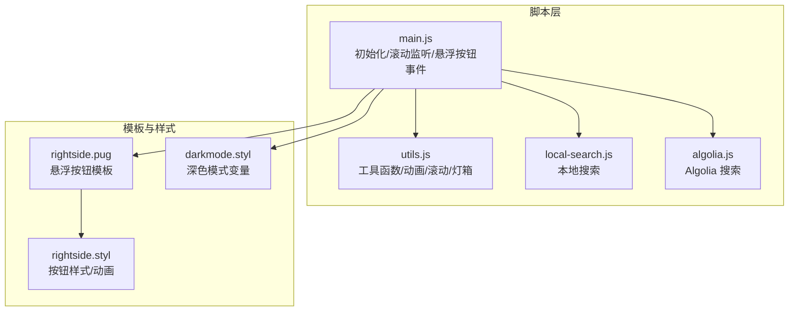
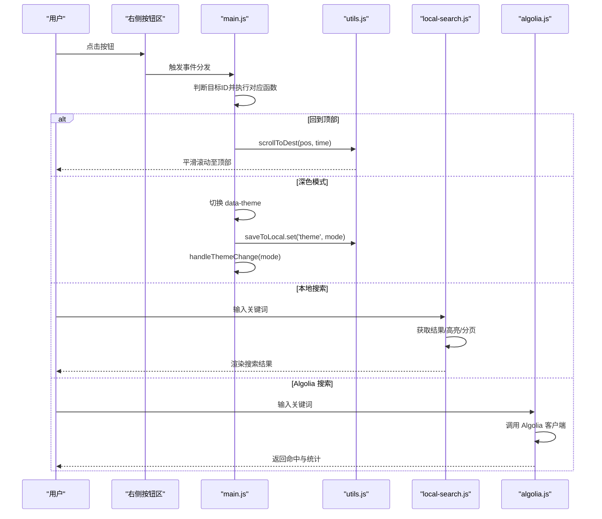
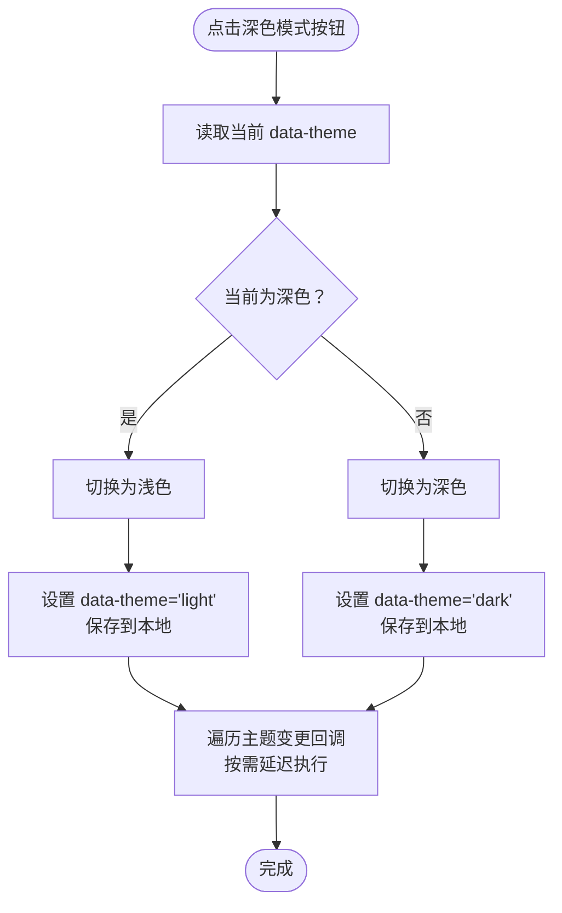
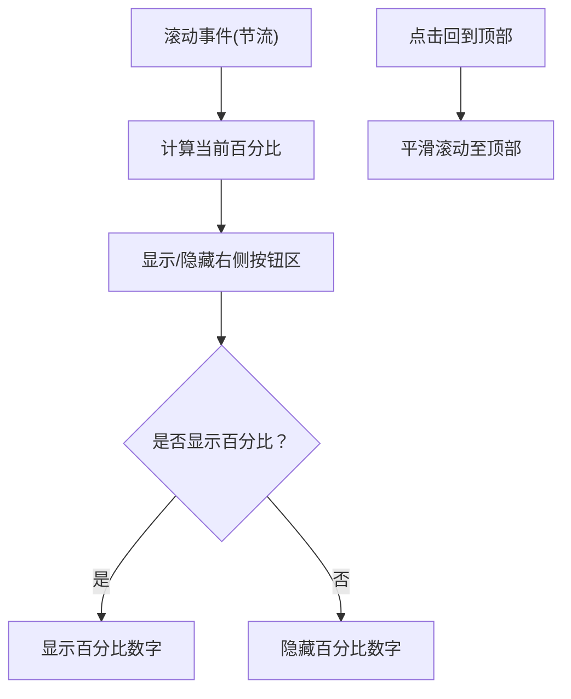
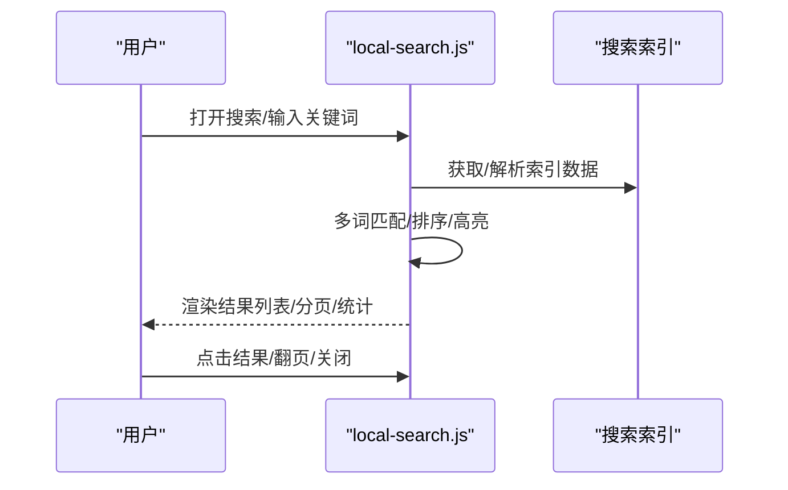
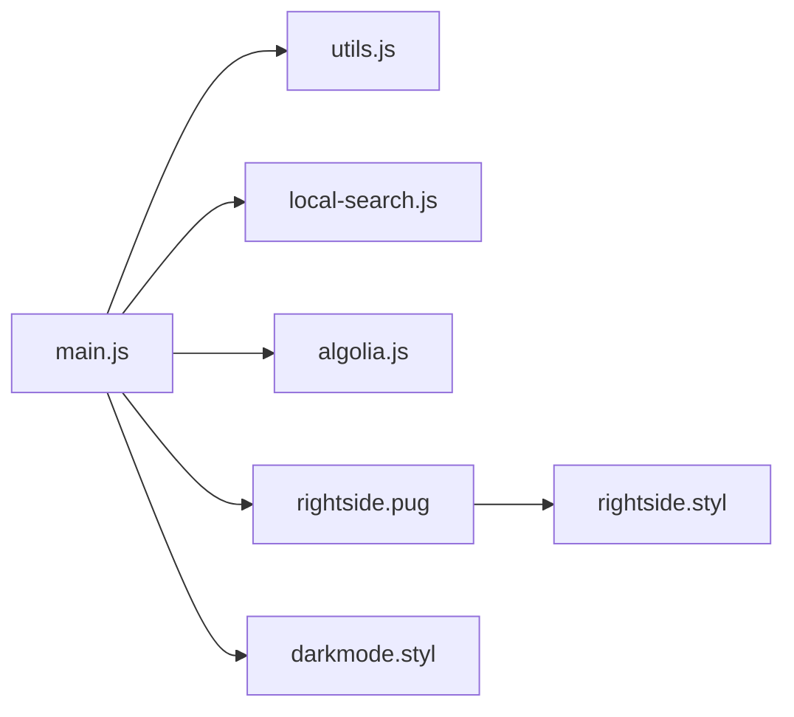

# 交互功能系统

<cite>
**本文引用的文件**
- [themes/butterfly/source/js/main.js](file://themes/butterfly/source/js/main.js)
- [themes/butterfly/source/js/utils.js](file://themes/butterfly/source/js/utils.js)
- [themes/butterfly/source/js/search/local-search.js](file://themes/butterfly/source/js/search/local-search.js)
- [themes/butterfly/source/js/search/algolia.js](file://themes/butterfly/source/js/search/algolia.js)
- [themes/butterfly/layout/includes/rightside.pug](file://themes/butterfly/layout/includes/rightside.pug)
- [themes/butterfly/source/css/_mode/darkmode.styl](file://themes/butterfly/source/css/_mode/darkmode.styl)
- [themes/butterfly/source/css/_layout/rightside.styl](file://themes/butterfly/source/css/_layout/rightside.styl)
- [themes/butterfly/scripts/common/default_config.js](file://themes/butterfly/scripts/common/default_config.js)
</cite>

## 目录
1. [简介](#简介)
2. [项目结构](#项目结构)
3. [核心组件](#核心组件)
4. [架构总览](#架构总览)
5. [详细组件分析](#详细组件分析)
6. [依赖关系分析](#依赖关系分析)
7. [性能考量](#性能考量)
8. [故障排查指南](#故障排查指南)
9. [结论](#结论)
10. [附录](#附录)

## 简介
本文件面向博客系统的交互功能，围绕以下主题进行系统化说明与实践指导：深色模式切换机制、阅读进度条实现、本地搜索功能、图片灯箱效果；同时覆盖右下角悬浮按钮系统、回到顶部功能、页面滚动监听、动画效果配置，并给出 JavaScript 事件处理、DOM 操作优化、用户体验增强策略及可扩展性建议。

## 项目结构
交互功能主要分布在前端脚本与样式层：
- 脚本层：主入口脚本负责初始化、滚动监听、TOC/锚点联动、悬浮按钮事件分发；工具库封装通用交互能力（节流/防抖、平滑滚动、加载指示、图片灯箱等）；搜索模块分别实现本地搜索与 Algolia 搜索。
- 样式层：深色模式通过 CSS 变量控制；右侧悬浮按钮区采用固定定位与过渡动画；滚动百分比在按钮上以数字形式展示。

图表来源
- [themes/butterfly/source/js/main.js:1-988](file://themes/butterfly/source/js/main.js#L1-L988)
- [themes/butterfly/source/js/utils.js:1-339](file://themes/butterfly/source/js/utils.js#L1-L339)
- [themes/butterfly/source/js/search/local-search.js:1-568](file://themes/butterfly/source/js/search/local-search.js#L1-L568)
- [themes/butterfly/source/js/search/algolia.js:1-563](file://themes/butterfly/source/js/search/algolia.js#L1-L563)
- [themes/butterfly/layout/includes/rightside.pug:1-54](file://themes/butterfly/layout/includes/rightside.pug#L1-L54)
- [themes/butterfly/source/css/_layout/rightside.styl:1-109](file://themes/butterfly/source/css/_layout/rightside.styl#L1-L109)
- [themes/butterfly/source/css/_mode/darkmode.styl:1-205](file://themes/butterfly/source/css/_mode/darkmode.styl#L1-L205)

章节来源
- [themes/butterfly/source/js/main.js:1-988](file://themes/butterfly/source/js/main.js#L1-L988)
- [themes/butterfly/layout/includes/rightside.pug:1-54](file://themes/butterfly/layout/includes/rightside.pug#L1-L54)

## 核心组件
- 深色模式切换：通过切换根节点的主题属性触发 CSS 变量切换，配合主题变更回调与本地存储持久化。
- 阅读进度条：在右侧“回到顶部”按钮区域显示滚动百分比，支持悬停显隐与缩放动画。
- 本地搜索：预取索引数据，基于关键词匹配与片段高亮，支持分页与 URL 高亮同步。
- 图片灯箱：支持 mediumZoom 与 Fancybox 两种方案，自动包裹图片为可点击放大元素。
- 右侧悬浮按钮系统：统一事件分发器，支持阅读模式、深色模式、隐藏侧栏、移动端目录、回到顶部、评论跳转等。
- 页面滚动监听：节流计算滚动方向与位置，动态控制导航栏与右侧按钮显隐。

章节来源
- [themes/butterfly/source/js/main.js:422-726](file://themes/butterfly/source/js/main.js#L422-L726)
- [themes/butterfly/source/js/utils.js:119-301](file://themes/butterfly/source/js/utils.js#L119-L301)
- [themes/butterfly/source/js/search/local-search.js:1-568](file://themes/butterfly/source/js/search/local-search.js#L1-L568)
- [themes/butterfly/layout/includes/rightside.pug:1-54](file://themes/butterfly/layout/includes/rightside.pug#L1-L54)
- [themes/butterfly/source/css/_layout/rightside.styl:59-109](file://themes/butterfly/source/css/_layout/rightside.styl#L59-L109)

## 架构总览
整体交互流程由“初始化 → 事件绑定 → 动画与状态切换 → 数据加载/搜索 → 用户反馈”的闭环构成。核心路径如下：

图表来源
- [themes/butterfly/source/js/main.js:646-726](file://themes/butterfly/source/js/main.js#L646-L726)
- [themes/butterfly/source/js/utils.js:119-157](file://themes/butterfly/source/js/utils.js#L119-L157)
- [themes/butterfly/source/js/search/local-search.js:237-567](file://themes/butterfly/source/js/search/local-search.js#L237-L567)
- [themes/butterfly/source/js/search/algolia.js:1-563](file://themes/butterfly/source/js/search/algolia.js#L1-L563)

## 详细组件分析

### 深色模式切换机制
- 切换逻辑：根据当前根节点的主题值决定切换目标，设置 data-theme 并保存到本地存储；随后遍历全局主题变更回调，按需延迟或立即执行第三方组件的适配逻辑。
- 主题变量：深色模式通过 CSS 变量集中管理颜色体系，确保组件（如 TOC、评论区、代码块等）在不同主题下保持一致的视觉风格。
- 自动模式：若启用系统偏好检测且未手动切换，将跟随系统深浅模式变化。

图表来源
- [themes/butterfly/source/js/main.js:664-675](file://themes/butterfly/source/js/main.js#L664-L675)
- [themes/butterfly/source/js/main.js:626-641](file://themes/butterfly/source/js/main.js#L626-L641)
- [themes/butterfly/source/css/_mode/darkmode.styl:1-205](file://themes/butterfly/source/css/_mode/darkmode.styl#L1-L205)

章节来源
- [themes/butterfly/source/js/main.js:626-675](file://themes/butterfly/source/js/main.js#L626-L675)
- [themes/butterfly/source/css/_mode/darkmode.styl:1-205](file://themes/butterfly/source/css/_mode/darkmode.styl#L1-L205)

### 阅读进度条与回到顶部
- 进度条：在“回到顶部”按钮内显示滚动百分比，当接近底部时隐藏百分比数字，仅保留图标；悬停时图标淡出、百分比淡入并缩放出现。
- 回到顶部：点击后调用平滑滚动函数，优先使用原生 scrollBehavior，否则回退到 requestAnimationFrame 动画。
- 显隐策略：滚动超过阈值时显示右侧按钮区；根据滚动方向控制导航栏显隐。

图表来源
- [themes/butterfly/source/js/main.js:422-503](file://themes/butterfly/source/js/main.js#L422-L503)
- [themes/butterfly/source/js/main.js:687-689](file://themes/butterfly/source/js/main.js#L687-L689)
- [themes/butterfly/source/js/utils.js:119-157](file://themes/butterfly/source/js/utils.js#L119-L157)
- [themes/butterfly/source/css/_layout/rightside.styl:59-109](file://themes/butterfly/source/css/_layout/rightside.styl#L59-L109)

章节来源
- [themes/butterfly/source/js/main.js:422-503](file://themes/butterfly/source/js/main.js#L422-L503)
- [themes/butterfly/source/js/utils.js:119-157](file://themes/butterfly/source/js/utils.js#L119-L157)
- [themes/butterfly/layout/includes/rightside.pug:52-54](file://themes/butterfly/layout/includes/rightside.pug#L52-L54)
- [themes/butterfly/source/css/_layout/rightside.styl:59-109](file://themes/butterfly/source/css/_layout/rightside.styl#L59-L109)

### 本地搜索功能
- 数据加载：支持 XML/JSON 两种格式，预取完成后清理加载态并触发“搜索已就绪”事件。
- 匹配算法：对标题与内容进行多词匹配，合并命中区间，按命中数量与片段质量排序，截取高亮片段。
- 高亮策略：支持 URL 参数高亮同步；在结果列表中包裹 mark 元素；支持分页与响应式布局。
- 交互细节：输入框失焦时关闭搜索对话框；Esc 键快速关闭；移动端高度自适应。

图表来源
- [themes/butterfly/source/js/search/local-search.js:173-235](file://themes/butterfly/source/js/search/local-search.js#L173-L235)
- [themes/butterfly/source/js/search/local-search.js:442-479](file://themes/butterfly/source/js/search/local-search.js#L442-L479)
- [themes/butterfly/source/js/search/local-search.js:492-520](file://themes/butterfly/source/js/search/local-search.js#L492-L520)

章节来源
- [themes/butterfly/source/js/search/local-search.js:1-568](file://themes/butterfly/source/js/search/local-search.js#L1-L568)

### Algolia 搜索功能
- 客户端初始化：兼容 v4/v5 多种客户端形态，按可用性选择搜索方法。
- 结果渲染：提取高亮标题与内容片段，平衡 HTML 标签完整性；支持分页与统计信息展示。
- 交互细节：输入防抖、表单提交、Esc 关闭、移动端高度适配；Pjax 刷新后自动重绑事件。

章节来源
- [themes/butterfly/source/js/search/algolia.js:1-563](file://themes/butterfly/source/js/search/algolia.js#L1-L563)

### 图片灯箱效果
- 方案选择：支持 mediumZoom 与 Fancybox；Fancybox 将图片包裹为可点击链接并绑定画廊行为。
- 自动集成：在无限画廊渲染完成后为新图集绑定灯箱；支持缩放、旋转、翻转等工具条。
- 性能注意：避免重复绑定，首次运行后标记全局状态。

章节来源
- [themes/butterfly/source/js/utils.js:172-258](file://themes/butterfly/source/js/utils.js#L172-L258)
- [themes/butterfly/source/js/main.js:262-264](file://themes/butterfly/source/js/main.js#L262-L264)
- [themes/butterfly/source/js/main.js:350-351](file://themes/butterfly/source/js/main.js#L350-L351)

### 右下角悬浮按钮系统
- 模板生成：根据主题配置动态渲染按钮集合，支持“隐藏/显示”两组按钮与设置齿轮按钮。
- 事件分发：统一在右侧容器上绑定点击事件，根据目标元素 ID 分派到具体处理函数（阅读模式、深色模式、隐藏侧栏、移动端目录、回到顶部、评论跳转等）。
- 动画与样式：按钮采用固定定位与过渡动画；百分比数字与图标在 hover 时互斥显隐；移动端目录按钮在窄屏显示。

章节来源
- [themes/butterfly/layout/includes/rightside.pug:1-54](file://themes/butterfly/layout/includes/rightside.pug#L1-L54)
- [themes/butterfly/source/js/main.js:721-726](file://themes/butterfly/source/js/main.js#L721-L726)
- [themes/butterfly/source/css/_layout/rightside.styl:1-109](file://themes/butterfly/source/css/_layout/rightside.styl#L1-L109)

### 页面滚动监听与 TOC/锚点联动
- 滚动监听：节流处理滚动事件，计算滚动方向与百分比，控制导航栏与右侧按钮显隐。
- TOC 联动：缓存标题位置，滚动时查找当前段落并激活对应目录项；支持自动滚动居中与展开状态继承。
- 锚点更新：可选开启锚点更新，改变 URL hash 但不刷新页面。

章节来源
- [themes/butterfly/source/js/main.js:440-503](file://themes/butterfly/source/js/main.js#L440-L503)
- [themes/butterfly/source/js/main.js:508-624](file://themes/butterfly/source/js/main.js#L508-L624)
- [themes/butterfly/source/js/utils.js:276-285](file://themes/butterfly/source/js/utils.js#L276-L285)

## 依赖关系分析
- 组件耦合
  - main.js 依赖 utils.js 提供的通用能力（节流/防抖、平滑滚动、加载指示、灯箱、滚动百分比等）。
  - 搜索模块独立于主流程，通过全局事件与 DOM 查询进行交互。
  - 样式层通过 CSS 变量与类名驱动主题与动画，低耦合。
- 外部依赖
  - 灯箱依赖 mediumZoom/Fancybox；无限画廊依赖 InfiniteGrid；LazyLoad 用于图片懒加载。
- 循环依赖
  - 未发现直接循环依赖；事件解耦通过统一容器与 ID 分发避免相互引用。

图表来源
- [themes/butterfly/source/js/main.js:1-988](file://themes/butterfly/source/js/main.js#L1-L988)
- [themes/butterfly/source/js/utils.js:1-339](file://themes/butterfly/source/js/utils.js#L1-L339)
- [themes/butterfly/source/js/search/local-search.js:1-568](file://themes/butterfly/source/js/search/local-search.js#L1-L568)
- [themes/butterfly/source/js/search/algolia.js:1-563](file://themes/butterfly/source/js/search/algolia.js#L1-L563)
- [themes/butterfly/layout/includes/rightside.pug:1-54](file://themes/butterfly/layout/includes/rightside.pug#L1-L54)
- [themes/butterfly/source/css/_layout/rightside.styl:1-109](file://themes/butterfly/source/css/_layout/rightside.styl#L1-L109)
- [themes/butterfly/source/css/_mode/darkmode.styl:1-205](file://themes/butterfly/source/css/_mode/darkmode.styl#L1-L205)

## 性能考量
- 事件节流/防抖
  - 滚动与窗口 resize 使用节流，降低计算频率；输入搜索使用防抖，减少请求压力。
- DOM 访问优化
  - 缓存频繁访问的元素（如结果容器、分页控件），避免重复查询。
  - 使用事件委托与一次性绑定，减少监听器数量。
- 渲染与动画
  - 使用 CSS 变量与 transform 控制动画，避免强制同步布局。
  - 平滑滚动优先使用原生 scrollBehavior，回退到 rAF 时限制帧率。
- 资源加载
  - 搜索索引按需加载；图片懒加载结合 IntersectionObserver；无限画廊分批渲染。
- 存储与状态
  - 主题与侧栏状态本地持久化，减少重复计算与样式切换成本。

章节来源
- [themes/butterfly/source/js/utils.js:3-46](file://themes/butterfly/source/js/utils.js#L3-L46)
- [themes/butterfly/source/js/main.js:468-502](file://themes/butterfly/source/js/main.js#L468-L502)
- [themes/butterfly/source/js/search/local-search.js:442-479](file://themes/butterfly/source/js/search/local-search.js#L442-L479)
- [themes/butterfly/source/js/utils.js:119-157](file://themes/butterfly/source/js/utils.js#L119-L157)

## 故障排查指南
- 深色模式无效
  - 检查根节点 data-theme 是否正确切换；确认主题变量文件已加载；查看主题变更回调是否被覆盖。
- 回到顶部无响应
  - 确认平滑滚动函数可用；检查导航固定状态导致的目标偏移；验证事件绑定是否被 Pjax 销毁。
- 搜索无结果或报错
  - 核对索引路径与格式（XML/JSON）；检查网络请求与跨域；确认高亮参数与分页配置。
- 灯箱不生效
  - 确认灯箱服务配置（mediumZoom/Fancybox）；检查图片是否被包裹为可点击链接；避免重复绑定。
- 右侧按钮不显示
  - 检查主题配置中的按钮开关与显示顺序；确认容器类名与样式未被覆盖；验证事件绑定是否成功。

章节来源
- [themes/butterfly/source/js/main.js:626-675](file://themes/butterfly/source/js/main.js#L626-L675)
- [themes/butterfly/source/js/utils.js:119-157](file://themes/butterfly/source/js/utils.js#L119-L157)
- [themes/butterfly/source/js/search/local-search.js:173-197](file://themes/butterfly/source/js/search/local-search.js#L173-L197)
- [themes/butterfly/source/js/utils.js:172-258](file://themes/butterfly/source/js/utils.js#L172-L258)
- [themes/butterfly/layout/includes/rightside.pug:34-54](file://themes/butterfly/layout/includes/rightside.pug#L34-L54)

## 结论
该交互系统以模块化脚本与样式变量为核心，通过统一事件分发与工具库抽象，实现了深色模式、阅读进度、本地搜索、图片灯箱与悬浮按钮等关键体验。其设计兼顾性能与可扩展性，便于在不破坏现有结构的前提下进行二次开发与定制。

## 附录
- 配置参考
  - 深色模式与按钮开关：见默认配置中的 darkmode 字段。
  - 右侧按钮显示顺序：见 rightside_item_order。
  - 本地搜索与 Algolia：见 search.local_search 与 algolia_search。
  - 灯箱服务：见 lightbox 配置。
- 自定义扩展建议
  - 新增按钮：在模板中添加按钮项，为其分配唯一 ID；在事件分发器中新增处理函数；必要时引入新的样式与动画。
  - 搜索扩展：新增索引生成器或替换为其他引擎时，保持统一的数据结构与高亮接口。
  - 动画与交互：优先使用 CSS 变量与 transform；避免在 JS 中频繁读取布局属性。
- 性能调优清单
  - 对高频事件使用节流/防抖；对 DOM 查询进行缓存；对图片与资源加载采用懒加载与分批渲染；减少不必要的重绘与回流。

章节来源
- [themes/butterfly/scripts/common/default_config.js:219-231](file://themes/butterfly/scripts/common/default_config.js#L219-L231)
- [themes/butterfly/scripts/common/default_config.js:268-290](file://themes/butterfly/scripts/common/default_config.js#L268-L290)
- [themes/butterfly/scripts/common/default_config.js:509-510](file://themes/butterfly/scripts/common/default_config.js#L509-L510)