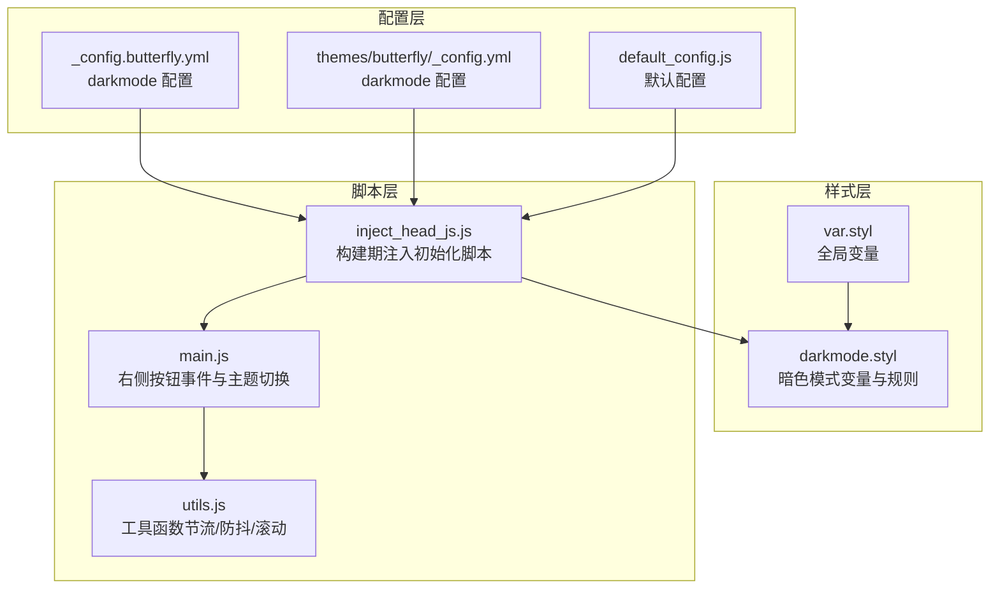
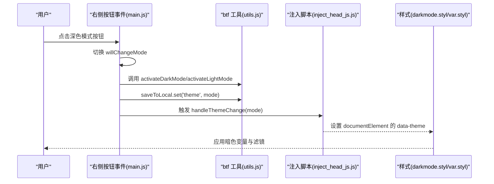
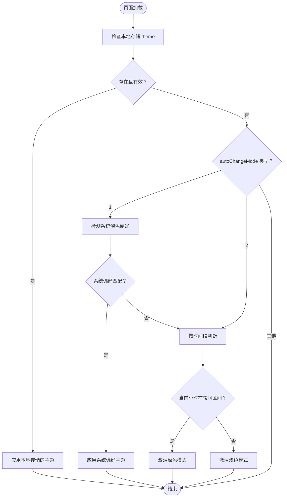
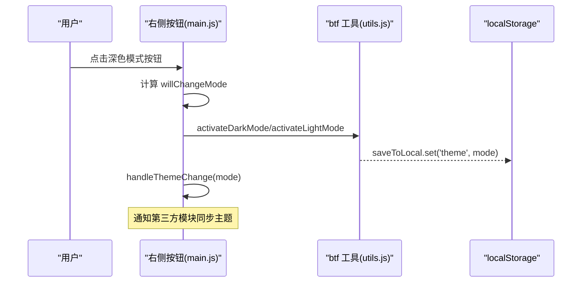
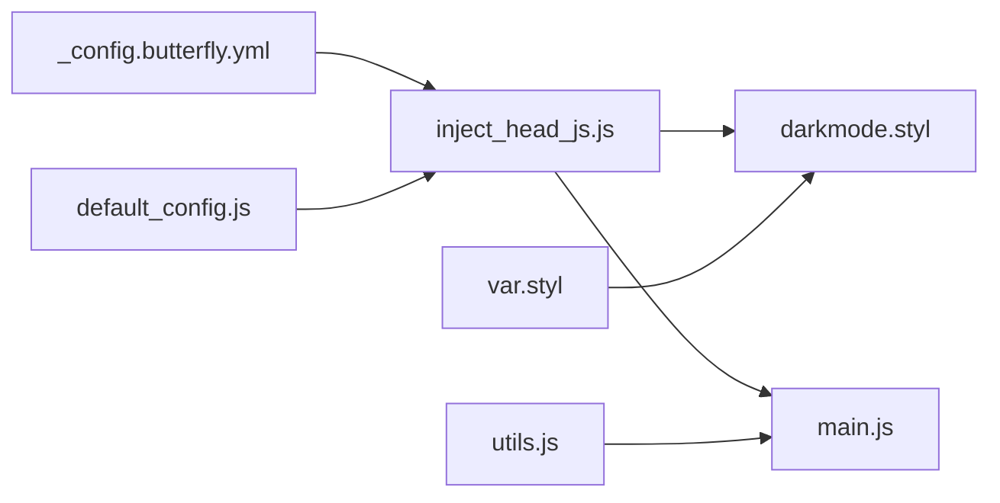

# 深色模式切换

<cite>
**本文引用的文件**
- [themes/butterfly/source/css/_mode/darkmode.styl](file://themes/butterfly/source/css/_mode/darkmode.styl)
- [themes/butterfly/scripts/helpers/inject_head_js.js](file://themes/butterfly/scripts/helpers/inject_head_js.js)
- [themes/butterfly/source/js/main.js](file://themes/butterfly/source/js/main.js)
- [themes/butterfly/source/js/utils.js](file://themes/butterfly/source/js/utils.js)
- [themes/butterfly/source/css/var.styl](file://themes/butterfly/source/css/var.styl)
- [_config.butterfly.yml](file://_config.butterfly.yml)
- [themes/butterfly/_config.yml](file://themes/butterfly/_config.yml)
- [themes/butterfly/scripts/common/default_config.js](file://themes/butterfly/scripts/common/default_config.js)
</cite>

## 目录
1. [简介](#简介)
2. [项目结构](#项目结构)
3. [核心组件](#核心组件)
4. [架构总览](#架构总览)
5. [详细组件分析](#详细组件分析)
6. [依赖关系分析](#依赖关系分析)
7. [性能考量](#性能考量)
8. [故障排查指南](#故障排查指南)
9. [结论](#结论)
10. [附录](#附录)

## 简介
本文件围绕深色模式切换功能进行系统化说明，覆盖实现原理（CSS 变量系统、主题切换逻辑）、配置项（自动切换、时间段、按钮控制）、JavaScript 事件处理（本地存储 API 使用、主题状态同步、过渡动画）、样式差异对比以及响应式适配方案。目标是帮助开发者与运维人员快速理解并维护该功能。

## 项目结构
深色模式相关实现分布在以下位置：
- 样式层：通过 Stylus 变量与选择器在暗色模式下重写颜色与滤镜等属性
- 助手脚本：在构建阶段注入初始化脚本，负责根据配置与系统偏好自动切换主题
- 前端交互：右侧栏按钮触发切换，同时更新页面 data-theme 属性与本地存储



图表来源
- [_config.butterfly.yml:239-245](file://_config.butterfly.yml#L239-L245)
- [themes/butterfly/_config.yml:381-394](file://themes/butterfly/_config.yml#L381-L394)
- [themes/butterfly/scripts/common/default_config.js:219-225](file://themes/butterfly/scripts/common/default_config.js#L219-L225)
- [themes/butterfly/scripts/helpers/inject_head_js.js:1-156](file://themes/butterfly/scripts/helpers/inject_head_js.js#L1-L156)
- [themes/butterfly/source/css/var.styl:1-233](file://themes/butterfly/source/css/var.styl#L1-L233)
- [themes/butterfly/source/css/_mode/darkmode.styl:1-205](file://themes/butterfly/source/css/_mode/darkmode.styl#L1-L205)
- [themes/butterfly/source/js/main.js:626-675](file://themes/butterfly/source/js/main.js#L626-L675)
- [themes/butterfly/source/js/utils.js:1-339](file://themes/butterfly/source/js/utils.js#L1-L339)

章节来源
- [_config.butterfly.yml:239-245](file://_config.butterfly.yml#L239-L245)
- [themes/butterfly/_config.yml:381-394](file://themes/butterfly/_config.yml#L381-L394)
- [themes/butterfly/scripts/common/default_config.js:219-225](file://themes/butterfly/scripts/common/default_config.js#L219-L225)
- [themes/butterfly/scripts/helpers/inject_head_js.js:1-156](file://themes/butterfly/scripts/helpers/inject_head_js.js#L1-L156)
- [themes/butterfly/source/css/var.styl:1-233](file://themes/butterfly/source/css/var.styl#L1-L233)
- [themes/butterfly/source/css/_mode/darkmode.styl:1-205](file://themes/butterfly/source/css/_mode/darkmode.styl#L1-L205)
- [themes/butterfly/source/js/main.js:626-675](file://themes/butterfly/source/js/main.js#L626-L675)
- [themes/butterfly/source/js/utils.js:1-339](file://themes/butterfly/source/js/utils.js#L1-L339)

## 核心组件
- 配置系统
  - 支持启用/禁用深色模式、显示切换按钮、自动切换模式类型、起始/结束时间段等
  - 默认值来源于默认配置文件，站点配置可覆盖
- 构建期注入脚本
  - 注入激活/去激活深色/浅色模式的方法，读取本地存储的主题状态
  - 根据 autoChangeMode 类型决定初始化策略：跟随系统、固定时间段或不自动切换
- 运行期前端交互
  - 右侧按钮点击切换主题，更新 data-theme 属性与本地存储
  - 触发主题变更回调，用于第三方评论等模块同步主题
- 样式系统
  - 通过 CSS 变量与选择器在 [data-theme='dark'] 下重写颜色、背景、边框、滤镜等
  - 对图片、第三方组件等进行亮度/对比度调整以适配暗色背景

章节来源
- [themes/butterfly/scripts/common/default_config.js:219-225](file://themes/butterfly/scripts/common/default_config.js#L219-L225)
- [_config.butterfly.yml:239-245](file://_config.butterfly.yml#L239-L245)
- [themes/butterfly/_config.yml:381-394](file://themes/butterfly/_config.yml#L381-L394)
- [themes/butterfly/scripts/helpers/inject_head_js.js:64-126](file://themes/butterfly/scripts/helpers/inject_head_js.js#L64-L126)
- [themes/butterfly/source/js/main.js:626-675](file://themes/butterfly/source/js/main.js#L626-L675)
- [themes/butterfly/source/css/_mode/darkmode.styl:1-205](file://themes/butterfly/source/css/_mode/darkmode.styl#L1-L205)

## 架构总览
深色模式从“配置 → 注入脚本 → 样式 → 交互”的链路工作，关键路径如下：



图表来源
- [themes/butterfly/source/js/main.js:626-675](file://themes/butterfly/source/js/main.js#L626-L675)
- [themes/butterfly/source/js/utils.js:1-339](file://themes/butterfly/source/js/utils.js#L1-L339)
- [themes/butterfly/scripts/helpers/inject_head_js.js:64-83](file://themes/butterfly/scripts/helpers/inject_head_js.js#L64-L83)
- [themes/butterfly/source/css/_mode/darkmode.styl:1-205](file://themes/butterfly/source/css/_mode/darkmode.styl#L1-L205)

## 详细组件分析

### 配置与默认值
- 配置项
  - enable：是否启用深色模式
  - button：是否显示右侧按钮
  - autoChangeMode：自动切换模式类型（1=跟随系统+时间段；2=仅时间段；false=不自动）
  - start/end：时间段起止（小时，0-24），未设置时采用默认值
- 默认值来源
  - default_config.js 提供默认配置
  - 站点配置文件可覆盖默认值
- 作用范围
  - 构建期注入脚本读取配置决定初始化策略
  - 运行期按钮行为受配置影响（如按钮是否显示）

章节来源
- [themes/butterfly/scripts/common/default_config.js:219-225](file://themes/butterfly/scripts/common/default_config.js#L219-L225)
- [_config.butterfly.yml:239-245](file://_config.butterfly.yml#L239-L245)
- [themes/butterfly/_config.yml:381-394](file://themes/butterfly/_config.yml#L381-L394)

### 构建期注入脚本（自动切换逻辑）
- 注入方法
  - 提供 activateDarkMode/activateLightMode 方法
  - 读取本地存储的 theme 值，若不存在则按策略初始化
- 自动切换策略
  - autoChangeMode=1：优先检测系统深色偏好，否则按时间段判断
  - autoChangeMode=2：仅按时间段判断
  - 其他：不自动切换，尊重本地存储
- 时间段逻辑
  - 当前小时小于等于 start 或大于等于 end 时切换为深色
  - 未设置 start/end 时采用默认值
- 系统偏好监听
  - 若用户未手动切换过主题，则监听系统深色偏好变化并同步



图表来源
- [themes/butterfly/scripts/helpers/inject_head_js.js:87-123](file://themes/butterfly/scripts/helpers/inject_head_js.js#L87-L123)

章节来源
- [themes/butterfly/scripts/helpers/inject_head_js.js:64-126](file://themes/butterfly/scripts/helpers/inject_head_js.js#L64-L126)

### 前端交互与事件处理
- 右侧按钮事件
  - 点击时切换 willChangeMode 并调用对应激活方法
  - 写入本地存储，触发主题变更回调
- 主题变更回调
  - 遍历注册的 themeChange 回调，通知第三方模块同步主题
- 工具函数
  - 提供节流/防抖、滚动到顶部、Snackbar 提示等通用能力



图表来源
- [themes/butterfly/source/js/main.js:626-675](file://themes/butterfly/source/js/main.js#L626-L675)
- [themes/butterfly/source/js/utils.js:71-82](file://themes/butterfly/source/js/utils.js#L71-L82)

章节来源
- [themes/butterfly/source/js/main.js:626-675](file://themes/butterfly/source/js/main.js#L626-L675)
- [themes/butterfly/source/js/utils.js:71-82](file://themes/butterfly/source/js/utils.js#L71-L82)

### 样式系统与变量
- CSS 变量体系
  - 在暗色模式下重定义大量颜色变量，确保整体色调一致
  - 使用 alpha 控制透明度，提升层次感
- 选择器与覆盖
  - 通过 [data-theme='dark'] 限定作用域，避免污染浅色模式
  - 对代码块、导航、侧栏、评论区、第三方组件等分别设置适配
- 图片与第三方组件
  - 对图片与第三方组件应用滤镜（brightness/contrast/saturate）以适配暗色背景
- 全局变量
  - var.styl 定义基础颜色与主题色，darkmode.styl 在暗色模式下覆盖这些变量

```mermaid
classDiagram
class VarStyl {
"+全局颜色变量"
"+主题色/链接色/背景色"
}
class DarkmodeStyl {
"+[data-theme='dark'] 规则集"
"+颜色/背景/边框/滤镜"
"+第三方组件适配"
}
VarStyl <.. DarkmodeStyl : "覆盖/补充"
```

图表来源
- [themes/butterfly/source/css/var.styl:1-233](file://themes/butterfly/source/css/var.styl#L1-L233)
- [themes/butterfly/source/css/_mode/darkmode.styl:1-205](file://themes/butterfly/source/css/_mode/darkmode.styl#L1-L205)

章节来源
- [themes/butterfly/source/css/var.styl:1-233](file://themes/butterfly/source/css/var.styl#L1-L233)
- [themes/butterfly/source/css/_mode/darkmode.styl:1-205](file://themes/butterfly/source/css/_mode/darkmode.styl#L1-L205)

### 响应式设计适配
- 移动端适配
  - 通过媒体查询与容器宽度限制，保证在窄屏设备上仍能正确应用暗色样式
- 第三方组件
  - 针对 disqusjs、waline、artalk 等组件在暗色模式下的文本颜色与背景进行覆盖
- 图片与高斯模糊占位
  - 在懒加载场景下，对图片应用滤镜以提升可读性

章节来源
- [themes/butterfly/source/css/_mode/darkmode.styl:142-147](file://themes/butterfly/source/css/_mode/darkmode.styl#L142-L147)
- [themes/butterfly/source/css/_mode/darkmode.styl:158-179](file://themes/butterfly/source/css/_mode/darkmode.styl#L158-L179)
- [themes/butterfly/source/css/_mode/darkmode.styl:190-205](file://themes/butterfly/source/css/_mode/darkmode.styl#L190-L205)

## 依赖关系分析
- 配置依赖
  - 注入脚本依赖站点配置中的 darkmode 字段
  - 默认配置提供兜底值
- 样式依赖
  - darkmode.styl 依赖 var.styl 中的颜色变量
  - 通过 [data-theme='dark'] 实现条件样式
- 交互依赖
  - main.js 依赖 utils.js 提供的工具方法
  - 依赖注入脚本提供的 activateDarkMode/activateLightMode



图表来源
- [_config.butterfly.yml:239-245](file://_config.butterfly.yml#L239-L245)
- [themes/butterfly/scripts/common/default_config.js:219-225](file://themes/butterfly/scripts/common/default_config.js#L219-L225)
- [themes/butterfly/scripts/helpers/inject_head_js.js:1-156](file://themes/butterfly/scripts/helpers/inject_head_js.js#L1-L156)
- [themes/butterfly/source/css/var.styl:1-233](file://themes/butterfly/source/css/var.styl#L1-L233)
- [themes/butterfly/source/css/_mode/darkmode.styl:1-205](file://themes/butterfly/source/css/_mode/darkmode.styl#L1-L205)
- [themes/butterfly/source/js/main.js:626-675](file://themes/butterfly/source/js/main.js#L626-L675)
- [themes/butterfly/source/js/utils.js:1-339](file://themes/butterfly/source/js/utils.js#L1-L339)

章节来源
- [_config.butterfly.yml:239-245](file://_config.butterfly.yml#L239-L245)
- [themes/butterfly/scripts/common/default_config.js:219-225](file://themes/butterfly/scripts/common/default_config.js#L219-L225)
- [themes/butterfly/scripts/helpers/inject_head_js.js:1-156](file://themes/butterfly/scripts/helpers/inject_head_js.js#L1-L156)
- [themes/butterfly/source/css/var.styl:1-233](file://themes/butterfly/source/css/var.styl#L1-L233)
- [themes/butterfly/source/css/_mode/darkmode.styl:1-205](file://themes/butterfly/source/css/_mode/darkmode.styl#L1-L205)
- [themes/butterfly/source/js/main.js:626-675](file://themes/butterfly/source/js/main.js#L626-L675)
- [themes/butterfly/source/js/utils.js:1-339](file://themes/butterfly/source/js/utils.js#L1-L339)

## 性能考量
- 自动切换监听
  - 仅在未手动切换主题时监听系统偏好变化，避免频繁重绘
- 本地存储
  - 使用带过期时间的本地存储封装，减少无效计算
- 事件节流
  - 滚动、窗口大小变化等高频事件使用节流/防抖，降低开销
- 样式覆盖
  - 通过 [data-theme='dark'] 限定作用域，避免全站样式重算

## 故障排查指南
- 深色模式未生效
  - 检查配置项 enable/button/autoChangeMode 是否正确
  - 确认注入脚本是否成功注入，浏览器控制台无报错
- 手动切换无效
  - 检查右侧按钮事件绑定是否正常
  - 确认本地存储中 'theme' 键值是否被正确写入
- 系统偏好未生效
  - 确认 autoChangeMode=1 且未手动切换过主题
  - 检查系统深色模式开关状态
- 样式异常
  - 检查 [data-theme='dark'] 是否被正确设置
  - 确认 darkmode.styl 是否被编译并加载

章节来源
- [themes/butterfly/scripts/helpers/inject_head_js.js:64-126](file://themes/butterfly/scripts/helpers/inject_head_js.js#L64-L126)
- [themes/butterfly/source/js/main.js:626-675](file://themes/butterfly/source/js/main.js#L626-L675)
- [themes/butterfly/source/css/_mode/darkmode.styl:1-205](file://themes/butterfly/source/css/_mode/darkmode.styl#L1-L205)

## 结论
深色模式切换通过“配置驱动 + 构建期注入 + 运行期交互 + 样式覆盖”形成闭环：配置决定行为，注入脚本负责初始化与自动切换，前端按钮负责手动切换，样式系统确保视觉一致性。该方案具备良好的扩展性与可维护性，便于后续接入更多第三方组件与主题变体。

## 附录
- 配置项速览
  - enable：启用深色模式
  - button：显示右侧按钮
  - autoChangeMode：自动切换类型（1/2/false）
  - start/end：时间段起止（小时）
- 相关文件路径
  - 配置：_config.butterfly.yml、themes/butterfly/_config.yml、default_config.js
  - 注入脚本：inject_head_js.js
  - 样式：var.styl、darkmode.styl
  - 交互：main.js、utils.js