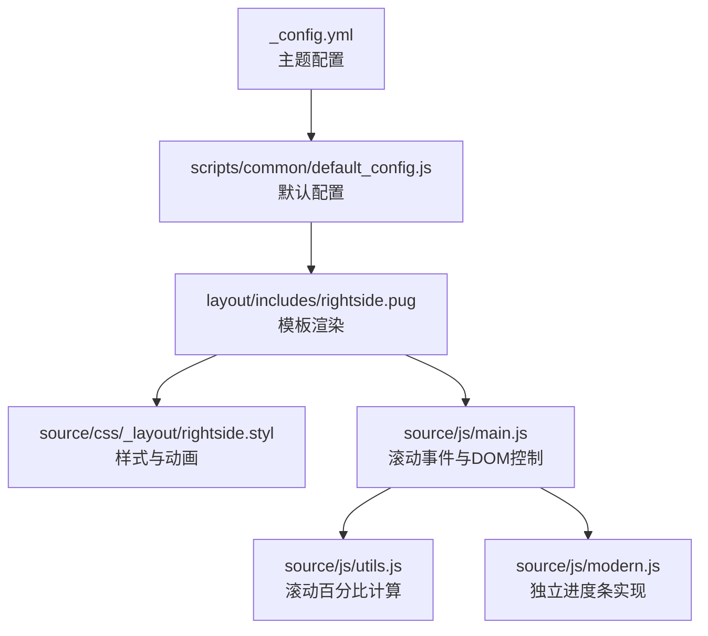
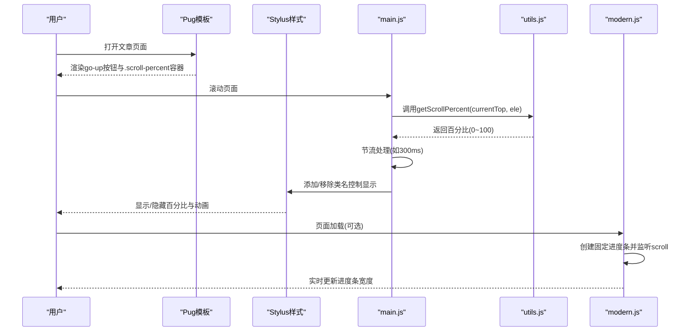
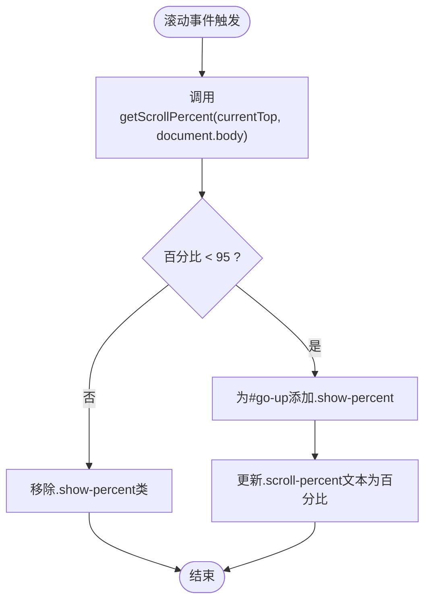
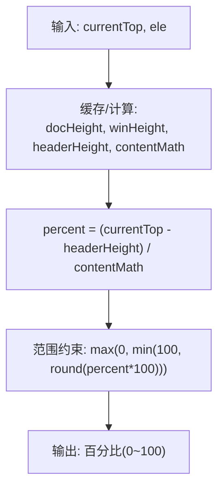
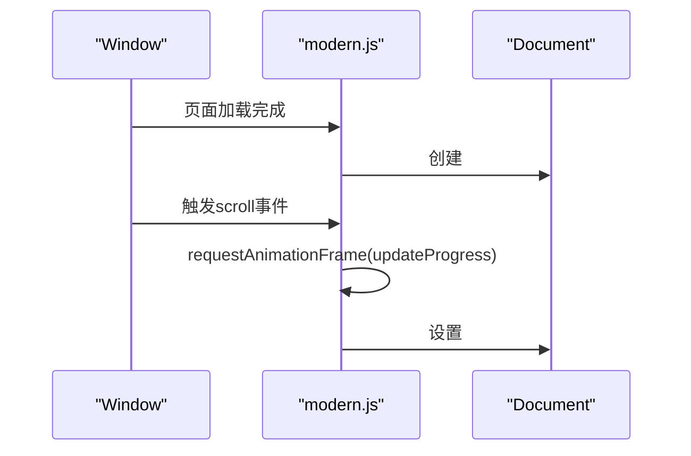
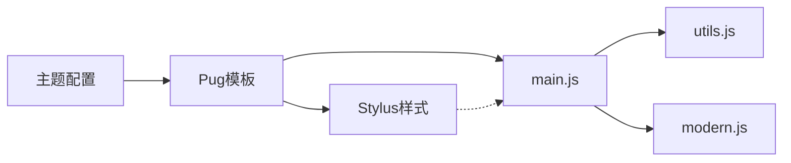

# 阅读进度条

<cite>
**本文档引用的文件**
- [themes/butterfly/_config.yml](file://themes/butterfly/_config.yml)
- [_config.butterfly.yml](file://_config.butterfly.yml)
- [themes/butterfly/layout/includes/rightside.pug](file://themes/butterfly/layout/includes/rightside.pug)
- [themes/butterfly/source/css/_layout/rightside.styl](file://themes/butterfly/source/css/_layout/rightside.styl)
- [themes/butterfly/scripts/common/default_config.js](file://themes/butterfly/scripts/common/default_config.js)
- [themes/butterfly/source/js/utils.js](file://themes/butterfly/source/js/utils.js)
- [themes/butterfly/source/js/main.js](file://themes/butterfly/source/js/main.js)
- [source/js/modern.js](file://source/js/modern.js)
</cite>

## 目录
1. [简介](#简介)
2. [项目结构](#项目结构)
3. [核心组件](#核心组件)
4. [架构总览](#架构总览)
5. [详细组件分析](#详细组件分析)
6. [依赖关系分析](#依赖关系分析)
7. [性能考量](#性能考量)
8. [故障排查指南](#故障排查指南)
9. [结论](#结论)

## 简介
本文件系统性阐述阅读进度条功能，覆盖滚动进度监听机制、进度计算算法、视觉反馈实现；详解 rightside_scroll_percent 配置项的作用（位置设置、样式定制、动画效果）；提供 JavaScript 事件绑定分析（scroll 事件优化、节流/防抖策略、性能监控）；并给出在不同设备上的适配方案（移动端触摸优化与桌面端鼠标交互）。

## 项目结构
阅读进度条涉及主题配置、模板渲染、样式控制、工具函数与主逻辑脚本等多处协作：
- 配置层：通过主题配置启用/禁用右侧滚动百分比显示，并影响模板渲染。
- 模板层：Pug 模板生成“回到顶部”按钮及百分比容器。
- 样式层：Stylus 控制百分比显示状态与动画。
- 工具层：通用工具函数提供滚动百分比计算。
- 逻辑层：主脚本负责滚动事件监听、节流处理、DOM 更新与条件显示。

图表来源
- [themes/butterfly/_config.yml](file://themes/butterfly/_config.yml)
- [themes/butterfly/scripts/common/default_config.js](file://themes/butterfly/scripts/common/default_config.js)
- [themes/butterfly/layout/includes/rightside.pug](file://themes/butterfly/layout/includes/rightside.pug)
- [themes/butterfly/source/css/_layout/rightside.styl](file://themes/butterfly/source/css/_layout/rightside.styl)
- [themes/butterfly/source/js/main.js](file://themes/butterfly/source/js/main.js)
- [themes/butterfly/source/js/utils.js](file://themes/butterfly/source/js/utils.js)
- [source/js/modern.js](file://source/js/modern.js)

章节来源
- [themes/butterfly/_config.yml](file://themes/butterfly/_config.yml)
- [themes/butterfly/scripts/common/default_config.js](file://themes/butterfly/scripts/common/default_config.js)
- [themes/butterfly/layout/includes/rightside.pug](file://themes/butterfly/layout/includes/rightside.pug)
- [themes/butterfly/source/css/_layout/rightside.styl](file://themes/butterfly/source/css/_layout/rightside.styl)
- [themes/butterfly/source/js/main.js](file://themes/butterfly/source/js/main.js)
- [themes/butterfly/source/js/utils.js](file://themes/butterfly/source/js/utils.js)
- [source/js/modern.js](file://source/js/modern.js)

## 核心组件
- 右侧滚动百分比显示（go-up 按钮）
  - 由 Pug 模板生成按钮与百分比容器，Stylus 控制显隐与动画。
  - 通过主脚本在滚动时动态添加/移除类名，展示当前滚动百分比。
- 通用滚动百分比计算
  - 提供基于文档高度、窗口高度与头部偏移的百分比计算方法。
- 独立阅读进度条（可选）
  - 在现代脚本中创建固定定位的进度条，使用 requestAnimationFrame 平滑更新宽度。

章节来源
- [themes/butterfly/layout/includes/rightside.pug](file://themes/butterfly/layout/includes/rightside.pug)
- [themes/butterfly/source/css/_layout/rightside.styl](file://themes/butterfly/source/css/_layout/rightside.styl)
- [themes/butterfly/source/js/main.js](file://themes/butterfly/source/js/main.js)
- [themes/butterfly/source/js/utils.js](file://themes/butterfly/source/js/utils.js)
- [source/js/modern.js](file://source/js/modern.js)

## 架构总览
阅读进度条由“配置 → 渲染 → 计算 → 监听 → 视觉反馈”构成闭环。配置项决定是否渲染百分比容器；模板生成 DOM 结构；工具函数提供精确的百分比计算；主脚本在滚动时进行节流处理并更新 DOM；Stylus 定义显隐与过渡动画。

图表来源
- [themes/butterfly/layout/includes/rightside.pug](file://themes/butterfly/layout/includes/rightside.pug)
- [themes/butterfly/source/css/_layout/rightside.styl](file://themes/butterfly/source/css/_layout/rightside.styl)
- [themes/butterfly/source/js/main.js](file://themes/butterfly/source/js/main.js)
- [themes/butterfly/source/js/utils.js](file://themes/butterfly/source/js/utils.js)
- [source/js/modern.js](file://source/js/modern.js)

## 详细组件分析

### 组件A：右侧滚动百分比显示（go-up）
- 模板渲染
  - Pug 模板包含“回到顶部”按钮与百分比容器，用于在滚动时显示当前百分比。
- 样式控制
  - Stylus 中定义了 .show-percent 类与 hover 效果，控制百分比文本与图标之间的显隐与缩放动画。
- 逻辑控制
  - 主脚本在滚动时调用 getScrollPercent 计算百分比，当小于阈值时为按钮添加类名以显示百分比，否则移除类名隐藏。
  - 使用节流函数对滚动事件进行优化，避免频繁重排与重绘。

图表来源
- [themes/butterfly/source/js/main.js](file://themes/butterfly/source/js/main.js)
- [themes/butterfly/source/js/utils.js](file://themes/butterfly/source/js/utils.js)
- [themes/butterfly/layout/includes/rightside.pug](file://themes/butterfly/layout/includes/rightside.pug)
- [themes/butterfly/source/css/_layout/rightside.styl](file://themes/butterfly/source/css/_layout/rightside.styl)

章节来源
- [themes/butterfly/layout/includes/rightside.pug](file://themes/butterfly/layout/includes/rightside.pug)
- [themes/butterfly/source/css/_layout/rightside.styl](file://themes/butterfly/source/css/_layout/rightside.styl)
- [themes/butterfly/source/js/main.js](file://themes/butterfly/source/js/main.js)
- [themes/butterfly/source/js/utils.js](file://themes/butterfly/source/js/utils.js)

### 组件B：通用滚动百分比计算算法
- 输入参数
  - 当前滚动位置 currentTop
  - 计算目标元素 ele（通常为 document.body 或文章容器）
- 计算步骤
  - 缓存文档高度、窗口高度与头部偏移，按需重新计算内容高度差。
  - 基于公式：百分比 = (currentTop - headerHeight) / contentMath
  - 对结果进行范围约束与四舍五入，确保输出在 0~100 的整数范围内。
- 性能特性
  - 使用闭包缓存关键尺寸，减少重复计算成本。

图表来源
- [themes/butterfly/source/js/utils.js](file://themes/butterfly/source/js/utils.js)

章节来源
- [themes/butterfly/source/js/utils.js](file://themes/butterfly/source/js/utils.js)

### 组件C：独立阅读进度条（modern.js）
- 功能概述
  - 在页面顶部创建一个固定定位的进度条，宽度随滚动实时更新。
- 关键点
  - 使用 requestAnimationFrame 在每次帧更新时计算并设置宽度，保证流畅度。
  - 进度条初始宽度为 0%，最大不超过 100%。
  - 通过 CSS 渐变背景色与过渡属性提升视觉体验。
- 适用场景
  - 作为全局进度指示器，适用于长文档或需要强调阅读节奏的页面。

图表来源
- [source/js/modern.js](file://source/js/modern.js)

章节来源
- [source/js/modern.js](file://source/js/modern.js)

### 组件D：rightside_scroll_percent 配置项
- 作用
  - 控制是否在右侧“回到顶部”按钮上显示滚动百分比。
- 位置设置
  - 位于主题配置文件中，影响 Pug 模板是否渲染百分比容器。
- 样式定制
  - Stylus 中通过 .show-percent 与 hover 状态控制百分比文本与图标的显隐与缩放动画。
- 动画效果
  - 使用 CSS transition 与 keyframes 实现淡入缩放动画，提升交互体验。

章节来源
- [themes/butterfly/_config.yml](file://themes/butterfly/_config.yml)
- [themes/butterfly/layout/includes/rightside.pug](file://themes/butterfly/layout/includes/rightside.pug)
- [themes/butterfly/source/css/_layout/rightside.styl](file://themes/butterfly/source/css/_layout/rightside.styl)

### 组件E：JavaScript 事件绑定与性能优化
- 事件绑定
  - 使用 btf.addEventListenerPjax 将滚动事件绑定到 window，支持 PJAX 场景下的事件解绑。
  - 采用 passive: true 减少滚动阻塞风险。
- 优化策略
  - 节流（throttle）：对滚动处理函数进行节流，降低回调频率。
  - requestAnimationFrame：在动画帧内更新进度，避免同步布局抖动。
- 性能监控建议
  - 可结合浏览器性能面板观察 FPS、布局与脚本耗时。
  - 对高频计算（如 getScrollPercent）应尽量复用缓存结果。

章节来源
- [themes/butterfly/source/js/main.js](file://themes/butterfly/source/js/main.js)
- [themes/butterfly/source/js/utils.js](file://themes/butterfly/source/js/utils.js)

## 依赖关系分析
- 配置依赖
  - 主题配置决定是否启用右侧滚动百分比显示，间接影响模板渲染与样式类名。
- 模板依赖
  - Pug 模板依赖配置与国际化文案，生成 go-up 按钮与百分比容器。
- 样式依赖
  - Stylus 样式依赖配置开关，控制 .show-percent 与 hover 状态下的动画。
- 逻辑依赖
  - 主脚本依赖工具函数提供的百分比计算，同时依赖节流与事件绑定工具。
- 独立进度条
  - modern.js 与主脚本相互独立，可按需启用。

图表来源
- [themes/butterfly/_config.yml](file://themes/butterfly/_config.yml)
- [themes/butterfly/layout/includes/rightside.pug](file://themes/butterfly/layout/includes/rightside.pug)
- [themes/butterfly/source/css/_layout/rightside.styl](file://themes/butterfly/source/css/_layout/rightside.styl)
- [themes/butterfly/source/js/main.js](file://themes/butterfly/source/js/main.js)
- [themes/butterfly/source/js/utils.js](file://themes/butterfly/source/js/utils.js)
- [source/js/modern.js](file://source/js/modern.js)

章节来源
- [themes/butterfly/_config.yml](file://themes/butterfly/_config.yml)
- [themes/butterfly/layout/includes/rightside.pug](file://themes/butterfly/layout/includes/rightside.pug)
- [themes/butterfly/source/css/_layout/rightside.styl](file://themes/butterfly/source/css/_layout/rightside.styl)
- [themes/butterfly/source/js/main.js](file://themes/butterfly/source/js/main.js)
- [themes/butterfly/source/js/utils.js](file://themes/butterfly/source/js/utils.js)
- [source/js/modern.js](file://source/js/modern.js)

## 性能考量
- 事件节流与被动监听
  - 使用节流降低滚动回调频率，使用 passive: true 减少主线程阻塞。
- 帧内更新
  - 使用 requestAnimationFrame 在稳定帧率下更新 DOM，避免强制同步布局。
- 计算缓存
  - 百分比计算函数内部缓存关键尺寸，减少重复计算。
- 样式动画
  - 利用 CSS transition 与 GPU 加速属性（scale、opacity）提升动画性能。
- 设备适配
  - 移动端优先考虑触摸滚动的平滑性与能耗；桌面端注意鼠标滚轮的高频率触发。

## 故障排查指南
- 百分比不显示
  - 检查主题配置中的 rightside_scroll_percent 是否启用。
  - 确认模板是否正确渲染 .scroll-percent 容器。
- 百分比数值异常
  - 检查 getScrollPercent 的输入参数与边界条件，确认 contentMath 正确。
- 滚动卡顿
  - 检查是否过度使用同步布局查询；确保使用节流与 requestAnimationFrame。
- 动画闪烁
  - 检查 Stylus 中的 transition 属性与动画关键帧，避免不必要的重排。
- 独立进度条无效
  - 确认 modern.js 是否被正确注入与执行；检查 DOM 插入时机。

章节来源
- [themes/butterfly/_config.yml](file://themes/butterfly/_config.yml)
- [themes/butterfly/layout/includes/rightside.pug](file://themes/butterfly/layout/includes/rightside.pug)
- [themes/butterfly/source/css/_layout/rightside.styl](file://themes/butterfly/source/css/_layout/rightside.styl)
- [themes/butterfly/source/js/main.js](file://themes/butterfly/source/js/main.js)
- [themes/butterfly/source/js/utils.js](file://themes/butterfly/source/js/utils.js)
- [source/js/modern.js](file://source/js/modern.js)

## 结论
阅读进度条通过“配置 → 渲染 → 计算 → 监听 → 视觉反馈”的完整链路实现，兼顾可用性与性能。rightside_scroll_percent 提供灵活的开关控制，配合 Stylus 的动画与主脚本的节流策略，可在多种设备上提供一致的阅读体验。若需更直观的全局进度指示，可启用独立的阅读进度条实现。