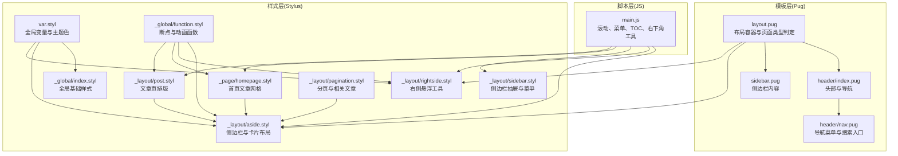
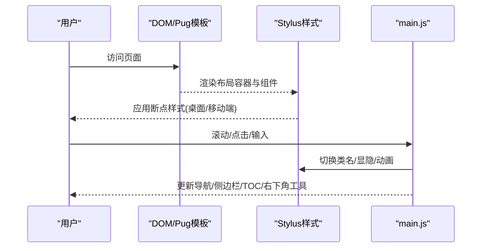
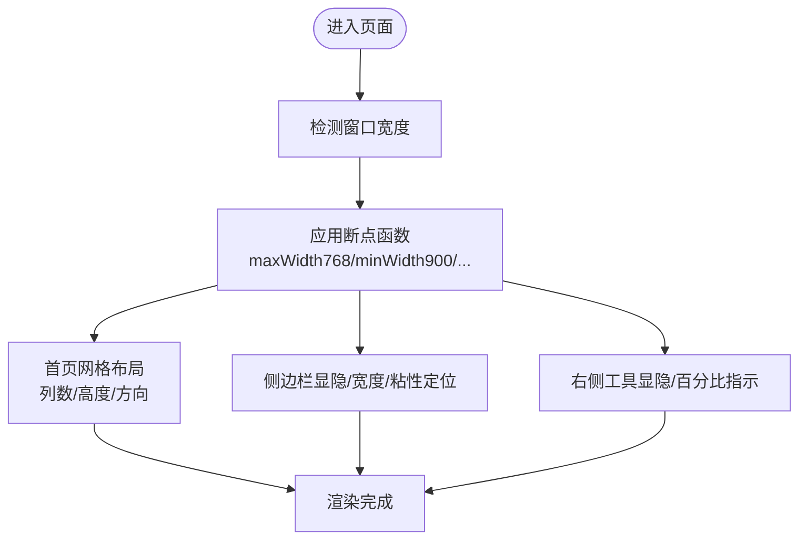
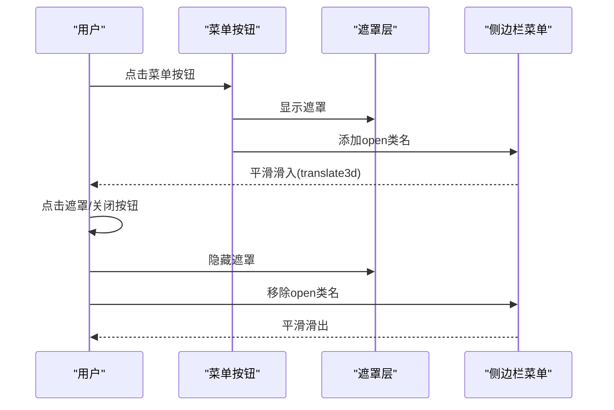
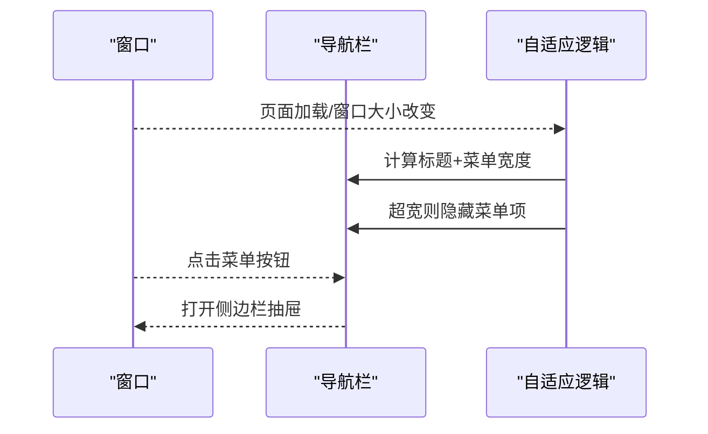
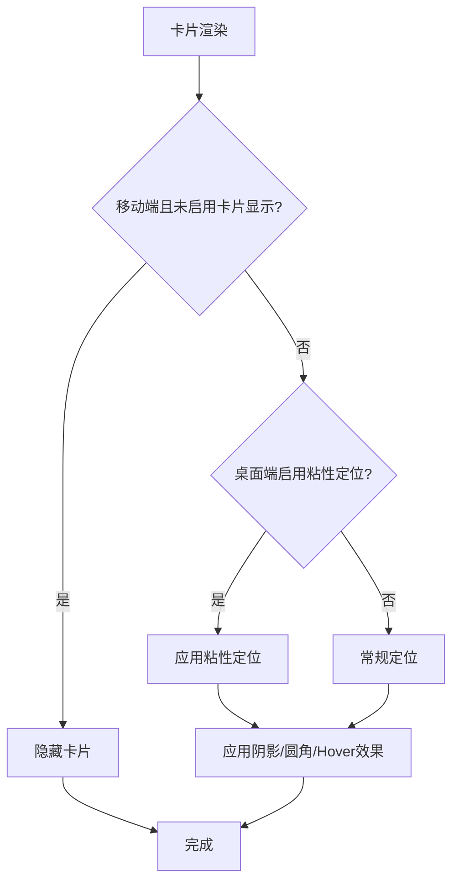
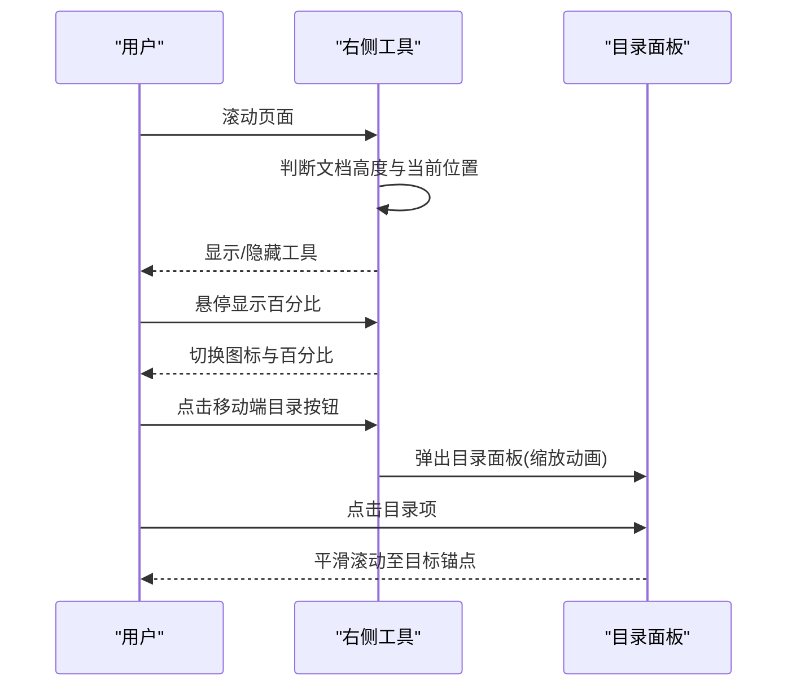
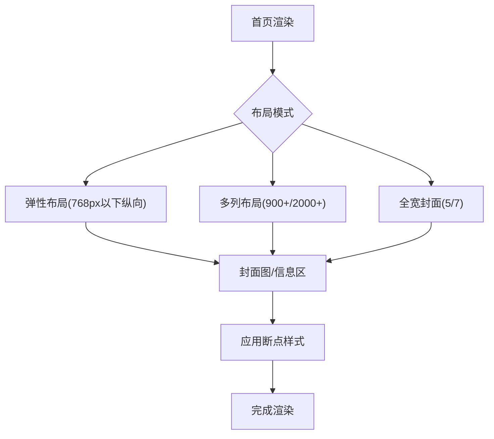
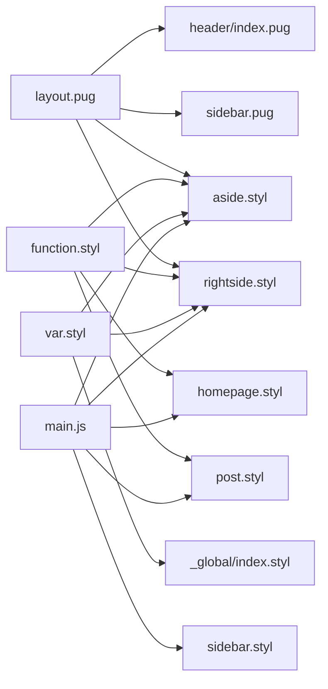

# 响应式布局系统

<cite>
**本文引用的文件**
- [var.styl](file://themes/butterfly/source/css/var.styl)
- [index.styl](file://themes/butterfly/source/css/_global/index.styl)
- [function.styl](file://themes/butterfly/source/css/_global/function.styl)
- [aside.styl](file://themes/butterfly/source/css/_layout/aside.styl)
- [sidebar.styl](file://themes/butterfly/source/css/_layout/sidebar.styl)
- [rightside.styl](file://themes/butterfly/source/css/_layout/rightside.styl)
- [homepage.styl](file://themes/butterfly/source/css/_page/homepage.styl)
- [post.styl](file://themes/butterfly/source/css/_layout/post.styl)
- [pagination.styl](file://themes/butterfly/source/css/_layout/pagination.styl)
- [layout.pug](file://themes/butterfly/layout/includes/layout.pug)
- [nav.pug](file://themes/butterfly/layout/includes/header/nav.pug)
- [index.pug](file://themes/butterfly/layout/includes/header/index.pug)
- [sidebar.pug](file://themes/butterfly/layout/includes/sidebar.pug)
- [main.js](file://themes/butterfly/source/js/main.js)
</cite>

## 目录
1. [简介](#简介)
2. [项目结构](#项目结构)
3. [核心组件](#核心组件)
4. [架构总览](#架构总览)
5. [详细组件分析](#详细组件分析)
6. [依赖关系分析](#依赖关系分析)
7. [性能考量](#性能考量)
8. [故障排查指南](#故障排查指南)
9. [结论](#结论)
10. [附录](#附录)

## 简介
本文件系统性梳理博客主题在桌面与移动设备上的响应式布局体系，覆盖全设备适配策略、移动端优先理念、断点与网格系统、侧边栏与导航栏的响应式行为、卡片组件的自适应设计，以及触摸交互优化与视口配置。同时提供布局调试方法与性能优化建议，帮助开发者快速理解并维护该响应式体系。

## 项目结构
主题采用“模板(Pug)+样式(Stylus)+脚本(JS)”三层结构组织响应式布局：
- 模板层：通过 Pug 组织页面骨架（布局、头部导航、侧边栏、右侧工具等），控制不同页面类型下的显示逻辑。
- 样式层：以 Stylus 编写全局变量、通用样式、断点函数与页面级样式，统一管理颜色、字体、间距与布局断点。
- 脚本层：通过 JS 实现滚动、菜单、TOC、右下角工具等交互，并根据窗口尺寸动态调整 UI 行为。

图表来源
- [layout.pug:1-59](file://themes/butterfly/layout/includes/layout.pug#L1-L59)
- [index.pug:1-52](file://themes/butterfly/layout/includes/header/index.pug#L1-L52)
- [nav.pug:1-26](file://themes/butterfly/layout/includes/header/nav.pug#L1-L26)
- [sidebar.pug:1-18](file://themes/butterfly/layout/includes/sidebar.pug#L1-L18)
- [var.styl:1-233](file://themes/butterfly/source/css/var.styl#L1-L233)
- [index.styl:1-287](file://themes/butterfly/source/css/_global/index.styl#L1-L287)
- [function.styl:111-145](file://themes/butterfly/source/css/_global/function.styl#L111-L145)
- [aside.styl:1-435](file://themes/butterfly/source/css/_layout/aside.styl#L1-L435)
- [sidebar.styl:1-97](file://themes/butterfly/source/css/_layout/sidebar.styl#L1-L97)
- [rightside.styl:1-109](file://themes/butterfly/source/css/_layout/rightside.styl#L1-L109)
- [homepage.styl:1-175](file://themes/butterfly/source/css/_page/homepage.styl#L1-L175)
- [post.styl:1-265](file://themes/butterfly/source/css/_layout/post.styl#L1-L265)
- [pagination.styl:1-106](file://themes/butterfly/source/css/_layout/pagination.styl#L1-L106)
- [main.js:1-800](file://themes/butterfly/source/js/main.js#L1-L800)

章节来源
- [layout.pug:1-59](file://themes/butterfly/layout/includes/layout.pug#L1-L59)
- [index.pug:1-52](file://themes/butterfly/layout/includes/header/index.pug#L1-L52)
- [nav.pug:1-26](file://themes/butterfly/layout/includes/header/nav.pug#L1-L26)
- [sidebar.pug:1-18](file://themes/butterfly/layout/includes/sidebar.pug#L1-L18)

## 核心组件
- 全局变量与主题色：集中定义颜色、字体、字号、卡片阴影、侧边栏宽度等，供全局与页面样式引用。
- 断点函数：封装常用断点(maxWidth768/minWidth768/.../minWidth2000)，用于条件化样式切换。
- 侧边栏与卡片：通过 aside.styl 控制卡片组件在桌面与移动端的显示/隐藏、粘性定位与排序。
- 抽屉式侧边栏：通过 sidebar.styl 定义固定定位、过渡动画与移动端菜单展开行为。
- 右侧悬浮工具：通过 rightside.styl 控制按钮显隐、百分比滚动指示与移动端 TOC 按钮。
- 首页网格与文章排版：通过 homepage.styl 与 post.styl 实现多布局模式下的卡片排列与自适应。
- 分页与相关文章：通过 pagination.styl 提供移动端折叠与弹性布局支持。
- 导航栏与菜单：通过 nav.pug 与 main.js 的菜单计算逻辑实现移动端菜单折叠与展开。

章节来源
- [var.styl:1-233](file://themes/butterfly/source/css/var.styl#L1-L233)
- [function.styl:111-145](file://themes/butterfly/source/css/_global/function.styl#L111-L145)
- [aside.styl:1-435](file://themes/butterfly/source/css/_layout/aside.styl#L1-L435)
- [sidebar.styl:1-97](file://themes/butterfly/source/css/_layout/sidebar.styl#L1-L97)
- [rightside.styl:1-109](file://themes/butterfly/source/css/_layout/rightside.styl#L1-L109)
- [homepage.styl:1-175](file://themes/butterfly/source/css/_page/homepage.styl#L1-L175)
- [post.styl:1-265](file://themes/butterfly/source/css/_layout/post.styl#L1-L265)
- [pagination.styl:1-106](file://themes/butterfly/source/css/_layout/pagination.styl#L1-L106)
- [nav.pug:1-26](file://themes/butterfly/layout/includes/header/nav.pug#L1-L26)
- [main.js:1-800](file://themes/butterfly/source/js/main.js#L1-L800)

## 架构总览
响应式布局由“模板容器 + 断点函数 + 样式规则 + 交互脚本”协同完成。模板层负责页面骨架与页面类型判定；断点函数提供一致的媒体查询抽象；样式层按设备宽度应用不同的布局策略；脚本层在运行时根据窗口尺寸与滚动状态动态调整 UI。

图表来源
- [layout.pug:1-59](file://themes/butterfly/layout/includes/layout.pug#L1-L59)
- [function.styl:111-145](file://themes/butterfly/source/css/_global/function.styl#L111-L145)
- [aside.styl:1-435](file://themes/butterfly/source/css/_layout/aside.styl#L1-L435)
- [rightside.styl:1-109](file://themes/butterfly/source/css/_layout/rightside.styl#L1-L109)
- [main.js:1-800](file://themes/butterfly/source/js/main.js#L1-L800)

## 详细组件分析

### 断点与网格系统
- 断点定义：通过函数式断点(maxWidth768/minWidth768/.../minWidth2000)统一媒体查询，避免硬编码。
- 网格系统：首页文章网格根据布局模式与断点进行列数与高度调整；卡片组件在不同断点下切换为单列或弹性布局。
- 侧边栏宽度：侧边栏宽度为固定值，配合 aside.styl 在桌面端与移动端分别控制宽度与显隐。

图表来源
- [function.styl:111-145](file://themes/butterfly/source/css/_global/function.styl#L111-L145)
- [homepage.styl:1-175](file://themes/butterfly/source/css/_page/homepage.styl#L1-L175)
- [aside.styl:1-435](file://themes/butterfly/source/css/_layout/aside.styl#L1-L435)
- [rightside.styl:1-109](file://themes/butterfly/source/css/_layout/rightside.styl#L1-L109)

章节来源
- [function.styl:111-145](file://themes/butterfly/source/css/_global/function.styl#L111-L145)
- [homepage.styl:1-175](file://themes/butterfly/source/css/_page/homepage.styl#L1-L175)
- [aside.styl:1-435](file://themes/butterfly/source/css/_layout/aside.styl#L1-L435)
- [rightside.styl:1-109](file://themes/butterfly/source/css/_layout/rightside.styl#L1-L109)

### 侧边栏布局与抽屉行为
- 固定定位与过渡：侧边栏使用固定定位与平滑过渡，移动端通过类名切换实现从右侧滑入。
- 子菜单展开：支持分组菜单的展开/收起，配合 transform 与 opacity 实现流畅动画。
- 移动端遮罩：打开侧边栏时显示遮罩层，关闭时移除遮罩，提升交互明确性。

图表来源
- [sidebar.styl:1-97](file://themes/butterfly/source/css/_layout/sidebar.styl#L1-L97)
- [sidebar.pug:1-18](file://themes/butterfly/layout/includes/sidebar.pug#L1-L18)
- [main.js:25-39](file://themes/butterfly/source/js/main.js#L25-L39)

章节来源
- [sidebar.styl:1-97](file://themes/butterfly/source/css/_layout/sidebar.styl#L1-L97)
- [sidebar.pug:1-18](file://themes/butterfly/layout/includes/sidebar.pug#L1-L18)
- [main.js:25-39](file://themes/butterfly/source/js/main.js#L25-L39)

### 导航栏响应式行为
- 自适应宽度：初始化时计算标题与菜单宽度，当空间不足时自动隐藏部分菜单项。
- 移动端菜单：在窄屏下显示“菜单”按钮，点击后打开侧边栏抽屉。
- 头部固定：滚动超过阈值时添加固定类名，提升导航可用性。

图表来源
- [main.js:5-23](file://themes/butterfly/source/js/main.js#L5-L23)
- [nav.pug:1-26](file://themes/butterfly/layout/includes/header/nav.pug#L1-L26)
- [index.pug:1-52](file://themes/butterfly/layout/includes/header/index.pug#L1-L52)

章节来源
- [main.js:5-23](file://themes/butterfly/source/js/main.js#L5-L23)
- [nav.pug:1-26](file://themes/butterfly/layout/includes/header/nav.pug#L1-L26)
- [index.pug:1-52](file://themes/butterfly/layout/includes/header/index.pug#L1-L52)

### 卡片组件的自适应设计
- 卡片阴影与圆角：统一的卡片样式通过变量控制阴影与圆角，hover 效果增强层次感。
- 移动端隐藏策略：当配置关闭移动端卡片显示时，在窄屏下隐藏非 TOC 卡片。
- 粘性定位：桌面端卡片可使用粘性定位跟随滚动，提升阅读连续性。
- 排序与顺序：卡片顺序可通过配置项动态调整，满足个性化需求。

图表来源
- [aside.styl:14-84](file://themes/butterfly/source/css/_layout/aside.styl#L14-L84)
- [var.styl:46-50](file://themes/butterfly/source/css/var.styl#L46-L50)

章节来源
- [aside.styl:14-84](file://themes/butterfly/source/css/_layout/aside.styl#L14-L84)
- [var.styl:46-50](file://themes/butterfly/source/css/var.styl#L46-L50)

### 右侧悬浮工具与移动端 TOC
- 工具显隐：根据文档高度与滚动位置决定是否显示右侧工具区域。
- 百分比指示：在滚动到一定比例时显示百分比，悬停时切换图标与百分比显示。
- 移动端 TOC：窄屏下显示“目录”按钮，点击弹出目录面板，支持缩放动画与底部对齐。

图表来源
- [rightside.styl:1-109](file://themes/butterfly/source/css/_layout/rightside.styl#L1-L109)
- [main.js:425-503](file://themes/butterfly/source/js/main.js#L425-L503)
- [main.js:696-712](file://themes/butterfly/source/js/main.js#L696-L712)

章节来源
- [rightside.styl:1-109](file://themes/butterfly/source/css/_layout/rightside.styl#L1-L109)
- [main.js:425-503](file://themes/butterfly/source/js/main.js#L425-L503)
- [main.js:696-712](file://themes/butterfly/source/js/main.js#L696-L712)

### 首页网格与文章卡片
- 多布局模式：支持多种首页布局，根据断点与布局参数动态调整列数、高度与方向。
- 图片与文字区：封面图与文章信息区在不同断点下切换布局方向，保证可读性。
- 覆盖层与高斯模糊：封面图可叠加覆盖层与模糊效果，提升标题对比度。

图表来源
- [homepage.styl:1-175](file://themes/butterfly/source/css/_page/homepage.styl#L1-L175)
- [function.styl:111-145](file://themes/butterfly/source/css/_global/function.styl#L111-L145)

章节来源
- [homepage.styl:1-175](file://themes/butterfly/source/css/_page/homepage.styl#L1-L175)
- [function.styl:111-145](file://themes/butterfly/source/css/_global/function.styl#L111-L145)

### 文章页排版与锚点
- 标题前缀与锚点：标题支持前缀图标与点击滚动到锚点，提升导航体验。
- 内容排版：段落、列表、图片、表格等遵循统一的排版规范，保证在不同断点下的可读性。
- 目录联动：滚动时目录项高亮与自动滚动，移动端目录面板支持展开/收起。

章节来源
- [post.styl:1-265](file://themes/butterfly/source/css/_layout/post.styl#L1-L265)
- [main.js:508-624](file://themes/butterfly/source/js/main.js#L508-L624)

## 依赖关系分析
- 模板依赖：layout.pug 作为根容器，依赖 header、sidebar、widget 等子模板；页面类型通过 Pug 逻辑判断。
- 样式依赖：aside.styl、rightside.styl、homepage.styl 等均依赖 function.styl 中的断点函数；var.styl 提供全局变量。
- 脚本依赖：main.js 依赖 DOM 结构（如侧边栏、导航、TOC、右下角工具）与滚动事件；通过节流/防抖优化性能。

图表来源
- [layout.pug:1-59](file://themes/butterfly/layout/includes/layout.pug#L1-L59)
- [index.pug:1-52](file://themes/butterfly/layout/includes/header/index.pug#L1-L52)
- [sidebar.pug:1-18](file://themes/butterfly/layout/includes/sidebar.pug#L1-L18)
- [function.styl:111-145](file://themes/butterfly/source/css/_global/function.styl#L111-L145)
- [aside.styl:1-435](file://themes/butterfly/source/css/_layout/aside.styl#L1-L435)
- [rightside.styl:1-109](file://themes/butterfly/source/css/_layout/rightside.styl#L1-L109)
- [homepage.styl:1-175](file://themes/butterfly/source/css/_page/homepage.styl#L1-L175)
- [post.styl:1-265](file://themes/butterfly/source/css/_layout/post.styl#L1-L265)
- [var.styl:1-233](file://themes/butterfly/source/css/var.styl#L1-L233)
- [main.js:1-800](file://themes/butterfly/source/js/main.js#L1-L800)

章节来源
- [layout.pug:1-59](file://themes/butterfly/layout/includes/layout.pug#L1-L59)
- [function.styl:111-145](file://themes/butterfly/source/css/_global/function.styl#L111-L145)
- [var.styl:1-233](file://themes/butterfly/source/css/var.styl#L1-L233)
- [main.js:1-800](file://themes/butterfly/source/js/main.js#L1-L800)

## 性能考量
- 滚动节流：滚动事件使用节流处理，降低频繁重绘与计算成本。
- 动画优化：侧边栏抽屉与目录面板使用 transform/opacity 动画，尽量避免触发布局与重绘。
- 条件渲染：移动端卡片可按配置隐藏，减少 DOM 数量与渲染压力。
- 图片懒加载：全局样式中提供懒加载占位与模糊过渡，改善首屏性能与视觉体验。
- 事件委托：通过事件委托减少监听器数量，提高交互性能。

章节来源
- [main.js:468-500](file://themes/butterfly/source/js/main.js#L468-L500)
- [aside.styl:21-24](file://themes/butterfly/source/css/_layout/aside.styl#L21-L24)
- [index.styl:252-267](file://themes/butterfly/source/css/_global/index.styl#L252-L267)

## 故障排查指南
- 侧边栏无法关闭：检查遮罩层与侧边栏 open 类名是否正确切换；确认点击事件绑定是否生效。
- 导航菜单被隐藏：确认初始化时标题与菜单宽度计算是否正确；检查容器宽度与菜单项数量。
- 右侧工具不显示：检查文档高度与滚动位置判断逻辑；确认百分比显示开关是否开启。
- 目录不联动：检查标题锚点生成与滚动监听；确认目录项 active 类名切换逻辑。
- 移动端 TOC 不出现：确认断点函数与按钮显隐逻辑；检查点击事件与面板动画。

章节来源
- [main.js:25-39](file://themes/butterfly/source/js/main.js#L25-L39)
- [main.js:5-23](file://themes/butterfly/source/js/main.js#L5-L23)
- [main.js:425-503](file://themes/butterfly/source/js/main.js#L425-L503)
- [main.js:508-624](file://themes/butterfly/source/js/main.js#L508-L624)
- [rightside.styl:49-58](file://themes/butterfly/source/css/_layout/rightside.styl#L49-L58)

## 结论
该响应式布局系统以移动端优先为核心，结合断点函数与灵活的网格系统，实现了在桌面与移动端的一致体验。侧边栏抽屉、导航自适应、卡片组件与右侧工具的协同，提供了良好的可访问性与交互效率。通过合理的性能优化与调试方法，能够进一步提升在多设备上的稳定性与用户体验。

## 附录
- 视口配置：建议在模板 head 中设置合适的 viewport，确保移动端缩放与触摸交互正常。
- 调试工具：利用浏览器开发者工具的设备模式与断点检查，验证不同屏幕尺寸下的布局表现。
- 主题变量：通过 var.styl 调整主题色、字体与间距，保持全局一致性。