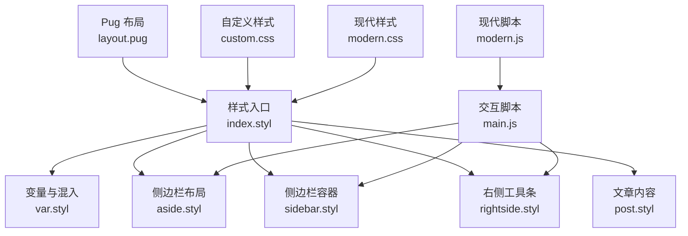
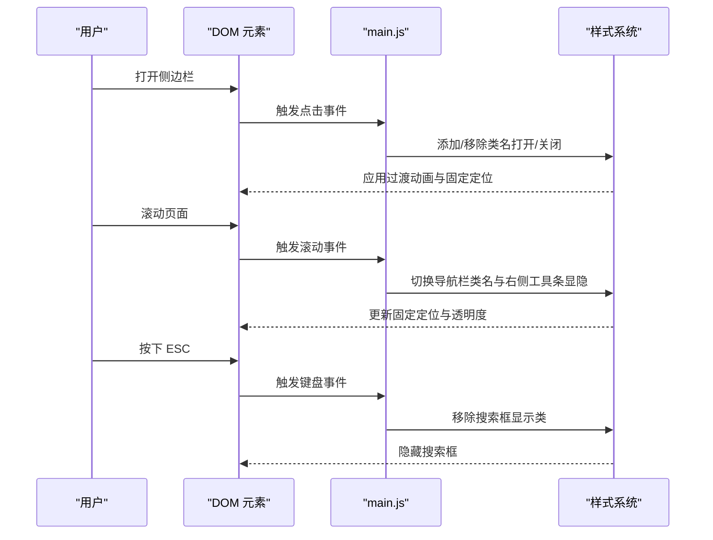
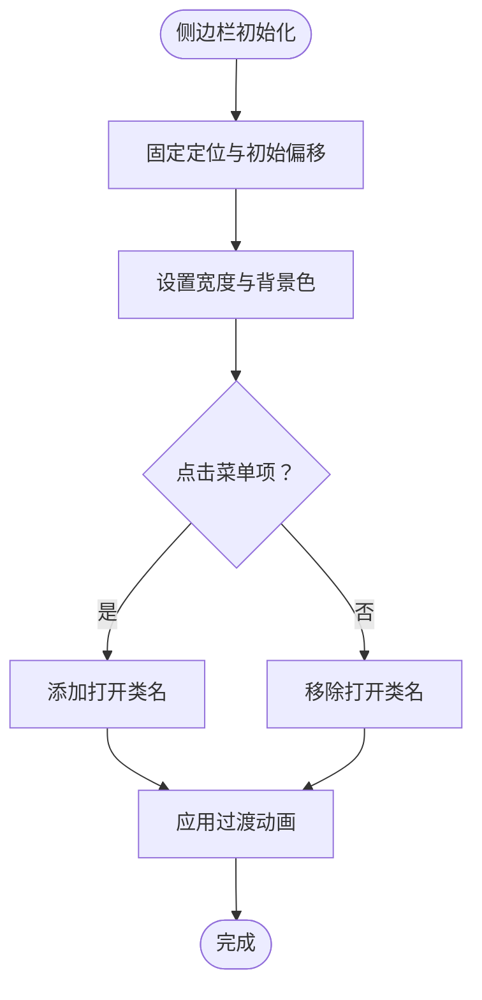
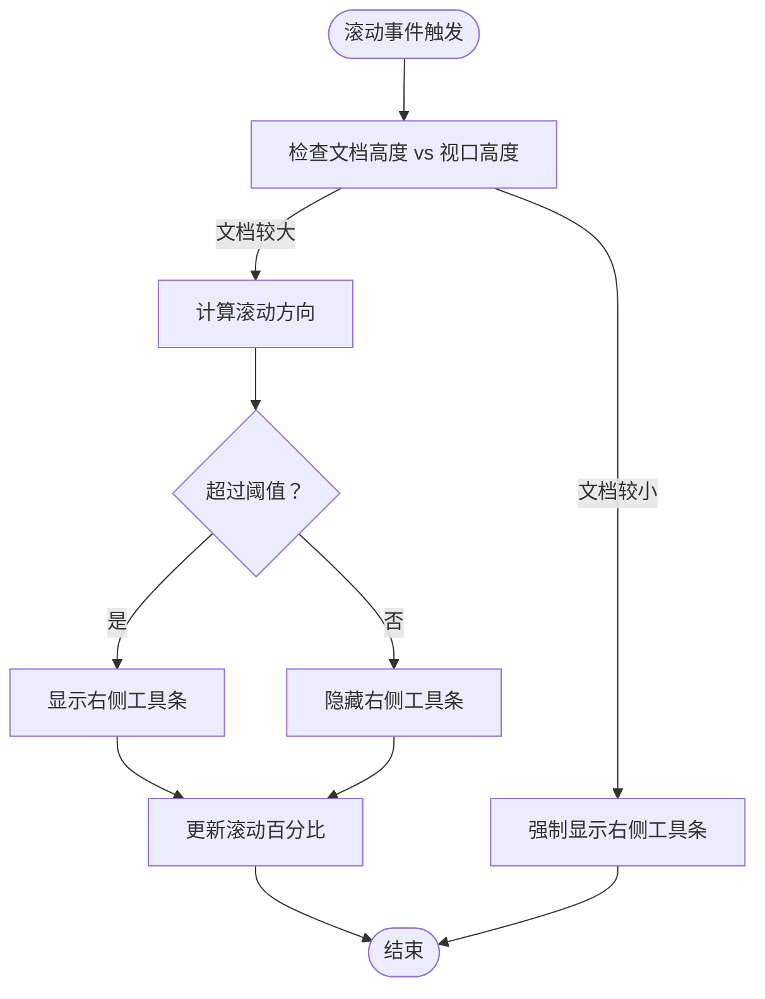
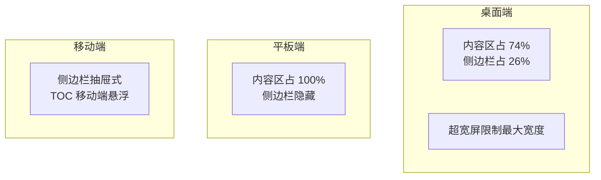
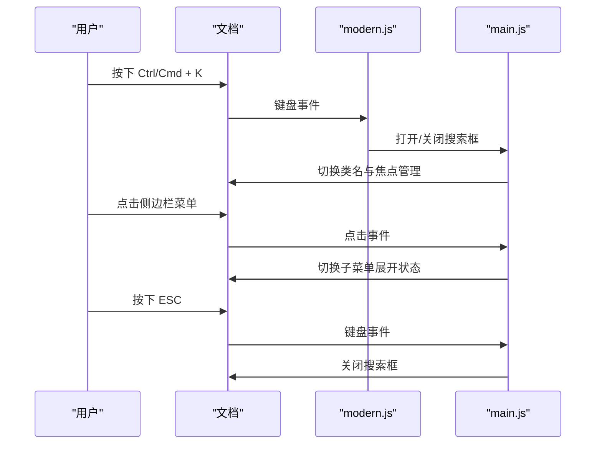
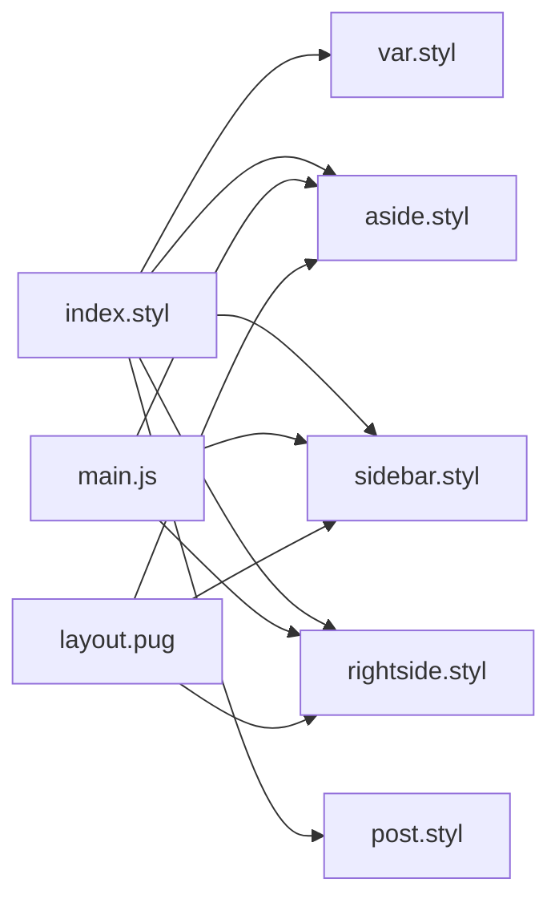

# 桌面端优化

<cite>
**本文档引用的文件**
- [main.js](file://themes/butterfly/source/js/main.js)
- [sidebar.styl](file://themes/butterfly/source/css/_layout/sidebar.styl)
- [rightside.styl](file://themes/butterfly/source/css/_layout/rightside.styl)
- [aside.styl](file://themes/butterfly/source/css/_layout/aside.styl)
- [post.styl](file://themes/butterfly/source/css/_layout/post.styl)
- [layout.pug](file://themes/butterfly/layout/includes/layout.pug)
- [sidebar.pug](file://themes/butterfly/layout/includes/sidebar.pug)
- [index.styl](file://themes/butterfly/source/css/index.styl)
- [var.styl](file://themes/butterfly/source/css/var.styl)
- [default_config.js](file://themes/butterfly/scripts/common/default_config.js)
- [custom.css](file://source/css/custom.css)
- [modern.css](file://source/css/modern.css)
- [modern.js](file://source/js/modern.js)
</cite>

## 目录
1. [简介](#简介)
2. [项目结构](#项目结构)
3. [核心组件](#核心组件)
4. [架构总览](#架构总览)
5. [详细组件分析](#详细组件分析)
6. [依赖关系分析](#依赖关系分析)
7. [性能考虑](#性能考虑)
8. [故障排除指南](#故障排除指南)
9. [结论](#结论)
10. [附录](#附录)

## 简介
本文件面向博客系统桌面端优化，聚焦于桌面端布局策略、鼠标交互设计、键盘导航支持与高分辨率屏幕适配。文档基于现有代码库进行深入分析，涵盖侧边栏固定定位、多列布局实现、滚动行为优化、窗口尺寸变化响应机制，并提供桌面端特有的交互模式、快捷键支持与高DPI适配的技术细节及性能优化建议。

## 项目结构
主题采用模块化组织：Pug模板负责页面结构，Stylus样式定义布局与响应式规则，JavaScript负责交互逻辑与滚动行为。桌面端优化主要体现在以下方面：
- 布局：通过 Stylus 的媒体查询与 Flex 布局实现多列内容区与侧边栏的自适应排列
- 侧边栏：固定定位与平滑过渡，支持打开/关闭动画
- 右侧工具条：固定定位与显示/隐藏动画，配合滚动百分比展示
- 滚动行为：节流处理与方向检测，实现导航栏固定与右侧工具条显隐
- 键盘导航：搜索框 ESC 关闭、Ctrl/Cmd + K 快捷键开关

**图表来源**
- [layout.pug](file://themes/butterfly/layout/includes/layout.pug)
- [index.styl](file://themes/butterfly/source/css/index.styl)
- [var.styl](file://themes/butterfly/source/css/var.styl)
- [aside.styl](file://themes/butterfly/source/css/_layout/aside.styl)
- [sidebar.styl](file://themes/butterfly/source/css/_layout/sidebar.styl)
- [rightside.styl](file://themes/butterfly/source/css/_layout/rightside.styl)
- [post.styl](file://themes/butterfly/source/css/_layout/post.styl)
- [main.js](file://themes/butterfly/source/js/main.js)
- [custom.css](file://source/css/custom.css)
- [modern.css](file://source/css/modern.css)
- [modern.js](file://source/js/modern.js)

**章节来源**
- [layout.pug](file://themes/butterfly/layout/includes/layout.pug)
- [index.styl](file://themes/butterfly/source/css/index.styl)

## 核心组件
- 侧边栏容器与菜单
  - 固定定位、滚动条、宽度与过渡动画
  - 打开/关闭状态切换与遮罩层
- 右侧工具条
  - 固定定位、显隐动画、滚动百分比展示
  - 移动端与桌面端差异化显示
- 多列布局
  - 内容区与侧边栏宽度分配、隐藏/显示控制
  - 在大屏设备上的最大宽度限制
- 滚动行为
  - 导航栏固定与可见性切换
  - 右侧工具条显示/隐藏与滚动百分比更新
- 键盘导航
  - ESC 关闭搜索框
  - Ctrl/Cmd + K 切换搜索框

**章节来源**
- [sidebar.styl](file://themes/butterfly/source/css/_layout/sidebar.styl)
- [rightside.styl](file://themes/butterfly/source/css/_layout/rightside.styl)
- [aside.styl](file://themes/butterfly/source/css/_layout/aside.styl)
- [post.styl](file://themes/butterfly/source/css/_layout/post.styl)
- [main.js](file://themes/butterfly/source/js/main.js)

## 架构总览
桌面端优化围绕“布局-交互-滚动-键盘”四个维度展开：
- 布局：通过 Stylus 的媒体查询与 Flex 布局在不同视口宽度下调整内容区与侧边栏的占比与排列方式
- 交互：JavaScript 负责侧边栏开关、滚动监听、TOC 自动滚动、主题切换等
- 滚动：节流与方向判断，控制导航栏固定与右侧工具条显隐
- 键盘：统一的键盘事件处理，提供便捷的搜索框开关

**图表来源**
- [main.js](file://themes/butterfly/source/js/main.js)
- [sidebar.styl](file://themes/butterfly/source/css/_layout/sidebar.styl)
- [rightside.styl](file://themes/butterfly/source/css/_layout/rightside.styl)

## 详细组件分析

### 侧边栏固定定位与多列布局
- 固定定位与宽度
  - 侧边栏使用固定定位，初始位于屏幕右侧外侧，通过类名切换实现平滑进入
  - 宽度由变量控制，确保在不同设备上保持一致的视觉比例
- 多列布局
  - 内容区与侧边栏通过 Flex 布局组合，在桌面端默认 74% : 26% 分配
  - 当侧边栏被隐藏时，内容区宽度自动扩展至 100%
  - 在超宽屏设备上限制最大宽度，避免内容过于稀疏
- 子菜单展开/收起
  - 通过点击父级菜单项切换子菜单的显示状态，使用 CSS 过渡与 transform 实现流畅动画

**图表来源**
- [sidebar.styl](file://themes/butterfly/source/css/_layout/sidebar.styl)
- [aside.styl](file://themes/butterfly/source/css/_layout/aside.styl)
- [layout.pug](file://themes/butterfly/layout/includes/layout.pug)

**章节来源**
- [sidebar.styl](file://themes/butterfly/source/css/_layout/sidebar.styl)
- [aside.styl](file://themes/butterfly/source/css/_layout/aside.styl)
- [layout.pug](file://themes/butterfly/layout/includes/layout.pug)
- [var.styl](file://themes/butterfly/source/css/var.styl)

### 右侧工具条与滚动行为优化
- 固定定位与显隐
  - 右侧工具条固定在右下角，初始透明并处于隐藏状态
  - 滚动超过一定阈值后显示，向下滚动时隐藏，向上滚动时显示
- 滚动百分比
  - 在滚动进度达到阈值时显示百分比数字，提供直观的阅读进度反馈
- 与内容区的协调
  - 当文档高度小于视口高度时，右侧工具条始终显示
  - 导航栏在滚动时固定并根据方向切换可见性

**图表来源**
- [main.js](file://themes/butterfly/source/js/main.js)
- [rightside.styl](file://themes/butterfly/source/css/_layout/rightside.styl)

**章节来源**
- [main.js](file://themes/butterfly/source/js/main.js)
- [rightside.styl](file://themes/butterfly/source/css/_layout/rightside.styl)

### 桌面端布局策略与窗口尺寸响应
- 大屏设备优化
  - 在超宽屏设备上限制内容区最大宽度，提升可读性
  - 侧边栏在桌面端默认显示，移动端则通过抽屉式侧边栏呈现
- 响应式断点
  - 使用媒体查询在不同断点下调整内容区与侧边栏的宽度与排列
  - 移动端将侧边栏移至底部或通过抽屉形式呈现
- 自定义样式补充
  - 自定义样式与现代样式对移动端断点进行了细化，进一步优化小屏体验

**图表来源**
- [aside.styl](file://themes/butterfly/source/css/_layout/aside.styl)
- [layout.pug](file://themes/butterfly/layout/includes/layout.pug)
- [custom.css](file://source/css/custom.css)
- [modern.css](file://source/css/modern.css)

**章节来源**
- [aside.styl](file://themes/butterfly/source/css/_layout/aside.styl)
- [layout.pug](file://themes/butterfly/layout/includes/layout.pug)
- [custom.css](file://source/css/custom.css)
- [modern.css](file://source/css/modern.css)

### 鼠标交互设计与键盘导航支持
- 鼠标交互
  - 侧边栏菜单项悬停效果与点击切换子菜单展开状态
  - 右侧工具条按钮悬停变色与点击事件绑定
- 键盘导航
  - ESC 键关闭搜索框
  - Ctrl/Cmd + K 快速打开/关闭搜索框
  - 文章内标题锚点点击跳转，移动端 TOC 以弹出面板形式呈现

**图表来源**
- [modern.js](file://source/js/modern.js)
- [main.js](file://themes/butterfly/source/js/main.js)
- [sidebar.styl](file://themes/butterfly/source/css/_layout/sidebar.styl)

**章节来源**
- [modern.js](file://source/js/modern.js)
- [main.js](file://themes/butterfly/source/js/main.js)
- [sidebar.styl](file://themes/butterfly/source/css/_layout/sidebar.styl)

### 高分辨率屏幕适配与高DPI优化
- 字体与字号
  - 全局字体大小与代码字体大小可通过配置调整，适配不同 DPI 设置
- 图片与卡片
  - 卡片与图片在高分辨率下保持清晰，避免模糊
- 动画与过渡
  - 使用硬件加速属性与合适的动画曲线，保证在高刷新率显示器上的顺滑表现

**章节来源**
- [default_config.js](file://themes/butterfly/scripts/common/default_config.js)
- [var.styl](file://themes/butterfly/source/css/var.styl)
- [post.styl](file://themes/butterfly/source/css/_layout/post.styl)

## 依赖关系分析
- 样式依赖
  - index.styl 统一导入全局、页面、布局、标签与模式样式
  - var.styl 提供颜色、字体、间距等全局变量
  - 各布局样式文件相互独立又共同作用于页面结构
- 脚本依赖
  - main.js 依赖样式系统提供的类名与动画效果
  - modern.js 与 main.js 协同实现现代交互与键盘快捷键
- 模板依赖
  - layout.pug 将侧边栏、内容区与右侧工具条整合到页面骨架中

**图表来源**
- [index.styl](file://themes/butterfly/source/css/index.styl)
- [var.styl](file://themes/butterfly/source/css/var.styl)
- [aside.styl](file://themes/butterfly/source/css/_layout/aside.styl)
- [sidebar.styl](file://themes/butterfly/source/css/_layout/sidebar.styl)
- [rightside.styl](file://themes/butterfly/source/css/_layout/rightside.styl)
- [post.styl](file://themes/butterfly/source/css/_layout/post.styl)
- [layout.pug](file://themes/butterfly/layout/includes/layout.pug)
- [main.js](file://themes/butterfly/source/js/main.js)

**章节来源**
- [index.styl](file://themes/butterfly/source/css/index.styl)
- [layout.pug](file://themes/butterfly/layout/includes/layout.pug)

## 性能考虑
- 滚动事件节流
  - 使用节流函数降低滚动事件频率，减少重绘与回流
- 事件委托与按需加载
  - 使用事件委托减少监听器数量；必要时延迟加载第三方资源
- 动画优化
  - 使用 transform 与 opacity 控制动画，优先触发合成层
- 响应式断点
  - 合理设置断点，避免在中间尺寸频繁切换导致的性能损耗

**章节来源**
- [main.js](file://themes/butterfly/source/js/main.js)

## 故障排除指南
- 侧边栏无法打开/关闭
  - 检查是否存在打开类名与遮罩层显示逻辑
  - 确认点击事件是否正确绑定到菜单项
- 右侧工具条不显示
  - 检查滚动阈值与文档高度判断逻辑
  - 确认类名切换与 CSS 动画是否生效
- 滚动百分比不更新
  - 检查滚动事件是否被正确节流
  - 确认百分比元素的选择器与更新逻辑
- 键盘快捷键无效
  - 检查事件监听是否绑定到正确的元素
  - 确认快捷键组合与浏览器兼容性

**章节来源**
- [main.js](file://themes/butterfly/source/js/main.js)
- [sidebar.styl](file://themes/butterfly/source/css/_layout/sidebar.styl)
- [rightside.styl](file://themes/butterfly/source/css/_layout/rightside.styl)

## 结论
该博客系统在桌面端实现了稳定的多列布局、流畅的侧边栏与右侧工具条交互、以及针对滚动行为的优化。通过合理的媒体查询与变量配置，系统能够在不同分辨率与设备上提供一致的用户体验。建议在后续迭代中进一步完善键盘导航覆盖范围与无障碍支持，并持续优化滚动性能与动画细节。

## 附录
- 配置参考
  - 侧边栏位置、显示/隐藏、移动端展示等配置项
  - 右侧工具条显示选项与滚动百分比开关
- 样式变量
  - 字体大小、颜色主题、侧边栏宽度等全局变量

**章节来源**
- [default_config.js](file://themes/butterfly/scripts/common/default_config.js)
- [var.styl](file://themes/butterfly/source/css/var.styl)