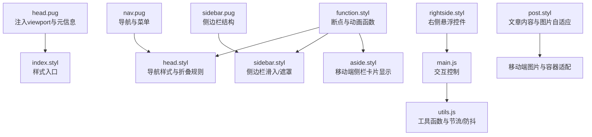
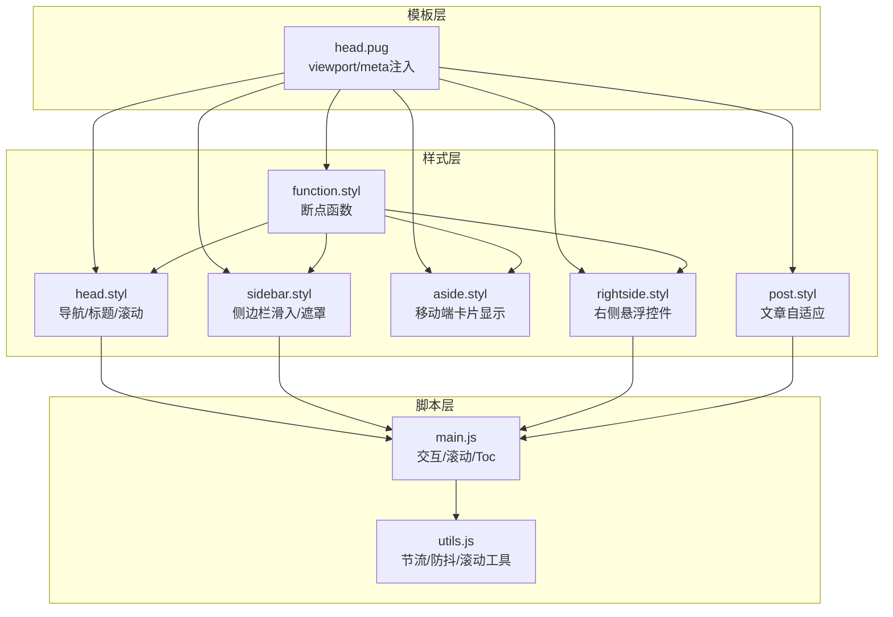
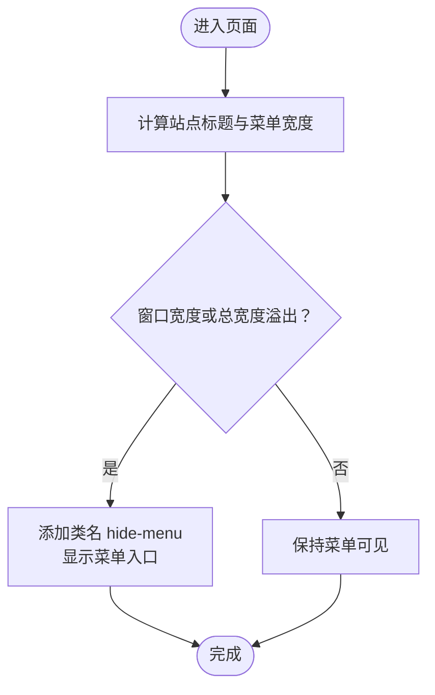
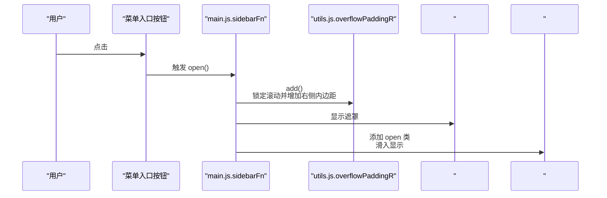
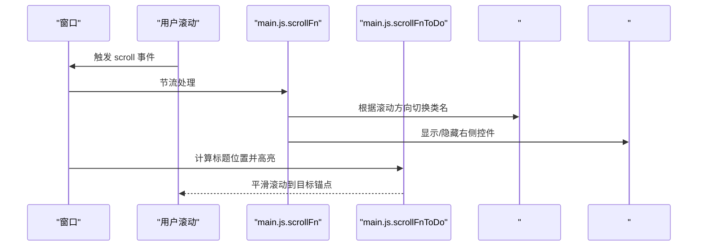
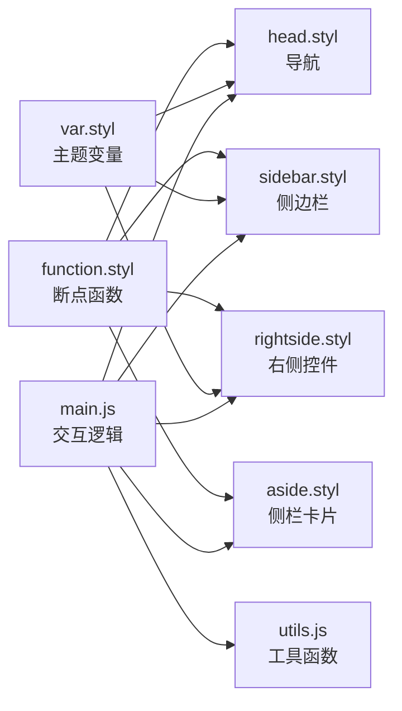

# 移动端适配策略

<cite>
**本文档引用的文件**
- [head.pug](file://themes/butterfly/layout/includes/head.pug)
- [nav.pug](file://themes/butterfly/layout/includes/header/nav.pug)
- [sidebar.pug](file://themes/butterfly/layout/includes/sidebar.pug)
- [head.styl](file://themes/butterfly/source/css/_layout/head.styl)
- [sidebar.styl](file://themes/butterfly/source/css/_layout/sidebar.styl)
- [rightside.styl](file://themes/butterfly/source/css/_layout/rightside.styl)
- [aside.styl](file://themes/butterfly/source/css/_layout/aside.styl)
- [function.styl](file://themes/butterfly/source/css/_global/function.styl)
- [main.js](file://themes/butterfly/source/js/main.js)
- [utils.js](file://themes/butterfly/source/js/utils.js)
- [index.styl](file://themes/butterfly/source/css/index.styl)
- [var.styl](file://themes/butterfly/source/css/var.styl)
- [post.styl](file://themes/butterfly/source/css/_layout/post.styl)
</cite>

## 目录
1. [引言](#引言)
2. [项目结构](#项目结构)
3. [核心组件](#核心组件)
4. [架构总览](#架构总览)
5. [详细组件分析](#详细组件分析)
6. [依赖关系分析](#依赖关系分析)
7. [性能考量](#性能考量)
8. [故障排查指南](#故障排查指南)
9. [结论](#结论)
10. [附录](#附录)

## 引言
本文件系统性梳理博客主题在移动端的适配策略，围绕“移动端优先”的设计理念，从视口配置、响应式断点、导航与侧边栏交互、触摸目标优化、手势支持到性能优化与调试方法进行深入解析。文档以实际源码为依据，配合可视化图示帮助读者快速理解并落地实践。

## 项目结构
移动端适配涉及模板层（Pug）、样式层（Stylus）与脚本层（JavaScript）协同工作：
- 视口与元信息：通过模板注入 viewport 元标签与主题色等元信息，确保移动端正确缩放与主题一致性。
- 导航与菜单：在窄屏下自动折叠菜单项，保留主导航入口；侧边栏采用滑入式覆盖层，避免阻塞主内容。
- 响应式断点：统一使用预定义断点函数，覆盖 768px、900px、1024px 等关键节点，保证布局在不同设备上稳定呈现。
- 交互与动画：通过 JavaScript 控制侧边栏开关、滚动行为与 TOC 展开，结合 CSS 动画提升体验。
- 性能优化：节流/防抖、懒加载、骨架屏与轻量动画，降低移动端资源消耗。

**图表来源**
- [head.pug:24-29](file://themes/butterfly/layout/includes/head.pug#L24-L29)
- [index.styl:1-15](file://themes/butterfly/source/css/index.styl#L1-L15)
- [nav.pug:1-26](file://themes/butterfly/layout/includes/header/nav.pug#L1-L26)
- [head.styl:290-465](file://themes/butterfly/source/css/_layout/head.styl#L290-L465)
- [sidebar.pug:1-18](file://themes/butterfly/layout/includes/sidebar.pug#L1-L18)
- [sidebar.styl:1-97](file://themes/butterfly/source/css/_layout/sidebar.styl#L1-L97)
- [main.js:1-800](file://themes/butterfly/source/js/main.js#L1-L800)
- [utils.js:1-339](file://themes/butterfly/source/js/utils.js#L1-L339)
- [function.styl:111-145](file://themes/butterfly/source/css/_global/function.styl#L111-L145)
- [aside.styl:1-435](file://themes/butterfly/source/css/_layout/aside.styl#L1-L435)
- [rightside.styl:1-109](file://themes/butterfly/source/css/_layout/rightside.styl#L1-L109)
- [post.styl:85-90](file://themes/butterfly/source/css/_layout/post.styl#L85-L90)

**章节来源**
- [head.pug:1-78](file://themes/butterfly/layout/includes/head.pug#L1-L78)
- [index.styl:1-15](file://themes/butterfly/source/css/index.styl#L1-L15)

## 核心组件
- 视口与元信息：通过 viewport-fit=cover、initial-scale=1.0 等确保安全区域与缩放一致，主题色随深浅色模式切换。
- 导航与菜单：窄屏下自动隐藏部分菜单项，仅保留主导航入口；支持搜索按钮与菜单展开。
- 侧边栏：固定遮罩层与滑入式菜单，支持子菜单分组展开/收起，避免遮挡主内容。
- 右侧悬浮控件：包含回到顶部、阅读模式、深浅色切换、隐藏侧栏等按钮，移动端按需显示。
- 响应式断点：统一使用 maxWidth768()/minWidth768() 等断点函数，覆盖移动端与平板场景。
- 交互与动画：滚动行为、TOC 自动定位、按钮涟漪效果、侧边栏滑入动画等。

**章节来源**
- [head.pug:24-29](file://themes/butterfly/layout/includes/head.pug#L24-L29)
- [nav.pug:1-26](file://themes/butterfly/layout/includes/header/nav.pug#L1-L26)
- [sidebar.pug:1-18](file://themes/butterfly/layout/includes/sidebar.pug#L1-L18)
- [head.styl:290-465](file://themes/butterfly/source/css/_layout/head.styl#L290-L465)
- [sidebar.styl:1-97](file://themes/butterfly/source/css/_layout/sidebar.styl#L1-L97)
- [rightside.styl:1-109](file://themes/butterfly/source/css/_layout/rightside.styl#L1-L109)
- [function.styl:111-145](file://themes/butterfly/source/css/_global/function.styl#L111-L145)

## 架构总览
移动端适配采用“模板注入 + 样式断点 + 脚本控制”的三层架构：
- 模板层负责视口与元信息注入，确保浏览器正确渲染。
- 样式层通过断点函数与媒体查询，控制布局与可见性。
- 脚本层处理用户交互、滚动行为与状态切换，提供流畅体验。

**图表来源**
- [head.pug:24-29](file://themes/butterfly/layout/includes/head.pug#L24-L29)
- [function.styl:111-145](file://themes/butterfly/source/css/_global/function.styl#L111-L145)
- [head.styl:290-465](file://themes/butterfly/source/css/_layout/head.styl#L290-L465)
- [sidebar.styl:1-97](file://themes/butterfly/source/css/_layout/sidebar.styl#L1-L97)
- [aside.styl:1-435](file://themes/butterfly/source/css/_layout/aside.styl#L1-L435)
- [rightside.styl:1-109](file://themes/butterfly/source/css/_layout/rightside.styl#L1-L109)
- [post.styl:85-90](file://themes/butterfly/source/css/_layout/post.styl#L85-L90)
- [main.js:1-800](file://themes/butterfly/source/js/main.js#L1-L800)
- [utils.js:1-339](file://themes/butterfly/source/js/utils.js#L1-L339)

## 详细组件分析

### 视口与元信息配置
- viewport 元标签包含 width=device-width、initial-scale=1.0、viewport-fit=cover，确保页面按设备宽度渲染且覆盖刘海区域。
- 主题色根据当前模式动态设置，提升品牌一致性与可读性。
- 禁用电话号码识别，避免误触发拨号行为。

**章节来源**
- [head.pug:24-29](file://themes/butterfly/layout/includes/head.pug#L24-L29)

### 导航栏与菜单折叠
- 在窄屏下，导航会根据内容宽度与容器剩余空间自动隐藏部分菜单项，并显示“菜单”入口按钮。
- 菜单项采用 hover 子菜单展示，移动端通过点击展开/收起。
- 搜索按钮在窄屏下按需隐藏，节省空间。

**图表来源**
- [main.js:5-17](file://themes/butterfly/source/js/main.js#L5-L17)
- [head.styl:401-413](file://themes/butterfly/source/css/_layout/head.styl#L401-L413)
- [nav.pug:1-26](file://themes/butterfly/layout/includes/header/nav.pug#L1-L26)

**章节来源**
- [main.js:5-17](file://themes/butterfly/source/js/main.js#L5-L17)
- [head.styl:401-413](file://themes/butterfly/source/css/_layout/head.styl#L401-L413)
- [nav.pug:1-26](file://themes/butterfly/layout/includes/header/nav.pug#L1-L26)

### 侧边栏显示/隐藏逻辑
- 侧边栏采用固定遮罩层与滑入式菜单，初始位置位于右侧外侧，通过“open”类触发动画。
- 打开时锁定主体滚动并增加右侧内边距，防止背景滚动与菜单被遮挡。
- 支持子菜单分组展开/收起，移动端点击父级条目切换子项显隐。

**图表来源**
- [main.js:26-39](file://themes/butterfly/source/js/main.js#L26-L39)
- [utils.js:48-69](file://themes/butterfly/source/js/utils.js#L48-L69)
- [sidebar.styl:1-25](file://themes/butterfly/source/css/_layout/sidebar.styl#L1-L25)
- [sidebar.pug:1-18](file://themes/butterfly/layout/includes/sidebar.pug#L1-L18)

**章节来源**
- [main.js:26-39](file://themes/butterfly/source/js/main.js#L26-L39)
- [utils.js:48-69](file://themes/butterfly/source/js/utils.js#L48-L69)
- [sidebar.styl:1-25](file://themes/butterfly/source/css/_layout/sidebar.styl#L1-L25)
- [sidebar.pug:1-18](file://themes/butterfly/layout/includes/sidebar.pug#L1-L18)

### 右侧悬浮控件与移动端显示
- 右侧控件在窄屏下按需显示，例如移动端 TOC 按钮默认隐藏，仅在窄屏时显示。
- 回到顶部、隐藏侧栏、深浅色切换等按钮在移动端保持统一尺寸与间距，便于触摸操作。

**章节来源**
- [rightside.styl:49-58](file://themes/butterfly/source/css/_layout/rightside.styl#L49-L58)
- [aside.styl:239-248](file://themes/butterfly/source/css/_layout/aside.styl#L239-L248)

### 响应式断点与布局变化
- 统一断点函数：maxWidth768()/minWidth768()、maxWidth900()/minWidth900()、maxWidth1024()/minWidth1024() 等。
- 不同断点下，导航、侧边栏卡片、TOC 弹层等元素的显示/隐藏与尺寸调整均基于这些断点函数实现。
- 文章标题、副标题、导航字体在不同断点下有差异化字号，保证可读性。

**章节来源**
- [function.styl:111-145](file://themes/butterfly/source/css/_global/function.styl#L111-L145)
- [head.styl:43-51](file://themes/butterfly/source/css/_layout/head.styl#L43-L51)
- [head.styl:122-126](file://themes/butterfly/source/css/_layout/head.styl#L122-L126)
- [aside.styl:21-24](file://themes/butterfly/source/css/_layout/aside.styl#L21-L24)

### 触摸目标大小优化
- 右侧悬浮按钮与菜单入口按钮统一采用 35px×35px 的点击热区，满足移动端可触达性要求。
- 导航菜单项与侧边栏条目具备合适的内边距与悬停反馈，提升点击精度。
- 图片与容器在移动端自动限制最大宽度，避免横向滚动。

**章节来源**
- [rightside.styl:33-41](file://themes/butterfly/source/css/_layout/rightside.styl#L33-L41)
- [head.styl:418-424](file://themes/butterfly/source/css/_layout/head.styl#L418-L424)
- [sidebar.styl:42-58](file://themes/butterfly/source/css/_layout/sidebar.styl#L42-L58)
- [post.styl:85-89](file://themes/butterfly/source/css/_layout/post.styl#L85-L89)

### 滚动行为与 TOC 自动定位
- 滚动时根据方向显示/隐藏导航与右侧控件，支持百分比进度指示。
- TOC 在窄屏下以弹层形式出现，点击标题自动滚动至对应锚点，并高亮当前项。
- 使用节流函数优化滚动事件频率，减少重绘与回流。

**图表来源**
- [main.js:440-503](file://themes/butterfly/source/js/main.js#L440-L503)
- [main.js:508-624](file://themes/butterfly/source/js/main.js#L508-L624)

**章节来源**
- [main.js:440-503](file://themes/butterfly/source/js/main.js#L440-L503)
- [main.js:508-624](file://themes/butterfly/source/js/main.js#L508-L624)

### 手势操作支持（示例：Mermaid 图表）
- 对于嵌入的 SVG 图表，提供多指缩放与平移手势，支持按中心点缩放与边界约束，提升移动端可交互性。
- 通过 pointer 事件与 viewBox 计算，实现稳定的缩放与平移体验。

**章节来源**
- [mermaid.pug:113-234](file://themes/butterfly/layout/includes/third-party/math/mermaid.pug#L113-L234)

## 依赖关系分析
- 断点函数被广泛用于导航、侧边栏、右侧控件与 TOC 等模块，形成统一的响应式策略。
- 样式变量与主题色在多个样式文件中复用，确保视觉一致性。
- 交互逻辑集中在 main.js 中，通过 utils.js 提供的节流/防抖与滚动工具，降低性能开销。

**图表来源**
- [function.styl:111-145](file://themes/butterfly/source/css/_global/function.styl#L111-L145)
- [var.styl:1-233](file://themes/butterfly/source/css/var.styl#L1-L233)
- [head.styl:290-465](file://themes/butterfly/source/css/_layout/head.styl#L290-L465)
- [sidebar.styl:1-97](file://themes/butterfly/source/css/_layout/sidebar.styl#L1-L97)
- [rightside.styl:1-109](file://themes/butterfly/source/css/_layout/rightside.styl#L1-L109)
- [aside.styl:1-435](file://themes/butterfly/source/css/_layout/aside.styl#L1-L435)
- [main.js:1-800](file://themes/butterfly/source/js/main.js#L1-L800)
- [utils.js:1-339](file://themes/butterfly/source/js/utils.js#L1-L339)

**章节来源**
- [function.styl:111-145](file://themes/butterfly/source/css/_global/function.styl#L111-L145)
- [var.styl:1-233](file://themes/butterfly/source/css/var.styl#L1-L233)
- [main.js:1-800](file://themes/butterfly/source/js/main.js#L1-L800)
- [utils.js:1-339](file://themes/butterfly/source/js/utils.js#L1-L339)

## 性能考量
- 事件节流/防抖：滚动、窗口尺寸变更等高频事件使用节流/防抖，减少主线程压力。
- 懒执行与延迟加载：图片与第三方组件按需加载，降低首屏负担。
- 动画与过渡：使用 transform/opacity 等可合成属性，避免强制同步布局。
- 内存管理：通过全局事件清理机制，避免重复绑定导致的内存泄漏。

**章节来源**
- [utils.js:3-46](file://themes/butterfly/source/js/utils.js#L3-L46)
- [utils.js:303-318](file://themes/butterfly/source/js/utils.js#L303-L318)
- [main.js:468-500](file://themes/butterfly/source/js/main.js#L468-L500)

## 故障排查指南
- 侧边栏打开后页面仍可滚动
  - 检查是否调用锁定滚动函数，确认遮罩与菜单 open 类已正确应用。
  - 参考：[utils.js:48-69](file://themes/butterfly/source/js/utils.js#L48-L69)、[sidebar.styl:1-25](file://themes/butterfly/source/css/_layout/sidebar.styl#L1-L25)
- 导航在窄屏下未正确折叠
  - 检查导航宽度计算与容器剩余空间判断逻辑。
  - 参考：[main.js:5-17](file://themes/butterfly/source/js/main.js#L5-L17)、[head.styl:401-413](file://themes/butterfly/source/css/_layout/head.styl#L401-L413)
- TOC 在窄屏不显示
  - 确认移动端 TOC 按钮显示条件与 open 类切换逻辑。
  - 参考：[rightside.styl:49-58](file://themes/butterfly/source/css/_layout/rightside.styl#L49-L58)、[aside.styl:239-253](file://themes/butterfly/source/css/_layout/aside.styl#L239-L253)
- 滚动卡顿或跳动
  - 检查滚动事件是否过度触发，确认节流参数合理。
  - 参考：[main.js:468-500](file://themes/butterfly/source/js/main.js#L468-L500)、[utils.js:17-46](file://themes/butterfly/source/js/utils.js#L17-L46)
- 图片在移动端横向滚动
  - 确认图片最大宽度与容器自适应设置。
  - 参考：[post.styl:85-89](file://themes/butterfly/source/css/_layout/post.styl#L85-L89)

**章节来源**
- [utils.js:48-69](file://themes/butterfly/source/js/utils.js#L48-L69)
- [sidebar.styl:1-25](file://themes/butterfly/source/css/_layout/sidebar.styl#L1-L25)
- [main.js:5-17](file://themes/butterfly/source/js/main.js#L5-L17)
- [head.styl:401-413](file://themes/butterfly/source/css/_layout/head.styl#L401-L413)
- [rightside.styl:49-58](file://themes/butterfly/source/css/_layout/rightside.styl#L49-L58)
- [aside.styl:239-253](file://themes/butterfly/source/css/_layout/aside.styl#L239-L253)
- [main.js:468-500](file://themes/butterfly/source/js/main.js#L468-L500)
- [utils.js:17-46](file://themes/butterfly/source/js/utils.js#L17-L46)
- [post.styl:85-89](file://themes/butterfly/source/css/_layout/post.styl#L85-L89)

## 结论
该主题通过“模板注入 + 样式断点 + 脚本控制”的移动端适配方案，在保证视觉一致性的同时，兼顾了交互流畅性与性能稳定性。建议在实际部署中：
- 明确业务场景，按需启用侧栏卡片与 TOC 弹层；
- 合理设置断点阈值，平衡信息密度与可读性；
- 持续监控滚动与手势交互，确保在低端设备上的流畅度。

## 附录
- 常用断点函数速览
  - maxWidth768()/minWidth768()
  - maxWidth900()/minWidth900()
  - maxWidth1024()/minWidth1024()
- 关键变量与主题色
  - 主题色、按钮色、TOC 颜色等由主题配置驱动，确保跨页面一致性。

**章节来源**
- [function.styl:111-145](file://themes/butterfly/source/css/_global/function.styl#L111-L145)
- [var.styl:1-233](file://themes/butterfly/source/css/var.styl#L1-L233)