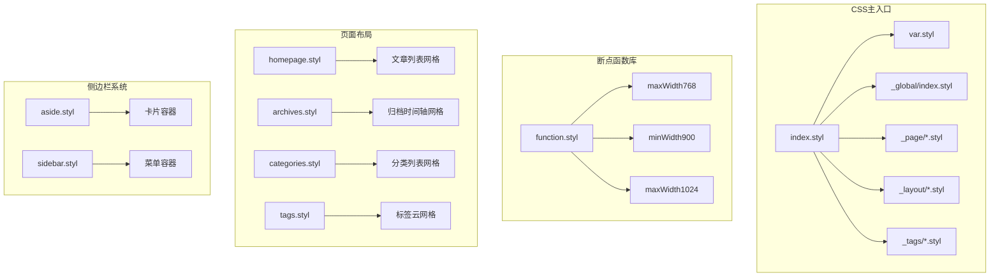
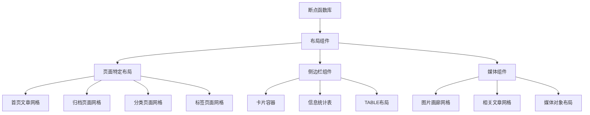
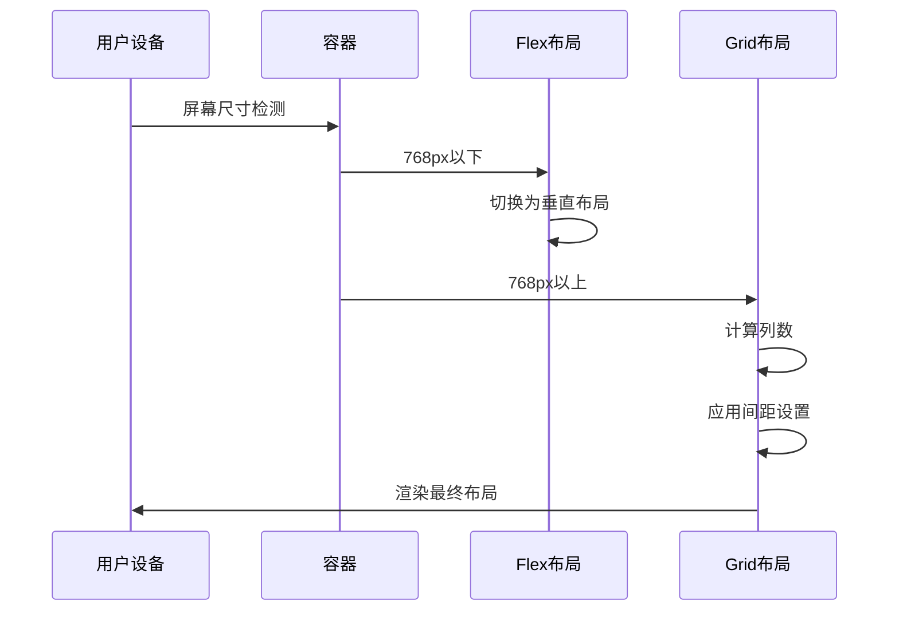
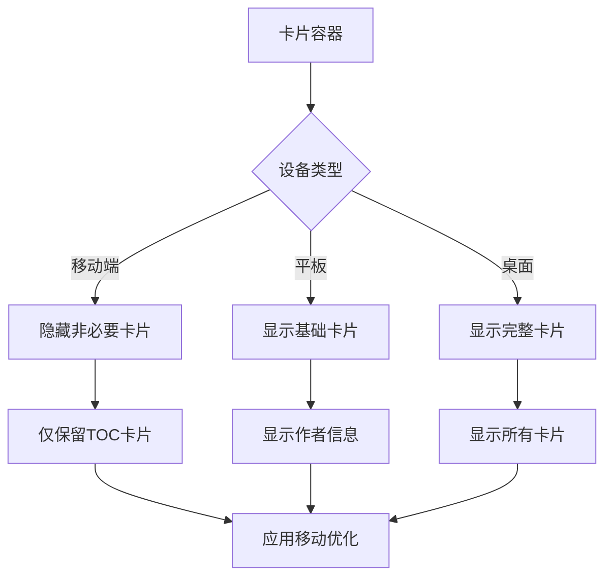
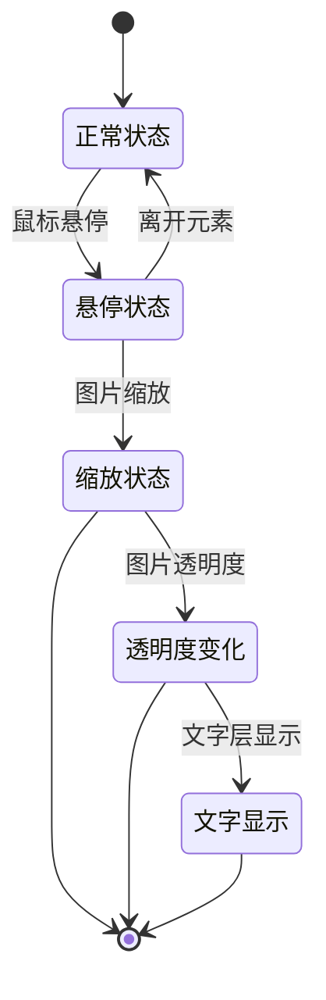
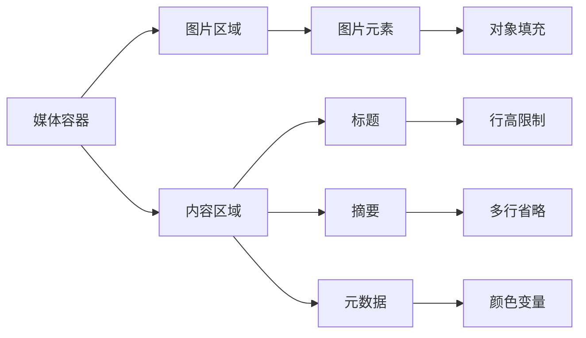
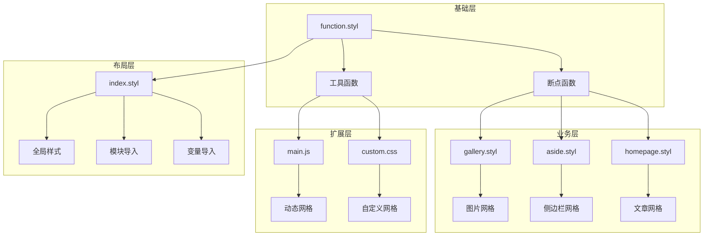
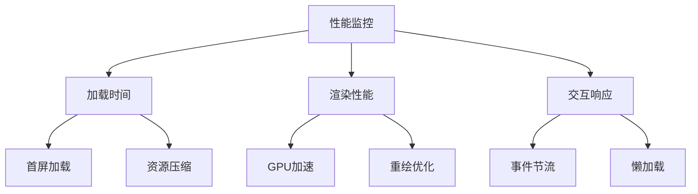

# 网格系统实现

<cite>
**本文档引用的文件**
- [index.styl](file://themes/butterfly/source/css/index.styl)
- [var.styl](file://themes/butterfly/source/css/var.styl)
- [function.styl](file://themes/butterfly/source/css/_global/function.styl)
- [index.styl](file://themes/butterfly/source/css/_global/index.styl)
- [homepage.styl](file://themes/butterfly/source/css/_page/homepage.styl)
- [archives.styl](file://themes/butterfly/source/css/_page/archives.styl)
- [categories.styl](file://themes/butterfly/source/css/_page/categories.styl)
- [tags.styl](file://themes/butterfly/source/css/_page/tags.styl)
- [aside.styl](file://themes/butterfly/source/css/_layout/aside.styl)
- [sidebar.styl](file://themes/butterfly/source/css/_layout/sidebar.styl)
- [post.styl](file://themes/butterfly/source/css/_layout/post.styl)
- [pagination.styl](file://themes/butterfly/source/css/_layout/pagination.styl)
- [relatedposts.styl](file://themes/butterfly/source/css/_layout/relatedposts.styl)
- [gallery.styl](file://themes/butterfly/source/css/_tags/gallery.styl)
- [main.js](file://themes/butterfly/source/js/main.js)
- [custom.css](file://source/css/custom.css)
</cite>

## 目录
1. [简介](#简介)
2. [项目结构](#项目结构)
3. [核心组件](#核心组件)
4. [架构概览](#架构概览)
5. [详细组件分析](#详细组件分析)
6. [依赖关系分析](#依赖关系分析)
7. [性能考虑](#性能考虑)
8. [故障排除指南](#故障排除指南)
9. [结论](#结论)

## 简介

本文件详细分析博客系统的网格系统实现，涵盖CSS Grid和Flexbox的使用策略、栅格布局的断点设计、内容区域的自适应排列。文档重点说明文章列表的网格布局、侧边栏卡片的排列规则、响应式图片网格和媒体对象的布局实现，并提供网格系统的配置参数、自定义网格类的使用方法、网格间距和对齐方式的控制策略。

## 项目结构

博客主题采用Stylus预处理器和原生CSS相结合的方式构建网格系统。主要结构包括：

**图表来源**
- [index.styl:1-15](file://themes/butterfly/source/css/index.styl#L1-L15)
- [function.styl:111-145](file://themes/butterfly/source/css/_global/function.styl#L111-L145)

**章节来源**
- [index.styl:1-15](file://themes/butterfly/source/css/index.styl#L1-L15)
- [var.styl:1-233](file://themes/butterfly/source/css/var.styl#L1-L233)

## 核心组件

### 断点系统

网格系统基于一组预定义的断点函数实现响应式布局：

| 断点名称 | 媒体查询条件 | 使用场景 |
|---------|-------------|----------|
| maxWidth600 | max-width: 600px | 超小屏设备优化 |
| maxWidth768 | max-width: 768px | 移动端适配 |
| minWidth900 | min-width: 900px | 中等及以上屏幕 |
| minWidth1024 | min-width: 1024px | 大屏桌面端 |
| minWidth2000 | min-width: 2000px | 超大屏显示器 |

### 布局容器

系统采用多种容器类型支持不同的网格布局需求：

- **Flex容器**: 主要用于行内布局和媒体对象
- **Grid容器**: 用于复杂的二维布局
- **流式容器**: 用于简单的块级布局

**章节来源**
- [function.styl:111-145](file://themes/butterfly/source/css/_global/function.styl#L111-L145)
- [index.styl:101-133](file://themes/butterfly/source/css/_global/index.styl#L101-L133)

## 架构概览

网格系统的整体架构采用分层设计，从底层断点函数到上层布局组件形成完整的响应式体系：

**图表来源**
- [function.styl:1-348](file://themes/butterfly/source/css/_global/function.styl#L1-L348)
- [homepage.styl:1-175](file://themes/butterfly/source/css/_page/homepage.styl#L1-L175)
- [aside.styl:1-435](file://themes/butterfly/source/css/_layout/aside.styl#L1-L435)

## 详细组件分析

### 文章列表网格系统

首页文章列表实现了多种布局模式，支持不同屏幕尺寸下的自适应显示：

#### 布局模式配置

| 模式编号 | 布局类型 | 特征描述 | 屏幕适配 |
|---------|----------|----------|----------|
| 1 | 双栏媒体对象 | 图文混排，左侧图片右侧文字 | 768px+ |
| 2 | 双栏媒体对象 | 图片在右侧 | 768px+ |
| 3 | 双栏媒体对象 | 图片可切换位置 | 768px+ |
| 4 | 全宽横幅 | 单行全宽展示 | 768px+ |
| 5 | 全宽横幅 | 带覆盖层效果 | 768px+ |
| 6 | 弹性网格 | 两列自适应 | 768px+ |
| 7 | 弹性网格 | 三列自适应 | 2000px+ |

#### 响应式实现机制

**图表来源**
- [homepage.styl:11-34](file://themes/butterfly/source/css/_page/homepage.styl#L11-L34)

#### 关键实现要点

1. **动态宽度计算**: 使用`calc(100% / N - 8px)`实现等比分配
2. **弹性布局**: 在小屏设备上自动切换为单列布局
3. **覆盖层效果**: 支持图片覆盖半透明背景层
4. **高度自适应**: 不同模式下设置合适的高度比例

**章节来源**
- [homepage.styl:1-175](file://themes/butterfly/source/css/_page/homepage.styl#L1-L175)

### 侧边栏卡片网格系统

侧边栏采用卡片式设计，支持多种卡片类型的灵活排列：

#### 卡片容器特性

| 属性 | 默认值 | 说明 |
|------|--------|------|
| 内边距 | 20px 24px | 提供充足的内部空间 |
| 外边距 | 0 0 20px | 卡片间的垂直间距 |
| 圆角 | 8px | 统一的视觉风格 |
| 阴影 | 变化阴影 | 悬停时增强立体感 |

#### 响应式卡片行为

**图表来源**
- [aside.styl:21-24](file://themes/butterfly/source/css/_layout/aside.styl#L21-L24)

**章节来源**
- [aside.styl:14-435](file://themes/butterfly/source/css/_layout/aside.styl#L14-L435)

### 响应式图片网格

图片网格系统支持多种展示模式，从简单的两列布局到复杂的画廊效果：

#### 图片网格配置

| 模式 | 容器宽度 | 图片尺寸 | 间距设置 | 媒体查询 |
|------|----------|----------|----------|----------|
| 标准网格 | calc(50% - 8px) | 250px × 250px | 6px 4px | 768px+ |
| 移动优化 | calc(100% - 8px) | 自适应 | 6px 4px | ≤600px |
| 大屏优化 | calc(100% / 3 - 8px) | 250px × 250px | 6px 4px | ≥1024px |

#### 悬停交互效果

**图表来源**
- [gallery.styl:19-30](file://themes/butterfly/source/css/_tags/gallery.styl#L19-L30)

**章节来源**
- [gallery.styl:1-65](file://themes/butterfly/source/css/_tags/gallery.styl#L1-L65)

### 媒体对象布局

媒体对象采用Flexbox实现图文混排，支持多种对齐方式和响应式调整：

#### 媒体对象结构

**图表来源**
- [homepage.styl:23-34](file://themes/butterfly/source/css/_page/homepage.styl#L23-L34)

**章节来源**
- [homepage.styl:43-175](file://themes/butterfly/source/css/_page/homepage.styl#L43-L175)

### 分页导航网格

分页系统采用Flexbox实现数字分页按钮的自适应排列：

#### 分页布局特性

| 特性 | 实现方式 | 响应式行为 |
|------|----------|------------|
| 按钮尺寸 | 固定宽高2.5em | 保持一致的视觉比例 |
| 间距控制 | 6px外边距 | 动态调整间距 |
| 对齐方式 | 居中对齐 | 居中显示分页条 |
| 流式布局 | Flex容器 | 自动换行处理 |

**章节来源**
- [pagination.styl:38-106](file://themes/butterfly/source/css/_layout/pagination.styl#L38-L106)

## 依赖关系分析

网格系统的依赖关系呈现清晰的层次结构：

**图表来源**
- [index.styl:1-15](file://themes/butterfly/source/css/index.styl#L1-L15)
- [function.styl:1-348](file://themes/butterfly/source/css/_global/function.styl#L1-L348)

### 关键依赖链

1. **断点函数依赖**: 所有布局组件都依赖于断点函数库
2. **变量系统依赖**: 布局组件依赖于全局变量系统
3. **模块导入依赖**: 主入口文件统一管理模块导入顺序
4. **响应式依赖**: 布局组件内部实现响应式逻辑

**章节来源**
- [index.styl:6-12](file://themes/butterfly/source/css/index.styl#L6-L12)
- [var.styl:1-233](file://themes/butterfly/source/css/var.styl#L1-L233)

## 性能考虑

### 优化策略

1. **CSS变量缓存**: 使用CSS自定义属性减少重复计算
2. **媒体查询优化**: 合理使用min-width和max-width避免重叠
3. **渲染性能**: 使用transform替代position改变提升动画性能
4. **内存管理**: 及时清理事件监听器和DOM引用

### 性能监控

## 故障排除指南

### 常见问题及解决方案

| 问题类型 | 症状描述 | 解决方案 |
|----------|----------|----------|
| 布局错位 | 元素位置异常 | 检查容器display属性 |
| 响应式失效 | 断点不生效 | 验证媒体查询语法 |
| 图片变形 | 比例失真 | 检查object-fit属性 |
| 性能问题 | 页面卡顿 | 优化CSS选择器复杂度 |

### 调试技巧

1. **开发者工具**: 使用Elements面板检查盒模型
2. **网络面板**: 监控CSS加载时间和大小
3. **性能面板**: 分析布局和绘制性能
4. **响应式工具**: 测试不同断点下的表现

**章节来源**
- [function.styl:111-145](file://themes/butterfly/source/css/_global/function.styl#L111-L145)
- [custom.css:1167-1275](file://source/css/custom.css#L1167-L1275)

## 结论

博客系统的网格系统通过精心设计的断点函数、灵活的布局组件和完善的响应式机制，实现了跨设备的一致用户体验。系统的核心优势包括：

1. **模块化设计**: 清晰的组件分离便于维护和扩展
2. **响应式优先**: 从移动设备开始的设计理念
3. **性能优化**: 合理的CSS架构确保良好的运行性能
4. **可定制性强**: 丰富的配置选项满足不同需求

建议在实际使用中：
- 根据目标用户群体选择合适的断点策略
- 合理使用CSS变量统一设计规范
- 定期进行性能测试和优化
- 保持代码结构的整洁和文档的完整性