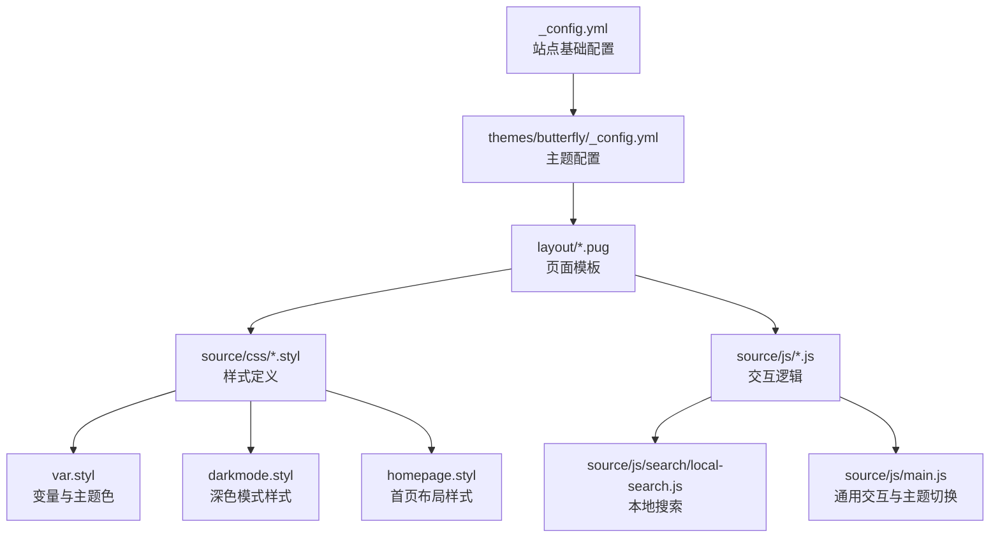
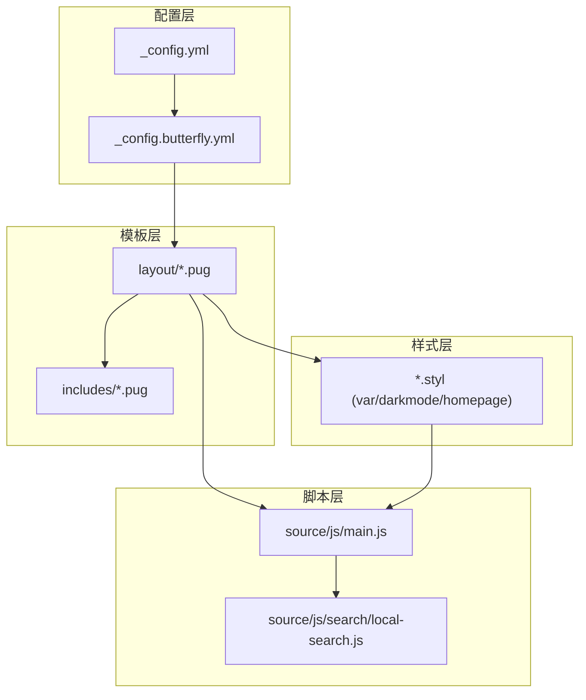
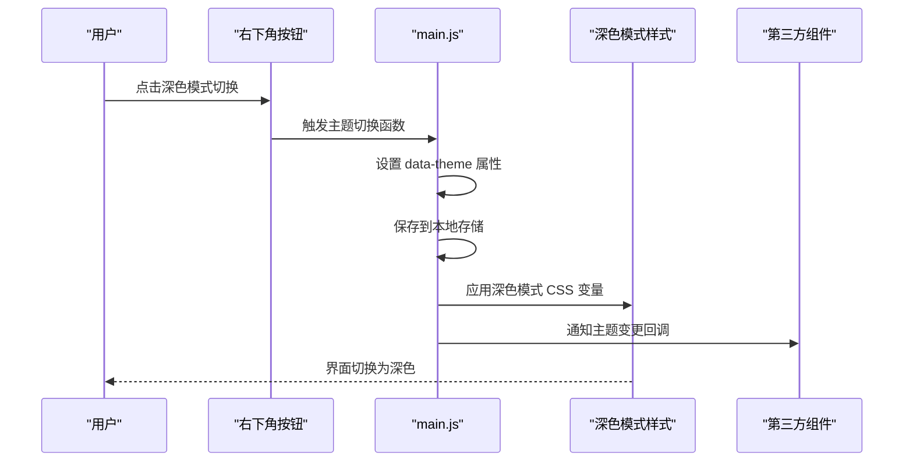
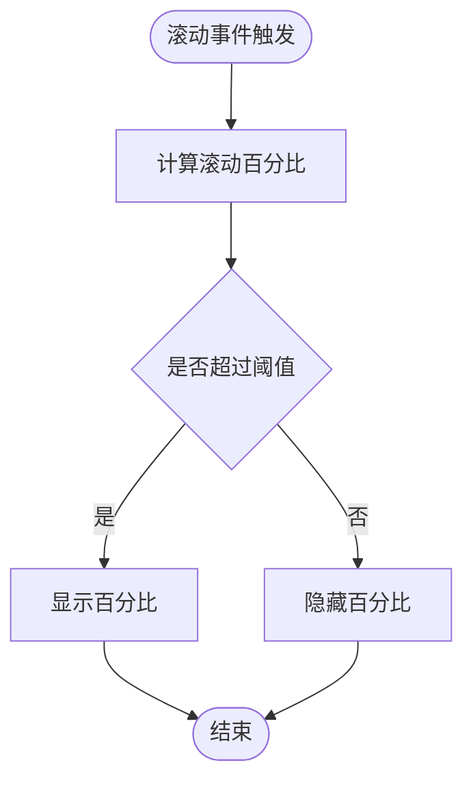
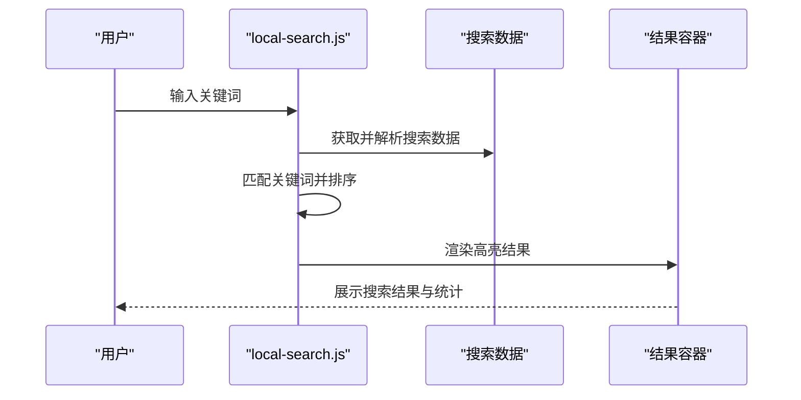
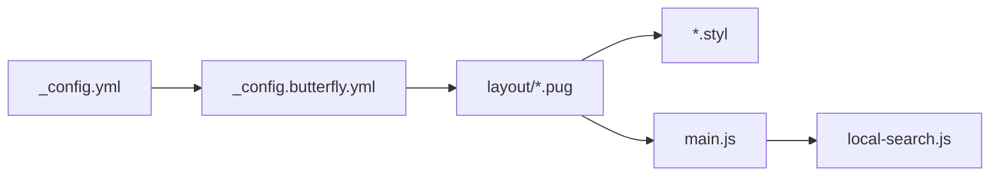

# 核心特性

<cite>
**本文引用的文件**
- [_config.yml](file://_config.yml)
- [_config.butterfly.yml](file://_config.butterfly.yml)
- [themes/butterfly/_config.yml](file://themes/butterfly/_config.yml)
- [themes/butterfly/layout/includes/layout.pug](file://themes/butterfly/layout/includes/layout.pug)
- [themes/butterfly/layout/index.pug](file://themes/butterfly/layout/index.pug)
- [themes/butterfly/layout/post.pug](file://themes/butterfly/layout/post.pug)
- [themes/butterfly/source/js/main.js](file://themes/butterfly/source/js/main.js)
- [themes/butterfly/source/js/search/local-search.js](file://themes/butterfly/source/js/search/local-search.js)
- [themes/butterfly/source/css/var.styl](file://themes/butterfly/source/css/var.styl)
- [themes/butterfly/source/css/_mode/darkmode.styl](file://themes/butterfly/source/css/_mode/darkmode.styl)
- [themes/butterfly/source/css/_page/homepage.styl](file://themes/butterfly/source/css/_page/homepage.styl)
</cite>

## 目录
1. [引言](#引言)
2. [项目结构](#项目结构)
3. [核心组件](#核心组件)
4. [架构总览](#架构总览)
5. [详细组件分析](#详细组件分析)
6. [依赖关系分析](#依赖关系分析)
7. [性能考量](#性能考量)
8. [故障排查指南](#故障排查指南)
9. [结论](#结论)
10. [附录](#附录)

## 引言
本文件面向使用者与维护者，系统化梳理该博客系统的核心特性与实现要点，覆盖视觉设计（极简风格、柔和配色、统一圆角）、响应式布局（全设备适配、移动端优化）、交互功能（深色模式、阅读进度条、本地搜索、图片灯箱）以及页面结构（导航栏、首页布局、文章详情页等）。每个特性均给出实现原理、配置方法与使用场景，并提供可操作的配置示例与最佳实践建议。

## 项目结构
该博客基于 Hexo 与 Butterfly 主题构建，采用 Pug 模板与 Stylus 样式，结合前端 JS 实现交互与动态行为。整体结构清晰：站点配置位于根目录，主题配置位于 themes/butterfly，页面模板位于 themes/butterfly/layout，样式位于 themes/butterfly/source/css，脚本位于 themes/butterfly/source/js。

图表来源
- [_config.yml:1-173](file://_config.yml#L1-L173)
- [themes/butterfly/_config.yml:1-690](file://themes/butterfly/_config.yml#L1-L690)
- [themes/butterfly/layout/includes/layout.pug:1-59](file://themes/butterfly/layout/includes/layout.pug#L1-L59)
- [themes/butterfly/source/js/main.js:1-988](file://themes/butterfly/source/js/main.js#L1-L988)
- [themes/butterfly/source/js/search/local-search.js:1-568](file://themes/butterfly/source/js/search/local-search.js#L1-L568)
- [themes/butterfly/source/css/var.styl:1-233](file://themes/butterfly/source/css/var.styl#L1-L233)
- [themes/butterfly/source/css/_mode/darkmode.styl:1-205](file://themes/butterfly/source/css/_mode/darkmode.styl#L1-L205)
- [themes/butterfly/source/css/_page/homepage.styl:1-175](file://themes/butterfly/source/css/_page/homepage.styl#L1-L175)

章节来源
- [_config.yml:1-173](file://_config.yml#L1-L173)
- [themes/butterfly/_config.yml:1-690](file://themes/butterfly/_config.yml#L1-L690)
- [themes/butterfly/layout/includes/layout.pug:1-59](file://themes/butterfly/layout/includes/layout.pug#L1-L59)

## 核心组件
- 视觉设计与主题色
  - 通过主题配置中的主题色开关与颜色变量控制全局配色；Stylus 变量集中定义在 var.styl，深色模式样式在 darkmode.styl 中按 CSS 变量覆盖。
  - 统一圆角由主题配置项开启，配合卡片与按钮等组件样式实现一致的视觉风格。
- 响应式布局
  - 使用 Stylus 的媒体查询与弹性布局，针对不同屏幕宽度调整首页卡片排列、侧边栏显示与移动端菜单。
- 交互功能
  - 深色模式：通过切换 data-theme 属性与主题切换回调，实现一键切换与持久化。
  - 阅读进度条：右侧滚动百分比展示，支持首页与文章页。
  - 本地搜索：解析搜索数据，高亮关键词，支持分页与 URL 高亮。
  - 图片灯箱：集成图片点击放大与图库加载，支持瀑布流与懒加载。
- 页面结构
  - 导航栏：固定导航、菜单项、移动端侧边栏。
  - 首页布局：多种卡片布局模式，支持封面叠加文字与背景模糊效果。
  - 文章详情页：目录、版权、打赏、相关文章、评论区等模块化组织。

章节来源
- [themes/butterfly/_config.yml:482-529](file://themes/butterfly/_config.yml#L482-L529)
- [themes/butterfly/source/css/var.styl:1-233](file://themes/butterfly/source/css/var.styl#L1-L233)
- [themes/butterfly/source/css/_mode/darkmode.styl:1-205](file://themes/butterfly/source/css/_mode/darkmode.styl#L1-L205)
- [themes/butterfly/source/css/_page/homepage.styl:1-175](file://themes/butterfly/source/css/_page/homepage.styl#L1-L175)
- [themes/butterfly/layout/includes/layout.pug:1-59](file://themes/butterfly/layout/includes/layout.pug#L1-L59)
- [themes/butterfly/layout/index.pug:1-5](file://themes/butterfly/layout/index.pug#L1-L5)
- [themes/butterfly/layout/post.pug:1-36](file://themes/butterfly/layout/post.pug#L1-L36)
- [themes/butterfly/source/js/main.js:626-726](file://themes/butterfly/source/js/main.js#L626-L726)
- [themes/butterfly/source/js/search/local-search.js:1-568](file://themes/butterfly/source/js/search/local-search.js#L1-L568)

## 架构总览
从“配置—模板—样式—脚本”的角度，系统以主题配置为中枢，Pug 模板负责页面结构，Stylus 提供样式与主题切换，JS 负责交互与运行时行为。

图表来源
- [_config.yml:1-173](file://_config.yml#L1-L173)
- [_config.butterfly.yml:1-690](file://_config.butterfly.yml#L1-L690)
- [themes/butterfly/layout/includes/layout.pug:1-59](file://themes/butterfly/layout/includes/layout.pug#L1-L59)
- [themes/butterfly/source/css/var.styl:1-233](file://themes/butterfly/source/css/var.styl#L1-L233)
- [themes/butterfly/source/js/main.js:1-988](file://themes/butterfly/source/js/main.js#L1-L988)
- [themes/butterfly/source/js/search/local-search.js:1-568](file://themes/butterfly/source/js/search/local-search.js#L1-L568)

## 详细组件分析

### 视觉设计与主题色
- 极简风格与柔和配色
  - 通过主题色开关与多处颜色变量控制主色、按钮悬停、链接、代码块、TOC、滚动条等，形成统一的视觉语言。
  - 支持主题色在浅色与深色模式下的差异化表现，深色模式通过 CSS 变量覆盖实现。
- 统一圆角
  - 通过主题配置开启圆角 UI，配合卡片、按钮、输入框等组件样式，确保界面元素风格一致。
- 配置要点
  - 主题色启用与具体颜色值：参考主题配置中的主题色段落。
  - 圆角开关：参考主题配置中的圆角 UI 开关。
- 使用场景
  - 新建主题或迁移主题时，优先统一颜色变量，再开启圆角，保证一致性。
- 最佳实践
  - 将主题色与品牌色保持一致，避免过多强调色造成视觉噪音。
  - 在深色模式下适当降低对比度，提升长时间阅读体验。

章节来源
- [themes/butterfly/_config.yml:482-529](file://themes/butterfly/_config.yml#L482-L529)
- [themes/butterfly/source/css/var.styl:1-233](file://themes/butterfly/source/css/var.styl#L1-L233)
- [themes/butterfly/source/css/_mode/darkmode.styl:1-205](file://themes/butterfly/source/css/_mode/darkmode.styl#L1-L205)

### 响应式布局
- 全设备适配
  - 首页卡片布局支持多种模式（左右封面、上下封面、瀑布流等），通过 Stylus 条件判断与媒体查询在不同宽度下自动切换。
  - 侧边栏在移动端可隐藏，提供“隐藏侧边栏”按钮，减少移动端空间占用。
- 移动端优化
  - 导航栏在滚动时固定并具备显隐动画；移动端菜单采用抽屉式侧边栏，点击遮罩关闭。
  - 首页卡片在小屏设备上自动改为纵向堆叠，保证阅读与点击体验。
- 配置要点
  - 首页布局模式：参考主题配置中的首页布局设置。
  - 侧边栏显示策略：参考主题配置中的侧边栏开关与移动端显示。
- 使用场景
  - 高密度信息展示（如标签云、归档）适合在桌面端展开，在移动端折叠。
- 最佳实践
  - 首页卡片宽度与间距需考虑不同屏幕密度，避免在大屏上显得稀疏、在小屏上拥挤。

章节来源
- [themes/butterfly/_config.yml:169-188](file://themes/butterfly/_config.yml#L169-L188)
- [themes/butterfly/source/css/_page/homepage.styl:1-175](file://themes/butterfly/source/css/_page/homepage.styl#L1-L175)
- [themes/butterfly/layout/includes/layout.pug:1-59](file://themes/butterfly/layout/includes/layout.pug#L1-L59)

### 深色模式
- 实现原理
  - 切换按钮触发主题切换函数，设置 data-theme 属性为 dark 或 light，并持久化到本地存储。
  - 主题切换回调会通知第三方组件（如评论系统）进行相应适配。
  - 深色模式样式通过 CSS 变量覆盖字体、背景、卡片、代码块等颜色。
- 配置要点
  - 启用深色模式与按钮显示：参考主题配置中的深色模式段落。
  - 自动切换时间范围：可按需配置夜间时间段。
- 使用场景
  - 夜间阅读、低光环境、护眼需求。
- 最佳实践
  - 与系统深色模式联动时，建议开启自动切换并在夜间时段生效。
  - 对第三方组件（如评论）提供深色主题适配，避免出现反色不一致。

图表来源
- [themes/butterfly/source/js/main.js:626-675](file://themes/butterfly/source/js/main.js#L626-L675)
- [themes/butterfly/source/css/_mode/darkmode.styl:1-205](file://themes/butterfly/source/css/_mode/darkmode.styl#L1-L205)

章节来源
- [themes/butterfly/_config.yml:239-246](file://themes/butterfly/_config.yml#L239-L246)
- [themes/butterfly/source/js/main.js:626-675](file://themes/butterfly/source/js/main.js#L626-L675)
- [themes/butterfly/source/css/_mode/darkmode.styl:1-205](file://themes/butterfly/source/css/_mode/darkmode.styl#L1-L205)

### 阅读进度条
- 实现原理
  - 监听滚动事件，计算当前滚动百分比，动态更新右下角“回到顶部”按钮上的百分比数字。
  - 当滚动超过阈值时显示百分比，接近底部时隐藏，避免遮挡内容。
- 配置要点
  - 右侧滚动百分比开关：参考主题配置中的右侧滚动百分比。
- 使用场景
  - 长文阅读时快速定位位置，提升导航效率。
- 最佳实践
  - 在移动端与桌面端保持一致的阈值与显示逻辑，避免误触。

图表来源
- [themes/butterfly/source/js/main.js:425-435](file://themes/butterfly/source/js/main.js#L425-L435)

章节来源
- [themes/butterfly/_config.yml:246-246](file://themes/butterfly/_config.yml#L246-L246)
- [themes/butterfly/source/js/main.js:425-435](file://themes/butterfly/source/js/main.js#L425-L435)

### 本地搜索
- 实现原理
  - 通过 fetch 加载搜索数据（XML/JSON），解析标题、正文与 URL。
  - 输入关键词后，按命中数量与命中片段排序，生成高亮结果列表。
  - 支持分页与 URL 高亮，移动端自适应分页控件。
- 配置要点
  - 搜索方式与占位符：参考主题配置中的搜索段落。
  - 预加载与每文命中数：参考本地搜索配置。
- 使用场景
  - 站内检索长文、代码片段、标签等。
- 最佳实践
  - 合理设置每文命中数，避免结果过多导致页面拥挤。
  - 在移动端启用分页，提升加载与翻页体验。

图表来源
- [themes/butterfly/source/js/search/local-search.js:104-171](file://themes/butterfly/source/js/search/local-search.js#L104-L171)
- [themes/butterfly/source/js/search/local-search.js:237-567](file://themes/butterfly/source/js/search/local-search.js#L237-L567)

章节来源
- [themes/butterfly/_config.yml:299-320](file://themes/butterfly/_config.yml#L299-L320)
- [themes/butterfly/source/js/search/local-search.js:1-568](file://themes/butterfly/source/js/search/local-search.js#L1-L568)

### 图片灯箱与图库
- 实现原理
  - 为文章容器内的图片绑定点击放大事件，支持缩放与拖拽。
  - 支持瀑布流图库，按组加载与分页按钮，结合无限网格组件实现按需渲染。
- 配置要点
  - 灯箱类型：参考主题配置中的灯箱设置。
  - 图库加载策略：参考瀑布流配置（分页按钮、每组数量等）。
- 使用场景
  - 图片较多的文章、相册、截图集合。
- 最佳实践
  - 图库开启懒加载与分页，避免一次性加载大量图片导致首屏卡顿。
  - 为图片添加 alt 或 title，提升可访问性与 SEO。

章节来源
- [themes/butterfly/_config.yml:585-585](file://themes/butterfly/_config.yml#L585-L585)
- [themes/butterfly/source/js/main.js:262-420](file://themes/butterfly/source/js/main.js#L262-L420)

### 页面结构与导航
- 导航栏
  - 固定导航、菜单项、移动端侧边栏、社交链接等。
- 首页布局
  - 多种卡片布局模式，封面与信息区域灵活组合，支持封面叠加文字与模糊遮罩。
- 文章详情页
  - 目录、版权、分享、打赏、相关文章、分页与评论区等模块化组织。
- 配置要点
  - 导航与菜单：参考主题配置中的导航与菜单段落。
  - 首页布局与封面：参考首页布局与封面配置。
  - 文章页模块：参考文章页配置与模块开关。
- 使用场景
  - 首页作为内容入口，文章页承载深度阅读与互动。
- 最佳实践
  - 导航项不宜过多，避免分散注意力；移动端菜单层级控制在合理范围内。

章节来源
- [themes/butterfly/_config.yml:7-19](file://themes/butterfly/_config.yml#L7-L19)
- [themes/butterfly/_config.yml:88-102](file://themes/butterfly/_config.yml#L88-L102)
- [themes/butterfly/layout/includes/layout.pug:1-59](file://themes/butterfly/layout/includes/layout.pug#L1-L59)
- [themes/butterfly/layout/index.pug:1-5](file://themes/butterfly/layout/index.pug#L1-L5)
- [themes/butterfly/layout/post.pug:1-36](file://themes/butterfly/layout/post.pug#L1-L36)

## 依赖关系分析
- 配置依赖
  - 站点配置决定主题选择与部署参数；主题配置决定 UI 行为与外观。
- 模板依赖
  - layout.pug 作为根模板，包含头部、侧边栏、主体与页脚；includes/*.pug 提供复用部件。
- 样式依赖
  - var.styl 定义全局变量，darkmode.styl 覆盖深色模式变量，homepage.styl 控制首页布局。
- 脚本依赖
  - main.js 提供主题切换、滚动处理、目录与 TOC、灯箱与图库等；local-search.js 依赖 main.js 提供的全局配置。

图表来源
- [_config.yml:85-85](file://_config.yml#L85-L85)
- [_config.butterfly.yml:1-690](file://_config.butterfly.yml#L1-L690)
- [themes/butterfly/layout/includes/layout.pug:1-59](file://themes/butterfly/layout/includes/layout.pug#L1-L59)
- [themes/butterfly/source/js/main.js:1-988](file://themes/butterfly/source/js/main.js#L1-L988)
- [themes/butterfly/source/js/search/local-search.js:1-568](file://themes/butterfly/source/js/search/local-search.js#L1-L568)

章节来源
- [_config.yml:85-85](file://_config.yml#L85-L85)
- [_config.butterfly.yml:1-690](file://_config.butterfly/_config.yml#L1-L690)
- [themes/butterfly/layout/includes/layout.pug:1-59](file://themes/butterfly/layout/includes/layout.pug#L1-L59)

## 性能考量
- 资源加载
  - 启用懒加载与按需加载（如评论、搜索数据预取），减少首屏负担。
  - 图库瀑布流按组加载，避免一次性渲染过多节点。
- 交互节流
  - 滚动事件与窗口尺寸变化使用节流/防抖，降低重绘频率。
- 样式体积
  - 通过主题色与圆角开关集中控制样式差异，避免重复定义。
- 最佳实践
  - 在移动端优先加载关键内容，延后非关键资源。
  - 对长列表与图片采用虚拟滚动或分页策略。

## 故障排查指南
- 深色模式不生效
  - 检查深色模式开关与自动切换配置；确认 data-theme 属性是否正确写入。
  - 查看深色模式样式是否被覆盖。
- 本地搜索无结果
  - 确认搜索数据路径与格式；检查预加载与解析逻辑。
  - 在 Safari 等浏览器中注意高度计算差异，确保对话框自适应。
- 图片灯箱无法点击
  - 检查图片是否被标记为禁用灯箱；确认图片容器与点击事件绑定。
- 响应式布局异常
  - 检查媒体查询断点与卡片布局模式配置；确认移动端菜单开关状态。

章节来源
- [themes/butterfly/source/js/main.js:626-726](file://themes/butterfly/source/js/main.js#L626-L726)
- [themes/butterfly/source/js/search/local-search.js:482-520](file://themes/butterfly/source/js/search/local-search.js#L482-L520)
- [themes/butterfly/source/css/_mode/darkmode.styl:1-205](file://themes/butterfly/source/css/_mode/darkmode.styl#L1-L205)

## 结论
该博客系统围绕“极简、柔和、统一”的视觉理念，结合响应式布局与丰富的交互能力，提供了良好的跨设备阅读体验。通过主题配置与模板/样式/脚本的协同，既能满足个性化定制，又能保持一致的用户体验。建议在实际使用中优先统一主题色与圆角风格，合理配置深色模式与本地搜索，以获得更佳的性能与可维护性。

## 附录
- 配置示例（路径与关键键）
  - 主题色与圆角：参见主题配置中的主题色段落与圆角 UI 开关。
  - 深色模式：参见主题配置中的深色模式段落。
  - 本地搜索：参见主题配置中的搜索段落与本地搜索配置。
  - 首页布局：参见主题配置中的首页布局与封面配置。
  - 图片灯箱：参见主题配置中的灯箱设置。
- 使用场景与最佳实践
  - 在夜间或低光环境下启用深色模式，减少眼部疲劳。
  - 长文阅读时开启阅读进度条，便于快速定位。
  - 图集类内容使用瀑布流与分页，兼顾加载速度与浏览体验。
  - 导航与菜单保持简洁，移动端优先保证可点击区域大小。