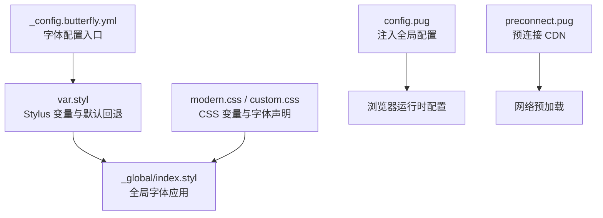
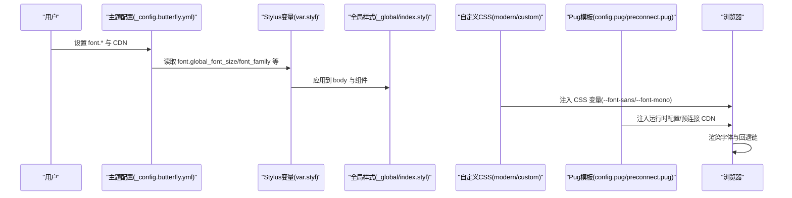
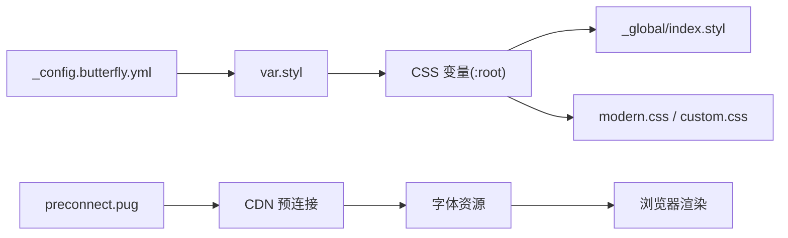

# 字体系统配置

<cite>
**本文档引用的文件**
- [_config.butterfly.yml](file://_config.butterfly.yml)
- [var.styl](file://themes/butterfly/source/css/var.styl)
- [index.styl](file://themes/butterfly/source/css/_global/index.styl)
- [modern.css](file://source/css/modern.css)
- [custom.css](file://source/css/custom.css)
- [config.pug](file://themes/butterfly/layout/includes/head/config.pug)
- [preconnect.pug](file://themes/butterfly/layout/includes/head/preconnect.pug)
- [index.styl（高亮）](file://themes/butterfly/source/css/_highlight/highlight/index.styl)
- [index.styl（PrismJS）](file://themes/butterfly/source/css/_highlight/prismjs/index.styl)
- [post.styl](file://themes/butterfly/source/css/_layout/post.styl)
</cite>

## 目录
1. [简介](#简介)
2. [项目结构](#项目结构)
3. [核心组件](#核心组件)
4. [架构总览](#架构总览)
5. [详细组件分析](#详细组件分析)
6. [依赖关系分析](#依赖关系分析)
7. [性能考虑](#性能考虑)
8. [故障排除指南](#故障排除指南)
9. [结论](#结论)

## 简介
本文件面向博客系统的字体系统配置，围绕以下目标展开：
- 全局字体设置（global_font_size）、代码字体设置（code_font_size）
- 字体家族（font_family）、代码字体家族（code_font_family）
- 字体加载策略（本地 vs CDN）
- 字体排版最佳实践（行高、字间距、字体权重）
- 中英文字体混排（回退机制与字符集支持）
- 字体性能优化（预加载、子集化等）
- CSS 字体声明示例与浏览器兼容性处理

## 项目结构
本项目采用 Hexo + Butterfly 主题 + 自定义 CSS 的组合：
- 主题层：Butterfly 提供 Stylus 变量与默认字体回退链
- 自定义层：modern.css、custom.css 提供 CSS 变量与字体声明
- 注入层：通过主题配置与 Pug 模板注入全局变量与预连接

图表来源
- [_config.butterfly.yml:524-529](file://_config.butterfly.yml#L524-L529)
- [var.styl:15-32](file://themes/butterfly/source/css/var.styl#L15-L32)
- [index.styl:101-109](file://themes/butterfly/source/css/_global/index.styl#L101-L109)
- [modern.css:69-71](file://source/css/modern.css#L69-L71)
- [custom.css:51-53](file://source/css/custom.css#L51-L53)
- [config.pug:86-125](file://themes/butterfly/layout/includes/head/config.pug#L86-L125)
- [preconnect.pug:1-35](file://themes/butterfly/layout/includes/head/preconnect.pug#L1-L35)

章节来源
- [_config.butterfly.yml:524-529](file://_config.butterfly.yml#L524-L529)
- [var.styl:15-32](file://themes/butterfly/source/css/var.styl#L15-L32)
- [index.styl:101-109](file://themes/butterfly/source/css/_global/index.styl#L101-L109)
- [modern.css:69-71](file://source/css/modern.css#L69-L71)
- [custom.css:51-53](file://source/css/custom.css#L51-L53)
- [config.pug:86-125](file://themes/butterfly/layout/includes/head/config.pug#L86-L125)
- [preconnect.pug:1-35](file://themes/butterfly/layout/includes/head/preconnect.pug#L1-L35)

## 核心组件
- 主题字体变量与回退链
  - Stylus 变量集中定义全局字体族、代码字体族、字号与行高
  - 默认回退链覆盖系统字体、苹方/微软雅黑等中文场景
- 自定义 CSS 变量
  - modern.css、custom.css 定义 --font-sans、--font-mono 变量，供 body 与代码块使用
- 配置注入与预连接
  - config.pug 将主题配置注入运行时
  - preconnect.pug 对第三方 CDN 进行 DNS 预连接，加速字体资源加载

章节来源
- [var.styl:15-32](file://themes/butterfly/source/css/var.styl#L15-L32)
- [index.styl:101-109](file://themes/butterfly/source/css/_global/index.styl#L101-L109)
- [modern.css:69-71](file://source/css/modern.css#L69-L71)
- [custom.css:51-53](file://source/css/custom.css#L51-L53)
- [config.pug:86-125](file://themes/butterfly/layout/includes/head/config.pug#L86-L125)
- [preconnect.pug:1-35](file://themes/butterfly/layout/includes/head/preconnect.pug#L1-L35)

## 架构总览
下图展示从配置到渲染的字体系统路径：

图表来源
- [_config.butterfly.yml:524-529](file://_config.butterfly.yml#L524-L529)
- [var.styl:15-32](file://themes/butterfly/source/css/var.styl#L15-L32)
- [index.styl:101-109](file://themes/butterfly/source/css/_global/index.styl#L101-L109)
- [modern.css:69-71](file://source/css/modern.css#L69-L71)
- [custom.css:51-53](file://source/css/custom.css#L51-L53)
- [config.pug:86-125](file://themes/butterfly/layout/includes/head/config.pug#L86-L125)
- [preconnect.pug:1-35](file://themes/butterfly/layout/includes/head/preconnect.pug#L1-L35)

## 详细组件分析

### 1) 全局字体设置（global_font_size）
- 配置入口
  - 在主题配置中设置键值，用于控制全局字号
- 实现机制
  - Stylus 变量解析并生成 CSS 变量，最终在全局样式中应用
- 推荐实践
  - 建议以 14–16px 为基准，配合行高 1.7–2.0 提升可读性
  - 使用 CSS 变量统一管理，便于主题切换与响应式适配

章节来源
- [_config.butterfly.yml:524-529](file://_config.butterfly.yml#L524-L529)
- [var.styl:31-32](file://themes/butterfly/source/css/var.styl#L31-L32)
- [index.styl:101-109](file://themes/butterfly/source/css/_global/index.styl#L101-L109)

### 2) 代码字体设置（code_font_size）
- 配置入口
  - 在主题配置中设置键值，用于控制代码块字号
- 实现机制
  - 若未显式设置，代码字号继承全局字号；Stylus 变量提供默认映射
- 推荐实践
  - 代码区字号略小于正文，保证紧凑阅读体验
  - 结合行高与等宽字体，提升代码可读性

章节来源
- [_config.butterfly.yml:524-529](file://_config.butterfly.yml#L524-L529)
- [var.styl:31-32](file://themes/butterfly/source/css/var.styl#L31-L32)
- [index.styl（高亮）:1-40](file://themes/butterfly/source/css/_highlight/highlight/index.styl#L1-L40)
- [index.styl（PrismJS）:1-20](file://themes/butterfly/source/css/_highlight/prismjs/index.styl#L1-L20)

### 3) 字体家族（font_family）
- 默认回退链
  - 包含系统字体、Segoe UI、Helvetica Neue、Lato、Roboto、苹方/微软雅黑等
  - 针对 zh-CN 语言环境自动选择合适的中文字体
- 自定义方式
  - 在主题配置中覆盖 font_family，或在自定义 CSS 中通过 CSS 变量扩展
- 推荐实践
  - 优先使用系统字体，确保加载速度与一致性
  - 避免单一字体导致的跨平台差异，保持多级回退

章节来源
- [var.styl:15-21](file://themes/butterfly/source/css/var.styl#L15-L21)
- [index.styl:101-109](file://themes/butterfly/source/css/_global/index.styl#L101-L109)
- [modern.css:69-71](file://source/css/modern.css#L69-L71)
- [custom.css:51-53](file://source/css/custom.css#L51-L53)

### 4) 代码字体家族（code_font_family）
- 默认回退链
  - Consolas、Monaco、等宽字体与苹方/中文字体
- 自定义方式
  - 在主题配置中覆盖 code_font_family，或在自定义 CSS 中通过 CSS 变量扩展
- 推荐实践
  - 等宽字体是代码阅读的关键，建议保留 Monaco/Consolas 等经典选项
  - 避免过细或过粗的等宽字重，保证字符间距清晰

章节来源
- [var.styl:15-21](file://themes/butterfly/source/css/var.styl#L15-L21)
- [post.styl:108-109](file://themes/butterfly/source/css/_layout/post.styl#L108-L109)
- [modern.css:70-71](file://source/css/modern.css#L70-L71)
- [custom.css:52-53](file://source/css/custom.css#L52-L53)

### 5) 字体加载策略（本地 vs CDN）
- 本地加载
  - 优点：隐私安全、无外部依赖
  - 缺点：首次加载体积较大、缓存复用率低
- CDN 加载
  - 优点：缓存复用率高、全球加速
  - 缺点：隐私与稳定性依赖第三方
- 选择原则
  - 优先使用主题内置的 CDN 预连接（preconnect），减少首字节时间
  - 对关键字体（如站点标题）可考虑本地托管以确保稳定

章节来源
- [preconnect.pug:1-35](file://themes/butterfly/layout/includes/head/preconnect.pug#L1-L35)
- [_config.butterfly.yml:684-689](file://_config.butterfly.yml#L684-L689)

### 6) 字体排版最佳实践
- 行高（line-height）
  - 全局行高由 Stylus 变量统一设定，建议 1.7–2.0 以提升可读性
- 字间距（letter-spacing）
  - 通过 CSS 变量与组件样式微调，避免过度拉伸影响可读性
- 字体权重（font-weight）
  - 标题与正文区分粗细，确保层次感；代码区保持常规字重
- 代码块排版
  - 等宽字体 + 合适的行高与内边距，提升代码可读性

章节来源
- [var.styl:34-34](file://themes/butterfly/source/css/var.styl#L34-L34)
- [index.styl（高亮）:1-40](file://themes/butterfly/source/css/_highlight/highlight/index.styl#L1-L40)
- [index.styl（PrismJS）:1-20](file://themes/butterfly/source/css/_highlight/prismjs/index.styl#L1-L20)
- [post.styl:108-109](file://themes/butterfly/source/css/_layout/post.styl#L108-L109)

### 7) 中英文字体混排
- 回退机制
  - Stylus 默认回退链包含苹方/微软雅黑，适合中文显示
  - CSS 变量层面也提供中日韩友好的 sans-serif 列表
- 字符集支持
  - 优先使用系统字体与现代 CDN 字体，确保常用字符集覆盖
  - 如需特殊字符，可通过字体子集化或本地托管补充

章节来源
- [var.styl:16-21](file://themes/butterfly/source/css/var.styl#L16-L21)
- [modern.css:70-71](file://source/css/modern.css#L70-L71)
- [custom.css:52-53](file://source/css/custom.css#L52-L53)

### 8) 字体性能优化
- 预加载
  - 使用 preconnect 预连接第三方 CDN，降低 DNS 与握手延迟
- 字体子集化
  - 仅加载必要字符集，显著减小字体体积
- 缓存策略
  - 启用长期缓存与版本号，结合 CDN 加速
- 渲染优化
  - 使用 font-display: swap 或 fallback 链，避免 FOIT/FOIC
  - 为关键字体（标题）提供本地回退，确保稳定渲染

章节来源
- [preconnect.pug:1-35](file://themes/butterfly/layout/includes/head/preconnect.pug#L1-L35)
- [config.pug:86-125](file://themes/butterfly/layout/includes/head/config.pug#L86-L125)

### 9) CSS 字体声明示例与浏览器兼容性
- 全局字体声明
  - 在全局样式中应用 CSS 变量，确保一致的字体渲染
- 代码字体声明
  - 代码块使用等宽字体变量，保证字符对齐
- 兼容性处理
  - 使用 -webkit-font-smoothing、-moz-osx-font-smoothing 提升抗锯齿
  - 通过 CSS 变量与 Stylus 回退链，兼容不同系统与浏览器

章节来源
- [index.styl:101-109](file://themes/butterfly/source/css/_global/index.styl#L101-L109)
- [modern.css:129-138](file://source/css/modern.css#L129-L138)
- [custom.css:98-106](file://source/css/custom.css#L98-L106)

## 依赖关系分析
- 配置到变量
  - 主题配置 → Stylus 变量 → CSS 变量
- 渲染到浏览器
  - CSS 变量 → 全局样式 → 组件样式 → 浏览器渲染
- 网络到渲染
  - 预连接 → CDN 缓存 → 字体下载 → 字体可用

图表来源
- [_config.butterfly.yml:524-529](file://_config.butterfly.yml#L524-L529)
- [var.styl:15-32](file://themes/butterfly/source/css/var.styl#L15-L32)
- [index.styl:1-40](file://themes/butterfly/source/css/_global/index.styl#L1-L40)
- [modern.css:69-82](file://source/css/modern.css#L69-L82)
- [custom.css:51-59](file://source/css/custom.css#L51-L59)
- [preconnect.pug:1-35](file://themes/butterfly/layout/includes/head/preconnect.pug#L1-L35)

章节来源
- [_config.butterfly.yml:524-529](file://_config.butterfly.yml#L524-L529)
- [var.styl:15-32](file://themes/butterfly/source/css/var.styl#L15-L32)
- [index.styl:1-40](file://themes/butterfly/source/css/_global/index.styl#L1-L40)
- [modern.css:69-82](file://source/css/modern.css#L69-L82)
- [custom.css:51-59](file://source/css/custom.css#L51-L59)
- [preconnect.pug:1-35](file://themes/butterfly/layout/includes/head/preconnect.pug#L1-L35)

## 性能考虑
- 预连接策略
  - 对第三方 CDN 启用 preconnect，缩短关键路径
- 字体体积控制
  - 使用子集化与压缩，减少带宽占用
- 缓存与版本
  - 为字体资源添加版本号与长缓存策略
- 渲染阻塞规避
  - 使用 font-display 与回退链，避免长时间等待

## 故障排除指南
- 字体不生效
  - 检查主题配置中的 font_family 是否正确写入 Stylus 变量
  - 确认 CSS 变量是否被全局样式应用
- 字体加载慢
  - 检查 preconnect 是否正确注入第三方域名
  - 评估是否启用 CDN 与字体子集化
- 中文乱码或缺字
  - 确认回退链包含苹方/微软雅黑
  - 必要时引入本地字体或 CDN 字体补充字符集

章节来源
- [var.styl:15-21](file://themes/butterfly/source/css/var.styl#L15-L21)
- [index.styl:101-109](file://themes/butterfly/source/css/_global/index.styl#L101-L109)
- [preconnect.pug:1-35](file://themes/butterfly/layout/includes/head/preconnect.pug#L1-L35)

## 结论
通过主题配置、Stylus 变量、CSS 变量与预连接策略的协同，博客系统实现了灵活且高性能的字体体系。建议在实际部署中：
- 明确全局与代码字体的字号与行高
- 优先使用系统字体与 CDN 回退链
- 启用预连接与字体子集化，兼顾体验与性能
- 为中英文混排提供稳健的回退机制与字符集支持