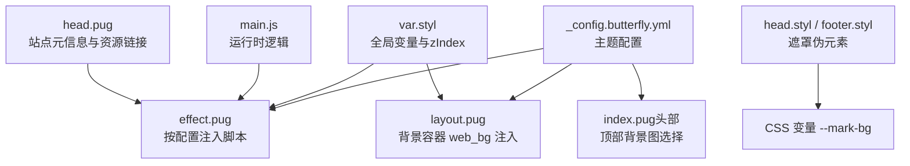
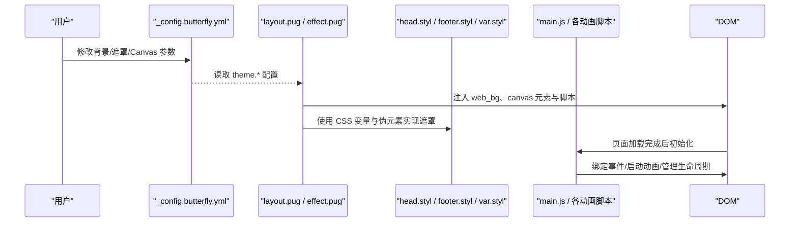
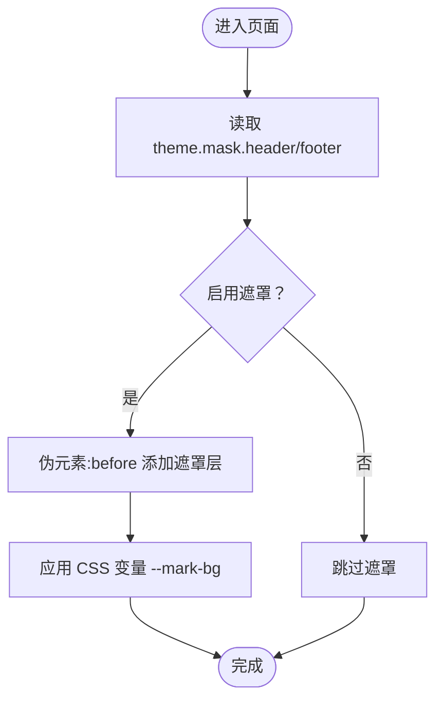
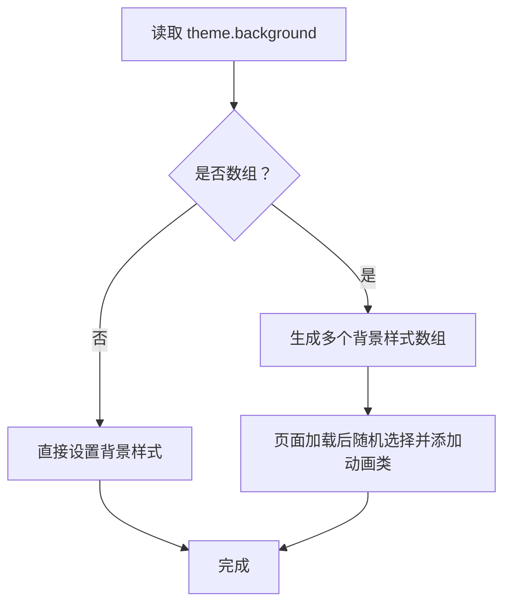
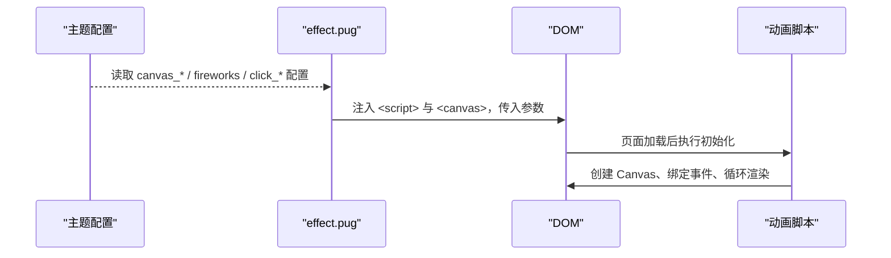
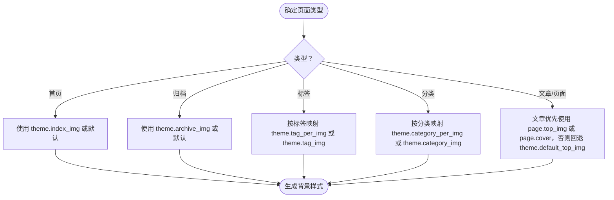
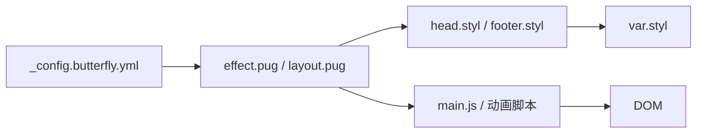

# 背景效果配置

<cite>
**本文引用的文件**
- [_config.butterfly.yml](file://_config.butterfly.yml)
- [effect.pug](file://themes/butterfly/layout/includes/third-party/effect.pug)
- [layout.pug](file://themes/butterfly/layout/includes/layout.pug)
- [index.pug（头部）](file://themes/butterfly/layout/includes/header/index.pug)
- [head.styl（头部样式）](file://themes/butterfly/source/css/_layout/head.styl)
- [footer.styl（底部样式）](file://themes/butterfly/source/css/_layout/footer.styl)
- [var.styl（全局变量）](file://themes/butterfly/source/css/var.styl)
- [head.pug（站点头部）](file://themes/butterfly/layout/includes/head.pug)
- [default_config.js](file://themes/butterfly/scripts/common/default_config.js)
- [main.js（主脚本）](file://themes/butterfly/source/js/main.js)
</cite>

## 目录
1. [简介](#简介)
2. [项目结构与定位](#项目结构与定位)
3. [核心组件总览](#核心组件总览)
4. [架构概览](#架构概览)
5. [详细组件分析](#详细组件分析)
6. [依赖关系分析](#依赖关系分析)
7. [性能优化策略](#性能优化策略)
8. [故障排查指南](#故障排查指南)
9. [结论](#结论)
10. [附录：配置示例与最佳实践](#附录配置示例与最佳实践)

## 简介
本文件面向博客系统中“背景效果”的配置与实现，覆盖以下主题：
- 遮罩（header/footer）设置与视觉影响
- 渐变背景与全屏背景图配置
- Canvas 动画效果（ribbon、fluttering_ribbon、nest、fireworks、power_mode、click_heart、clickShowText）
- 背景图片使用场景（默认封面图、首页背景、归档页背景等）
- 性能优化（启用条件、移动端适配、内存管理）
- 响应式设计与无障碍支持
- 自定义背景效果与第三方背景服务集成思路

## 项目结构与定位
背景效果由“配置层（YAML/JS 默认配置）+ 模板层（Pug）+ 样式层（Stylus）+ 脚本层（JS）”协同完成：
- 配置层：在主题配置中开启/关闭各类效果，并设置参数
- 模板层：根据配置动态注入脚本与 DOM 结构
- 样式层：通过 CSS 变量与伪元素实现遮罩与背景叠加
- 脚本层：处理 DOM 加载、事件绑定与运行时行为

图表来源
- [_config.butterfly.yml](file://_config.butterfly.yml)
- [effect.pug](file://themes/butterfly/layout/includes/third-party/effect.pug)
- [layout.pug](file://themes/butterfly/layout/includes/layout.pug)
- [index.pug（头部）](file://themes/butterfly/layout/includes/header/index.pug)
- [head.styl（头部样式）](file://themes/butterfly/source/css/_layout/head.styl)
- [footer.styl（底部样式）](file://themes/butterfly/source/css/_layout/footer.styl)
- [var.styl（全局变量）](file://themes/butterfly/source/css/var.styl)
- [head.pug（站点头部）](file://themes/butterfly/layout/includes/head.pug)
- [main.js（主脚本）](file://themes/butterfly/source/js/main.js)

章节来源
- [_config.butterfly.yml](file://_config.butterfly.yml)
- [effect.pug](file://themes/butterfly/layout/includes/third-party/effect.pug)
- [layout.pug](file://themes/butterfly/layout/includes/layout.pug)
- [index.pug（头部）](file://themes/butterfly/layout/includes/header/index.pug)
- [head.styl（头部样式）](file://themes/butterfly/source/css/_layout/head.styl)
- [footer.styl（底部样式）](file://themes/butterfly/source/css/_layout/footer.styl)
- [var.styl（全局变量）](file://themes/butterfly/source/css/var.styl)
- [head.pug（站点头部）](file://themes/butterfly/layout/includes/head.pug)
- [default_config.js](file://themes/butterfly/scripts/common/default_config.js)
- [main.js（主脚本）](file://themes/butterfly/source/js/main.js)

## 核心组件总览
- 遮罩（Mask）
  - 通过配置开关控制 header/footer 是否叠加遮罩层，遮罩色由 CSS 变量统一管理
- 渐变背景与全屏背景
  - 支持单张或随机多张背景图，配合 web_bg 容器实现全屏背景与过渡动画
- Canvas 动画
  - ribbon、fluttering_ribbon、nest、fireworks、power_mode、click_heart、clickShowText
  - 通过 effect.pug 条件注入脚本与参数，运行时由对应 JS 实现
- 背景图片策略
  - 默认封面图、首页背景、归档页背景、标签/分类页背景等按页面类型选择
- 响应式与无障碍
  - 移动端可按需禁用重计算效果；通过 meta 与 CSS 变量提升可访问性

章节来源
- [effect.pug](file://themes/butterfly/layout/includes/third-party/effect.pug)
- [layout.pug](file://themes/butterfly/layout/includes/layout.pug)
- [index.pug（头部）](file://themes/butterfly/layout/includes/header/index.pug)
- [head.styl（头部样式）](file://themes/butterfly/source/css/_layout/head.styl)
- [footer.styl（底部样式）](file://themes/butterfly/source/css/_layout/footer.styl)
- [var.styl（全局变量）](file://themes/butterfly/source/css/var.styl)
- [_config.butterfly.yml](file://_config.butterfly.yml)

## 架构概览
从“配置 → 模板 → 样式 → 运行时”的完整链路如下：

图表来源
- [_config.butterfly.yml](file://_config.butterfly.yml)
- [layout.pug](file://themes/butterfly/layout/includes/layout.pug)
- [effect.pug](file://themes/butterfly/layout/includes/third-party/effect.pug)
- [head.styl（头部样式）](file://themes/butterfly/source/css/_layout/head.styl)
- [footer.styl（底部样式）](file://themes/butterfly/source/css/_layout/footer.styl)
- [var.styl（全局变量）](file://themes/butterfly/source/css/var.styl)
- [main.js（主脚本）](file://themes/butterfly/source/js/main.js)

## 详细组件分析

### 遮罩（Header/Footer Mask）
- 开关位置：主题配置中的 mask.header 与 mask.footer
- 实现机制：当启用时，通过 Stylus 在 #page-header 与 #footer 的伪元素上叠加遮罩层，颜色来自 CSS 变量 --mark-bg
- 视觉影响：降低背景图亮度/对比度，提升文字可读性

图表来源
- [head.styl（头部样式）](file://themes/butterfly/source/css/_layout/head.styl)
- [footer.styl（底部样式）](file://themes/butterfly/source/css/_layout/footer.styl)
- [_config.butterfly.yml](file://_config.butterfly.yml)

章节来源
- [head.styl（头部样式）](file://themes/butterfly/source/css/_layout/head.styl)
- [footer.styl（底部样式）](file://themes/butterfly/source/css/_layout/footer.styl)
- [_config.butterfly.yml](file://_config.butterfly.yml)

### 渐变背景与全屏背景图
- 配置入口：theme.background 支持单张或多张路径数组
- 注入方式：layout.pug 中根据配置生成 #web_bg 容器，若为数组则在页面加载后随机切换并添加过渡动画
- 适用场景：首页、归档页、标签/分类页等页面背景

图表来源
- [layout.pug](file://themes/butterfly/layout/includes/layout.pug)
- [var.styl（全局变量）](file://themes/butterfly/source/css/var.styl)

章节来源
- [layout.pug](file://themes/butterfly/layout/includes/layout.pug)
- [var.styl（全局变量）](file://themes/butterfly/source/css/var.styl)

### Canvas 动画效果（ribbon、fluttering_ribbon、nest、fireworks、power_mode、click_heart、clickShowText）
- 启用与参数：通过主题配置项控制开关、移动端、z-index、透明度、数量等
- 注入机制：effect.pug 根据配置条件注入对应脚本与参数属性
- 运行时行为：由各动画脚本在 Canvas 上绘制与交互，受移动端开关与内存限制约束

图表来源
- [effect.pug](file://themes/butterfly/layout/includes/third-party/effect.pug)
- [_config.butterfly.yml](file://_config.butterfly.yml)

章节来源
- [effect.pug](file://themes/butterfly/layout/includes/third-party/effect.pug)
- [_config.butterfly.yml](file://_config.butterfly.yml)

### 背景图片设置与使用场景
- 默认封面图：用于文章无封面时回退
- 首页背景：首页顶部大图
- 归档页背景：归档页顶部背景
- 标签/分类页背景：支持按标签/分类设置独立背景图
- 选择逻辑：根据页面类型与配置优先级决定最终使用的图片

图表来源
- [index.pug（头部）](file://themes/butterfly/layout/includes/header/index.pug)
- [_config.butterfly.yml](file://_config.butterfly.yml)

章节来源
- [index.pug（头部）](file://themes/butterfly/layout/includes/header/index.pug)
- [_config.butterfly.yml](file://_config.butterfly.yml)

## 依赖关系分析
- 配置与模板
  - 主题配置决定是否注入 Canvas 脚本与 web_bg 容器
  - Pug 模板根据配置生成 DOM 结构
- 样式与变量
  - CSS 变量统一管理遮罩色与动画层级
  - Stylus 伪元素实现遮罩叠加
- 运行时
  - main.js 负责基础交互与工具函数
  - 各动画脚本负责 Canvas 生命周期与事件绑定

图表来源
- [_config.butterfly.yml](file://_config.butterfly.yml)
- [effect.pug](file://themes/butterfly/layout/includes/third-party/effect.pug)
- [layout.pug](file://themes/butterfly/layout/includes/layout.pug)
- [head.styl（头部样式）](file://themes/butterfly/source/css/_layout/head.styl)
- [footer.styl（底部样式）](file://themes/butterfly/source/css/_layout/footer.styl)
- [var.styl（全局变量）](file://themes/butterfly/source/css/var.styl)
- [main.js（主脚本）](file://themes/butterfly/source/js/main.js)

章节来源
- [_config.butterfly.yml](file://_config.butterfly.yml)
- [effect.pug](file://themes/butterfly/layout/includes/third-party/effect.pug)
- [layout.pug](file://themes/butterfly/layout/includes/layout.pug)
- [head.styl（头部样式）](file://themes/butterfly/source/css/_layout/head.styl)
- [footer.styl（底部样式）](file://themes/butterfly/source/css/_layout/footer.styl)
- [var.styl（全局变量）](file://themes/butterfly/source/css/var.styl)
- [main.js（主脚本）](file://themes/butterfly/source/js/main.js)

## 性能优化策略
- Canvas 动画启用条件
  - 仅在桌面端启用高复杂度动画（如 nest、fireworks），移动端默认关闭以节省 CPU/GPU
  - 通过配置项 mobile 控制是否在移动设备加载
- 内存与帧率
  - 控制粒子数量（如 nest.count）、透明度（opacity/alpha）与 z-index，避免过度重绘
  - 使用 requestAnimationFrame 与节流/防抖减少高频事件开销
- 背景图与懒加载
  - 使用 lazyload 与占位图降低首屏压力
  - 背景图采用固定尺寸与缓存策略，避免重复请求
- 渐变背景
  - 单张背景图优先；多张时采用随机切换与过渡动画，避免频繁 DOM 更新
- 事件与生命周期
  - 在 PJAX 导航前后清理动画状态，防止内存泄漏
  - 将动画初始化延迟至 DOMContentLoaded 或页面可见时

章节来源
- [_config.butterfly.yml](file://_config.butterfly.yml)
- [effect.pug](file://themes/butterfly/layout/includes/third-party/effect.pug)
- [layout.pug](file://themes/butterfly/layout/includes/layout.pug)
- [main.js（主脚本）](file://themes/butterfly/source/js/main.js)

## 故障排查指南
- 动画不生效
  - 检查对应配置项 enable 是否开启，mobile 是否在当前设备生效
  - 确认脚本路径与 CDN 正常加载
- 遮罩颜色异常
  - 检查 CSS 变量 --mark-bg 是否被覆盖
  - 确认 mask.header/footer 是否启用
- 背景图不显示
  - 检查路径是否正确且可访问
  - 确认页面类型与配置优先级（文章页优先使用 page.top_img 或 page.cover）
- 移动端卡顿
  - 关闭高复杂度动画或启用 mobile 选项
  - 降低粒子数量与透明度
- PJAX 切换后残留
  - 确保在 PJAX send/complete 事件中清理动画状态

章节来源
- [effect.pug](file://themes/butterfly/layout/includes/third-party/effect.pug)
- [layout.pug](file://themes/butterfly/layout/includes/layout.pug)
- [head.styl（头部样式）](file://themes/butterfly/source/css/_layout/head.styl)
- [footer.styl（底部样式）](file://themes/butterfly/source/css/_layout/footer.styl)
- [main.js（主脚本）](file://themes/butterfly/source/js/main.js)

## 结论
通过主题配置与模板/样式/脚本三层协作，博客系统实现了灵活而可控的背景效果体系。合理设置遮罩、背景图与 Canvas 动画参数，并结合移动端适配与性能优化策略，可在保证视觉体验的同时维持良好的性能与可维护性。

## 附录：配置示例与最佳实践
- 遮罩
  - 开启 header/footer 遮罩，统一使用 CSS 变量控制颜色
- 渐变背景
  - 单图：设置 theme.background 为单个路径
  - 多图：设置为数组，实现随机切换与过渡
- Canvas 动画
  - ribbon：调整 size、alpha、zIndex；移动端可关闭
  - fluttering_ribbon：轻量飘带，建议移动端开启
  - nest：调节 color、opacity、count；移动端建议关闭
  - fireworks：设置 zIndex 与移动端开关
  - power_mode、click_heart、clickShowText：按需开启，注意移动端体验
- 背景图片
  - 首页：theme.index_img
  - 归档：theme.archive_img
  - 标签/分类：theme.tag_img / theme.category_img 或按标签/分类映射
  - 文章：page.top_img > page.cover > theme.default_top_img
- 响应式与无障碍
  - 移动端默认关闭高负载动画
  - 保持足够的对比度与可读性，避免遮罩过深
  - 提供替代方案（如纯色背景）以满足无障碍需求

章节来源
- [_config.butterfly.yml](file://_config.butterfly.yml)
- [effect.pug](file://themes/butterfly/layout/includes/third-party/effect.pug)
- [layout.pug](file://themes/butterfly/layout/includes/layout.pug)
- [index.pug（头部）](file://themes/butterfly/layout/includes/header/index.pug)
- [head.styl（头部样式）](file://themes/butterfly/source/css/_layout/head.styl)
- [footer.styl（底部样式）](file://themes/butterfly/source/css/_layout/footer.styl)
- [var.styl（全局变量）](file://themes/butterfly/source/css/var.styl)
- [default_config.js](file://themes/butterfly/scripts/common/default_config.js)
- [main.js（主脚本）](file://themes/butterfly/source/js/main.js)