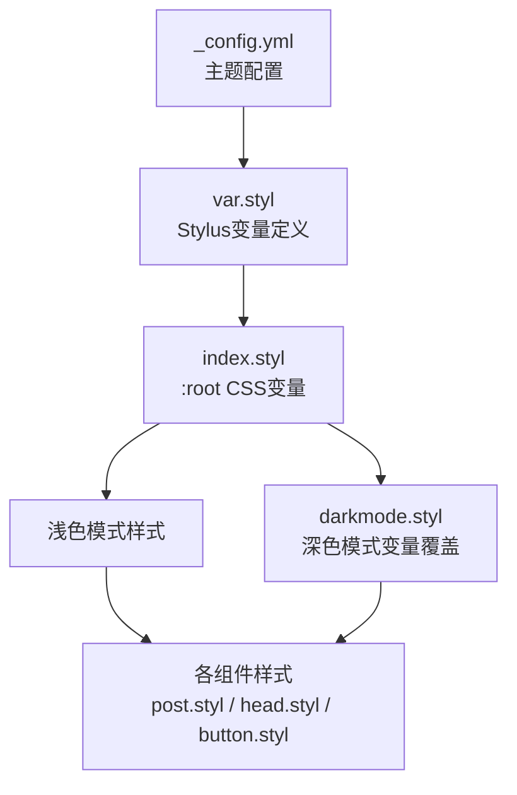
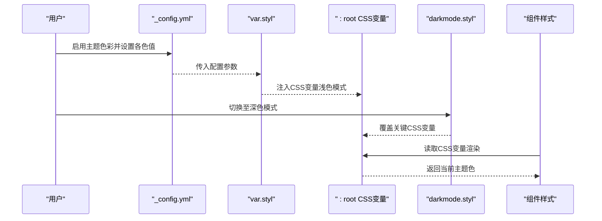
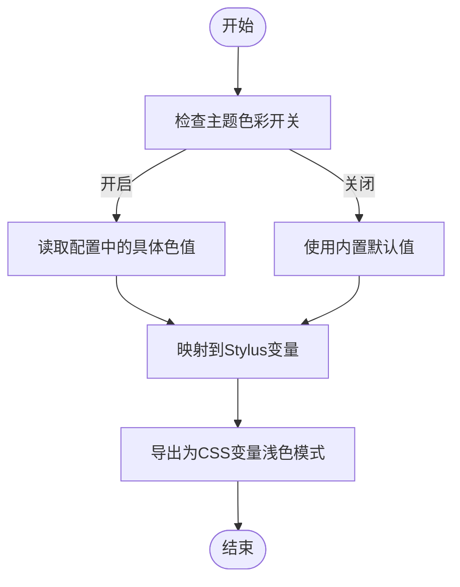
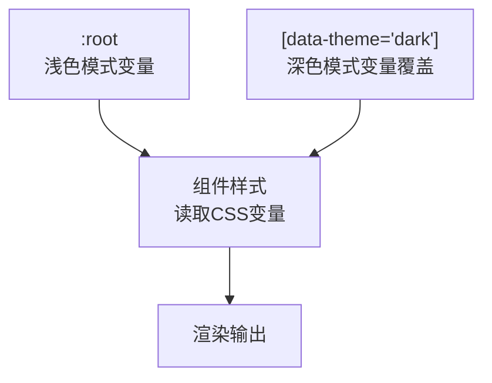
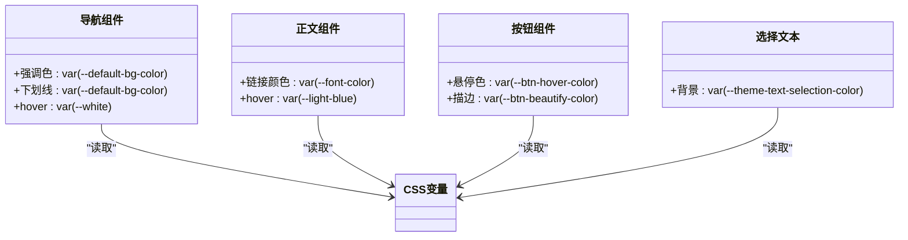
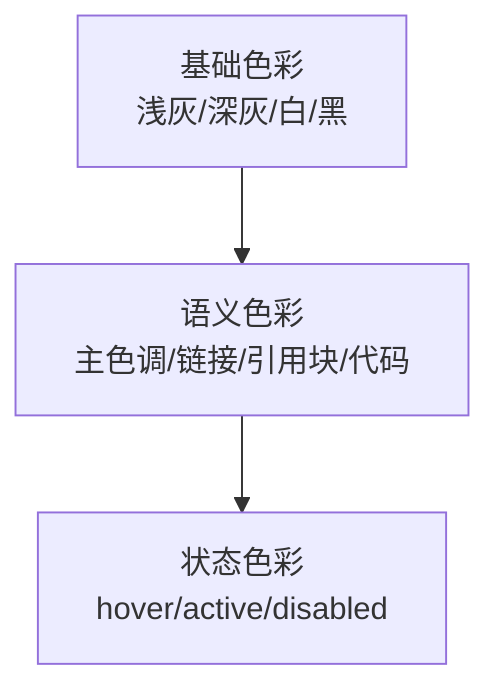
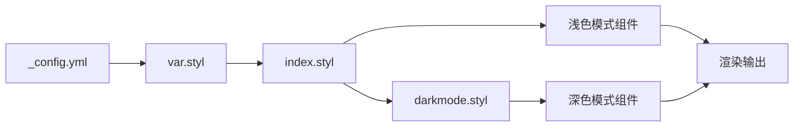

# 色彩系统配置

<cite>
**本文档引用的文件**
- [var.styl](file://themes/butterfly/source/css/var.styl)
- [darkmode.styl](file://themes/butterfly/source/css/_mode/darkmode.styl)
- [index.styl](file://themes/butterfly/source/css/index.styl)
- [function.styl](file://themes/butterfly/source/css/_global/function.styl)
- [_config.yml](file://themes/butterfly/_config.yml)
- [post.styl](file://themes/butterfly/source/css/_layout/post.styl)
- [button.styl](file://themes/butterfly/source/css/_tags/button.styl)
- [head.styl](file://themes/butterfly/source/css/_layout/head.styl)
- [index.styl](file://themes/butterfly/source/css/_global/index.styl)
</cite>

## 目录
1. [简介](#简介)
2. [项目结构](#项目结构)
3. [核心组件](#核心组件)
4. [架构总览](#架构总览)
5. [详细组件分析](#详细组件分析)
6. [依赖关系分析](#依赖关系分析)
7. [性能考虑](#性能考虑)
8. [故障排除指南](#故障排除指南)
9. [结论](#结论)
10. [附录](#附录)

## 简介
本文件面向博客系统的色彩系统配置，聚焦于主题色彩配置的核心概念与实现方式。内容涵盖主色调（main）、按钮悬停色（button_hover）、链接颜色（link_color）、文本选择色（text_selection）等关键变量的定义与作用；解释色彩系统的层次结构（基础色彩、语义色彩、状态色彩）；提供可直接参考的配置示例与CSS变量命名规范；阐述深色模式与浅色模式的适配机制及通过CSS变量实现的动态切换；最后给出色彩对比度检查与无障碍设计建议。

## 项目结构
色彩系统由三部分协同构成：
- 配置层：在主题配置中启用主题色彩开关并设置各色值
- 编译层：Stylus变量根据配置生成默认值或覆盖值
- 渲染层：CSS变量在浅色与深色模式下动态切换，实现主题切换

**图表来源**
- [_config.yml:756-776](file://themes/butterfly/_config.yml#L756-L776)
- [var.styl:1-20](file://themes/butterfly/source/css/var.styl#L1-L20)
- [index.styl:1-41](file://themes/butterfly/source/css/_global/index.styl#L1-L41)
- [darkmode.styl:1-40](file://themes/butterfly/source/css/_mode/darkmode.styl#L1-L40)
- [post.styl:79-84](file://themes/butterfly/source/css/_layout/post.styl#L79-L84)
- [head.styl:4-4](file://themes/butterfly/source/css/_layout/head.styl#L4-L4)
- [button.styl:10-22](file://themes/butterfly/source/css/_tags/button.styl#L10-L22)

**章节来源**
- [index.styl:1-15](file://themes/butterfly/source/css/index.styl#L1-L15)

## 核心组件
- 主题色彩开关与变量映射：通过配置项控制是否启用主题色彩，并将用户输入映射到Stylus变量
- CSS变量根节点：在浅色模式下将Stylus变量注入为CSS自定义属性，供组件读取
- 深色模式覆盖：在深色模式下重写关键CSS变量，实现整体色彩反转
- 组件消费：文章、导航、按钮等组件统一通过CSS变量读取当前主题色

关键变量与用途概览：
- 主色调（main）：作为全局强调色与交互高亮的基础色
- 按钮悬停色（button_hover）：用于按钮hover态背景或描边
- 链接颜色（link_color）：用于正文链接的默认颜色
- 文本选择色（text_selection）：用于选中文本的背景色
- 分页器颜色（paginator）、标题分割线颜色（hr_color）、代码前景/背景（code_foreground/code_background）、目录颜色（toc_color）、引用块颜色（blockquote_*）、滚动条颜色（scrollbar_color）

**章节来源**
- [var.styl:5-14](file://themes/butterfly/source/css/var.styl#L5-L14)
- [index.styl:1-41](file://themes/butterfly/source/css/_global/index.styl#L1-L41)
- [darkmode.styl:1-40](file://themes/butterfly/source/css/_mode/darkmode.styl#L1-L40)

## 架构总览
色彩系统采用“配置 → Stylus变量 → CSS变量 → 组件”的分层架构。浅色模式与深色模式通过同一套CSS变量名实现动态切换，组件无需感知具体颜色值，仅需读取CSS变量即可获得当前主题色。

**图表来源**
- [_config.yml:756-776](file://themes/butterfly/_config.yml#L756-L776)
- [var.styl:5-14](file://themes/butterfly/source/css/var.styl#L5-L14)
- [index.styl:1-41](file://themes/butterfly/source/css/_global/index.styl#L1-L41)
- [darkmode.styl:1-40](file://themes/butterfly/source/css/_mode/darkmode.styl#L1-L40)
- [post.styl:79-84](file://themes/butterfly/source/css/_layout/post.styl#L79-L84)

## 详细组件分析

### 主题色彩配置与变量映射
- 开关控制：当启用主题色彩时，各变量按配置值转换；否则回退到内置默认值
- 关键变量：
  - 主色调：$theme-color
  - 按钮悬停色：$button-hover-color
  - 链接颜色：$theme-link-color
  - 文本选择色：$theme-text-selection-color
  - 其他：分页器、标题分割线、代码块、目录、引用块、滚动条等

**图表来源**
- [var.styl:5-14](file://themes/butterfly/source/css/var.styl#L5-L14)
- [index.styl:1-41](file://themes/butterfly/source/css/_global/index.styl#L1-L41)

**章节来源**
- [var.styl:5-14](file://themes/butterfly/source/css/var.styl#L5-L14)
- [index.styl:1-41](file://themes/butterfly/source/css/_global/index.styl#L1-L41)

### 浅色模式与深色模式适配
- 浅色模式：通过:root注入CSS变量，组件统一读取
- 深色模式：在[data-theme='dark']容器内重写关键CSS变量，如背景、文字、按钮、滚动条等
- 组件层面无需改动，仅依赖CSS变量即可自动适配

**图表来源**
- [index.styl:1-41](file://themes/butterfly/source/css/_global/index.styl#L1-L41)
- [darkmode.styl:1-40](file://themes/butterfly/source/css/_mode/darkmode.styl#L1-L40)

**章节来源**
- [darkmode.styl:1-40](file://themes/butterfly/source/css/_mode/darkmode.styl#L1-L40)
- [index.styl:1-41](file://themes/butterfly/source/css/_global/index.styl#L1-L41)

### 组件消费CSS变量
- 导航栏：强调色用于下划线、hover效果
- 正文链接：使用链接颜色变量
- 按钮：使用按钮悬停色变量
- 选择文本：使用文本选择色变量
- 引用块：使用引用块边框与背景变量

**图表来源**
- [head.styl:4-4](file://themes/butterfly/source/css/_layout/head.styl#L4-L4)
- [post.styl:79-84](file://themes/butterfly/source/css/_layout/post.styl#L79-L84)
- [button.styl:10-22](file://themes/butterfly/source/css/_tags/button.styl#L10-L22)
- [index.styl:210-213](file://themes/butterfly/source/css/_global/index.styl#L210-L213)

**章节来源**
- [head.styl:4-4](file://themes/butterfly/source/css/_layout/head.styl#L4-L4)
- [post.styl:79-84](file://themes/butterfly/source/css/_layout/post.styl#L79-L84)
- [button.styl:10-22](file://themes/butterfly/source/css/_tags/button.styl#L10-L22)
- [index.styl:210-213](file://themes/butterfly/source/css/_global/index.styl#L210-L213)

### 色彩系统层次结构
- 基础色彩：如浅灰、深灰、白色、黑色等通用色板
- 语义色彩：围绕主色调派生的强调色、链接色、引用块色等
- 状态色彩：hover、active、disabled等状态下的颜色变体

[此图为概念性示意，不对应具体源码文件]

## 依赖关系分析
- 配置依赖：_config.yml中的theme_color字段决定是否启用主题色彩
- 变量依赖：var.styl中的Stylus变量依赖配置值
- 渲染依赖：index.styl将Stylus变量注入为CSS变量
- 模式依赖：darkmode.styl在深色模式下覆盖CSS变量
- 组件依赖：各组件样式通过CSS变量读取当前主题色

**图表来源**
- [_config.yml:756-776](file://themes/butterfly/_config.yml#L756-L776)
- [var.styl:5-14](file://themes/butterfly/source/css/var.styl#L5-L14)
- [index.styl:1-41](file://themes/butterfly/source/css/_global/index.styl#L1-L41)
- [darkmode.styl:1-40](file://themes/butterfly/source/css/_mode/darkmode.styl#L1-L40)

**章节来源**
- [_config.yml:756-776](file://themes/butterfly/_config.yml#L756-L776)
- [var.styl:5-14](file://themes/butterfly/source/css/var.styl#L5-L14)
- [index.styl:1-41](file://themes/butterfly/source/css/_global/index.styl#L1-L41)
- [darkmode.styl:1-40](file://themes/butterfly/source/css/_mode/darkmode.styl#L1-L40)

## 性能考虑
- CSS变量读取成本极低，组件只需一次样式解析即可生效
- 深色模式切换通过替换CSS变量实现，避免重排与重绘
- 建议尽量复用CSS变量，减少硬编码颜色值，便于维护与扩展

[本节为通用指导，不涉及具体文件分析]

## 故障排除指南
- 主题色彩未生效
  - 检查配置项是否启用主题色彩开关
  - 确认各色值格式正确（十六进制或带alpha的RGBA）
- 深色模式颜色异常
  - 确认[data-theme='dark']容器存在且样式优先级正确
  - 检查深色模式变量覆盖是否完整
- 对比度不足导致可读性差
  - 使用对比度工具校验文本与背景的对比度
  - 调整深色模式下的文字与背景变量

**章节来源**
- [_config.yml:756-776](file://themes/butterfly/_config.yml#L756-L776)
- [darkmode.styl:1-40](file://themes/butterfly/source/css/_mode/darkmode.styl#L1-L40)

## 结论
该色彩系统以配置为中心，通过Stylus变量与CSS变量解耦，实现了浅色与深色模式的无缝切换。通过统一的CSS变量命名与层次化色彩策略，既保证了视觉一致性，又提升了可维护性与可扩展性。建议在实际部署中结合无障碍要求进行对比度校验，并遵循CSS变量命名规范以保持团队协作效率。

[本节为总结性内容，不涉及具体文件分析]

## 附录

### 配置示例与命名规范
- 启用主题色彩开关
  - 在配置中开启主题色彩开关
- 关键色值配置
  - 主色调（main）
  - 按钮悬停色（button_hover）
  - 链接颜色（link_color）
  - 文本选择色（text_selection）
  - 分页器颜色（paginator）
  - 标题分割线颜色（hr_color）
  - 代码前景/背景（code_foreground/code_background）
  - 目录颜色（toc_color）
  - 引用块边框/背景（blockquote_padding_color/blockquote_background_color）
  - 滚动条颜色（scrollbar_color）
- 命名规范
  - CSS变量统一使用--前缀，采用语义化命名，如--default-bg-color、--btn-hover-color、--theme-text-selection-color
  - 深色模式变量在同一变量名基础上覆盖，确保组件读取一致

**章节来源**
- [_config.yml:756-776](file://themes/butterfly/_config.yml#L756-L776)
- [var.styl:5-14](file://themes/butterfly/source/css/var.styl#L5-L14)
- [index.styl:1-41](file://themes/butterfly/source/css/_global/index.styl#L1-L41)
- [darkmode.styl:1-40](file://themes/butterfly/source/css/_mode/darkmode.styl#L1-L40)