# 视觉设计系统

<cite>
**本文引用的文件**
- [_config.yml](file://_config.yml)
- [_config.butterfly.yml](file://_config.butterfly.yml)
- [var.styl](file://themes/butterfly/source/css/var.styl)
- [index.styl](file://themes/butterfly/source/css/index.styl)
- [index.styl](file://themes/butterfly/source/css/_global/index.styl)
- [post.styl](file://themes/butterfly/source/css/_layout/post.styl)
- [button.styl](file://themes/butterfly/source/css/_tags/button.styl)
- [darkmode.styl](file://themes/butterfly/source/css/_mode/darkmode.styl)
- [homepage.styl](file://themes/butterfly/source/css/_page/homepage.styl)
- [sidebar.styl](file://themes/butterfly/source/css/_layout/sidebar.styl)
- [note.styl](file://themes/butterfly/source/css/_tags/note.styl)
- [gallery.styl](file://themes/butterfly/source/css/_tags/gallery.styl)
- [rightside.styl](file://themes/butterfly/source/css/_layout/rightside.styl)
- [footer.styl](file://themes/butterfly/source/css/_layout/footer.styl)
- [head.styl](file://themes/butterfly/source/css/_layout/head.styl)
</cite>

## 目录
1. [简介](#简介)
2. [项目结构](#项目结构)
3. [核心组件](#核心组件)
4. [架构总览](#架构总览)
5. [详细组件分析](#详细组件分析)
6. [依赖关系分析](#依赖关系分析)
7. [性能考量](#性能考量)
8. [故障排查指南](#故障排查指南)
9. [结论](#结论)
10. [附录](#附录)

## 简介
本文件面向博客系统的视觉设计系统，围绕极简主义理念与柔和配色方案，系统化梳理统一圆角风格、主题色彩体系、字体系统、背景与遮罩效果的实现原理与配置方法，并提供可操作的配置示例路径、一致性检查清单与最佳实践建议，帮助读者在不直接阅读源码的前提下完成高质量的视觉定制。

## 项目结构
- 主题采用 Stylus 编译为 CSS 的结构，通过 var.styl 定义全局变量，index.styl 组织导入顺序，再由各模块样式文件（如 _global、_layout、_tags、_mode）按需覆盖与扩展。
- 配置入口位于根目录与主题目录的 YAML 配置文件中，分别控制站点基础信息与主题行为；主题内部通过 hexo-config 读取配置并动态生成 CSS 变量与样式分支。

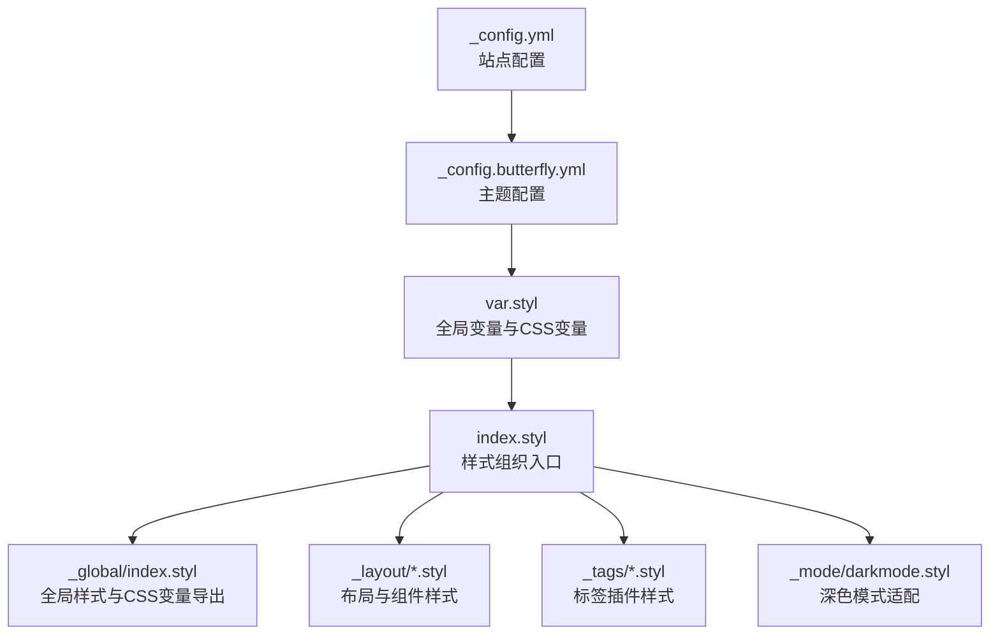

图表来源
- [_config.yml](file://_config.yml)
- [_config.butterfly.yml](file://_config.butterfly.yml)
- [var.styl](file://themes/butterfly/source/css/var.styl)
- [index.styl](file://themes/butterfly/source/css/index.styl)
- [index.styl](file://themes/butterfly/source/css/_global/index.styl)
- [darkmode.styl](file://themes/butterfly/source/css/_mode/darkmode.styl)

章节来源
- [_config.yml](file://_config.yml)
- [_config.butterfly.yml](file://_config.butterfly.yml)
- [index.styl](file://themes/butterfly/source/css/index.styl)

## 核心组件
- 主题色彩系统：通过主题配置中的 theme_color 字段集中管理主色调、按钮悬停色、链接色、代码块前景/背景、滚动条色等，var.styl 将其映射为 Stylus 变量并在全局 CSS 变量中导出，供各模块使用。
- 统一圆角风格：通过 rounded_corners_ui 开关与 addBorderRadius 混入在表格、侧栏菜单、按钮、Note 插件等处统一应用圆角半径。
- 字体系统：通过 font.* 与 blog_title_font.* 配置项控制正文与标题字体族、字号；var.styl 中定义默认字体栈与代码字体栈，并在全局样式中应用。
- 背景与遮罩：通过 mask.* 控制头部与底部遮罩层；通过 background.* 设置网站背景；首页封面图与信息层支持遮罩与模糊叠加。
- 深色模式：通过 darkmode.styl 在 [data-theme='dark'] 上下文内重定义所有 CSS 变量，确保深色环境下的视觉一致性。

章节来源
- [_config.butterfly.yml](file://_config.butterfly.yml)
- [var.styl](file://themes/butterfly/source/css/var.styl)
- [index.styl](file://themes/butterfly/source/css/_global/index.styl)
- [darkmode.styl](file://themes/butterfly/source/css/_mode/darkmode.styl)

## 架构总览
视觉设计系统以“配置驱动 + 变量分发 + 模块化样式”为核心，形成从配置到变量再到样式的单向数据流。

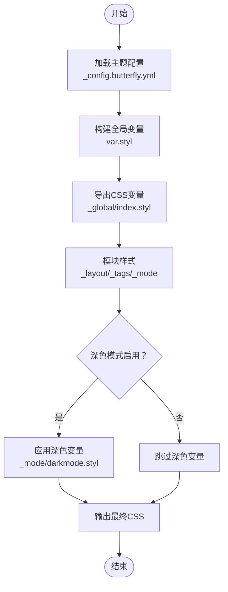

图表来源
- [_config.butterfly.yml](file://_config.butterfly.yml)
- [var.styl](file://themes/butterfly/source/css/var.styl)
- [index.styl](file://themes/butterfly/source/css/_global/index.styl)
- [darkmode.styl](file://themes/butterfly/source/css/_mode/darkmode.styl)

## 详细组件分析

### 主题色彩系统
- 配置入口：主题配置中的 theme_color.* 字段用于集中定义主色调、分页器、按钮悬停、文本选中、链接、元信息、分割线、代码块、TOC、引用块、滚动条、Meta 主题色等。
- 变量映射：var.styl 将配置转换为 Stylus 变量，并在全局样式中以 CSS 自定义属性形式导出，供模块按需消费。
- 深色模式：darkmode.styl 在深色上下文中重新计算并导出一组对应的 CSS 变量，保证对比度与可读性。

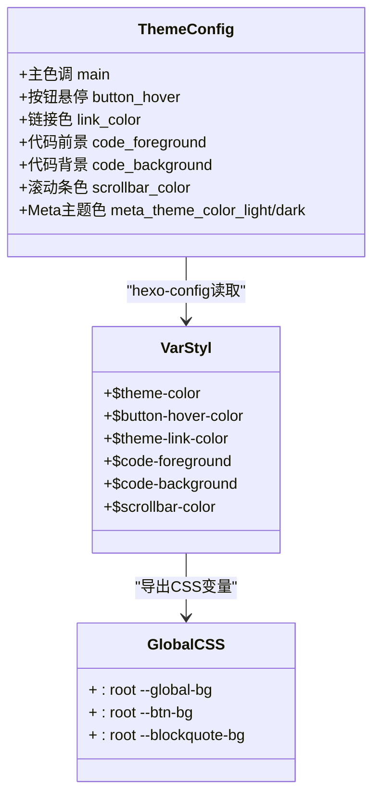

图表来源
- [_config.butterfly.yml](file://_config.butterfly.yml)
- [var.styl](file://themes/butterfly/source/css/var.styl)
- [index.styl](file://themes/butterfly/source/css/_global/index.styl)

章节来源
- [_config.butterfly.yml](file://_config.butterfly.yml)
- [var.styl](file://themes/butterfly/source/css/var.styl)
- [index.styl](file://themes/butterfly/source/css/_global/index.styl)
- [darkmode.styl](file://themes/butterfly/source/css/_mode/darkmode.styl)

### 统一圆角风格
- 开关：rounded_corners_ui 控制是否启用统一圆角。
- 应用点：表格、侧栏菜单、按钮、Note 插件等通过 addBorderRadius 混入或显式 border-radius 实现一致的圆角风格。
- 设计原则：优先使用小半径圆角（如 5px/6px/10px），保持极简与现代感。

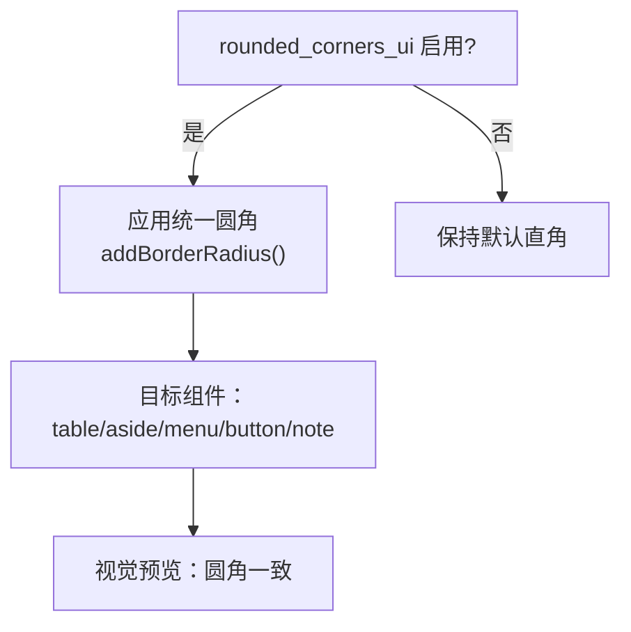

图表来源
- [_config.butterfly.yml](file://_config.butterfly.yml)
- [index.styl](file://themes/butterfly/source/css/_global/index.styl)
- [sidebar.styl](file://themes/butterfly/source/css/_layout/sidebar.styl)
- [button.styl](file://themes/butterfly/source/css/_tags/button.styl)
- [note.styl](file://themes/butterfly/source/css/_tags/note.styl)

章节来源
- [_config.butterfly.yml](file://_config.butterfly.yml)
- [index.styl](file://themes/butterfly/source/css/_global/index.styl)
- [sidebar.styl](file://themes/butterfly/source/css/_layout/sidebar.styl)
- [button.styl](file://themes/butterfly/source/css/_tags/button.styl)
- [note.styl](file://themes/butterfly/source/css/_tags/note.styl)

### 字体系统
- 全局字体：font.global_font_size 与 font.font_family 控制正文字号与字体族；代码字体由 font.code_font_family 控制。
- 标题字体：blog_title_font.font_family 与 blog_title_font.font_link 可单独指定站点标题与副标题字体族。
- 默认栈：var.styl 提供跨平台默认字体栈与代码字体栈，确保在不同系统上获得一致体验。

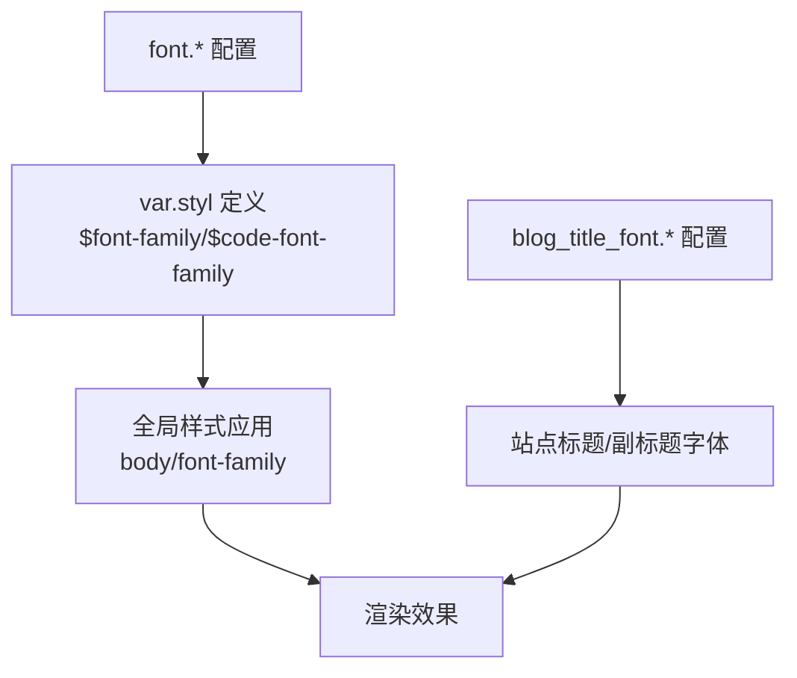

图表来源
- [_config.butterfly.yml](file://_config.butterfly.yml)
- [var.styl](file://themes/butterfly/source/css/var.styl)
- [index.styl](file://themes/butterfly/source/css/_global/index.styl)

章节来源
- [_config.butterfly.yml](file://_config.butterfly.yml)
- [var.styl](file://themes/butterfly/source/css/var.styl)
- [index.styl](file://themes/butterfly/source/css/_global/index.styl)

### 背景与遮罩效果
- 遮罩：mask.header 与 mask.footer 控制头部与底部遮罩层，配合 CSS 变量 --mark-bg 实现半透明遮罩。
- 背景：background.* 支持颜色、图片或数组随机背景；首页封面图与信息层支持模糊叠加与定位。
- 深色背景：darkmode.styl 在深色模式下为背景与遮罩提供更合适的对比度与层次。

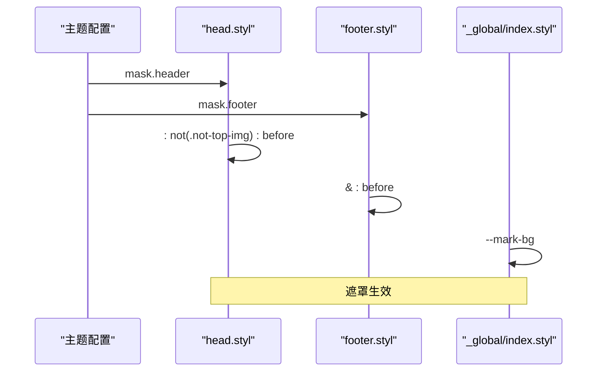

图表来源
- [_config.butterfly.yml](file://_config.butterfly.yml)
- [head.styl](file://themes/butterfly/source/css/_layout/head.styl)
- [footer.styl](file://themes/butterfly/source/css/_layout/footer.styl)
- [index.styl](file://themes/butterfly/source/css/_global/index.styl)

章节来源
- [_config.butterfly.yml](file://_config.butterfly.yml)
- [head.styl](file://themes/butterfly/source/css/_layout/head.styl)
- [footer.styl](file://themes/butterfly/source/css/_layout/footer.styl)
- [index.styl](file://themes/butterfly/source/css/_global/index.styl)

### 按钮与交互态
- 按钮：button.styl 定义基础按钮样式与描边/轮廓变体，通过 CSS 变量 --btn-bg 与 --btn-hover-color 实现主题色联动。
- 交互：hover 状态统一使用 --btn-hover-color，确保与主题色一致且具备良好的视觉反馈。
- 圆角：按钮继承统一圆角策略，保持与整体风格一致。

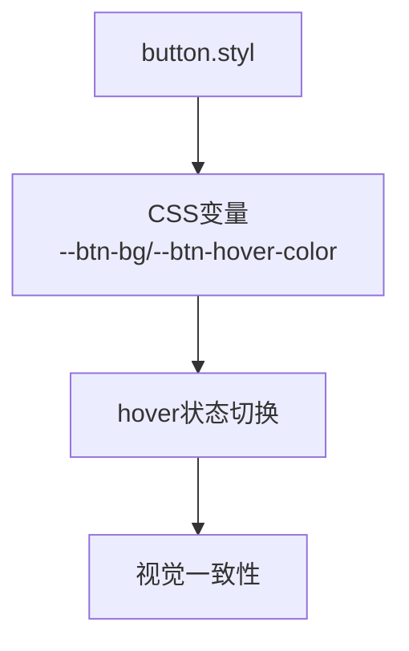

图表来源
- [button.styl](file://themes/butterfly/source/css/_tags/button.styl)
- [index.styl](file://themes/butterfly/source/css/_global/index.styl)

章节来源
- [button.styl](file://themes/butterfly/source/css/_tags/button.styl)
- [index.styl](file://themes/butterfly/source/css/_global/index.styl)

### 文章与卡片
- 卡片阴影：全局定义了卡片 hover 的阴影层级，提升交互层次感。
- 圆角卡片：homepage.styl 与 sidebar.styl 对卡片容器应用统一圆角，增强极简风格。
- 引用块：blockquote 使用主题色的边框与背景透明度，配合 CSS 变量实现一致的强调效果。

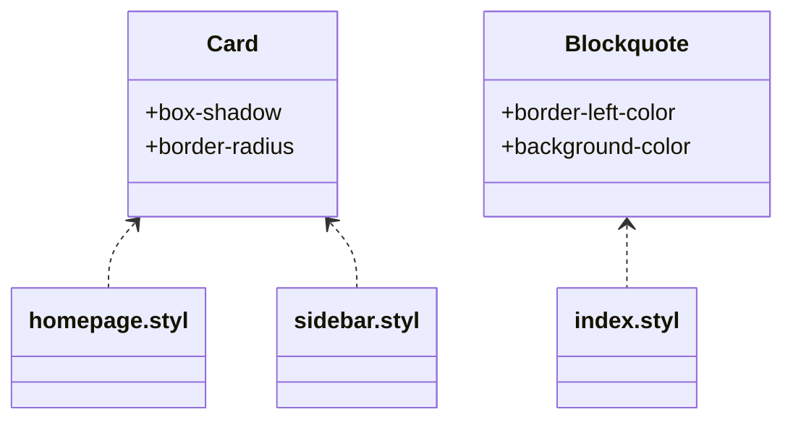

图表来源
- [homepage.styl](file://themes/butterfly/source/css/_page/homepage.styl)
- [sidebar.styl](file://themes/butterfly/source/css/_layout/sidebar.styl)
- [index.styl](file://themes/butterfly/source/css/_global/index.styl)

章节来源
- [homepage.styl](file://themes/butterfly/source/css/_page/homepage.styl)
- [sidebar.styl](file://themes/butterfly/source/css/_layout/sidebar.styl)
- [index.styl](file://themes/butterfly/source/css/_global/index.styl)

### Note 插件与标签云
- Note 插件：支持 simple/flat/modern 三种风格，颜色通过 CSS 变量 --note-* 与 --tags-* 控制，实现主题色联动与现代风格。
- 标签云：标签云列表在 hover 时使用主题色高亮，圆角与过渡动画保持整体一致性。

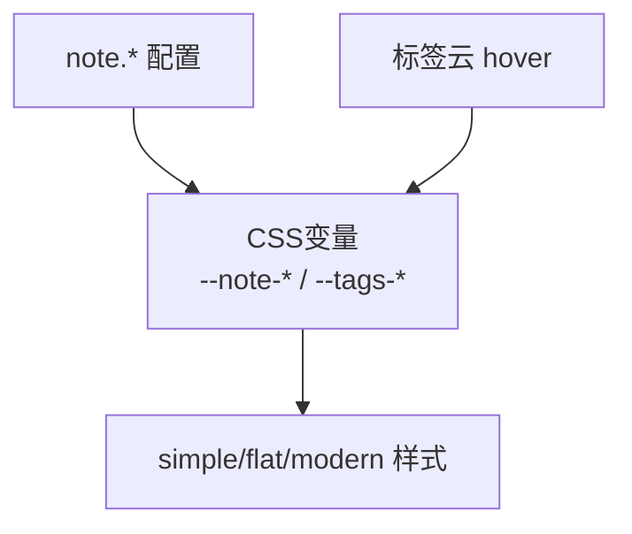

图表来源
- [_config.butterfly.yml](file://_config.butterfly.yml)
- [note.styl](file://themes/butterfly/source/css/_tags/note.styl)
- [index.styl](file://themes/butterfly/source/css/_global/index.styl)

章节来源
- [_config.butterfly.yml](file://_config.butterfly.yml)
- [note.styl](file://themes/butterfly/source/css/_tags/note.styl)
- [index.styl](file://themes/butterfly/source/css/_global/index.styl)

### 深色模式
- 切换机制：通过 [data-theme='dark'] 上下文重定义所有 CSS 变量，确保在深色环境下仍具备良好对比度与可读性。
- 适配范围：包括背景、文字、卡片、按钮、引用块、标签与插件等，覆盖全站组件。
- 图片与第三方组件：对图片与评论区等第三方组件进行亮度与对比度调整，避免反差过大影响阅读。

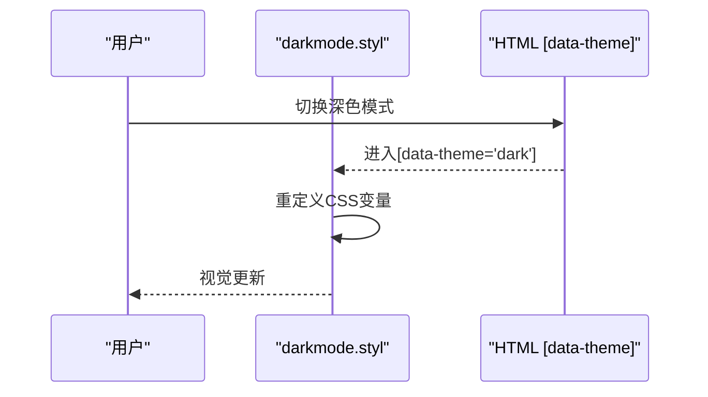

图表来源
- [darkmode.styl](file://themes/butterfly/source/css/_mode/darkmode.styl)

章节来源
- [darkmode.styl](file://themes/butterfly/source/css/_mode/darkmode.styl)

## 依赖关系分析
- 配置到变量：_config.butterfly.yml → var.styl → index.styl 导出 CSS 变量。
- 变量到样式：CSS 变量被各模块样式文件引用，形成“配置驱动样式”的单向依赖。
- 深色模式：darkmode.styl 作为独立模块，在特定上下文中覆盖变量，不破坏原有依赖链。

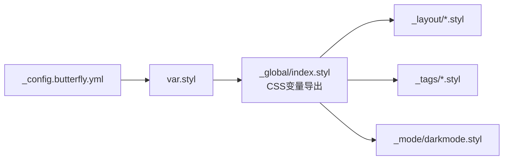

图表来源
- [_config.butterfly.yml](file://_config.butterfly.yml)
- [var.styl](file://themes/butterfly/source/css/var.styl)
- [index.styl](file://themes/butterfly/source/css/_global/index.styl)
- [darkmode.styl](file://themes/butterfly/source/css/_mode/darkmode.styl)

章节来源
- [_config.butterfly.yml](file://_config.butterfly.yml)
- [var.styl](file://themes/butterfly/source/css/var.styl)
- [index.styl](file://themes/butterfly/source/css/_global/index.styl)
- [darkmode.styl](file://themes/butterfly/source/css/_mode/darkmode.styl)

## 性能考量
- 变量复用：通过 CSS 变量集中管理颜色与尺寸，减少重复定义与编译体积。
- 条件加载：部分效果（如深色模式、遮罩、圆角）仅在配置开启时生效，避免无谓的样式计算。
- 图片与第三方组件：深色模式对图片与第三方组件进行亮度/对比度调整，兼顾可读性与性能。

## 故障排查指南
- 颜色不生效
  - 检查主题配置中 theme_color.* 是否正确填写并启用。
  - 确认 var.styl 已将配置转换为 Stylus 变量并导出为 CSS 变量。
  - 若启用深色模式，请确认 darkmode.styl 已正确覆盖对应变量。
- 圆角不一致
  - 确认 rounded_corners_ui 已开启。
  - 检查目标组件是否调用 addBorderRadius 或显式设置了 border-radius。
- 字体显示异常
  - 检查 font.* 与 blog_title_font.* 配置是否正确。
  - 确认 var.styl 中的默认字体栈与自定义字体栈逻辑。
- 遮罩与背景问题
  - 检查 mask.* 与 background.* 配置。
  - 确认 head.styl 与 footer.styl 的遮罩伪元素条件判断。
- 深色模式异常
  - 确认 [data-theme='dark'] 上下文是否正确切换。
  - 检查 darkmode.styl 是否被正确导入与编译。

章节来源
- [_config.butterfly.yml](file://_config.butterfly.yml)
- [var.styl](file://themes/butterfly/source/css/var.styl)
- [index.styl](file://themes/butterfly/source/css/_global/index.styl)
- [head.styl](file://themes/butterfly/source/css/_layout/head.styl)
- [footer.styl](file://themes/butterfly/source/css/_layout/footer.styl)
- [darkmode.styl](file://themes/butterfly/source/css/_mode/darkmode.styl)

## 结论
该视觉设计系统以“配置驱动 + 变量分发 + 模块化样式”为核心，实现了极简主义与柔和配色的统一表达。通过主题色彩系统、统一圆角风格、字体系统与背景遮罩的协同，结合深色模式的完整适配，能够在不牺牲可维护性的前提下，快速实现高质量的视觉定制与一致性保障。

## 附录

### 配置示例路径（主题配置）
- 主题色彩系统：[主题配置中的 theme_color.*](file://_config.butterfly.yml)
- 统一圆角：[rounded_corners_ui](file://_config.butterfly.yml)
- 字体系统：[font.* 与 blog_title_font.*](file://_config.butterfly.yml)
- 背景与遮罩：[mask.* 与 background.*](file://_config.butterfly.yml)
- 深色模式：[darkmode.*](file://_config.butterfly.yml)

### CSS 变量参考（全局导出）
- 全局变量导出位置：[CSS 变量导出](file://themes/butterfly/source/css/_global/index.styl)
- 示例变量名（非具体值）：--global-bg、--btn-bg、--blockquote-bg、--scrollbar-color 等

### 视觉一致性检查清单
- 色彩一致性
  - 主题色是否贯穿按钮、链接、引用块、滚动条等关键组件
  - 深色模式下对比度是否满足可读性要求
- 圆角一致性
  - 表格、侧栏菜单、按钮、Note 插件是否统一应用圆角
- 字体一致性
  - 正文字体与标题字体是否符合预期
  - 代码字体是否独立配置并正确应用
- 背景与遮罩
  - 遮罩层是否按需显示，颜色与透明度合理
  - 背景图片或颜色是否与主题风格匹配
- 交互一致性
  - 悬停态颜色与过渡动画是否统一
  - 按钮描边/轮廓变体是否与主题色联动