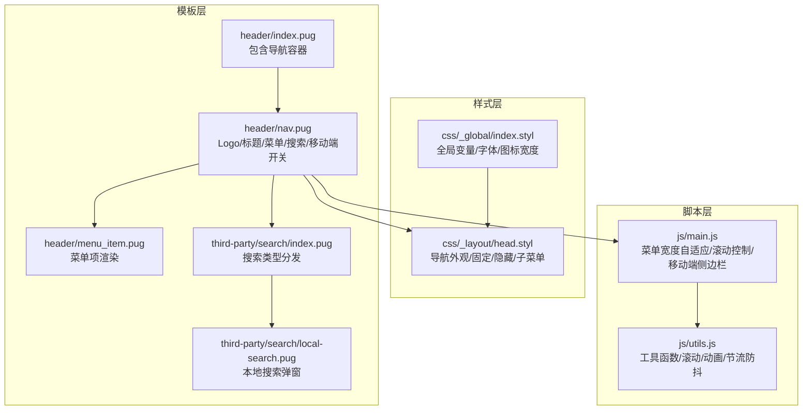
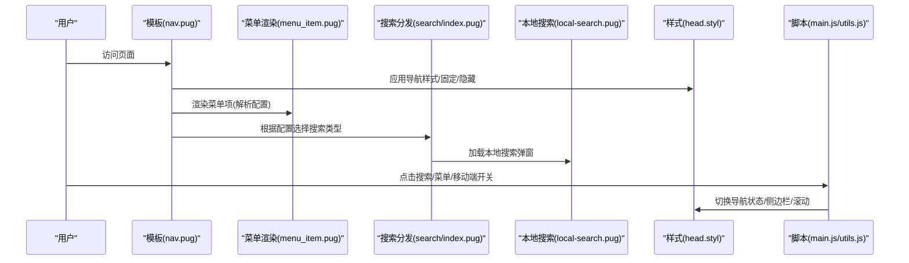
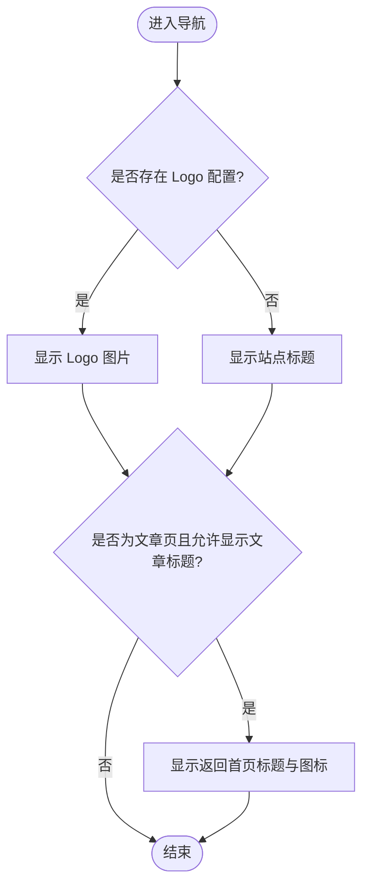
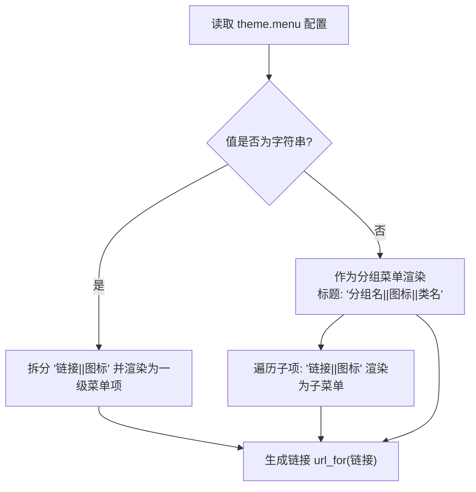
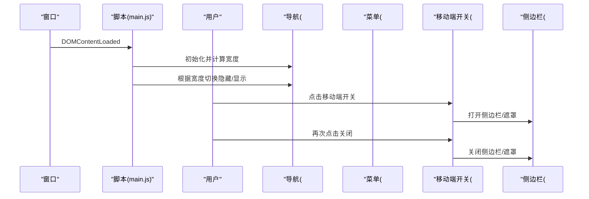
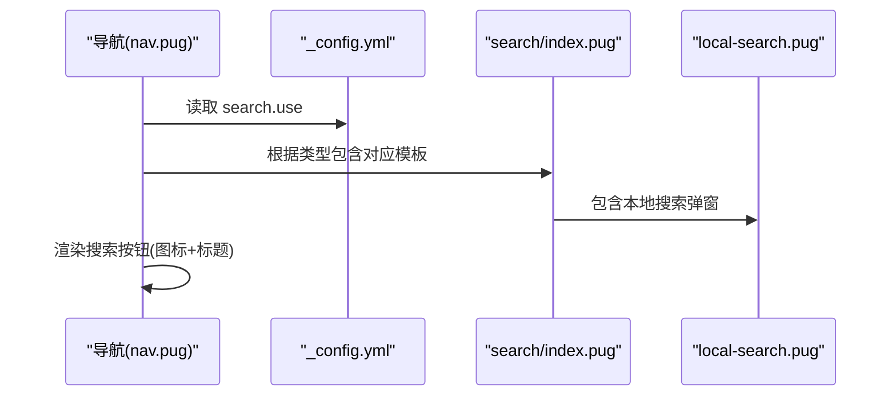
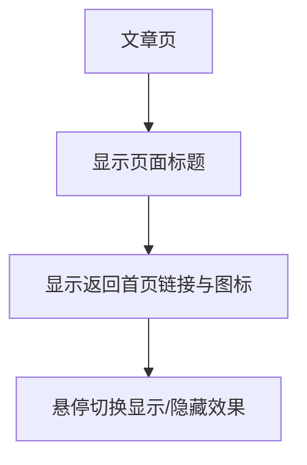
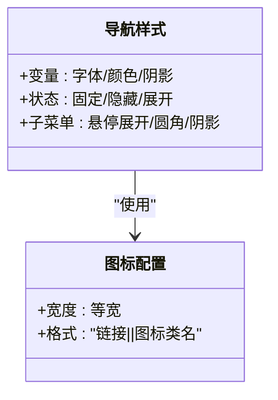
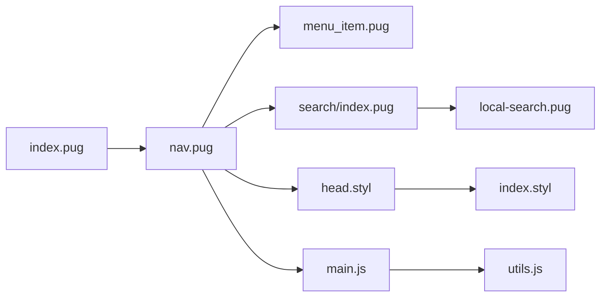

# 导航系统

<cite>
**本文引用的文件**
- [themes/butterfly/layout/includes/header/index.pug](file://themes/butterfly/layout/includes/header/index.pug)
- [themes/butterfly/layout/includes/header/nav.pug](file://themes/butterfly/layout/includes/header/nav.pug)
- [themes/butterfly/layout/includes/header/menu_item.pug](file://themes/butterfly/layout/includes/header/menu_item.pug)
- [themes/butterfly/_config.yml](file://themes/butterfly/_config.yml)
- [themes/butterfly/source/css/_layout/head.styl](file://themes/butterfly/source/css/_layout/head.styl)
- [themes/butterfly/source/css/_global/index.styl](file://themes/butterfly/source/css/_global/index.styl)
- [themes/butterfly/source/js/main.js](file://themes/butterfly/source/js/main.js)
- [themes/butterfly/source/js/utils.js](file://themes/butterfly/source/js/utils.js)
- [themes/butterfly/layout/includes/third-party/search/index.pug](file://themes/butterfly/layout/includes/third-party/search/index.pug)
- [themes/butterfly/layout/includes/third-party/search/local-search.pug](file://themes/butterfly/layout/includes/third-party/search/local-search.pug)
</cite>

## 目录
1. [简介](#简介)
2. [项目结构](#项目结构)
3. [核心组件](#核心组件)
4. [架构总览](#架构总览)
5. [详细组件分析](#详细组件分析)
6. [依赖关系分析](#依赖关系分析)
7. [性能考量](#性能考量)
8. [故障排查指南](#故障排查指南)
9. [结论](#结论)
10. [附录](#附录)

## 简介
本文件面向博客系统的导航系统，围绕导航栏的整体架构、Logo 显示逻辑、菜单项渲染机制、移动端响应式导航实现进行深入解析；同时覆盖导航配置选项、菜单项动态加载、搜索按钮集成、面包屑导航（页面标题回退）等特性，并提供样式定制、图标配置与链接生成规则的技术实现细节，以及配置指南与自定义开发建议。

## 项目结构
导航系统由模板层（Pug）、样式层（Stylus）与脚本层（JavaScript）协同完成，关键位置如下：
- 模板：导航容器与菜单渲染、Logo/标题展示、移动端菜单开关、搜索入口
- 样式：导航外观、固定/隐藏行为、子菜单展开、移动端适配
- 脚本：菜单宽度自适应、滚动控制、移动端侧边栏、搜索交互

**图表来源**
- [themes/butterfly/layout/includes/header/index.pug:29-30](file://themes/butterfly/layout/includes/header/index.pug#L29-L30)
- [themes/butterfly/layout/includes/header/nav.pug:1-26](file://themes/butterfly/layout/includes/header/nav.pug#L1-L26)
- [themes/butterfly/layout/includes/header/menu_item.pug:1-27](file://themes/butterfly/layout/includes/header/menu_item.pug#L1-L27)
- [themes/butterfly/layout/includes/third-party/search/index.pug:1-7](file://themes/butterfly/layout/includes/third-party/search/index.pug#L1-L7)
- [themes/butterfly/layout/includes/third-party/search/local-search.pug:1-24](file://themes/butterfly/layout/includes/third-party/search/local-search.pug#L1-L24)
- [themes/butterfly/source/css/_layout/head.styl:289-465](file://themes/butterfly/source/css/_layout/head.styl#L289-L465)
- [themes/butterfly/source/css/_global/index.styl:285-287](file://themes/butterfly/source/css/_global/index.styl#L285-L287)
- [themes/butterfly/source/js/main.js:1-800](file://themes/butterfly/source/js/main.js#L1-L800)
- [themes/butterfly/source/js/utils.js:1-339](file://themes/butterfly/source/js/utils.js#L1-L339)

**章节来源**
- [themes/butterfly/layout/includes/header/index.pug:29-30](file://themes/butterfly/layout/includes/header/index.pug#L29-L30)
- [themes/butterfly/layout/includes/header/nav.pug:1-26](file://themes/butterfly/layout/includes/header/nav.pug#L1-L26)
- [themes/butterfly/layout/includes/header/menu_item.pug:1-27](file://themes/butterfly/layout/includes/header/menu_item.pug#L1-L27)
- [themes/butterfly/layout/includes/third-party/search/index.pug:1-7](file://themes/butterfly/layout/includes/third-party/search/index.pug#L1-L7)
- [themes/butterfly/layout/includes/third-party/search/local-search.pug:1-24](file://themes/butterfly/layout/includes/third-party/search/local-search.pug#L1-L24)
- [themes/butterfly/source/css/_layout/head.styl:289-465](file://themes/butterfly/source/css/_layout/head.styl#L289-L465)
- [themes/butterfly/source/css/_global/index.styl:285-287](file://themes/butterfly/source/css/_global/index.styl#L285-L287)
- [themes/butterfly/source/js/main.js:1-800](file://themes/butterfly/source/js/main.js#L1-L800)
- [themes/butterfly/source/js/utils.js:1-339](file://themes/butterfly/source/js/utils.js#L1-L339)

## 核心组件
- 导航容器与布局：负责包裹 Logo/标题、菜单、搜索与移动端开关，并根据页面类型决定顶部背景与文案展示策略
- 菜单渲染器：支持一级菜单与分组菜单（带子菜单），解析配置中的“链接||图标”格式，动态生成菜单项
- 固定与隐藏逻辑：在窗口尺寸或内容宽度变化时自动隐藏溢出菜单，移动端以侧边栏替代
- 搜索集成：根据配置选择搜索类型（Algolia/本地/Docsearch），渲染对应弹窗与遮罩
- 样式与主题：通过 Stylus 控制导航颜色、阴影、固定态、子菜单动画与移动端切换
- 工具与交互：滚动控制、菜单自适应、移动端侧边栏开合、平滑滚动与动画

**章节来源**
- [themes/butterfly/layout/includes/header/index.pug:8-52](file://themes/butterfly/layout/includes/header/index.pug#L8-L52)
- [themes/butterfly/layout/includes/header/menu_item.pug:1-27](file://themes/butterfly/layout/includes/header/menu_item.pug#L1-L27)
- [themes/butterfly/source/js/main.js:5-23](file://themes/butterfly/source/js/main.js#L5-L23)
- [themes/butterfly/layout/includes/third-party/search/index.pug:1-7](file://themes/butterfly/layout/includes/third-party/search/index.pug#L1-L7)
- [themes/butterfly/source/css/_layout/head.styl:289-465](file://themes/butterfly/source/css/_layout/head.styl#L289-L465)

## 架构总览
导航系统采用“模板驱动 + 样式约束 + 脚本交互”的分层架构：
- 模板层：以 Pug 组织结构，按页面类型注入不同头部与文案
- 样式层：以 Stylus 定义导航外观、固定态、隐藏态、子菜单展开与移动端切换
- 脚本层：处理菜单宽度计算、滚动行为、移动端侧边栏、搜索弹窗交互

**图表来源**
- [themes/butterfly/layout/includes/header/nav.pug:1-26](file://themes/butterfly/layout/includes/header/nav.pug#L1-L26)
- [themes/butterfly/layout/includes/header/menu_item.pug:1-27](file://themes/butterfly/layout/includes/header/menu_item.pug#L1-L27)
- [themes/butterfly/layout/includes/third-party/search/index.pug:1-7](file://themes/butterfly/layout/includes/third-party/search/index.pug#L1-L7)
- [themes/butterfly/layout/includes/third-party/search/local-search.pug:1-24](file://themes/butterfly/layout/includes/third-party/search/local-search.pug#L1-L24)
- [themes/butterfly/source/css/_layout/head.styl:289-465](file://themes/butterfly/source/css/_layout/head.styl#L289-L465)
- [themes/butterfly/source/js/main.js:1-800](file://themes/butterfly/source/js/main.js#L1-L800)
- [themes/butterfly/source/js/utils.js:1-339](file://themes/butterfly/source/js/utils.js#L1-L339)

## 详细组件分析

### Logo 与站点标题显示逻辑
- Logo 条件渲染：当配置中存在 Logo 路径时显示；否则仅显示站点标题
- 标题显示：默认启用；可在文章页根据配置显示“返回首页”标题与回退链接
- 页面类型影响：首页、文章页、归档页、标签页、分类页分别决定顶部背景与文案

**图表来源**
- [themes/butterfly/layout/includes/header/nav.pug:2-13](file://themes/butterfly/layout/includes/header/nav.pug#L2-L13)
- [themes/butterfly/layout/includes/header/index.pug:8-52](file://themes/butterfly/layout/includes/header/index.pug#L8-L52)

**章节来源**
- [themes/butterfly/layout/includes/header/nav.pug:2-13](file://themes/butterfly/layout/includes/header/nav.pug#L2-L13)
- [themes/butterfly/layout/includes/header/index.pug:8-52](file://themes/butterfly/layout/includes/header/index.pug#L8-L52)

### 菜单项渲染机制
- 一级菜单：从配置读取键值对，值格式为“链接||图标”，自动拆分并渲染
- 分组菜单：键为分组标题“分组名||图标||类名”，值为对象，渲染为可展开的分组菜单，子项同样支持“链接||图标”
- 类名控制：当类名为“hide”时，分组默认隐藏
- 链接生成：统一使用站点根路径拼接，确保相对路径正确

**图表来源**
- [themes/butterfly/layout/includes/header/menu_item.pug:1-27](file://themes/butterfly/layout/includes/header/menu_item.pug#L1-L27)

**章节来源**
- [themes/butterfly/layout/includes/header/menu_item.pug:1-27](file://themes/butterfly/layout/includes/header/menu_item.pug#L1-L27)

### 移动端响应式导航实现
- 菜单宽度自适应：初始化时计算 Logo/标题与菜单总宽度，结合导航容器宽度与阈值决定是否隐藏菜单
- 隐藏逻辑：当总宽度超过容器宽度减去一定余量时，添加“隐藏菜单”类，显示移动端开关
- 侧边栏：移动端点击开关打开侧边栏，控制遮罩与菜单容器的显示/隐藏，并处理滚动锁定
- 固定导航：滚动时根据方向切换可见性与固定态，配合右侧功能按钮显示

**图表来源**
- [themes/butterfly/source/js/main.js:5-23](file://themes/butterfly/source/js/main.js#L5-L23)
- [themes/butterfly/source/js/main.js:26-39](file://themes/butterfly/source/js/main.js#L26-L39)
- [themes/butterfly/source/js/main.js:746-750](file://themes/butterfly/source/js/main.js#L746-L750)
- [themes/butterfly/source/css/_layout/head.styl:401-413](file://themes/butterfly/source/css/_layout/head.styl#L401-L413)

**章节来源**
- [themes/butterfly/source/js/main.js:5-23](file://themes/butterfly/source/js/main.js#L5-L23)
- [themes/butterfly/source/js/main.js:26-39](file://themes/butterfly/source/js/main.js#L26-L39)
- [themes/butterfly/source/js/main.js:746-750](file://themes/butterfly/source/js/main.js#L746-L750)
- [themes/butterfly/source/css/_layout/head.styl:401-413](file://themes/butterfly/source/css/_layout/head.styl#L401-L413)

### 搜索按钮集成
- 按钮条件渲染：当配置开启搜索时显示搜索按钮，包含图标与国际化标题
- 搜索类型分发：根据配置选择 Algolia/本地/Docsearch，分别引入对应模板
- 本地搜索弹窗：包含标题、加载状态、输入框、结果区域、分页与遮罩

**图表来源**
- [themes/butterfly/layout/includes/header/nav.pug:15-21](file://themes/butterfly/layout/includes/header/nav.pug#L15-L21)
- [themes/butterfly/layout/includes/third-party/search/index.pug:1-7](file://themes/butterfly/layout/includes/third-party/search/index.pug#L1-L7)
- [themes/butterfly/layout/includes/third-party/search/local-search.pug:1-24](file://themes/butterfly/layout/includes/third-party/search/local-search.pug#L1-L24)

**章节来源**
- [themes/butterfly/layout/includes/header/nav.pug:15-21](file://themes/butterfly/layout/includes/header/nav.pug#L15-L21)
- [themes/butterfly/layout/includes/third-party/search/index.pug:1-7](file://themes/butterfly/layout/includes/third-party/search/index.pug#L1-L7)
- [themes/butterfly/layout/includes/third-party/search/local-search.pug:1-24](file://themes/butterfly/layout/includes/third-party/search/local-search.pug#L1-L24)

### 面包屑导航（页面标题回退）
- 文章页标题回退：在文章页显示当前页面标题与“返回首页”链接，鼠标悬停时切换显示效果
- 国际化文案：标题后方文字来自语言包，确保多语言支持

**图表来源**
- [themes/butterfly/layout/includes/header/nav.pug:8-13](file://themes/butterfly/layout/includes/header/nav.pug#L8-L13)

**章节来源**
- [themes/butterfly/layout/includes/header/nav.pug:8-13](file://themes/butterfly/layout/includes/header/nav.pug#L8-L13)

### 导航样式定制与图标配置
- 样式变量：通过全局变量控制字体、颜色、阴影、圆角等
- 固定态与隐藏态：固定导航在滚动时出现/隐藏，菜单溢出时自动隐藏并显示移动端开关
- 子菜单：悬停展开，支持圆角与阴影
- 图标宽度：统一使用等宽图标宽度，保证对齐

**图表来源**
- [themes/butterfly/source/css/_global/index.styl:285-287](file://themes/butterfly/source/css/_global/index.styl#L285-L287)
- [themes/butterfly/source/css/_layout/head.styl:289-465](file://themes/butterfly/source/css/_layout/head.styl#L289-L465)

**章节来源**
- [themes/butterfly/source/css/_global/index.styl:285-287](file://themes/butterfly/source/css/_global/index.styl#L285-L287)
- [themes/butterfly/source/css/_layout/head.styl:289-465](file://themes/butterfly/source/css/_layout/head.styl#L289-L465)

## 依赖关系分析
- 模板依赖：header/index.pug 引入 nav.pug；nav.pug 引入 menu_item.pug 与搜索分发模板
- 样式依赖：head.styl 定义导航外观，依赖全局变量；menu_item 的图标宽度依赖全局等宽设置
- 脚本依赖：main.js 依赖 utils.js 提供的工具方法；滚动控制与菜单自适应相互协作

**图表来源**
- [themes/butterfly/layout/includes/header/index.pug:29-30](file://themes/butterfly/layout/includes/header/index.pug#L29-L30)
- [themes/butterfly/layout/includes/header/nav.pug:1-26](file://themes/butterfly/layout/includes/header/nav.pug#L1-L26)
- [themes/butterfly/layout/includes/header/menu_item.pug:1-27](file://themes/butterfly/layout/includes/header/menu_item.pug#L1-L27)
- [themes/butterfly/layout/includes/third-party/search/index.pug:1-7](file://themes/butterfly/layout/includes/third-party/search/index.pug#L1-L7)
- [themes/butterfly/layout/includes/third-party/search/local-search.pug:1-24](file://themes/butterfly/layout/includes/third-party/search/local-search.pug#L1-L24)
- [themes/butterfly/source/css/_layout/head.styl:289-465](file://themes/butterfly/source/css/_layout/head.styl#L289-L465)
- [themes/butterfly/source/css/_global/index.styl:285-287](file://themes/butterfly/source/css/_global/index.styl#L285-L287)
- [themes/butterfly/source/js/main.js:1-800](file://themes/butterfly/source/js/main.js#L1-L800)
- [themes/butterfly/source/js/utils.js:1-339](file://themes/butterfly/source/js/utils.js#L1-L339)

**章节来源**
- [themes/butterfly/layout/includes/header/index.pug:29-30](file://themes/butterfly/layout/includes/header/index.pug#L29-L30)
- [themes/butterfly/layout/includes/header/nav.pug:1-26](file://themes/butterfly/layout/includes/header/nav.pug#L1-L26)
- [themes/butterfly/layout/includes/header/menu_item.pug:1-27](file://themes/butterfly/layout/includes/header/menu_item.pug#L1-L27)
- [themes/butterfly/layout/includes/third-party/search/index.pug:1-7](file://themes/butterfly/layout/includes/third-party/search/index.pug#L1-L7)
- [themes/butterfly/layout/includes/third-party/search/local-search.pug:1-24](file://themes/butterfly/layout/includes/third-party/search/local-search.pug#L1-L24)
- [themes/butterfly/source/css/_layout/head.styl:289-465](file://themes/butterfly/source/css/_layout/head.styl#L289-L465)
- [themes/butterfly/source/css/_global/index.styl:285-287](file://themes/butterfly/source/css/_global/index.styl#L285-L287)
- [themes/butterfly/source/js/main.js:1-800](file://themes/butterfly/source/js/main.js#L1-L800)
- [themes/butterfly/source/js/utils.js:1-339](file://themes/butterfly/source/js/utils.js#L1-L339)

## 性能考量
- 菜单宽度计算：在初始化时一次性计算，避免频繁重排；隐藏逻辑基于阈值判断，减少复杂计算
- 滚动节流：滚动事件使用节流，降低重绘频率
- 动画与过渡：固定态与展开使用 CSS 过渡，尽量避免 JS 触发的强制同步布局
- 本地搜索：按需加载数据与遮罩，避免首屏阻塞

[本节为通用性能建议，不直接分析具体文件]

## 故障排查指南
- 菜单被意外隐藏
  - 检查窗口宽度与菜单总宽度计算逻辑，确认容器宽度与余量设置
  - 确认未手动添加“隐藏菜单”类
  - 参考：[themes/butterfly/source/js/main.js:5-23](file://themes/butterfly/source/js/main.js#L5-L23)，[themes/butterfly/source/css/_layout/head.styl:401-413](file://themes/butterfly/source/css/_layout/head.styl#L401-L413)
- 移动端侧边栏无法打开
  - 检查移动端开关绑定事件与侧边栏开关函数
  - 参考：[themes/butterfly/source/js/main.js:26-39](file://themes/butterfly/source/js/main.js#L26-L39)，[themes/butterfly/source/js/main.js:746-750](file://themes/butterfly/source/js/main.js#L746-L750)
- 搜索按钮无反应
  - 确认配置中已启用搜索，检查搜索类型分发与弹窗模板
  - 参考：[themes/butterfly/layout/includes/header/nav.pug:15-21](file://themes/butterfly/layout/includes/header/nav.pug#L15-L21)，[themes/butterfly/layout/includes/third-party/search/index.pug:1-7](file://themes/butterfly/layout/includes/third-party/search/index.pug#L1-L7)
- Logo 不显示
  - 检查配置中的 Logo 路径是否有效，确认路径拼接与 url_for 生成
  - 参考：[themes/butterfly/layout/includes/header/nav.pug:4-7](file://themes/butterfly/layout/includes/header/nav.pug#L4-L7)
- 固定导航样式异常
  - 检查固定态与可见态类名切换逻辑，确认背景色与阴影设置
  - 参考：[themes/butterfly/source/css/_layout/head.styl:146-184](file://themes/butterfly/source/css/_layout/head.styl#L146-L184)

**章节来源**
- [themes/butterfly/source/js/main.js:5-23](file://themes/butterfly/source/js/main.js#L5-L23)
- [themes/butterfly/source/js/main.js:26-39](file://themes/butterfly/source/js/main.js#L26-L39)
- [themes/butterfly/source/js/main.js:746-750](file://themes/butterfly/source/js/main.js#L746-L750)
- [themes/butterfly/layout/includes/header/nav.pug:15-21](file://themes/butterfly/layout/includes/header/nav.pug#L15-L21)
- [themes/butterfly/layout/includes/third-party/search/index.pug:1-7](file://themes/butterfly/layout/includes/third-party/search/index.pug#L1-L7)
- [themes/butterfly/layout/includes/header/nav.pug:4-7](file://themes/butterfly/layout/includes/header/nav.pug#L4-L7)
- [themes/butterfly/source/css/_layout/head.styl:146-184](file://themes/butterfly/source/css/_layout/head.styl#L146-L184)

## 结论
该导航系统通过模板、样式与脚本的清晰分工，实现了可配置、可扩展、跨设备一致的导航体验。其核心优势在于：
- 配置驱动的菜单与搜索能力
- 自适应菜单与移动端侧边栏
- 固定态与滚动行为的优雅切换
- 易于定制的主题变量与图标规范

建议在实际部署中优先校验配置项与路径，确保移动端交互与搜索功能稳定可用。

[本节为总结性内容，不直接分析具体文件]

## 附录

### 导航配置选项速览
- 导航基础
  - Logo：配置 Logo 图片路径
  - 显示站点标题：布尔值
  - 文章页显示标题：布尔值
  - 固定导航：布尔值
- 菜单配置
  - 一级菜单：键为显示文本，值为“链接||图标”
  - 分组菜单：键为“分组名||图标||类名”，值为对象，子项同上
  - 类名“hide”用于默认隐藏分组
- 搜索配置
  - 启用搜索：选择类型（algolia_search/local_search/docsearch）
  - 占位提示：可配置国际化占位符

**章节来源**
- [themes/butterfly/_config.yml:12-25](file://themes/butterfly/_config.yml#L12-L25)
- [themes/butterfly/_config.yml:474-507](file://themes/butterfly/_config.yml#L474-L507)

### 链接生成规则
- 使用站点根路径拼接，确保相对路径正确
- 支持国际化标题与图标组合
- 子菜单与父级菜单共享同一链接生成逻辑

**章节来源**
- [themes/butterfly/layout/includes/header/menu_item.pug:6-10](file://themes/butterfly/layout/includes/header/menu_item.pug#L6-L10)
- [themes/butterfly/layout/includes/header/menu_item.pug:22-26](file://themes/butterfly/layout/includes/header/menu_item.pug#L22-L26)