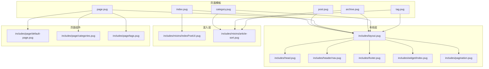
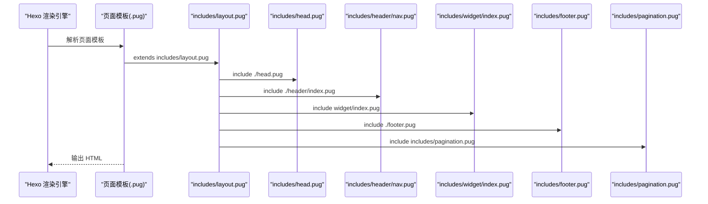
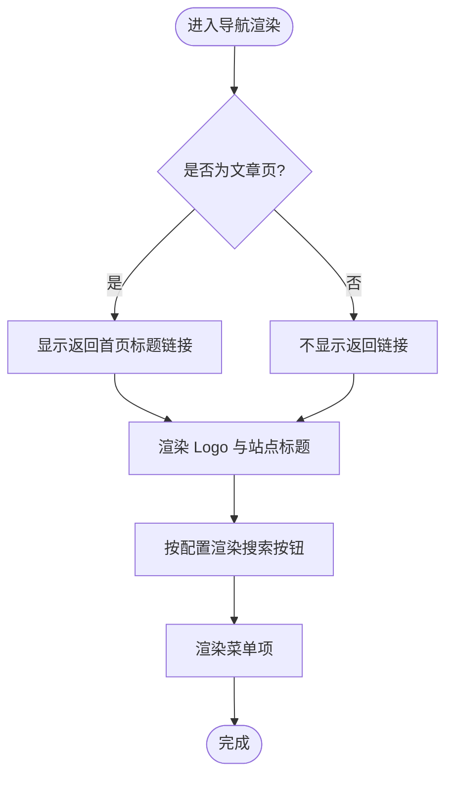
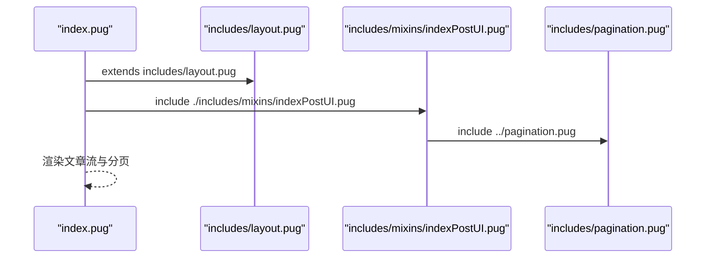
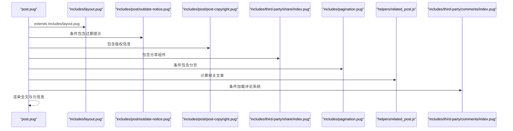
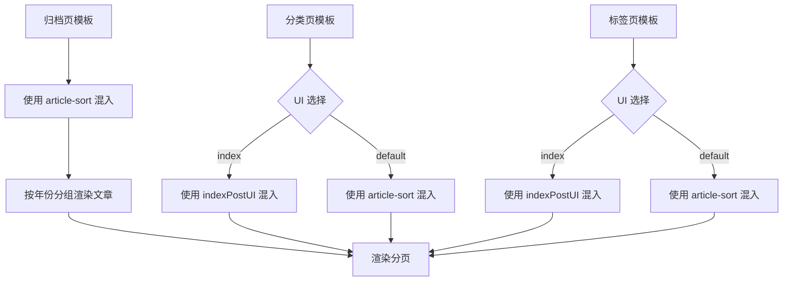
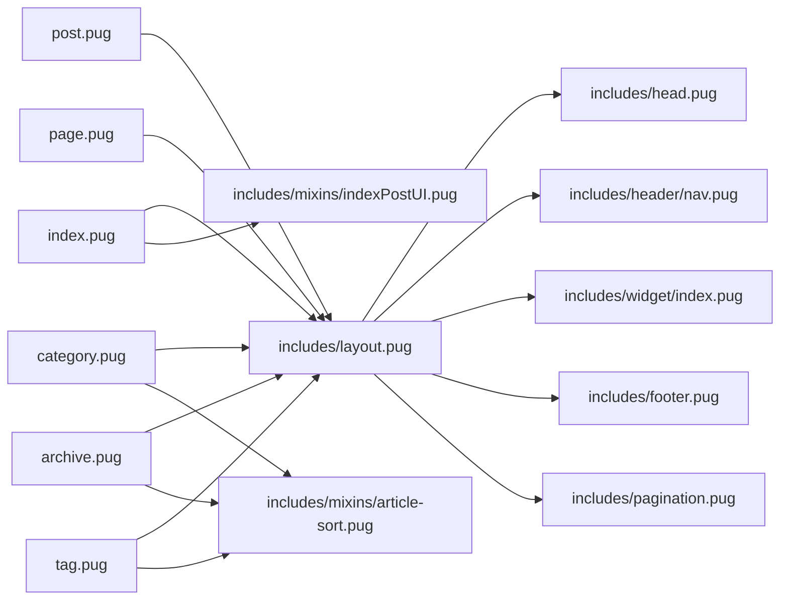

# 页面结构系统

<cite>
**本文引用的文件**
- [themes/butterfly/layout/includes/layout.pug](file://themes/butterfly/layout/includes/layout.pug)
- [themes/butterfly/layout/includes/head.pug](file://themes/butterfly/layout/includes/head.pug)
- [themes/butterfly/layout/includes/header/nav.pug](file://themes/butterfly/layout/includes/header/nav.pug)
- [themes/butterfly/layout/includes/footer.pug](file://themes/butterfly/layout/includes/footer.pug)
- [themes/butterfly/layout/includes/pagination.pug](file://themes/butterfly/layout/includes/pagination.pug)
- [themes/butterfly/layout/includes/mixins/indexPostUI.pug](file://themes/butterfly/layout/includes/mixins/indexPostUI.pug)
- [themes/butterfly/layout/includes/mixins/article-sort.pug](file://themes/butterfly/layout/includes/mixins/article-sort.pug)
- [themes/butterfly/layout/includes/widget/index.pug](file://themes/butterfly/layout/includes/widget/index.pug)
- [themes/butterfly/layout/includes/page/default-page.pug](file://themes/butterfly/layout/includes/page/default-page.pug)
- [themes/butterfly/layout/includes/page/categories.pug](file://themes/butterfly/layout/includes/page/categories.pug)
- [themes/butterfly/layout/includes/page/tags.pug](file://themes/butterfly/layout/includes/page/tags.pug)
- [themes/butterfly/layout/index.pug](file://themes/butterfly/layout/index.pug)
- [themes/butterfly/layout/post.pug](file://themes/butterfly/layout/post.pug)
- [themes/butterfly/layout/page.pug](file://themes/butterfly/layout/page.pug)
- [themes/butterfly/layout/archive.pug](file://themes/butterfly/layout/archive.pug)
- [themes/butterfly/layout/category.pug](file://themes/butterfly/layout/category.pug)
- [themes/butterfly/layout/tag.pug](file://themes/butterfly/layout/tag.pug)
- [themes/butterfly/_config.yml](file://themes/butterfly/_config.yml)
</cite>

## 目录
1. [引言](#引言)
2. [项目结构](#项目结构)
3. [核心组件](#核心组件)
4. [架构总览](#架构总览)
5. [详细组件分析](#详细组件分析)
6. [依赖关系分析](#依赖关系分析)
7. [性能考量](#性能考量)
8. [故障排查指南](#故障排查指南)
9. [结论](#结论)
10. [附录](#附录)

## 引言
本文件面向博客系统的页面结构与渲染体系，围绕导航栏设计、首页布局架构、文章详情页结构、分类/标签/归档页面的实现原理进行深入说明。重点覆盖 Pug 模板继承机制、页面组件复用、数据传递方式、SEO 元信息配置、页面渲染流程与模板变量使用，并提供页面结构定制指南与最佳实践建议。

## 项目结构
主题采用“布局 + 组件 + 混入 + 页面模板”的分层组织方式：
- 布局层：统一的 HTML 结构与通用部件（头部、侧边栏、页脚、右侧工具等）
- 组件层：可复用的 UI 片段（如导航菜单、页脚区块、小部件卡片）
- 混入层：可复用的模板片段（如首页文章流、归档文章排序）
- 页面模板：针对不同页面类型的具体模板（首页、文章、页面、归档、分类、标签）

图表来源
- [themes/butterfly/layout/includes/layout.pug:1-59](file://themes/butterfly/layout/includes/layout.pug#L1-L59)
- [themes/butterfly/layout/includes/head.pug:1-78](file://themes/butterfly/layout/includes/head.pug#L1-L78)
- [themes/butterfly/layout/includes/header/nav.pug:1-26](file://themes/butterfly/layout/includes/header/nav.pug#L1-L26)
- [themes/butterfly/layout/includes/footer.pug:1-40](file://themes/butterfly/layout/includes/footer.pug#L1-L40)
- [themes/butterfly/layout/includes/widget/index.pug:1-36](file://themes/butterfly/layout/includes/widget/index.pug#L1-L36)
- [themes/butterfly/layout/includes/pagination.pug:1-38](file://themes/butterfly/layout/includes/pagination.pug#L1-L38)
- [themes/butterfly/layout/includes/mixins/indexPostUI.pug:1-119](file://themes/butterfly/layout/includes/mixins/indexPostUI.pug#L1-L119)
- [themes/butterfly/layout/includes/mixins/article-sort.pug:1-23](file://themes/butterfly/layout/includes/mixins/article-sort.pug#L1-L23)
- [themes/butterfly/layout/index.pug:1-5](file://themes/butterfly/layout/index.pug#L1-L5)
- [themes/butterfly/layout/post.pug:1-36](file://themes/butterfly/layout/post.pug#L1-L36)
- [themes/butterfly/layout/page.pug:1-32](file://themes/butterfly/layout/page.pug#L1-L32)
- [themes/butterfly/layout/archive.pug:1-8](file://themes/butterfly/layout/archive.pug#L1-L8)
- [themes/butterfly/layout/category.pug:1-12](file://themes/butterfly/layout/category.pug#L1-L12)
- [themes/butterfly/layout/tag.pug:1-12](file://themes/butterfly/layout/tag.pug#L1-L12)
- [themes/butterfly/layout/includes/page/default-page.pug:1-2](file://themes/butterfly/layout/includes/page/default-page.pug#L1-L2)
- [themes/butterfly/layout/includes/page/categories.pug:1-1](file://themes/butterfly/layout/includes/page/categories.pug#L1-L1)
- [themes/butterfly/layout/includes/page/tags.pug:1-3](file://themes/butterfly/layout/includes/page/tags.pug#L1-L3)

章节来源
- [themes/butterfly/layout/includes/layout.pug:1-59](file://themes/butterfly/layout/includes/layout.pug#L1-L59)
- [themes/butterfly/layout/index.pug:1-5](file://themes/butterfly/layout/index.pug#L1-L5)
- [themes/butterfly/layout/post.pug:1-36](file://themes/butterfly/layout/post.pug#L1-L36)
- [themes/butterfly/layout/page.pug:1-32](file://themes/butterfly/layout/page.pug#L1-L32)
- [themes/butterfly/layout/archive.pug:1-8](file://themes/butterfly/layout/archive.pug#L1-L8)
- [themes/butterfly/layout/category.pug:1-12](file://themes/butterfly/layout/category.pug#L1-L12)
- [themes/butterfly/layout/tag.pug:1-12](file://themes/butterfly/layout/tag.pug#L1-L12)

## 核心组件
- 基础布局 includes/layout.pug：定义全局 HTML 结构、主题类、背景、侧边栏、主体内容区、页脚与右侧工具区；通过 partial 调用加载子组件，支持根据页面类型动态隐藏侧边栏。
- 头部 includes/head.pug：集中生成标题、作者、版权、主题色、Open Graph、结构化数据、站点图标、预连接、PWA、主样式、注入脚本、分析与广告等 SEO/性能相关资源。
- 导航 includes/header/nav.pug：根据全局页面类型在文章页显示返回首页的面包屑式标题，支持搜索按钮与菜单项渲染。
- 页脚 includes/footer.pug：支持多区块导航、版权信息、框架版本信息与自定义文本。
- 分页 includes/pagination.pug：支持首页分页格式与文章页前后文导航，支持封面占位与描述展示。
- 混入 mixins/indexPostUI.pug：首页文章流混入，支持多种布局（左右、上下、瀑布流）、时间戳、分类/标签、评论计数、摘要展示与广告插入。
- 混入 mixins/article-sort.pug：按年份分组的文章列表混入，支持封面、日期与标题。
- 小部件 includes/widget/index.pug：根据页面类型动态加载作者、公告、最近文章、分类、标签、归档、站点信息等卡片。
- 页面组件 includes/page/*：默认页面容器、分类列表、标签云等。

章节来源
- [themes/butterfly/layout/includes/layout.pug:1-59](file://themes/butterfly/layout/includes/layout.pug#L1-L59)
- [themes/butterfly/layout/includes/head.pug:1-78](file://themes/butterfly/layout/includes/head.pug#L1-L78)
- [themes/butterfly/layout/includes/header/nav.pug:1-26](file://themes/butterfly/layout/includes/header/nav.pug#L1-L26)
- [themes/butterfly/layout/includes/footer.pug:1-40](file://themes/butterfly/layout/includes/footer.pug#L1-L40)
- [themes/butterfly/layout/includes/pagination.pug:1-38](file://themes/butterfly/layout/includes/pagination.pug#L1-L38)
- [themes/butterfly/layout/includes/mixins/indexPostUI.pug:1-119](file://themes/butterfly/layout/includes/mixins/indexPostUI.pug#L1-L119)
- [themes/butterfly/layout/includes/mixins/article-sort.pug:1-23](file://themes/butterfly/layout/includes/mixins/article-sort.pug#L1-L23)
- [themes/butterfly/layout/includes/widget/index.pug:1-36](file://themes/butterfly/layout/includes/widget/index.pug#L1-L36)
- [themes/butterfly/layout/includes/page/default-page.pug:1-2](file://themes/butterfly/layout/includes/page/default-page.pug#L1-L2)
- [themes/butterfly/layout/includes/page/categories.pug:1-1](file://themes/butterfly/layout/includes/page/categories.pug#L1-L1)
- [themes/butterfly/layout/includes/page/tags.pug:1-3](file://themes/butterfly/layout/includes/page/tags.pug#L1-L3)

## 架构总览
页面渲染遵循“页面模板 → 继承基础布局 → 注入头部/侧边/页脚/分页 → 按需混入与组件”的流程。全局页面类型由工具函数推导，决定侧边栏显示策略、导航行为与标题生成。

图表来源
- [themes/butterfly/layout/index.pug:1-5](file://themes/butterfly/layout/index.pug#L1-L5)
- [themes/butterfly/layout/post.pug:1-36](file://themes/butterfly/layout/post.pug#L1-L36)
- [themes/butterfly/layout/page.pug:1-32](file://themes/butterfly/layout/page.pug#L1-L32)
- [themes/butterfly/layout/archive.pug:1-8](file://themes/butterfly/layout/archive.pug#L1-L8)
- [themes/butterfly/layout/category.pug:1-12](file://themes/butterfly/layout/category.pug#L1-L12)
- [themes/butterfly/layout/tag.pug:1-12](file://themes/butterfly/layout/tag.pug#L1-L12)
- [themes/butterfly/layout/includes/layout.pug:1-59](file://themes/butterfly/layout/includes/layout.pug#L1-L59)
- [themes/butterfly/layout/includes/head.pug:1-78](file://themes/butterfly/layout/includes/head.pug#L1-L78)
- [themes/butterfly/layout/includes/header/nav.pug:1-26](file://themes/butterfly/layout/includes/header/nav.pug#L1-L26)
- [themes/butterfly/layout/includes/widget/index.pug:1-36](file://themes/butterfly/layout/includes/widget/index.pug#L1-L36)
- [themes/butterfly/layout/includes/footer.pug:1-40](file://themes/butterfly/layout/includes/footer.pug#L1-L40)
- [themes/butterfly/layout/includes/pagination.pug:1-38](file://themes/butterfly/layout/includes/pagination.pug#L1-L38)

## 详细组件分析

### 导航栏设计
- 导航区域包含站点标识（Logo 与标题）与菜单区，支持搜索按钮与菜单项渲染。
- 在文章页时，导航会显示返回首页的标题链接，便于用户快速回到首页。
- 导航样式与交互由主题配置控制，例如固定导航、菜单项列表、社交链接等。

图表来源
- [themes/butterfly/layout/includes/header/nav.pug:1-26](file://themes/butterfly/layout/includes/header/nav.pug#L1-L26)

章节来源
- [themes/butterfly/layout/includes/header/nav.pug:1-26](file://themes/butterfly/layout/includes/header/nav.pug#L1-L26)
- [themes/butterfly/_config.yml:12-25](file://themes/butterfly/_config.yml#L12-L25)

### 首页布局架构
- 首页模板通过继承基础布局并引入首页文章流混入，实现多样化的文章展示布局。
- 支持瀑布流、左右/上下/交替布局等，结合封面、时间、分类/标签、摘要与广告插入。
- 分页组件在首页末尾渲染，支持自定义分页格式。

图表来源
- [themes/butterfly/layout/index.pug:1-5](file://themes/butterfly/layout/index.pug#L1-L5)
- [themes/butterfly/layout/includes/layout.pug:1-59](file://themes/butterfly/layout/includes/layout.pug#L1-L59)
- [themes/butterfly/layout/includes/mixins/indexPostUI.pug:1-119](file://themes/butterfly/layout/includes/mixins/indexPostUI.pug#L1-L119)
- [themes/butterfly/layout/includes/pagination.pug:1-38](file://themes/butterfly/layout/includes/pagination.pug#L1-L38)

章节来源
- [themes/butterfly/layout/index.pug:1-5](file://themes/butterfly/layout/index.pug#L1-L5)
- [themes/butterfly/layout/includes/mixins/indexPostUI.pug:1-119](file://themes/butterfly/layout/includes/mixins/indexPostUI.pug#L1-L119)
- [themes/butterfly/_config.yml:169-187](file://themes/butterfly/_config.yml#L169-L187)

### 文章详情页结构
- 文章详情页继承基础布局，内容区包含文章容器、过期提示、版权信息、标签分享、打赏、广告、分页、相关文章与评论区。
- 支持根据配置显示过期提示、分页顺序、相关文章算法与评论系统加载时机。

图表来源
- [themes/butterfly/layout/post.pug:1-36](file://themes/butterfly/layout/post.pug#L1-L36)
- [themes/butterfly/layout/includes/layout.pug:1-59](file://themes/butterfly/layout/includes/layout.pug#L1-L59)

章节来源
- [themes/butterfly/layout/post.pug:1-36](file://themes/butterfly/layout/post.pug#L1-L36)
- [themes/butterfly/_config.yml:229-254](file://themes/butterfly/_config.yml#L229-L254)

### 分类/标签/归档页面
- 归档页：使用文章排序混入按年份分组展示文章列表，并提供分页。
- 分类页：可选择首页风格或归档风格；首页风格使用首页文章流混入，归档风格使用文章排序混入。
- 标签页：可选择首页风格或归档风格；首页风格使用首页文章流混入，归档风格使用文章排序混入；标签云支持随机排序与字号范围配置。

图表来源
- [themes/butterfly/layout/archive.pug:1-8](file://themes/butterfly/layout/archive.pug#L1-L8)
- [themes/butterfly/layout/category.pug:1-12](file://themes/butterfly/layout/category.pug#L1-L12)
- [themes/butterfly/layout/tag.pug:1-12](file://themes/butterfly/layout/tag.pug#L1-L12)
- [themes/butterfly/layout/includes/mixins/article-sort.pug:1-23](file://themes/butterfly/layout/includes/mixins/article-sort.pug#L1-L23)
- [themes/butterfly/layout/includes/mixins/indexPostUI.pug:1-119](file://themes/butterfly/layout/includes/mixins/indexPostUI.pug#L1-L119)

章节来源
- [themes/butterfly/layout/archive.pug:1-8](file://themes/butterfly/layout/archive.pug#L1-L8)
- [themes/butterfly/layout/category.pug:1-12](file://themes/butterfly/layout/category.pug#L1-L12)
- [themes/butterfly/layout/tag.pug:1-12](file://themes/butterfly/layout/tag.pug#L1-L12)
- [themes/butterfly/layout/includes/mixins/article-sort.pug:1-23](file://themes/butterfly/layout/includes/mixins/article-sort.pug#L1-L23)
- [themes/butterfly/layout/includes/mixins/indexPostUI.pug:1-119](file://themes/butterfly/layout/includes/mixins/indexPostUI.pug#L1-L119)
- [themes/butterfly/_config.yml:777-781](file://themes/butterfly/_config.yml#L777-L781)

### 页面组件复用与数据传递
- 模板继承：各页面模板通过 extends 继承基础布局，block content 插入页面特定内容。
- partial 调用：基础布局通过 partial 加载子组件，支持缓存参数以提升性能。
- 混入使用：indexPostUI 与 article-sort 提供可复用的列表渲染逻辑，减少重复代码。
- 数据来源：模板变量来自渲染上下文（如 page、theme、config），并通过工具函数（如 url_for、date、list_categories、cloudTags）生成最终输出。

章节来源
- [themes/butterfly/layout/index.pug:1-5](file://themes/butterfly/layout/index.pug#L1-L5)
- [themes/butterfly/layout/post.pug:1-36](file://themes/butterfly/layout/post.pug#L1-L36)
- [themes/butterfly/layout/page.pug:1-32](file://themes/butterfly/layout/page.pug#L1-L32)
- [themes/butterfly/layout/includes/layout.pug:1-59](file://themes/butterfly/layout/includes/layout.pug#L1-L59)
- [themes/butterfly/layout/includes/mixins/indexPostUI.pug:1-119](file://themes/butterfly/layout/includes/mixins/indexPostUI.pug#L1-L119)
- [themes/butterfly/layout/includes/mixins/article-sort.pug:1-23](file://themes/butterfly/layout/includes/mixins/article-sort.pug#L1-L23)

### SEO 优化元素配置
- 标题与副标题：根据页面类型动态生成标题与副标题，支持多语言文案。
- Open Graph 与结构化数据：通过 partial 引入对应模块。
- 站点图标与预连接：favicon 与资源预连接提升首屏性能。
- PWA 与分析：可选启用 PWA、百度统计、Google Analytics、Umami 等。
- Canonical 链接与站点验证：生成规范链接与验证 meta。

章节来源
- [themes/butterfly/layout/includes/head.pug:1-78](file://themes/butterfly/layout/includes/head.pug#L1-L78)
- [themes/butterfly/_config.yml:684-720](file://themes/butterfly/_config.yml#L684-L720)

## 依赖关系分析
- 页面模板对基础布局的强依赖：所有页面模板均继承基础布局，确保一致的结构与资源加载。
- 基础布局对组件的弱耦合：通过 partial 动态加载，降低直接依赖，便于扩展与替换。
- 混入与页面模板的组合：首页与归档/分类/标签页面通过混入实现列表渲染，提高复用性。
- 小部件按页面类型动态加载：根据全局页面类型决定显示哪些卡片，避免不必要的资源消耗。

图表来源
- [themes/butterfly/layout/index.pug:1-5](file://themes/butterfly/layout/index.pug#L1-L5)
- [themes/butterfly/layout/post.pug:1-36](file://themes/butterfly/layout/post.pug#L1-L36)
- [themes/butterfly/layout/page.pug:1-32](file://themes/butterfly/layout/page.pug#L1-L32)
- [themes/butterfly/layout/archive.pug:1-8](file://themes/butterfly/layout/archive.pug#L1-L8)
- [themes/butterfly/layout/category.pug:1-12](file://themes/butterfly/layout/category.pug#L1-L12)
- [themes/butterfly/layout/tag.pug:1-12](file://themes/butterfly/layout/tag.pug#L1-L12)
- [themes/butterfly/layout/includes/layout.pug:1-59](file://themes/butterfly/layout/includes/layout.pug#L1-L59)
- [themes/butterfly/layout/includes/head.pug:1-78](file://themes/butterfly/layout/includes/head.pug#L1-L78)
- [themes/butterfly/layout/includes/header/nav.pug:1-26](file://themes/butterfly/layout/includes/header/nav.pug#L1-L26)
- [themes/butterfly/layout/includes/widget/index.pug:1-36](file://themes/butterfly/layout/includes/widget/index.pug#L1-L36)
- [themes/butterfly/layout/includes/footer.pug:1-40](file://themes/butterfly/layout/includes/footer.pug#L1-L40)
- [themes/butterfly/layout/includes/pagination.pug:1-38](file://themes/butterfly/layout/includes/pagination.pug#L1-L38)
- [themes/butterfly/layout/includes/mixins/indexPostUI.pug:1-119](file://themes/butterfly/layout/includes/mixins/indexPostUI.pug#L1-L119)
- [themes/butterfly/layout/includes/mixins/article-sort.pug:1-23](file://themes/butterfly/layout/includes/mixins/article-sort.pug#L1-L23)

章节来源
- [themes/butterfly/layout/includes/layout.pug:1-59](file://themes/butterfly/layout/includes/layout.pug#L1-L59)
- [themes/butterfly/layout/includes/widget/index.pug:1-36](file://themes/butterfly/layout/includes/widget/index.pug#L1-L36)

## 性能考量
- 资源懒加载与缓存：部分组件通过 partial 的缓存参数启用片段缓存；图片错误回退使用占位图避免阻塞。
- 分页与瀑布流：首页瀑布流布局与分页可减少一次性渲染量，提升滚动体验。
- 预连接与字体：头部预连接与字体资源按需加载，避免阻塞主线程。
- 评论系统延迟加载：可通过配置控制评论系统懒加载，减少首屏负担。

章节来源
- [themes/butterfly/layout/includes/layout.pug:1-59](file://themes/butterfly/layout/includes/layout.pug#L1-L59)
- [themes/butterfly/layout/includes/pagination.pug:1-38](file://themes/butterfly/layout/includes/pagination.pug#L1-L38)
- [themes/butterfly/layout/includes/mixins/indexPostUI.pug:1-119](file://themes/butterfly/layout/includes/mixins/indexPostUI.pug#L1-L119)
- [themes/butterfly/_config.yml:528-546](file://themes/butterfly/_config.yml#L528-L546)

## 故障排查指南
- 页面标题异常：检查头部标题生成逻辑与多语言文案映射，确认页面类型与标题变量。
- 侧边栏未显示：检查全局页面类型与 aside 显示配置，确认 hide 与 display 设置。
- 分页不生效：确认分页选项与全局页面类型，首页分页格式与文章页前后文导航配置。
- 图片加载失败：检查错误占位图配置与 onerror 回退逻辑。
- 评论系统未加载：确认评论系统启用状态与懒加载配置，检查加载时机与缓存参数。

章节来源
- [themes/butterfly/layout/includes/head.pug:1-78](file://themes/butterfly/layout/includes/head.pug#L1-L78)
- [themes/butterfly/layout/includes/layout.pug:1-59](file://themes/butterfly/layout/includes/layout.pug#L1-L59)
- [themes/butterfly/layout/includes/pagination.pug:1-38](file://themes/butterfly/layout/includes/pagination.pug#L1-L38)
- [themes/butterfly/_config.yml:528-546](file://themes/butterfly/_config.yml#L528-L546)

## 结论
该页面结构系统通过清晰的层次划分与模板继承机制，实现了高复用、可定制的页面渲染体系。基础布局统一承载结构与资源，混入与组件提供强大的可复用能力，配合丰富的主题配置，满足从首页到详情页再到分类/标签/归档页的多样化需求。同时，头部 SEO 元信息与性能优化策略共同保障了良好的用户体验与搜索引擎可见性。

## 附录
- 页面模板路径参考
  - 首页：[themes/butterfly/layout/index.pug:1-5](file://themes/butterfly/layout/index.pug#L1-L5)
  - 文章详情：[themes/butterfly/layout/post.pug:1-36](file://themes/butterfly/layout/post.pug#L1-L36)
  - 页面（含分类/标签/404等）：[themes/butterfly/layout/page.pug:1-32](file://themes/butterfly/layout/page.pug#L1-L32)
  - 归档：[themes/butterfly/layout/archive.pug:1-8](file://themes/butterfly/layout/archive.pug#L1-L8)
  - 分类：[themes/butterfly/layout/category.pug:1-12](file://themes/butterfly/layout/category.pug#L1-L12)
  - 标签：[themes/butterfly/layout/tag.pug:1-12](file://themes/butterfly/layout/tag.pug#L1-L12)
- 基础布局与头部
  - 基础布局：[themes/butterfly/layout/includes/layout.pug:1-59](file://themes/butterfly/layout/includes/layout.pug#L1-L59)
  - 头部 SEO：[themes/butterfly/layout/includes/head.pug:1-78](file://themes/butterfly/layout/includes/head.pug#L1-L78)
- 组件与混入
  - 导航：[themes/butterfly/layout/includes/header/nav.pug:1-26](file://themes/butterfly/layout/includes/header/nav.pug#L1-L26)
  - 页脚：[themes/butterfly/layout/includes/footer.pug:1-40](file://themes/butterfly/layout/includes/footer.pug#L1-L40)
  - 分页：[themes/butterfly/layout/includes/pagination.pug:1-38](file://themes/butterfly/layout/includes/pagination.pug#L1-L38)
  - 首页文章流：[themes/butterfly/layout/includes/mixins/indexPostUI.pug:1-119](file://themes/butterfly/layout/includes/mixins/indexPostUI.pug#L1-L119)
  - 归档文章排序：[themes/butterfly/layout/includes/mixins/article-sort.pug:1-23](file://themes/butterfly/layout/includes/mixins/article-sort.pug#L1-L23)
  - 小部件：[themes/butterfly/layout/includes/widget/index.pug:1-36](file://themes/butterfly/layout/includes/widget/index.pug#L1-L36)
- 页面组件
  - 默认页面容器：[themes/butterfly/layout/includes/page/default-page.pug:1-2](file://themes/butterfly/layout/includes/page/default-page.pug#L1-L2)
  - 分类列表：[themes/butterfly/layout/includes/page/categories.pug:1-1](file://themes/butterfly/layout/includes/page/categories.pug#L1-L1)
  - 标签云：[themes/butterfly/layout/includes/page/tags.pug:1-3](file://themes/butterfly/layout/includes/page/tags.pug#L1-L3)
- 主题配置
  - 导航、封面、首页布局、文章页、侧边栏、评论、分析、广告等：[themes/butterfly/_config.yml:1-1137](file://themes/butterfly/_config.yml#L1-L1137)